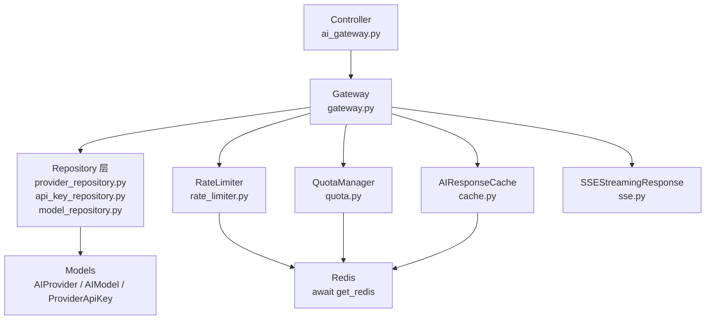

# 设计文档：AI 网关模块缺陷修复

## 概述

本设计文档覆盖 AI 网关模块的 31 项修复和改进。修复分为四个阶段：
1. 后端运行时错误和安全修复（需求 1-5）
2. 后端代码规范修复（需求 6-11）
3. 前端 UI 修复（需求 12-16）
4. UX 优化（需求 17-21）

所有修改遵循项目分层架构：Controller → Service → Repository → Model。

## 架构

修复不改变现有架构，仅在现有分层内进行修正：



关键修复点：
- `D`、`E` 节点：修复 `get_redis()` 缺失 `await`
- `B → C`：将 Gateway 中的直接 `select()` 查询迁移到 Repository
- `B → G`：修复 SSE 回调类型签名
- `B`：修复 `model_dump()` 和 `response.choices` 错误
- `B`：为 `stream_chat` 添加限流和配额检查

## 组件与接口

### 1. Redis await 修复（需求 1）

**涉及文件**：`rate_limiter.py`、`quota.py`

**修复方式**：将所有 `redis = get_redis()` 改为 `redis = await get_redis()`

参考 `cache.py` 中的正确模式：
```python
# cache.py（正确）
redis = await get_redis()

# rate_limiter.py（修复前）
redis = get_redis()  # BUG: 返回 coroutine 而非 Redis 客户端

# rate_limiter.py（修复后）
redis = await get_redis()
```

受影响方法：
- `RateLimiter.check_rate_limit()`
- `RateLimiter.record_request()`
- `RateLimiter.get_current_usage()`
- `UsageTracker.get_daily_usage()`
- `UsageTracker.get_monthly_usage()`
- `UsageTracker.record_usage()`

### 2. ChatMessage 序列化修复（需求 2）

**涉及文件**：`gateway.py`

`ChatMessage` 是 `@dataclass`，没有 `model_dump()` 方法。使用 `dataclasses.asdict()` 替代。

```python
import dataclasses

# 修复前
messages=[msg.model_dump() for msg in messages]

# 修复后
messages=[dataclasses.asdict(msg) for msg in messages]
```

受影响位置（`gateway.py` 中 3 处）：
1. 缓存键生成：`AIResponseCache._generate_cache_key(... messages=[msg.model_dump() ...])`
2. 配额估算：`TokenCounter.count_messages_tokens([msg.model_dump() ...])`
3. 请求数据构建：`"messages": [msg.model_dump() for msg in messages]`

### 3. test_model 响应属性修复（需求 3）

**涉及文件**：`gateway.py`

`ChatResponse` 是 `@dataclass`，有 `message` 属性（`ChatMessage` 类型），没有 `choices` 属性。

```python
# 修复前
if response.choices and len(response.choices) > 0:
    response_text = response.choices[0].message.content or ""

# 修复后
response_text = response.message.content or ""
```

### 4. SSE 回调类型签名修复（需求 4）

**涉及文件**：`sse.py`

```python
from typing import Awaitable

# 修复前
on_complete: Callable[[int, int, int], None] | None = None

# 修复后
on_complete: Callable[[int, int, int], Awaitable[None]] | None = None
```

### 5. stream_chat 安全检查（需求 5）

**涉及文件**：`gateway.py`

将 `stream_chat` 方法改为 `async def`，在 `generate_chunks()` 内部、创建适配器之前添加限流和配额检查：

```python
async def stream_chat(self, ...) -> StreamingResponse:
    # 获取供应商、API Key 和模型信息（提前到外层）
    provider, api_key = await self._get_provider_and_key(provider_code, tenant_id)
    ai_model = await self._get_model(model, provider.id)

    if not ai_model:
        raise NotFoundException(message=_("ai.error.model_not_found"))

    # 速率限制检查
    if tenant_id:
        await RateLimiter.check_rate_limit(
            tenant_id=tenant_id,
            model_id=ai_model.id,
            rpm_limit=ai_model.rpm_limit,
            tpm_limit=ai_model.tpm_limit,
        )
        # 配额检查
        estimated_input = TokenCounter.count_messages_tokens(
            [dataclasses.asdict(msg) for msg in messages]
        )
        await self.quota_manager.check_quota(
            tenant_id=tenant_id,
            model_id=ai_model.id,
            estimated_tokens=estimated_input,
        )

    async def generate_chunks() -> AsyncIterator[ChatChunk]:
        # ... 使用已获取的 provider, api_key, ai_model
        ...
```

### 6. 硬编码中文修复（需求 6）

**涉及文件**：`quota.py`、`ai_gateway.py`

```python
# quota.py 修复前
raise QuotaExceeded(f"配额超出: {current_usage + estimated_tokens}/{quota.limit} ({quota.period})")

# quota.py 修复后
raise QuotaExceeded(
    _("ai.error.quota_exceeded").format(
        current=current_usage + estimated_tokens,
        limit=quota.limit,
        period=quota.period
    )
)

# ai_gateway.py 修复前
tags = ["AI 网关"]

# ai_gateway.py 修复后
tags = [_("menu.admin.ai_gateway_api")]
```

### 7. 新增枚举类型（需求 7）

**涉及文件**：`backend/app/enums/ai.py`

```python
class QuotaTypeEnum(LabeledStrEnum):
    HARD = ("hard", "enum.ai_quota.type.hard")
    SOFT = ("soft", "enum.ai_quota.type.soft")

class QuotaPeriodEnum(LabeledStrEnum):
    DAILY = ("daily", "enum.ai_quota.period.daily")
    MONTHLY = ("monthly", "enum.ai_quota.period.monthly")

class UserTypeEnum(LabeledStrEnum):
    TENANT_ADMIN = ("tenant_admin", "enum.ai_user.type.tenant_admin")
```

使用位置：
- `quota.py`：`quota.quota_type == QuotaTypeEnum.HARD.value`
- `quota.py`：`period == QuotaPeriodEnum.DAILY.value`
- `gateway.py`：`user_type=UserTypeEnum.TENANT_ADMIN.value`

### 8. 模型 __sortable_fields__ 命名修复（需求 8）

**涉及文件**：`provider.py`、`api_key.py`

**研究发现**：`base_repository.py` 的 `get_sortable_fields()` 方法优先查找 `__sortable_fields__`，然后回退到 `__filterable__`。而 `__sortable__` 在 base_repository 中用于拖拽排序配置（`sort_order` 自动计算）。

其他 AI 模型（`AIModel`、`AICallLog`、`TenantQuota` 等）使用 `__sortable__` 作为可排序字段字典，这些模型能正常工作是因为 `get_sortable_fields()` 在找不到 `__sortable_fields__` 时回退到 `__filterable__`。

**决策**：为保持与其他 AI 模型一致，将 `AIProvider` 和 `ProviderApiKey` 的 `__sortable_fields__` 重命名为 `__sortable__`。`get_sortable_fields()` 方法也需要更新以优先检查 `__sortable__`（当它是 dict 且 key 为字符串字段名时），保持向后兼容。

实际上，更安全的做法是：仅将 `AIProvider` 和 `ProviderApiKey` 的属性名从 `__sortable_fields__` 改为 `__sortable__`，同时更新 `get_sortable_fields()` 方法使其也检查 `__sortable__`（当值为 dict 且不含 `"field"` key 时视为排序字段映射）。

```python
def get_sortable_fields(self) -> dict[str, InstrumentedAttribute]:
    # 优先使用 __sortable_fields__（向后兼容）
    sortable = getattr(self.model, "__sortable_fields__", None)
    
    if sortable is None:
        # 检查 __sortable__（如果是字段映射字典而非排序配置）
        sortable_attr = getattr(self.model, "__sortable__", None)
        if isinstance(sortable_attr, dict) and "field" not in sortable_attr:
            sortable = sortable_attr
    
    if sortable is None:
        sortable = getattr(self.model, "__filterable__", {})
    
    # ... 构建字段映射
```

### 9. Gateway 数据库查询迁移到 Repository（需求 9）

**涉及文件**：`gateway.py`、`provider_repository.py`、`api_key_repository.py`、`model_repository.py`

现有 Repository 已提供大部分所需方法：
- `AIProviderRepository.get_by_code()` → 替代 `_get_provider_and_key` 中的供应商查询
- `ProviderApiKeyRepository.get_available_key()` → 替代 API Key 查询
- `AIModelRepository` → 需新增 `get_by_name_and_provider()` 方法

Gateway 构造函数注入 Repository：

```python
class AIGateway:
    def __init__(self, db: AsyncSession):
        self.db = db
        self.metering = MeteringService(db)
        self.quota_manager = QuotaManager(db)
        self.provider_repo = AIProviderRepository(db)
        self.api_key_repo = ProviderApiKeyRepository(db)
        self.model_repo = AIModelRepository(db)
```

需要在 `AIModelRepository` 新增方法：

```python
async def get_active_by_name_and_provider(
    self, name: str, provider_id: int
) -> AIModel | None:
    stmt = select(AIModel).where(
        AIModel.provider_id == provider_id,
        AIModel.name == name,
        AIModel.is_active == True,
        AIModel.is_deleted == False,
    )
    result = await self.db.execute(stmt)
    return result.scalar_one_or_none()
```

需要在 `ProviderApiKeyRepository` 新增方法：

```python
async def get_next_available_key(
    self,
    provider_id: int,
    exclude_key_id: int,
    tenant_id: int | None = None,
) -> ProviderApiKey | None:
    """获取下一个可用 Key（排除当前 Key，用于重试轮换）"""
    ...
```

### 10. stream_chat 重试机制（需求 10）

**涉及文件**：`gateway.py`

在 `stream_chat` 的 `generate_chunks()` 内部包裹重试逻辑：

```python
async def generate_chunks() -> AsyncIterator[ChatChunk]:
    current_key = api_key
    for attempt in range(MAX_RETRIES + 1):
        try:
            adapter = AdapterRegistry.create_adapter(...)
            async for chunk in adapter.stream_chat(...):
                yield chunk
            return  # 成功完成
        except AIGatewayError as e:
            if not is_retryable(e) or attempt >= MAX_RETRIES:
                raise
            next_key = await self.api_key_repo.get_next_available_key(...)
            if next_key:
                current_key = next_key
            await asyncio.sleep(RETRY_BASE_DELAY * (RETRY_MULTIPLIER ** attempt))
```

### 11. 循环导入重构（需求 11）

**涉及文件**：`gateway.py`

将 `CallLogService` 作为构造函数参数注入，或在模块顶部导入：

```python
# 方案：在 __init__ 中延迟初始化
from app.services.ai.call_log_service import CallLogService

class AIGateway:
    def __init__(self, db: AsyncSession):
        ...
        self.call_log_service = CallLogService(db)
```

如果存在真正的循环依赖，保留函数内导入但添加注释说明原因。

### 12. 前端 i18n 修复（需求 12）

**涉及文件**：`usage/data.ts`

```typescript
// 修复前
{ label: 'Chat', value: 'chat' },

// 修复后
{ label: $t('admin.ai.usage.type_options.chat'), value: 'chat' },
```

### 13. Health API 提取（需求 13）

**涉及文件**：`api/admin/ai.ts`、`health/index.vue`

在 `api/admin/ai.ts` 新增：

```typescript
export interface HealthStatus {
  provider_id: number;
  provider_code: string;
  provider_name: string;
  is_healthy: boolean;
  is_available: boolean;
  response_time_ms: number;
  consecutive_failures: number;
  error_message: string | null;
  checked_at: string;
}

export async function getAIHealthStatusApi(
  options?: ApiRequestOptions,
): Promise<HealthStatus[]> {
  return requestClient.get<HealthStatus[]>('/admin/ai/health', options);
}
```

### 14. isActive 显示修复（需求 14）

**涉及文件**：`models/index.vue`

```vue
<!-- 修复前 -->
<Switch :checked="row.is_active" size="small" disabled />

<!-- 修复后 -->
<Tag :color="row.is_active ? 'success' : 'default'">
  {{ row.is_active ? $t('admin.common.enabled') : $t('admin.common.disabled') }}
</Tag>
```

### 15. Usage 页面显示名称（需求 15）

**涉及文件**：`usage/data.ts`

后端 API 需要返回关联名称字段（`tenant_name`、`model_name`）。前端列定义改为显示名称：

```typescript
{
  field: 'tenant_name',
  title: $t('admin.ai.usage.tenantName'),
  width: 140,
},
{
  field: 'model_name',
  title: $t('admin.ai.usage.modelName'),
  width: 140,
},
```

### 16. 补充 API 和表单字段（需求 16）

**涉及文件**：`api/admin/ai.ts`、`models/data.ts`

新增 toggle API：
```typescript
export async function toggleAIModelStatusApi(
  id: number,
  options?: ApiRequestOptions,
): Promise<AIModelInfo> {
  return requestClient.put<AIModelInfo>(`${MODEL_PREFIX}/${id}/status`, {}, options);
}
```

表单新增 RPM/TPM 字段：
```typescript
numberField('rpm_limit', $t('admin.ai.model.rpmLimit'), {
  min: 0,
  placeholder: $t('admin.ai.model.placeholder.inputRpmLimit'),
}),
numberField('tpm_limit', $t('admin.ai.model.tpmLimit'), {
  min: 0,
  placeholder: $t('admin.ai.model.placeholder.inputTpmLimit'),
}),
```

价格列添加单位：
```typescript
{
  field: 'input_price_per_1k',
  title: $t('admin.ai.model.inputPrice') + ' ($/1K)',
  ...
}
```

### 17-21. UX 优化组件

#### 使用量汇总卡片（需求 17）
在 usage 页面表格上方添加统计卡片组件和日期范围筛选器。

#### 调用日志详情抽屉（需求 18）
新增 `CallLogDetail` 抽屉组件，展示请求/响应 JSON。

#### 模型测试按钮（需求 19）
在模型列表操作列添加"测试"按钮，调用 `/admin/ai/gateway/test` API。

#### 配额管理页面（需求 20）
新增完整 CRUD 页面：`views/admin/ai/quotas/`，包含 `data.ts`、`index.vue`、`modules/form.vue`。

#### 调用日志导出（需求 21）
在调用日志页面工具栏添加导出按钮，调用后端导出 API 或前端生成 CSV。

## 数据模型

本次修复不新增数据库表。涉及的模型修改：

### AIProvider 模型修改
```python
# 属性重命名
__sortable_fields__ → __sortable__
```

### ProviderApiKey 模型修改
```python
# 属性重命名
__sortable_fields__ → __sortable__
```

### 新增枚举（不影响数据库）
```python
# backend/app/enums/ai.py
QuotaTypeEnum: HARD, SOFT
QuotaPeriodEnum: DAILY, MONTHLY
UserTypeEnum: TENANT_ADMIN
```

### AIModelRepository 新增方法
```python
async def get_active_by_name_and_provider(self, name: str, provider_id: int) -> AIModel | None
```

### ProviderApiKeyRepository 新增方法
```python
async def get_next_available_key(self, provider_id: int, exclude_key_id: int, tenant_id: int | None) -> ProviderApiKey | None
```


## 正确性属性

*属性是系统在所有有效执行中应保持为真的特征或行为——本质上是关于系统应该做什么的形式化陈述。属性作为人类可读规范和机器可验证正确性保证之间的桥梁。*

### Property 1: ChatMessage 序列化一致性
*For any* valid ChatMessage dataclass instance with arbitrary role, content, name, tool_calls, and tool_call_id values, calling `dataclasses.asdict()` on it SHALL produce a dictionary containing all fields with their original values, and reconstructing a ChatMessage from that dictionary SHALL produce an equivalent object.
**Validates: Requirements 2.1, 2.2, 2.3**

### Property 2: stream_chat 速率限制强制执行
*For any* tenant that has reached their RPM or TPM limit, calling `stream_chat` SHALL raise `RateLimitExceeded` before yielding any chunks.
**Validates: Requirements 5.1, 5.3**

### Property 3: stream_chat 配额强制执行
*For any* tenant that has exceeded their quota limit, calling `stream_chat` SHALL raise `QuotaExceeded` before yielding any chunks.
**Validates: Requirements 5.2, 5.4**

### Property 4: stream_chat 重试与 Key 轮换
*For any* retryable error during streaming, the system SHALL retry up to MAX_RETRIES times with exponential backoff, and on each retry SHALL attempt to switch to a different available API Key.
**Validates: Requirements 10.1, 10.2**

### Property 5: 调用日志 CSV 导出有效性
*For any* non-empty set of call log records, the export function SHALL produce a valid CSV string where the number of data rows equals the number of input records and each row contains all required fields.
**Validates: Requirements 21.1**

## 错误处理

### 现有错误处理（保持不变）
- `RateLimitExceeded`：速率限制超出，返回 429
- `QuotaExceeded`：配额超出，返回 422
- `NotFoundException`：资源不存在，返回 404
- `BusinessException`：业务异常，返回 422
- `AIGatewayError` 及子类：AI 调用异常，含重试逻辑

### 修复后的错误处理改进
1. `stream_chat` 现在会在流开始前抛出 `RateLimitExceeded` 和 `QuotaExceeded`，而非静默绕过
2. `QuotaExceeded` 异常消息从硬编码中文改为 i18n 格式
3. `test_model` 不再因 `AttributeError`（`response.choices`）而失败
4. Redis 调用不再因缺失 `await` 而返回 coroutine 对象导致后续操作失败

## 测试策略

### 测试框架
- 后端：`pytest` + `pytest-asyncio`
- 属性测试：`hypothesis`（Python property-based testing 库）
- 前端：`vitest`（如项目已配置）

### 单元测试
针对具体示例和边界情况：
- Redis await 修复：mock `get_redis()` 验证返回 Redis 客户端而非 coroutine
- `test_model` 修复：构造 `ChatResponse` 验证正确提取 `message.content`
- 枚举值验证：验证新枚举包含预期值
- Repository 方法：验证新增的 `get_active_by_name_and_provider` 和 `get_next_available_key` 方法

### 属性测试
每个属性测试最少运行 100 次迭代：

1. **Feature: ai-gateway-fixes, Property 1: ChatMessage serialization round-trip**
   - 生成随机 ChatMessage 实例，验证 asdict → 重建的一致性

2. **Feature: ai-gateway-fixes, Property 2: stream_chat rate limit enforcement**
   - 生成随机租户/模型/限制组合，验证超限时抛出异常

3. **Feature: ai-gateway-fixes, Property 3: stream_chat quota enforcement**
   - 生成随机租户/模型/配额组合，验证超额时抛出异常

4. **Feature: ai-gateway-fixes, Property 4: stream_chat retry with key rotation**
   - 生成随机重试场景，验证重试次数和 Key 轮换行为

5. **Feature: ai-gateway-fixes, Property 5: CSV export validity**
   - 生成随机调用日志记录集，验证 CSV 输出格式正确性

### 测试互补性
- 单元测试覆盖具体的 bug 修复验证（await、属性访问、类型签名）
- 属性测试覆盖通用行为正确性（序列化、限流、重试）
- 两者结合确保修复的完整性和回归安全性
