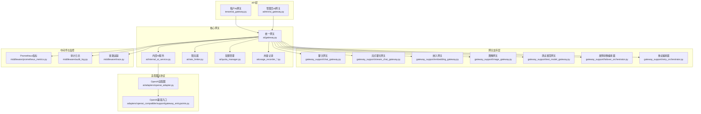
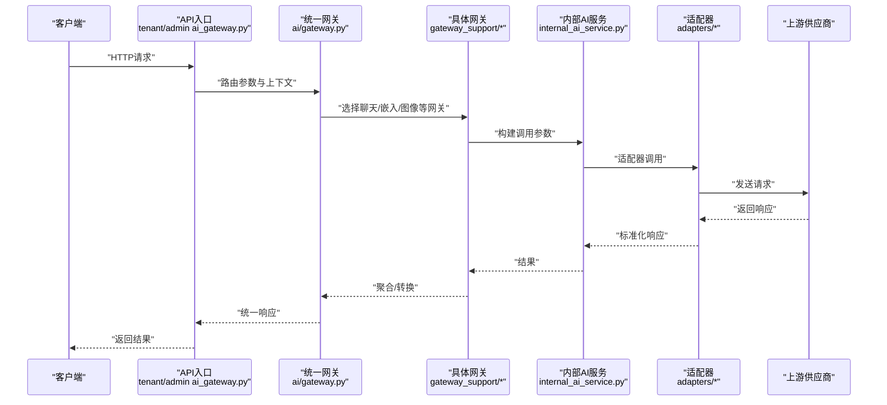
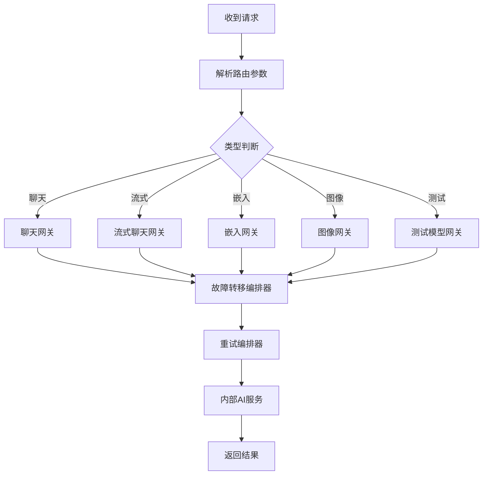
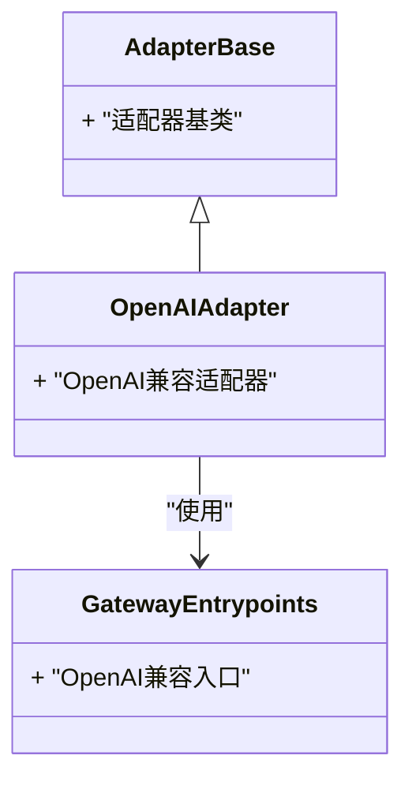
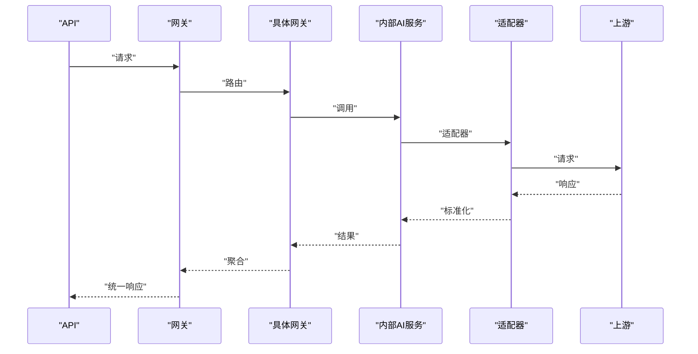
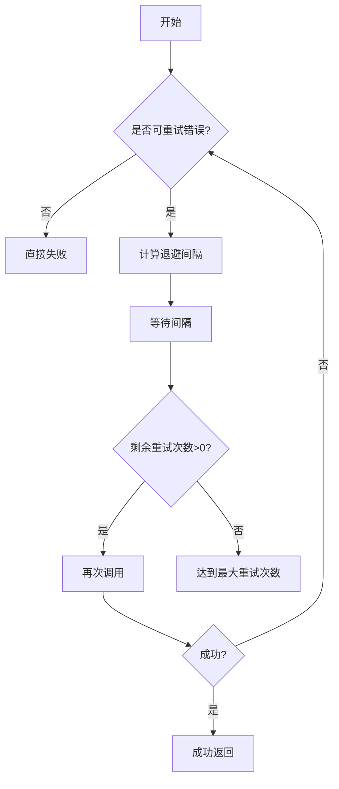
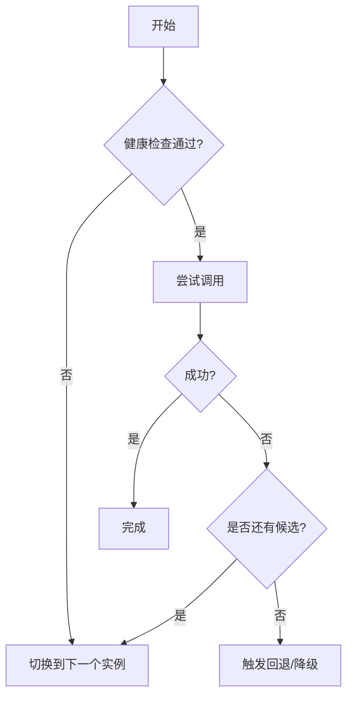
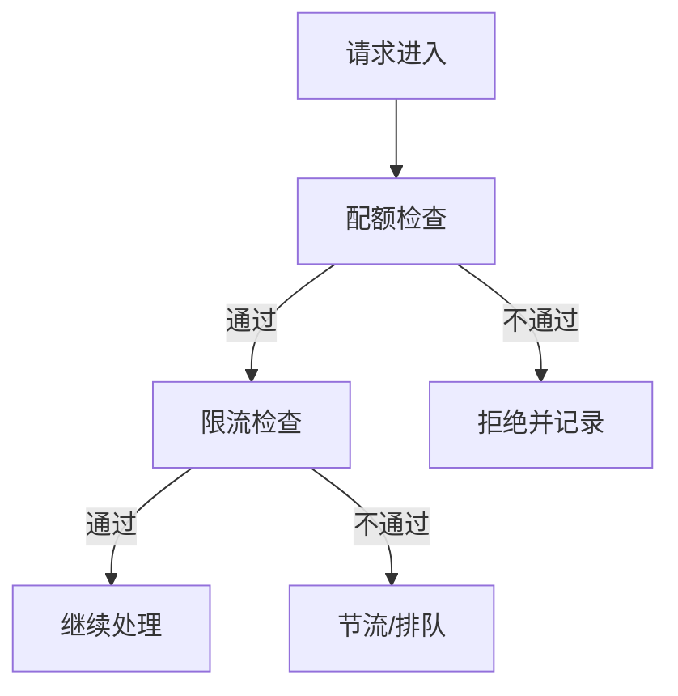
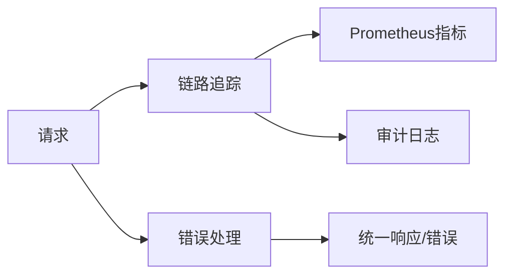
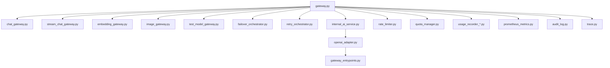

# AI网关系统

<cite>
**本文引用的文件**
- [gateway.py](file://backend/app/ai/gateway.py)
- [failover.py](file://backend/app/ai/failover.py)
- [retry_service.py](file://backend/app/ai/retry_service.py)
- [internal_ai_service.py](file://backend/app/ai/internal_ai_service.py)
- [chat_gateway.py](file://backend/app/ai/gateway_support/chat_gateway.py)
- [stream_chat_gateway.py](file://backend/app/ai/gateway_support/stream_chat_gateway.py)
- [embedding_gateway.py](file://backend/app/ai/gateway_support/embedding_gateway.py)
- [image_gateway.py](file://backend/app/ai/gateway_support/image_gateway.py)
- [test_model_gateway.py](file://backend/app/ai/gateway_support/test_model_gateway.py)
- [ai_gateway.py（租户）](file://backend/app/api/tenant/ai_gateway.py)
- [ai_gateway.py（管理员）](file://backend/app/api/admin/ai_gateway.py)
- [gateway.py（模式定义）](file://backend/app/schemas/ai/gateway.py)
- [openai_adapter.py](file://backend/app/ai/adapters/openai_adapter.py)
- [gateway_entrypoints.py（OpenAI兼容）](file://backend/app/ai/adapters/openai_compatible/support/gateway_entrypoints.py)
- [failover_orchestrator.py](file://backend/app/ai/gateway_support/failover_orchestrator.py)
- [retry_orchestrator.py](file://backend/app/ai/gateway_support/retry_orchestrator.py)
- [tool_contract_retry_policies.py](file://backend/app/ai/engine/tool_contract_retry_policies.py)
- [tool_contract_retry_helpers.py](file://backend/app/ai/engine/tool_contract_retry_helpers.py)
- [rate_limiter.py](file://backend/app/ai/rate_limiter.py)
- [quota_manager.py](file://backend/app/ai/quota_manager.py)
- [quota_usage_tracker.py](file://backend/app/ai/quota_usage_tracker.py)
- [agent_quota_manager.py](file://backend/app/ai/agent_quota_manager.py)
- [usage_recorder_core.py](file://backend/app/ai/usage_recorder_core.py)
- [usage_recorder_context.py](file://backend/app/ai/usage_recorder_context.py)
- [usage_recorder_support.py](file://backend/app/ai/usage_recorder_support.py)
- [prometheus_metrics.py](file://backend/app/middleware/prometheus_metrics.py)
- [audit_log.py](file://backend/app/middleware/audit_log.py)
- [trace.py](file://backend/app/middleware/trace.py)
- [constants.py](file://backend/app/ai/constants.py)
- [types.py](file://backend/app/ai/types.py)
- [exceptions.py](file://backend/app/ai/exceptions.py)
- [text_semantics.py](file://backend/app/ai/text_semantics.py)
- [text_semantics_tokens.py](file://backend/app/ai/text_semantics_tokens.py)
- [text_semantics_urls.py](file://backend/app/ai/text_semantics_urls.py)
- [text_semantics_json.py](file://backend/app/ai/text_semantics_json.py)
- [text_semantics_terms.py](file://backend/app/ai/text_semantics_terms.py)
- [sse.py](file://backend/app/ai/sse.py)
- [cache.py](file://backend/app/ai/cache.py)
- [memory_policy.py](file://backend/app/ai/memory_policy.py)
- [page_locale.py](file://backend/app/ai/page_locale.py)
- [json_safe.py](file://backend/app/ai/json_safe.py)
</cite>

## 目录
1. [简介](#简介)
2. [项目结构](#项目结构)
3. [核心组件](#核心组件)
4. [架构总览](#架构总览)
5. [详细组件分析](#详细组件分析)
6. [依赖关系分析](#依赖关系分析)
7. [性能考量](#性能考量)
8. [故障排查指南](#故障排查指南)
9. [结论](#结论)
10. [附录](#附录)

## 简介
本技术文档面向AI网关系统，系统性阐述其核心架构设计、统一调用接口实现与多供应商适配器管理机制；详细说明请求路由策略、负载均衡与故障转移；文档化内部AI服务的实现原理、调用链路管理与性能优化策略；涵盖重试服务的设计模式、指数退避算法与熔断机制；解释监控指标、日志记录与错误处理策略，并提供配置选项、安全策略与最佳实践指导。

## 项目结构
后端采用分层+功能域划分的组织方式：AI领域核心位于 backend/app/ai 下，包含适配器、引擎、路由、配额与限流、重试与熔断、内部AI服务等模块；API入口位于 backend/app/api 下，分别暴露给租户与管理员；中间件提供Prometheus指标、审计日志与链路追踪能力；测试覆盖适配器协议安全入口点、网关故障转移要求与平台日志等场景。

图表来源
- [ai_gateway.py（租户）](file://backend/app/api/tenant/ai_gateway.py)
- [ai_gateway.py（管理员）](file://backend/app/api/admin/ai_gateway.py)
- [gateway.py](file://backend/app/ai/gateway.py)
- [chat_gateway.py](file://backend/app/ai/gateway_support/chat_gateway.py)
- [stream_chat_gateway.py](file://backend/app/ai/gateway_support/stream_chat_gateway.py)
- [embedding_gateway.py](file://backend/app/ai/gateway_support/embedding_gateway.py)
- [image_gateway.py](file://backend/app/ai/gateway_support/image_gateway.py)
- [test_model_gateway.py](file://backend/app/ai/gateway_support/test_model_gateway.py)
- [failover_orchestrator.py](file://backend/app/ai/gateway_support/failover_orchestrator.py)
- [retry_orchestrator.py](file://backend/app/ai/gateway_support/retry_orchestrator.py)
- [internal_ai_service.py](file://backend/app/ai/internal_ai_service.py)
- [openai_adapter.py](file://backend/app/ai/adapters/openai_adapter.py)
- [gateway_entrypoints.py（OpenAI兼容）](file://backend/app/ai/adapters/openai_compatible/support/gateway_entrypoints.py)
- [rate_limiter.py](file://backend/app/ai/rate_limiter.py)
- [quota_manager.py](file://backend/app/ai/quota_manager.py)
- [usage_recorder_core.py](file://backend/app/ai/usage_recorder_core.py)
- [prometheus_metrics.py](file://backend/app/middleware/prometheus_metrics.py)
- [audit_log.py](file://backend/app/middleware/audit_log.py)
- [trace.py](file://backend/app/middleware/trace.py)

章节来源
- [gateway.py](file://backend/app/ai/gateway.py)
- [ai_gateway.py（租户）](file://backend/app/api/tenant/ai_gateway.py)
- [ai_gateway.py（管理员）](file://backend/app/api/admin/ai_gateway.py)

## 核心组件
- 统一网关入口：负责路由到具体网关（聊天/流式/嵌入/图像/测试），并协调故障转移与重试编排器、内部AI服务、限流与配额。
- 多供应商适配器：以OpenAI兼容适配器为核心，抽象不同供应商的调用差异，提供统一协议入口。
- 内部AI服务：封装对上游模型服务的调用，承载重试、熔断、超时与回退策略。
- 故障转移与重试：在单次调用失败时进行自动切换与指数退避重试，避免雪崩。
- 配额与限流：基于租户/代理维度进行并发与速率控制，保障资源公平与稳定性。
- 监控与可观测性：Prometheus指标、审计日志与链路追踪贯穿请求生命周期。

章节来源
- [gateway.py](file://backend/app/ai/gateway.py)
- [internal_ai_service.py](file://backend/app/ai/internal_ai_service.py)
- [retry_service.py](file://backend/app/ai/retry_service.py)
- [failover.py](file://backend/app/ai/failover.py)
- [quota_manager.py](file://backend/app/ai/quota_manager.py)
- [rate_limiter.py](file://backend/app/ai/rate_limiter.py)

## 架构总览
AI网关通过API层接收请求，统一进入网关核心，依据请求类型与目标模型选择对应网关子模块；内部AI服务负责实际调用上游供应商；故障转移与重试编排器在异常时介入；配额与限流确保资源安全；中间件提供监控与审计。

图表来源
- [ai_gateway.py（租户）](file://backend/app/api/tenant/ai_gateway.py)
- [ai_gateway.py（管理员）](file://backend/app/api/admin/ai_gateway.py)
- [gateway.py](file://backend/app/ai/gateway.py)
- [chat_gateway.py](file://backend/app/ai/gateway_support/chat_gateway.py)
- [internal_ai_service.py](file://backend/app/ai/internal_ai_service.py)
- [openai_adapter.py](file://backend/app/ai/adapters/openai_adapter.py)

## 详细组件分析

### 统一网关与路由策略
- 路由决策：根据请求体中的模型类型、能力标识与目标供应商，选择对应的网关子模块（聊天/流式/嵌入/图像/测试）。
- 上下文注入：将租户、用户、会话、追踪ID等上下文传递至后续处理链。
- 负载均衡：在多供应商可用时，按权重/健康状态/延迟等策略选择最优实例。
- 故障转移：当某供应商不可用或超时时，自动切换至备选供应商，直至成功或穷尽候选列表。

图表来源
- [gateway.py](file://backend/app/ai/gateway.py)
- [chat_gateway.py](file://backend/app/ai/gateway_support/chat_gateway.py)
- [stream_chat_gateway.py](file://backend/app/ai/gateway_support/stream_chat_gateway.py)
- [embedding_gateway.py](file://backend/app/ai/gateway_support/embedding_gateway.py)
- [image_gateway.py](file://backend/app/ai/gateway_support/image_gateway.py)
- [test_model_gateway.py](file://backend/app/ai/gateway_support/test_model_gateway.py)
- [failover_orchestrator.py](file://backend/app/ai/gateway_support/failover_orchestrator.py)
- [retry_orchestrator.py](file://backend/app/ai/gateway_support/retry_orchestrator.py)
- [internal_ai_service.py](file://backend/app/ai/internal_ai_service.py)

章节来源
- [gateway.py](file://backend/app/ai/gateway.py)
- [failover_orchestrator.py](file://backend/app/ai/gateway_support/failover_orchestrator.py)
- [retry_orchestrator.py](file://backend/app/ai/gateway_support/retry_orchestrator.py)

### 多供应商适配器管理机制
- OpenAI兼容适配器：提供统一的请求/响应格式，屏蔽不同供应商的差异。
- 协议入口：OpenAI兼容入口负责参数映射、头部处理与错误码转换。
- 扩展性：新增供应商只需实现适配器接口并注册到路由表，即可无缝接入。

图表来源
- [openai_adapter.py](file://backend/app/ai/adapters/openai_adapter.py)
- [gateway_entrypoints.py（OpenAI兼容）](file://backend/app/ai/adapters/openai_compatible/support/gateway_entrypoints.py)

章节来源
- [openai_adapter.py](file://backend/app/ai/adapters/openai_adapter.py)
- [gateway_entrypoints.py（OpenAI兼容）](file://backend/app/ai/adapters/openai_compatible/support/gateway_entrypoints.py)

### 内部AI服务与调用链路管理
- 调用链路：API -> 网关 -> 具体网关 -> 内部AI服务 -> 适配器 -> 上游供应商。
- 参数校验与预处理：对输入参数进行合法性检查、语义分析与规范化。
- 响应聚合：将上游多轮对话或批量结果聚合为统一输出。
- 异常传播：在各环节捕获异常并向上抛出，便于上层重试/熔断/降级。

图表来源
- [gateway.py](file://backend/app/ai/gateway.py)
- [chat_gateway.py](file://backend/app/ai/gateway_support/chat_gateway.py)
- [internal_ai_service.py](file://backend/app/ai/internal_ai_service.py)
- [openai_adapter.py](file://backend/app/ai/adapters/openai_adapter.py)

章节来源
- [internal_ai_service.py](file://backend/app/ai/internal_ai_service.py)
- [chat_gateway.py](file://backend/app/ai/gateway_support/chat_gateway.py)

### 重试服务与指数退避
- 设计模式：重试编排器封装重试策略，内部AI服务在异常时触发。
- 指数退避：每次重试间隔按指数增长，最大重试次数与上限时间可配置。
- 条件判定：仅对可重试错误（如网络超时、临时性5xx）执行重试。
- 与熔断协同：若连续失败超过阈值，触发熔断，停止重试并快速失败。

图表来源
- [retry_orchestrator.py](file://backend/app/ai/gateway_support/retry_orchestrator.py)
- [retry_service.py](file://backend/app/ai/retry_service.py)
- [tool_contract_retry_policies.py](file://backend/app/ai/engine/tool_contract_retry_policies.py)
- [tool_contract_retry_helpers.py](file://backend/app/ai/engine/tool_contract_retry_helpers.py)

章节来源
- [retry_orchestrator.py](file://backend/app/ai/gateway_support/retry_orchestrator.py)
- [retry_service.py](file://backend/app/ai/retry_service.py)
- [tool_contract_retry_policies.py](file://backend/app/ai/engine/tool_contract_retry_policies.py)
- [tool_contract_retry_helpers.py](file://backend/app/ai/engine/tool_contract_retry_helpers.py)

### 故障转移机制
- 触发条件：超时、非幂等失败、特定错误码或上游健康检查失败。
- 切换策略：按权重/延迟/可用性排序选择下一个供应商实例。
- 回退策略：所有实例均失败时，返回兜底错误或降级响应。
- 编排器职责：统一管理候选列表、失败计数与切换逻辑。

图表来源
- [failover.py](file://backend/app/ai/failover.py)
- [failover_orchestrator.py](file://backend/app/ai/gateway_support/failover_orchestrator.py)

章节来源
- [failover.py](file://backend/app/ai/failover.py)
- [failover_orchestrator.py](file://backend/app/ai/gateway_support/failover_orchestrator.py)

### 配额与限流
- 并发配额：限制每个租户/代理同时进行的请求数，防止过载。
- 速率限制：基于令牌桶/滑动窗口等算法控制单位时间内的请求量。
- 用量记录：记录调用次数、耗时、费用等指标，用于计费与审计。
- 额度不足：当配额不足时，返回明确的错误信息并可引导用户升级。

图表来源
- [quota_manager.py](file://backend/app/ai/quota_manager.py)
- [agent_quota_manager.py](file://backend/app/ai/agent_quota_manager.py)
- [rate_limiter.py](file://backend/app/ai/rate_limiter.py)
- [usage_recorder_core.py](file://backend/app/ai/usage_recorder_core.py)
- [usage_recorder_context.py](file://backend/app/ai/usage_recorder_context.py)
- [usage_recorder_support.py](file://backend/app/ai/usage_recorder_support.py)

章节来源
- [quota_manager.py](file://backend/app/ai/quota_manager.py)
- [agent_quota_manager.py](file://backend/app/ai/agent_quota_manager.py)
- [rate_limiter.py](file://backend/app/ai/rate_limiter.py)
- [usage_recorder_core.py](file://backend/app/ai/usage_recorder_core.py)
- [usage_recorder_context.py](file://backend/app/ai/usage_recorder_context.py)
- [usage_recorder_support.py](file://backend/app/ai/usage_recorder_support.py)

### 监控、日志与错误处理
- 指标采集：Prometheus中间件统计请求总量、成功率、延迟分布、错误码分布。
- 审计日志：记录关键操作与异常事件，支持合规与溯源。
- 链路追踪：Trace中间件注入/透传Trace ID，串联API、网关、内部服务与上游调用。
- 错误处理：统一异常分类与包装，保证对外一致的错误格式与可诊断信息。

图表来源
- [prometheus_metrics.py](file://backend/app/middleware/prometheus_metrics.py)
- [audit_log.py](file://backend/app/middleware/audit_log.py)
- [trace.py](file://backend/app/middleware/trace.py)
- [exceptions.py](file://backend/app/ai/exceptions.py)

章节来源
- [prometheus_metrics.py](file://backend/app/middleware/prometheus_metrics.py)
- [audit_log.py](file://backend/app/middleware/audit_log.py)
- [trace.py](file://backend/app/middleware/trace.py)
- [exceptions.py](file://backend/app/ai/exceptions.py)

## 依赖关系分析
- 网关核心依赖于具体网关子模块、故障转移与重试编排器、内部AI服务、限流与配额模块。
- 内部AI服务依赖适配器与供应商SDK，适配器依赖协议入口与供应商API。
- 中间件与监控解耦于业务逻辑，通过装饰器/拦截器接入。

图表来源
- [gateway.py](file://backend/app/ai/gateway.py)
- [chat_gateway.py](file://backend/app/ai/gateway_support/chat_gateway.py)
- [stream_chat_gateway.py](file://backend/app/ai/gateway_support/stream_chat_gateway.py)
- [embedding_gateway.py](file://backend/app/ai/gateway_support/embedding_gateway.py)
- [image_gateway.py](file://backend/app/ai/gateway_support/image_gateway.py)
- [test_model_gateway.py](file://backend/app/ai/gateway_support/test_model_gateway.py)
- [failover_orchestrator.py](file://backend/app/ai/gateway_support/failover_orchestrator.py)
- [retry_orchestrator.py](file://backend/app/ai/gateway_support/retry_orchestrator.py)
- [internal_ai_service.py](file://backend/app/ai/internal_ai_service.py)
- [openai_adapter.py](file://backend/app/ai/adapters/openai_adapter.py)
- [gateway_entrypoints.py（OpenAI兼容）](file://backend/app/ai/adapters/openai_compatible/support/gateway_entrypoints.py)
- [rate_limiter.py](file://backend/app/ai/rate_limiter.py)
- [quota_manager.py](file://backend/app/ai/quota_manager.py)
- [usage_recorder_core.py](file://backend/app/ai/usage_recorder_core.py)
- [prometheus_metrics.py](file://backend/app/middleware/prometheus_metrics.py)
- [audit_log.py](file://backend/app/middleware/audit_log.py)
- [trace.py](file://backend/app/middleware/trace.py)

章节来源
- [gateway.py](file://backend/app/ai/gateway.py)

## 性能考量
- 连接池与复用：内部AI服务与适配器应启用连接池与长连接，减少握手开销。
- 超时与背压：合理设置读写超时与队列长度，避免请求堆积导致级联阻塞。
- 缓存策略：对热点查询与嵌入向量进行缓存，降低重复调用成本。
- 流式传输：优先使用SSE/流式响应，缩短首字节时间，提升用户体验。
- 指标驱动：通过Prometheus指标识别瓶颈（延迟、错误率、队列长度），持续优化。

## 故障排查指南
- 快速定位：通过链路追踪ID关联API、网关、内部服务与上游调用日志。
- 常见问题：
  - 超时：检查上游健康状态、网络连通性与重试策略。
  - 频繁失败：确认故障转移候选列表与切换阈值。
  - 配额不足：核对租户/代理配额与用量记录。
  - 错误码异常：检查适配器错误码映射与协议入口转换。
- 日志建议：在关键节点打印请求摘要、响应状态与耗时，便于回放与复现。

章节来源
- [trace.py](file://backend/app/middleware/trace.py)
- [audit_log.py](file://backend/app/middleware/audit_log.py)
- [prometheus_metrics.py](file://backend/app/middleware/prometheus_metrics.py)
- [exceptions.py](file://backend/app/ai/exceptions.py)

## 结论
AI网关系统通过统一网关与多供应商适配器实现了高内聚、低耦合的架构；结合故障转移、重试与熔断机制，显著提升了系统的韧性；配额与限流保障了资源公平与稳定；中间件提供了完善的监控与审计能力。整体设计兼顾易扩展与高性能，适合在复杂多供应商环境下运行。

## 附录
- 配置选项与安全策略：建议在部署时开启TLS、最小权限访问、IP白名单与速率限制；对敏感参数进行脱敏记录。
- 最佳实践：
  - 明确错误分类与重试边界，避免无意义的重试风暴。
  - 使用流式响应与缓存策略优化用户体验与成本。
  - 定期审查配额与限流策略，结合业务增长动态调整。
  - 在生产环境启用全面的监控与告警，建立故障演练机制。