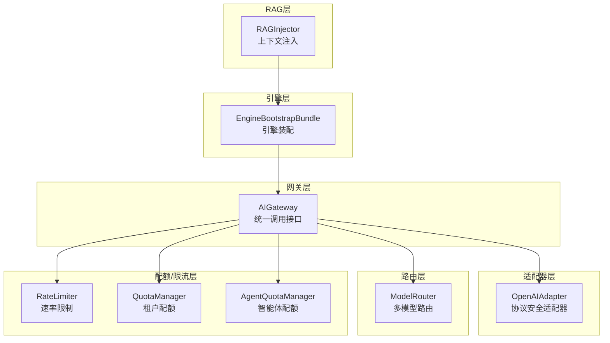
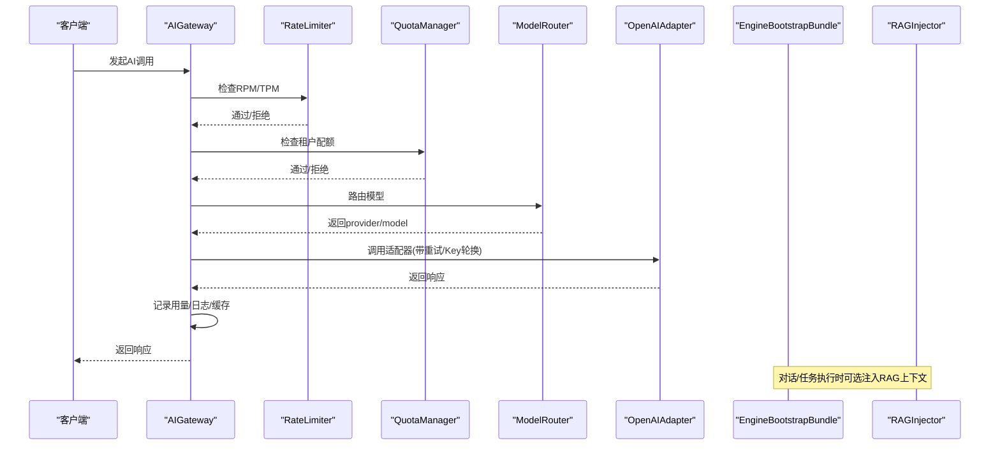
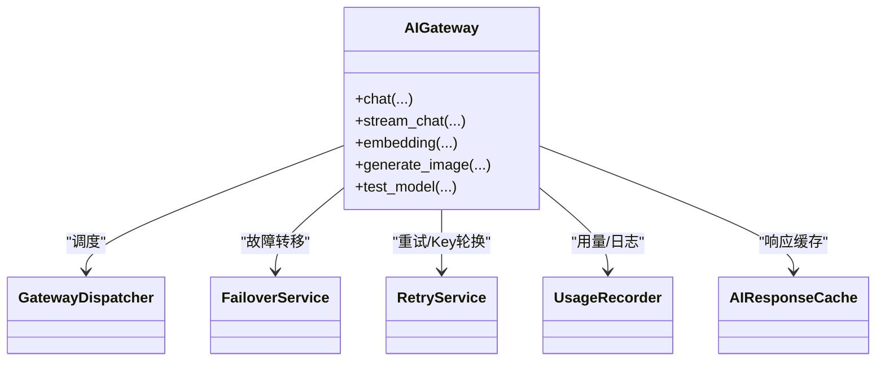
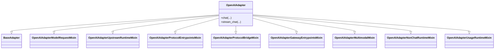
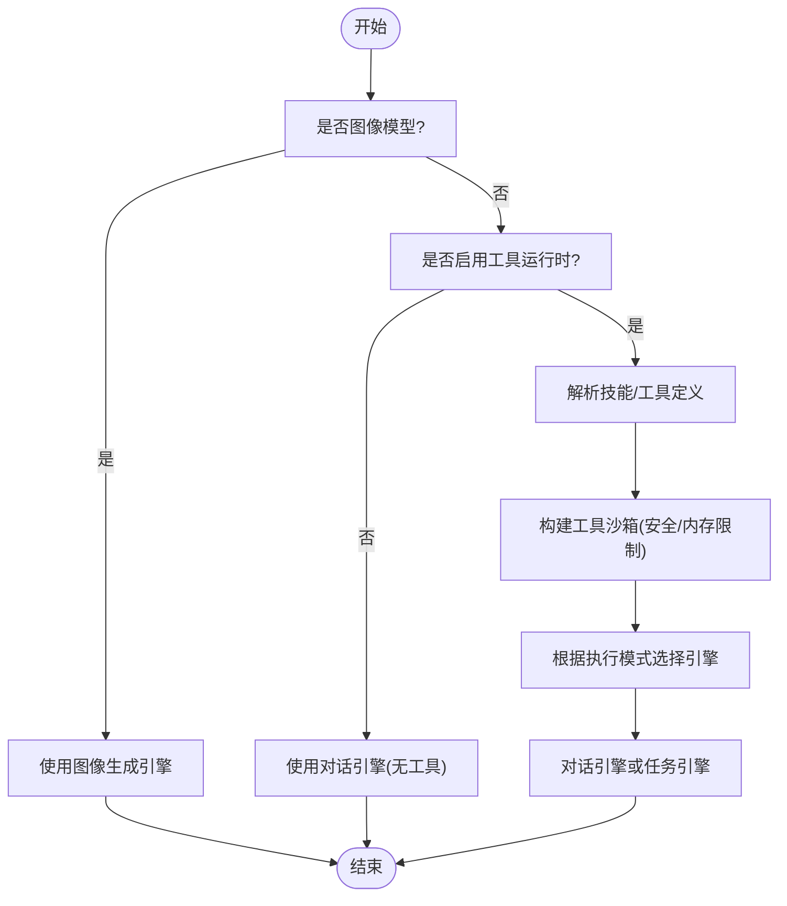
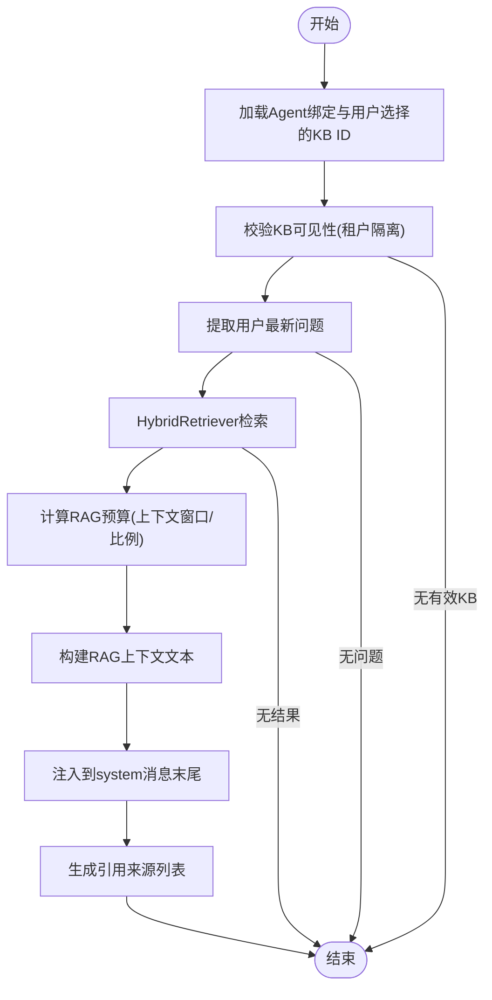
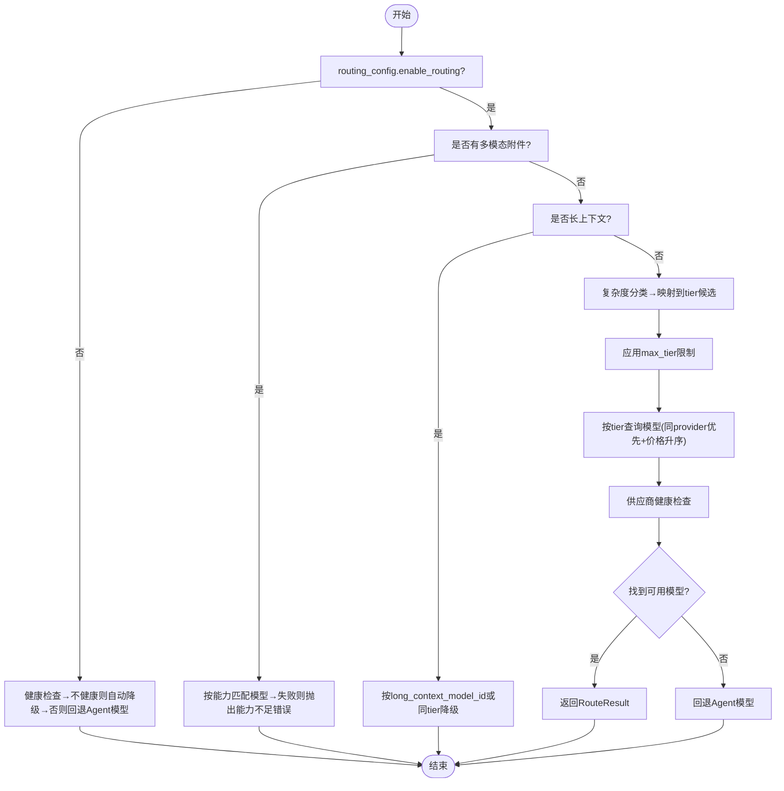
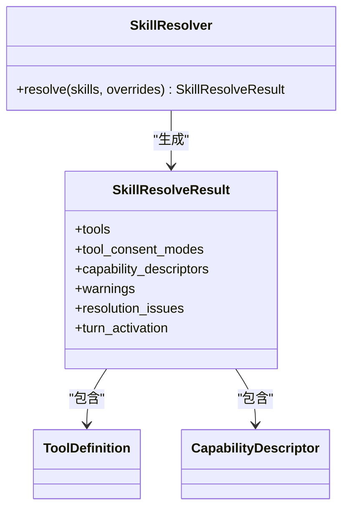
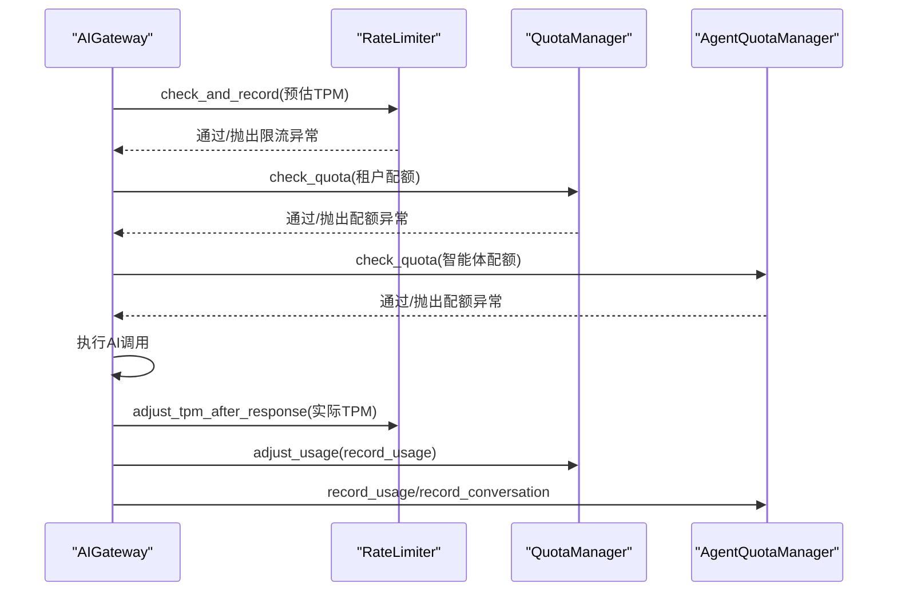
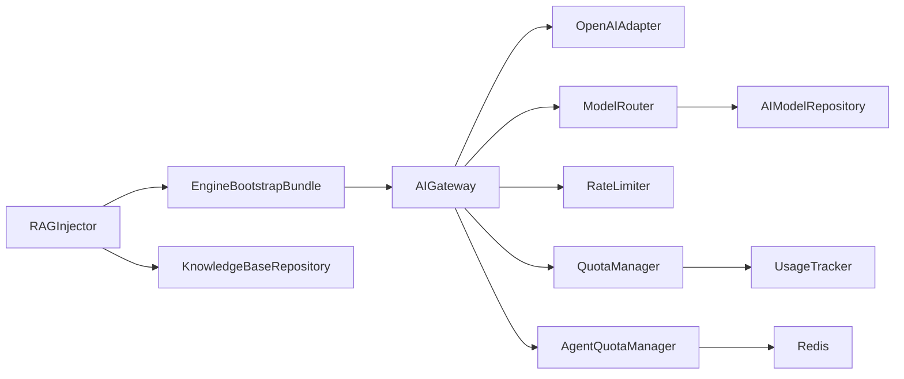

# AI能力系统

<cite>
**本文档引用的文件**
- [gateway.py](file://backend/app/ai/gateway.py)
- [openai_adapter.py](file://backend/app/ai/adapters/openai_adapter.py)
- [engine_bootstrap_support.py](file://backend/app/ai/engine/engine_bootstrap_support.py)
- [rag_injector.py](file://backend/app/ai/rag_injector.py)
- [router.py](file://backend/app/ai/routing/router.py)
- [resolver.py](file://backend/app/ai/skills/resolver.py)
- [agent_quota_manager.py](file://backend/app/ai/agent_quota_manager.py)
- [quota_manager.py](file://backend/app/ai/quota_manager.py)
- [rate_limiter.py](file://backend/app/ai/rate_limiter.py)
</cite>

## 目录
1. [简介](#简介)
2. [项目结构](#项目结构)
3. [核心组件](#核心组件)
4. [架构总览](#架构总览)
5. [详细组件分析](#详细组件分析)
6. [依赖关系分析](#依赖关系分析)
7. [性能考虑](#性能考虑)
8. [故障排查指南](#故障排查指南)
9. [结论](#结论)
10. [附录](#附录)

## 简介
本技术文档面向AI能力系统，系统性阐述以下主题：
- AI网关设计与统一调用接口
- 适配器注册机制与协议安全
- 执行引擎架构与工具系统
- RAG知识库集成与检索增强生成
- 智能体管理与多模型路由策略
- 成本优化与配额/限流/用量统计
- 工具调用安全策略、参数校验与错误处理
- 性能监控与最佳实践

## 项目结构
AI能力系统主要位于 backend/app/ai 目录，围绕“网关-适配器-路由-引擎-工具/RAG-配额/限流”形成清晰分层：
- 网关层：统一入口，负责缓存、限流、配额、重试、日志与用量记录
- 适配器层：对不同AI供应商协议进行抽象与桥接
- 路由层：根据请求特征选择最优模型
- 引擎层：对话/任务/图像生成执行引擎，支持工具沙箱与技能解析
- RAG层：知识库检索与上下文注入
- 配额/限流层：租户级配额与速率限制

图表来源
- [gateway.py:59-401](file://backend/app/ai/gateway.py#L59-L401)
- [openai_adapter.py:36-149](file://backend/app/ai/adapters/openai_adapter.py#L36-L149)
- [router.py:86-451](file://backend/app/ai/routing/router.py#L86-L451)
- [engine_bootstrap_support.py:150-242](file://backend/app/ai/engine/engine_bootstrap_support.py#L150-L242)
- [rag_injector.py:127-310](file://backend/app/ai/rag_injector.py#L127-L310)
- [rate_limiter.py:41-356](file://backend/app/ai/rate_limiter.py#L41-L356)
- [quota_manager.py:22-308](file://backend/app/ai/quota_manager.py#L22-L308)
- [agent_quota_manager.py:45-307](file://backend/app/ai/agent_quota_manager.py#L45-L307)

章节来源
- [gateway.py:1-407](file://backend/app/ai/gateway.py#L1-L407)
- [openai_adapter.py:1-150](file://backend/app/ai/adapters/openai_adapter.py#L1-L150)
- [router.py:1-452](file://backend/app/ai/routing/router.py#L1-L452)
- [engine_bootstrap_support.py:1-252](file://backend/app/ai/engine/engine_bootstrap_support.py#L1-L252)
- [rag_injector.py:1-313](file://backend/app/ai/rag_injector.py#L1-L313)
- [rate_limiter.py:1-357](file://backend/app/ai/rate_limiter.py#L1-L357)
- [quota_manager.py:1-309](file://backend/app/ai/quota_manager.py#L1-L309)
- [agent_quota_manager.py:1-308](file://backend/app/ai/agent_quota_manager.py#L1-L308)

## 核心组件
- AIGateway：统一AI调用门面，封装缓存、限流、配额、重试、用量记录与日志桥接
- OpenAIAdapter：协议安全适配器，支持OpenAI官方及兼容服务，确保公共入口不隐式绕过运行时协议规划
- ModelRouter：多模型路由引擎，依据请求特征（复杂度、附件、工具、token）选择最优模型，并在失败时回退
- EngineBootstrapBundle：引擎装配器，负责网关、引擎、技能解析与工具沙箱的组合
- RAGInjector：RAG上下文注入器，从知识库检索相关片段并注入到system提示词末尾
- QuotaManager/AgentQuotaManager：租户/智能体配额管理，支持硬/软配额、预扣减与回滚
- RateLimiter：基于Redis的滑动窗口速率限制，支持RPM/TPM双维度

章节来源
- [gateway.py:59-401](file://backend/app/ai/gateway.py#L59-L401)
- [openai_adapter.py:36-149](file://backend/app/ai/adapters/openai_adapter.py#L36-L149)
- [router.py:86-451](file://backend/app/ai/routing/router.py#L86-L451)
- [engine_bootstrap_support.py:150-242](file://backend/app/ai/engine/engine_bootstrap_support.py#L150-L242)
- [rag_injector.py:127-310](file://backend/app/ai/rag_injector.py#L127-L310)
- [quota_manager.py:22-308](file://backend/app/ai/quota_manager.py#L22-L308)
- [agent_quota_manager.py:45-307](file://backend/app/ai/agent_quota_manager.py#L45-L307)
- [rate_limiter.py:41-356](file://backend/app/ai/rate_limiter.py#L41-L356)

## 架构总览
AI能力系统采用“网关-适配器-路由-引擎-工具/RAG-配额/限流”的分层架构，核心流程如下：
- 请求进入AIGateway，按顺序执行：缓存命中检查、限流、配额、API Key轮换与重试、调用适配器、日志与用量更新、响应缓存
- ModelRouter根据请求特征选择模型，必要时进行能力匹配与健康检查
- 引擎层负责对话/任务/图像生成执行，结合工具沙箱与技能解析
- RAGInjector在对话前注入检索到的知识上下文
- QuotaManager/AgentQuotaManager与RateLimiter共同保障成本控制与资源使用合规

图表来源
- [gateway.py:88-176](file://backend/app/ai/gateway.py#L88-L176)
- [rate_limiter.py:96-202](file://backend/app/ai/rate_limiter.py#L96-L202)
- [quota_manager.py:40-139](file://backend/app/ai/quota_manager.py#L40-L139)
- [router.py:102-141](file://backend/app/ai/routing/router.py#L102-L141)
- [openai_adapter.py:84-143](file://backend/app/ai/adapters/openai_adapter.py#L84-L143)
- [engine_bootstrap_support.py:150-242](file://backend/app/ai/engine/engine_bootstrap_support.py#L150-L242)
- [rag_injector.py:127-310](file://backend/app/ai/rag_injector.py#L127-L310)

## 详细组件分析

### AI网关（AIGateway）
- 统一接口：chat/stream_chat/embedding/generate_image/test_model
- 调用链路：缓存→限流→配额→API Key→适配器（含重试/Key轮换）→日志→用量更新→缓存
- 关键依赖：GatewayDispatcher、FailoverService、RetryService、UsageRecorder、AIResponseCache

图表来源
- [gateway.py:59-401](file://backend/app/ai/gateway.py#L59-L401)

章节来源
- [gateway.py:88-401](file://backend/app/ai/gateway.py#L88-L401)

### 适配器注册与协议安全（OpenAIAdapter）
- 支持OpenAI官方API及兼容服务（如DeepSeek、智谱、通义千问等）
- 协议安全：公共入口默认协议安全，禁止隐式绕过运行时协议规划
- 多混入（Mixins）：模型请求、上游运行时、协议入口点、桥接、网关入口点、多模态、非聊天运行时、用量统计

图表来源
- [openai_adapter.py:36-149](file://backend/app/ai/adapters/openai_adapter.py#L36-L149)

章节来源
- [openai_adapter.py:36-149](file://backend/app/ai/adapters/openai_adapter.py#L36-L149)

### 执行引擎与工具系统（EngineBootstrapBundle）
- 功能：装配网关、引擎（对话/任务/图像）、技能解析与工具沙箱
- 安全：工具沙箱支持安全级别与内存限制配置，支持同意动作集合
- 执行模式：根据AgentExecutionModeEnum选择对话或任务引擎

图表来源
- [engine_bootstrap_support.py:150-242](file://backend/app/ai/engine/engine_bootstrap_support.py#L150-L242)

章节来源
- [engine_bootstrap_support.py:150-242](file://backend/app/ai/engine/engine_bootstrap_support.py#L150-L242)

### RAG知识库集成（RAGInjector）
- 能力：从知识库检索相关片段，注入到system提示词末尾
- 安全校验：仅允许当前租户可见的知识库ID参与检索
- 参数：top_k、score_threshold、search_mode、rewrite_strategy、reranker_enabled、权重
- 预算：基于上下文窗口与token预算计算，限制注入长度

图表来源
- [rag_injector.py:127-310](file://backend/app/ai/rag_injector.py#L127-L310)

章节来源
- [rag_injector.py:127-310](file://backend/app/ai/rag_injector.py#L127-L310)

### 多模型路由策略（ModelRouter）
- 路由优先级（高到低）：禁用路由兜底→多模态能力匹配→长上下文→复杂度映射→按tier查询→供应商健康检查→回退到Agent原模型
- 关键输入：请求消息、附件、工具、估计token数
- 输出：RouteResult（provider_code、model_code、model_id、tier、reason）

图表来源
- [router.py:102-305](file://backend/app/ai/routing/router.py#L102-L305)

章节来源
- [router.py:86-451](file://backend/app/ai/routing/router.py#L86-L451)

### 智能体管理与技能解析（SkillResolver）
- 职责：将Skill模型转换为ToolDefinition列表，支持toolkit、builtin、HTTP/Webhook、邮件、代码执行等类型
- 安全：过滤无效引用与重复工具名，保留有效的能力描述与同意模式
- 生命周期：启动预览、转正、激活、问题诊断与降级标注

图表来源
- [resolver.py:593-800](file://backend/app/ai/skills/resolver.py#L593-L800)

章节来源
- [resolver.py:1-800](file://backend/app/ai/skills/resolver.py#L1-L800)

### 成本优化与配额/限流
- 配额管理（QuotaManager）：支持硬/软配额，预扣减与回滚，按周期统计与通知
- 智能体配额（AgentQuotaManager）：基于Redis原子Lua脚本，支持日/月/日对话/用户粒度统计
- 速率限制（RateLimiter）：RPM（sorted set滑窗）与TPM（累计计数）双维度，支持预扣减与回滚

图表来源
- [rate_limiter.py:96-263](file://backend/app/ai/rate_limiter.py#L96-L263)
- [quota_manager.py:40-198](file://backend/app/ai/quota_manager.py#L40-L198)
- [agent_quota_manager.py:133-304](file://backend/app/ai/agent_quota_manager.py#L133-L304)

章节来源
- [rate_limiter.py:41-356](file://backend/app/ai/rate_limiter.py#L41-L356)
- [quota_manager.py:22-308](file://backend/app/ai/quota_manager.py#L22-L308)
- [agent_quota_manager.py:45-307](file://backend/app/ai/agent_quota_manager.py#L45-L307)

## 依赖关系分析
- 网关层依赖：适配器注册、路由、限流、配额、用量记录、缓存
- 路由层依赖：复杂度分类、能力检测、模型仓库、健康检查
- 引擎层依赖：网关、工具沙箱、技能解析
- RAG层依赖：知识库仓库、检索器、上下文构建器、token估算
- 配额/限流层依赖：Redis、通知服务、租户管理员

图表来源
- [gateway.py:69-86](file://backend/app/ai/gateway.py#L69-L86)
- [router.py:171-173](file://backend/app/ai/routing/router.py#L171-L173)
- [rag_injector.py:167-180](file://backend/app/ai/rag_injector.py#L167-L180)
- [quota_manager.py:200-207](file://backend/app/ai/quota_manager.py#L200-L207)
- [agent_quota_manager.py:80-82](file://backend/app/ai/agent_quota_manager.py#L80-L82)

章节来源
- [gateway.py:69-86](file://backend/app/ai/gateway.py#L69-L86)
- [router.py:171-173](file://backend/app/ai/routing/router.py#L171-L173)
- [rag_injector.py:167-180](file://backend/app/ai/rag_injector.py#L167-L180)
- [quota_manager.py:200-207](file://backend/app/ai/quota_manager.py#L200-L207)
- [agent_quota_manager.py:80-82](file://backend/app/ai/agent_quota_manager.py#L80-L82)

## 性能考虑
- 缓存：AIGateway使用AIResponseCache减少重复调用
- 预估与回滚：限流与配额均采用预扣减+原子回滚，避免竞态与超支
- 路由优化：按tier与provider优先级查询，结合健康检查降低失败重试成本
- RAG预算：基于上下文窗口与比例计算，避免过度注入导致token超限
- 工具沙箱：内存限制与安全级别控制，防止资源滥用

## 故障排查指南
- 速率限制（RateLimitExceeded）：检查RPM/TPM限额与当前使用，确认预扣减是否正确回滚
- 配额超限（QuotaExceeded）：核对租户/智能体配额配置与周期统计，关注软配额通知
- 路由失败：查看ModelRouter错误原因（能力不满足/无可用模型），确认供应商健康状态
- RAG注入失败：检查知识库可见性、检索参数与预算限制，确认上下文构建是否为空
- 适配器协议安全：确保公共入口未隐式绕过协议规划，必要时启用协议安全包装

章节来源
- [rate_limiter.py:33-202](file://backend/app/ai/rate_limiter.py#L33-L202)
- [quota_manager.py:95-139](file://backend/app/ai/quota_manager.py#L95-L139)
- [router.py:217-225](file://backend/app/ai/routing/router.py#L217-L225)
- [rag_injector.py:289-309](file://backend/app/ai/rag_injector.py#L289-L309)
- [openai_adapter.py:99-113](file://backend/app/ai/adapters/openai_adapter.py#L99-L113)

## 结论
本系统通过“网关-适配器-路由-引擎-工具/RAG-配额/限流”的分层设计，实现了对多供应商、多模型、多模态与多租户场景的统一抽象与成本控制。协议安全、工具沙箱、RAG预算与原子化的配额/限流机制共同保障了系统的稳定性与安全性。

## 附录
- 最佳实践
  - 在网关层统一接入缓存、限流与配额，避免业务侧重复实现
  - 使用ModelRouter进行模型选择，合理设置max_tier与长上下文阈值
  - RAG检索参数需结合上下文窗口与预算，避免过度注入
  - 工具调用必须通过工具沙箱，严格控制安全级别与内存上限
  - 配额与限流采用预扣减+原子回滚，确保一致性与准确性