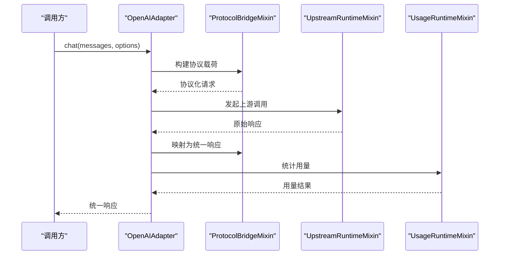
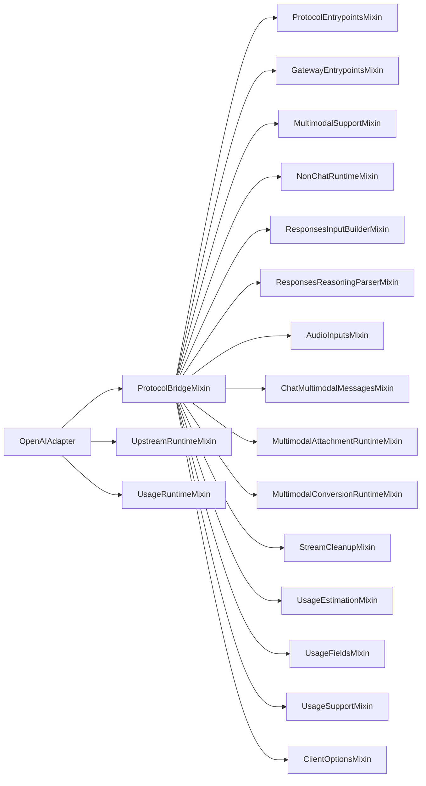

# AI适配器系统

<cite>
**本文引用的文件**
- [backend/app/ai/adapters/base.py](file://backend/app/ai/adapters/base.py)
- [backend/app/ai/adapters/__init__.py](file://backend/app/ai/adapters/__init__.py)
- [backend/app/ai/adapters/openai_adapter.py](file://backend/app/ai/adapters/openai_adapter.py)
- [backend/app/ai/adapters/openai_compatible/protocol_chat_completions.py](file://backend/app/ai/adapters/openai_compatible/protocol_chat_completions.py)
- [backend/app/ai/adapters/openai_compatible/protocol_responses.py](file://backend/app/ai/adapters/openai_compatible/protocol_responses.py)
- [backend/app/ai/adapters/openai_compatible/protocol_responses_stream.py](file://backend/app/ai/adapters/openai_compatible/protocol_responses_stream.py)
- [backend/app/ai/adapters/openai_compatible/protocol_runtime_context.py](file://backend/app/ai/adapters/openai_compatible/protocol_runtime_context.py)
- [backend/app/ai/adapters/openai_compatible/request_payload_builders.py](file://backend/app/ai/adapters/openai_compatible/request_payload_builders.py)
- [backend/app/ai/adapters/openai_compatible/support/protocol_bridge.py](file://backend/app/ai/adapters/openai_compatible/support/protocol_bridge.py)
- [backend/app/ai/adapters/openai_compatible/support/protocol_entrypoints.py](file://backend/app/ai/adapters/openai_compatible/support/protocol_entrypoints.py)
- [backend/app/ai/adapters/openai_compatible/support/gateway_entrypoints.py](file://backend/app/ai/adapters/openai_compatible/support/gateway_entrypoints.py)
- [backend/app/ai/adapters/openai_compatible/support/upstream_runtime.py](file://backend/app/ai/adapters/openai_compatible/support/upstream_runtime.py)
- [backend/app/ai/adapters/openai_compatible/support/model_request_runtime.py](file://backend/app/ai/adapters/openai_compatible/support/model_request_runtime.py)
- [backend/app/ai/adapters/openai_compatible/support/multimodal_support.py](file://backend/app/ai/adapters/openai_compatible/support/multimodal_support.py)
- [backend/app/ai/adapters/openai_compatible/support/non_chat_runtime.py](file://backend/app/ai/adapters/openai_compatible/support/non_chat_runtime.py)
- [backend/app/ai/adapters/openai_compatible/support/responses_input_builder.py](file://backend/app/ai/adapters/openai_compatible/support/responses_input_builder.py)
- [backend/app/ai/adapters/openai_compatible/support/responses_reasoning_parser.py](file://backend/app/ai/adapters/openai_compatible/support/responses_reasoning_parser.py)
- [backend/app/ai/adapters/openai_compatible/support/usage_runtime.py](file://backend/app/ai/adapters/openai_compatible/support/usage_runtime.py)
- [backend/app/ai/adapters/openai_compatible/support/audio_inputs.py](file://backend/app/ai/adapters/openai_compatible/support/audio_inputs.py)
- [backend/app/ai/adapters/openai_compatible/support/chat_multimodal_messages.py](file://backend/app/ai/adapters/openai_compatible/support/chat_multimodal_messages.py)
- [backend/app/ai/adapters/openai_compatible/support/multimodal_attachment_runtime.py](file://backend/app/ai/adapters/openai_compatible/support/multimodal_attachment_runtime.py)
- [backend/app/ai/adapters/openai_compatible/support/multimodal_conversion_runtime.py](file://backend/app/ai/adapters/openai_compatible/support/multimodal_conversion_runtime.py)
- [backend/app/ai/adapters/openai_compatible/support/stream_cleanup.py](file://backend/app/ai/adapters/openai_compatible/support/stream_cleanup.py)
- [backend/app/ai/adapters/openai_compatible/support/usage_estimation.py](file://backend/app/ai/adapters/openai_compatible/support/usage_estimation.py)
- [backend/app/ai/adapters/openai_compatible/support/usage_fields.py](file://backend/app/ai/adapters/openai_compatible/support/usage_fields.py)
- [backend/app/ai/adapters/openai_compatible/support/usage_support.py](file://backend/app/ai/adapters/openai_compatible/support/usage_support.py)
- [backend/app/ai/adapters/openai_compatible/timeout_policy.py](file://backend/app/ai/adapters/openai_compatible/timeout_policy.py)
- [backend/app/ai/adapters/openai_compatible/capabilities.py](file://backend/app/ai/adapters/openai_compatible/capabilities.py)
- [backend/app/ai/adapters/openai_compatible/client_factory.py](file://backend/app/ai/adapters/openai_compatible/client_factory.py)
- [backend/app/ai/adapters/openai_compatible/request_builder.py](file://backend/app/ai/adapters/openai_compatible/request_builder.py)
- [backend/app/ai/adapters/openai_compatible/response_mapper.py](file://backend/app/ai/adapters/openai_compatible/response_mapper.py)
- [backend/app/ai/adapters/openai_compatible/support/client_options.py](file://backend/app/ai/adapters/openai_compatible/support/client_options.py)
- [backend/app/ai/adapters/openai_compatible/__init__.py](file://backend/app/ai/adapters/openai_compatible/__init__.py)
</cite>

## 目录
1. [简介](#简介)
2. [项目结构](#项目结构)
3. [核心组件](#核心组件)
4. [架构总览](#架构总览)
5. [详细组件分析](#详细组件分析)
6. [依赖关系分析](#依赖关系分析)
7. [性能考虑](#性能考虑)
8. [故障排查指南](#故障排查指南)
9. [结论](#结论)
10. [附录](#附录)

## 简介
本技术文档面向AI适配器系统，聚焦于适配器架构设计、适配器基类实现、多供应商适配器注册机制，以及OpenAI兼容适配器的实现原理、协议转换与参数映射策略。文档还涵盖适配器生命周期管理、初始化流程、资源清理机制；配置管理、认证处理与请求格式化；错误处理、超时控制与重试策略；并提供适配器开发指南、扩展接口与最佳实践，以及测试方法与示例。

## 项目结构
AI适配器系统位于后端Python工程的AI子域中，采用模块化分层组织：
- 适配器基类与注册中心：位于 backend/app/ai/adapters
- OpenAI兼容适配器族：位于 backend/app/ai/adapters/openai_compatible 及其 support 子包
- 协议桥接、运行时上下文、请求构建、响应映射、计费与用量统计等能力按职责拆分到不同模块

```mermaid
graph TB
subgraph "适配器核心"
Base["BaseAdapter<br/>适配器基类"]
Reg["AdapterRegistry<br/>注册中心"]
OA["OpenAIAdapter<br/>OpenAI兼容适配器"]
end
subgraph "OpenAI兼容适配器族"
PC["protocol_chat_completions.py"]
PR["protocol_responses.py"]
PRS["protocol_responses_stream.py"]
PRC["protocol_runtime_context.py"]
RPB["request_payload_builders.py"]
BR["request_builder.py"]
RM["response_mapper.py"]
CAP["capabilities.py"]
CF["client_factory.py"]
TP["timeout_policy.py"]
end
subgraph "支持模块"
PB["support/protocol_bridge.py"]
PE["support/protocol_entrypoints.py"]
GE["support/gateway_entrypoints.py"]
UR["support/upstream_runtime.py"]
MR["support/model_request_runtime.py"]
MS["support/multimodal_support.py"]
NCR["support/non_chat_runtime.py"]
RIB["support/responses_input_builder.py"]
RRP["support/responses_reasoning_parser.py"]
US["support/usage_runtime.py"]
AU["support/audio_inputs.py"]
CMM["support/chat_multimodal_messages.py"]
MAR["support/multimodal_attachment_runtime.py"]
MCR["support/multimodal_conversion_runtime.py"]
SC["support/stream_cleanup.py"]
UE["support/usage_estimation.py"]
UF["support/usage_fields.py"]
USP["support/usage_support.py"]
CO["support/client_options.py"]
end
Reg --> OA
OA --> PC
OA --> PR
OA --> PRS
OA --> PRC
OA --> RPB
OA --> BR
OA --> RM
OA --> CAP
OA --> CF
OA --> TP
PC --> PB
PR --> PB
PRS --> PB
PRC --> PB
BR --> PB
RM --> PB
CAP --> PB
CF --> PB
TP --> PB
PB --> PE
PB --> GE
PB --> UR
PB --> MR
PB --> NCR
PB --> RIB
PB --> RRP
PB --> US
PB --> AU
PB --> CMM
PB --> MAR
PB --> MCR
PB --> SC
PB --> UE
PB --> UF
PB --> USP
PB --> CO
```

图表来源
- [backend/app/ai/adapters/base.py](file://backend/app/ai/adapters/base.py)
- [backend/app/ai/adapters/__init__.py](file://backend/app/ai/adapters/__init__.py)
- [backend/app/ai/adapters/openai_adapter.py](file://backend/app/ai/adapters/openai_adapter.py)
- [backend/app/ai/adapters/openai_compatible/protocol_chat_completions.py](file://backend/app/ai/adapters/openai_compatible/protocol_chat_completions.py)
- [backend/app/ai/adapters/openai_compatible/protocol_responses.py](file://backend/app/ai/adapters/openai_compatible/protocol_responses.py)
- [backend/app/ai/adapters/openai_compatible/protocol_responses_stream.py](file://backend/app/ai/adapters/openai_compatible/protocol_responses_stream.py)
- [backend/app/ai/adapters/openai_compatible/protocol_runtime_context.py](file://backend/app/ai/adapters/openai_compatible/protocol_runtime_context.py)
- [backend/app/ai/adapters/openai_compatible/request_payload_builders.py](file://backend/app/ai/adapters/openai_compatible/request_payload_builders.py)
- [backend/app/ai/adapters/openai_compatible/request_builder.py](file://backend/app/ai/adapters/openai_compatible/request_builder.py)
- [backend/app/ai/adapters/openai_compatible/response_mapper.py](file://backend/app/ai/adapters/openai_compatible/response_mapper.py)
- [backend/app/ai/adapters/openai_compatible/capabilities.py](file://backend/app/ai/adapters/openai_compatible/capabilities.py)
- [backend/app/ai/adapters/openai_compatible/client_factory.py](file://backend/app/ai/adapters/openai_compatible/client_factory.py)
- [backend/app/ai/adapters/openai_compatible/timeout_policy.py](file://backend/app/ai/adapters/openai_compatible/timeout_policy.py)
- [backend/app/ai/adapters/openai_compatible/support/protocol_bridge.py](file://backend/app/ai/adapters/openai_compatible/support/protocol_bridge.py)
- [backend/app/ai/adapters/openai_compatible/support/protocol_entrypoints.py](file://backend/app/ai/adapters/openai_compatible/support/protocol_entrypoints.py)
- [backend/app/ai/adapters/openai_compatible/support/gateway_entrypoints.py](file://backend/app/ai/adapters/openai_compatible/support/gateway_entrypoints.py)
- [backend/app/ai/adapters/openai_compatible/support/upstream_runtime.py](file://backend/app/ai/adapters/openai_compatible/support/upstream_runtime.py)
- [backend/app/ai/adapters/openai_compatible/support/model_request_runtime.py](file://backend/app/ai/adapters/openai_compatible/support/model_request_runtime.py)
- [backend/app/ai/adapters/openai_compatible/support/multimodal_support.py](file://backend/app/ai/adapters/openai_compatible/support/multimodal_support.py)
- [backend/app/ai/adapters/openai_compatible/support/non_chat_runtime.py](file://backend/app/ai/adapters/openai_compatible/support/non_chat_runtime.py)
- [backend/app/ai/adapters/openai_compatible/support/responses_input_builder.py](file://backend/app/ai/adapters/openai_compatible/support/responses_input_builder.py)
- [backend/app/ai/adapters/openai_compatible/support/responses_reasoning_parser.py](file://backend/app/ai/adapters/openai_compatible/support/responses_reasoning_parser.py)
- [backend/app/ai/adapters/openai_compatible/support/usage_runtime.py](file://backend/app/ai/adapters/openai_compatible/support/usage_runtime.py)
- [backend/app/ai/adapters/openai_compatible/support/audio_inputs.py](file://backend/app/ai/adapters/openai_compatible/support/audio_inputs.py)
- [backend/app/ai/adapters/openai_compatible/support/chat_multimodal_messages.py](file://backend/app/ai/adapters/openai_compatible/support/chat_multimodal_messages.py)
- [backend/app/ai/adapters/openai_compatible/support/multimodal_attachment_runtime.py](file://backend/app/ai/adapters/openai_compatible/support/multimodal_attachment_runtime.py)
- [backend/app/ai/adapters/openai_compatible/support/multimodal_conversion_runtime.py](file://backend/app/ai/adapters/openai_compatible/support/multimodal_conversion_runtime.py)
- [backend/app/ai/adapters/openai_compatible/support/stream_cleanup.py](file://backend/app/ai/adapters/openai_compatible/support/stream_cleanup.py)
- [backend/app/ai/adapters/openai_compatible/support/usage_estimation.py](file://backend/app/ai/adapters/openai_compatible/support/usage_estimation.py)
- [backend/app/ai/adapters/openai_compatible/support/usage_fields.py](file://backend/app/ai/adapters/openai_compatible/support/usage_fields.py)
- [backend/app/ai/adapters/openai_compatible/support/usage_support.py](file://backend/app/ai/adapters/openai_compatible/support/usage_support.py)

章节来源
- [backend/app/ai/adapters/__init__.py](file://backend/app/ai/adapters/__init__.py)
- [backend/app/ai/adapters/base.py](file://backend/app/ai/adapters/base.py)

## 核心组件
- 适配器基类 BaseAdapter：定义统一的适配器接口与默认行为，包括聊天、流式、函数调用、视觉、嵌入、图像生成等特性声明，以及模型校验、模型列表查询等通用能力。
- 注册中心 AdapterRegistry：集中管理适配器类型注册、实例化、注销与枚举，提供幂等注册与错误提示。
- OpenAI兼容适配器 OpenAIAdapter：基于协议桥接与运行时混入，实现OpenAI风格的聊天补全、响应映射、用量统计、多模态输入等能力。

章节来源
- [backend/app/ai/adapters/base.py](file://backend/app/ai/adapters/base.py)
- [backend/app/ai/adapters/__init__.py](file://backend/app/ai/adapters/__init__.py)
- [backend/app/ai/adapters/openai_adapter.py](file://backend/app/ai/adapters/openai_adapter.py)

## 架构总览
适配器系统通过“协议桥接 + 运行时混入”的方式，将OpenAI兼容协议与内部运行时解耦。协议层负责请求/响应的协议转换与参数映射，运行时层负责上游调用、多模态处理、用量统计与清理等横切关注点。

```mermaid
classDiagram
class BaseAdapter {
+chat(messages, options) any
+stream(messages, options) AsyncGenerator
+list_models() list
+validate_model(model) bool
+get_supported_features() dict
}
class AdapterRegistry {
+register(provider_type, adapter_class) void
+get_adapter(provider_type) type
+create_adapter(provider_type, api_key, base_url, **kwargs) BaseAdapter
+unregister(provider_type) bool
+list_adapters() list
}
class OpenAIAdapter {
+chat(...)
+stream(...)
+list_models()
+validate_model(...)
+get_supported_features()
}
class ProtocolBridgeMixin
class ProtocolEntrypointsMixin
class GatewayEntrypointsMixin
class UpstreamRuntimeMixin
class ModelRequestMixin
class MultimodalSupportMixin
class NonChatRuntimeMixin
class ResponsesInputBuilderMixin
class ResponsesReasoningParserMixin
class UsageRuntimeMixin
class AudioInputsMixin
class ChatMultimodalMessagesMixin
class MultimodalAttachmentRuntimeMixin
class MultimodalConversionRuntimeMixin
class StreamCleanupMixin
class UsageEstimationMixin
class UsageFieldsMixin
class UsageSupportMixin
class ClientOptionsMixin
OpenAIAdapter --|> BaseAdapter
OpenAIAdapter ..> ProtocolBridgeMixin
OpenAIAdapter ..> ProtocolEntrypointsMixin
OpenAIAdapter ..> GatewayEntrypointsMixin
OpenAIAdapter ..> UpstreamRuntimeMixin
OpenAIAdapter ..> ModelRequestMixin
OpenAIAdapter ..> MultimodalSupportMixin
OpenAIAdapter ..> NonChatRuntimeMixin
OpenAIAdapter ..> ResponsesInputBuilderMixin
OpenAIAdapter ..> ResponsesReasoningParserMixin
OpenAIAdapter ..> UsageRuntimeMixin
OpenAIAdapter ..> AudioInputsMixin
OpenAIAdapter ..> ChatMultimodalMessagesMixin
OpenAIAdapter ..> MultimodalAttachmentRuntimeMixin
OpenAIAdapter ..> MultimodalConversionRuntimeMixin
OpenAIAdapter ..> StreamCleanupMixin
OpenAIAdapter ..> UsageEstimationMixin
OpenAIAdapter ..> UsageFieldsMixin
OpenAIAdapter ..> UsageSupportMixin
OpenAIAdapter ..> ClientOptionsMixin
```

图表来源
- [backend/app/ai/adapters/base.py](file://backend/app/ai/adapters/base.py)
- [backend/app/ai/adapters/__init__.py](file://backend/app/ai/adapters/__init__.py)
- [backend/app/ai/adapters/openai_adapter.py](file://backend/app/ai/adapters/openai_adapter.py)
- [backend/app/ai/adapters/openai_compatible/support/protocol_bridge.py](file://backend/app/ai/adapters/openai_compatible/support/protocol_bridge.py)
- [backend/app/ai/adapters/openai_compatible/support/protocol_entrypoints.py](file://backend/app/ai/adapters/openai_compatible/support/protocol_entrypoints.py)
- [backend/app/ai/adapters/openai_compatible/support/gateway_entrypoints.py](file://backend/app/ai/adapters/openai_compatible/support/gateway_entrypoints.py)
- [backend/app/ai/adapters/openai_compatible/support/upstream_runtime.py](file://backend/app/ai/adapters/openai_compatible/support/upstream_runtime.py)
- [backend/app/ai/adapters/openai_compatible/support/model_request_runtime.py](file://backend/app/ai/adapters/openai_compatible/support/model_request_runtime.py)
- [backend/app/ai/adapters/openai_compatible/support/multimodal_support.py](file://backend/app/ai/adapters/openai_compatible/support/multimodal_support.py)
- [backend/app/ai/adapters/openai_compatible/support/non_chat_runtime.py](file://backend/app/ai/adapters/openai_compatible/support/non_chat_runtime.py)
- [backend/app/ai/adapters/openai_compatible/support/responses_input_builder.py](file://backend/app/ai/adapters/openai_compatible/support/responses_input_builder.py)
- [backend/app/ai/adapters/openai_compatible/support/responses_reasoning_parser.py](file://backend/app/ai/adapters/openai_compatible/support/responses_reasoning_parser.py)
- [backend/app/ai/adapters/openai_compatible/support/usage_runtime.py](file://backend/app/ai/adapters/openai_compatible/support/usage_runtime.py)
- [backend/app/ai/adapters/openai_compatible/support/audio_inputs.py](file://backend/app/ai/adapters/openai_compatible/support/audio_inputs.py)
- [backend/app/ai/adapters/openai_compatible/support/chat_multimodal_messages.py](file://backend/app/ai/adapters/openai_compatible/support/chat_multimodal_messages.py)
- [backend/app/ai/adapters/openai_compatible/support/multimodal_attachment_runtime.py](file://backend/app/ai/adapters/openai_compatible/support/multimodal_attachment_runtime.py)
- [backend/app/ai/adapters/openai_compatible/support/multimodal_conversion_runtime.py](file://backend/app/ai/adapters/openai_compatible/support/multimodal_conversion_runtime.py)
- [backend/app/ai/adapters/openai_compatible/support/stream_cleanup.py](file://backend/app/ai/adapters/openai_compatible/support/stream_cleanup.py)
- [backend/app/ai/adapters/openai_compatible/support/usage_estimation.py](file://backend/app/ai/adapters/openai_compatible/support/usage_estimation.py)
- [backend/app/ai/adapters/openai_compatible/support/usage_fields.py](file://backend/app/ai/adapters/openai_compatible/support/usage_fields.py)
- [backend/app/ai/adapters/openai_compatible/support/usage_support.py](file://backend/app/ai/adapters/openai_compatible/support/usage_support.py)
- [backend/app/ai/adapters/openai_compatible/support/client_options.py](file://backend/app/ai/adapters/openai_compatible/support/client_options.py)

## 详细组件分析

### 适配器基类 BaseAdapter
- 职责：定义统一接口与默认行为，屏蔽具体供应商差异
- 关键方法：
  - chat/messages：执行聊天对话
  - stream：执行流式对话
  - list_models：列出可用模型
  - validate_model：校验模型名
  - get_supported_features：返回功能开关字典
- 设计要点：
  - 抽象方法由子类实现
  - 默认实现提供安全回退，便于扩展

章节来源
- [backend/app/ai/adapters/base.py](file://backend/app/ai/adapters/base.py)

### 注册中心 AdapterRegistry
- 职责：集中管理适配器类型注册、实例化、注销与枚举
- 关键方法：
  - register：注册适配器类型（幂等）
  - get_adapter：按类型获取适配器类
  - create_adapter：创建适配器实例（传入api_key、base_url等）
  - unregister：注销适配器类型
  - list_adapters：列出已注册类型
- 初始化流程：在应用启动阶段调用 register_core_adapters 完成内置适配器注册

章节来源
- [backend/app/ai/adapters/__init__.py](file://backend/app/ai/adapters/__init__.py)

### OpenAI兼容适配器 OpenAIAdapter
- 职责：实现OpenAI风格的聊天补全、流式输出、响应映射、用量统计、多模态输入等
- 组成：
  - 协议层：协议桥接、协议入口、运行时上下文
  - 请求层：请求构建器、请求载荷构建器
  - 响应层：响应映射器、推理解析器、输入构建器
  - 运行时层：上游运行时、模型请求运行时、网关入口、非聊天运行时
  - 多模态层：音频输入、聊天多模态消息、附件与转换运行时
  - 计费层：用量运行时、用量估算、用量字段、用量支持
  - 其他：超时策略、客户端选项、流清理

章节来源
- [backend/app/ai/adapters/openai_adapter.py](file://backend/app/ai/adapters/openai_adapter.py)

### 协议桥接与运行时混入
- 协议桥接：将外部协议（如OpenAI）与内部运行时解耦，统一请求/响应格式
- 运行时混入：通过Mixin组合不同能力（上游调用、多模态、用量统计、清理等）

图表来源
- [backend/app/ai/adapters/openai_compatible/support/protocol_bridge.py](file://backend/app/ai/adapters/openai_compatible/support/protocol_bridge.py)
- [backend/app/ai/adapters/openai_compatible/support/upstream_runtime.py](file://backend/app/ai/adapters/openai_compatible/support/upstream_runtime.py)
- [backend/app/ai/adapters/openai_compatible/support/usage_runtime.py](file://backend/app/ai/adapters/openai_compatible/support/usage_runtime.py)

### 请求构建与参数映射
- 请求构建器：将内部消息结构转换为适配器所需的请求载荷
- 参数映射：将适配器参数映射到上游所需字段，处理温度、最大长度、工具调用等

章节来源
- [backend/app/ai/adapters/openai_compatible/request_builder.py](file://backend/app/ai/adapters/openai_compatible/request_builder.py)
- [backend/app/ai/adapters/openai_compatible/request_payload_builders.py](file://backend/app/ai/adapters/openai_compatible/request_payload_builders.py)

### 响应映射与推理解析
- 响应映射器：将上游响应映射为统一格式
- 推理解析器：解析推理相关字段（如思维链、工具调用等）

章节来源
- [backend/app/ai/adapters/openai_compatible/response_mapper.py](file://backend/app/ai/adapters/openai_compatible/response_mapper.py)
- [backend/app/ai/adapters/openai_compatible/support/responses_reasoning_parser.py](file://backend/app/ai/adapters/openai_compatible/support/responses_reasoning_parser.py)

### 多模态支持
- 音频输入：处理音频输入
- 聊天多模态消息：将多模态消息转换为协议所需格式
- 附件与转换运行时：处理图片、视频等附件上传与转换

章节来源
- [backend/app/ai/adapters/openai_compatible/support/audio_inputs.py](file://backend/app/ai/adapters/openai_compatible/support/audio_inputs.py)
- [backend/app/ai/adapters/openai_compatible/support/chat_multimodal_messages.py](file://backend/app/ai/adapters/openai_compatible/support/chat_multimodal_messages.py)
- [backend/app/ai/adapters/openai_compatible/support/multimodal_attachment_runtime.py](file://backend/app/ai/adapters/openai_compatible/support/multimodal_attachment_runtime.py)
- [backend/app/ai/adapters/openai_compatible/support/multimodal_conversion_runtime.py](file://backend/app/ai/adapters/openai_compatible/support/multimodal_conversion_runtime.py)

### 用量统计与清理
- 用量运行时：计算并记录用量
- 用量估算与字段：估算token用量与字段映射
- 流清理：确保流式响应正确关闭与清理

章节来源
- [backend/app/ai/adapters/openai_compatible/support/usage_runtime.py](file://backend/app/ai/adapters/openai_compatible/support/usage_runtime.py)
- [backend/app/ai/adapters/openai_compatible/support/usage_estimation.py](file://backend/app/ai/adapters/openai_compatible/support/usage_estimation.py)
- [backend/app/ai/adapters/openai_compatible/support/usage_fields.py](file://backend/app/ai/adapters/openai_compatible/support/usage_fields.py)
- [backend/app/ai/adapters/openai_compatible/support/stream_cleanup.py](file://backend/app/ai/adapters/openai_compatible/support/stream_cleanup.py)

### 超时控制与重试策略
- 超时策略：针对不同场景设置合理的超时时间
- 重试策略：对可重试错误进行指数退避重试

章节来源
- [backend/app/ai/adapters/openai_compatible/timeout_policy.py](file://backend/app/ai/adapters/openai_compatible/timeout_policy.py)

## 依赖关系分析
- 低耦合高内聚：协议桥接与运行时混入通过组合而非继承实现能力拼装
- 可插拔扩展：新增供应商只需实现协议桥接与必要运行时混入
- 依赖方向：适配器依赖协议桥接与运行时混入，运行时混入依赖支持模块

图表来源
- [backend/app/ai/adapters/openai_adapter.py](file://backend/app/ai/adapters/openai_adapter.py)
- [backend/app/ai/adapters/openai_compatible/support/protocol_bridge.py](file://backend/app/ai/adapters/openai_compatible/support/protocol_bridge.py)
- [backend/app/ai/adapters/openai_compatible/support/protocol_entrypoints.py](file://backend/app/ai/adapters/openai_compatible/support/protocol_entrypoints.py)
- [backend/app/ai/adapters/openai_compatible/support/gateway_entrypoints.py](file://backend/app/ai/adapters/openai_compatible/support/gateway_entrypoints.py)
- [backend/app/ai/adapters/openai_compatible/support/upstream_runtime.py](file://backend/app/ai/adapters/openai_compatible/support/upstream_runtime.py)
- [backend/app/ai/adapters/openai_compatible/support/model_request_runtime.py](file://backend/app/ai/adapters/openai_compatible/support/model_request_runtime.py)
- [backend/app/ai/adapters/openai_compatible/support/multimodal_support.py](file://backend/app/ai/adapters/openai_compatible/support/multimodal_support.py)
- [backend/app/ai/adapters/openai_compatible/support/non_chat_runtime.py](file://backend/app/ai/adapters/openai_compatible/support/non_chat_runtime.py)
- [backend/app/ai/adapters/openai_compatible/support/responses_input_builder.py](file://backend/app/ai/adapters/openai_compatible/support/responses_input_builder.py)
- [backend/app/ai/adapters/openai_compatible/support/responses_reasoning_parser.py](file://backend/app/ai/adapters/openai_compatible/support/responses_reasoning_parser.py)
- [backend/app/ai/adapters/openai_compatible/support/usage_runtime.py](file://backend/app/ai/adapters/openai_compatible/support/usage_runtime.py)
- [backend/app/ai/adapters/openai_compatible/support/audio_inputs.py](file://backend/app/ai/adapters/openai_compatible/support/audio_inputs.py)
- [backend/app/ai/adapters/openai_compatible/support/chat_multimodal_messages.py](file://backend/app/ai/adapters/openai_compatible/support/chat_multimodal_messages.py)
- [backend/app/ai/adapters/openai_compatible/support/multimodal_attachment_runtime.py](file://backend/app/ai/adapters/openai_compatible/support/multimodal_attachment_runtime.py)
- [backend/app/ai/adapters/openai_compatible/support/multimodal_conversion_runtime.py](file://backend/app/ai/adapters/openai_compatible/support/multimodal_conversion_runtime.py)
- [backend/app/ai/adapters/openai_compatible/support/stream_cleanup.py](file://backend/app/ai/adapters/openai_compatible/support/stream_cleanup.py)
- [backend/app/ai/adapters/openai_compatible/support/usage_estimation.py](file://backend/app/ai/adapters/openai_compatible/support/usage_estimation.py)
- [backend/app/ai/adapters/openai_compatible/support/usage_fields.py](file://backend/app/ai/adapters/openai_compatible/support/usage_fields.py)
- [backend/app/ai/adapters/openai_compatible/support/usage_support.py](file://backend/app/ai/adapters/openai_compatible/support/usage_support.py)
- [backend/app/ai/adapters/openai_compatible/support/client_options.py](file://backend/app/ai/adapters/openai_compatible/support/client_options.py)

## 性能考虑
- 异步流式：优先使用流式接口以降低首字节延迟
- 用量估算：在请求前进行用量估算，避免昂贵的上游调用
- 超时与重试：合理设置超时与指数退避重试，平衡可靠性与性能
- 多模态批处理：对多模态附件进行批量上传与转换，减少往返次数
- 缓存与复用：对常用模型与配置进行缓存，减少重复初始化成本

## 故障排查指南
- 适配器未注册：检查注册中心是否完成注册，确认类型字符串一致
- 认证失败：核对api_key与base_url配置，确保权限与域名白名单
- 超时与重试：查看超时策略与重试日志，定位网络或上游限流问题
- 多模态异常：检查附件格式与大小限制，确认转换运行时正常
- 用量统计异常：核对用量字段映射与估算逻辑，确保计费正确

章节来源
- [backend/app/ai/adapters/__init__.py](file://backend/app/ai/adapters/__init__.py)
- [backend/app/ai/adapters/openai_compatible/timeout_policy.py](file://backend/app/ai/adapters/openai_compatible/timeout_policy.py)

## 结论
AI适配器系统通过协议桥接与运行时混入实现了对多供应商的统一抽象，具备良好的扩展性与可维护性。OpenAI兼容适配器作为核心实现，覆盖了聊天、流式、多模态、用量统计等关键能力。建议在新供应商接入时遵循现有协议与混入模式，确保一致性与可测试性。

## 附录

### 开发指南与最佳实践
- 新增适配器步骤
  - 在注册中心注册适配器类型
  - 实现协议桥接与必要的运行时混入
  - 提供请求构建与响应映射
  - 集成用量统计与清理逻辑
- 扩展接口
  - 协议桥接接口：统一请求/响应格式
  - 运行时混入接口：组合不同能力
  - 配置与认证接口：客户端选项与鉴权
- 最佳实践
  - 使用异步与流式接口提升用户体验
  - 合理设置超时与重试策略
  - 对多模态输入进行预处理与压缩
  - 保持参数映射清晰与可追踪

### 适配器测试方法
- 单元测试
  - 针对请求构建器与响应映射器进行参数映射验证
  - 针对用量估算与统计进行边界值测试
- 集成测试
  - 使用Mock上游服务验证协议桥接与运行时混入
  - 验证流式输出的完整性与清理逻辑
- 端到端测试
  - 覆盖真实供应商的认证、超时与重试场景
  - 验证多模态输入与推理解析的正确性