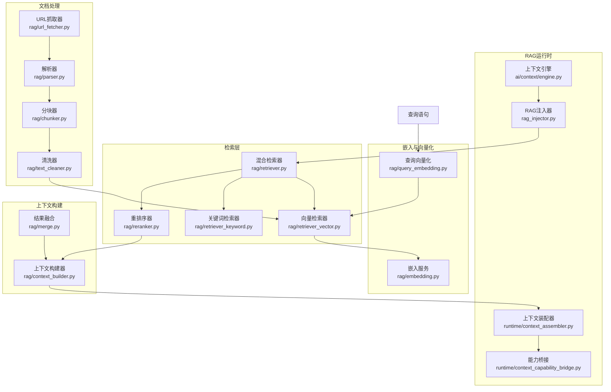
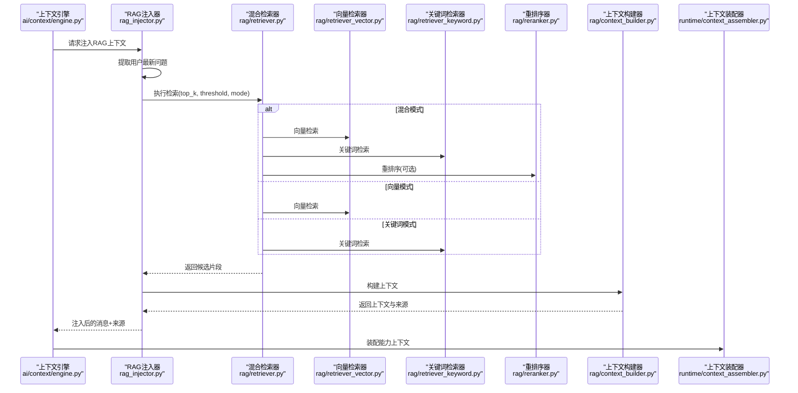
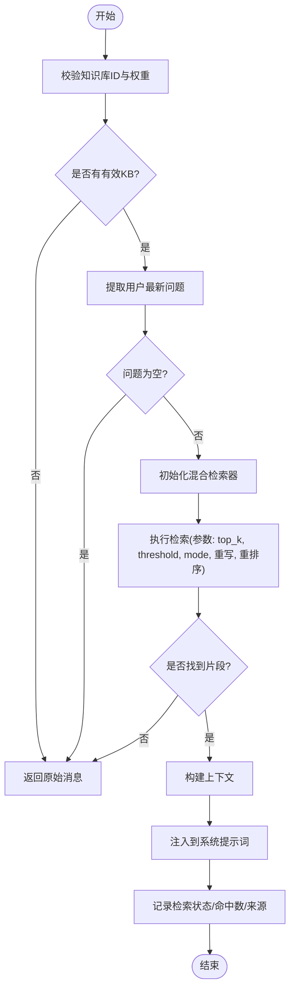
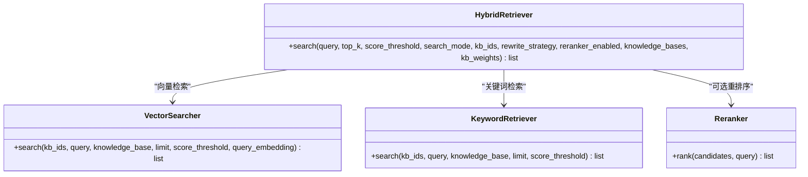
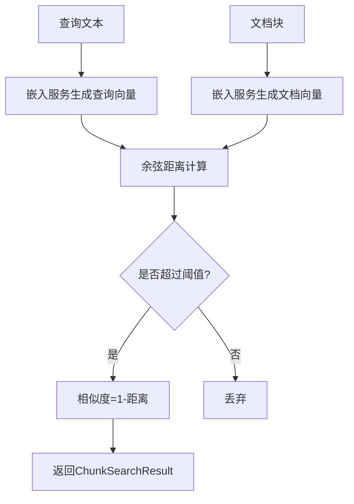
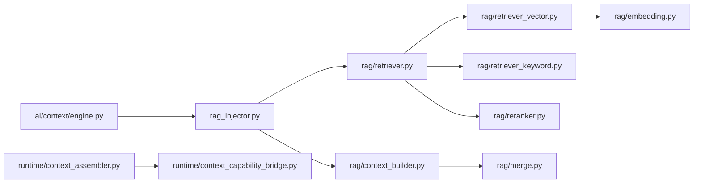

# RAG知识库系统

<cite>
**本文引用的文件**
- [backend/app/ai/rag_injector.py](file://backend/app/ai/rag_injector.py)
- [backend/app/ai/rag/retriever.py](file://backend/app/ai/rag/retriever.py)
- [backend/app/ai/rag/retriever_vector.py](file://backend/app/ai/rag/retriever_vector.py)
- [backend/app/ai/rag/retriever_keyword.py](file://backend/app/ai/rag/retriever_keyword.py)
- [backend/app/ai/rag/reranker.py](file://backend/app/ai/rag/reranker.py)
- [backend/app/ai/rag/context_builder.py](file://backend/app/ai/rag/context_builder.py)
- [backend/app/ai/rag/embedding.py](file://backend/app/ai/rag/embedding.py)
- [backend/app/ai/rag/parser.py](file://backend/app/ai/rag/parser.py)
- [backend/app/ai/rag/query_embedding.py](file://backend/app/ai/rag/query_embedding.py)
- [backend/app/ai/rag/text_cleaner.py](file://backend/app/ai/rag/text_cleaner.py)
- [backend/app/ai/rag/merge.py](file://backend/app/ai/rag/merge.py)
- [backend/app/ai/rag/chunker.py](file://backend/app/ai/rag/chunker.py)
- [backend/app/ai/rag/url_fetcher.py](file://backend/app/ai/rag/url_fetcher.py)
- [backend/app/ai/context/engine.py](file://backend/app/ai/context/engine.py)
- [backend/app/ai/runtime/context_assembler.py](file://backend/app/ai/runtime/context_assembler.py)
- [backend/app/ai/runtime/context_capability_bridge.py](file://backend/app/ai/runtime/context_capability_bridge.py)
</cite>

## 目录
1. [简介](#简介)
2. [项目结构](#项目结构)
3. [核心组件](#核心组件)
4. [架构总览](#架构总览)
5. [详细组件分析](#详细组件分析)
6. [依赖关系分析](#依赖关系分析)
7. [性能考量](#性能考量)
8. [故障排查指南](#故障排查指南)
9. [结论](#结论)
10. [附录](#附录)

## 简介
本技术文档面向RAG（检索增强生成）知识库系统，围绕检索增强生成的完整工作流进行深入说明：从查询输入、检索器混合策略、向量与关键词检索、重排序、上下文构建与压缩、到最终注入到对话系统。文档还涵盖嵌入模型集成、文本向量化与相似度计算、文档解析器与多模态支持、以及知识库管理、索引优化与查询性能调优等实践指南，并提供部署与监控建议。

## 项目结构
RAG子系统位于后端应用的AI模块中，关键文件分布如下：
- 检索与上下文注入：rag_injector.py、retriever.py、context_builder.py
- 检索器实现：retriever_vector.py、retriever_keyword.py、reranker.py
- 嵌入与向量化：embedding.py、query_embedding.py
- 文档解析与预处理：parser.py、chunker.py、text_cleaner.py、url_fetcher.py
- 运行时上下文装配与能力桥接：runtime/context_assembler.py、runtime/context_capability_bridge.py
- 上下文融合：merge.py

图表来源
- [backend/app/ai/rag_injector.py](file://backend/app/ai/rag_injector.py)
- [backend/app/ai/rag/retriever.py](file://backend/app/ai/rag/retriever.py)
- [backend/app/ai/rag/retriever_vector.py](file://backend/app/ai/rag/retriever_vector.py)
- [backend/app/ai/rag/retriever_keyword.py](file://backend/app/ai/rag/retriever_keyword.py)
- [backend/app/ai/rag/reranker.py](file://backend/app/ai/rag/reranker.py)
- [backend/app/ai/rag/context_builder.py](file://backend/app/ai/rag/context_builder.py)
- [backend/app/ai/rag/embedding.py](file://backend/app/ai/rag/embedding.py)
- [backend/app/ai/rag/query_embedding.py](file://backend/app/ai/rag/query_embedding.py)
- [backend/app/ai/rag/parser.py](file://backend/app/ai/rag/parser.py)
- [backend/app/ai/rag/chunker.py](file://backend/app/ai/rag/chunker.py)
- [backend/app/ai/rag/text_cleaner.py](file://backend/app/ai/rag/text_cleaner.py)
- [backend/app/ai/rag/url_fetcher.py](file://backend/app/ai/rag/url_fetcher.py)
- [backend/app/ai/rag/merge.py](file://backend/app/ai/rag/merge.py)
- [backend/app/ai/context/engine.py](file://backend/app/ai/context/engine.py)
- [backend/app/ai/runtime/context_assembler.py](file://backend/app/ai/runtime/context_assembler.py)
- [backend/app/ai/runtime/context_capability_bridge.py](file://backend/app/ai/runtime/context_capability_bridge.py)

章节来源
- [backend/app/ai/rag_injector.py](file://backend/app/ai/rag_injector.py)
- [backend/app/ai/rag/retriever.py](file://backend/app/ai/rag/retriever.py)
- [backend/app/ai/rag/context_builder.py](file://backend/app/ai/rag/context_builder.py)

## 核心组件
- RAG注入器：负责在对话前从知识库检索相关片段并注入到系统提示词中，同时记录检索状态与命中计数。
- 混合检索器：整合向量检索与关键词检索，支持重写策略与重排序开关。
- 向量检索器：基于pgvector余弦距离进行相似度检索，输出带相似度分数的结果。
- 关键词检索器：基于关键词匹配的快速检索，作为混合策略的一部分。
- 重排序器：对候选结果进行重排以提升相关性。
- 嵌入服务：提供文本向量化能力，支持查询与文档嵌入。
- 解析器与分块器：解析多格式文档，按策略切分为可向量化块。
- 上下文构建器：将检索结果组织为可注入的上下文，支持压缩与裁剪。
- 结果融合：对不同来源或策略的检索结果进行融合与去重。
- 运行时上下文装配与能力桥接：将RAG检索结果与系统能力上下文整合，供后续推理使用。

章节来源
- [backend/app/ai/rag_injector.py](file://backend/app/ai/rag_injector.py)
- [backend/app/ai/rag/retriever.py](file://backend/app/ai/rag/retriever.py)
- [backend/app/ai/rag/retriever_vector.py](file://backend/app/ai/rag/retriever_vector.py)
- [backend/app/ai/rag/retriever_keyword.py](file://backend/app/ai/rag/retriever_keyword.py)
- [backend/app/ai/rag/reranker.py](file://backend/app/ai/rag/reranker.py)
- [backend/app/ai/rag/embedding.py](file://backend/app/ai/rag/embedding.py)
- [backend/app/ai/rag/parser.py](file://backend/app/ai/rag/parser.py)
- [backend/app/ai/rag/chunker.py](file://backend/app/ai/rag/chunker.py)
- [backend/app/ai/rag/context_builder.py](file://backend/app/ai/rag/context_builder.py)
- [backend/app/ai/rag/merge.py](file://backend/app/ai/rag/merge.py)
- [backend/app/ai/runtime/context_assembler.py](file://backend/app/ai/runtime/context_assembler.py)
- [backend/app/ai/runtime/context_capability_bridge.py](file://backend/app/ai/runtime/context_capability_bridge.py)

## 架构总览
RAG系统在对话引擎触发后，通过RAG注入器完成以下流程：
- 输入用户最新问题
- 调用混合检索器获取候选片段
- 可选：重写查询、重排序
- 构建上下文并注入到系统提示词
- 记录检索状态、命中数量与来源信息
- 将上下文与能力信息装配到运行时上下文中

图表来源
- [backend/app/ai/context/engine.py](file://backend/app/ai/context/engine.py)
- [backend/app/ai/rag_injector.py](file://backend/app/ai/rag_injector.py)
- [backend/app/ai/rag/retriever.py](file://backend/app/ai/rag/retriever.py)
- [backend/app/ai/rag/retriever_vector.py](file://backend/app/ai/rag/retriever_vector.py)
- [backend/app/ai/rag/retriever_keyword.py](file://backend/app/ai/rag/retriever_keyword.py)
- [backend/app/ai/rag/reranker.py](file://backend/app/ai/rag/reranker.py)
- [backend/app/ai/rag/context_builder.py](file://backend/app/ai/rag/context_builder.py)
- [backend/app/ai/runtime/context_assembler.py](file://backend/app/ai/runtime/context_assembler.py)

## 详细组件分析

### RAG注入器与检索流程
- 功能要点
  - 校验并合并知识库ID与权重
  - 提取用户最新问题作为查询
  - 初始化混合检索器并执行检索
  - 支持重写策略与重排序开关
  - 构建上下文并注入到系统提示词
  - 记录检索尝试、状态、未命中原因与命中片段数

图表来源
- [backend/app/ai/rag_injector.py](file://backend/app/ai/rag_injector.py)

章节来源
- [backend/app/ai/rag_injector.py](file://backend/app/ai/rag_injector.py)

### 混合检索器与检索策略
- 混合检索器整合向量与关键词两种策略，支持：
  - 搜索模式切换：向量、关键词、混合
  - 查询重写策略：none/rewritten
  - 重排序开关：reranker_enabled
  - 知识库权重：对不同KB设置权重
- 向量检索基于pgvector余弦距离，阈值转换为最大距离进行过滤
- 关键词检索作为补充，提升召回覆盖

图表来源
- [backend/app/ai/rag/retriever.py](file://backend/app/ai/rag/retriever.py)
- [backend/app/ai/rag/retriever_vector.py](file://backend/app/ai/rag/retriever_vector.py)
- [backend/app/ai/rag/retriever_keyword.py](file://backend/app/ai/rag/retriever_keyword.py)
- [backend/app/ai/rag/reranker.py](file://backend/app/ai/rag/reranker.py)

章节来源
- [backend/app/ai/rag/retriever.py](file://backend/app/ai/rag/retriever.py)
- [backend/app/ai/rag/retriever_vector.py](file://backend/app/ai/rag/retriever_vector.py)
- [backend/app/ai/rag/retriever_keyword.py](file://backend/app/ai/rag/retriever_keyword.py)
- [backend/app/ai/rag/reranker.py](file://backend/app/ai/rag/reranker.py)

### 向量检索与相似度计算
- 使用嵌入服务生成查询与文档向量
- 基于pgvector余弦距离计算相似度
- 将阈值转换为最大距离进行过滤
- 输出包含相似度、元数据、文档名、知识库ID等字段的结果

图表来源
- [backend/app/ai/rag/retriever_vector.py](file://backend/app/ai/rag/retriever_vector.py)
- [backend/app/ai/rag/embedding.py](file://backend/app/ai/rag/embedding.py)

章节来源
- [backend/app/ai/rag/retriever_vector.py](file://backend/app/ai/rag/retriever_vector.py)
- [backend/app/ai/rag/embedding.py](file://backend/app/ai/rag/embedding.py)

### 重排序与结果融合
- 重排序器对候选结果进行再排序，提升相关性
- 结果融合模块用于对多源或多策略结果进行融合与去重
- 上下文构建器将融合后的片段组织为可注入的上下文

章节来源
- [backend/app/ai/rag/reranker.py](file://backend/app/ai/rag/reranker.py)
- [backend/app/ai/rag/merge.py](file://backend/app/ai/rag/merge.py)
- [backend/app/ai/rag/context_builder.py](file://backend/app/ai/rag/context_builder.py)

### 嵌入模型集成与文本向量化
- 嵌入服务负责生成文本向量，支持查询与文档向量生成
- 查询向量化模块提供查询专用的向量化逻辑
- 相似度计算采用余弦距离，阈值控制召回质量

章节来源
- [backend/app/ai/rag/embedding.py](file://backend/app/ai/rag/embedding.py)
- [backend/app/ai/rag/query_embedding.py](file://backend/app/ai/rag/query_embedding.py)

### 文档解析器与内容提取策略
- 解析器支持多种文档格式，负责抽取纯文本内容
- 分块器按策略将长文档切分为适合向量化的片段
- 清洗器去除噪声与空白，提升向量化质量
- URL抓取器支持远程资源抓取与解析

章节来源
- [backend/app/ai/rag/parser.py](file://backend/app/ai/rag/parser.py)
- [backend/app/ai/rag/chunker.py](file://backend/app/ai/rag/chunker.py)
- [backend/app/ai/rag/text_cleaner.py](file://backend/app/ai/rag/text_cleaner.py)
- [backend/app/ai/rag/url_fetcher.py](file://backend/app/ai/rag/url_fetcher.py)

### 上下文构建与压缩
- 上下文构建器将检索到的片段组织为可注入的上下文
- 支持上下文长度预算与压缩策略，避免超出LLM上下文窗口
- 记录来源信息以便引用与溯源

章节来源
- [backend/app/ai/rag/context_builder.py](file://backend/app/ai/rag/context_builder.py)

### 运行时上下文装配与能力桥接
- 上下文装配器收集知识库ID、名称、来源种类、检索状态、命中计数等元信息
- 能力桥接将RAG检索结果映射到系统能力上下文中，便于后续推理与展示

章节来源
- [backend/app/ai/runtime/context_assembler.py](file://backend/app/ai/runtime/context_assembler.py)
- [backend/app/ai/runtime/context_capability_bridge.py](file://backend/app/ai/runtime/context_capability_bridge.py)

## 依赖关系分析
- RAG注入器依赖混合检索器与上下文构建器
- 混合检索器依赖向量与关键词检索器，以及可选的重排序器
- 向量检索器依赖嵌入服务与数据库（pgvector）
- 上下文装配器与能力桥接依赖运行时上下文状态

图表来源
- [backend/app/ai/rag_injector.py](file://backend/app/ai/rag_injector.py)
- [backend/app/ai/rag/retriever.py](file://backend/app/ai/rag/retriever.py)
- [backend/app/ai/rag/retriever_vector.py](file://backend/app/ai/rag/retriever_vector.py)
- [backend/app/ai/rag/retriever_keyword.py](file://backend/app/ai/rag/retriever_keyword.py)
- [backend/app/ai/rag/reranker.py](file://backend/app/ai/rag/reranker.py)
- [backend/app/ai/rag/context_builder.py](file://backend/app/ai/rag/context_builder.py)
- [backend/app/ai/rag/merge.py](file://backend/app/ai/rag/merge.py)
- [backend/app/ai/context/engine.py](file://backend/app/ai/context/engine.py)
- [backend/app/ai/runtime/context_assembler.py](file://backend/app/ai/runtime/context_assembler.py)
- [backend/app/ai/runtime/context_capability_bridge.py](file://backend/app/ai/runtime/context_capability_bridge.py)

章节来源
- [backend/app/ai/rag_injector.py](file://backend/app/ai/rag_injector.py)
- [backend/app/ai/rag/retriever.py](file://backend/app/ai/rag/retriever.py)
- [backend/app/ai/rag/context_builder.py](file://backend/app/ai/rag/context_builder.py)
- [backend/app/ai/context/engine.py](file://backend/app/ai/context/engine.py)
- [backend/app/ai/runtime/context_assembler.py](file://backend/app/ai/runtime/context_assembler.py)
- [backend/app/ai/runtime/context_capability_bridge.py](file://backend/app/ai/runtime/context_capability_bridge.py)

## 性能考量
- 检索参数调优
  - top_k：影响召回规模与延迟，需结合下游模型上下文窗口权衡
  - score_threshold：阈值越高越精准但可能漏召回，建议通过A/B测试确定最优值
  - search_mode：混合模式通常在准确率与召回间取得平衡
- 向量检索优化
  - 合理的分块大小与重叠策略，减少语义断裂
  - 使用合适的嵌入维度与模型，兼顾精度与速度
  - 对常用查询建立缓存，降低重复检索开销
- 重排序与融合
  - 重排序仅在必要时启用，避免增加延迟
  - 融合策略应考虑去重与排序一致性
- 上下文压缩
  - 严格控制上下文长度，优先保留高相关片段
  - 使用摘要或关键句提取减少冗余
- 索引与存储
  - pgvector索引维护与定期重建
  - 文档元数据与索引字段合理设计，支持快速过滤与排序

## 故障排查指南
- 无命中或命中过少
  - 检查score_threshold是否过高
  - 确认知识库ID与权限配置正确
  - 验证文档是否成功解析与分块
- 相关性差
  - 调整search_mode与重写策略
  - 开启重排序并评估效果
  - 检查嵌入质量与向量维度
- 上下文过长导致失败
  - 缩减top_k或提高阈值
  - 启用上下文压缩策略
- 运行时上下文缺失
  - 检查上下文装配与能力桥接逻辑
  - 确认状态字段是否正确传递

章节来源
- [backend/app/ai/rag_injector.py](file://backend/app/ai/rag_injector.py)
- [backend/app/ai/rag/retriever.py](file://backend/app/ai/rag/retriever.py)
- [backend/app/ai/rag/context_builder.py](file://backend/app/ai/rag/context_builder.py)
- [backend/app/ai/runtime/context_assembler.py](file://backend/app/ai/runtime/context_assembler.py)
- [backend/app/ai/runtime/context_capability_bridge.py](file://backend/app/ai/runtime/context_capability_bridge.py)

## 结论
本RAG系统通过混合检索策略、向量与关键词互补、可选重排序与结果融合，实现了高质量的检索增强生成。配合上下文构建与压缩、运行时上下文装配与能力桥接，系统能够在保证响应质量的同时，满足多租户与多知识库场景下的灵活配置与高效检索。建议在生产环境中持续优化检索参数、索引与缓存策略，并结合监控指标进行性能调优。

## 附录
- 实际部署示例
  - 在对话引擎中启用RAG注入器，传入Agent的rag_config与知识库绑定
  - 配置嵌入服务与pgvector索引，确保检索可用
  - 设置合理的top_k与score_threshold，并根据业务反馈迭代
- 性能监控方法
  - 指标：检索延迟、命中率、重排序前后相关性变化、上下文长度与截断率
  - 建议：埋点记录检索状态、来源与命中计数，便于定位问题与评估效果