# 工具系统

<cite>
**本文引用的文件**
- [tools/__init__.py](file://backend/app/ai/tools/__init__.py)
- [tools/optimizer.py](file://backend/app/ai/tools/optimizer.py)
- [tools/sandbox.py](file://backend/app/ai/tools/sandbox.py)
- [tools/security.py](file://backend/app/ai/tools/security.py)
- [tools/security_output_support.py](file://backend/app/ai/tools/security_output_support.py)
- [tools/semantic_defaults.py](file://backend/app/ai/tools/semantic_defaults.py)
- [tools/sql_analysis.py](file://backend/app/ai/tools/sql_analysis.py)
- [tools/types.py](file://backend/app/ai/tools/types.py)
- [tools/executors/base.py](file://backend/app/ai/tools/executors/base.py)
- [tools/executors/builtin_executor.py](file://backend/app/ai/tools/executors/builtin_executor.py)
- [tools/executors/code_execution_executor.py](file://backend/app/ai/tools/executors/code_execution_executor.py)
- [tools/executors/email_executor.py](file://backend/app/ai/tools/executors/email_executor.py)
- [tools/executors/http_executor.py](file://backend/app/ai/tools/executors/http_executor.py)
- [tools/executors/toolkit_executor.py](file://backend/app/ai/tools/executors/toolkit_executor.py)
- [tools/executors/toolkit_runtime_support.py](file://backend/app/ai/tools/executors/toolkit_runtime_support.py)
- [tools/executors/toolkit_security.py](file://backend/app/ai/tools/executors/toolkit_security.py)
- [tools/executors/_sandbox_runner.py](file://backend/app/ai/tools/executors/_sandbox_runner.py)
- [tools/executors/builtin/json_ops.py](file://backend/app/ai/tools/executors/builtin/json_ops.py)
- [tools/executors/builtin/math_ops.py](file://backend/app/ai/tools/executors/builtin/math_ops.py)
- [tools/executors/builtin/time_ops.py](file://backend/app/ai/tools/executors/builtin/time_ops.py)
- [tests/test_toolkit_executor.py](file://backend/tests/test_toolkit_executor.py)
- [tests/test_toolkit_parser.py](file://backend/tests/test_toolkit_parser.py)
- [tests/test_toolkit_sandbox.py](file://backend/tests/test_toolkit_sandbox.py)
- [tests/test_builtin_executor_safety.py](file://backend/tests/test_builtin_executor_safety.py)
</cite>

## 目录
1. [引言](#引言)
2. [项目结构](#项目结构)
3. [核心组件](#核心组件)
4. [架构总览](#架构总览)
5. [详细组件分析](#详细组件分析)
6. [依赖关系分析](#依赖关系分析)
7. [性能考虑](#性能考虑)
8. [故障排查指南](#故障排查指南)
9. [结论](#结论)
10. [附录](#附录)

## 引言
本文件面向工具系统的技术文档，聚焦以下目标：
- 整体架构设计与模块职责
- 工具注册机制与执行器模式实现
- 工具优化器的实现原理、性能分析与资源优化策略
- 沙箱执行环境的安全隔离、资源限制与执行控制机制
- 工具安全策略、输入验证与输出过滤机制
- 各类执行器的实现差异、适用场景与性能特点
- 工具开发指南、接口规范与测试方法
- 工具调用最佳实践与安全注意事项

## 项目结构
工具系统位于后端 AI 子系统中，核心目录与文件如下：
- 核心入口与类型定义：tools/__init__.py、tools/types.py
- 安全与输出过滤：tools/security.py、tools/security_output_support.py
- 沙箱与运行时支持：tools/sandbox.py、tools/executors/_sandbox_runner.py、tools/executors/toolkit_runtime_support.py
- 执行器族：tools/executors/base.py、builtin_executor.py、code_execution_executor.py、email_executor.py、http_executor.py、toolkit_executor.py、toolkit_security.py
- 内置工具：tools/executors/builtin/json_ops.py、math_ops.py、time_ops.py
- 优化与语义：tools/optimizer.py、tools/semantic_defaults.py、tools/sql_analysis.py

```mermaid
graph TB
subgraph "工具系统"
A["tools/__init__.py"]
B["tools/types.py"]
C["tools/security.py"]
D["tools/security_output_support.py"]
E["tools/sandbox.py"]
F["tools/optimizer.py"]
G["tools/semantic_defaults.py"]
H["tools/sql_analysis.py"]
end
subgraph "执行器"
X1["executors/base.py"]
X2["executors/builtin_executor.py"]
X3["executors/code_execution_executor.py"]
X4["executors/email_executor.py"]
X5["executors/http_executor.py"]
X6["executors/toolkit_executor.py"]
X7["executors/toolkit_security.py"]
X8["executors/_sandbox_runner.py"]
X9["executors/toolkit_runtime_support.py"]
X10["executors/builtin/json_ops.py"]
X11["executors/builtin/math_ops.py"]
X12["executors/builtin/time_ops.py"]
end
A --> B
A --> C
A --> D
A --> E
A --> F
A --> G
A --> H
C --> X7
E --> X8
X6 --> X9
X2 --> X10
X2 --> X11
X2 --> X12
```

**图表来源**
- [tools/__init__.py:1-200](file://backend/app/ai/tools/__init__.py#L1-L200)
- [tools/types.py:1-200](file://backend/app/ai/tools/types.py#L1-L200)
- [tools/security.py:1-200](file://backend/app/ai/tools/security.py#L1-L200)
- [tools/security_output_support.py:1-200](file://backend/app/ai/tools/security_output_support.py#L1-L200)
- [tools/sandbox.py:1-200](file://backend/app/ai/tools/sandbox.py#L1-L200)
- [tools/optimizer.py:1-200](file://backend/app/ai/tools/optimizer.py#L1-L200)
- [tools/semantic_defaults.py:1-200](file://backend/app/ai/tools/semantic_defaults.py#L1-L200)
- [tools/sql_analysis.py:1-200](file://backend/app/ai/tools/sql_analysis.py#L1-L200)
- [tools/executors/base.py:1-200](file://backend/app/ai/tools/executors/base.py#L1-L200)
- [tools/executors/builtin_executor.py:1-200](file://backend/app/ai/tools/executors/builtin_executor.py#L1-L200)
- [tools/executors/code_execution_executor.py:1-200](file://backend/app/ai/tools/executors/code_execution_executor.py#L1-L200)
- [tools/executors/email_executor.py:1-200](file://backend/app/ai/tools/executors/email_executor.py#L1-L200)
- [tools/executors/http_executor.py:1-200](file://backend/app/ai/tools/executors/http_executor.py#L1-L200)
- [tools/executors/toolkit_executor.py:1-200](file://backend/app/ai/tools/executors/toolkit_executor.py#L1-L200)
- [tools/executors/toolkit_security.py:1-200](file://backend/app/ai/tools/executors/toolkit_security.py#L1-L200)
- [tools/executors/_sandbox_runner.py:1-200](file://backend/app/ai/tools/executors/_sandbox_runner.py#L1-L200)
- [tools/executors/toolkit_runtime_support.py:1-200](file://backend/app/ai/tools/executors/toolkit_runtime_support.py#L1-L200)
- [tools/executors/builtin/json_ops.py:1-200](file://backend/app/ai/tools/executors/builtin/json_ops.py#L1-L200)
- [tools/executors/builtin/math_ops.py:1-200](file://backend/app/ai/tools/executors/builtin/math_ops.py#L1-L200)
- [tools/executors/builtin/time_ops.py:1-200](file://backend/app/ai/tools/executors/builtin/time_ops.py#L1-L200)

**章节来源**
- [tools/__init__.py:1-200](file://backend/app/ai/tools/__init__.py#L1-L200)
- [tools/types.py:1-200](file://backend/app/ai/tools/types.py#L1-L200)

## 核心组件
- 类型与契约：定义工具元数据、参数结构、返回值约定与错误类型，确保跨执行器的一致性与可扩展性。
- 安全与输出过滤：统一的安全策略入口与输出过滤支持，保障工具调用在可控范围内进行。
- 沙箱与运行时：提供受限的执行环境与资源控制，结合安全策略对执行过程进行约束。
- 执行器族：以执行器模式组织不同类型的工具执行逻辑，内置工具、HTTP、邮件、代码执行与 Toolkit 执行器等。
- 优化与语义：SQL 分析、语义默认值与工具优化器，提升工具选择与执行效率。

**章节来源**
- [tools/types.py:1-200](file://backend/app/ai/tools/types.py#L1-L200)
- [tools/security.py:1-200](file://backend/app/ai/tools/security.py#L1-L200)
- [tools/security_output_support.py:1-200](file://backend/app/ai/tools/security_output_support.py#L1-L200)
- [tools/sandbox.py:1-200](file://backend/app/ai/tools/sandbox.py#L1-L200)
- [tools/optimizer.py:1-200](file://backend/app/ai/tools/optimizer.py#L1-L200)
- [tools/semantic_defaults.py:1-200](file://backend/app/ai/tools/semantic_defaults.py#L1-L200)
- [tools/sql_analysis.py:1-200](file://backend/app/ai/tools/sql_analysis.py#L1-L200)

## 架构总览
工具系统采用“类型定义 + 安全策略 + 沙箱运行时 + 执行器模式”的分层架构：
- 类型层：统一工具元信息与参数结构，便于注册、路由与序列化。
- 安全层：集中式安全策略与输出过滤，贯穿工具生命周期。
- 运行时层：沙箱与资源限制，保障执行隔离与稳定性。
- 执行器层：按工具类型拆分执行逻辑，内置工具、HTTP、邮件、代码执行与 Toolkit 执行器等。

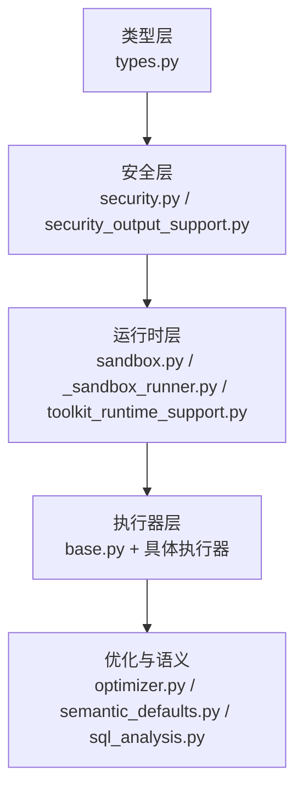

**图表来源**
- [tools/types.py:1-200](file://backend/app/ai/tools/types.py#L1-L200)
- [tools/security.py:1-200](file://backend/app/ai/tools/security.py#L1-L200)
- [tools/security_output_support.py:1-200](file://backend/app/ai/tools/security_output_support.py#L1-L200)
- [tools/sandbox.py:1-200](file://backend/app/ai/tools/sandbox.py#L1-L200)
- [tools/executors/base.py:1-200](file://backend/app/ai/tools/executors/base.py#L1-L200)
- [tools/optimizer.py:1-200](file://backend/app/ai/tools/optimizer.py#L1-L200)
- [tools/semantic_defaults.py:1-200](file://backend/app/ai/tools/semantic_defaults.py#L1-L200)
- [tools/sql_analysis.py:1-200](file://backend/app/ai/tools/sql_analysis.py#L1-L200)

## 详细组件分析

### 类型与注册机制
- 工具类型与参数：通过类型定义统一工具元信息（名称、描述、参数结构）与返回值约定，便于注册中心与路由解析。
- 注册机制：工具在初始化阶段注册到全局注册表，支持动态发现与版本化管理。
- 接口规范：所有执行器遵循统一的调用协议，包括输入校验、上下文注入、结果封装与异常处理。

**图表来源**
- [tools/types.py:1-200](file://backend/app/ai/tools/types.py#L1-L200)
- [tools/__init__.py:1-200](file://backend/app/ai/tools/__init__.py#L1-L200)

**章节来源**
- [tools/types.py:1-200](file://backend/app/ai/tools/types.py#L1-L200)
- [tools/__init__.py:1-200](file://backend/app/ai/tools/__init__.py#L1-L200)

### 执行器模式与内置工具
- 基类抽象：定义统一的执行接口、上下文注入与错误处理模板。
- 内置工具：JSON 操作、数学运算、时间处理等轻量工具，适合无外部依赖的快速计算与格式化。
- 执行流程：输入校验 → 上下文准备 → 执行 → 结果封装 → 输出过滤 → 返回。

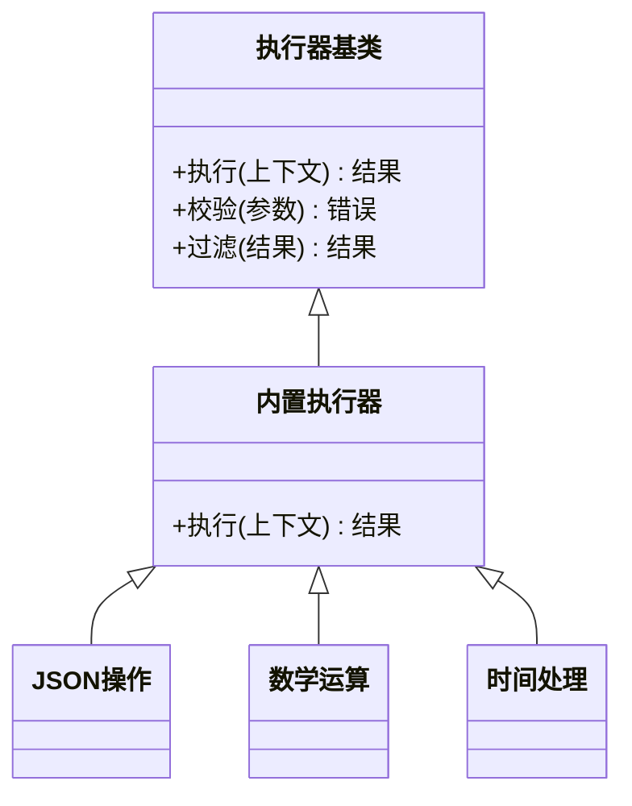

**图表来源**
- [tools/executors/base.py:1-200](file://backend/app/ai/tools/executors/base.py#L1-L200)
- [tools/executors/builtin_executor.py:1-200](file://backend/app/ai/tools/executors/builtin_executor.py#L1-L200)
- [tools/executors/builtin/json_ops.py:1-200](file://backend/app/ai/tools/executors/builtin/json_ops.py#L1-L200)
- [tools/executors/builtin/math_ops.py:1-200](file://backend/app/ai/tools/executors/builtin/math_ops.py#L1-L200)
- [tools/executors/builtin/time_ops.py:1-200](file://backend/app/ai/tools/executors/builtin/time_ops.py#L1-L200)

**章节来源**
- [tools/executors/base.py:1-200](file://backend/app/ai/tools/executors/base.py#L1-L200)
- [tools/executors/builtin_executor.py:1-200](file://backend/app/ai/tools/executors/builtin_executor.py#L1-L200)
- [tools/executors/builtin/json_ops.py:1-200](file://backend/app/ai/tools/executors/builtin/json_ops.py#L1-L200)
- [tools/executors/builtin/math_ops.py:1-200](file://backend/app/ai/tools/executors/builtin/math_ops.py#L1-L200)
- [tools/executors/builtin/time_ops.py:1-200](file://backend/app/ai/tools/executors/builtin/time_ops.py#L1-L200)

### HTTP 执行器
- 职责：发起 HTTP 请求，支持认证、重试、超时与响应过滤。
- 安全要点：仅允许白名单域名或受控网关；限制请求头与负载大小；启用 TLS 严格校验。
- 性能特点：连接池复用、并发限制、超时与重试策略降低延迟与失败率。

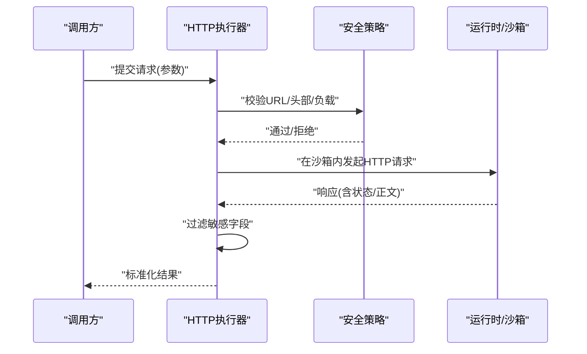

**图表来源**
- [tools/executors/http_executor.py:1-200](file://backend/app/ai/tools/executors/http_executor.py#L1-L200)
- [tools/security.py:1-200](file://backend/app/ai/tools/security.py#L1-L200)
- [tools/security_output_support.py:1-200](file://backend/app/ai/tools/security_output_support.py#L1-L200)
- [tools/sandbox.py:1-200](file://backend/app/ai/tools/sandbox.py#L1-L200)

**章节来源**
- [tools/executors/http_executor.py:1-200](file://backend/app/ai/tools/executors/http_executor.py#L1-L200)
- [tools/security.py:1-200](file://backend/app/ai/tools/security.py#L1-L200)
- [tools/security_output_support.py:1-200](file://backend/app/ai/tools/security_output_support.py#L1-L200)
- [tools/sandbox.py:1-200](file://backend/app/ai/tools/sandbox.py#L1-L200)

### 邮件执行器
- 职责：发送邮件，支持模板渲染、附件与收件人管理。
- 安全要点：仅允许配置域内的发件人；限制附件类型与大小；禁用脚本与动态内容。
- 性能特点：批量发送队列、速率限制与退避重试。

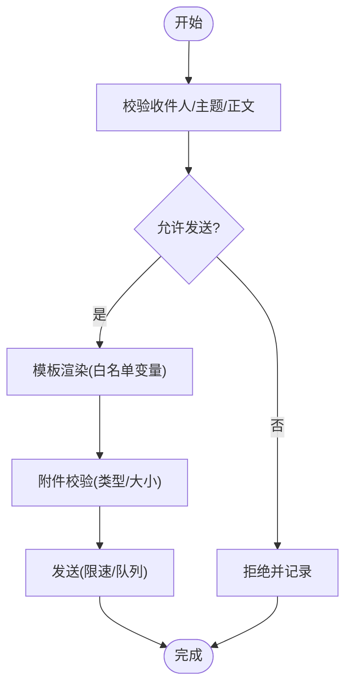

**图表来源**
- [tools/executors/email_executor.py:1-200](file://backend/app/ai/tools/executors/email_executor.py#L1-L200)
- [tools/security.py:1-200](file://backend/app/ai/tools/security.py#L1-L200)

**章节来源**
- [tools/executors/email_executor.py:1-200](file://backend/app/ai/tools/executors/email_executor.py#L1-L200)
- [tools/security.py:1-200](file://backend/app/ai/tools/security.py#L1-L200)

### 代码执行执行器
- 职责：在受控环境中执行用户提供的代码片段。
- 安全要点：严格的白名单函数/库、内存/CPU/IO 限制、网络隔离。
- 性能特点：短生命周期任务优先；长时间任务需分片与中断点。

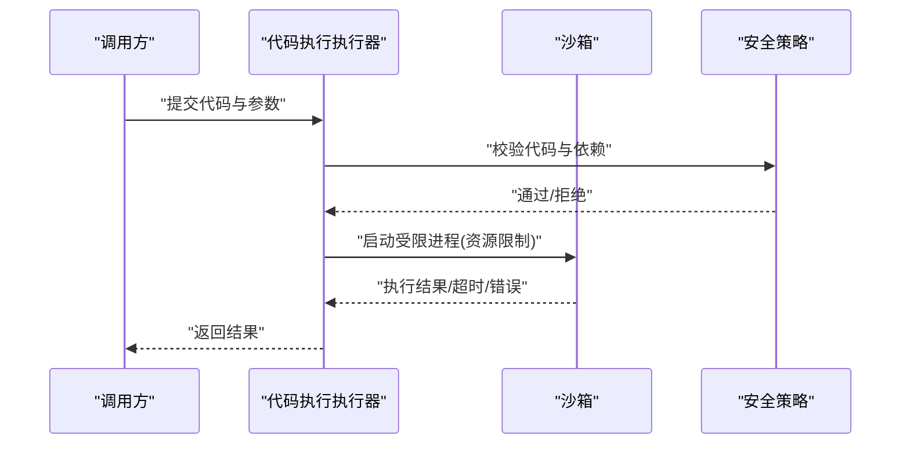

**图表来源**
- [tools/executors/code_execution_executor.py:1-200](file://backend/app/ai/tools/executors/code_execution_executor.py#L1-L200)
- [tools/sandbox.py:1-200](file://backend/app/ai/tools/sandbox.py#L1-L200)
- [tools/security.py:1-200](file://backend/app/ai/tools/security.py#L1-L200)

**章节来源**
- [tools/executors/code_execution_executor.py:1-200](file://backend/app/ai/tools/executors/code_execution_executor.py#L1-L200)
- [tools/sandbox.py:1-200](file://backend/app/ai/tools/sandbox.py#L1-L200)
- [tools/security.py:1-200](file://backend/app/ai/tools/security.py#L1-L200)

### Toolkit 执行器与运行时
- 职责：加载与执行 Toolkit 包中的工具集合，支持多工具编排与上下文传递。
- 安全要点：Toolkit 来源可信校验、清单签名、运行时权限最小化。
- 运行时：与沙箱与安全策略协同，提供稳定的执行环境。

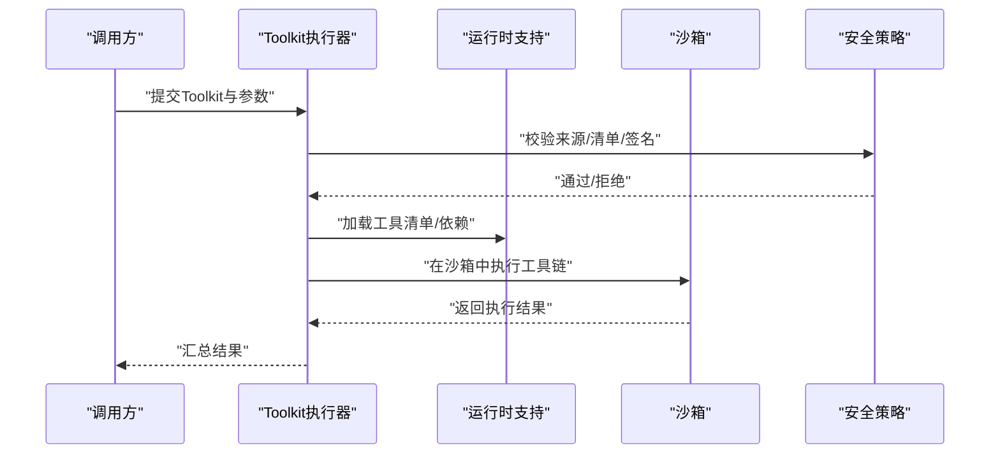

**图表来源**
- [tools/executors/toolkit_executor.py:1-200](file://backend/app/ai/tools/executors/toolkit_executor.py#L1-L200)
- [tools/executors/toolkit_runtime_support.py:1-200](file://backend/app/ai/tools/executors/toolkit_runtime_support.py#L1-L200)
- [tools/executors/_sandbox_runner.py:1-200](file://backend/app/ai/tools/executors/_sandbox_runner.py#L1-L200)
- [tools/executors/toolkit_security.py:1-200](file://backend/app/ai/tools/executors/toolkit_security.py#L1-L200)

**章节来源**
- [tools/executors/toolkit_executor.py:1-200](file://backend/app/ai/tools/executors/toolkit_executor.py#L1-L200)
- [tools/executors/toolkit_runtime_support.py:1-200](file://backend/app/ai/tools/executors/toolkit_runtime_support.py#L1-L200)
- [tools/executors/_sandbox_runner.py:1-200](file://backend/app/ai/tools/executors/_sandbox_runner.py#L1-L200)
- [tools/executors/toolkit_security.py:1-200](file://backend/app/ai/tools/executors/toolkit_security.py#L1-L200)

### 沙箱执行环境与资源限制
- 隔离机制：进程级隔离、命名空间隔离、文件系统只读挂载、网络出站白名单。
- 资源限制：CPU 时间配额、内存上限、文件句柄数、磁盘写入配额。
- 执行控制：超时强制终止、信号处理、资源审计日志。

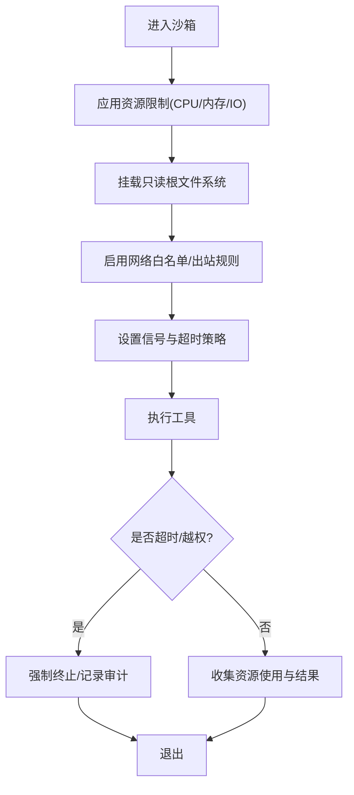

**图表来源**
- [tools/sandbox.py:1-200](file://backend/app/ai/tools/sandbox.py#L1-L200)
- [tools/executors/_sandbox_runner.py:1-200](file://backend/app/ai/tools/executors/_sandbox_runner.py#L1-L200)

**章节来源**
- [tools/sandbox.py:1-200](file://backend/app/ai/tools/sandbox.py#L1-L200)
- [tools/executors/_sandbox_runner.py:1-200](file://backend/app/ai/tools/executors/_sandbox_runner.py#L1-L200)

### 工具优化器与性能分析
- 实现原理：基于 SQL 分析与语义默认值，对工具选择与参数组合进行启发式优化，减少无效调用与重复计算。
- 性能分析：统计工具调用频次、平均耗时、失败率与资源占用，形成优化建议。
- 资源优化策略：缓存热点工具、合并相似请求、延迟加载与预热、异步批处理。

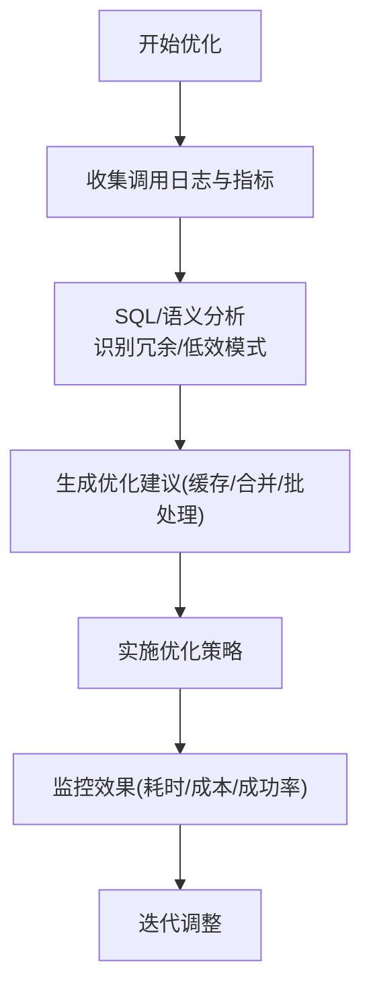

**图表来源**
- [tools/optimizer.py:1-200](file://backend/app/ai/tools/optimizer.py#L1-L200)
- [tools/sql_analysis.py:1-200](file://backend/app/ai/tools/sql_analysis.py#L1-L200)
- [tools/semantic_defaults.py:1-200](file://backend/app/ai/tools/semantic_defaults.py#L1-L200)

**章节来源**
- [tools/optimizer.py:1-200](file://backend/app/ai/tools/optimizer.py#L1-L200)
- [tools/sql_analysis.py:1-200](file://backend/app/ai/tools/sql_analysis.py#L1-L200)
- [tools/semantic_defaults.py:1-200](file://backend/app/ai/tools/semantic_defaults.py#L1-L200)

### 输入验证与输出过滤
- 输入验证：参数类型校验、范围约束、必填项检查、长度与字符集限制。
- 输出过滤：敏感字段脱敏、HTML/JS 清洗、URL 白名单、二进制附件合规检查。
- 审计与告警：记录关键操作与异常行为，触发告警与回滚。

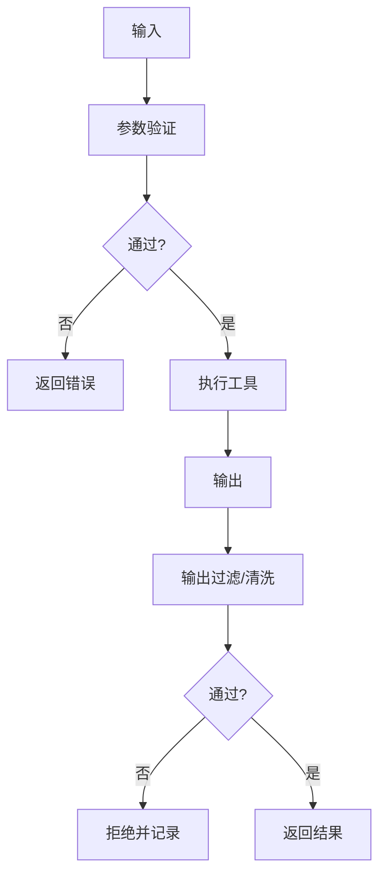

**图表来源**
- [tools/security.py:1-200](file://backend/app/ai/tools/security.py#L1-L200)
- [tools/security_output_support.py:1-200](file://backend/app/ai/tools/security_output_support.py#L1-L200)

**章节来源**
- [tools/security.py:1-200](file://backend/app/ai/tools/security.py#L1-L200)
- [tools/security_output_support.py:1-200](file://backend/app/ai/tools/security_output_support.py#L1-L200)

## 依赖关系分析
- 组件耦合：执行器依赖安全策略与沙箱；安全策略依赖运行时支持；优化器依赖 SQL 分析与语义默认值。
- 外部依赖：HTTP 执行器依赖网络栈与证书校验；代码执行执行器依赖解释器与沙箱；邮件执行器依赖 SMTP 与模板引擎。
- 循环依赖：通过接口与抽象避免直接循环，执行器通过基类解耦具体实现。

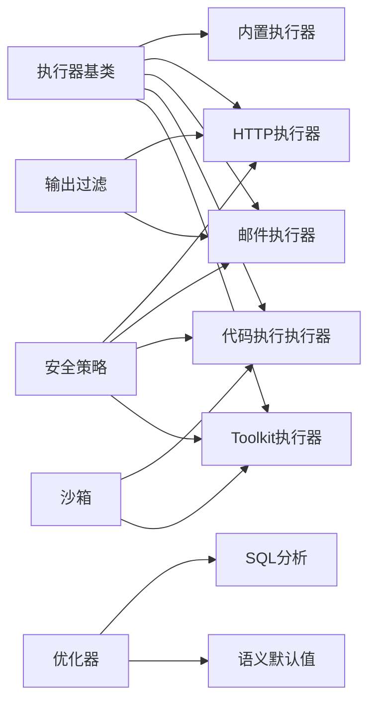

**图表来源**
- [tools/executors/base.py:1-200](file://backend/app/ai/tools/executors/base.py#L1-L200)
- [tools/executors/builtin_executor.py:1-200](file://backend/app/ai/tools/executors/builtin_executor.py#L1-L200)
- [tools/executors/http_executor.py:1-200](file://backend/app/ai/tools/executors/http_executor.py#L1-L200)
- [tools/executors/email_executor.py:1-200](file://backend/app/ai/tools/executors/email_executor.py#L1-L200)
- [tools/executors/code_execution_executor.py:1-200](file://backend/app/ai/tools/executors/code_execution_executor.py#L1-L200)
- [tools/executors/toolkit_executor.py:1-200](file://backend/app/ai/tools/executors/toolkit_executor.py#L1-L200)
- [tools/security.py:1-200](file://backend/app/ai/tools/security.py#L1-L200)
- [tools/security_output_support.py:1-200](file://backend/app/ai/tools/security_output_support.py#L1-L200)
- [tools/sandbox.py:1-200](file://backend/app/ai/tools/sandbox.py#L1-L200)
- [tools/optimizer.py:1-200](file://backend/app/ai/tools/optimizer.py#L1-L200)
- [tools/sql_analysis.py:1-200](file://backend/app/ai/tools/sql_analysis.py#L1-L200)
- [tools/semantic_defaults.py:1-200](file://backend/app/ai/tools/semantic_defaults.py#L1-L200)

**章节来源**
- [tools/executors/base.py:1-200](file://backend/app/ai/tools/executors/base.py#L1-L200)
- [tools/security.py:1-200](file://backend/app/ai/tools/security.py#L1-L200)
- [tools/sandbox.py:1-200](file://backend/app/ai/tools/sandbox.py#L1-L200)
- [tools/optimizer.py:1-200](file://backend/app/ai/tools/optimizer.py#L1-L200)
- [tools/sql_analysis.py:1-200](file://backend/app/ai/tools/sql_analysis.py#L1-L200)
- [tools/semantic_defaults.py:1-200](file://backend/app/ai/tools/semantic_defaults.py#L1-L200)

## 性能考虑
- 并发与限流：对 HTTP 与邮件执行器设置并发上限与速率限制，避免资源争用。
- 缓存与批处理：利用优化器建议缓存热点工具、合并相似请求，减少重复开销。
- 资源配额：为代码执行与 Toolkit 设置 CPU/内存/IO 配额，防止资源滥用。
- 监控与自适应：基于指标动态调整超时与重试策略，提升吞吐与稳定性。

## 故障排查指南
- 常见问题
  - 工具未注册：检查注册中心与工具清单，确认名称与版本匹配。
  - 安全拦截：查看安全策略日志，核对 URL/头部/负载是否在白名单。
  - 沙箱超时：检查资源限制与执行时间，必要时放宽配额或拆分任务。
  - 输出异常：确认输出过滤规则与敏感字段处理。
- 测试参考
  - 执行器安全测试：验证内置执行器的输入边界与异常分支。
  - 沙箱与 Toolkit 测试：覆盖资源限制、超时与权限控制。
  - 端到端测试：模拟完整调用链路，验证集成稳定性。

**章节来源**
- [tests/test_builtin_executor_safety.py:1-200](file://backend/tests/test_builtin_executor_safety.py#L1-L200)
- [tests/test_toolkit_executor.py:1-200](file://backend/tests/test_toolkit_executor.py#L1-L200)
- [tests/test_toolkit_sandbox.py:1-200](file://backend/tests/test_toolkit_sandbox.py#L1-L200)
- [tests/test_toolkit_parser.py:1-200](file://backend/tests/test_toolkit_parser.py#L1-L200)

## 结论
工具系统通过清晰的类型定义、集中式安全策略、强隔离的沙箱运行时与可扩展的执行器模式，实现了高安全性与高性能的工具编排能力。优化器与语义默认值进一步提升了工具选择与执行效率。建议在生产环境中持续完善监控与告警体系，并定期评估安全策略与资源配额的有效性。

## 附录
- 开发指南
  - 新增工具：定义类型与参数，编写执行器实现，接入安全策略与输出过滤。
  - 注册与发布：通过注册中心注册工具，维护版本与兼容性。
  - 测试要求：覆盖正常路径、边界条件与异常场景，确保安全与性能达标。
- 接口规范
  - 统一的输入/输出契约，明确错误码与日志字段。
  - 执行器必须实现校验、执行、过滤与异常处理接口。
- 最佳实践
  - 优先使用内置工具与受控 HTTP/邮件执行器。
  - 对代码执行与 Toolkit 使用严格的来源与权限控制。
  - 启用资源限制与超时策略，避免长尾任务影响系统稳定性。