# 执行引擎系统

<cite>
**本文引用的文件**
- [engine_bootstrap_support.py](file://backend/app/ai/engine/engine_bootstrap_support.py)
- [execution_state_machine.py](file://backend/app/ai/engine/execution_state_machine.py)
- [conversation.py](file://backend/app/ai/engine/conversation.py)
- [conversation_sync_entrypoint.py](file://backend/app/ai/engine/conversation_sync_entrypoint.py)
- [conversation_stream_entrypoint.py](file://backend/app/ai/engine/conversation_stream_entrypoint.py)
- [stream_handler.py](file://backend/app/ai/engine/stream_handler.py)
- [stream_execution_runtime.py](file://backend/app/ai/engine/stream_execution_runtime.py)
- [stream_generation_pipeline.py](file://backend/app/ai/engine/stream_generation_pipeline.py)
- [stream_finalization_pipeline.py](file://backend/app/ai/engine/stream_finalization_pipeline.py)
- [tool_processor.py](file://backend/app/ai/engine/tool_processor.py)
- [tool_processor_cache.py](file://backend/app/ai/engine/tool_processor_cache.py)
- [tool_processor_events.py](file://backend/app/ai/engine/tool_processor_events.py)
- [tool_processor_messages.py](file://backend/app/ai/engine/tool_processor_messages.py)
- [tool_call_loop_runtime.py](file://backend/app/ai/engine/tool_call_loop_runtime.py)
- [tool_call_loop_policy.py](file://backend/app/ai/engine/tool_call_loop_policy.py)
- [tool_router.py](file://backend/app/ai/engine/tool_router.py)
- [turn_executor.py](file://backend/app/ai/engine/turn_executor.py)
- [turn_executor_tool_batch.py](file://backend/app/ai/engine/turn_executor_tool_batch.py)
- [budget_guard.py](file://backend/app/ai/engine/budget_guard.py)
- [budget_helpers.py](file://backend/app/ai/engine/budget_helpers.py)
- [recovery_manager.py](file://backend/app/ai/engine/recovery_manager.py)
- [recovery_decision_policy.py](file://backend/app/ai/engine/recovery_decision_policy.py)
- [recovery_prompt_builders.py](file://backend/app/ai/engine/recovery_prompt_builders.py)
- [recovery_tool_result_helpers.py](file://backend/app/ai/engine/recovery_tool_result_helpers.py)
- [recovery_status_update.py](file://backend/app/ai/engine/recovery_status_update.py)
- [prepare_execution_pipeline.py](file://backend/app/ai/engine/prepare_execution_pipeline.py)
- [prepare_execution_runtime_helpers.py](file://backend/app/ai/engine/prepare_execution_runtime_helpers.py)
- [prepare_execution_tool_helpers.py](file://backend/app/ai/engine/prepare_execution_tool_helpers.py)
- [execution_preflight_support.py](file://backend/app/ai/engine/execution_preflight_support.py)
- [execution_postflight_support.py](file://backend/app/ai/engine/execution_postflight_support.py)
- [dispatcher.py](file://backend/app/ai/engine/dispatcher.py)
- [task.py](file://backend/app/ai/engine/task.py)
- [context/engine.py](file://backend/app/ai/context/engine.py)
- [context/engine_runtime_support.py](file://backend/app/ai/context/engine_runtime_support.py)
- [context/budget_manager.py](file://backend/app/ai/context/budget_manager.py)
- [context/budget_support.py](file://backend/app/ai/context/budget_support.py)
- [context/orchestrator.py](file://backend/app/ai/context/orchestrator.py)
- [context/pruning.py](file://backend/app/ai/context/pruning.py)
- [context/compaction_support.py](file://backend/app/ai/context/compaction_support.py)
- [context/assembly_initial_support.py](file://backend/app/ai/context/assembly_initial_support.py)
- [context/assembly_result_support.py](file://backend/app/ai/context/assembly_result_support.py)
- [context/prompt_addition_support.py](file://backend/app/ai/context/prompt_addition_support.py)
- [context/long_term_memory.py](file://backend/app/ai/context/long_term_memory.py)
- [context/decision_helpers.py](file://backend/app/ai/context/decision_helpers.py)
- [types.py](file://backend/app/ai/engine/types.py)
- [base_execution_support.py](file://backend/app/ai/engine/base_execution_support.py)
- [base_prompt_support.py](file://backend/app/ai/engine/base_prompt_support.py)
- [base_prompt_llm_support.py](file://backend/app/ai/engine/base_prompt_llm_support.py)
- [base_prompt_system_support.py](file://backend/app/ai/engine/base_prompt_system_support.py)
- [base_prompt_tool_policy_support.py](file://backend/app/ai/engine/base_prompt_tool_policy_support.py)
- [base_prompt_contract_support.py](file://backend/app/ai/engine/base_prompt_contract_support.py)
- [base_tool_loop_support.py](file://backend/app/ai/engine/base_tool_loop_support.py)
- [base_helpers.py](file://backend/app/ai/engine/base_helpers.py)
- [base_identity_support.py](file://backend/app/ai/engine/base_identity_support.py)
- [base_event_support.py](file://backend/app/ai/engine/base_event_support.py)
......
</cite>

## 目录
1. [引言](#引言)
2. [项目结构](#项目结构)
3. [核心组件](#核心组件)
4. [架构总览](#架构总览)
5. [详细组件分析](#详细组件分析)
6. [依赖关系分析](#依赖关系分析)
7. [性能考虑](#性能考虑)
8. [故障排查指南](#故障排查指南)
9. [结论](#结论)
10. [附录](#附录)

## 引言
本技术文档面向执行引擎系统，系统性阐述其整体架构设计、状态机实现、执行流程控制、对话处理引擎的会话管理与上下文维护、消息流转机制；同时覆盖调度器的任务分发与并发控制策略、预算守卫的成本控制与资源限制、错误恢复与异常处理及重试机制，并提供配置选项、性能监控与调试工具说明，以及实际使用示例与性能优化建议。

## 项目结构
执行引擎位于后端 AI 子系统中，核心模块分布在 backend/app/ai/engine 与 backend/app/ai/context 两个目录下。前者负责执行编排、状态机、流式处理、工具调用、预算与恢复等；后者负责上下文组装、预算管理、长期记忆、裁剪与压缩等。

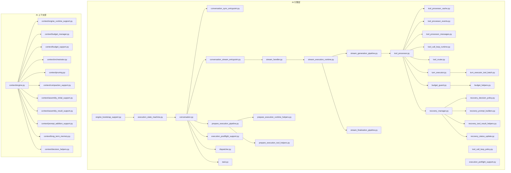

**图表来源**
- [engine_bootstrap_support.py](file://backend/app/ai/engine/engine_bootstrap_support.py)
- [execution_state_machine.py](file://backend/app/ai/engine/execution_state_machine.py)
- [conversation.py](file://backend/app/ai/engine/conversation.py)
- [conversation_sync_entrypoint.py](file://backend/app/ai/engine/conversation_sync_entrypoint.py)
- [conversation_stream_entrypoint.py](file://backend/app/ai/engine/conversation_stream_entrypoint.py)
- [stream_handler.py](file://backend/app/ai/engine/stream_handler.py)
- [stream_execution_runtime.py](file://backend/app/ai/engine/stream_execution_runtime.py)
- [stream_generation_pipeline.py](file://backend/app/ai/engine/stream_generation_pipeline.py)
- [stream_finalization_pipeline.py](file://backend/app/ai/engine/stream_finalization_pipeline.py)
- [tool_processor.py](file://backend/app/ai/engine/tool_processor.py)
- [tool_processor_cache.py](file://backend/app/ai/engine/tool_processor_cache.py)
- [tool_processor_events.py](file://backend/app/ai/engine/tool_processor_events.py)
- [tool_processor_messages.py](file://backend/app/ai/engine/tool_processor_messages.py)
- [tool_call_loop_runtime.py](file://backend/app/ai/engine/tool_call_loop_runtime.py)
- [tool_call_loop_policy.py](file://backend/app/ai/engine/tool_call_loop_policy.py)
- [tool_router.py](file://backend/app/ai/engine/tool_router.py)
- [turn_executor.py](file://backend/app/ai/engine/turn_executor.py)
- [turn_executor_tool_batch.py](file://backend/app/ai/engine/turn_executor_tool_batch.py)
- [budget_guard.py](file://backend/app/ai/engine/budget_guard.py)
- [budget_helpers.py](file://backend/app/ai/engine/budget_helpers.py)
- [recovery_manager.py](file://backend/app/ai/engine/recovery_manager.py)
- [recovery_decision_policy.py](file://backend/app/ai/engine/recovery_decision_policy.py)
- [recovery_prompt_builders.py](file://backend/app/ai/engine/recovery_prompt_builders.py)
- [recovery_tool_result_helpers.py](file://backend/app/ai/engine/recovery_tool_result_helpers.py)
- [recovery_status_update.py](file://backend/app/ai/engine/recovery_status_update.py)
- [prepare_execution_pipeline.py](file://backend/app/ai/engine/prepare_execution_pipeline.py)
- [prepare_execution_runtime_helpers.py](file://backend/app/ai/engine/prepare_execution_runtime_helpers.py)
- [prepare_execution_tool_helpers.py](file://backend/app/ai/engine/prepare_execution_tool_helpers.py)
- [execution_preflight_support.py](file://backend/app/ai/engine/execution_preflight_support.py)
- [execution_postflight_support.py](file://backend/app/ai/engine/execution_postflight_support.py)
- [dispatcher.py](file://backend/app/ai/engine/dispatcher.py)
- [task.py](file://backend/app/ai/engine/task.py)
- [context/engine.py](file://backend/app/ai/context/engine.py)
- [context/engine_runtime_support.py](file://backend/app/ai/context/engine_runtime_support.py)
- [context/budget_manager.py](file://backend/app/ai/context/budget_manager.py)
- [context/budget_support.py](file://backend/app/ai/context/budget_support.py)
- [context/orchestrator.py](file://backend/app/ai/context/orchestrator.py)
- [context/pruning.py](file://backend/app/ai/context/pruning.py)
- [context/compaction_support.py](file://backend/app/ai/context/compaction_support.py)
- [context/assembly_initial_support.py](file://backend/app/ai/context/assembly_initial_support.py)
- [context/assembly_result_support.py](file://backend/app/ai/context/assembly_result_support.py)
- [context/prompt_addition_support.py](file://backend/app/ai/context/prompt_addition_support.py)
- [context/long_term_memory.py](file://backend/app/ai/context/long_term_memory.py)
- [context/decision_helpers.py](file://backend/app/ai/context/decision_helpers.py)

**章节来源**
- [engine_bootstrap_support.py](file://backend/app/ai/engine/engine_bootstrap_support.py)
- [context/engine.py](file://backend/app/ai/context/engine.py)

## 核心组件
- 执行状态机：驱动会话从准备到执行再到收尾的生命周期状态转换。
- 对话入口与运行时：同步与流式两种执行模式，分别面向阻塞式响应与实时流式输出。
- 工具处理管线：包括工具选择、缓存、事件与消息处理、调用循环与批处理。
- 预算守卫与成本控制：在执行前/中/后进行预算检查与成本归集，防止超支。
- 恢复管理：基于决策策略构建恢复提示，对工具结果进行规范化与状态更新。
- 准备执行流水线：在执行前完成运行时环境、工具与参数的准备。
- 调度器与任务：将执行单元分发到合适的执行器并控制并发。
- 上下文引擎：负责上下文组装、预算支持、长期记忆、裁剪与压缩等。

**章节来源**
- [execution_state_machine.py](file://backend/app/ai/engine/execution_state_machine.py)
- [conversation_sync_entrypoint.py](file://backend/app/ai/engine/conversation_sync_entrypoint.py)
- [conversation_stream_entrypoint.py](file://backend/app/ai/engine/conversation_stream_entrypoint.py)
- [tool_processor.py](file://backend/app/ai/engine/tool_processor.py)
- [budget_guard.py](file://backend/app/ai/engine/budget_guard.py)
- [recovery_manager.py](file://backend/app/ai/engine/recovery_manager.py)
- [prepare_execution_pipeline.py](file://backend/app/ai/engine/prepare_execution_pipeline.py)
- [dispatcher.py](file://backend/app/ai/engine/dispatcher.py)
- [context/engine.py](file://backend/app/ai/context/engine.py)

## 架构总览
执行引擎采用“状态机驱动 + 流水线编排”的架构。会话由入口点触发，进入准备阶段，随后根据模式（同步/流式）进入执行运行时，期间通过工具处理器完成工具选择与调用，预算守卫持续监控成本，恢复管理在异常时介入。最终进入收尾阶段，产出最终结果或流式结束信号。

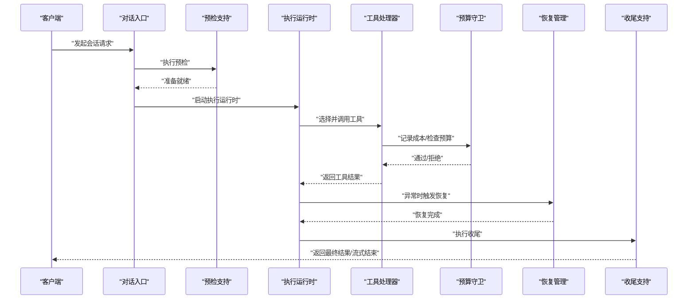

**图表来源**
- [conversation.py](file://backend/app/ai/engine/conversation.py)
- [execution_preflight_support.py](file://backend/app/ai/engine/execution_preflight_support.py)
- [stream_execution_runtime.py](file://backend/app/ai/engine/stream_execution_runtime.py)
- [tool_processor.py](file://backend/app/ai/engine/tool_processor.py)
- [budget_guard.py](file://backend/app/ai/engine/budget_guard.py)
- [recovery_manager.py](file://backend/app/ai/engine/recovery_manager.py)
- [execution_postflight_support.py](file://backend/app/ai/engine/execution_postflight_support.py)

## 详细组件分析

### 执行状态机
- 设计要点：以状态枚举与状态转移函数为核心，定义“准备”“执行中”“流式生成中”“收尾”“完成/失败”等状态，确保执行过程可追踪、可回放。
- 关键行为：在状态切换时触发钩子（如预算检查、上下文写入、事件广播），保证跨模块协作的一致性。
- 复杂度：状态转移为 O(1)，整体开销极低；状态数量有限，便于测试与验证。

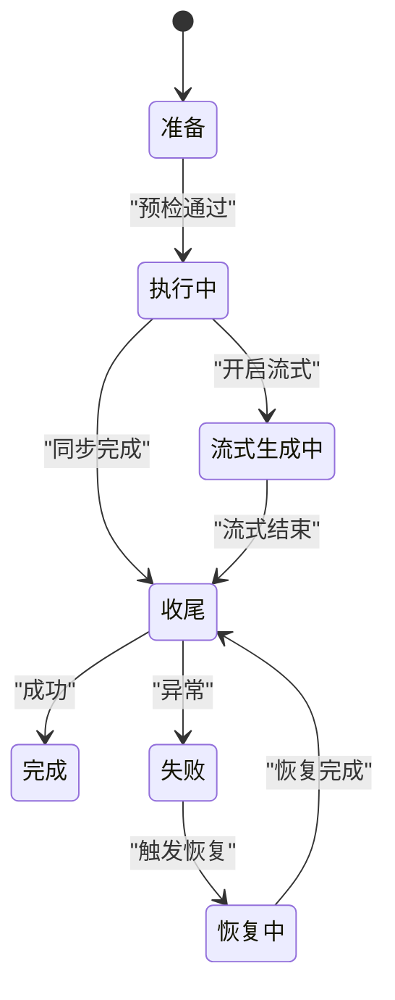

**图表来源**
- [execution_state_machine.py](file://backend/app/ai/engine/execution_state_machine.py)

**章节来源**
- [execution_state_machine.py](file://backend/app/ai/engine/execution_state_machine.py)

### 对话处理引擎与会话管理
- 会话入口：提供同步与流式两种入口，分别封装 IO 适配与结果投影逻辑。
- 运行时桥接：将会话上下文与执行运行时解耦，通过桥接层传递必要信息。
- 结果投影：将中间结果投影为统一格式，便于上层消费与展示。

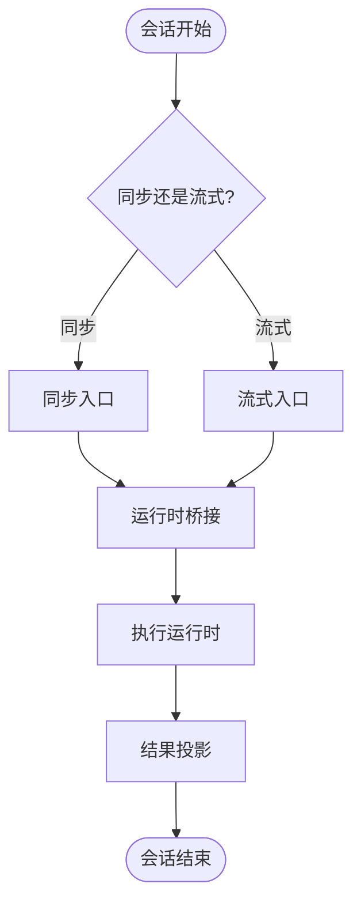

**图表来源**
- [conversation_sync_entrypoint.py](file://backend/app/ai/engine/conversation_sync_entrypoint.py)
- [conversation_stream_entrypoint.py](file://backend/app/ai/engine/conversation_stream_entrypoint.py)
- [conversation_runtime_bridge.py](file://backend/app/ai/engine/conversation_runtime_bridge.py)
- [conversation_result_projector.py](file://backend/app/ai/engine/conversation_result_projector.py)

**章节来源**
- [conversation_sync_entrypoint.py](file://backend/app/ai/engine/conversation_sync_entrypoint.py)
- [conversation_stream_entrypoint.py](file://backend/app/ai/engine/conversation_stream_entrypoint.py)
- [conversation_runtime_bridge.py](file://backend/app/ai/engine/conversation_runtime_bridge.py)
- [conversation_result_projector.py](file://backend/app/ai/engine/conversation_result_projector.py)

### 工具处理管线与调用循环
- 工具处理器：负责工具选择、参数构造、调用执行、结果缓存与事件记录。
- 缓存与事件：对工具调用结果进行缓存，减少重复调用；记录事件以便审计与回放。
- 调用循环：在多轮对话中维持会话状态，按策略决定是否继续调用工具。
- 批处理：对工具调用进行批量化，提升吞吐量。

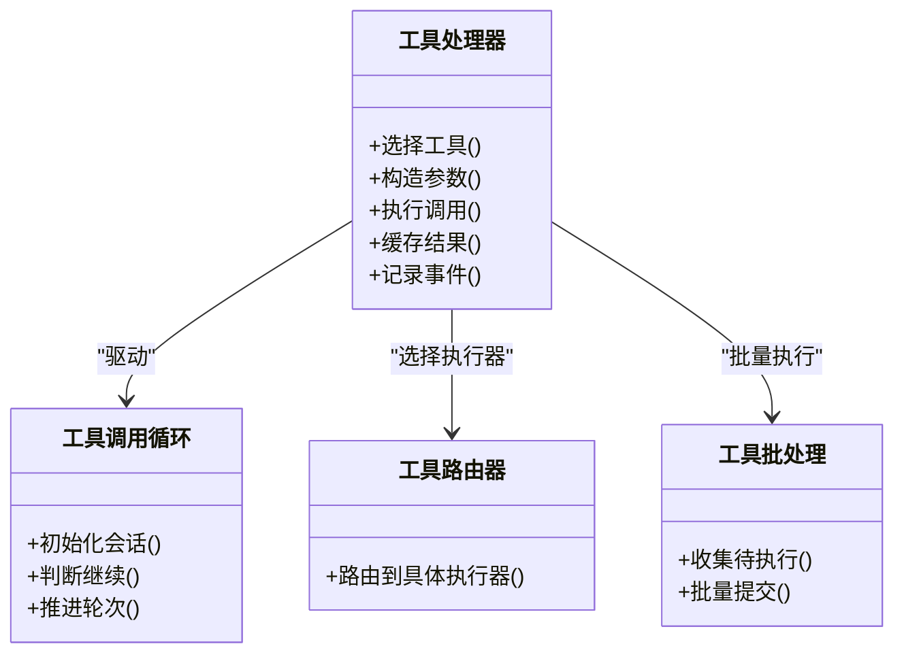

**图表来源**
- [tool_processor.py](file://backend/app/ai/engine/tool_processor.py)
- [tool_call_loop_runtime.py](file://backend/app/ai/engine/tool_call_loop_runtime.py)
- [tool_router.py](file://backend/app/ai/engine/tool_router.py)
- [turn_executor_tool_batch.py](file://backend/app/ai/engine/turn_executor_tool_batch.py)

**章节来源**
- [tool_processor.py](file://backend/app/ai/engine/tool_processor.py)
- [tool_processor_cache.py](file://backend/app/ai/engine/tool_processor_cache.py)
- [tool_processor_events.py](file://backend/app/ai/engine/tool_processor_events.py)
- [tool_processor_messages.py](file://backend/app/ai/engine/tool_processor_messages.py)
- [tool_call_loop_runtime.py](file://backend/app/ai/engine/tool_call_loop_runtime.py)
- [tool_call_loop_policy.py](file://backend/app/ai/engine/tool_call_loop_policy.py)
- [tool_router.py](file://backend/app/ai/engine/tool_router.py)
- [turn_executor_tool_batch.py](file://backend/app/ai/engine/turn_executor_tool_batch.py)

### 预算守卫与成本控制
- 预算检查：在执行前、执行中、收尾阶段分别进行预算检查，避免超支。
- 成本归集：对 LLM 调用、工具调用等进行成本归集，支持按模型、工具、会话维度统计。
- 资源限制：结合时间片、并发数、内存占用等指标进行资源限制。

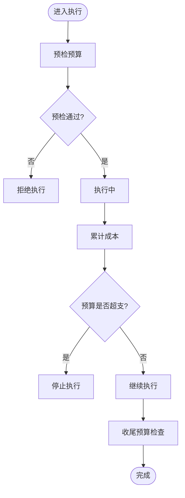

**图表来源**
- [budget_guard.py](file://backend/app/ai/engine/budget_guard.py)
- [budget_helpers.py](file://backend/app/ai/engine/budget_helpers.py)

**章节来源**
- [budget_guard.py](file://backend/app/ai/engine/budget_guard.py)
- [budget_helpers.py](file://backend/app/ai/engine/budget_helpers.py)

### 错误恢复与异常处理
- 决策策略：根据错误类型与上下文制定恢复策略（重试、降级、终止）。
- 提示构建：针对工具调用失败或 LLM 输出异常，构建恢复提示引导系统修正。
- 结果规范化：对工具结果进行规范化处理，确保后续流程稳定。
- 状态更新：在恢复完成后更新会话状态，保证一致性。

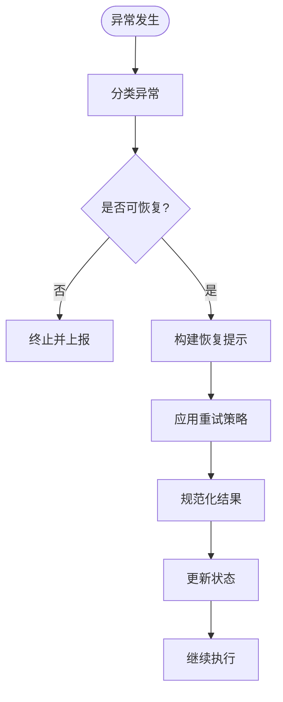

**图表来源**
- [recovery_manager.py](file://backend/app/ai/engine/recovery_manager.py)
- [recovery_decision_policy.py](file://backend/app/ai/engine/recovery_decision_policy.py)
- [recovery_prompt_builders.py](file://backend/app/ai/engine/recovery_prompt_builders.py)
- [recovery_tool_result_helpers.py](file://backend/app/ai/engine/recovery_tool_result_helpers.py)
- [recovery_status_update.py](file://backend/app/ai/engine/recovery_status_update.py)

**章节来源**
- [recovery_manager.py](file://backend/app/ai/engine/recovery_manager.py)
- [recovery_decision_policy.py](file://backend/app/ai/engine/recovery_decision_policy.py)
- [recovery_prompt_builders.py](file://backend/app/ai/engine/recovery_prompt_builders.py)
- [recovery_tool_result_helpers.py](file://backend/app/ai/engine/recovery_tool_result_helpers.py)
- [recovery_status_update.py](file://backend/app/ai/engine/recovery_status_update.py)

### 准备执行流水线
- 运行时准备：构建执行所需的运行时环境（模型、网关、凭据等）。
- 工具准备：解析工具定义、参数校验、权限检查。
- 前置支持：执行前的预检与初始化，确保资源可用。

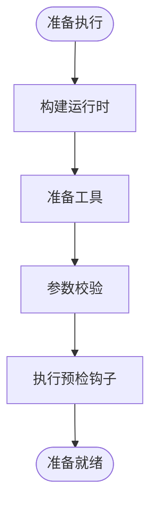

**图表来源**
- [prepare_execution_pipeline.py](file://backend/app/ai/engine/prepare_execution_pipeline.py)
- [prepare_execution_runtime_helpers.py](file://backend/app/ai/engine/prepare_execution_runtime_helpers.py)
- [prepare_execution_tool_helpers.py](file://backend/app/ai/engine/prepare_execution_tool_helpers.py)
- [execution_preflight_support.py](file://backend/app/ai/engine/execution_preflight_support.py)

**章节来源**
- [prepare_execution_pipeline.py](file://backend/app/ai/engine/prepare_execution_pipeline.py)
- [prepare_execution_runtime_helpers.py](file://backend/app/ai/engine/prepare_execution_runtime_helpers.py)
- [prepare_execution_tool_helpers.py](file://backend/app/ai/engine/prepare_execution_tool_helpers.py)
- [execution_preflight_support.py](file://backend/app/ai/engine/execution_preflight_support.py)

### 调度器与并发控制
- 任务分发：根据执行器能力与负载进行任务分发，避免热点。
- 并发控制：通过队列、令牌桶、限流器控制并发度，防止过载。
- 优先级与抢占：支持优先级队列与任务抢占，保障关键任务及时执行。

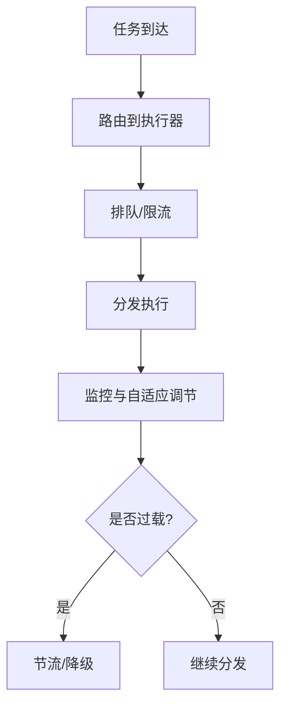

**图表来源**
- [dispatcher.py](file://backend/app/ai/engine/dispatcher.py)
- [task.py](file://backend/app/ai/engine/task.py)

**章节来源**
- [dispatcher.py](file://backend/app/ai/engine/dispatcher.py)
- [task.py](file://backend/app/ai/engine/task.py)

### 上下文引擎与长期记忆
- 上下文组装：将历史消息、系统提示、工具输出等组装为上下文。
- 预预估与裁剪：在上下文过长时进行裁剪，保留关键信息。
- 长期记忆：维护长期记忆片段，支持跨会话检索与融合。
- 压缩与快照：定期压缩上下文，生成快照以加速回放。

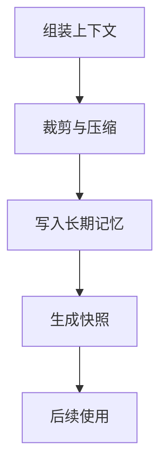

**图表来源**
- [context/engine.py](file://backend/app/ai/context/engine.py)
- [context/orchestrator.py](file://backend/app/ai/context/orchestrator.py)
- [context/pruning.py](file://backend/app/ai/context/pruning.py)
- [context/compaction_support.py](file://backend/app/ai/context/compaction_support.py)
- [context/assembly_initial_support.py](file://backend/app/ai/context/assembly_initial_support.py)
- [context/assembly_result_support.py](file://backend/app/ai/context/assembly_result_support.py)
- [context/prompt_addition_support.py](file://backend/app/ai/context/prompt_addition_support.py)
- [context/long_term_memory.py](file://backend/app/ai/context/long_term_memory.py)
- [context/decision_helpers.py](file://backend/app/ai/context/decision_helpers.py)

**章节来源**
- [context/engine.py](file://backend/app/ai/context/engine.py)
- [context/orchestrator.py](file://backend/app/ai/context/orchestrator.py)
- [context/pruning.py](file://backend/app/ai/context/pruning.py)
- [context/compaction_support.py](file://backend/app/ai/context/compaction_support.py)
- [context/assembly_initial_support.py](file://backend/app/ai/context/assembly_initial_support.py)
- [context/assembly_result_support.py](file://backend/app/ai/context/assembly_result_support.py)
- [context/prompt_addition_support.py](file://backend/app/ai/context/prompt_addition_support.py)
- [context/long_term_memory.py](file://backend/app/ai/context/long_term_memory.py)
- [context/decision_helpers.py](file://backend/app/ai/context/decision_helpers.py)

## 依赖关系分析
- 组件内聚：执行状态机、对话入口、工具处理器、预算守卫、恢复管理各自职责清晰，内聚度高。
- 组件耦合：通过运行时桥接与上下文引擎进行松耦合交互；预算与恢复模块通过接口与回调与主流程解耦。
- 外部依赖：依赖模型网关、工具执行器、存储与缓存服务；通过适配器与抽象层屏蔽差异。

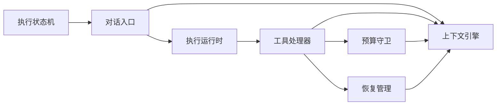

**图表来源**
- [execution_state_machine.py](file://backend/app/ai/engine/execution_state_machine.py)
- [conversation.py](file://backend/app/ai/engine/conversation.py)
- [stream_execution_runtime.py](file://backend/app/ai/engine/stream_execution_runtime.py)
- [tool_processor.py](file://backend/app/ai/engine/tool_processor.py)
- [budget_guard.py](file://backend/app/ai/engine/budget_guard.py)
- [recovery_manager.py](file://backend/app/ai/engine/recovery_manager.py)
- [context/engine.py](file://backend/app/ai/context/engine.py)

**章节来源**
- [execution_state_machine.py](file://backend/app/ai/engine/execution_state_machine.py)
- [conversation.py](file://backend/app/ai/engine/conversation.py)
- [stream_execution_runtime.py](file://backend/app/ai/engine/stream_execution_runtime.py)
- [tool_processor.py](file://backend/app/ai/engine/tool_processor.py)
- [budget_guard.py](file://backend/app/ai/engine/budget_guard.py)
- [recovery_manager.py](file://backend/app/ai/engine/recovery_manager.py)
- [context/engine.py](file://backend/app/ai/context/engine.py)

## 性能考虑
- 流式输出：优先使用流式入口，降低首字延迟，提升用户体验。
- 工具批处理：合并同类工具调用，减少网络往返与序列化开销。
- 缓存策略：对昂贵工具调用结果进行缓存，命中率高的场景收益显著。
- 预算与限流：在高峰期动态调整预算阈值与并发上限，避免雪崩。
- 上下文压缩：启用裁剪与压缩，缩短上下文长度，提高推理速度。
- 监控与采样：对关键路径进行采样监控，定位瓶颈与异常。

## 故障排查指南
- 启动与预检失败：检查预检支持与运行时准备日志，确认模型与工具可用性。
- 工具调用异常：查看工具处理器事件与缓存，定位参数与权限问题。
- 预算超支：核对预算守卫日志与成本归集，调整阈值或优化调用链。
- 恢复循环：检查恢复决策策略与提示构建，避免无效重试。
- 上下文膨胀：启用裁剪与压缩，定期清理长期记忆碎片。

**章节来源**
- [execution_preflight_support.py](file://backend/app/ai/engine/execution_preflight_support.py)
- [tool_processor_events.py](file://backend/app/ai/engine/tool_processor_events.py)
- [budget_guard.py](file://backend/app/ai/engine/budget_guard.py)
- [recovery_decision_policy.py](file://backend/app/ai/engine/recovery_decision_policy.py)
- [context/pruning.py](file://backend/app/ai/context/pruning.py)
- [context/compaction_support.py](file://backend/app/ai/context/compaction_support.py)

## 结论
执行引擎通过状态机驱动与流水线编排实现了高可靠、可扩展的对话执行能力。配合预算守卫与恢复管理，系统在成本控制与异常处理方面具备稳健性。上下文引擎进一步增强了长期记忆与上下文管理能力。建议在生产环境中启用流式输出、批处理与缓存策略，并结合监控与采样进行持续优化。

## 附录
- 配置选项：预算阈值、并发上限、批处理大小、缓存 TTL、恢复重试次数与退避策略、上下文裁剪比例等。
- 性能监控：关键指标包括首字延迟、吞吐量、预算使用率、工具调用成功率、恢复触发频率、上下文长度分布。
- 调试工具：事件回放、状态机可视化、预算轨迹追踪、工具调用审计日志、上下文快照导出。