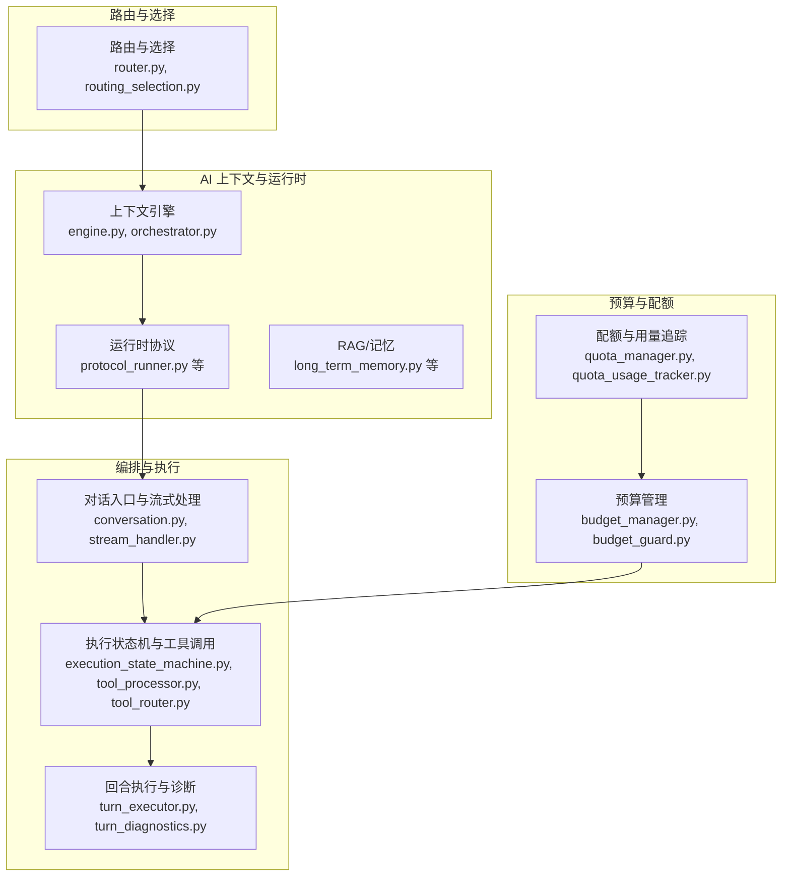
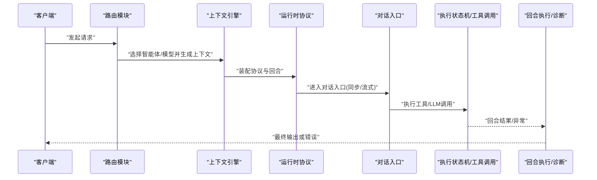
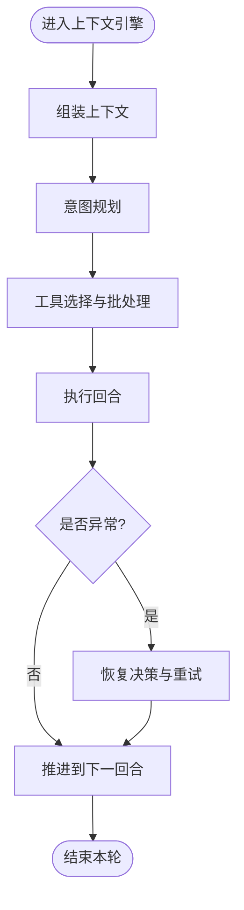
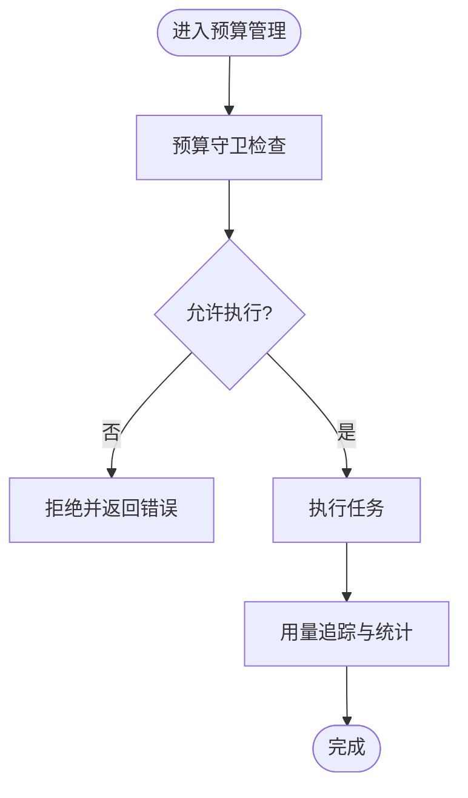
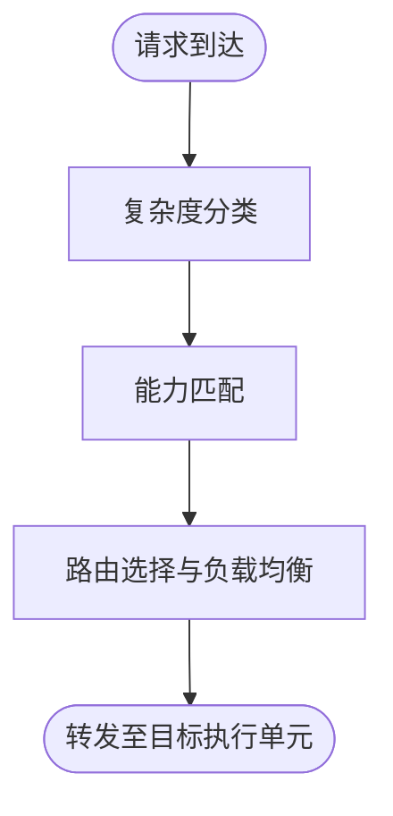
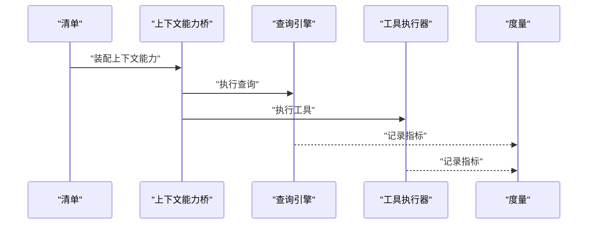
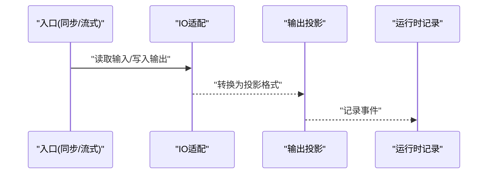
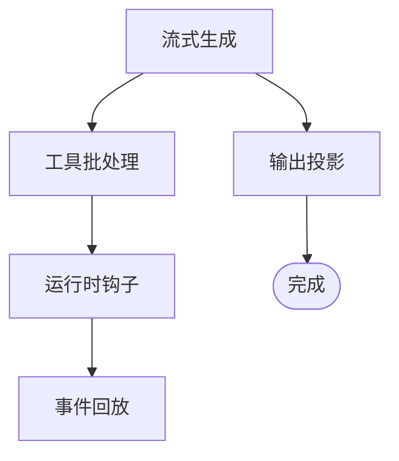
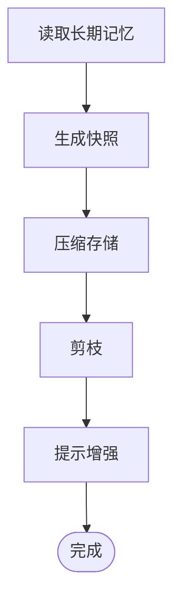

# 智能体管理系统

<cite>
**本文引用的文件**
- [engine.py](file://backend/app/ai/context/engine.py)
- [orchestrator.py](file://backend/app/ai/context/orchestrator.py)
- [budget_manager.py](file://backend/app/ai/context/budget_manager.py)
- [router.py](file://backend/app/ai/routing/router.py)
- [routing_selection.py](file://backend/app/ai/routing/routing_selection.py)
- [runtime.py](file://backend/app/ai/runtime/protocol_runner.py)
- [usage_metrics.py](file://backend/app/ai/runtime/usage_metrics.py)
- [quota_manager.py](file://backend/app/ai/quota_manager.py)
- [quota_models.py](file://backend/app/ai/quota_models.py)
- [quota_usage_tracker.py](file://backend/app/ai/quota_usage_tracker.py)
- [conversation.py](file://backend/app/ai/engine/conversation.py)
- [stream_handler.py](file://backend/app/ai/engine/stream_handler.py)
- [tool_processor.py](file://backend/app/ai/engine/tool_processor.py)
- [tool_router.py](file://backend/app/ai/engine/tool_router.py)
- [execution_state_machine.py](file://backend/app/ai/engine/execution_state_machine.py)
- [context_assembler.py](file://backend/app/ai/runtime/context_assembler.py)
- [context_capability_bridge.py](file://backend/app/ai/runtime/context_capability_bridge.py)
- [contracts.py](file://backend/app/ai/runtime/contracts.py)
- [manifest.py](file://backend/app/ai/runtime/manifest.py)
- [query_engine.py](file://backend/app/ai/runtime/query_engine.py)
- [tool_executor.py](file://backend/app/ai/runtime/tool_executor.py)
- [types.py](file://backend/app/ai/engine/types.py)
- [budget_guard.py](file://backend/app/ai/engine/budget_guard.py)
- [intent_planner.py](file://backend/app/ai/engine/intent_planner.py)
- [turn_executor.py](file://backend/app/ai/engine/turn_executor.py)
- [stream_execution_runtime.py](file://backend/app/ai/engine/stream_execution_runtime.py)
- [stream_generation_pipeline.py](file://backend/app/ai/engine/stream_generation_pipeline.py)
- [stream_output_projection.py](file://backend/app/ai/engine/stream_output_projection.py)
- [stream_runtime_record_support.py](file://backend/app/ai/engine/stream_runtime_record_support.py)
- [stream_tool_call_helpers.py](file://backend/app/ai/engine/stream_tool_call_helpers.py)
- [stream_tool_batch_runtime.py](file://backend/app/ai/engine/stream_tool_batch_runtime.py)
- [stream_completion_support.py](file://backend/app/ai/engine/stream_completion_support.py)
- [stream_error_utils.py](file://backend/app/ai/engine/stream_error_utils.py)
- [stream_runtime_hooks.py](file://backend/app/ai/engine/stream_runtime_hooks.py)
- [stream_runtime_contract.py](file://backend/app/ai/engine/stream_runtime_contract.py)
- [stream_replay_events.py](file://backend/app/ai/engine/stream_replay_events.py)
- [stream_generation_view.py](file://backend/app/ai/engine/stream_generation_view.py)
- [conversation_runtime_context_builder.py](file://backend/app/ai/engine/conversation_runtime_context_builder.py)
- [conversation_runtime_entrypoint_runner.py](file://backend/app/ai/engine/conversation_runtime_entrypoint_runner.py)
- [conversation_runtime_preflight.py](file://backend/app/ai/engine/conversation_runtime_preflight.py)
- [conversation_sync_io_adapter.py](file://backend/app/ai/engine/conversation_sync_io_adapter.py)
- [conversation_sync_result_support.py](file://backend/app/ai/engine/conversation_sync_result_support.py)
- [conversation_sync_io_support.py](file://backend/app/ai/engine/conversation_sync_io_support.py)
- [conversation_sync_entrypoint.py](file://backend/app/ai/engine/conversation_sync_entrypoint.py)
- [conversation_stream_entrypoint.py](file://backend/app/ai/engine/conversation_stream_entrypoint.py)
- [conversation_helpers.py](file://backend/app/ai/engine/conversation_helpers.py)
- [conversation_result_projector.py](file://backend/app/ai/engine/conversation_result_projector.py)
- [conversation_entrypoints.py](file://backend/app/ai/engine/conversation_entrypoints.py)
- [conversation_runtime_bridge.py](file://backend/app/ai/engine/conversation_runtime_bridge.py)
- [conversation_facade_support.py](file://backend/app/ai/engine/conversation_facade_support.py)
- [long_term_memory.py](file://backend/app/ai/context/long_term_memory.py)
- [compaction_snapshot_store.py](file://backend/app/ai/context/compaction_snapshot_store.py)
- [compaction_support.py](file://backend/app/ai/context/compaction_support.py)
- [pruning.py](file://backend/app/ai/context/pruning.py)
- [prompt_addition_support.py](file://backend/app/ai/context/prompt_addition_support.py)
- [decision_helpers.py](file://backend/app/ai/context/decision_helpers.py)
- [assembly_initial_support.py](file://backend/app/ai/context/assembly_initial_support.py)
- [assembly_result_support.py](file://backend/app/ai/context/assembly_result_support.py)
- [engine_runtime_support.py](file://backend/app/ai/context/engine_runtime_support.py)
- [path_selector.py](file://backend/app/ai/engine/path_selector.py)
- [prepare_execution_pipeline.py](file://backend/app/ai/engine/prepare_execution_pipeline.py)
- [prepare_execution_tool_helpers.py](file://backend/app/ai/engine/prepare_execution_tool_helpers.py)
- [prepare_execution_runtime_helpers.py](file://backend/app/ai/engine/prepare_execution_runtime_helpers.py)
- [tool_execution_helpers.py](file://backend/app/ai/engine/tool_execution_helpers.py)
- [tool_round_execution_helpers.py](file://backend/app/ai/engine/tool_round_execution_helpers.py)
- [tool_call_loop_runtime.py](file://backend/app/ai/engine/tool_call_loop_runtime.py)
- [tool_call_loop_policy.py](file://backend/app/ai/engine/tool_call_loop_policy.py)
- [tool_call_loop_callbacks_factory.py](file://backend/app/ai/engine/tool_call_loop_callbacks_factory.py)
- [tool_followup_runner.py](file://backend/app/ai/engine/tool_followup_runner.py)
- [tool_loop_session.py](file://backend/app/ai/engine/tool_loop_session.py)
- [tool_policy_helpers.py](file://backend/app/ai/engine/tool_policy_helpers.py)
- [tool_policy_intent_helpers.py](file://backend/app/ai/engine/tool_policy_intent_helpers.py)
- [tool_policy_message_helpers.py](file://backend/app/ai/engine/tool_policy_message_helpers.py)
- [tool_policy_selection_helpers.py](file://backend/app/ai/engine/tool_policy_selection_helpers.py)
- [tool_policy_semantics.py](file://backend/app/ai/engine/tool_policy_semantics.py)
- [tool_policy_trust_helpers.py](file://backend/app/ai/engine/tool_policy_trust_helpers.py)
- [tool_processor_args.py](file://backend/app/ai/engine/tool_processor_args.py)
- [tool_processor_cache.py](file://backend/app/ai/engine/tool_processor_cache.py)
- [tool_processor_events.py](file://backend/app/ai/engine/tool_processor_events.py)
- [tool_processor_messages.py](file://backend/app/ai/engine/tool_processor_messages.py)
- [tool_contract_breach_analysis.py](file://backend/app/ai/engine/tool_contract_breach_analysis.py)
- [tool_contract_diagnostics.py](file://backend/app/ai/engine/tool_contract_diagnostics.py)
- [tool_contract_evidence.py](file://backend/app/ai/engine/tool_contract_evidence.py)
- [tool_contract_retry_helpers.py](file://backend/app/ai/engine/tool_contract_retry_helpers.py)
- [tool_contract_retry_policies.py](file://backend/app/ai/engine/tool_contract_retry_policies.py)
- [recovery_manager.py](file://backend/app/ai/engine/recovery_manager.py)
- [recovery_decision_policy.py](file://backend/app/ai/engine/recovery_decision_policy.py)
- [recovery_consent_helpers.py](file://backend/app/ai/engine/recovery_consent_helpers.py)
- [recovery_prompt_builders.py](file://backend/app/ai/engine/recovery_prompt_builders.py)
- [recovery_result_normalizer.py](file://backend/app/ai/engine/recovery_result_normalizer.py)
- [recovery_status_update.py](file://backend/app/ai/engine/recovery_status_update.py)
- [recovery_tool_result_helpers.py](file://backend/app/ai/engine/recovery_tool_result_helpers.py)
- [failure_classifier.py](file://backend/app/ai/engine/failure_classifier.py)
- [final_output_policy.py](file://backend/app/ai/engine/final_output_policy.py)
- [intent_clause_helpers.py](file://backend/app/ai/engine/intent_clause_helpers.py)
- [intent_domain_rules.py](file://backend/app/ai/engine/intent_domain_rules.py)
- [intent_domain_rules_terms.py](file://backend/app/ai/engine/intent_domain_rules_terms.py)
- [intent_plan_accessors.py](file://backend/app/ai/engine/intent_plan_accessors.py)
- [intent_runtime_accessors.py](file://backend/app/ai/engine/intent_runtime_accessors.py)
- [intent_signal_helpers.py](file://backend/app/ai/engine/intent_signal_helpers.py)
- [llm_call_helpers.py](file://backend/app/ai/engine/llm_call_helpers.py)
- [model_policy.py](file://backend/app/ai/engine/model_policy.py)
- [output_parser.py](file://backend/app/ai/engine/output_parser.py)
- [system_prompt_helpers.py](file://backend/app/ai/engine/system_prompt_helpers.py)
- [system_prompt_intent_helpers.py](file://backend/app/ai/engine/system_prompt_intent_helpers.py)
- [system_prompt_rendering.py](file://backend/app/ai/engine/system_prompt_rendering.py)
- [system_prompt_runtime_summary.py](file://backend/app/ai/engine/system_prompt_runtime_summary.py)
- [system_prompt_capability_decisions.py](file://backend/app/ai/engine/system_prompt_capability_decisions.py)
- [system_prompt_capability_hints.py](file://backend/app/ai/engine/system_prompt_capability_hints.py)
- [task.py](file://backend/app/ai/engine/task.py)
- [image_generation.py](file://backend/app/ai/engine/image_generation.py)
- [turn_diagnostics.py](file://backend/app/ai/engine/turn_diagnostics.py)
- [turn_executor_contracts.py](file://backend/app/ai/engine/turn_executor_contracts.py)
- [turn_executor_tool_batch.py](file://backend/app/ai/engine/turn_executor_tool_batch.py)
- [turn_flow_projector.py](file://backend/app/ai/engine/turn_flow_projector.py)
- [batch.py](file://backend/app/ai/engine/batch.py)
- [dispatcher.py](file://backend/app/ai/engine/dispatcher.py)
- [engine_bootstrap_support.py](file://backend/app/ai/engine/engine_bootstrap_support.py)
- [execution_postflight_support.py](file://backend/app/ai/engine/execution_postflight_support.py)
- [execution_preflight_support.py](file://backend/app/ai/engine/execution_preflight_support.py)
- [contract_diagnostics_helpers.py](file://backend/app/ai/engine/contract_diagnostics_helpers.py)
- [base.py](file://backend/app/ai/engine/base.py)
- [base_event_support.py](file://backend/app/ai/engine/base_event_support.py)
- [base_execution_support.py](file://backend/app/ai/engine/base_execution_support.py)
- [base_helpers.py](file://backend/app/ai/engine/base_helpers.py)
- [base_identity_support.py](file://backend/app/ai/engine/base_identity_support.py)
- [base_prompt_contract_support.py](file://backend/app/ai/engine/base_prompt_contract_support.py)
- [base_prompt_llm_support.py](file://backend/app/ai/engine/base_prompt_llm_support.py)
- [base_prompt_support.py](file://backend/app/ai/engine/base_prompt_support.py)
- [base_prompt_system_support.py](file://backend/app/ai/engine/base_prompt_system_support.py)
- [base_prompt_tool_policy_support.py](file://backend/app/ai/engine/base_prompt_tool_policy_support.py)
- [base_tool_loop_support.py](file://backend/app/ai/engine/base_tool_loop_support.py)
- [budget_helpers.py](file://backend/app/ai/engine/budget_helpers.py)
</cite>

## 目录
1. [引言](#引言)
2. [项目结构](#项目结构)
3. [核心组件](#核心组件)
4. [架构总览](#架构总览)
5. [详细组件分析](#详细组件分析)
6. [依赖关系分析](#依赖关系分析)
7. [性能考量](#性能考量)
8. [故障排查指南](#故障排查指南)
9. [结论](#结论)
10. [附录](#附录)

## 引言
本技术文档面向智能体管理系统，围绕以下主题展开：智能体上下文引擎的设计与状态管理、会话控制；编排器的任务调度与流程控制；预算管理器的成本控制与资源分配；路由系统的选择与负载均衡；运行时环境的生命周期与资源回收；以及配置、权限与监控告警指南与最佳实践。文档以代码级分析为基础，辅以可视化图示，帮助读者快速理解并高效运维该系统。

## 项目结构
后端采用分层与领域驱动设计，AI 子域按“上下文引擎”“运行时协议”“路由”“配额与预算”等模块划分，清晰分离职责边界。前端为 Web 应用，通过 API 与后端交互。



图表来源
- [engine.py](file://backend/app/ai/context/engine.py)
- [orchestrator.py](file://backend/app/ai/context/orchestrator.py)
- [protocol_runner.py](file://backend/app/ai/runtime/protocol_runner.py)
- [conversation.py](file://backend/app/ai/engine/conversation.py)
- [stream_handler.py](file://backend/app/ai/engine/stream_handler.py)
- [execution_state_machine.py](file://backend/app/ai/engine/execution_state_machine.py)
- [tool_processor.py](file://backend/app/ai/engine/tool_processor.py)
- [tool_router.py](file://backend/app/ai/engine/tool_router.py)
- [turn_executor.py](file://backend/app/ai/engine/turn_executor.py)
- [router.py](file://backend/app/ai/routing/router.py)
- [routing_selection.py](file://backend/app/ai/routing/routing_selection.py)
- [budget_manager.py](file://backend/app/ai/context/budget_manager.py)
- [budget_guard.py](file://backend/app/ai/engine/budget_guard.py)
- [quota_manager.py](file://backend/app/ai/quota_manager.py)
- [quota_usage_tracker.py](file://backend/app/ai/quota_usage_tracker.py)

章节来源
- [engine.py](file://backend/app/ai/context/engine.py)
- [protocol_runner.py](file://backend/app/ai/runtime/protocol_runner.py)

## 核心组件
- 上下文引擎与编排器：负责会话组装、意图规划、工具选择与执行、回合推进与恢复策略。
- 运行时协议：定义协议、回合、信任策略与度量指标，支撑上下文装配与查询执行。
- 路由系统：根据复杂度与能力进行智能体/模型选择与负载均衡。
- 预算与配额：在执行前/中进行成本与资源约束检查，记录用量并触发告警。
- 会话与流式处理：统一同步/异步对话入口，支持流式输出与事件回放。

章节来源
- [engine.py](file://backend/app/ai/context/engine.py)
- [orchestrator.py](file://backend/app/ai/context/orchestrator.py)
- [protocol_runner.py](file://backend/app/ai/runtime/protocol_runner.py)
- [router.py](file://backend/app/ai/routing/router.py)
- [routing_selection.py](file://backend/app/ai/routing/routing_selection.py)
- [budget_manager.py](file://backend/app/ai/context/budget_manager.py)
- [quota_manager.py](file://backend/app/ai/quota_manager.py)
- [quota_usage_tracker.py](file://backend/app/ai/quota_usage_tracker.py)
- [conversation.py](file://backend/app/ai/engine/conversation.py)
- [stream_handler.py](file://backend/app/ai/engine/stream_handler.py)

## 架构总览
系统以“运行时协议”为核心契约，连接上下文装配、意图规划、工具执行与回合诊断；路由模块贯穿请求进入阶段，决定后续路径；预算与配额在执行前后进行成本控制与用量统计；会话入口统一处理同步与流式场景。



图表来源
- [router.py](file://backend/app/ai/routing/router.py)
- [engine.py](file://backend/app/ai/context/engine.py)
- [protocol_runner.py](file://backend/app/ai/runtime/protocol_runner.py)
- [conversation.py](file://backend/app/ai/engine/conversation.py)
- [execution_state_machine.py](file://backend/app/ai/engine/execution_state_machine.py)
- [turn_executor.py](file://backend/app/ai/engine/turn_executor.py)

## 详细组件分析

### 上下文引擎与状态管理
- 设计要点
  - 会话组装：将用户输入、历史消息、RAG/记忆内容整合为提示上下文。
  - 意图规划：基于规则与信号识别任务域、目标与可选工具集。
  - 工具选择与批处理：按策略选择工具并批量执行，支持失败重试与恢复。
  - 回合推进：逐轮推进，记录诊断信息，必要时触发恢复流程。
- 关键流程（意图规划→工具选择→执行→回合诊断）
  


图表来源
- [engine.py](file://backend/app/ai/context/engine.py)
- [intent_planner.py](file://backend/app/ai/engine/intent_planner.py)
- [tool_router.py](file://backend/app/ai/engine/tool_router.py)
- [turn_executor.py](file://backend/app/ai/engine/turn_executor.py)
- [turn_diagnostics.py](file://backend/app/ai/engine/turn_diagnostics.py)

章节来源
- [engine.py](file://backend/app/ai/context/engine.py)
- [orchestrator.py](file://backend/app/ai/context/orchestrator.py)
- [intent_planner.py](file://backend/app/ai/engine/intent_planner.py)
- [tool_router.py](file://backend/app/ai/engine/tool_router.py)
- [turn_executor.py](file://backend/app/ai/engine/turn_executor.py)
- [turn_diagnostics.py](file://backend/app/ai/engine/turn_diagnostics.py)

### 编排器：任务调度与流程控制
- 设计要点
  - 执行状态机：明确“预检→执行→后置”的阶段化控制。
  - 工具调用循环：支持多轮工具调用、批处理与回调工厂模式。
  - 合同与诊断：对工具调用进行合同校验与证据收集，便于审计与复盘。
- 关键流程（预检→工具准备→执行→后置）

```mermaid
sequenceDiagram
participant Preflight as "预检"
participant Prepare as "准备执行"
participant Loop as "工具调用循环"
participant Post as "后置处理"
Preflight->>Prepare : "构建执行参数"
Prepare->>Loop : "批量工具调用"
Loop-->>Post : "返回结果/异常"
Post-->>Loop : "重试/恢复"
```

图表来源
- [execution_state_machine.py](file://backend/app/ai/engine/execution_state_machine.py)
- [prepare_execution_pipeline.py](file://backend/app/ai/engine/prepare_execution_pipeline.py)
- [tool_call_loop_runtime.py](file://backend/app/ai/engine/tool_call_loop_runtime.py)
- [tool_call_loop_policy.py](file://backend/app/ai/engine/tool_call_loop_policy.py)
- [tool_call_loop_callbacks_factory.py](file://backend/app/ai/engine/tool_call_loop_callbacks_factory.py)
- [tool_execution_helpers.py](file://backend/app/ai/engine/tool_execution_helpers.py)
- [tool_round_execution_helpers.py](file://backend/app/ai/engine/tool_round_execution_helpers.py)

章节来源
- [execution_state_machine.py](file://backend/app/ai/engine/execution_state_machine.py)
- [prepare_execution_pipeline.py](file://backend/app/ai/engine/prepare_execution_pipeline.py)
- [tool_call_loop_runtime.py](file://backend/app/ai/engine/tool_call_loop_runtime.py)
- [tool_call_loop_policy.py](file://backend/app/ai/engine/tool_call_loop_policy.py)
- [tool_call_loop_callbacks_factory.py](file://backend/app/ai/engine/tool_call_loop_callbacks_factory.py)
- [tool_execution_helpers.py](file://backend/app/ai/engine/tool_execution_helpers.py)
- [tool_round_execution_helpers.py](file://backend/app/ai/engine/tool_round_execution_helpers.py)

### 预算管理器：成本控制与资源分配
- 设计要点
  - 预算守卫：在执行前评估成本阈值，拒绝超支请求。
  - 成本计算：结合模型定价、Token 计数与工具调用次数进行估算。
  - 资源分配：按租户/智能体维度进行限额与配额控制。
- 关键流程（预算检查→执行→用量更新）



图表来源
- [budget_guard.py](file://backend/app/ai/engine/budget_guard.py)
- [budget_manager.py](file://backend/app/ai/context/budget_manager.py)
- [quota_manager.py](file://backend/app/ai/quota_manager.py)
- [quota_usage_tracker.py](file://backend/app/ai/quota_usage_tracker.py)

章节来源
- [budget_guard.py](file://backend/app/ai/engine/budget_guard.py)
- [budget_manager.py](file://backend/app/ai/context/budget_manager.py)
- [quota_manager.py](file://backend/app/ai/quota_manager.py)
- [quota_usage_tracker.py](file://backend/app/ai/quota_usage_tracker.py)

### 路由系统：智能体选择与负载均衡
- 设计要点
  - 复杂度分类：根据任务复杂度与上下文特征选择合适路径。
  - 能力匹配：依据模型/智能体能力矩阵进行路由决策。
  - 选择策略：结合权重、健康状态与负载进行均衡。
- 关键流程（复杂度判定→能力匹配→选择与分流）



图表来源
- [router.py](file://backend/app/ai/routing/router.py)
- [routing_selection.py](file://backend/app/ai/routing/routing_selection.py)
- [complexity_classifier.py](file://backend/app/ai/routing/complexity_classifier.py)
- [routing_capabilities.py](file://backend/app/ai/routing/routing_capabilities.py)

章节来源
- [router.py](file://backend/app/ai/routing/router.py)
- [routing_selection.py](file://backend/app/ai/routing/routing_selection.py)

### 运行时环境：生命周期与资源回收
- 设计要点
  - 协议与清单：定义运行时协议、回合会话与信任策略。
  - 上下文装配：桥接上下文与运行时能力，确保提示渲染与工具可用性。
  - 查询与工具执行：封装查询引擎与工具执行器，统一接口。
  - 度量与记录：采集使用指标，记录运行时事件以便审计与回放。
- 关键流程（协议初始化→上下文装配→查询/工具执行→度量记录）



图表来源
- [manifest.py](file://backend/app/ai/runtime/manifest.py)
- [context_assembler.py](file://backend/app/ai/runtime/context_assembler.py)
- [context_capability_bridge.py](file://backend/app/ai/runtime/context_capability_bridge.py)
- [query_engine.py](file://backend/app/ai/runtime/query_engine.py)
- [tool_executor.py](file://backend/app/ai/runtime/tool_executor.py)
- [usage_metrics.py](file://backend/app/ai/runtime/usage_metrics.py)

章节来源
- [manifest.py](file://backend/app/ai/runtime/manifest.py)
- [context_assembler.py](file://backend/app/ai/runtime/context_assembler.py)
- [context_capability_bridge.py](file://backend/app/ai/runtime/context_capability_bridge.py)
- [query_engine.py](file://backend/app/ai/runtime/query_engine.py)
- [tool_executor.py](file://backend/app/ai/runtime/tool_executor.py)
- [usage_metrics.py](file://backend/app/ai/runtime/usage_metrics.py)

### 会话控制：同步与流式处理
- 设计要点
  - 统一入口：提供同步与流式两种入口，适配不同客户端需求。
  - 输入输出投影：将内部状态投影为对外输出，支持事件回放与重放。
  - 错误处理：对流式过程中的错误进行规范化与传播。
- 关键流程（同步/流式入口→IO适配→结果投影→事件记录）



图表来源
- [conversation_sync_entrypoint.py](file://backend/app/ai/engine/conversation_sync_entrypoint.py)
- [conversation_stream_entrypoint.py](file://backend/app/ai/engine/conversation_stream_entrypoint.py)
- [conversation_sync_io_adapter.py](file://backend/app/ai/engine/conversation_sync_io_adapter.py)
- [conversation_sync_result_support.py](file://backend/app/ai/engine/conversation_sync_result_support.py)
- [conversation_result_projector.py](file://backend/app/ai/engine/conversation_result_projector.py)
- [stream_runtime_record_support.py](file://backend/app/ai/engine/stream_runtime_record_support.py)
- [stream_error_utils.py](file://backend/app/ai/engine/stream_error_utils.py)

章节来源
- [conversation_sync_entrypoint.py](file://backend/app/ai/engine/conversation_sync_entrypoint.py)
- [conversation_stream_entrypoint.py](file://backend/app/ai/engine/conversation_stream_entrypoint.py)
- [conversation_sync_io_adapter.py](file://backend/app/ai/engine/conversation_sync_io_adapter.py)
- [conversation_sync_result_support.py](file://backend/app/ai/engine/conversation_sync_result_support.py)
- [conversation_result_projector.py](file://backend/app/ai/engine/conversation_result_projector.py)
- [stream_runtime_record_support.py](file://backend/app/ai/engine/stream_runtime_record_support.py)
- [stream_error_utils.py](file://backend/app/ai/engine/stream_error_utils.py)

### 流式执行管线与工具批处理
- 设计要点
  - 流式生成管线：将 LLM 输出逐步投射为客户端可见的片段。
  - 工具批处理运行：在单轮内聚合多个工具调用，提升吞吐。
  - 运行时钩子与合约：在关键节点注入钩子，保证一致性与可观测性。
- 关键流程（流式生成→工具批处理→运行时钩子→回放事件）



图表来源
- [stream_generation_pipeline.py](file://backend/app/ai/engine/stream_generation_pipeline.py)
- [stream_tool_batch_runtime.py](file://backend/app/ai/engine/stream_tool_batch_runtime.py)
- [stream_runtime_hooks.py](file://backend/app/ai/engine/stream_runtime_hooks.py)
- [stream_replay_events.py](file://backend/app/ai/engine/stream_replay_events.py)
- [stream_output_projection.py](file://backend/app/ai/engine/stream_output_projection.py)

章节来源
- [stream_generation_pipeline.py](file://backend/app/ai/engine/stream_generation_pipeline.py)
- [stream_tool_batch_runtime.py](file://backend/app/ai/engine/stream_tool_batch_runtime.py)
- [stream_runtime_hooks.py](file://backend/app/ai/engine/stream_runtime_hooks.py)
- [stream_replay_events.py](file://backend/app/ai/engine/stream_replay_events.py)
- [stream_output_projection.py](file://backend/app/ai/engine/stream_output_projection.py)

### 记忆与上下文压缩
- 设计要点
  - 长期记忆：持久化与检索长期上下文，避免重复输入。
  - 快照与压缩：定期快照与压缩，降低存储与传输成本。
  - 剪枝与提示增强：根据语义与关键词进行剪枝与提示补充。
- 关键流程（记忆读取→压缩快照→剪枝→提示增强）



图表来源
- [long_term_memory.py](file://backend/app/ai/context/long_term_memory.py)
- [compaction_snapshot_store.py](file://backend/app/ai/context/compaction_snapshot_store.py)
- [compaction_support.py](file://backend/app/ai/context/compaction_support.py)
- [pruning.py](file://backend/app/ai/context/pruning.py)
- [prompt_addition_support.py](file://backend/app/ai/context/prompt_addition_support.py)

章节来源
- [long_term_memory.py](file://backend/app/ai/context/long_term_memory.py)
- [compaction_snapshot_store.py](file://backend/app/ai/context/compaction_snapshot_store.py)
- [compaction_support.py](file://backend/app/ai/context/compaction_support.py)
- [pruning.py](file://backend/app/ai/context/pruning.py)
- [prompt_addition_support.py](file://backend/app/ai/context/prompt_addition_support.py)

## 依赖关系分析
- 模块耦合
  - 上下文引擎与运行时协议紧密耦合，通过清单与桥接组件解耦具体实现。
  - 编排器与执行状态机、工具处理器形成强依赖，但通过策略与回调降低紧耦合。
  - 路由模块独立于执行细节，仅依赖上下文与能力矩阵。
  - 预算与配额贯穿执行前后，形成横切关注点。
- 外部依赖
  - LLM 服务、存储与计费系统作为外部集成点，通过适配器与守卫隔离风险。


图表来源
- [router.py](file://backend/app/ai/routing/router.py)
- [engine.py](file://backend/app/ai/context/engine.py)
- [protocol_runner.py](file://backend/app/ai/runtime/protocol_runner.py)
- [conversation.py](file://backend/app/ai/engine/conversation.py)
- [execution_state_machine.py](file://backend/app/ai/engine/execution_state_machine.py)
- [budget_guard.py](file://backend/app/ai/engine/budget_guard.py)
- [quota_usage_tracker.py](file://backend/app/ai/quota_usage_tracker.py)

章节来源
- [router.py](file://backend/app/ai/routing/router.py)
- [engine.py](file://backend/app/ai/context/engine.py)
- [protocol_runner.py](file://backend/app/ai/runtime/protocol_runner.py)
- [conversation.py](file://backend/app/ai/engine/conversation.py)
- [execution_state_machine.py](file://backend/app/ai/engine/execution_state_machine.py)
- [budget_guard.py](file://backend/app/ai/engine/budget_guard.py)
- [quota_usage_tracker.py](file://backend/app/ai/quota_usage_tracker.py)

## 性能考量
- 批处理与并发
  - 工具批处理与回合内并发可显著提升吞吐，需结合模型限速与队列深度控制。
- 缓存与压缩
  - 使用上下文快照与压缩减少重复计算与网络传输。
- 流式输出
  - 将长输出拆分为小片段，降低首字节延迟并改善用户体验。
- 预算守卫
  - 在入口处进行粗略估算与拦截，避免无效执行消耗资源。
- 监控与告警
  - 结合运行时度量与用量统计，设置阈值告警与自动降级策略。

## 故障排查指南
- 常见问题定位
  - 工具调用失败：查看合同诊断与证据链，确认参数与权限。
  - 回合异常：检查回合诊断与恢复策略，确认重试与补偿逻辑。
  - 预算超支：核对预算守卫与用量追踪，调整限额或优化提示长度。
- 排查步骤
  - 从路由→上下文→执行→回合→预算/配额逐层定位。
  - 利用事件回放与运行时记录进行时间线复盘。
- 建议工具
  - 使用流式错误工具与规范化错误码，便于前端展示与日志检索。

章节来源
- [tool_contract_diagnostics.py](file://backend/app/ai/engine/tool_contract_diagnostics.py)
- [tool_contract_evidence.py](file://backend/app/ai/engine/tool_contract_evidence.py)
- [turn_diagnostics.py](file://backend/app/ai/engine/turn_diagnostics.py)
- [stream_error_utils.py](file://backend/app/ai/engine/stream_error_utils.py)
- [stream_replay_events.py](file://backend/app/ai/engine/stream_replay_events.py)

## 结论
本系统通过“运行时协议+上下文引擎+编排器+路由+预算/配额”的分层架构，实现了高扩展、可观测与可控成本的智能体执行平台。配合流式处理与批处理优化，可在保证质量的同时提升吞吐与响应速度。建议在生产环境中完善监控告警、建立容量规划与应急预案，并持续优化提示与工具策略以降低成本。

## 附录
- 配置与权限
  - 通过清单与能力桥配置运行时行为，结合 RBAC 控制访问范围。
- 开发最佳实践
  - 将业务规则沉淀为策略与合同，保持执行器与编排器的纯净性。
  - 对外输出统一投影，内部状态尽量不可变，便于审计与回放。
- 性能优化建议
  - 提示长度与上下文压缩优先；工具批处理与并发控制次之；预算守卫拦截最前。