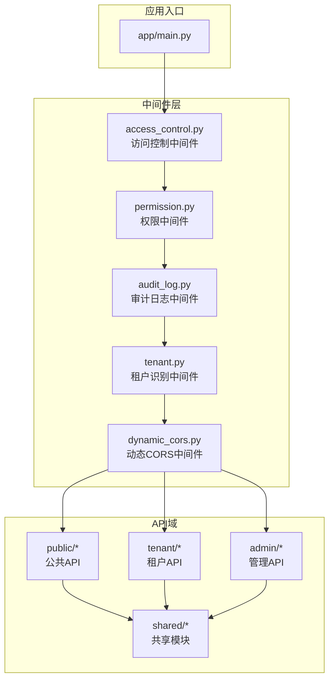
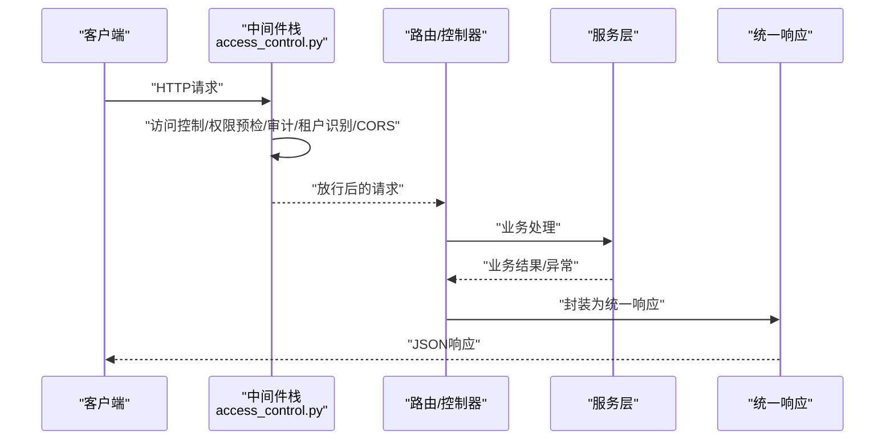
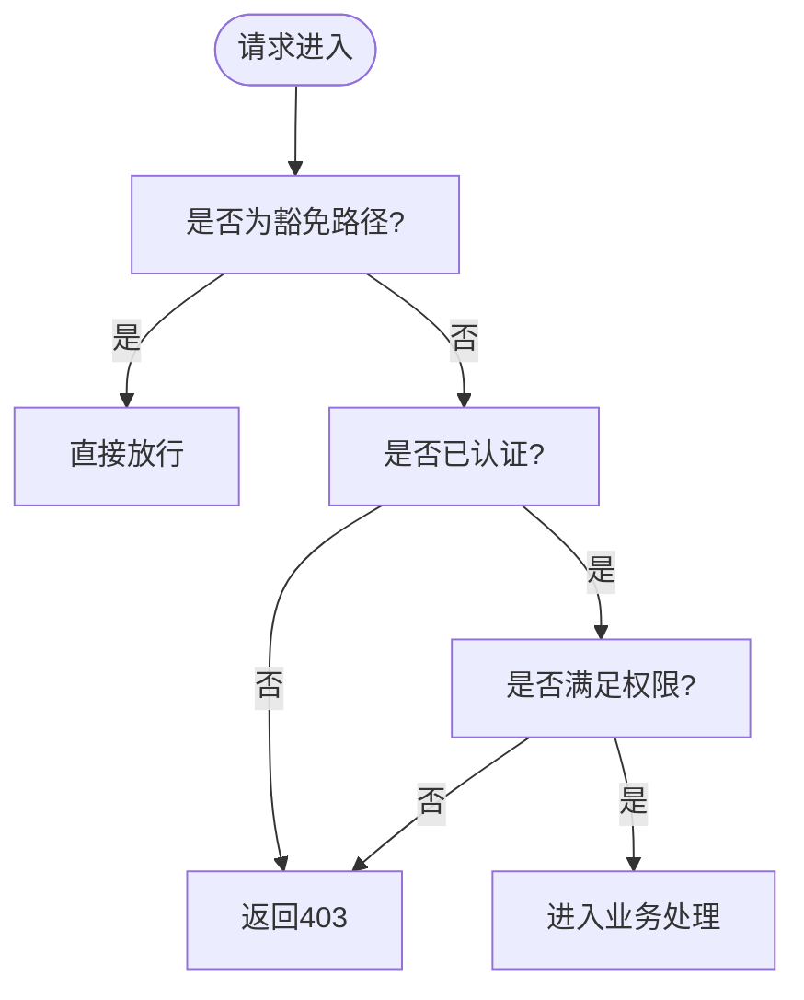
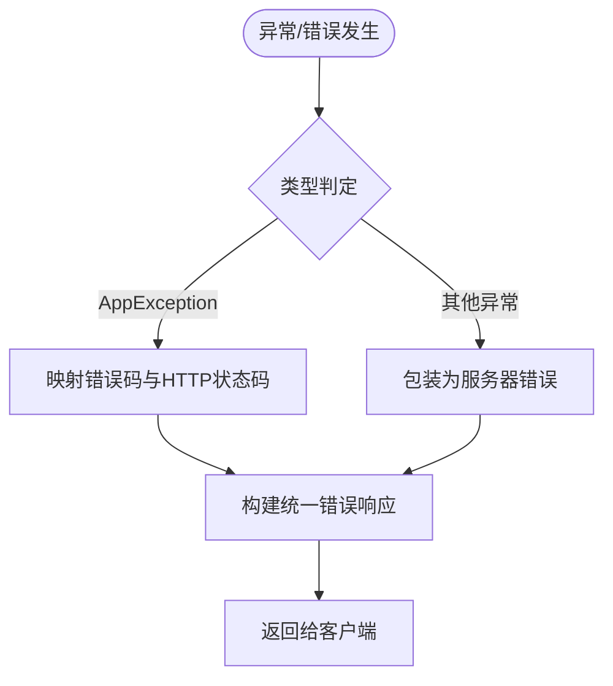
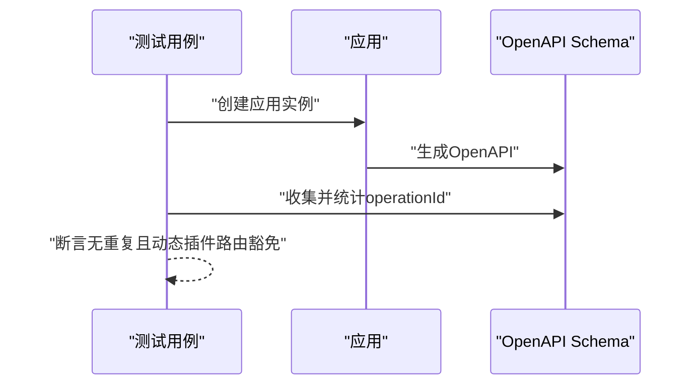
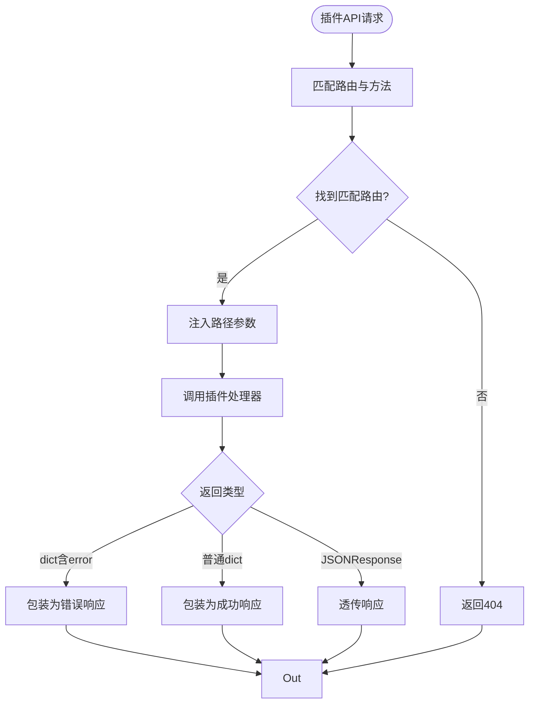
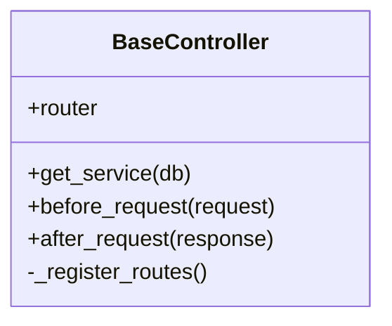
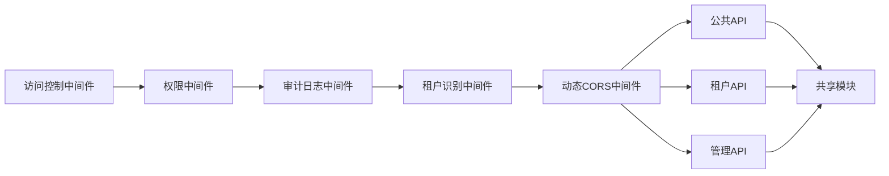

# API接口文档

<cite>
**本文档引用的文件**
- [app/main.py](file://backend/app/main.py)
- [app/core/response.py](file://backend/app/core/response.py)
- [app/middleware/access_control.py](file://backend/app/middleware/access_control.py)
- [app/plugins/api_dispatcher.py](file://backend/app/plugins/api_dispatcher.py)
- [app/core/base_controller.py](file://backend/app/core/base_controller.py)
- [backend/tests/test_openapi_operation_ids_contract.py](file://backend/tests/test_openapi_operation_ids_contract.py)
- [backend/tests/test_plugin_api_dispatcher_security.py](file://backend/tests/test_plugin_api_dispatcher_security.py)
- [backend/tests/test_plugin_module_loader.py](file://backend/tests/test_plugin_module_loader.py)
- [backend/app/api/admin/__init__.py](file://backend/app/api/admin/__init__.py)
- [backend/app/api/tenant/__init__.py](file://backend/app/api/tenant/__init__.py)
- [backend/app/api/public/__init__.py](file://backend/app/api/public/__init__.py)
- [backend/app/api/shared/__init__.py](file://backend/app/api/shared/__init__.py)
</cite>

## 目录
1. [简介](#简介)
2. [项目结构](#项目结构)
3. [核心组件](#核心组件)
4. [架构总览](#架构总览)
5. [详细组件分析](#详细组件分析)
6. [依赖关系分析](#依赖关系分析)
7. [性能考虑](#性能考虑)
8. [故障排除指南](#故障排除指南)
9. [结论](#结论)
10. [附录](#附录)

## 简介
本文件为该SaaS平台的API接口系统提供全面的技术文档，覆盖RESTful API规范、HTTP方法与URL模式、请求/响应格式、认证授权与权限控制、安全策略、错误处理与状态码、API版本管理与兼容性、公共/租户/管理API的接口说明、使用限制与速率控制、监控方案以及客户端集成指南与最佳实践。文档内容均基于仓库中的实际实现进行归纳总结。

## 项目结构
API层采用按域分层的组织方式，主要分为三类API域：
- 公共API（public）：面向平台外部或匿名用户的接口，如健康检查、验证码、平台信息等
- 租户API（tenant）：面向租户内用户，通常需要租户上下文与鉴权
- 管理API（admin）：面向平台管理员，具备更高的权限与敏感操作能力
- 共享模块（shared）：跨域复用的工具与辅助逻辑

**图表来源**
- [app/main.py:668-694](file://backend/app/main.py#L668-L694)
- [app/middleware/access_control.py:1-38](file://backend/app/middleware/access_control.py#L1-L38)

**章节来源**
- [app/main.py:668-694](file://backend/app/main.py#L668-L694)
- [app/middleware/access_control.py:1-38](file://backend/app/middleware/access_control.py#L1-L38)

## 核心组件
- 应用入口与中间件栈：应用通过中间件栈实现统一的安全、权限、审计、租户识别与CORS策略
- 访问控制中间件：默认拒绝策略，要求显式标注公开、认证或权限级别的端点
- 统一响应与错误处理：提供success/error/created/updated/deleted/no_content等标准响应与标准化错误码与状态码
- 插件API调度器：负责插件扩展的API路由匹配、参数注入与错误规范化
- 控制器基类：提供路由注册、服务实例化、请求前后钩子等通用能力

**章节来源**
- [app/main.py:668-694](file://backend/app/main.py#L668-L694)
- [app/core/response.py:509-587](file://backend/app/core/response.py#L509-L587)
- [app/plugins/api_dispatcher.py:76-406](file://backend/app/plugins/api_dispatcher.py#L76-L406)
- [app/core/base_controller.py:113-162](file://backend/app/core/base_controller.py#L113-L162)

## 架构总览
下图展示了API调用从客户端到控制器与服务层的整体流程，以及中间件对请求/响应的横切处理。

**图表来源**
- [app/middleware/access_control.py:1-38](file://backend/app/middleware/access_control.py#L1-L38)
- [app/core/response.py:509-587](file://backend/app/core/response.py#L509-L587)

## 详细组件分析

### 认证与授权机制
- 默认拒绝策略：未显式标注访问级别的端点一律返回403
- 路由豁免：Swagger/Redoc/Health/Metrics等内置与静态资源路径不受默认拒绝约束
- 权限预加载：在审计日志之前加载用户权限至请求状态，便于后续中间件使用
- 租户识别：基于Host头解析当前租户上下文，影响后续路由与数据隔离

**图表来源**
- [app/middleware/access_control.py:19-32](file://backend/app/middleware/access_control.py#L19-L32)

**章节来源**
- [app/middleware/access_control.py:1-38](file://backend/app/middleware/access_control.py#L1-L38)
- [app/main.py:668-694](file://backend/app/main.py#L668-L694)

### 错误处理与状态码规范
- 统一响应模型：success/error/created/updated/deleted/no_content/paginated等
- 标准化错误码与HTTP状态码映射：错误码前缀与HTTP状态码对应关系明确
- 插件错误规范化：插件返回的错误会被规范化为统一的错误响应格式
- 异常到错误响应的转换：支持AppException与通用异常的转换

**图表来源**
- [app/core/response.py:509-587](file://backend/app/core/response.py#L509-L587)
- [app/plugins/api_dispatcher.py:76-406](file://backend/app/plugins/api_dispatcher.py#L76-L406)

**章节来源**
- [app/core/response.py:509-587](file://backend/app/core/response.py#L509-L587)
- [app/plugins/api_dispatcher.py:76-406](file://backend/app/plugins/api_dispatcher.py#L76-L406)

### API版本管理与兼容性
- OpenAPI生成与operationId唯一性：测试确保全局operationId唯一，动态插件路由除外
- 版本策略：通过OpenAPI schema生成与路径设计维持向后兼容，避免重复的operationId导致客户端契约冲突

**图表来源**
- [backend/tests/test_openapi_operation_ids_contract.py:17-41](file://backend/tests/test_openapi_operation_ids_contract.py#L17-L41)

**章节来源**
- [backend/tests/test_openapi_operation_ids_contract.py:17-41](file://backend/tests/test_openapi_operation_ids_contract.py#L17-L41)

### 公共API（Public API）
- 范围：健康检查、验证码、平台信息、租户域名解析等对外公开能力
- 访问级别：通常为公开或认证级别，遵循默认拒绝策略
- 典型用途：前端初始化、平台状态展示、用户登录/注册前置校验

**章节来源**
- [backend/app/api/public/__init__.py](file://backend/app/api/public/__init__.py)

### 租户API（Tenant API）
- 范围：租户内的用户管理、知识库、代理、AI用量、通知、配置等
- 上下文：自动绑定当前租户，涉及多租户隔离与权限控制
- 典型用途：租户侧日常运营与管理

**章节来源**
- [backend/app/api/tenant/__init__.py](file://backend/app/api/tenant/__init__.py)

### 管理API（Admin API）
- 范围：平台级管理能力，如租户管理、系统配置、插件市场、系统日志、运营分析等
- 权限：严格限制为管理员角色，通常为最高权限级别
- 典型用途：平台运维与数据分析

**章节来源**
- [backend/app/api/admin/__init__.py](file://backend/app/api/admin/__init__.py)

### 插件API调度与安全
- 路由匹配：根据HTTP方法与路径匹配候选路由，支持路径参数注入
- 错误规范化：插件返回的错误码与状态码会被规范化，敏感堆栈信息会被隐藏
- 安全边界：插件API的错误响应不会泄露内部调试信息

**图表来源**
- [app/plugins/api_dispatcher.py:222-247](file://backend/app/plugins/api_dispatcher.py#L222-L247)
- [app/plugins/api_dispatcher.py:370-406](file://backend/app/plugins/api_dispatcher.py#L370-L406)

**章节来源**
- [app/plugins/api_dispatcher.py:222-247](file://backend/app/plugins/api_dispatcher.py#L222-L247)
- [app/plugins/api_dispatcher.py:370-406](file://backend/app/plugins/api_dispatcher.py#L370-L406)
- [backend/tests/test_plugin_api_dispatcher_security.py:334-361](file://backend/tests/test_plugin_api_dispatcher_security.py#L334-L361)
- [backend/tests/test_plugin_module_loader.py:268-307](file://backend/tests/test_plugin_module_loader.py#L268-L307)

### 控制器与路由注册
- 控制器基类提供统一的路由注册、服务实例化与请求前后钩子
- 子类可重写钩子方法以实现日志、权限预检、响应处理等横切逻辑

**图表来源**
- [app/core/base_controller.py:113-162](file://backend/app/core/base_controller.py#L113-L162)

**章节来源**
- [app/core/base_controller.py:113-162](file://backend/app/core/base_controller.py#L113-L162)

## 依赖关系分析
- 中间件依赖顺序：维护模式 -> 权限预加载 -> 审计日志 -> 访问控制 -> 租户识别 -> 动态CORS
- API域依赖共享模块：public/tenant/admin均依赖shared提供的工具与辅助逻辑
- 插件扩展：通过API调度器对接插件路由，保证错误规范化与安全边界

**图表来源**
- [app/main.py:668-694](file://backend/app/main.py#L668-L694)

**章节来源**
- [app/main.py:668-694](file://backend/app/main.py#L668-L694)

## 性能考虑
- 统一响应与错误处理：减少重复序列化开销，提升一致性与可观测性
- 插件错误规范化：避免异常传播导致的额外序列化与日志开销
- 中间件顺序优化：将高成本的权限与审计放在早期，减少无效请求的处理成本
- OpenAPI生成与operationId唯一性：有助于客户端SDK生成与缓存，降低运行时解析成本

## 故障排除指南
- 403未授权：检查端点是否正确标注访问级别；确认用户权限与租户上下文
- 404路由不存在：核对HTTP方法与路径；确认插件路由是否正确注册
- 422参数验证失败：检查请求体结构与字段约束；关注错误响应中的具体字段
- 500服务器错误：查看审计日志与异常追踪；确认插件返回值类型是否符合规范
- 插件错误泄露：确保插件返回的错误码属于安全列表，否则会被规范化为通用错误消息

**章节来源**
- [app/core/response.py:509-587](file://backend/app/core/response.py#L509-L587)
- [app/plugins/api_dispatcher.py:76-406](file://backend/app/plugins/api_dispatcher.py#L76-L406)
- [backend/tests/test_plugin_api_dispatcher_security.py:334-361](file://backend/tests/test_plugin_api_dispatcher_security.py#L334-L361)

## 结论
本API接口系统通过严格的默认拒绝策略、统一的响应与错误处理、清晰的API域划分与插件扩展机制，实现了高安全性、高一致性的RESTful接口体系。配合中间件栈与共享模块，能够支撑公共、租户与管理三大场景的多样化需求，并通过OpenAPI与operationId唯一性保障了版本演进的稳定性与客户端兼容性。

## 附录

### API版本管理与弃用策略
- 版本策略：通过OpenAPI schema生成与operationId唯一性保障向后兼容
- 弃用策略：建议通过新增版本路径与deprecation注解逐步迁移，同时保留旧版本直至到期

**章节来源**
- [backend/tests/test_openapi_operation_ids_contract.py:17-41](file://backend/tests/test_openapi_operation_ids_contract.py#L17-L41)

### 使用限制、速率控制与监控
- 速率控制：建议在网关或反向代理层实现基于IP/租户/用户的限流策略
- 监控：结合审计日志中间件与指标端点，建立请求量、错误率、延迟与租户维度的监控

**章节来源**
- [app/main.py:668-694](file://backend/app/main.py#L668-L694)

### 客户端集成指南与最佳实践
- 建议：优先使用OpenAPI生成的SDK；统一处理错误响应与重试策略；对敏感操作增加二次确认
- 最佳实践：在请求头中携带租户标识；对批量操作使用分页与异步回调；对长耗时任务使用事件推送