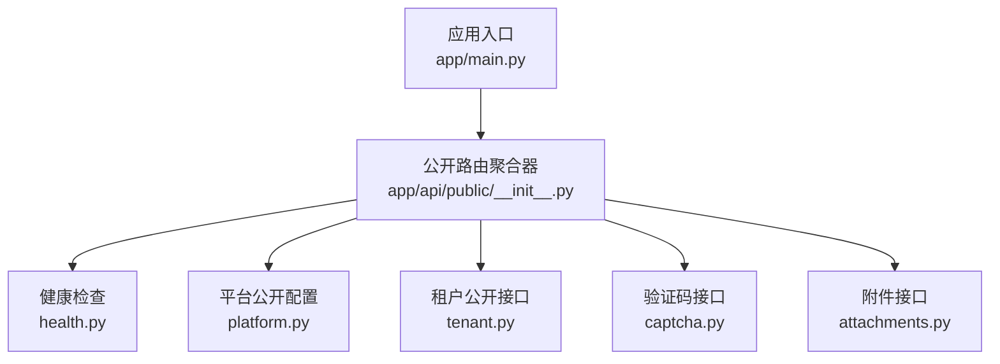
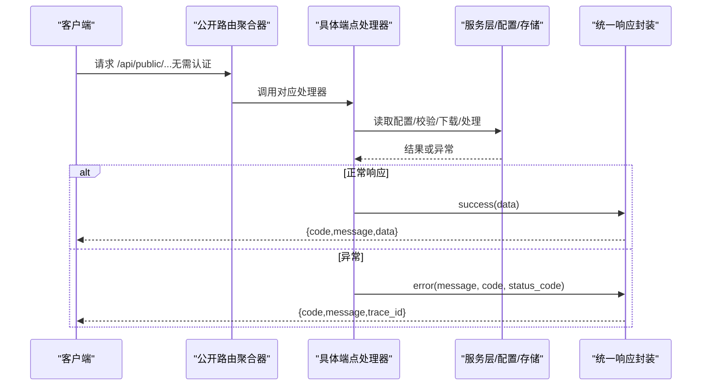
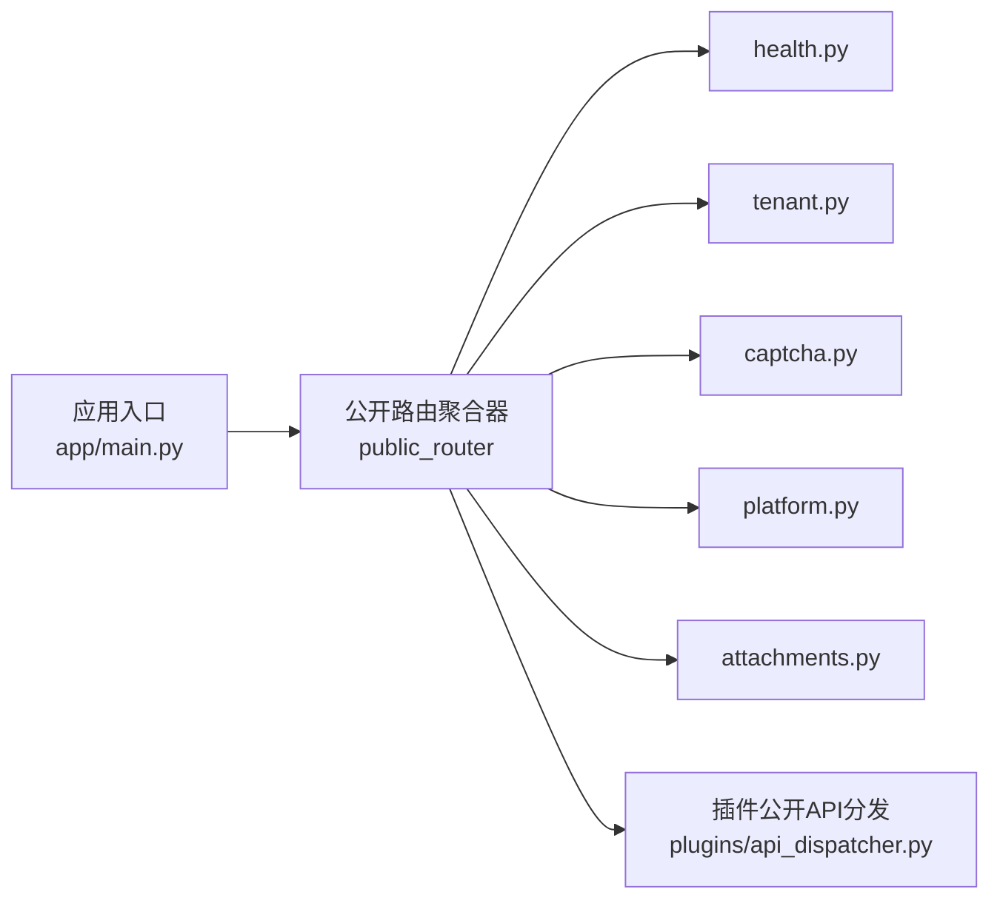

# 公共API

<cite>
**本文引用的文件**
- [backend/app/api/public/health.py](file://backend/app/api/public/health.py)
- [backend/app/api/public/platform.py](file://backend/app/api/public/platform.py)
- [backend/app/api/public/tenant.py](file://backend/app/api/public/tenant.py)
- [backend/app/api/public/captcha.py](file://backend/app/api/public/captcha.py)
- [backend/app/api/public/attachments.py](file://backend/app/api/public/attachments.py)
- [backend/app/api/public/__init__.py](file://backend/app/api/public/__init__.py)
- [backend/app/main.py](file://backend/app/main.py)
- [backend/app/core/response.py](file://backend/app/core/response.py)
- [backend/app/enums/error_code.py](file://backend/app/enums/error_code.py)
- [backend/app/rbac/decorators.py](file://backend/app/rbac/decorators.py)
- [backend/app/plugins/api_dispatcher.py](file://backend/app/plugins/api_dispatcher.py)
</cite>

## 目录
1. [简介](#简介)
2. [项目结构](#项目结构)
3. [核心组件](#核心组件)
4. [架构概览](#架构概览)
5. [详细组件分析](#详细组件分析)
6. [依赖关系分析](#依赖关系分析)
7. [性能与访问限制](#性能与访问限制)
8. [故障排除指南](#故障排除指南)
9. [结论](#结论)
10. [附录：端点清单与示例](#附录端点清单与示例)

## 简介
本文件为公共API的权威文档，覆盖无需认证即可访问的公开接口，包括健康检查、平台信息查询、租户信息获取、验证码生成与校验、附件访问与动态图片处理等。文档逐项说明HTTP方法、URL路径、请求参数、响应格式、状态码、使用示例（curl与JavaScript fetch），并给出访问限制、安全注意事项、错误处理与故障排除建议。

## 项目结构
公共API位于后端应用的公开路由模块中，采用FastAPI组织各子模块，统一通过“/api/public”前缀对外提供服务。路由聚合器将健康检查、平台配置、租户配置、验证码、附件等子路由整合，便于集中管理与扩展。

图表来源
- [backend/app/api/public/__init__.py:1-27](file://backend/app/api/public/__init__.py#L1-L27)
- [backend/app/main.py:887-891](file://backend/app/main.py#L887-L891)

章节来源
- [backend/app/api/public/__init__.py:1-27](file://backend/app/api/public/__init__.py#L1-L27)
- [backend/app/main.py:887-891](file://backend/app/main.py#L887-L891)

## 核心组件
- 健康检查：用于负载均衡与容器编排探活，返回系统关键组件连通性状态。
- 平台公开配置：返回平台级公开配置与品牌信息，含验证码插件信息。
- 租户公开配置：根据请求域名识别租户，返回租户公开配置、品牌与登录策略。
- 验证码：生成挑战与校验验证码，内置速率限制与插件能力校验。
- 附件：提供附件访问与动态图片处理，支持签名访问、预览、云存储重定向与本地直读。

章节来源
- [backend/app/api/public/health.py:1-57](file://backend/app/api/public/health.py#L1-L57)
- [backend/app/api/public/platform.py:1-93](file://backend/app/api/public/platform.py#L1-L93)
- [backend/app/api/public/tenant.py:1-369](file://backend/app/api/public/tenant.py#L1-L369)
- [backend/app/api/public/captcha.py:1-98](file://backend/app/api/public/captcha.py#L1-L98)
- [backend/app/api/public/attachments.py:1-202](file://backend/app/api/public/attachments.py#L1-L202)

## 架构概览
公共API通过装饰器标记“无需认证”，统一由应用入口注册到“/api/public”前缀下；错误处理将HTTP状态码映射为业务错误码，确保对外一致的错误响应格式。

图表来源
- [backend/app/api/public/__init__.py:18-23](file://backend/app/api/public/__init__.py#L18-L23)
- [backend/app/main.py:744-780](file://backend/app/main.py#L744-L780)
- [backend/app/core/response.py:302-362](file://backend/app/core/response.py#L302-L362)

章节来源
- [backend/app/rbac/decorators.py:35-56](file://backend/app/rbac/decorators.py#L35-L56)
- [backend/app/main.py:887-891](file://backend/app/main.py#L887-L891)

## 详细组件分析

### 健康检查 /api/public/health
- 方法与路径
  - GET /api/public/health
- 请求参数
  - 无
- 响应
  - 成功：状态码200，包含status、timestamp与checks字段；若任一子检查失败，状态码503。
  - 失败：返回统一错误响应，包含trace_id以便追踪。
- 说明
  - 检查数据库与Redis连通性，失败时返回错误状态与追踪ID。
- curl示例
  - curl -sS https://your-host/api/public/health
- JavaScript fetch示例
  - fetch('/api/public/health').then(r=>r.json()).then(console.log)

章节来源
- [backend/app/api/public/health.py:21-53](file://backend/app/api/public/health.py#L21-L53)

### 平台公开配置 /api/public/platform/config
- 方法与路径
  - GET /api/public/platform/config
- 请求参数
  - 无
- 响应数据字段（节选）
  - platform_domains、site_name、site_description、site_logo、logo_dark、site_favicon、site_copyright、site_icp、tenant_domain_suffix、domain_verification_prefix、maintenance_mode、maintenance_message、login_captcha_enabled、captcha_provider、captcha_plugin、captcha_difficulty、captcha_enable_threshold_admin、login_max_attempts、login_lockout_minutes、password_min_length、password_complexity、password_expiry_days、session_timeout_minutes、session_max_devices、storage（driver/base_url/chunk_size_mb/max_file_size_mb/allowed_extensions）。
- curl示例
  - curl -sS https://your-host/api/public/platform/config
- JavaScript fetch示例
  - fetch('/api/public/platform/config').then(r=>r.json()).then(console.log)

章节来源
- [backend/app/api/public/platform.py:16-89](file://backend/app/api/public/platform.py#L16-L89)

### 租户公开配置 /api/public/tenant/config
- 方法与路径
  - GET /api/public/tenant/config
- 请求参数
  - 无
- 响应数据字段（节选）
  - tenant_id、tenant_code、tenant_name、logo_url、favicon_url、logo_dark_url、login_bg、login_title、login_subtitle、footer_copyright、icp、captcha_enabled、user_login_captcha_enabled、user_registration_captcha_enabled、user_login_captcha_enable_threshold、captcha_provider、captcha_plugin、captcha_difficulty、captcha_enable_threshold、login_methods、login_max_attempts、login_lockout_minutes、password_min_length、password_complexity、session_timeout、allow_registration、registration_approval、allow_profile_edit、email_notification、sms_notification、api_access、file_upload、privacy_policy_url、terms_url、privacy_policy_internal、terms_internal、subdomain、subdomain_url、storage。
- 说明
  - 根据请求域名自动识别租户上下文；若未识别到租户，返回404。
- curl示例
  - curl -sS https://your-host/api/public/tenant/config
- JavaScript fetch示例
  - fetch('/api/public/tenant/config').then(r=>r.json()).then(console.log)

章节来源
- [backend/app/api/public/tenant.py:32-237](file://backend/app/api/public/tenant.py#L32-L237)

### 租户法律文档（隐私政策/服务条款）/api/public/tenant/legal
- 隐私政策
  - GET /api/public/tenant/legal/privacy
  - 若HTML为空或无意义内容，返回404。
- 服务条款
  - GET /api/public/tenant/legal/terms
  - 若HTML为空或无意义内容，返回404。
- curl示例
  - curl -sS https://your-host/api/public/tenant/legal/privacy
  - curl -sS https://your-host/api/public/tenant/legal/terms
- JavaScript fetch示例
  - fetch('/api/public/tenant/legal/privacy').then(r=>r.json()).then(console.log)
  - fetch('/api/public/tenant/legal/terms').then(r=>r.json()).then(console.log)

章节来源
- [backend/app/api/public/tenant.py:240-295](file://backend/app/api/public/tenant.py#L240-L295)

### 域名验证信息 /api/public/tenant/domain-verification
- 方法与路径
  - GET /api/public/tenant/domain-verification?domain=...
- 请求参数
  - domain: 待绑定的自定义域名（例如 app.example.com）
- 响应数据字段（节选）
  - domain、cname_target、cname_name、txt_name、txt_value、is_verified、instructions。
- 说明
  - 返回CNAME与TXT验证记录，指导用户将自定义域名解析到租户子域名。
- curl示例
  - curl -sS "https://your-host/api/public/tenant/domain-verification?domain=app.example.com"
- JavaScript fetch示例
  - fetch('/api/public/tenant/domain-verification?domain=app.example.com').then(r=>r.json()).then(console.log)

章节来源
- [backend/app/api/public/tenant.py:298-365](file://backend/app/api/public/tenant.py#L298-L365)

### 验证码 /api/public/captcha
- 获取验证码挑战
  - POST /api/public/captcha/challenge
  - 请求体：provider_code、endpoint、action、difficulty、（可选）自定义provider_code（当非image时需满足插件能力）。
  - 响应：challenge_id、challenge、provider_code、public_endpoint（若使用插件）。
  - 速率限制：同一IP对“challenge”接口存在限流，超限返回429。
- 校验验证码
  - POST /api/public/captcha/verify
  - 请求体：provider_code、challenge_id、solution、endpoint、action。
  - 响应：valid（布尔）、score（可选）。
  - 速率限制：同一IP对“verify”接口存在限流，超限返回429。
- curl示例
  - curl -sS -X POST https://your-host/api/public/captcha/challenge -H "Content-Type: application/json" -d '{"provider_code":"image","endpoint":"public","action":"challenge"}'
  - curl -sS -X POST https://your-host/api/public/captcha/verify -H "Content-Type: application/json" -d '{"provider_code":"image","challenge_id":"...","solution":"...","endpoint":"public","action":"verify"}'
- JavaScript fetch示例
  - fetch('/api/public/captcha/challenge', {method:'POST',headers:{'Content-Type':'application/json'},body:JSON.stringify({provider_code:"image",endpoint:"public",action:"challenge"})}).then(r=>r.json()).then(console.log)
  - fetch('/api/public/captcha/verify', {method:'POST',headers:{'Content-Type':'application/json'},body:JSON.stringify({provider_code:"image",challenge_id:"...",solution:"...",endpoint:"public",action:"verify"})}).then(r=>r.json()).then(console.log)

章节来源
- [backend/app/api/public/captcha.py:27-97](file://backend/app/api/public/captcha.py#L27-L97)

### 附件访问与动态图片处理 /api/public/attachments
- 访问附件
  - GET /api/public/attachments/{attachment_id}/access
  - 查询参数：token（可选）、preview（布尔）、exp（签名过期时间，可选）、sign（HMAC签名，可选）。
  - 行为：
    - 若为本地驱动：直接流式返回文件。
    - 若为云存储：返回重定向URL。
    - 若回退到API代理URL（self-redirect风险），返回404。
- 动态图片处理
  - GET /api/public/attachments/{attachment_id}/image
  - 查询参数：token（可选）、exp/sign（签名相关）、w/h（宽/高，1-4096）、q（质量1-100）、f（输出格式jpg/png/webp/gif）、m（缩放模式fit/fill/crop/pad）、p（预设thumb/avatar/preview/banner/small/medium/large）。
  - 速率限制：基于平台配置的每IP窗口限流（默认60次/60秒），超限返回429。
  - 行为：
    - 未启用图片处理：重定向至原始文件。
    - 无需处理：重定向至原始访问URL。
    - 本地处理：返回二进制数据并设置缓存头。
    - 云存储原生处理：返回重定向URL。
- curl示例
  - curl -sS "https://your-host/api/public/attachments/123/access?token=..." -L
  - curl -sS "https://your-host/api/public/attachments/123/image?q=85&w=800&h=600" -L
- JavaScript fetch示例
  - fetch('/api/public/attachments/123/access?token=...').then(r=>r.blob()).then(display)
  - fetch('/api/public/attachments/123/image?q=85&w=800&h=600').then(r=>r.blob()).then(display)

章节来源
- [backend/app/api/public/attachments.py:45-198](file://backend/app/api/public/attachments.py#L45-L198)

## 依赖关系分析
- 路由注册
  - 应用入口将public_router注册到“/api/public”，包含health、tenant、captcha、platform、attachments子路由。
- 访问控制
  - 公共端点通过“@public”装饰器标记，无需认证与权限检查。
- 错误处理
  - HTTP异常处理器将常见状态码映射为业务错误码；统一响应封装提供success/error两种返回形式。
- 插件公开API
  - 公开插件API通过“/api/public/plugins/{name}/api/{path}”分发，仅允许public_routes且无需认证。

图表来源
- [backend/app/main.py:887-891](file://backend/app/main.py#L887-L891)
- [backend/app/api/public/__init__.py:18-23](file://backend/app/api/public/__init__.py#L18-L23)
- [backend/app/plugins/api_dispatcher.py:459-481](file://backend/app/plugins/api_dispatcher.py#L459-L481)

章节来源
- [backend/app/rbac/decorators.py:35-56](file://backend/app/rbac/decorators.py#L35-L56)
- [backend/app/core/response.py:302-362](file://backend/app/core/response.py#L302-L362)

## 性能与访问限制
- 健康检查
  - 无速率限制；数据库与Redis连通性检查决定最终HTTP状态码。
- 验证码
  - 挑战与校验均有限流保护，超限返回429。
- 附件图片处理
  - 基于IP的滑动窗口限流（默认60次/60秒），可通过平台配置调整。
  - 本地处理设置强缓存头，云存储处理返回重定向以减少服务器压力。
- 建议
  - 在前端实现指数退避与去抖策略，避免突发请求导致429。
  - 对图片处理请求进行合理缓存与预设复用，降低后端压力。

章节来源
- [backend/app/api/public/captcha.py:56-57](file://backend/app/api/public/captcha.py#L56-L57)
- [backend/app/api/public/attachments.py:134-148](file://backend/app/api/public/attachments.py#L134-L148)

## 故障排除指南
- 常见HTTP状态码与含义
  - 200：成功（健康检查在全部子检查通过时返回）
  - 400：参数无效或业务校验失败（映射业务错误码400x）
  - 401：未认证（公共API通常不会出现）
  - 403：禁止访问（公共API通常不会出现）
  - 404：资源不存在（租户未找到、法律文档为空等）
  - 409：资源冲突（公共API较少见）
  - 422：字段级校验失败（映射业务错误码422x）
  - 429：请求过于频繁（验证码与图片处理限流）
  - 500：服务器内部错误（映射业务错误码500x）
  - 502：上游服务错误（映射业务错误码502x）
  - 503：服务不可用（健康检查任一子检查失败）
- 统一错误响应
  - 所有错误返回包含code、message与trace_id，便于定位问题。
- 健康检查失败排查
  - 检查数据库连接与Redis可用性；关注返回的checks与trace_id。
- 附件访问失败
  - 若返回404且提示“存储配置不可用”，表示云存储配置不正确或回退到API代理URL，需检查存储驱动与基础URL配置。
- 验证码失败
  - 确认provider_code与插件能力匹配；检查速率限制；核对challenge_id与solution。

章节来源
- [backend/app/main.py:744-780](file://backend/app/main.py#L744-L780)
- [backend/app/enums/error_code.py:32-89](file://backend/app/enums/error_code.py#L32-L89)
- [backend/app/core/response.py:207-225](file://backend/app/core/response.py#L207-L225)

## 结论
公共API为前端登录页与公开资源访问提供了稳定、可扩展的接口集合。通过统一的装饰器与响应封装，确保了跨端点的一致性与可观测性。建议在生产环境中结合速率限制与缓存策略，保障性能与安全。

## 附录：端点清单与示例

### 健康检查
- 方法：GET
- 路径：/api/public/health
- 示例
  - curl -sS https://your-host/api/public/health
  - fetch('/api/public/health').then(r=>r.json()).then(console.log)

章节来源
- [backend/app/api/public/health.py:21-53](file://backend/app/api/public/health.py#L21-L53)

### 平台公开配置
- 方法：GET
- 路径：/api/public/platform/config
- 示例
  - curl -sS https://your-host/api/public/platform/config
  - fetch('/api/public/platform/config').then(r=>r.json()).then(console.log)

章节来源
- [backend/app/api/public/platform.py:16-89](file://backend/app/api/public/platform.py#L16-L89)

### 租户公开配置
- 方法：GET
- 路径：/api/public/tenant/config
- 示例
  - curl -sS https://your-host/api/public/tenant/config
  - fetch('/api/public/tenant/config').then(r=>r.json()).then(console.log)

章节来源
- [backend/app/api/public/tenant.py:32-237](file://backend/app/api/public/tenant.py#L32-L237)

### 租户法律文档
- 隐私政策
  - 方法：GET
  - 路径：/api/public/tenant/legal/privacy
  - 示例：curl -sS https://your-host/api/public/tenant/legal/privacy
- 服务条款
  - 方法：GET
  - 路径：/api/public/tenant/legal/terms
  - 示例：curl -sS https://your-host/api/public/tenant/legal/terms

章节来源
- [backend/app/api/public/tenant.py:240-295](file://backend/app/api/public/tenant.py#L240-L295)

### 域名验证信息
- 方法：GET
- 路径：/api/public/tenant/domain-verification?domain=app.example.com
- 示例：curl -sS "https://your-host/api/public/tenant/domain-verification?domain=app.example.com"

章节来源
- [backend/app/api/public/tenant.py:298-365](file://backend/app/api/public/tenant.py#L298-L365)

### 验证码
- 获取挑战
  - 方法：POST
  - 路径：/api/public/captcha/challenge
  - 示例：curl -sS -X POST https://your-host/api/public/captcha/challenge -H "Content-Type: application/json" -d '{"provider_code":"image","endpoint":"public","action":"challenge"}'
- 校验验证码
  - 方法：POST
  - 路径：/api/public/captcha/verify
  - 示例：curl -sS -X POST https://your-host/api/public/captcha/verify -H "Content-Type: application/json" -d '{"provider_code":"image","challenge_id":"...","solution":"...","endpoint":"public","action":"verify"}'

章节来源
- [backend/app/api/public/captcha.py:27-97](file://backend/app/api/public/captcha.py#L27-L97)

### 附件访问与图片处理
- 访问附件
  - 方法：GET
  - 路径：/api/public/attachments/{attachment_id}/access?token=...&preview=false&exp=&sign=
  - 示例：curl -sS "https://your-host/api/public/attachments/123/access?token=..." -L
- 图片处理
  - 方法：GET
  - 路径：/api/public/attachments/{attachment_id}/image?q=85&w=800&h=600&f=webp&m=fit&p=preview
  - 示例：curl -sS "https://your-host/api/public/attachments/123/image?q=85&w=800&h=600" -L

章节来源
- [backend/app/api/public/attachments.py:45-198](file://backend/app/api/public/attachments.py#L45-L198)