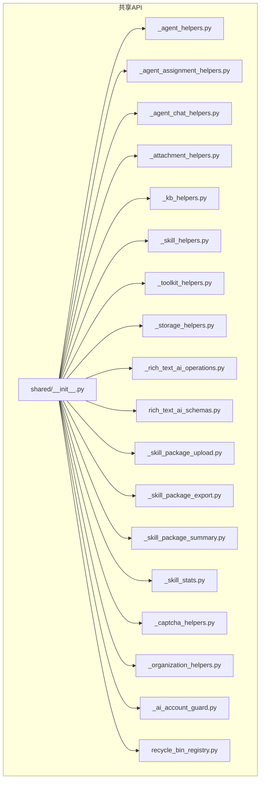
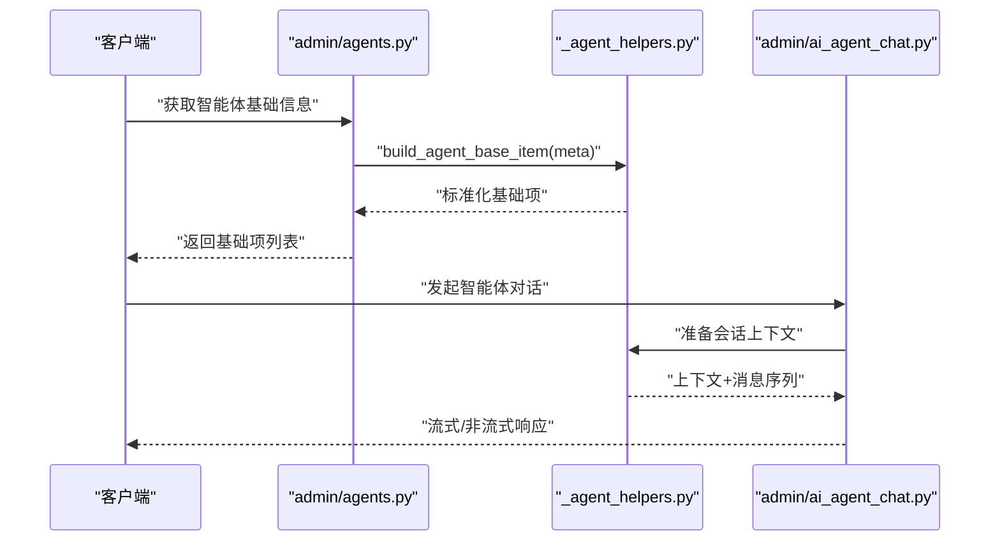
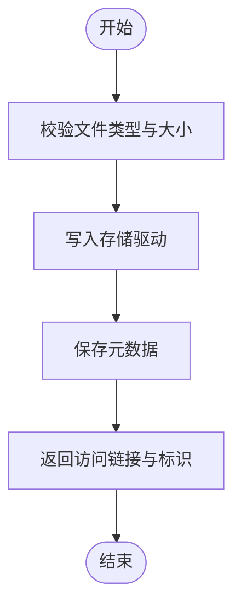
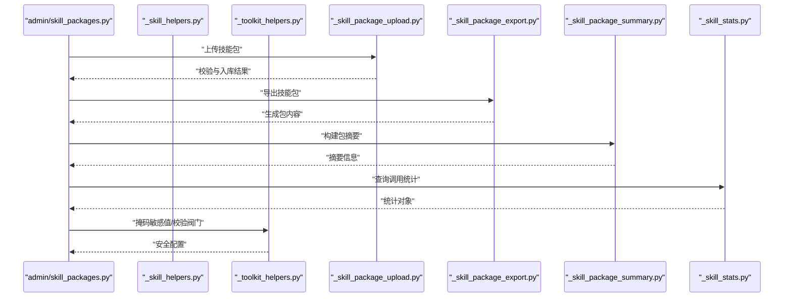
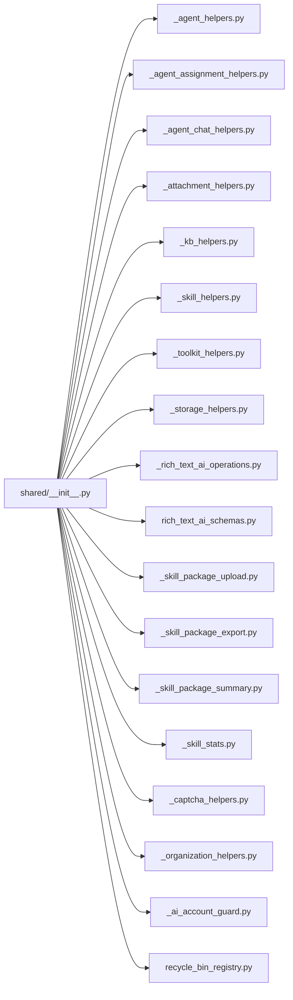

# 共享API

<cite>
**本文引用的文件**
- [backend/app/api/shared/__init__.py](file://backend/app/api/shared/__init__.py)
- [_agent_helpers.py](file://backend/app/api/shared/_agent_helpers.py)
- [_agent_assignment_helpers.py](file://backend/app/api/shared/_agent_assignment_helpers.py)
- [_agent_chat_helpers.py](file://backend/app/api/shared/_agent_chat_helpers.py)
- [_attachment_helpers.py](file://backend/app/api/shared/_attachment_helpers.py)
- [_kb_helpers.py](file://backend/app/api/shared/_kb_helpers.py)
- [_skill_helpers.py](file://backend/app/api/shared/_skill_helpers.py)
- [_toolkit_helpers.py](file://backend/app/api/shared/_toolkit_helpers.py)
- [_storage_helpers.py](file://backend/app/api/shared/_storage_helpers.py)
- [_rich_text_ai_operations.py](file://backend/app/api/shared/_rich_text_ai_operations.py)
- [rich_text_ai_schemas.py](file://backend/app/api/shared/rich_text_ai_schemas.py)
- [_skill_package_upload.py](file://backend/app/api/shared/_skill_package_upload.py)
- [_skill_package_export.py](file://backend/app/api/shared/_skill_package_export.py)
- [_skill_package_summary.py](file://backend/app/api/shared/_skill_package_summary.py)
- [_skill_stats.py](file://backend/app/api/shared/_skill_stats.py)
- [_captcha_helpers.py](file://backend/app/api/shared/_captcha_helpers.py)
- [_organization_helpers.py](file://backend/app/api/shared/_organization_helpers.py)
- [_ai_account_guard.py](file://backend/app/api/shared/_ai_account_guard.py)
- [recycle_bin_registry.py](file://backend/app/api/shared/recycle_bin_registry.py)
- [admin/agents.py](file://backend/app/api/admin/agents.py)
- [admin/agent_assignments.py](file://backend/app/api/admin/agent_assignments.py)
- [admin/ai_agent_chat.py](file://backend/app/api/admin/ai_agent_chat.py)
- [admin/ai_writing.py](file://backend/app/api/admin/ai_writing.py)
- [admin/attachments.py](file://backend/app/api/admin/attachments.py)
- [admin/knowledge_bases.py](file://backend/app/api/admin/knowledge_bases.py)
- [admin/skill_packages.py](file://backend/app/api/admin/skill_packages.py)
- [admin/organization.py](file://backend/app/api/admin/organization.py)
- [admin/recycle_bin.py](file://backend/app/api/admin/recycle_bin.py)
- [tenant/agent_chat.py](file://backend/app/api/tenant/agent_chat.py)
- [test_shared_api_helpers.py](file://backend/tests/test_shared_api_helpers.py)
- [test_skill_api_shared_helpers.py](file://backend/tests/test_skill_api_shared_helpers.py)
</cite>

## 目录
1. [简介](#简介)
2. [项目结构](#项目结构)
3. [核心组件](#核心组件)
4. [架构总览](#架构总览)
5. [详细组件分析](#详细组件分析)
6. [依赖关系分析](#依赖关系分析)
7. [性能考量](#性能考量)
8. [故障排查指南](#故障排查指南)
9. [结论](#结论)
10. [附录](#附录)

## 简介
本文件系统性梳理后端共享API模块，聚焦跨模块复用的辅助功能与共享组件，覆盖智能体助手、附件处理、知识库帮助、技能管理等领域的共享逻辑。文档从接口规范、参数约定、返回格式、设计原则、版本兼容性与扩展机制等方面进行阐述，并通过真实代码路径示例展示在不同API中的复用方式，最后给出最佳实践与常见使用模式。

## 项目结构
共享API位于后端应用的API层共享目录，按领域拆分多个助手模块，统一由共享包入口导出，供管理员(admin)与租户(tenant)等多类路由复用。

图表来源
- [backend/app/api/shared/__init__.py](file://backend/app/api/shared/__init__.py)
- [backend/app/api/shared/_agent_helpers.py](file://backend/app/api/shared/_agent_helpers.py)
- [backend/app/api/shared/_agent_assignment_helpers.py](file://backend/app/api/shared/_agent_assignment_helpers.py)
- [backend/app/api/shared/_agent_chat_helpers.py](file://backend/app/api/shared/_agent_chat_helpers.py)
- [backend/app/api/shared/_attachment_helpers.py](file://backend/app/api/shared/_attachment_helpers.py)
- [backend/app/api/shared/_kb_helpers.py](file://backend/app/api/shared/_kb_helpers.py)
- [backend/app/api/shared/_skill_helpers.py](file://backend/app/api/shared/_skill_helpers.py)
- [backend/app/api/shared/_toolkit_helpers.py](file://backend/app/api/shared/_toolkit_helpers.py)
- [backend/app/api/shared/_storage_helpers.py](file://backend/app/api/shared/_storage_helpers.py)
- [backend/app/api/shared/_rich_text_ai_operations.py](file://backend/app/api/shared/_rich_text_ai_operations.py)
- [backend/app/api/shared/rich_text_ai_schemas.py](file://backend/app/api/shared/rich_text_ai_schemas.py)
- [backend/app/api/shared/_skill_package_upload.py](file://backend/app/api/shared/_skill_package_upload.py)
- [backend/app/api/shared/_skill_package_export.py](file://backend/app/api/shared/_skill_package_export.py)
- [backend/app/api/shared/_skill_package_summary.py](file://backend/app/api/shared/_skill_package_summary.py)
- [backend/app/api/shared/_skill_stats.py](file://backend/app/api/shared/_skill_stats.py)
- [backend/app/api/shared/_captcha_helpers.py](file://backend/app/api/shared/_captcha_helpers.py)
- [backend/app/api/shared/_organization_helpers.py](file://backend/app/api/shared/_organization_helpers.py)
- [backend/app/api/shared/_ai_account_guard.py](file://backend/app/api/shared/_ai_account_guard.py)
- [backend/app/api/shared/recycle_bin_registry.py](file://backend/app/api/shared/recycle_bin_registry.py)

章节来源
- [backend/app/api/shared/__init__.py](file://backend/app/api/shared/__init__.py)

## 核心组件
- 智能体助手：封装智能体基础构建、聊天上下文与会话处理的通用逻辑，便于在管理员与租户端复用。
- 附件处理：提供上传、存储、访问与清理的统一能力，确保跨模块一致的附件生命周期管理。
- 知识库帮助：抽象知识库的查询、绑定、可见性与访问控制等通用流程。
- 技能管理：涵盖技能定义、工具箱配置、阀门(valves)校验与更新、脚本与包的导入导出、统计与摘要等。
- 工具箱与密钥：提供敏感值掩码、配置校验与更新等安全与一致性保障。
- 存储与富文本AI：提供富文本AI操作的流式处理与相关数据结构。
- 验证与组织治理：提供验证码注入、组织与AI账户治理等辅助能力。
- 回收站注册：统一回收站资源注册与清理策略。

章节来源
- [backend/app/api/shared/_agent_helpers.py](file://backend/app/api/shared/_agent_helpers.py)
- [backend/app/api/shared/_agent_chat_helpers.py](file://backend/app/api/shared/_agent_chat_helpers.py)
- [backend/app/api/shared/_attachment_helpers.py](file://backend/app/api/shared/_attachment_helpers.py)
- [backend/app/api/shared/_kb_helpers.py](file://backend/app/api/shared/_kb_helpers.py)
- [backend/app/api/shared/_skill_helpers.py](file://backend/app/api/shared/_skill_helpers.py)
- [backend/app/api/shared/_toolkit_helpers.py](file://backend/app/api/shared/_toolkit_helpers.py)
- [backend/app/api/shared/_storage_helpers.py](file://backend/app/api/shared/_storage_helpers.py)
- [backend/app/api/shared/_rich_text_ai_operations.py](file://backend/app/api/shared/_rich_text_ai_operations.py)
- [backend/app/api/shared/rich_text_ai_schemas.py](file://backend/app/api/shared/rich_text_ai_schemas.py)
- [backend/app/api/shared/_skill_package_upload.py](file://backend/app/api/shared/_skill_package_upload.py)
- [backend/app/api/shared/_skill_package_export.py](file://backend/app/api/shared/_skill_package_export.py)
- [backend/app/api/shared/_skill_package_summary.py](file://backend/app/api/shared/_skill_package_summary.py)
- [backend/app/api/shared/_skill_stats.py](file://backend/app/api/shared/_skill_stats.py)
- [backend/app/api/shared/_captcha_helpers.py](file://backend/app/api/shared/_captcha_helpers.py)
- [backend/app/api/shared/_organization_helpers.py](file://backend/app/api/shared/_organization_helpers.py)
- [backend/app/api/shared/_ai_account_guard.py](file://backend/app/api/shared/_ai_account_guard.py)
- [backend/app/api/shared/recycle_bin_registry.py](file://backend/app/api/shared/recycle_bin_registry.py)

## 架构总览
共享API采用“按领域拆分、统一入口导出”的模块化设计，各助手模块职责单一、边界清晰，通过共享入口集中暴露给上层路由模块复用。下图展示了典型API路由对共享助手的调用关系：

```mermaid
graph TB
subgraph "管理员路由"
AAG["admin/agents.py"]
AASG["admin/agent_assignments.py"]
ACHAT["admin/ai_agent_chat.py"]
AATT["admin/attachments.py"]
AKB["admin/knowledge_bases.py"]
ASKPKG["admin/skill_packages.py"]
AORG["admin/organization.py"]
ARB["admin/recycle_bin.py"]
end
subgraph "租户路由"
TAG["tenant/agent_chat.py"]
end
subgraph "共享API"
SHARED["shared/__init__.py"]
AGH["_agent_helpers.py"]
AAH["_agent_assignment_helpers.py"]
ACH["_agent_chat_helpers.py"]
ATH["_attachment_helpers.py"]
KBH["_kb_helpers.py"]
SKH["_skill_helpers.py"]
TKH["_toolkit_helpers.py"]
SSH["_storage_helpers.py"]
RTOH["_rich_text_ai_operations.py"]
RTAS["rich_text_ai_schemas.py"]
SPU["_skill_package_upload.py"]
SPE["_skill_package_export.py"]
SPS["_skill_package_summary.py"]
SS["_skill_stats.py"]
CAPH["_captcha_helpers.py"]
ORGH["_organization_helpers.py"]
AIGH["_ai_account_guard.py"]
RBR["recycle_bin_registry.py"]
end
AAG --> AGH
AASG --> AAH
ACHAT --> ACH
AATT --> ATH
AKB --> KBH
ASKPKG --> SPU
ASKPKG --> SPE
ASKPKG --> SPS
ASKPKG --> SS
ASKPKG --> SKH
ASKPKG --> TKH
AORG --> CAPH
AORG --> ORGH
AORG --> AIGH
ARB --> RBR
TAG --> ACH
```

图表来源
- [backend/app/api/admin/agents.py](file://backend/app/api/admin/agents.py)
- [backend/app/api/admin/agent_assignments.py](file://backend/app/api/admin/agent_assignments.py)
- [backend/app/api/admin/ai_agent_chat.py](file://backend/app/api/admin/ai_agent_chat.py)
- [backend/app/api/admin/attachments.py](file://backend/app/api/admin/attachments.py)
- [backend/app/api/admin/knowledge_bases.py](file://backend/app/api/admin/knowledge_bases.py)
- [backend/app/api/admin/skill_packages.py](file://backend/app/api/admin/skill_packages.py)
- [backend/app/api/admin/organization.py](file://backend/app/api/admin/organization.py)
- [backend/app/api/admin/recycle_bin.py](file://backend/app/api/admin/recycle_bin.py)
- [backend/app/api/tenant/agent_chat.py](file://backend/app/api/tenant/agent_chat.py)
- [backend/app/api/shared/__init__.py](file://backend/app/api/shared/__init__.py)
- [backend/app/api/shared/_agent_helpers.py](file://backend/app/api/shared/_agent_helpers.py)
- [backend/app/api/shared/_agent_assignment_helpers.py](file://backend/app/api/shared/_agent_assignment_helpers.py)
- [backend/app/api/shared/_agent_chat_helpers.py](file://backend/app/api/shared/_agent_chat_helpers.py)
- [backend/app/api/shared/_attachment_helpers.py](file://backend/app/api/shared/_attachment_helpers.py)
- [backend/app/api/shared/_kb_helpers.py](file://backend/app/api/shared/_kb_helpers.py)
- [backend/app/api/shared/_skill_helpers.py](file://backend/app/api/shared/_skill_helpers.py)
- [backend/app/api/shared/_toolkit_helpers.py](file://backend/app/api/shared/_toolkit_helpers.py)
- [backend/app/api/shared/_storage_helpers.py](file://backend/app/api/shared/_storage_helpers.py)
- [backend/app/api/shared/_rich_text_ai_operations.py](file://backend/app/api/shared/_rich_text_ai_operations.py)
- [backend/app/api/shared/rich_text_ai_schemas.py](file://backend/app/api/shared/rich_text_ai_schemas.py)
- [backend/app/api/shared/_skill_package_upload.py](file://backend/app/api/shared/_skill_package_upload.py)
- [backend/app/api/shared/_skill_package_export.py](file://backend/app/api/shared/_skill_package_export.py)
- [backend/app/api/shared/_skill_package_summary.py](file://backend/app/api/shared/_skill_package_summary.py)
- [backend/app/api/shared/_skill_stats.py](file://backend/app/api/shared/_skill_stats.py)
- [backend/app/api/shared/_captcha_helpers.py](file://backend/app/api/shared/_captcha_helpers.py)
- [backend/app/api/shared/_organization_helpers.py](file://backend/app/api/shared/_organization_helpers.py)
- [backend/app/api/shared/_ai_account_guard.py](file://backend/app/api/shared/_ai_account_guard.py)
- [backend/app/api/shared/recycle_bin_registry.py](file://backend/app/api/shared/recycle_bin_registry.py)

## 详细组件分析

### 智能体助手（Agent）
- 职责：提供智能体基础项构建、会话上下文与消息处理等通用逻辑，支持管理员与租户端复用。
- 关键接口与约定
  - 基础项构建：接收智能体元数据，输出标准化的基础项结构；参数包含标识、名称、描述、可见性等；返回标准化对象。
  - 会话与消息：负责消息序列化、上下文拼接、流式输出等；参数包含会话ID、消息内容、附加上下文；返回流式或非流式的响应对象。
- 复用示例路径
  - 管理员智能体列表页：[admin/agents.py](file://backend/app/api/admin/agents.py)
  - 管理员智能体聊天：[admin/ai_agent_chat.py](file://backend/app/api/admin/ai_agent_chat.py)
  - 租户侧聊天：[tenant/agent_chat.py](file://backend/app/api/tenant/agent_chat.py)

图表来源
- [backend/app/api/admin/agents.py](file://backend/app/api/admin/agents.py)
- [backend/app/api/admin/ai_agent_chat.py](file://backend/app/api/admin/ai_agent_chat.py)
- [backend/app/api/shared/_agent_helpers.py](file://backend/app/api/shared/_agent_helpers.py)

章节来源
- [backend/app/api/shared/_agent_helpers.py](file://backend/app/api/shared/_agent_helpers.py)
- [backend/app/api/shared/_agent_chat_helpers.py](file://backend/app/api/shared/_agent_chat_helpers.py)
- [backend/app/api/admin/agents.py](file://backend/app/api/admin/agents.py)
- [backend/app/api/admin/ai_agent_chat.py](file://backend/app/api/admin/ai_agent_chat.py)
- [backend/app/api/tenant/agent_chat.py](file://backend/app/api/tenant/agent_chat.py)

### 附件处理（Attachment）
- 职责：统一附件上传、存储、访问与清理流程，保证跨模块一致的生命周期管理。
- 关键接口与约定
  - 上传：接收文件流与元数据，返回可访问URL与存储标识；参数包含文件类型、大小限制、租户域等；返回包含存储路径与访问链接的对象。
  - 清理：基于过期策略或业务事件触发清理；参数包含附件ID集合；返回清理结果。
- 复用示例路径
  - 管理员附件管理：[admin/attachments.py](file://backend/app/api/admin/attachments.py)

图表来源
- [backend/app/api/shared/_attachment_helpers.py](file://backend/app/api/shared/_attachment_helpers.py)
- [backend/app/api/admin/attachments.py](file://backend/app/api/admin/attachments.py)

章节来源
- [backend/app/api/shared/_attachment_helpers.py](file://backend/app/api/shared/_attachment_helpers.py)
- [backend/app/api/admin/attachments.py](file://backend/app/api/admin/attachments.py)

### 知识库帮助（Knowledge Base）
- 职责：抽象知识库的查询、绑定、可见性与访问控制等通用流程。
- 关键接口与约定
  - 绑定：将智能体与知识库建立关联；参数包含智能体ID、知识库ID、可见性策略；返回绑定状态。
  - 查询：根据范围与权限过滤知识库；参数包含租户域、可见性、搜索条件；返回匹配列表。
- 复用示例路径
  - 管理员知识库管理：[admin/knowledge_bases.py](file://backend/app/api/admin/knowledge_bases.py)

章节来源
- [backend/app/api/shared/_kb_helpers.py](file://backend/app/api/shared/_kb_helpers.py)
- [backend/app/api/admin/knowledge_bases.py](file://backend/app/api/admin/knowledge_bases.py)

### 技能管理（Skill）
- 职责：技能定义、工具箱配置、阀门(valves)校验与更新、脚本与包的导入导出、统计与摘要等。
- 关键接口与约定
  - 技能定义：标准化技能字段与约束；参数包含技能元数据、工具箱配置；返回规范化技能对象。
  - 工具箱与阀门：提供敏感值掩码与配置校验；参数包含原始配置与密钥；返回安全配置。
  - 包导入导出：提供包级打包、解包与版本兼容性检查；参数包含包内容、目标范围；返回导入/导出结果。
  - 统计与摘要：聚合调用次数、成功率等指标；参数包含时间窗口与维度；返回统计对象。
- 复用示例路径
  - 管理员技能管理：[admin/skill_packages.py](file://backend/app/api/admin/skill_packages.py)
  - 技能助手（跨模块复用）：[backend/app/api/shared/_skill_helpers.py](file://backend/app/api/shared/_skill_helpers.py)

图表来源
- [backend/app/api/admin/skill_packages.py](file://backend/app/api/admin/skill_packages.py)
- [backend/app/api/shared/_skill_helpers.py](file://backend/app/api/shared/_skill_helpers.py)
- [backend/app/api/shared/_toolkit_helpers.py](file://backend/app/api/shared/_toolkit_helpers.py)
- [backend/app/api/shared/_skill_package_upload.py](file://backend/app/api/shared/_skill_package_upload.py)
- [backend/app/api/shared/_skill_package_export.py](file://backend/app/api/shared/_skill_package_export.py)
- [backend/app/api/shared/_skill_package_summary.py](file://backend/app/api/shared/_skill_package_summary.py)
- [backend/app/api/shared/_skill_stats.py](file://backend/app/api/shared/_skill_stats.py)

章节来源
- [backend/app/api/shared/_skill_helpers.py](file://backend/app/api/shared/_skill_helpers.py)
- [backend/app/api/shared/_toolkit_helpers.py](file://backend/app/api/shared/_toolkit_helpers.py)
- [backend/app/api/shared/_skill_package_upload.py](file://backend/app/api/shared/_skill_package_upload.py)
- [backend/app/api/shared/_skill_package_export.py](file://backend/app/api/shared/_skill_package_export.py)
- [backend/app/api/shared/_skill_package_summary.py](file://backend/app/api/shared/_skill_package_summary.py)
- [backend/app/api/shared/_skill_stats.py](file://backend/app/api/shared/_skill_stats.py)
- [backend/app/api/admin/skill_packages.py](file://backend/app/api/admin/skill_packages.py)

### 富文本AI操作（Rich Text AI Operations）
- 职责：提供富文本AI操作的流式处理与相关数据结构，支撑写作、编辑等场景。
- 关键接口与约定
  - 流式操作：接收输入内容与模板，逐步输出富文本片段；参数包含内容、模板、上下文；返回流式响应。
  - 数据结构：定义富文本片段、样式与元数据的数据模型；字段包含类型、内容、样式、元信息等。
- 复用示例路径
  - 管理员富文本AI写作：[admin/ai_writing.py](file://backend/app/api/admin/ai_writing.py)

章节来源
- [backend/app/api/shared/_rich_text_ai_operations.py](file://backend/app/api/shared/_rich_text_ai_operations.py)
- [backend/app/api/shared/rich_text_ai_schemas.py](file://backend/app/api/shared/rich_text_ai_schemas.py)
- [backend/app/api/admin/ai_writing.py](file://backend/app/api/admin/ai_writing.py)

### 验证与组织治理（Captcha/Organization/AI Account Guard）
- 职责：提供验证码注入、组织与AI账户治理等辅助能力，保障安全与合规。
- 关键接口与约定
  - 验证码注入：将可用提供商选项注入到配置中；参数包含当前配置；返回增强后的配置。
  - 组织治理：校验组织权限与策略；参数包含组织ID、策略；返回治理结果。
  - AI账户守卫：校验账户可用性与配额；参数包含账户ID、请求负载；返回守卫结果。
- 复用示例路径
  - 管理员组织与配置：[admin/organization.py](file://backend/app/api/admin/organization.py)

章节来源
- [backend/app/api/shared/_captcha_helpers.py](file://backend/app/api/shared/_captcha_helpers.py)
- [backend/app/api/shared/_organization_helpers.py](file://backend/app/api/shared/_organization_helpers.py)
- [backend/app/api/shared/_ai_account_guard.py](file://backend/app/api/shared/_ai_account_guard.py)
- [backend/app/api/admin/organization.py](file://backend/app/api/admin/organization.py)

### 回收站注册（Recycle Bin Registry）
- 职责：统一回收站资源注册与清理策略，确保删除流程的一致性与可恢复性。
- 关键接口与约定
  - 注册：登记可回收资源类型与清理策略；参数包含资源类型、策略；返回注册结果。
  - 清理：按策略批量清理过期资源；参数包含时间阈值；返回清理结果。
- 复用示例路径
  - 管理员回收站：[admin/recycle_bin.py](file://backend/app/api/admin/recycle_bin.py)

章节来源
- [backend/app/api/shared/recycle_bin_registry.py](file://backend/app/api/shared/recycle_bin_registry.py)
- [backend/app/api/admin/recycle_bin.py](file://backend/app/api/admin/recycle_bin.py)

## 依赖关系分析
共享API模块内部依赖关系如下：

图表来源
- [backend/app/api/shared/__init__.py](file://backend/app/api/shared/__init__.py)
- [backend/app/api/shared/_agent_helpers.py](file://backend/app/api/shared/_agent_helpers.py)
- [backend/app/api/shared/_agent_assignment_helpers.py](file://backend/app/api/shared/_agent_assignment_helpers.py)
- [backend/app/api/shared/_agent_chat_helpers.py](file://backend/app/api/shared/_agent_chat_helpers.py)
- [backend/app/api/shared/_attachment_helpers.py](file://backend/app/api/shared/_attachment_helpers.py)
- [backend/app/api/shared/_kb_helpers.py](file://backend/app/api/shared/_kb_helpers.py)
- [backend/app/api/shared/_skill_helpers.py](file://backend/app/api/shared/_skill_helpers.py)
- [backend/app/api/shared/_toolkit_helpers.py](file://backend/app/api/shared/_toolkit_helpers.py)
- [backend/app/api/shared/_storage_helpers.py](file://backend/app/api/shared/_storage_helpers.py)
- [backend/app/api/shared/_rich_text_ai_operations.py](file://backend/app/api/shared/_rich_text_ai_operations.py)
- [backend/app/api/shared/rich_text_ai_schemas.py](file://backend/app/api/shared/rich_text_ai_schemas.py)
- [backend/app/api/shared/_skill_package_upload.py](file://backend/app/api/shared/_skill_package_upload.py)
- [backend/app/api/shared/_skill_package_export.py](file://backend/app/api/shared/_skill_package_export.py)
- [backend/app/api/shared/_skill_package_summary.py](file://backend/app/api/shared/_skill_package_summary.py)
- [backend/app/api/shared/_skill_stats.py](file://backend/app/api/shared/_skill_stats.py)
- [backend/app/api/shared/_captcha_helpers.py](file://backend/app/api/shared/_captcha_helpers.py)
- [backend/app/api/shared/_organization_helpers.py](file://backend/app/api/shared/_organization_helpers.py)
- [backend/app/api/shared/_ai_account_guard.py](file://backend/app/api/shared/_ai_account_guard.py)
- [backend/app/api/shared/recycle_bin_registry.py](file://backend/app/api/shared/recycle_bin_registry.py)

## 性能考量
- 模块化与职责单一：每个助手模块专注单一职责，降低耦合度，提升可维护性与测试效率。
- 流式处理：富文本AI操作采用流式输出，减少大响应的内存占用与延迟。
- 统一入口导出：通过共享入口集中暴露，避免重复导入与命名冲突，提升加载效率。
- 缓存与索引：附件与知识库相关操作建议结合缓存与索引优化查询性能（具体实现依据存储与检索层）。

## 故障排查指南
- 接口契约不一致：检查共享助手的参数与返回对象是否与调用方期望一致，参考以下测试用例定位问题。
  - 共享API助手测试：[test_shared_api_helpers.py](file://backend/tests/test_shared_api_helpers.py)
  - 技能API共享助手测试：[test_skill_api_shared_helpers.py](file://backend/tests/test_skill_api_shared_helpers.py)
- 权限与可见性：若出现访问受限或不可见，检查组织治理与AI账户守卫逻辑。
  - 组织与AI账户治理：[backend/app/api/shared/_organization_helpers.py](file://backend/app/api/shared/_organization_helpers.py)，[backend/app/api/shared/_ai_account_guard.py](file://backend/app/api/shared/_ai_account_guard.py)
- 存储与附件：若上传失败或无法访问，检查附件助手的校验与存储流程。
  - 附件处理：[backend/app/api/shared/_attachment_helpers.py](file://backend/app/api/shared/_attachment_helpers.py)

章节来源
- [backend/tests/test_shared_api_helpers.py](file://backend/tests/test_shared_api_helpers.py)
- [backend/tests/test_skill_api_shared_helpers.py](file://backend/tests/test_skill_api_shared_helpers.py)
- [backend/app/api/shared/_organization_helpers.py](file://backend/app/api/shared/_organization_helpers.py)
- [backend/app/api/shared/_ai_account_guard.py](file://backend/app/api/shared/_ai_account_guard.py)
- [backend/app/api/shared/_attachment_helpers.py](file://backend/app/api/shared/_attachment_helpers.py)

## 结论
共享API通过模块化设计与统一入口，实现了跨模块的高复用性与一致性。围绕智能体、附件、知识库、技能与富文本AI等核心领域，提供了清晰的接口规范与复用路径。建议在新增功能时优先复用共享组件，遵循参数与返回格式约定，确保版本兼容与扩展性。

## 附录
- 设计原则
  - 单一职责：每个助手模块仅负责一个领域内的通用逻辑。
  - 明确契约：参数与返回对象需有明确的字段与约束说明。
  - 可测试性：共享逻辑应具备良好的单元测试覆盖。
  - 向后兼容：变更时保持接口稳定，必要时引入版本化策略。
- 版本兼容性与扩展机制
  - 版本化：在共享入口或关键模块中引入版本号，区分不同版本的接口行为。
  - 扩展点：通过插件化或钩子机制扩展共享逻辑，避免硬编码。
- 最佳实践
  - 在路由层仅做参数校验与调度，核心逻辑下沉至共享助手。
  - 对流式操作与大对象处理采用异步与分片策略。
  - 对敏感配置与密钥使用工具箱提供的掩码与校验能力。
  - 使用富文本AI操作的数据结构与流式接口，确保前后端一致。