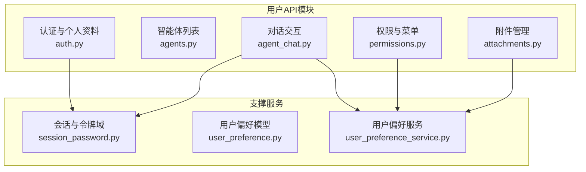
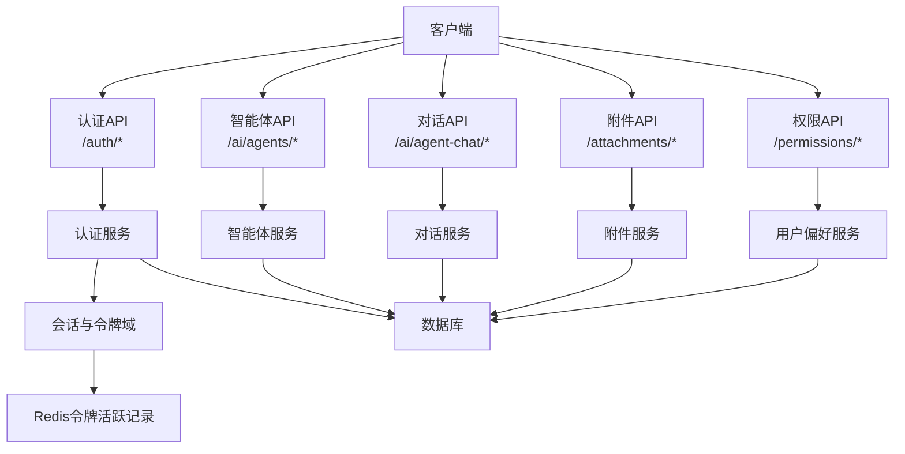
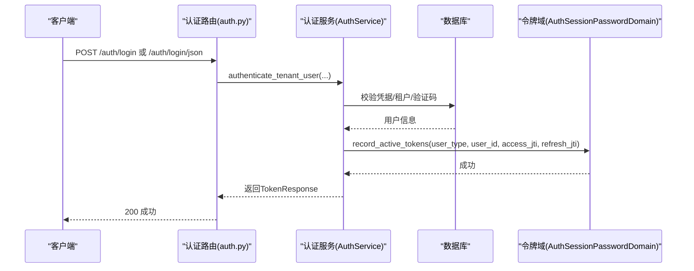
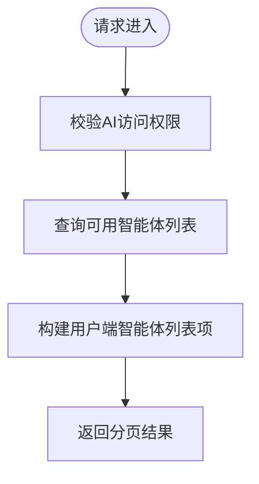
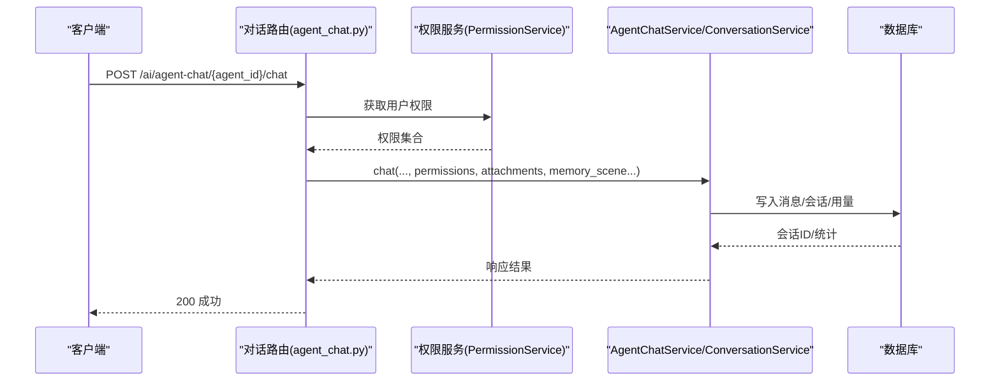
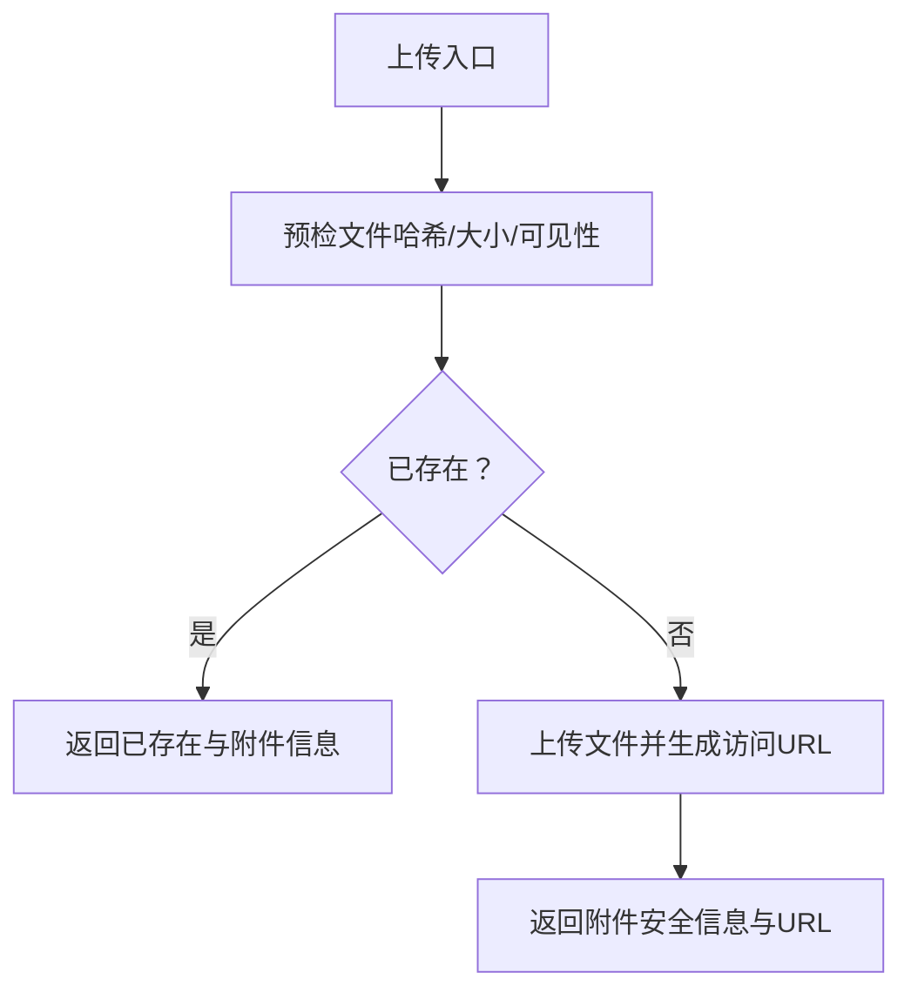
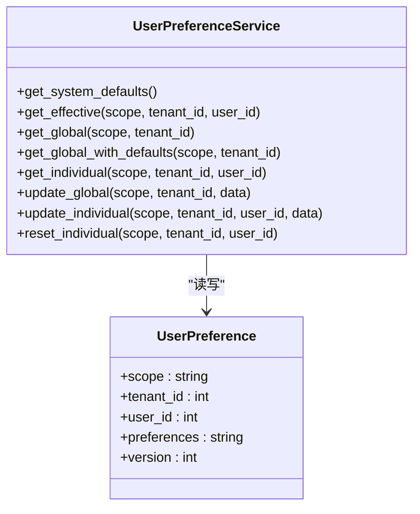
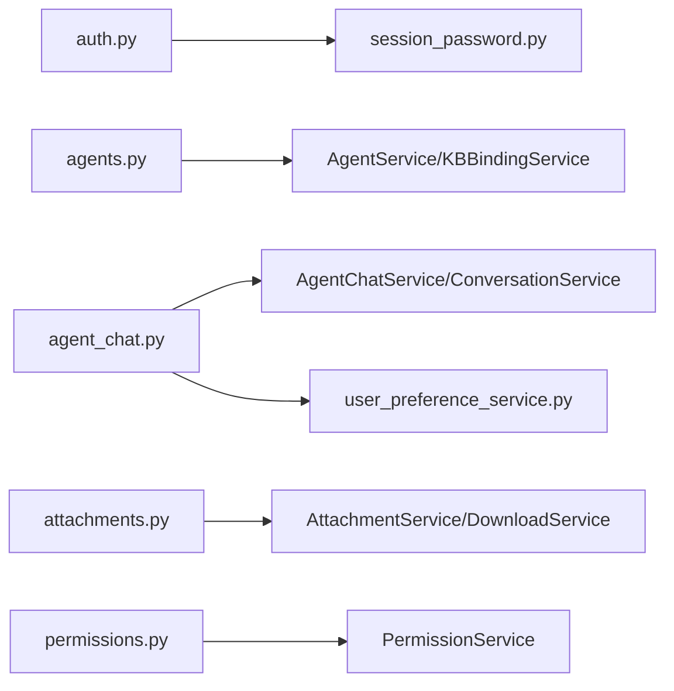
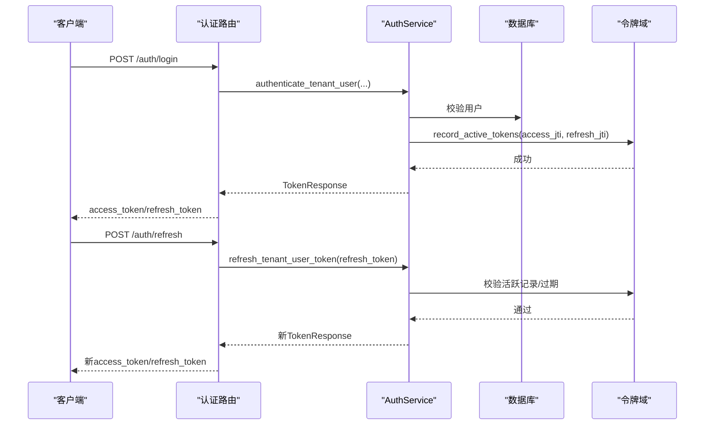

# 用户API

<cite>
**本文档引用的文件**
- [backend/app/api/user/auth.py](file://backend/app/api/user/auth.py)
- [backend/app/api/user/agents.py](file://backend/app/api/user/agents.py)
- [backend/app/api/user/agent_chat.py](file://backend/app/api/user/agent_chat.py)
- [backend/app/api/user/attachments.py](file://backend/app/api/user/attachments.py)
- [backend/app/api/user/permissions.py](file://backend/app/api/user/permissions.py)
- [backend/app/services/common/auth_domains/session_password.py](file://backend/app/services/common/auth_domains/session_password.py)
- [backend/app/models/common/user_preference.py](file://backend/app/models/common/user_preference.py)
- [backend/app/services/common/user_preference_service.py](file://backend/app/services/common/user_preference_service.py)
</cite>

## 目录
1. [简介](#简介)
2. [项目结构](#项目结构)
3. [核心组件](#核心组件)
4. [架构总览](#架构总览)
5. [详细组件分析](#详细组件分析)
6. [依赖关系分析](#依赖关系分析)
7. [性能考虑](#性能考虑)
8. [故障排查指南](#故障排查指南)
9. [结论](#结论)
10. [附录](#附录)

## 简介
本文件为用户API的详细技术文档，覆盖普通用户（租户业务用户）的RESTful接口能力，包括：
- 个人认证与会话管理：登录、登出、注册、验证码登录、密码修改、忘记/重置密码、Token刷新
- 智能体访问：可用智能体列表查询、智能体知识库绑定查询
- 对话交互：非流式与SSE流式对话、智能路由、对话历史查询与管理、会话记忆管理
- 附件管理：文件预检（秒传）、上传、详情、预览链接、下载、上传规则
- 权限与菜单：当前用户菜单树查询
- 用户偏好设置：分层偏好体系（平台/企业全局、管理员/企业管理员覆盖）
- 隐私与权限边界：基于租户隔离、用户身份与资源访问控制

本文件同时解释会话管理、令牌刷新与安全验证机制，并提供实际使用示例路径与最佳实践。

## 项目结构
用户API位于后端应用的用户子模块，采用按功能分层的组织方式：
- 认证与个人资料：/backend/app/api/user/auth.py
- 智能体列表与访问：/backend/app/api/user/agents.py
- 对话交互与记忆：/backend/app/api/user/agent_chat.py
- 附件上传与下载：/backend/app/api/user/attachments.py
- 权限与菜单：/backend/app/api/user/permissions.py
- 会话与令牌域：/backend/app/services/common/auth_domains/session_password.py
- 用户偏好模型与服务：/backend/app/models/common/user_preference.py、/backend/app/services/common/user_preference_service.py

**图表来源**
- [backend/app/api/user/auth.py:1-420](file://backend/app/api/user/auth.py#L1-L420)
- [backend/app/api/user/agents.py:1-118](file://backend/app/api/user/agents.py#L1-L118)
- [backend/app/api/user/agent_chat.py:1-502](file://backend/app/api/user/agent_chat.py#L1-L502)
- [backend/app/api/user/attachments.py:1-243](file://backend/app/api/user/attachments.py#L1-L243)
- [backend/app/api/user/permissions.py:1-65](file://backend/app/api/user/permissions.py#L1-L65)
- [backend/app/services/common/auth_domains/session_password.py:1-59](file://backend/app/services/common/auth_domains/session_password.py#L1-L59)
- [backend/app/models/common/user_preference.py:1-78](file://backend/app/models/common/user_preference.py#L1-L78)
- [backend/app/services/common/user_preference_service.py:1-414](file://backend/app/services/common/user_preference_service.py#L1-L414)

**章节来源**
- [backend/app/api/user/auth.py:1-420](file://backend/app/api/user/auth.py#L1-L420)
- [backend/app/api/user/agents.py:1-118](file://backend/app/api/user/agents.py#L1-L118)
- [backend/app/api/user/agent_chat.py:1-502](file://backend/app/api/user/agent_chat.py#L1-L502)
- [backend/app/api/user/attachments.py:1-243](file://backend/app/api/user/attachments.py#L1-L243)
- [backend/app/api/user/permissions.py:1-65](file://backend/app/api/user/permissions.py#L1-L65)
- [backend/app/services/common/auth_domains/session_password.py:1-59](file://backend/app/services/common/auth_domains/session_password.py#L1-L59)
- [backend/app/models/common/user_preference.py:1-78](file://backend/app/models/common/user_preference.py#L1-L78)
- [backend/app/services/common/user_preference_service.py:1-414](file://backend/app/services/common/user_preference_service.py#L1-L414)

## 核心组件
- 认证与个人资料：提供登录、验证码登录、注册、密码修改/重置、登出、个人信息查询与更新等端点；支持OAuth2表单与JSON两种登录格式；集成验证码与速率限制；支持开发环境引导登录。
- 智能体访问：提供可用智能体列表查询与智能体绑定知识库查询；强制校验AI访问权限与用户访问权限。
- 对话交互：支持非流式与SSE流式对话；提供智能路由、对话列表与详情、标题更新、删除、上下文压缩快照、时间线、会话记忆状态查询与清理、重建快照等。
- 附件管理：提供文件预检（秒传）、上传、详情查询、预览URL、下载（本地直链或重定向）、上传规则查询；严格控制可见性与访问范围。
- 权限与菜单：提供当前用户菜单树查询，用于前端动态渲染。
- 用户偏好设置：分层偏好体系（平台/企业全局、管理员/企业管理员覆盖），支持系统默认、全局与个人覆盖逐层合并，以及全局变更时对个人覆盖的精准清理。

**章节来源**
- [backend/app/api/user/auth.py:81-416](file://backend/app/api/user/auth.py#L81-L416)
- [backend/app/api/user/agents.py:81-111](file://backend/app/api/user/agents.py#L81-L111)
- [backend/app/api/user/agent_chat.py:105-495](file://backend/app/api/user/agent_chat.py#L105-L495)
- [backend/app/api/user/attachments.py:71-242](file://backend/app/api/user/attachments.py#L71-L242)
- [backend/app/api/user/permissions.py:43-58](file://backend/app/api/user/permissions.py#L43-L58)
- [backend/app/models/common/user_preference.py:15-74](file://backend/app/models/common/user_preference.py#L15-L74)
- [backend/app/services/common/user_preference_service.py:133-312](file://backend/app/services/common/user_preference_service.py#L133-L312)

## 架构总览
用户API围绕“认证—授权—服务—存储”分层设计，统一通过装饰器进行权限控制与资源划分，服务层负责业务编排与跨模块协作。

**图表来源**
- [backend/app/api/user/auth.py:47-416](file://backend/app/api/user/auth.py#L47-L416)
- [backend/app/api/user/agents.py:39-115](file://backend/app/api/user/agents.py#L39-L115)
- [backend/app/api/user/agent_chat.py:52-499](file://backend/app/api/user/agent_chat.py#L52-L499)
- [backend/app/api/user/attachments.py:32-242](file://backend/app/api/user/attachments.py#L32-L242)
- [backend/app/api/user/permissions.py:28-62](file://backend/app/api/user/permissions.py#L28-L62)
- [backend/app/services/common/auth_domains/session_password.py:20-59](file://backend/app/services/common/auth_domains/session_password.py#L20-L59)
- [backend/app/services/common/user_preference_service.py:133-312](file://backend/app/services/common/user_preference_service.py#L133-L312)

## 详细组件分析

### 认证与个人资料（/auth）
- 登录
  - OAuth2表单登录：/auth/login
  - JSON格式登录：/auth/login/json
  - 支持租户编码、客户端IP、验证码参数
- 验证码登录与发送：/auth/login-code/send、/auth/login-code/login
- 刷新与登出：/auth/refresh、/auth/logout
- 个人信息与资料更新：/auth/me、/auth/profile
- 密码管理：/auth/password（修改）、/auth/forgot-password（忘记密码）、/auth/reset-password（重置）

**图表来源**
- [backend/app/api/user/auth.py:81-149](file://backend/app/api/user/auth.py#L81-L149)
- [backend/app/services/common/auth_domains/session_password.py:26-41](file://backend/app/services/common/auth_domains/session_password.py#L26-L41)

**章节来源**
- [backend/app/api/user/auth.py:81-416](file://backend/app/api/user/auth.py#L81-L416)
- [backend/app/services/common/auth_domains/session_password.py:20-59](file://backend/app/services/common/auth_domains/session_password.py#L20-L59)

### 智能体访问（/ai/agents）
- 查询可用智能体列表：/ai/agents
- 获取智能体绑定的知识库：/ai/agents/{agent_id}/knowledge-bases
- 权限要求：需满足AI访问开关与用户访问权限

**图表来源**
- [backend/app/api/user/agents.py:81-111](file://backend/app/api/user/agents.py#L81-L111)

**章节来源**
- [backend/app/api/user/agents.py:1-118](file://backend/app/api/user/agents.py#L1-L118)

### 对话交互（/ai/agent-chat）
- 发送消息（非流式）：/ai/agent-chat/{agent_id}/chat
- 发送消息（SSE流式）：/ai/agent-chat/{agent_id}/chat/stream
- 智能路由：/ai/agent-chat/route
- 对话管理
  - 列表：/ai/agent-chat/conversations
  - 详情：/ai/agent-chat/conversations/{conversation_id}
  - 上下文压缩快照：/ai/agent-chat/conversations/{conversation_id}/compact
  - 时间线：/ai/agent-chat/conversations/{conversation_id}/timeline
  - 更新标题：/ai/agent-chat/conversations/{conversation_id}
  - 删除对话：/ai/agent-chat/conversations/{conversation_id}
- 记忆管理
  - 获取记忆状态：/ai/agent-chat/conversations/{conversation_id}/memory-state
  - 清空记忆：/ai/agent-chat/conversations/{conversation_id}/memory-state
  - 重建快照：/ai/agent-chat/conversations/{conversation_id}/compact

**图表来源**
- [backend/app/api/user/agent_chat.py:105-162](file://backend/app/api/user/agent_chat.py#L105-L162)

**章节来源**
- [backend/app/api/user/agent_chat.py:1-502](file://backend/app/api/user/agent_chat.py#L1-L502)

### 附件管理（/attachments）
- 预检文件是否存在（秒传）：/attachments/preflight
- 上传附件：/attachments/upload
- 获取附件详情：/attachments/{attachment_id}
- 获取预览链接：/attachments/{attachment_id}/preview-url
- 下载附件：/attachments/{attachment_id}/download
- 获取上传规则：/attachments/upload-rules

**图表来源**
- [backend/app/api/user/attachments.py:71-161](file://backend/app/api/user/attachments.py#L71-L161)

**章节来源**
- [backend/app/api/user/attachments.py:1-243](file://backend/app/api/user/attachments.py#L1-L243)

### 权限与菜单（/permissions）
- 获取当前用户菜单树：/permissions/menus

**章节来源**
- [backend/app/api/user/permissions.py:1-65](file://backend/app/api/user/permissions.py#L1-L65)

### 用户偏好设置
- 分层偏好模型：platform_global、tenant_global、admin、tenant_admin四层作用域
- 服务能力：系统默认、全局偏好、个人覆盖逐层合并；全局变更时精准清理个人覆盖中的已变更键；支持重置个人覆盖为全局默认

**图表来源**
- [backend/app/models/common/user_preference.py:15-74](file://backend/app/models/common/user_preference.py#L15-L74)
- [backend/app/services/common/user_preference_service.py:133-312](file://backend/app/services/common/user_preference_service.py#L133-L312)

**章节来源**
- [backend/app/models/common/user_preference.py:1-78](file://backend/app/models/common/user_preference.py#L1-L78)
- [backend/app/services/common/user_preference_service.py:1-414](file://backend/app/services/common/user_preference_service.py#L1-L414)

## 依赖关系分析
- 路由装饰器
  - @auth_only：确保用户已登录
  - @public：允许未登录访问（如登录、注册、验证码）
  - @permission_resource：声明资源权限，限定作用域为USER
- 服务依赖
  - 认证：AuthService、AuthSessionPasswordDomain
  - 智能体：AgentService、AgentKBBindingService、AccountAIAccessService
  - 对话：AgentChatService、ConversationService、PermissionService
  - 附件：AttachmentService、AttachmentDownloadService
  - 偏好：UserPreferenceService
- 数据与缓存
  - 数据库：SQLAlchemy异步会话
  - Redis：令牌活跃记录与过期管理

**图表来源**
- [backend/app/api/user/auth.py:47-416](file://backend/app/api/user/auth.py#L47-L416)
- [backend/app/api/user/agents.py:39-115](file://backend/app/api/user/agents.py#L39-L115)
- [backend/app/api/user/agent_chat.py:52-499](file://backend/app/api/user/agent_chat.py#L52-L499)
- [backend/app/api/user/attachments.py:32-242](file://backend/app/api/user/attachments.py#L32-L242)
- [backend/app/api/user/permissions.py:28-62](file://backend/app/api/user/permissions.py#L28-L62)
- [backend/app/services/common/auth_domains/session_password.py:20-59](file://backend/app/services/common/auth_domains/session_password.py#L20-L59)
- [backend/app/services/common/user_preference_service.py:133-312](file://backend/app/services/common/user_preference_service.py#L133-L312)

**章节来源**
- [backend/app/api/user/auth.py:13-46](file://backend/app/api/user/auth.py#L13-L46)
- [backend/app/api/user/agents.py:14-24](file://backend/app/api/user/agents.py#L14-L24)
- [backend/app/api/user/agent_chat.py:18-44](file://backend/app/api/user/agent_chat.py#L18-L44)
- [backend/app/api/user/attachments.py:10-31](file://backend/app/api/user/attachments.py#L10-L31)
- [backend/app/api/user/permissions.py:10-19](file://backend/app/api/user/permissions.py#L10-L19)

## 性能考虑
- 速率限制：登录端点内置速率限制，防止暴力破解
- SSE流式：对话流式返回减少前端轮询开销，提升实时性
- 预检秒传：通过哈希预检避免重复上传，节省带宽
- 缓存与活跃令牌：Redis记录活跃令牌，便于快速吊销与过期管理
- 分页查询：对话列表与智能体列表均支持分页，降低单次响应体积
- 权限早过滤：智能体与对话查询在服务层强制按用户与租户维度过滤，避免越权扫描

[本节为通用指导，无需特定文件引用]

## 故障排查指南
- 登录失败
  - 检查验证码参数与提供商代码是否正确
  - 确认租户编码与用户状态有效
  - 查看速率限制触发日志
- Token刷新失败
  - 确认refresh_token未被吊销且未过期
  - 检查Redis连接与令牌活跃记录
- 对话无响应
  - 确认AI访问开关已开启
  - 检查用户对目标智能体的访问权限
  - 观察SSE连接状态与事件流
- 附件无法下载
  - 校验附件可见性与访问者身份
  - 检查驱动类型（本地直链或重定向URL）
- 偏好未生效
  - 确认作用域与租户ID匹配
  - 检查全局变更是否正确清理了个人覆盖键

**章节来源**
- [backend/app/api/user/auth.py:94-96](file://backend/app/api/user/auth.py#L94-L96)
- [backend/app/api/user/agent_chat.py:95-99](file://backend/app/api/user/agent_chat.py#L95-L99)
- [backend/app/api/user/attachments.py:58-68](file://backend/app/api/user/attachments.py#L58-L68)
- [backend/app/services/common/auth_domains/session_password.py:42-59](file://backend/app/services/common/auth_domains/session_password.py#L42-L59)
- [backend/app/services/common/user_preference_service.py:246-256](file://backend/app/services/common/user_preference_service.py#L246-L256)

## 结论
用户API以清晰的分层与严格的权限控制为基础，覆盖认证、智能体访问、对话交互、附件管理与权限菜单等核心场景。通过分层偏好体系与令牌域设计，兼顾个性化体验与安全合规。建议在生产环境中结合速率限制、SSE监控与Redis健康检查，持续优化用户体验与系统稳定性。

[本节为总结性内容，无需特定文件引用]

## 附录

### 会话管理与令牌刷新流程

**图表来源**
- [backend/app/api/user/auth.py:218-233](file://backend/app/api/user/auth.py#L218-L233)
- [backend/app/services/common/auth_domains/session_password.py:26-41](file://backend/app/services/common/auth_domains/session_password.py#L26-L41)

### 用户权限边界与数据访问范围
- 租户隔离：所有端点均以当前用户所属租户ID为上下文
- 资源访问：对话与附件仅允许访问本人或公开资源
- 智能体访问：仅返回已发布且当前用户有权访问的智能体
- 菜单渲染：根据角色权限过滤，用于前端动态菜单

**章节来源**
- [backend/app/api/user/agent_chat.py:286-299](file://backend/app/api/user/agent_chat.py#L286-L299)
- [backend/app/api/user/attachments.py:45-68](file://backend/app/api/user/attachments.py#L45-L68)
- [backend/app/api/user/agents.py:97-104](file://backend/app/api/user/agents.py#L97-L104)

### 实际使用示例（路径指引）
- 登录（OAuth2表单）：POST /auth/login
- 登录（JSON）：POST /auth/login/json
- 验证码登录：POST /auth/login-code/login
- 刷新Token：POST /auth/refresh
- 获取当前用户信息：GET /auth/me
- 修改密码：PUT /auth/password
- 注册：POST /auth/register
- 忘记密码：POST /auth/forgot-password
- 重置密码：POST /auth/reset-password
- 登出：POST /auth/logout
- 获取可用智能体列表：GET /ai/agents
- 获取智能体知识库绑定：GET /ai/agents/{agent_id}/knowledge-bases
- 非流式对话：POST /ai/agent-chat/{agent_id}/chat
- SSE流式对话：POST /ai/agent-chat/{agent_id}/chat/stream
- 智能路由：POST /ai/agent-chat/route
- 对话列表：GET /ai/agent-chat/conversations
- 对话详情：GET /ai/agent-chat/conversations/{conversation_id}
- 更新对话标题：PATCH /ai/agent-chat/conversations/{conversation_id}
- 删除对话：DELETE /ai/agent-chat/conversations/{conversation_id}
- 获取记忆状态：GET /ai/agent-chat/conversations/{conversation_id}/memory-state
- 清空记忆：DELETE /ai/agent-chat/conversations/{conversation_id}/memory-state
- 重建快照：POST /ai/agent-chat/conversations/{conversation_id}/compact
- 获取上传规则：GET /attachments/upload-rules
- 预检文件：POST /attachments/preflight
- 上传附件：POST /attachments/upload
- 获取附件详情：GET /attachments/{attachment_id}
- 获取预览链接：GET /attachments/{attachment_id}/preview-url
- 下载附件：GET /attachments/{attachment_id}/download
- 获取当前用户菜单：GET /permissions/menus

**章节来源**
- [backend/app/api/user/auth.py:81-416](file://backend/app/api/user/auth.py#L81-L416)
- [backend/app/api/user/agents.py:81-111](file://backend/app/api/user/agents.py#L81-L111)
- [backend/app/api/user/agent_chat.py:105-495](file://backend/app/api/user/agent_chat.py#L105-L495)
- [backend/app/api/user/attachments.py:71-242](file://backend/app/api/user/attachments.py#L71-L242)
- [backend/app/api/user/permissions.py:43-58](file://backend/app/api/user/permissions.py#L43-L58)