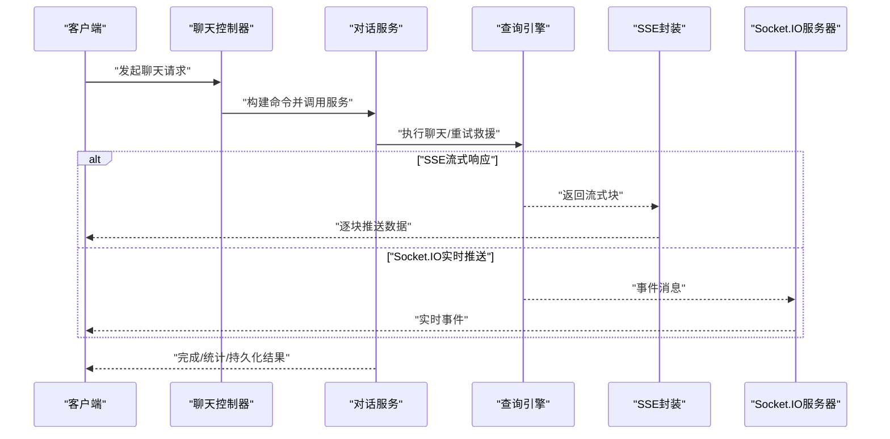
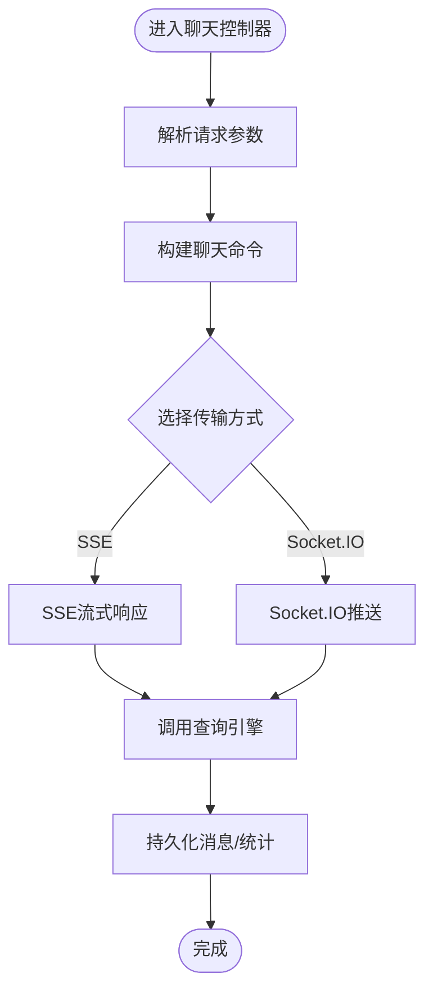
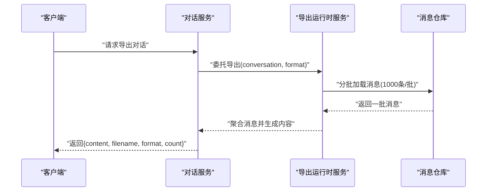
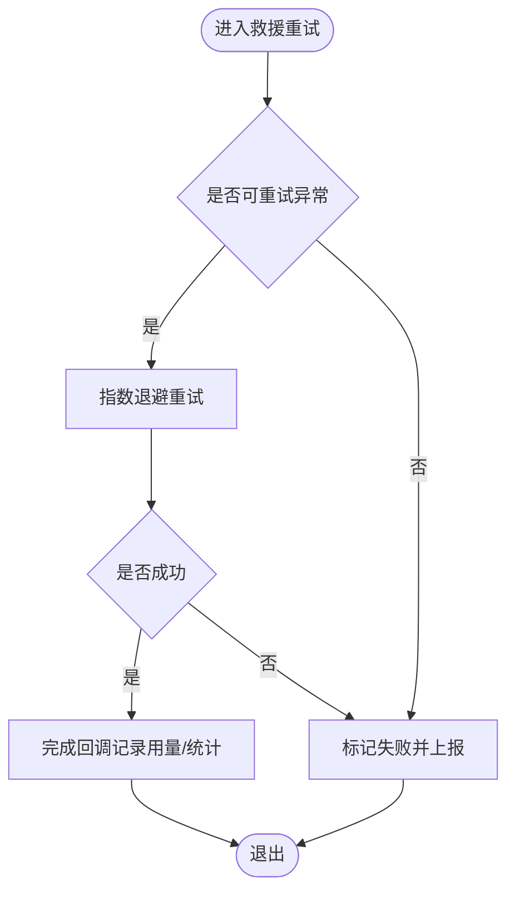
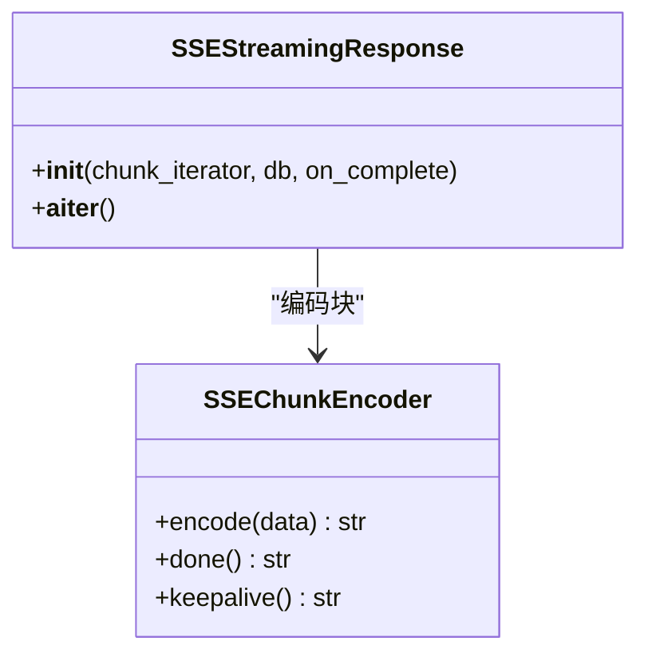
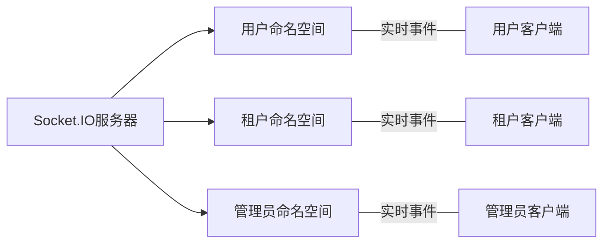
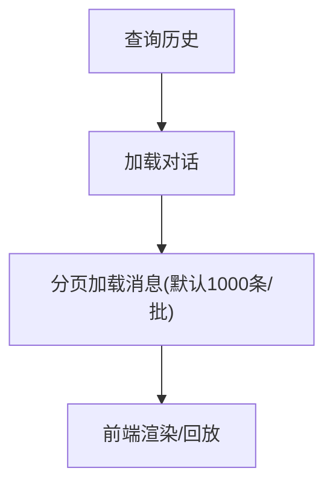
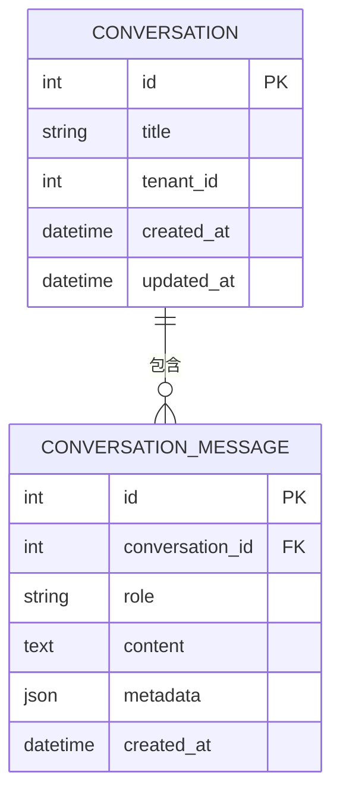
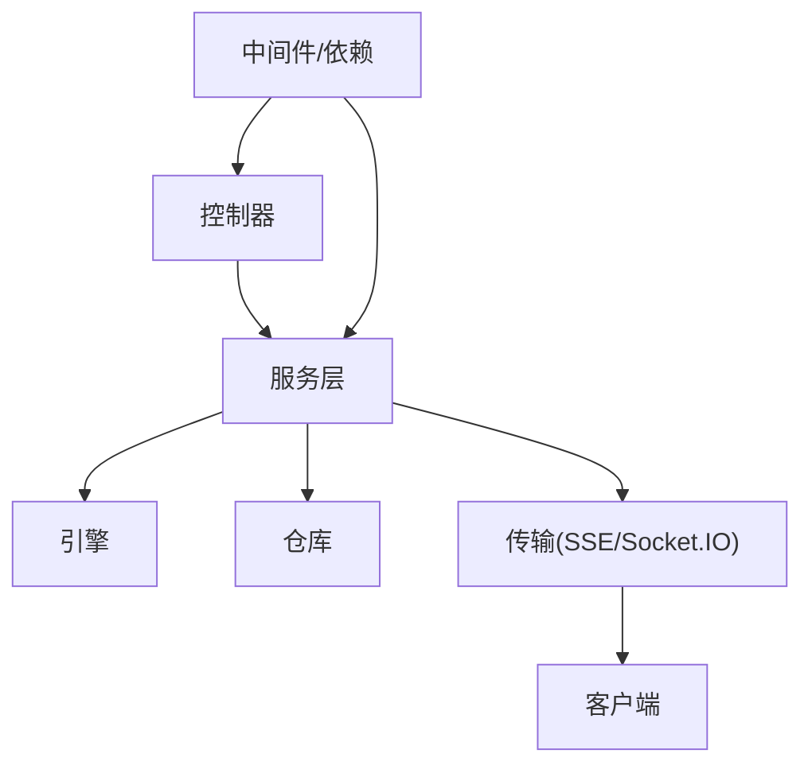

# 对话交互API

<cite>
**本文引用的文件**
- [backend/app/api/tenant/agent_chat.py](file://backend/app/api/tenant/agent_chat.py)
- [backend/app/api/user/agent_chat.py](file://backend/app/api/user/agent_chat.py)
- [backend/app/api/tenant/conversations.py](file://backend/app/api/tenant/conversations.py)
- [backend/app/api/tenant/ws.py](file://backend/app/api/tenant/ws.py)
- [backend/app/api/admin/ws.py](file://backend/app/api/admin/ws.py)
- [backend/app/ai/sse.py](file://backend/app/ai/sse.py)
- [backend/app/services/ai/conversation_export_runtime_service.py](file://backend/app/services/ai/conversation_export_runtime_service.py)
- [backend/app/services/ai/conversation_facade_mixins.py](file://backend/app/services/ai/conversation_facade_mixins.py)
- [backend/app/ai/runtime/query_engine.py](file://backend/app/ai/runtime/query_engine.py)
- [backend/app/schemas/ai/agent_chat.py](file://backend/app/schemas/ai/agent_chat.py)
- [backend/app/models/ai/conversation.py](file://backend/app/models/ai/conversation.py)
- [backend/app/repositories/ai/conversation_message_repository.py](file://backend/app/repositories/ai/conversation_message_repository.py)
- [backend/app/services/ai/conversation_service.py](file://backend/app/services/ai/conversation_service.py)
- [backend/app/sio/socketio_server.py](file://backend/app/sio/socketio_server.py)
- [backend/app/sio/user_ns.py](file://backend/app/sio/user_ns.py)
- [backend/app/sio/tenant_ns.py](file://backend/app/sio/tenant_ns.py)
- [backend/app/sio/admin_ns.py](file://backend/app/sio/admin_ns.py)
- [backend/app/core/sse.py](file://backend/app/core/sse.py)
- [backend/app/core/socketio_server.py](file://backend/app/core/socketio_server.py)
- [backend/app/core/base_controller.py](file://backend/app/core/base_controller.py)
- [backend/app/core/deps.py](file://backend/app/core/deps.py)
- [backend/app/middleware/trace.py](file://backend/app/middleware/trace.py)
- [backend/app/enums/memory.py](file://backend/app/enums/memory.py)
- [backend/app/ai/memory_policy.py](file://backend/app/ai/memory_policy.py)
- [backend/app/cache.py](file://backend/app/cache.py)
- [backend/app/repositories/ai/conversation_repository.py](file://backend/app/repositories/ai/conversation_repository.py)
- [backend/app/schemas/ai/conversation.py](file://backend/app/schemas/ai/conversation.py)
- [backend/app/schemas/ai/conversation_message.py](file://backend/app/schemas/ai/conversation_message.py)
</cite>

## 目录
1. [简介](#简介)
2. [项目结构](#项目结构)
3. [核心组件](#核心组件)
4. [架构总览](#架构总览)
5. [详细组件分析](#详细组件分析)
6. [依赖关系分析](#依赖关系分析)
7. [性能考虑](#性能考虑)
8. [故障排查指南](#故障排查指南)
9. [结论](#结论)
10. [附录](#附录)

## 简介
本文件面向“对话交互API”的技术与业务实现，覆盖智能体聊天、对话历史、消息管理等实时交互接口，重点说明：
- 实时交互方式：WebSocket、SSE（Server-Sent Events）与流式响应
- 消息投递与状态同步：消息持久化、增量更新、完成事件
- 对话上下文管理：上下文长度控制、内存策略、历史查询
- 历史导出与下载：Markdown/JSON格式、分页批量加载
- 错误处理与重试：网关异常、并发会话限制、重试策略
- 数据持久化、压缩与检索优化：模型层、仓库层、缓存与索引

## 项目结构
对话交互API主要由以下层次构成：
- 控制器层：租户与用户维度的聊天与对话控制器
- 服务层：对话服务、导出运行时服务、统计与持久化服务
- 引擎层：协议运行与重试救援逻辑
- 传输层：SSE封装、Socket.IO命名空间与服务器
- 模型与仓库：对话与消息的数据模型及仓储
- 中间件与依赖：鉴权、追踪、租户隔离等

```mermaid
graph TB
subgraph "控制器层"
TAC["租户聊天控制器<br/>backend/app/api/tenant/agent_chat.py"]
UAC["用户聊天控制器<br/>backend/app/api/user/agent_chat.py"]
TC["租户对话控制器<br/>backend/app/api/tenant/conversations.py"]
WS_T["租户WS控制器<br/>backend/app/api/tenant/ws.py"]
WS_A["管理员WS控制器<br/>backend/app/api/admin/ws.py"]
end
subgraph "服务层"
CS["对话服务<br/>backend/app/services/ai/conversation_service.py"]
CERS["对话导出运行时服务<br/>backend/app/services/ai/conversation_export_runtime_service.py"]
CFM["对话门面混入<br/>backend/app/services/ai/conversation_facade_mixins.py"]
QE["查询引擎/重试救援<br/>backend/app/ai/runtime/query_engine.py"]
end
subgraph "传输层"
SSE["SSE封装<br/>backend/app/ai/sse.py"]
CORE_SSE["通用SSE工具<br/>backend/app/core/sse.py"]
SIO_SRV["Socket.IO服务器<br/>backend/app/core/socketio_server.py"]
SIO_NS_U["用户命名空间<br/>backend/app/sio/user_ns.py"]
SIO_NS_T["租户命名空间<br/>backend/app/sio/tenant_ns.py"]
SIO_NS_A["管理员命名空间<br/>backend/app/sio/admin_ns.py"]
end
subgraph "模型与仓库"
M_CON["对话模型<br/>backend/app/models/ai/conversation.py"]
R_CON["对话仓库<br/>backend/app/repositories/ai/conversation_repository.py"]
R_MSG["消息仓库<br/>backend/app/repositories/ai/conversation_message_repository.py"]
SCH_CON["对话Schema<br/>backend/app/schemas/ai/conversation.py"]
SCH_MSG["消息Schema<br/>backend/app/schemas/ai/conversation_message.py"]
end
TAC --> CS
UAC --> CS
TC --> CS
CS --> QE
CS --> CERS
CS --> R_CON
CS --> R_MSG
CS --> M_CON
CS --> SCH_CON
CS --> SCH_MSG
TAC --> SSE
UAC --> SSE
WS_T --> SIO_SRV
WS_A --> SIO_SRV
SIO_SRV --> SIO_NS_U
SIO_SRV --> SIO_NS_T
SIO_SRV --> SIO_NS_A
```

图表来源
- [backend/app/api/tenant/agent_chat.py](file://backend/app/api/tenant/agent_chat.py)
- [backend/app/api/user/agent_chat.py](file://backend/app/api/user/agent_chat.py)
- [backend/app/api/tenant/conversations.py](file://backend/app/api/tenant/conversations.py)
- [backend/app/api/tenant/ws.py](file://backend/app/api/tenant/ws.py)
- [backend/app/api/admin/ws.py](file://backend/app/api/admin/ws.py)
- [backend/app/services/ai/conversation_service.py](file://backend/app/services/ai/conversation_service.py)
- [backend/app/services/ai/conversation_export_runtime_service.py](file://backend/app/services/ai/conversation_export_runtime_service.py)
- [backend/app/ai/runtime/query_engine.py](file://backend/app/ai/runtime/query_engine.py)
- [backend/app/ai/sse.py](file://backend/app/ai/sse.py)
- [backend/app/core/sse.py](file://backend/app/core/sse.py)
- [backend/app/core/socketio_server.py](file://backend/app/core/socketio_server.py)
- [backend/app/sio/user_ns.py](file://backend/app/sio/user_ns.py)
- [backend/app/sio/tenant_ns.py](file://backend/app/sio/tenant_ns.py)
- [backend/app/sio/admin_ns.py](file://backend/app/sio/admin_ns.py)
- [backend/app/models/ai/conversation.py](file://backend/app/models/ai/conversation.py)
- [backend/app/repositories/ai/conversation_repository.py](file://backend/app/repositories/ai/conversation_repository.py)
- [backend/app/repositories/ai/conversation_message_repository.py](file://backend/app/repositories/ai/conversation_message_repository.py)
- [backend/app/schemas/ai/conversation.py](file://backend/app/schemas/ai/conversation.py)
- [backend/app/schemas/ai/conversation_message.py](file://backend/app/schemas/ai/conversation_message.py)

章节来源
- [backend/app/api/tenant/agent_chat.py](file://backend/app/api/tenant/agent_chat.py)
- [backend/app/api/user/agent_chat.py](file://backend/app/api/user/agent_chat.py)
- [backend/app/api/tenant/conversations.py](file://backend/app/api/tenant/conversations.py)
- [backend/app/api/tenant/ws.py](file://backend/app/api/tenant/ws.py)
- [backend/app/api/admin/ws.py](file://backend/app/api/admin/ws.py)
- [backend/app/services/ai/conversation_service.py](file://backend/app/services/ai/conversation_service.py)
- [backend/app/services/ai/conversation_export_runtime_service.py](file://backend/app/services/ai/conversation_export_runtime_service.py)
- [backend/app/ai/runtime/query_engine.py](file://backend/app/ai/runtime/query_engine.py)
- [backend/app/ai/sse.py](file://backend/app/ai/sse.py)
- [backend/app/core/sse.py](file://backend/app/core/sse.py)
- [backend/app/core/socketio_server.py](file://backend/app/core/socketio_server.py)
- [backend/app/sio/user_ns.py](file://backend/app/sio/user_ns.py)
- [backend/app/sio/tenant_ns.py](file://backend/app/sio/tenant_ns.py)
- [backend/app/sio/admin_ns.py](file://backend/app/sio/admin_ns.py)
- [backend/app/models/ai/conversation.py](file://backend/app/models/ai/conversation.py)
- [backend/app/repositories/ai/conversation_repository.py](file://backend/app/repositories/ai/conversation_repository.py)
- [backend/app/repositories/ai/conversation_message_repository.py](file://backend/app/repositories/ai/conversation_message_repository.py)
- [backend/app/schemas/ai/conversation.py](file://backend/app/schemas/ai/conversation.py)
- [backend/app/schemas/ai/conversation_message.py](file://backend/app/schemas/ai/conversation_message.py)

## 核心组件
- 聊天控制器（租户/用户）：负责接收聊天请求、构建命令、调用引擎并返回SSE或Socket.IO流式响应
- 对话服务：统一管理对话生命周期、消息持久化、统计与导出
- 导出运行时服务：支持Markdown/JSON格式导出，分页批量加载消息
- 查询引擎与重试救援：对网关异常进行可重试救援，保障稳定性
- SSE与Socket.IO：分别用于HTTP长连接流式输出与双向实时通信
- 模型与仓库：定义对话与消息的数据结构、查询与写入操作

章节来源
- [backend/app/api/tenant/agent_chat.py](file://backend/app/api/tenant/agent_chat.py)
- [backend/app/api/user/agent_chat.py](file://backend/app/api/user/agent_chat.py)
- [backend/app/services/ai/conversation_service.py](file://backend/app/services/ai/conversation_service.py)
- [backend/app/services/ai/conversation_export_runtime_service.py](file://backend/app/services/ai/conversation_export_runtime_service.py)
- [backend/app/ai/runtime/query_engine.py](file://backend/app/ai/runtime/query_engine.py)
- [backend/app/ai/sse.py](file://backend/app/ai/sse.py)
- [backend/app/core/socketio_server.py](file://backend/app/core/socketio_server.py)

## 架构总览
对话交互API采用“控制器-服务-引擎-传输-数据”分层架构，结合SSE与Socket.IO实现低延迟的实时交互；通过查询引擎与重试救援提升稳定性；通过导出服务与分页加载优化历史数据的检索与下载。

图表来源
- [backend/app/api/tenant/agent_chat.py](file://backend/app/api/tenant/agent_chat.py)
- [backend/app/services/ai/conversation_service.py](file://backend/app/services/ai/conversation_service.py)
- [backend/app/ai/runtime/query_engine.py](file://backend/app/ai/runtime/query_engine.py)
- [backend/app/ai/sse.py](file://backend/app/ai/sse.py)
- [backend/app/core/socketio_server.py](file://backend/app/core/socketio_server.py)

## 详细组件分析

### 聊天控制器（租户/用户）
- 职责
  - 解析请求参数，构建聊天命令
  - 选择SSE或Socket.IO作为传输通道
  - 触发对话服务与引擎执行，并在完成后进行统计与持久化
- 关键流程
  - 参数校验与权限检查
  - 构建TurnCommand并调用引擎
  - SSE模式下返回SSEStreamingResponse
  - Socket.IO模式下通过命名空间广播事件
- 错误处理
  - 网关异常与并发限制等场景触发重试救援
  - 客户端断开连接时不记录用量

图表来源
- [backend/app/api/tenant/agent_chat.py](file://backend/app/api/tenant/agent_chat.py)
- [backend/app/api/user/agent_chat.py](file://backend/app/api/user/agent_chat.py)
- [backend/app/ai/runtime/query_engine.py](file://backend/app/ai/runtime/query_engine.py)
- [backend/app/ai/sse.py](file://backend/app/ai/sse.py)
- [backend/app/core/socketio_server.py](file://backend/app/core/socketio_server.py)

章节来源
- [backend/app/api/tenant/agent_chat.py](file://backend/app/api/tenant/agent_chat.py)
- [backend/app/api/user/agent_chat.py](file://backend/app/api/user/agent_chat.py)
- [backend/app/ai/runtime/query_engine.py](file://backend/app/ai/runtime/query_engine.py)
- [backend/app/ai/sse.py](file://backend/app/ai/sse.py)
- [backend/app/core/socketio_server.py](file://backend/app/core/socketio_server.py)

### 对话服务与导出
- 对话服务
  - 统一管理对话创建、消息写入、统计与持久化
  - 提供导出委托入口，将具体导出工作交由导出运行时服务
- 导出运行时服务
  - 支持Markdown/JSON两种格式
  - 分批加载消息（默认每批1000条），避免大对话一次性加载导致内存压力
  - 返回内容、文件名、格式与消息总数

图表来源
- [backend/app/services/ai/conversation_service.py](file://backend/app/services/ai/conversation_service.py)
- [backend/app/services/ai/conversation_export_runtime_service.py](file://backend/app/services/ai/conversation_export_runtime_service.py)
- [backend/app/repositories/ai/conversation_message_repository.py](file://backend/app/repositories/ai/conversation_message_repository.py)

章节来源
- [backend/app/services/ai/conversation_service.py](file://backend/app/services/ai/conversation_service.py)
- [backend/app/services/ai/conversation_export_runtime_service.py](file://backend/app/services/ai/conversation_export_runtime_service.py)
- [backend/app/repositories/ai/conversation_message_repository.py](file://backend/app/repositories/ai/conversation_message_repository.py)

### 查询引擎与重试救援
- 同步救援重试
  - 针对可重试的网关异常，按指数退避策略进行重试
  - 在救援命令中提升推理努力程度，提高成功率
- 完成回调与用量统计
  - 在完成回调中记录Token用量、状态与统计信息
  - 处理部分结果与失败结果的不同分支

图表来源
- [backend/app/ai/runtime/query_engine.py](file://backend/app/ai/runtime/query_engine.py)

章节来源
- [backend/app/ai/runtime/query_engine.py](file://backend/app/ai/runtime/query_engine.py)

### SSE流式响应
- SSEChunkEncoder
  - 将聊天块编码为SSE格式，支持普通JSON与结束标记
  - 提供keepalive注释以维持连接
- SSEStreamingResponse
  - 将异步迭代器转换为SSE流式响应
  - 支持完成回调与Token计数
  - 客户端断开时记录警告并停止用量统计

图表来源
- [backend/app/ai/sse.py](file://backend/app/ai/sse.py)

章节来源
- [backend/app/ai/sse.py](file://backend/app/ai/sse.py)

### Socket.IO实时推送
- 服务器与命名空间
  - 服务器统一管理用户、租户、管理员命名空间
  - 命名空间按角色与租户隔离，确保消息只推送到目标用户
- 推送策略
  - 聊天过程中的事件通过命名空间实时广播
  - 断线重连与状态同步由命名空间维护

图表来源
- [backend/app/core/socketio_server.py](file://backend/app/core/socketio_server.py)
- [backend/app/sio/user_ns.py](file://backend/app/sio/user_ns.py)
- [backend/app/sio/tenant_ns.py](file://backend/app/sio/tenant_ns.py)
- [backend/app/sio/admin_ns.py](file://backend/app/sio/admin_ns.py)

章节来源
- [backend/app/core/socketio_server.py](file://backend/app/core/socketio_server.py)
- [backend/app/sio/user_ns.py](file://backend/app/sio/user_ns.py)
- [backend/app/sio/tenant_ns.py](file://backend/app/sio/tenant_ns.py)
- [backend/app/sio/admin_ns.py](file://backend/app/sio/admin_ns.py)

### 对话上下文管理与历史查询
- 上下文长度与内存策略
  - 通过内存策略与枚举类型控制上下文长度与保留策略
  - 可根据配置调整对话记忆范围
- 历史查询
  - 通过对话仓库与消息仓库分页查询历史消息
  - 支持按对话ID查询消息列表，便于前端渲染与回放

图表来源
- [backend/app/ai/memory_policy.py](file://backend/app/ai/memory_policy.py)
- [backend/app/enums/memory.py](file://backend/app/enums/memory.py)
- [backend/app/repositories/ai/conversation_repository.py](file://backend/app/repositories/ai/conversation_repository.py)
- [backend/app/repositories/ai/conversation_message_repository.py](file://backend/app/repositories/ai/conversation_message_repository.py)

章节来源
- [backend/app/ai/memory_policy.py](file://backend/app/ai/memory_policy.py)
- [backend/app/enums/memory.py](file://backend/app/enums/memory.py)
- [backend/app/repositories/ai/conversation_repository.py](file://backend/app/repositories/ai/conversation_repository.py)
- [backend/app/repositories/ai/conversation_message_repository.py](file://backend/app/repositories/ai/conversation_message_repository.py)

### 数据模型与Schema
- 对话模型与仓库
  - 定义对话实体、字段与约束
  - 提供创建、查询与更新操作
- 消息模型与仓库
  - 定义消息实体、内容与关联关系
  - 提供按对话分页查询与批量加载
- Schema
  - 对外暴露的对话与消息数据结构，用于API响应与请求验证

图表来源
- [backend/app/models/ai/conversation.py](file://backend/app/models/ai/conversation.py)
- [backend/app/repositories/ai/conversation_repository.py](file://backend/app/repositories/ai/conversation_repository.py)
- [backend/app/repositories/ai/conversation_message_repository.py](file://backend/app/repositories/ai/conversation_message_repository.py)
- [backend/app/schemas/ai/conversation.py](file://backend/app/schemas/ai/conversation.py)
- [backend/app/schemas/ai/conversation_message.py](file://backend/app/schemas/ai/conversation_message.py)

章节来源
- [backend/app/models/ai/conversation.py](file://backend/app/models/ai/conversation.py)
- [backend/app/repositories/ai/conversation_repository.py](file://backend/app/repositories/ai/conversation_repository.py)
- [backend/app/repositories/ai/conversation_message_repository.py](file://backend/app/repositories/ai/conversation_message_repository.py)
- [backend/app/schemas/ai/conversation.py](file://backend/app/schemas/ai/conversation.py)
- [backend/app/schemas/ai/conversation_message.py](file://backend/app/schemas/ai/conversation_message.py)

## 依赖关系分析
- 控制器依赖服务层，服务层依赖引擎与仓库
- 传输层（SSE/Socket.IO）独立于业务逻辑，仅负责消息推送
- 中间件与依赖注入贯穿各层，保证鉴权、追踪与租户隔离

图表来源
- [backend/app/api/tenant/agent_chat.py](file://backend/app/api/tenant/agent_chat.py)
- [backend/app/services/ai/conversation_service.py](file://backend/app/services/ai/conversation_service.py)
- [backend/app/ai/runtime/query_engine.py](file://backend/app/ai/runtime/query_engine.py)
- [backend/app/ai/sse.py](file://backend/app/ai/sse.py)
- [backend/app/core/socketio_server.py](file://backend/app/core/socketio_server.py)
- [backend/app/core/deps.py](file://backend/app/core/deps.py)

章节来源
- [backend/app/api/tenant/agent_chat.py](file://backend/app/api/tenant/agent_chat.py)
- [backend/app/services/ai/conversation_service.py](file://backend/app/services/ai/conversation_service.py)
- [backend/app/ai/runtime/query_engine.py](file://backend/app/ai/runtime/query_engine.py)
- [backend/app/ai/sse.py](file://backend/app/ai/sse.py)
- [backend/app/core/socketio_server.py](file://backend/app/core/socketio_server.py)
- [backend/app/core/deps.py](file://backend/app/core/deps.py)

## 性能考虑
- 流式响应
  - SSE与Socket.IO均采用增量推送，降低首字节延迟
  - 完成回调中进行用量统计，避免重复计算
- 批量加载与分页
  - 导出服务默认每批1000条消息，减少单次内存占用
  - 历史查询支持分页，前端可按需加载
- 缓存与索引
  - 使用缓存模块与数据库索引优化查询性能
  - 对热点对话与消息建立合理索引
- 内存策略
  - 通过内存策略与枚举类型控制上下文长度，避免过长上下文导致性能下降

## 故障排查指南
- SSE连接中断
  - 现象：客户端提前断开，服务端记录警告
  - 处理：确认客户端网络状况，必要时增加keepalive频率
- Socket.IO推送失败
  - 现象：事件未送达目标客户端
  - 处理：检查命名空间绑定与租户隔离配置
- 导出内容为空或不完整
  - 现象：导出文件内容缺失
  - 处理：确认消息分页加载逻辑与仓库查询条件
- 网关异常与重试
  - 现象：并发会话超限或速率限制
  - 处理：启用救援重试，适当延长退避时间

章节来源
- [backend/app/ai/sse.py](file://backend/app/ai/sse.py)
- [backend/app/core/socketio_server.py](file://backend/app/core/socketio_server.py)
- [backend/app/services/ai/conversation_export_runtime_service.py](file://backend/app/services/ai/conversation_export_runtime_service.py)
- [backend/app/ai/runtime/query_engine.py](file://backend/app/ai/runtime/query_engine.py)

## 结论
对话交互API通过清晰的分层设计与多种传输方式，实现了低延迟、高可用的实时对话体验。结合导出与分页加载，满足了历史数据的检索与下载需求；通过重试救援与内存策略，提升了系统稳定性与性能表现。

## 附录
- WebSocket与SSE技术要点
  - WebSocket适合双向高频交互，Socket.IO提供房间与命名空间管理
  - SSE适合单向流式推送，SSEChunkEncoder与SSEStreamingResponse提供统一编码与流式封装
- 错误重试机制
  - 基于可重试异常类型进行指数退避重试，救援命令提升推理努力程度
- 数据持久化与检索优化
  - 对话与消息模型定义明确，仓库层提供分页与批量加载能力
  - 通过缓存与索引优化查询性能，内存策略控制上下文长度