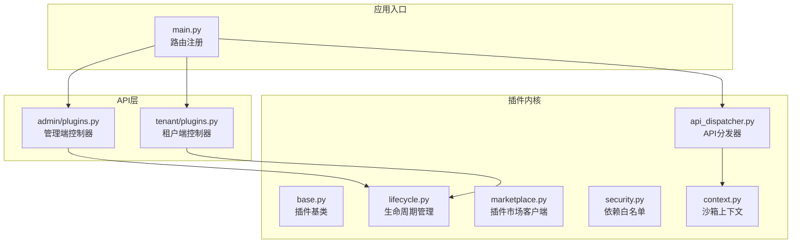
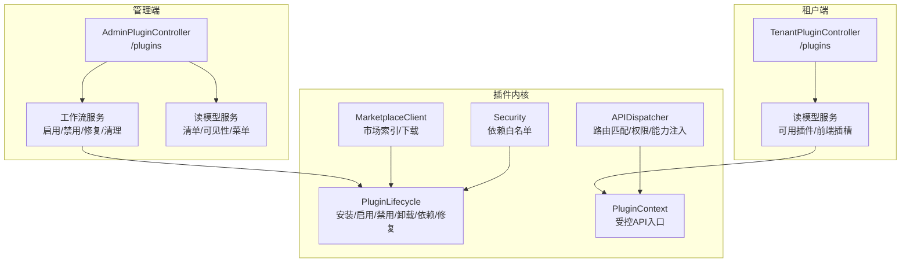
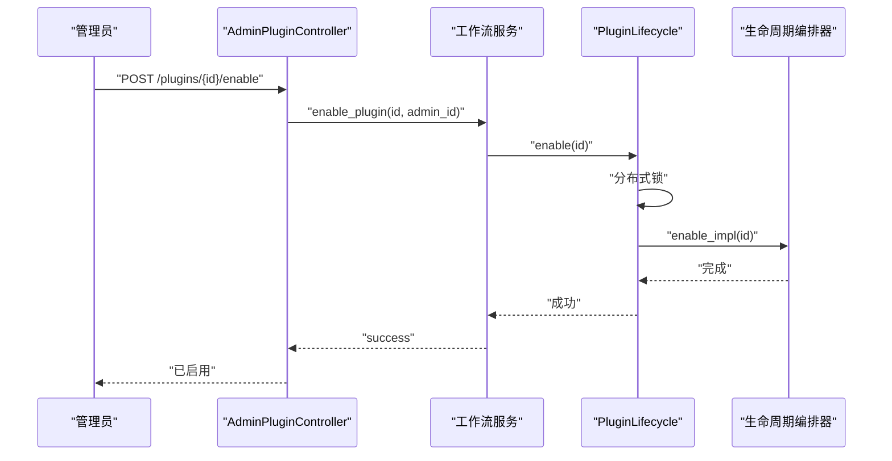
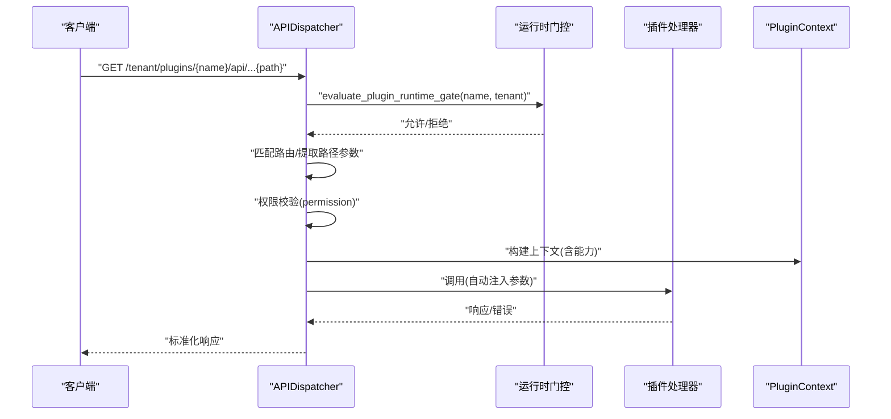
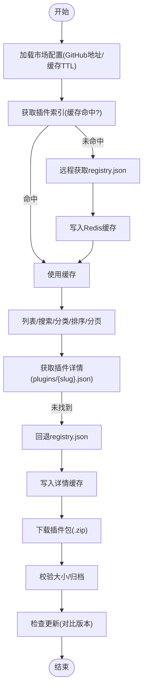
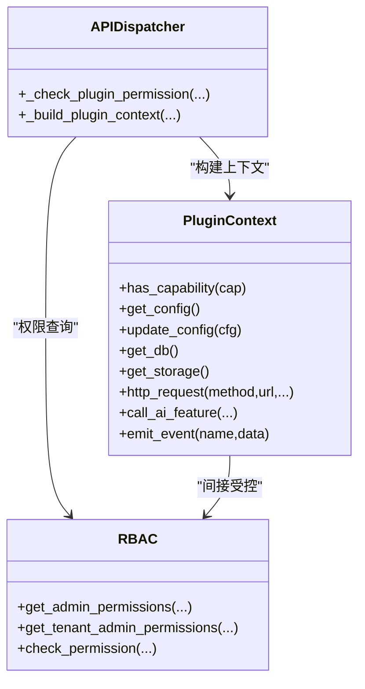
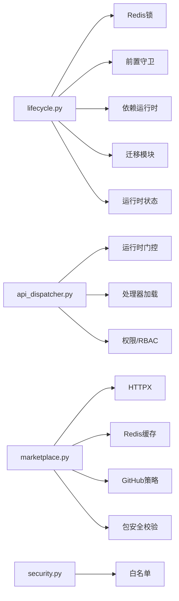

# 插件管理API

<cite>
**本文引用的文件**
- [backend/app/plugins/base.py](file://backend/app/plugins/base.py)
- [backend/app/plugins/lifecycle.py](file://backend/app/plugins/lifecycle.py)
- [backend/app/plugins/api_dispatcher.py](file://backend/app/plugins/api_dispatcher.py)
- [backend/app/plugins/marketplace.py](file://backend/app/plugins/marketplace.py)
- [backend/app/plugins/security.py](file://backend/app/plugins/security.py)
- [backend/app/plugins/context.py](file://backend/app/plugins/context.py)
- [backend/app/api/admin/plugins.py](file://backend/app/api/admin/plugins.py)
- [backend/app/api/tenant/plugins.py](file://backend/app/api/tenant/plugins.py)
- [backend/app/main.py](file://backend/app/main.py)
</cite>

## 目录
1. [简介](#简介)
2. [项目结构](#项目结构)
3. [核心组件](#核心组件)
4. [架构总览](#架构总览)
5. [详细组件分析](#详细组件分析)
6. [依赖分析](#依赖分析)
7. [性能考虑](#性能考虑)
8. [故障排查指南](#故障排查指南)
9. [结论](#结论)
10. [附录](#附录)

## 简介
本文件面向插件管理API，系统性梳理插件的生命周期、权限与能力模型、API扩展与分发、资源托管与事件订阅、插件市场集成、依赖与安全策略、以及在多租户环境下的沙箱隔离与资源限制。文档同时提供关键流程的序列图与时序图，帮助读者快速理解插件在平台内的运行机制。

## 项目结构
插件管理相关代码主要分布在以下位置：
- 插件内核与生命周期：backend/app/plugins/*
- 管理端与租户端API：backend/app/api/admin/plugins.py、backend/app/api/tenant/plugins.py
- 应用启动路由注册：backend/app/main.py

图表来源
- [backend/app/plugins/base.py](file://backend/app/plugins/base.py)
- [backend/app/plugins/lifecycle.py](file://backend/app/plugins/lifecycle.py)
- [backend/app/plugins/api_dispatcher.py](file://backend/app/plugins/api_dispatcher.py)
- [backend/app/plugins/marketplace.py](file://backend/app/plugins/marketplace.py)
- [backend/app/plugins/security.py](file://backend/app/plugins/security.py)
- [backend/app/plugins/context.py](file://backend/app/plugins/context.py)
- [backend/app/api/admin/plugins.py](file://backend/app/api/admin/plugins.py)
- [backend/app/api/tenant/plugins.py](file://backend/app/api/tenant/plugins.py)
- [backend/app/main.py](file://backend/app/main.py)

章节来源
- [backend/app/plugins/base.py](file://backend/app/plugins/base.py)
- [backend/app/plugins/lifecycle.py](file://backend/app/plugins/lifecycle.py)
- [backend/app/plugins/api_dispatcher.py](file://backend/app/plugins/api_dispatcher.py)
- [backend/app/plugins/marketplace.py](file://backend/app/plugins/marketplace.py)
- [backend/app/plugins/security.py](file://backend/app/plugins/security.py)
- [backend/app/plugins/context.py](file://backend/app/plugins/context.py)
- [backend/app/api/admin/plugins.py](file://backend/app/api/admin/plugins.py)
- [backend/app/api/tenant/plugins.py](file://backend/app/api/tenant/plugins.py)
- [backend/app/main.py](file://backend/app/main.py)

## 核心组件
- 插件基类与生命周期钩子：定义插件生命周期钩子（安装后、启用、禁用、卸载、升级），作为插件开发者扩展点。
- 生命周期管理器：封装安装、启用、禁用、卸载、依赖安装/卸载、修复、计划任务刷新等操作，内置分布式锁与前置守卫。
- API分发器：统一的插件API入口，按路径与方法匹配插件声明的路由，执行权限校验与能力注入，屏蔽动态路由增删。
- 插件市场客户端：从GitHub索引仓库拉取插件清单、详情、README，下载插件包，支持Redis缓存与重试。
- 安全与依赖白名单：对pip依赖进行白名单校验，限制可安装包范围。
- 沙箱上下文：插件与宿主交互的唯一入口，按能力授权开放有限API（配置、数据库、存储、HTTP、AI、通知、事件等）。

章节来源
- [backend/app/plugins/base.py](file://backend/app/plugins/base.py)
- [backend/app/plugins/lifecycle.py](file://backend/app/plugins/lifecycle.py)
- [backend/app/plugins/api_dispatcher.py](file://backend/app/plugins/api_dispatcher.py)
- [backend/app/plugins/marketplace.py](file://backend/app/plugins/marketplace.py)
- [backend/app/plugins/security.py](file://backend/app/plugins/security.py)
- [backend/app/plugins/context.py](file://backend/app/plugins/context.py)

## 架构总览
插件管理API采用“控制器-服务-内核”的分层设计。管理端与租户端控制器分别提供插件的CRUD、配置、权限、许可、依赖、菜单等管理能力；生命周期管理器负责安装、启用、禁用、卸载等操作；API分发器负责将请求路由到插件注册的处理器；沙箱上下文提供受控的系统能力访问；插件市场客户端负责外部生态集成。

图表来源
- [backend/app/api/admin/plugins.py](file://backend/app/api/admin/plugins.py)
- [backend/app/api/tenant/plugins.py](file://backend/app/api/tenant/plugins.py)
- [backend/app/plugins/lifecycle.py](file://backend/app/plugins/lifecycle.py)
- [backend/app/plugins/api_dispatcher.py](file://backend/app/plugins/api_dispatcher.py)
- [backend/app/plugins/context.py](file://backend/app/plugins/context.py)
- [backend/app/plugins/marketplace.py](file://backend/app/plugins/marketplace.py)
- [backend/app/plugins/security.py](file://backend/app/plugins/security.py)

## 详细组件分析

### 生命周期管理（安装、启用、禁用、卸载、依赖、修复）
- 分布式锁：对同一插件的并发启用/禁用/卸载进行互斥保护，避免竞态。
- 前置守卫：在关键操作前执行策略检查，阻止不符合条件的操作。
- 依赖管理：支持显式安装/卸载依赖，保证运行时环境一致性。
- 修复与计划刷新：在异常状态下恢复运行，同步任务调度定义。
- 卸载清理：执行14步清理流程，确保数据与依赖彻底移除。

图表来源
- [backend/app/api/admin/plugins.py](file://backend/app/api/admin/plugins.py)
- [backend/app/plugins/lifecycle.py](file://backend/app/plugins/lifecycle.py)

章节来源
- [backend/app/plugins/lifecycle.py](file://backend/app/plugins/lifecycle.py)
- [backend/app/api/admin/plugins.py](file://backend/app/api/admin/plugins.py)

### API扩展与分发（插件路由、权限与能力注入）
- 路由约定：统一前缀/admin/plugins/{name}/api/*、/tenant/plugins/{name}/api/*、/api/public/plugins/{name}/api/*。
- 路由匹配：基于manifest中声明的admin_routes/tenant_routes/public_routes，支持路径参数提取。
- 权限校验：当路由声明permission时，校验用户是否具备对应动作权限；公开路由仅允许auth=none。
- 能力注入：根据handler签名自动注入request、ctx、db（需db:own_tables能力）。
- 错误映射：将插件返回的错误转换为平台标准错误码与消息。

图表来源
- [backend/app/plugins/api_dispatcher.py](file://backend/app/plugins/api_dispatcher.py)

章节来源
- [backend/app/plugins/api_dispatcher.py](file://backend/app/plugins/api_dispatcher.py)

### 插件市场集成（索引、详情、下载、更新检查）
- 索引与详情：从GitHub索引仓库获取插件清单与详情，支持Redis缓存与本地回退。
- README获取：优先多语言README，回退至默认README。
- 下载与校验：下载zip包，校验大小与归档有效性，支持重试。
- 更新检查：对比已安装插件与市场最新版本，生成可更新列表。

图表来源
- [backend/app/plugins/marketplace.py](file://backend/app/plugins/marketplace.py)

章节来源
- [backend/app/plugins/marketplace.py](file://backend/app/plugins/marketplace.py)

### 权限模型、角色分配与访问控制
- 能力授权：插件通过manifest声明能力，运行时由PluginContext按能力授权访问受限API。
- 路由权限：路由可声明permission，API分发器校验用户是否具备相应动作权限。
- 角色与RBAC：管理端与租户端分别通过平台RBAC查询用户权限集合，校验插件动作权限。
- 沙箱约束：HTTP请求SSRF防护、存储命名空间隔离、通知目标校验等，防止越权与滥用。

图表来源
- [backend/app/plugins/context.py](file://backend/app/plugins/context.py)
- [backend/app/plugins/api_dispatcher.py](file://backend/app/plugins/api_dispatcher.py)

章节来源
- [backend/app/plugins/context.py](file://backend/app/plugins/context.py)
- [backend/app/plugins/api_dispatcher.py](file://backend/app/plugins/api_dispatcher.py)

### 多租户沙箱隔离与资源限制
- 命名空间隔离：存储驱动限定在plugins/{name}/命名空间；数据库仅允许插件自有表前缀。
- 能力白名单：仅授予明确声明的能力，避免越权访问。
- SSRF防护：HTTP请求强制超时、禁止follow_redirects、阻断私网与云元数据地址。
- 通知与事件：通知目标与模板校验，事件发布限定在插件自身命名空间。

章节来源
- [backend/app/plugins/context.py](file://backend/app/plugins/context.py)
- [backend/app/plugins/api_dispatcher.py](file://backend/app/plugins/api_dispatcher.py)

### 租户端插件可见性与前端插槽
- 可见插件列表：根据资源scope与租户分配过滤，仅返回当前租户可见且当前用户有前端入口权限的插件。
- 前端插槽：返回头部小部件、仪表盘小部件、设置页签、浮动面板、页面与通知UI等插槽数据。

章节来源
- [backend/app/api/tenant/plugins.py](file://backend/app/api/tenant/plugins.py)

## 依赖分析
- 插件生命周期依赖Redis分布式锁、前置守卫模块、依赖运行时、迁移模块与运行时状态模块。
- API分发器依赖运行时门控、插件处理器加载、权限服务与RBAC。
- 市场客户端依赖HTTPX、Redis缓存、GitHub源策略与包安全校验。
- 安全模块依赖依赖白名单与包大小限制。

图表来源
- [backend/app/plugins/lifecycle.py](file://backend/app/plugins/lifecycle.py)
- [backend/app/plugins/api_dispatcher.py](file://backend/app/plugins/api_dispatcher.py)
- [backend/app/plugins/marketplace.py](file://backend/app/plugins/marketplace.py)
- [backend/app/plugins/security.py](file://backend/app/plugins/security.py)

章节来源
- [backend/app/plugins/lifecycle.py](file://backend/app/plugins/lifecycle.py)
- [backend/app/plugins/api_dispatcher.py](file://backend/app/plugins/api_dispatcher.py)
- [backend/app/plugins/marketplace.py](file://backend/app/plugins/marketplace.py)
- [backend/app/plugins/security.py](file://backend/app/plugins/security.py)

## 性能考虑
- 缓存策略：市场索引与详情使用Redis缓存，降低网络抖动影响；API分发器对路由正则进行LRU缓存。
- 并发控制：生命周期操作使用分布式锁，避免长流程中的重复并发。
- I/O优化：HTTP请求设置超时与禁用重定向，减少潜在的慢请求与SSRF风险。
- 清理与修复：提供计划刷新与修复流程，降低异常状态对整体系统的影响。

## 故障排查指南
- 插件API返回错误码映射：将插件返回的错误标准化为平台错误码与消息，便于前端展示与定位。
- 权限不足：确认路由是否声明permission，用户是否具备相应动作权限；检查能力授权是否正确。
- 路由未匹配：检查manifest中admin_routes/tenant_routes/public_routes声明与请求方法、路径是否一致。
- 分布式锁冲突：生命周期操作返回409时，等待其他操作完成后重试。
- 市场下载失败：检查GitHub源URL、网络连通性与缓存状态；必要时回退本地registry。

章节来源
- [backend/app/plugins/api_dispatcher.py](file://backend/app/plugins/api_dispatcher.py)
- [backend/app/plugins/lifecycle.py](file://backend/app/plugins/lifecycle.py)
- [backend/app/plugins/marketplace.py](file://backend/app/plugins/marketplace.py)

## 结论
插件管理API通过清晰的生命周期、严格的权限与能力模型、统一的API分发与沙箱隔离，实现了插件在平台内的安全、可控与可扩展运行。配合插件市场集成与依赖安全策略，为插件生态提供了完整的开发、部署与运维支撑。

## 附录

### API端点概览（管理端）
- 启用插件：POST /plugins/{plugin_id}/enable
- 禁用插件：POST /plugins/{plugin_id}/disable
- 更新菜单配置：PUT /plugins/{plugin_id}/menu-config
- 同步清单：POST /plugins/{plugin_id}/sync-manifest
- 卸载插件：DELETE /plugins/{plugin_id}
- 刷新计划：POST /plugins/{plugin_id}/refresh-schedules
- 修复插件：POST /plugins/{plugin_id}/repair
- 强制清理孤儿：DELETE /plugins/{plugin_id}/force-cleanup
- 更新配置：PUT /plugins/{plugin_id}/config
- 更新能力：PUT /plugins/{plugin_id}/capabilities
- 上传图标：POST /plugins/{plugin_id}/icon
- 升级插件：POST /plugins/{plugin_id}/upgrade
- 回滚插件：POST /plugins/{plugin_id}/rollback
- 分配租户：POST /plugins/{plugin_id}/tenants
- 租户解绑：DELETE /plugins/{plugin_id}/tenants/{tenant_id}
- 激活许可：POST /plugins/{plugin_id}/activate-license
- 激活试用：POST /plugins/{plugin_id}/activate-trial
- 撤销许可：DELETE /plugins/{plugin_id}/license
- 删除备份：DELETE /plugins/{plugin_id}/backups/{backup_name}

章节来源
- [backend/app/api/admin/plugins.py](file://backend/app/api/admin/plugins.py)

### API端点概览（租户端）
- 可用插件列表：GET /plugins
- 前端插槽：GET /plugins/slots

章节来源
- [backend/app/api/tenant/plugins.py](file://backend/app/api/tenant/plugins.py)

### 路由注册（应用入口）
- 在应用启动时注册插件API路由：
  - /admin/plugins/{name}/api/*（管理端）
  - /tenant/plugins/{name}/api/*（租户端）
  - /api/public/plugins/{name}/api/*（公开路由）

章节来源
- [backend/app/main.py](file://backend/app/main.py)