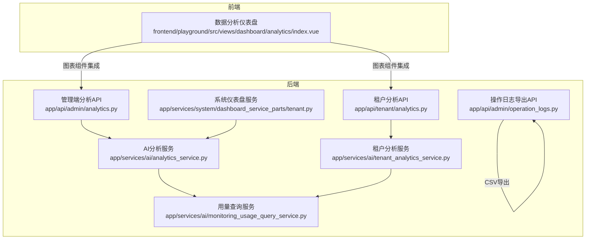
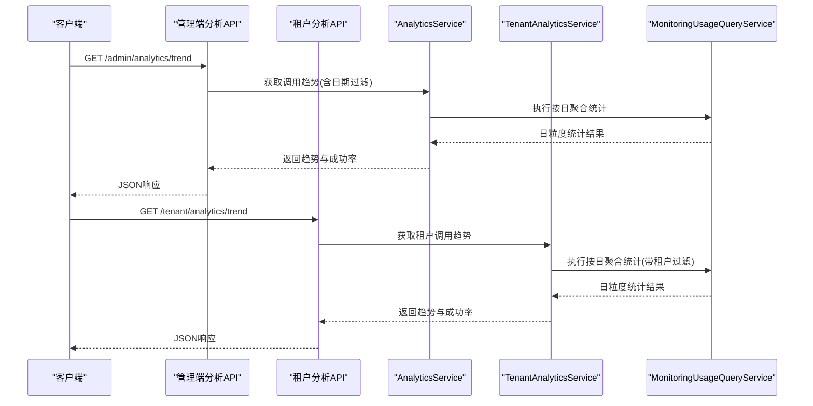
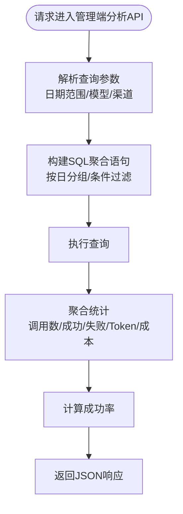
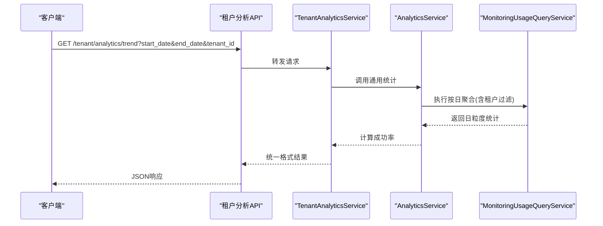
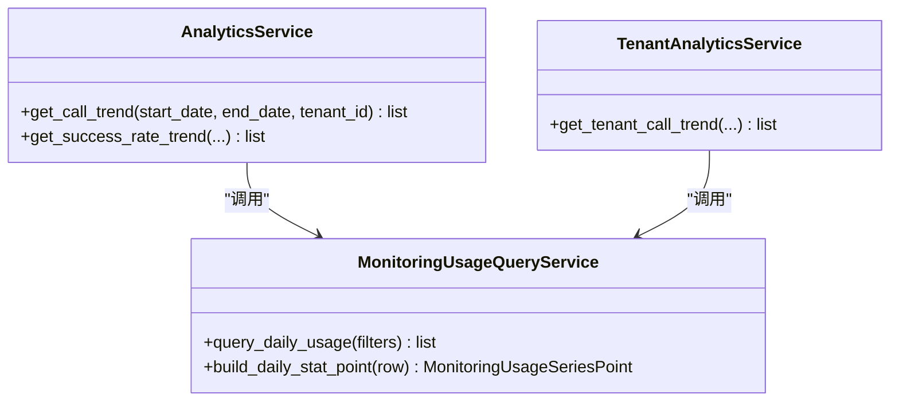
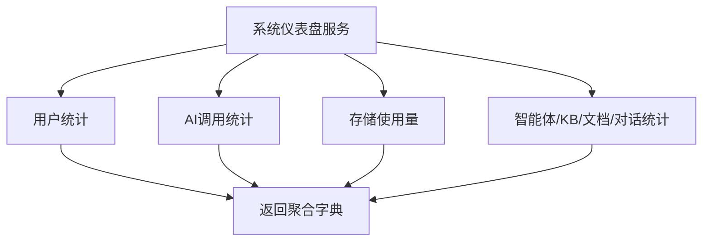
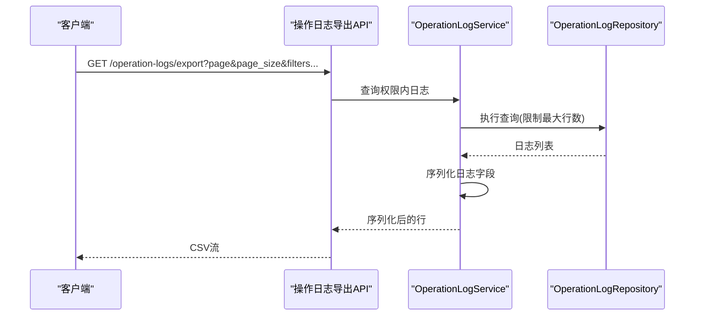
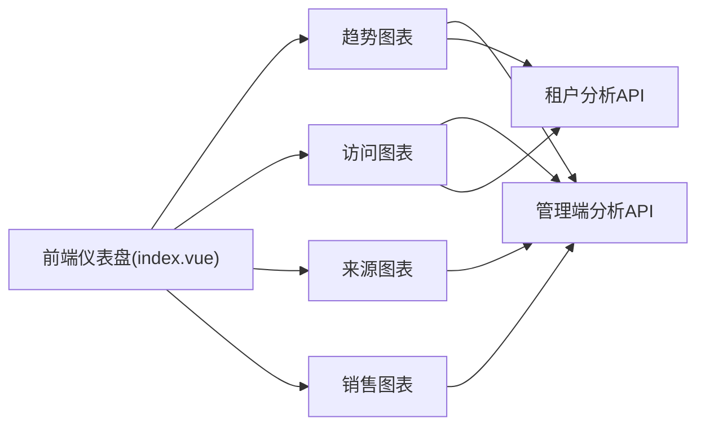
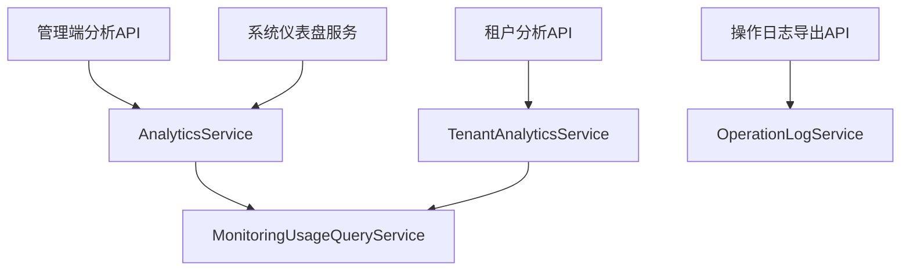

# 数据分析API

<cite>
**本文引用的文件**
- [analytics.py](file://backend/app/api/admin/analytics.py)
- [analytics.py](file://backend/app/api/tenant/analytics.py)
- [analytics_service.py](file://backend/app/services/ai/analytics_service.py)
- [tenant_analytics_service.py](file://backend/app/services/ai/tenant_analytics_service.py)
- [monitoring_usage_query_service.py](file://backend/app/services/ai/monitoring_usage_query_service.py)
- [dashboard_service_parts/tenant.py](file://backend/app/services/system/dashboard_service_parts/tenant.py)
- [operation_logs.py](file://backend/app/api/admin/operation_logs.py)
- [test_analytics_service.py](file://backend/tests/services/test_analytics_service.py)
- [test_tenant_analytics_service.py](file://backend/tests/services/test_tenant_analytics_service.py)
- [index.vue](file://frontend/playground/src/views/dashboard/analytics/index.vue)
</cite>

## 目录
1. [简介](#简介)
2. [项目结构](#项目结构)
3. [核心组件](#核心组件)
4. [架构总览](#架构总览)
5. [详细组件分析](#详细组件分析)
6. [依赖关系分析](#依赖关系分析)
7. [性能考量](#性能考量)
8. [故障排查指南](#故障排查指南)
9. [结论](#结论)
10. [附录](#附录)

## 简介
本文件面向数据分析API，系统化梳理统计与分析能力，包括调用趋势、性能指标、报表生成、AI调用统计、用户行为分析、资源消耗监控、数据导出与可视化集成、告警通知以及租户数据隐私与合规要求。文档以代码为依据，结合测试用例与前端集成示例，提供可操作的接口说明与最佳实践。

## 项目结构
数据分析API主要分布在后端的管理端与租户端API层，配合服务层进行统计聚合，并通过前端仪表盘进行可视化展示；同时提供操作日志导出能力用于审计与合规。

**图示来源**
- [analytics.py](file://backend/app/api/admin/analytics.py)
- [analytics.py](file://backend/app/api/tenant/analytics.py)
- [analytics_service.py](file://backend/app/services/ai/analytics_service.py)
- [tenant_analytics_service.py](file://backend/app/services/ai/tenant_analytics_service.py)
- [monitoring_usage_query_service.py](file://backend/app/services/ai/monitoring_usage_query_service.py)
- [dashboard_service_parts/tenant.py](file://backend/app/services/system/dashboard_service_parts/tenant.py)
- [operation_logs.py](file://backend/app/api/admin/operation_logs.py)
- [index.vue](file://frontend/playground/src/views/dashboard/analytics/index.vue)

**章节来源**
- [analytics.py](file://backend/app/api/admin/analytics.py)
- [analytics.py](file://backend/app/api/tenant/analytics.py)
- [analytics_service.py](file://backend/app/services/ai/analytics_service.py)
- [tenant_analytics_service.py](file://backend/app/services/ai/tenant_analytics_service.py)
- [monitoring_usage_query_service.py](file://backend/app/services/ai/monitoring_usage_query_service.py)
- [dashboard_service_parts/tenant.py](file://backend/app/services/system/dashboard_service_parts/tenant.py)
- [operation_logs.py](file://backend/app/api/admin/operation_logs.py)
- [index.vue](file://frontend/playground/src/views/dashboard/analytics/index.vue)

## 核心组件
- 管理端分析API：提供全局维度的调用趋势、成功率、Token与成本统计、模型与渠道分布、Top租户/用户/智能体等。
- 租户端分析API：面向租户侧的调用统计与趋势，支持日期过滤与租户隔离。
- 分析服务层：
  - AnalyticsService：通用统计聚合，支持按日分组的趋势数据与成功率计算。
  - TenantAnalyticsService：租户维度的统计封装。
  - MonitoringUsageQueryService：用量查询与汇总，支持按天、模型、渠道、租户TopN等多维聚合。
- 系统仪表盘服务：整合用户、对话、AI调用、存储等指标，输出仪表盘所需聚合数据。
- 操作日志导出API：支持CSV导出并进行字段序列化，满足审计与合规需求。
- 前端仪表盘：提供图表卡片与标签页布局，集成趋势与概览视图。

**章节来源**
- [analytics_service.py](file://backend/app/services/ai/analytics_service.py)
- [tenant_analytics_service.py](file://backend/app/services/ai/tenant_analytics_service.py)
- [monitoring_usage_query_service.py](file://backend/app/services/ai/monitoring_usage_query_service.py)
- [dashboard_service_parts/tenant.py](file://backend/app/services/system/dashboard_service_parts/tenant.py)
- [operation_logs.py](file://backend/app/api/admin/operation_logs.py)
- [index.vue](file://frontend/playground/src/views/dashboard/analytics/index.vue)

## 架构总览
数据分析API采用“控制器-服务-仓储/查询”的分层设计，服务层负责SQL聚合与统计计算，控制器暴露REST接口，前端通过组件化图表消费数据。

**图示来源**
- [analytics.py](file://backend/app/api/admin/analytics.py)
- [analytics.py](file://backend/app/api/tenant/analytics.py)
- [analytics_service.py](file://backend/app/services/ai/analytics_service.py)
- [tenant_analytics_service.py](file://backend/app/services/ai/tenant_analytics_service.py)
- [monitoring_usage_query_service.py](file://backend/app/services/ai/monitoring_usage_query_service.py)

## 详细组件分析

### 管理端分析API
- 接口路径：/admin/analytics
- 主要功能：
  - 调用趋势：按日统计调用次数、成功/失败次数、成功率。
  - Token与成本：按日统计输入/输出/总Token数与总成本。
  - 模型与渠道分布：按模型与接入渠道聚合用量。
  - Top租户/用户/智能体：基于调用次数或Token数排序。
- 关键实现：
  - 调用趋势与成功率计算由服务层完成，返回统一格式。
  - 用量查询服务提供SQL级聚合，确保性能与准确性。

**图示来源**
- [analytics.py](file://backend/app/api/admin/analytics.py)
- [monitoring_usage_query_service.py](file://backend/app/services/ai/monitoring_usage_query_service.py)

**章节来源**
- [analytics.py](file://backend/app/api/admin/analytics.py)
- [monitoring_usage_query_service.py](file://backend/app/services/ai/monitoring_usage_query_service.py)

### 租户分析API
- 接口路径：/tenant/analytics
- 主要功能：
  - 租户维度的调用趋势与成功率。
  - 支持传入租户ID进行数据隔离。
- 关键实现：
  - 租户服务在通用服务基础上增加租户过滤逻辑。
  - 测试覆盖了日期过滤、租户ID过滤等场景。

**图示来源**
- [analytics.py](file://backend/app/api/tenant/analytics.py)
- [tenant_analytics_service.py](file://backend/app/services/ai/tenant_analytics_service.py)
- [analytics_service.py](file://backend/app/services/ai/analytics_service.py)
- [monitoring_usage_query_service.py](file://backend/app/services/ai/monitoring_usage_query_service.py)

**章节来源**
- [analytics.py](file://backend/app/api/tenant/analytics.py)
- [tenant_analytics_service.py](file://backend/app/services/ai/tenant_analytics_service.py)
- [test_tenant_analytics_service.py](file://backend/tests/services/test_tenant_analytics_service.py)

### 用量查询服务（MonitoringUsageQueryService）
- 职责：
  - 提供按日维度的调用统计：调用次数、Token（输入/输出/总计）、总成本、成功/失败计数。
  - 输出统一的数据结构，便于上层服务组装。
- 性能特性：
  - 使用SQL分组与聚合，避免应用层循环计算。
  - 支持条件过滤（时间范围、租户、模型、渠道等）。

**图示来源**
- [monitoring_usage_query_service.py](file://backend/app/services/ai/monitoring_usage_query_service.py)
- [analytics_service.py](file://backend/app/services/ai/analytics_service.py)
- [tenant_analytics_service.py](file://backend/app/services/ai/tenant_analytics_service.py)

**章节来源**
- [monitoring_usage_query_service.py](file://backend/app/services/ai/monitoring_usage_query_service.py)
- [analytics_service.py](file://backend/app/services/ai/analytics_service.py)

### 系统仪表盘服务（DashboardServiceParts.Tenant）
- 职责：
  - 整合用户、对话、AI调用、存储等指标，输出仪表盘所需聚合数据。
- 指标示例：
  - 用户总数、活跃用户、API调用次数、总Token数、总成本、存储使用量、智能体/知识库/文档数量、月对话数等。

**图示来源**
- [dashboard_service_parts/tenant.py](file://backend/app/services/system/dashboard_service_parts/tenant.py)

**章节来源**
- [dashboard_service_parts/tenant.py](file://backend/app/services/system/dashboard_service_parts/tenant.py)

### 操作日志导出API（OperationLogService.Export）
- 职责：
  - 将操作日志导出为CSV，支持与列表接口相同的筛选参数。
  - 最大导出条数限制，确保性能与安全。
- 字段映射：
  - ID、用户名、模块、动作、IP、响应码、创建时间等。

**图示来源**
- [operation_logs.py](file://backend/app/api/admin/operation_logs.py)

**章节来源**
- [operation_logs.py](file://backend/app/api/admin/operation_logs.py)

### 前端可视化集成（数据分析仪表盘）
- 组件结构：
  - 概览卡片：用户量、访问量、下载量、使用量等。
  - 图表标签页：流量趋势、月访问量等。
  - 图表卡片：访问数量、访问来源、销售等。
- 集成方式：
  - 通过API获取数据，渲染图表组件，支持切换时间维度与筛选条件。

**图示来源**
- [index.vue](file://frontend/playground/src/views/dashboard/analytics/index.vue)
- [analytics.py](file://backend/app/api/admin/analytics.py)
- [analytics.py](file://backend/app/api/tenant/analytics.py)

**章节来源**
- [index.vue](file://frontend/playground/src/views/dashboard/analytics/index.vue)

## 依赖关系分析
- 控制器依赖服务层，服务层依赖用量查询服务与仓储/ORM。
- 管理端与租户端API共享通用服务，通过租户过滤实现数据隔离。
- 仪表盘服务整合多源指标，形成统一的聚合视图。
- 操作日志导出API依赖服务层的序列化与查询能力。

**图示来源**
- [analytics.py](file://backend/app/api/admin/analytics.py)
- [analytics.py](file://backend/app/api/tenant/analytics.py)
- [analytics_service.py](file://backend/app/services/ai/analytics_service.py)
- [tenant_analytics_service.py](file://backend/app/services/ai/tenant_analytics_service.py)
- [monitoring_usage_query_service.py](file://backend/app/services/ai/monitoring_usage_query_service.py)
- [dashboard_service_parts/tenant.py](file://backend/app/services/system/dashboard_service_parts/tenant.py)
- [operation_logs.py](file://backend/app/api/admin/operation_logs.py)

**章节来源**
- [analytics.py](file://backend/app/api/admin/analytics.py)
- [analytics.py](file://backend/app/api/tenant/analytics.py)
- [analytics_service.py](file://backend/app/services/ai/analytics_service.py)
- [tenant_analytics_service.py](file://backend/app/services/ai/tenant_analytics_service.py)
- [monitoring_usage_query_service.py](file://backend/app/services/ai/monitoring_usage_query_service.py)
- [dashboard_service_parts/tenant.py](file://backend/app/services/system/dashboard_service_parts/tenant.py)
- [operation_logs.py](file://backend/app/api/admin/operation_logs.py)

## 性能考量
- SQL聚合优先：用量查询服务通过SQL分组与聚合减少应用层处理开销。
- 日期范围过滤：明确的起止日期可显著缩小扫描范围，提升查询效率。
- 最大导出限制：操作日志导出限制最大行数，避免超大数据量导出导致的内存与网络压力。
- 缓存策略：建议对高频查询（如最近7/30天趋势）引入缓存，降低数据库压力。
- 分页与分片：大范围统计建议分页或按月分片，避免单次查询过大。

## 故障排查指南
- 趋势数据为空：
  - 检查日期范围是否正确设置，确认起止日期边界。
  - 确认是否存在租户过滤导致无数据。
- 成功率异常：
  - 核对成功/失败状态字段映射，确保统计口径一致。
  - 检查是否有大量失败调用导致分母接近0。
- 导出CSV内容缺失：
  - 确认筛选参数与权限范围，检查最大导出行数限制。
  - 核对序列化字段映射，确保中文标签正确显示。
- 前端图表不更新：
  - 检查API响应格式与字段名一致性。
  - 确认前端组件是否正确消费数据并触发重绘。

**章节来源**
- [test_analytics_service.py](file://backend/tests/services/test_analytics_service.py)
- [test_tenant_analytics_service.py](file://backend/tests/services/test_tenant_analytics_service.py)
- [operation_logs.py](file://backend/app/api/admin/operation_logs.py)

## 结论
数据分析API通过清晰的分层设计与SQL聚合实现了高效、可扩展的统计与分析能力。管理端与租户端API分别满足全局与租户维度的洞察需求，配合仪表盘与日志导出，形成完整的数据可观测性闭环。建议在生产环境中结合缓存、分页与合规导出策略，持续优化性能与安全性。

## 附录
- 实际使用示例（概念性说明）：
  - AI调用统计：按日趋势查看调用次数、Token消耗与成本变化，辅助预算与容量规划。
  - 用户行为分析：结合操作日志导出，定位高频操作与异常行为，支撑风控与审计。
  - 资源消耗监控：通过仪表盘聚合用户、对话、存储与调用指标，建立SLI/SLO。
  - 报表生成：将趋势与TopN结果导出为CSV，对接BI工具进行深度分析。
  - 可视化集成：前端图表组件直接消费API，支持切换时间维度与租户筛选。
  - 告警通知：基于趋势阈值与成功率异常，触发通知任务（如邮件/站内信），建议通过后台任务队列异步处理。
- 隐私与合规：
  - 租户数据隔离：API与服务层均支持按租户过滤，确保跨租户数据不可见。
  - 操作日志导出：提供CSV导出能力，满足审计留痕与合规要求。
  - 最大导出限制：防止敏感数据大规模外泄，建议结合权限控制与水印策略。