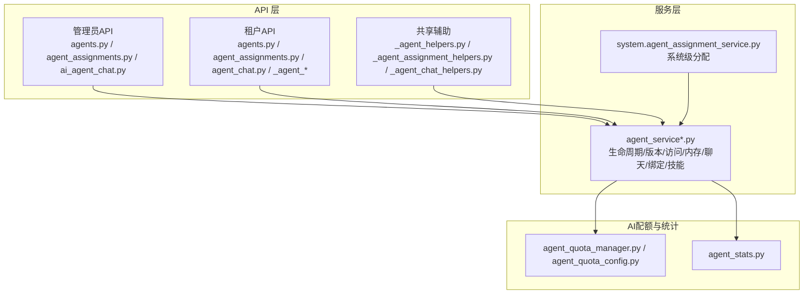
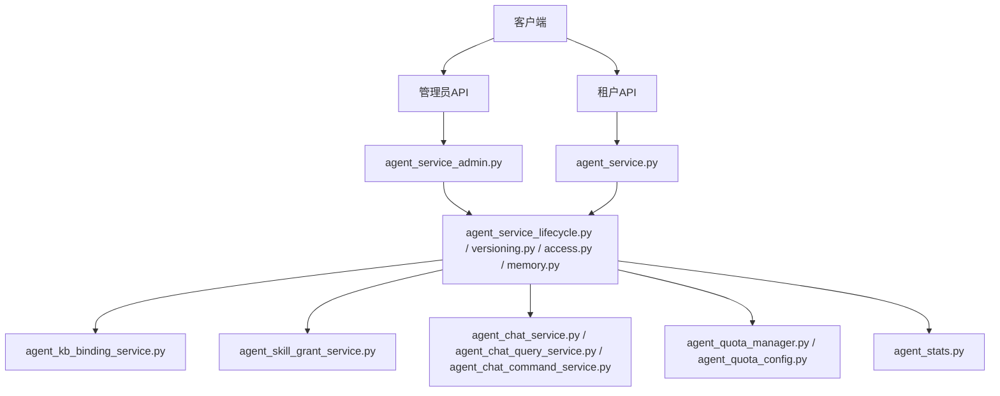
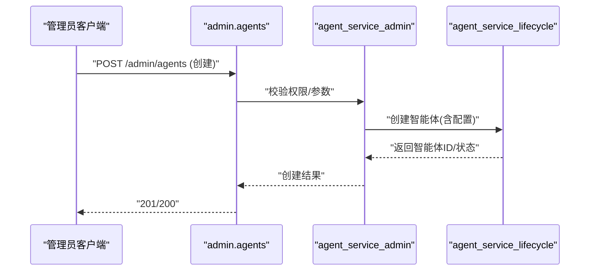
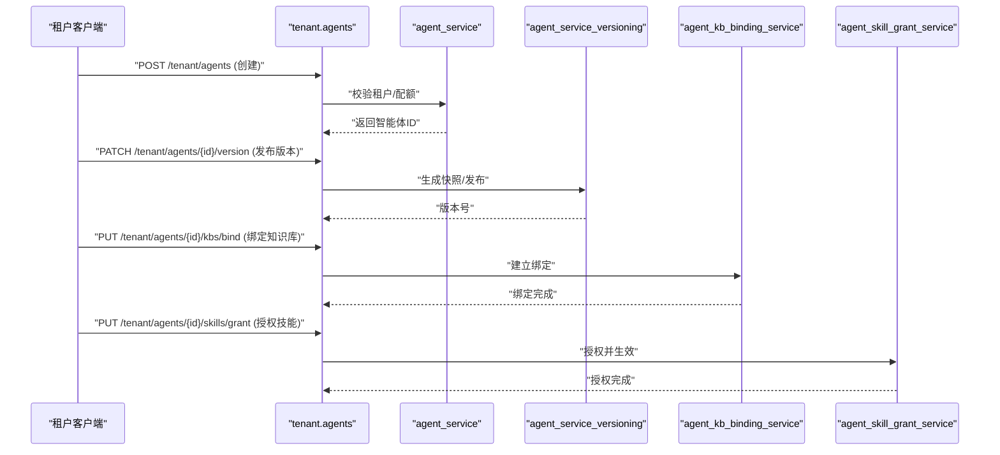
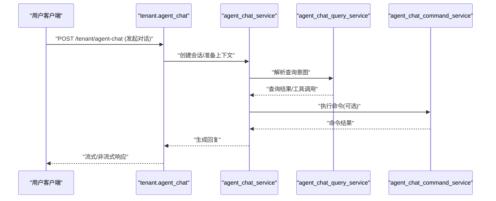
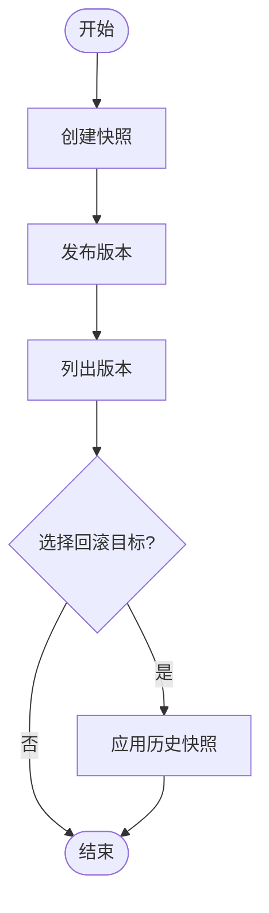
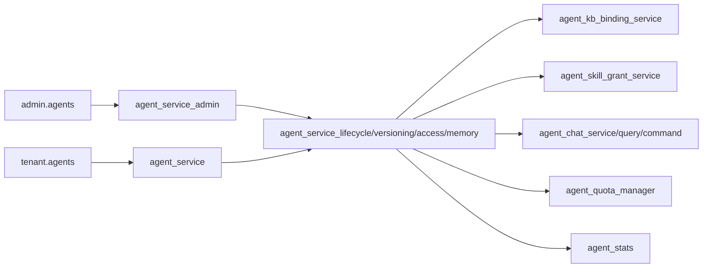

# 智能体管理API

<cite>
**本文引用的文件**
- [backend/app/api/admin/agents.py](file://backend/app/api/admin/agents.py)
- [backend/app/api/admin/agent_assignments.py](file://backend/app/api/admin/agent_assignments.py)
- [backend/app/api/admin/ai_agent_chat.py](file://backend/app/api/admin/ai_agent_chat.py)
- [backend/app/api/tenant/agents.py](file://backend/app/api/tenant/agents.py)
- [backend/app/api/tenant/agent_assignments.py](file://backend/app/api/tenant/agent_assignments.py)
- [backend/app/api/tenant/agent_chat.py](file://backend/app/api/tenant/agent_chat.py)
- [backend/app/api/tenant/_agent_batch.py](file://backend/app/api/tenant/_agent_batch.py)
- [backend/app/api/tenant/_agent_kbs.py](file://backend/app/api/tenant/_agent_kbs.py)
- [backend/app/api/tenant/_agent_skills.py](file://backend/app/api/tenant/_agent_skills.py)
- [backend/app/api/tenant/_agent_version.py](file://backend/app/api/tenant/_agent_version.py)
- [backend/app/api/shared/_agent_helpers.py](file://backend/app/api/shared/_agent_helpers.py)
- [backend/app/api/shared/_agent_assignment_helpers.py](file://backend/app/api/shared/_agent_assignment_helpers.py)
- [backend/app/api/shared/_agent_chat_helpers.py](file://backend/app/api/shared/_agent_chat_helpers.py)
- [backend/app/services/ai/agent_service.py](file://backend/app/services/ai/agent_service.py)
- [backend/app/services/ai/agent_service_lifecycle.py](file://backend/app/services/ai/agent_service_lifecycle.py)
- [backend/app/services/ai/agent_service_versioning.py](file://backend/app/services/ai/agent_service_versioning.py)
- [backend/app/services/ai/agent_service_access.py](file://backend/app/services/ai/agent_service_access.py)
- [backend/app/services/ai/agent_service_memory.py](file://backend/app/services/ai/agent_service_memory.py)
- [backend/app/services/ai/agent_service_admin.py](file://backend/app/services/ai/agent_service_admin.py)
- [backend/app/services/ai/agent_chat_service.py](file://backend/app/services/ai/agent_chat_service.py)
- [backend/app/services/ai/agent_chat_query_service.py](file://backend/app/services/ai/agent_chat_query_service.py)
- [backend/app/services/ai/agent_chat_command_service.py](file://backend/app/services/ai/agent_chat_command_service.py)
- [backend/app/services/ai/agent_kb_binding_service.py](file://backend/app/services/ai/agent_kb_binding_service.py)
- [backend/app/services/ai/agent_skill_grant_service.py](file://backend/app/services/ai/agent_skill_grant_service.py)
- [backend/app/services/system/agent_assignment_service.py](file://backend/app/services/system/agent_assignment_service.py)
- [backend/app/ai/agent_quota_manager.py](file://backend/app/ai/agent_quota_manager.py)
- [backend/app/ai/agent_quota_config.py](file://backend/app/ai/agent_quota_config.py)
- [backend/app/ai/agent_stats.py](file://backend/app/ai/agent_stats.py)
</cite>

## 目录
1. [简介](#简介)
2. [项目结构](#项目结构)
3. [核心组件](#核心组件)
4. [架构总览](#架构总览)
5. [详细组件分析](#详细组件分析)
6. [依赖关系分析](#依赖关系分析)
7. [性能考虑](#性能考虑)
8. [故障排查指南](#故障排查指南)
9. [结论](#结论)
10. [附录](#附录)

## 简介
本文件面向智能体（Agent）管理API，覆盖从创建、配置、部署到版本管理的全生命周期接口；详述智能体与知识库绑定、技能授权、批量操作等能力；明确智能体配置参数、输出模式、交互策略的API说明；提供版本控制、回滚机制与性能监控的实际使用示例；解释在租户环境中的资源分配与使用统计。

## 项目结构
智能体相关API按角色与功能分层组织：
- 管理员端：提供全局视角的智能体管理、聊天审计、系统级分配与统计
- 租户端：提供租户范围内的智能体创建、配置、聊天、版本与批量操作
- 共享层：封装通用的智能体辅助逻辑（如帮助器、聊天助手）
- 服务层：实现业务逻辑（生命周期、版本化、访问控制、内存策略、聊天处理、KB/技能绑定等）

**图表来源**
- [backend/app/api/admin/agents.py](file://backend/app/api/admin/agents.py)
- [backend/app/api/tenant/agents.py](file://backend/app/api/tenant/agents.py)
- [backend/app/api/tenant/_agent_version.py](file://backend/app/api/tenant/_agent_version.py)
- [backend/app/api/tenant/_agent_kbs.py](file://backend/app/api/tenant/_agent_kbs.py)
- [backend/app/api/tenant/_agent_skills.py](file://backend/app/api/tenant/_agent_skills.py)
- [backend/app/services/ai/agent_service.py](file://backend/app/services/ai/agent_service.py)
- [backend/app/services/ai/agent_service_versioning.py](file://backend/app/services/ai/agent_service_versioning.py)
- [backend/app/services/ai/agent_service_access.py](file://backend/app/services/ai/agent_service_access.py)
- [backend/app/services/ai/agent_service_memory.py](file://backend/app/services/ai/agent_service_memory.py)
- [backend/app/services/ai/agent_chat_service.py](file://backend/app/services/ai/agent_chat_service.py)
- [backend/app/services/ai/agent_kb_binding_service.py](file://backend/app/services/ai/agent_kb_binding_service.py)
- [backend/app/services/ai/agent_skill_grant_service.py](file://backend/app/services/ai/agent_skill_grant_service.py)
- [backend/app/services/system/agent_assignment_service.py](file://backend/app/services/system/agent_assignment_service.py)
- [backend/app/ai/agent_quota_manager.py](file://backend/app/ai/agent_quota_manager.py)
- [backend/app/ai/agent_quota_config.py](file://backend/app/ai/agent_quota_config.py)
- [backend/app/ai/agent_stats.py](file://backend/app/ai/agent_stats.py)

**章节来源**
- [backend/app/api/admin/agents.py](file://backend/app/api/admin/agents.py)
- [backend/app/api/tenant/agents.py](file://backend/app/api/tenant/agents.py)
- [backend/app/api/tenant/_agent_version.py](file://backend/app/api/tenant/_agent_version.py)
- [backend/app/api/tenant/_agent_kbs.py](file://backend/app/api/tenant/_agent_kbs.py)
- [backend/app/api/tenant/_agent_skills.py](file://backend/app/api/tenant/_agent_skills.py)
- [backend/app/api/tenant/_agent_batch.py](file://backend/app/api/tenant/_agent_batch.py)
- [backend/app/api/tenant/agent_chat.py](file://backend/app/api/tenant/agent_chat.py)
- [backend/app/api/admin/ai_agent_chat.py](file://backend/app/api/admin/ai_agent_chat.py)
- [backend/app/api/shared/_agent_helpers.py](file://backend/app/api/shared/_agent_helpers.py)
- [backend/app/api/shared/_agent_assignment_helpers.py](file://backend/app/api/shared/_agent_assignment_helpers.py)
- [backend/app/api/shared/_agent_chat_helpers.py](file://backend/app/api/shared/_agent_chat_helpers.py)

## 核心组件
- 管理员智能体管理API：提供智能体的创建、更新、删除、可见性控制、路由配置、上下文与输出模式等；支持聊天审计与查询
- 租户智能体管理API：提供租户内智能体的创建、配置、部署、版本化、批量操作、与知识库/技能绑定、聊天入口
- 共享辅助模块：封装智能体元数据、分配策略、聊天会话处理等通用逻辑
- 服务层：实现生命周期管理（创建、部署、停用、删除）、版本化（快照、发布、回滚）、访问控制、内存策略、聊天处理、KB/技能绑定与授权、系统分配
- 配额与统计：基于租户维度的并发与用量配额管理，以及智能体运行时统计

**章节来源**
- [backend/app/services/ai/agent_service.py](file://backend/app/services/ai/agent_service.py)
- [backend/app/services/ai/agent_service_lifecycle.py](file://backend/app/services/ai/agent_service_lifecycle.py)
- [backend/app/services/ai/agent_service_versioning.py](file://backend/app/services/ai/agent_service_versioning.py)
- [backend/app/services/ai/agent_service_access.py](file://backend/app/services/ai/agent_service_access.py)
- [backend/app/services/ai/agent_service_memory.py](file://backend/app/services/ai/agent_service_memory.py)
- [backend/app/services/ai/agent_chat_service.py](file://backend/app/services/ai/agent_chat_service.py)
- [backend/app/services/ai/agent_kb_binding_service.py](file://backend/app/services/ai/agent_kb_binding_service.py)
- [backend/app/services/ai/agent_skill_grant_service.py](file://backend/app/services/ai/agent_skill_grant_service.py)
- [backend/app/services/system/agent_assignment_service.py](file://backend/app/services/system/agent_assignment_service.py)
- [backend/app/ai/agent_quota_manager.py](file://backend/app/ai/agent_quota_manager.py)
- [backend/app/ai/agent_quota_config.py](file://backend/app/ai/agent_quota_config.py)
- [backend/app/ai/agent_stats.py](file://backend/app/ai/agent_stats.py)

## 架构总览
智能体管理API采用“API层-服务层-基础设施”的分层设计。API层负责请求接入与权限校验，服务层承载业务规则，基础设施包括配额与统计模块。

**图表来源**
- [backend/app/api/admin/agents.py](file://backend/app/api/admin/agents.py)
- [backend/app/api/tenant/agents.py](file://backend/app/api/tenant/agents.py)
- [backend/app/services/ai/agent_service_admin.py](file://backend/app/services/ai/agent_service_admin.py)
- [backend/app/services/ai/agent_service.py](file://backend/app/services/ai/agent_service.py)
- [backend/app/services/ai/agent_service_lifecycle.py](file://backend/app/services/ai/agent_service_lifecycle.py)
- [backend/app/services/ai/agent_service_versioning.py](file://backend/app/services/ai/agent_service_versioning.py)
- [backend/app/services/ai/agent_service_access.py](file://backend/app/services/ai/agent_service_access.py)
- [backend/app/services/ai/agent_service_memory.py](file://backend/app/services/ai/agent_service_memory.py)
- [backend/app/services/ai/agent_kb_binding_service.py](file://backend/app/services/ai/agent_kb_binding_service.py)
- [backend/app/services/ai/agent_skill_grant_service.py](file://backend/app/services/ai/agent_skill_grant_service.py)
- [backend/app/services/ai/agent_chat_service.py](file://backend/app/services/ai/agent_chat_service.py)
- [backend/app/services/ai/agent_chat_query_service.py](file://backend/app/services/ai/agent_chat_query_service.py)
- [backend/app/services/ai/agent_chat_command_service.py](file://backend/app/services/ai/agent_chat_command_service.py)
- [backend/app/ai/agent_quota_manager.py](file://backend/app/ai/agent_quota_manager.py)
- [backend/app/ai/agent_quota_config.py](file://backend/app/ai/agent_quota_config.py)
- [backend/app/ai/agent_stats.py](file://backend/app/ai/agent_stats.py)

## 详细组件分析

### 管理员智能体管理API
- 能力概览
  - 创建/更新/删除/启用/停用智能体
  - 设置可见性与访问策略
  - 配置路由、上下文、输出模式
  - 审计聊天记录与查询
- 关键接口路径
  - [agents.py](file://backend/app/api/admin/agents.py)
  - [agent_assignments.py](file://backend/app/api/admin/agent_assignments.py)
  - [ai_agent_chat.py](file://backend/app/api/admin/ai_agent_chat.py)
- 服务支撑
  - [agent_service_admin.py](file://backend/app/services/ai/agent_service_admin.py)
  - [agent_service_access.py](file://backend/app/services/ai/agent_service_access.py)
  - [agent_service_lifecycle.py](file://backend/app/services/ai/agent_service_lifecycle.py)

**图表来源**
- [backend/app/api/admin/agents.py](file://backend/app/api/admin/agents.py)
- [backend/app/services/ai/agent_service_admin.py](file://backend/app/services/ai/agent_service_admin.py)
- [backend/app/services/ai/agent_service_lifecycle.py](file://backend/app/services/ai/agent_service_lifecycle.py)

**章节来源**
- [backend/app/api/admin/agents.py](file://backend/app/api/admin/agents.py)
- [backend/app/api/admin/agent_assignments.py](file://backend/app/api/admin/agent_assignments.py)
- [backend/app/api/admin/ai_agent_chat.py](file://backend/app/api/admin/ai_agent_chat.py)
- [backend/app/services/ai/agent_service_admin.py](file://backend/app/services/ai/agent_service_admin.py)
- [backend/app/services/ai/agent_service_access.py](file://backend/app/services/ai/agent_service_access.py)
- [backend/app/services/ai/agent_service_lifecycle.py](file://backend/app/services/ai/agent_service_lifecycle.py)

### 租户智能体管理API
- 能力概览
  - 租户内创建/配置/部署/删除智能体
  - 版本化与回滚
  - 批量操作（创建/部署/删除）
  - 绑定知识库与授权技能
  - 聊天入口与会话
- 关键接口路径
  - [agents.py](file://backend/app/api/tenant/agents.py)
  - [_agent_version.py](file://backend/app/api/tenant/_agent_version.py)
  - [_agent_batch.py](file://backend/app/api/tenant/_agent_batch.py)
  - [_agent_kbs.py](file://backend/app/api/tenant/_agent_kbs.py)
  - [_agent_skills.py](file://backend/app/api/tenant/_agent_skills.py)
  - [agent_chat.py](file://backend/app/api/tenant/agent_chat.py)
  - [agent_assignments.py](file://backend/app/api/tenant/agent_assignments.py)
- 服务支撑
  - [agent_service.py](file://backend/app/services/ai/agent_service.py)
  - [agent_service_versioning.py](file://backend/app/services/ai/agent_service_versioning.py)
  - [agent_service_lifecycle.py](file://backend/app/services/ai/agent_service_lifecycle.py)
  - [agent_kb_binding_service.py](file://backend/app/services/ai/agent_kb_binding_service.py)
  - [agent_skill_grant_service.py](file://backend/app/services/ai/agent_skill_grant_service.py)
  - [agent_chat_service.py](file://backend/app/services/ai/agent_chat_service.py)
  - [agent_chat_query_service.py](file://backend/app/services/ai/agent_chat_query_service.py)
  - [agent_chat_command_service.py](file://backend/app/services/ai/agent_chat_command_service.py)
  - [system/agent_assignment_service.py](file://backend/app/services/system/agent_assignment_service.py)

**图表来源**
- [backend/app/api/tenant/agents.py](file://backend/app/api/tenant/agents.py)
- [backend/app/api/tenant/_agent_version.py](file://backend/app/api/tenant/_agent_version.py)
- [backend/app/api/tenant/_agent_kbs.py](file://backend/app/api/tenant/_agent_kbs.py)
- [backend/app/api/tenant/_agent_skills.py](file://backend/app/api/tenant/_agent_skills.py)
- [backend/app/services/ai/agent_service.py](file://backend/app/services/ai/agent_service.py)
- [backend/app/services/ai/agent_service_versioning.py](file://backend/app/services/ai/agent_service_versioning.py)
- [backend/app/services/ai/agent_kb_binding_service.py](file://backend/app/services/ai/agent_kb_binding_service.py)
- [backend/app/services/ai/agent_skill_grant_service.py](file://backend/app/services/ai/agent_skill_grant_service.py)

**章节来源**
- [backend/app/api/tenant/agents.py](file://backend/app/api/tenant/agents.py)
- [backend/app/api/tenant/_agent_version.py](file://backend/app/api/tenant/_agent_version.py)
- [backend/app/api/tenant/_agent_batch.py](file://backend/app/api/tenant/_agent_batch.py)
- [backend/app/api/tenant/_agent_kbs.py](file://backend/app/api/tenant/_agent_kbs.py)
- [backend/app/api/tenant/_agent_skills.py](file://backend/app/api/tenant/_agent_skills.py)
- [backend/app/api/tenant/agent_chat.py](file://backend/app/api/tenant/agent_chat.py)
- [backend/app/api/tenant/agent_assignments.py](file://backend/app/api/tenant/agent_assignments.py)
- [backend/app/services/ai/agent_service.py](file://backend/app/services/ai/agent_service.py)
- [backend/app/services/ai/agent_service_versioning.py](file://backend/app/services/ai/agent_service_versioning.py)
- [backend/app/services/ai/agent_service_lifecycle.py](file://backend/app/services/ai/agent_service_lifecycle.py)
- [backend/app/services/ai/agent_kb_binding_service.py](file://backend/app/services/ai/agent_kb_binding_service.py)
- [backend/app/services/ai/agent_skill_grant_service.py](file://backend/app/services/ai/agent_skill_grant_service.py)
- [backend/app/services/system/agent_assignment_service.py](file://backend/app/services/system/agent_assignment_service.py)

### 共享辅助模块
- 功能要点
  - 智能体元数据与默认值处理
  - 分配策略与可见性过滤
  - 聊天会话与消息投影
- 关键文件
  - [_agent_helpers.py](file://backend/app/api/shared/_agent_helpers.py)
  - [_agent_assignment_helpers.py](file://backend/app/api/shared/_agent_assignment_helpers.py)
  - [_agent_chat_helpers.py](file://backend/app/api/shared/_agent_chat_helpers.py)

**章节来源**
- [backend/app/api/shared/_agent_helpers.py](file://backend/app/api/shared/_agent_helpers.py)
- [backend/app/api/shared/_agent_assignment_helpers.py](file://backend/app/api/shared/_agent_assignment_helpers.py)
- [backend/app/api/shared/_agent_chat_helpers.py](file://backend/app/api/shared/_agent_chat_helpers.py)

### 聊天与交互
- 能力概览
  - 租户/用户侧聊天入口
  - 查询与命令处理
  - 流式引导与会话投影
- 关键服务
  - [agent_chat_service.py](file://backend/app/services/ai/agent_chat_service.py)
  - [agent_chat_query_service.py](file://backend/app/services/ai/agent_chat_query_service.py)
  - [agent_chat_command_service.py](file://backend/app/services/ai/agent_chat_command_service.py)

**图表来源**
- [backend/app/api/tenant/agent_chat.py](file://backend/app/api/tenant/agent_chat.py)
- [backend/app/services/ai/agent_chat_service.py](file://backend/app/services/ai/agent_chat_service.py)
- [backend/app/services/ai/agent_chat_query_service.py](file://backend/app/services/ai/agent_chat_query_service.py)
- [backend/app/services/ai/agent_chat_command_service.py](file://backend/app/services/ai/agent_chat_command_service.py)

**章节来源**
- [backend/app/api/tenant/agent_chat.py](file://backend/app/api/tenant/agent_chat.py)
- [backend/app/services/ai/agent_chat_service.py](file://backend/app/services/ai/agent_chat_service.py)
- [backend/app/services/ai/agent_chat_query_service.py](file://backend/app/services/ai/agent_chat_query_service.py)
- [backend/app/services/ai/agent_chat_command_service.py](file://backend/app/services/ai/agent_chat_command_service.py)

### 版本控制与回滚
- 能力概览
  - 快照与发布版本
  - 回滚至历史版本
  - 版本变更追踪
- 关键服务
  - [agent_service_versioning.py](file://backend/app/services/ai/agent_service_versioning.py)
  - [_agent_version.py](file://backend/app/api/tenant/_agent_version.py)

**图表来源**
- [backend/app/services/ai/agent_service_versioning.py](file://backend/app/services/ai/agent_service_versioning.py)
- [backend/app/api/tenant/_agent_version.py](file://backend/app/api/tenant/_agent_version.py)

**章节来源**
- [backend/app/services/ai/agent_service_versioning.py](file://backend/app/services/ai/agent_service_versioning.py)
- [backend/app/api/tenant/_agent_version.py](file://backend/app/api/tenant/_agent_version.py)

### 知识库绑定与技能授权
- 能力概览
  - 绑定/解绑知识库
  - 授权/撤销技能
  - 绑定一致性与权限校验
- 关键服务
  - [agent_kb_binding_service.py](file://backend/app/services/ai/agent_kb_binding_service.py)
  - [agent_skill_grant_service.py](file://backend/app/services/ai/agent_skill_grant_service.py)
  - [_agent_kbs.py](file://backend/app/api/tenant/_agent_kbs.py)
  - [_agent_skills.py](file://backend/app/api/tenant/_agent_skills.py)

**章节来源**
- [backend/app/services/ai/agent_kb_binding_service.py](file://backend/app/services/ai/agent_kb_binding_service.py)
- [backend/app/services/ai/agent_skill_grant_service.py](file://backend/app/services/ai/agent_skill_grant_service.py)
- [backend/app/api/tenant/_agent_kbs.py](file://backend/app/api/tenant/_agent_kbs.py)
- [backend/app/api/tenant/_agent_skills.py](file://backend/app/api/tenant/_agent_skills.py)

### 批量操作
- 能力概览
  - 批量创建/部署/删除智能体
  - 批量绑定知识库/授权技能
- 关键文件
  - [_agent_batch.py](file://backend/app/api/tenant/_agent_batch.py)

**章节来源**
- [backend/app/api/tenant/_agent_batch.py](file://backend/app/api/tenant/_agent_batch.py)

### 配额与统计
- 能力概览
  - 并发与用量配额管理
  - 租户维度使用统计
- 关键模块
  - [agent_quota_manager.py](file://backend/app/ai/agent_quota_manager.py)
  - [agent_quota_config.py](file://backend/app/ai/agent_quota_config.py)
  - [agent_stats.py](file://backend/app/ai/agent_stats.py)

**章节来源**
- [backend/app/ai/agent_quota_manager.py](file://backend/app/ai/agent_quota_manager.py)
- [backend/app/ai/agent_quota_config.py](file://backend/app/ai/agent_quota_config.py)
- [backend/app/ai/agent_stats.py](file://backend/app/ai/agent_stats.py)

## 依赖关系分析
- API层对服务层的依赖：API仅负责输入校验与鉴权，具体业务由服务层实现
- 服务层内部耦合：生命周期、版本化、访问控制、内存策略、聊天、绑定与授权相互协作
- 外部依赖：配额与统计模块提供资源约束与观测数据

**图表来源**
- [backend/app/api/admin/agents.py](file://backend/app/api/admin/agents.py)
- [backend/app/api/tenant/agents.py](file://backend/app/api/tenant/agents.py)
- [backend/app/services/ai/agent_service_admin.py](file://backend/app/services/ai/agent_service_admin.py)
- [backend/app/services/ai/agent_service.py](file://backend/app/services/ai/agent_service.py)
- [backend/app/services/ai/agent_service_lifecycle.py](file://backend/app/services/ai/agent_service_lifecycle.py)
- [backend/app/services/ai/agent_service_versioning.py](file://backend/app/services/ai/agent_service_versioning.py)
- [backend/app/services/ai/agent_service_access.py](file://backend/app/services/ai/agent_service_access.py)
- [backend/app/services/ai/agent_service_memory.py](file://backend/app/services/ai/agent_service_memory.py)
- [backend/app/services/ai/agent_kb_binding_service.py](file://backend/app/services/ai/agent_kb_binding_service.py)
- [backend/app/services/ai/agent_skill_grant_service.py](file://backend/app/services/ai/agent_skill_grant_service.py)
- [backend/app/services/ai/agent_chat_service.py](file://backend/app/services/ai/agent_chat_service.py)
- [backend/app/ai/agent_quota_manager.py](file://backend/app/ai/agent_quota_manager.py)
- [backend/app/ai/agent_stats.py](file://backend/app/ai/agent_stats.py)

**章节来源**
- [backend/app/services/ai/agent_service.py](file://backend/app/services/ai/agent_service.py)
- [backend/app/services/ai/agent_service_lifecycle.py](file://backend/app/services/ai/agent_service_lifecycle.py)
- [backend/app/services/ai/agent_service_versioning.py](file://backend/app/services/ai/agent_service_versioning.py)
- [backend/app/services/ai/agent_service_access.py](file://backend/app/services/ai/agent_service_access.py)
- [backend/app/services/ai/agent_service_memory.py](file://backend/app/services/ai/agent_service_memory.py)
- [backend/app/services/ai/agent_chat_service.py](file://backend/app/services/ai/agent_chat_service.py)
- [backend/app/services/ai/agent_kb_binding_service.py](file://backend/app/services/ai/agent_kb_binding_service.py)
- [backend/app/services/ai/agent_skill_grant_service.py](file://backend/app/services/ai/agent_skill_grant_service.py)
- [backend/app/ai/agent_quota_manager.py](file://backend/app/ai/agent_quota_manager.py)
- [backend/app/ai/agent_stats.py](file://backend/app/ai/agent_stats.py)

## 性能考虑
- 并发与配额：通过配额管理限制租户内智能体并发与用量，避免资源争用
- 缓存与索引：聊天与查询服务可结合缓存与索引优化响应时间
- 异步批处理：批量操作建议异步执行并提供进度反馈
- 观测与告警：利用统计模块进行性能监控与异常告警

[本节为通用指导，无需特定文件引用]

## 故障排查指南
- 常见问题
  - 权限不足：确认租户/管理员角色与资源范围
  - 配额超限：检查并发与用量配额，必要时扩容
  - 绑定失败：核对知识库/技能状态与权限
  - 聊天无响应：检查模型可用性与路由配置
- 可用性检查
  - 查看聊天审计日志
  - 核对版本发布状态与回滚点
  - 检查系统分配与可见性设置

**章节来源**
- [backend/app/api/admin/ai_agent_chat.py](file://backend/app/api/admin/ai_agent_chat.py)
- [backend/app/ai/agent_quota_manager.py](file://backend/app/ai/agent_quota_manager.py)
- [backend/app/ai/agent_stats.py](file://backend/app/ai/agent_stats.py)

## 结论
该智能体管理API以清晰的分层架构实现了从创建到部署再到版本化与批量操作的全生命周期管理，并通过知识库绑定、技能授权、聊天交互与配额统计完善了企业级能力。管理员与租户两端接口互补，满足多租户场景下的资源隔离与统一治理需求。

[本节为总结，无需特定文件引用]

## 附录
- 使用示例（步骤化）
  - 创建智能体：调用管理员或租户端创建接口，填写基础配置与路由信息
  - 发布版本：在租户端发布当前配置为正式版本
  - 绑定知识库：调用绑定接口，选择可见范围与访问策略
  - 授权技能：调用授权接口，按需授予工具/脚本类技能
  - 批量操作：提交批量任务，跟踪执行进度
  - 聊天测试：通过聊天接口验证交互策略与输出模式
  - 回滚版本：当新版本不稳定时，回滚至上一稳定版本
  - 监控统计：查看配额使用与运行时统计，识别性能瓶颈
- 参数与模式参考
  - 配置参数：名称、描述、可见性、路由、上下文、输出模式、内存策略
  - 输出模式：文本/流式/JSON等
  - 交互策略：会话保留、记忆开关、工具调用策略
  - 资源分配：租户配额、并发上限、用量阈值
  - 统计指标：调用次数、耗时分布、错误率、缓存命中

[本节为概念性说明，无需特定文件引用]