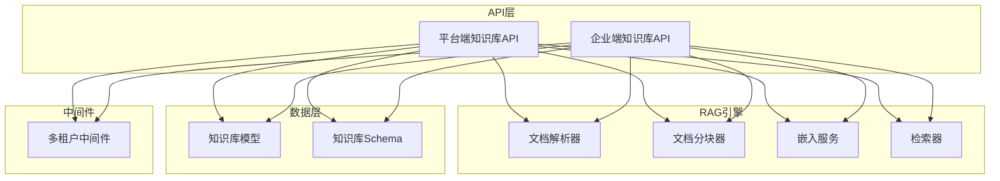
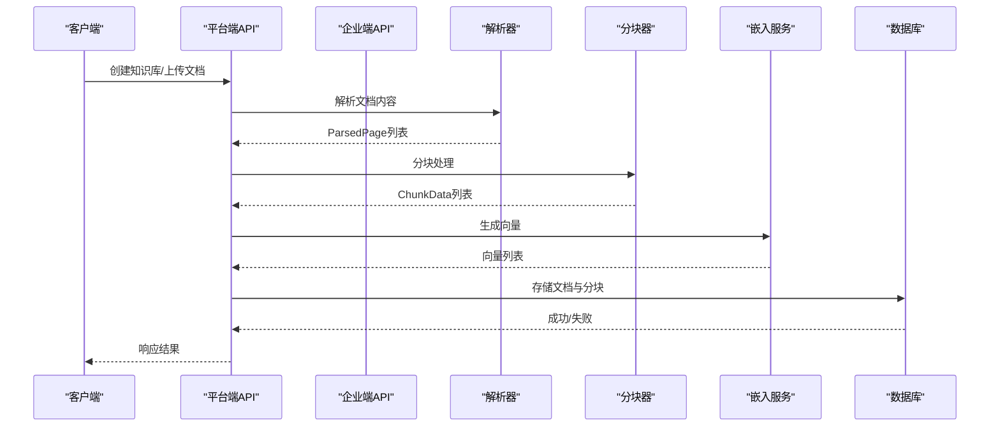
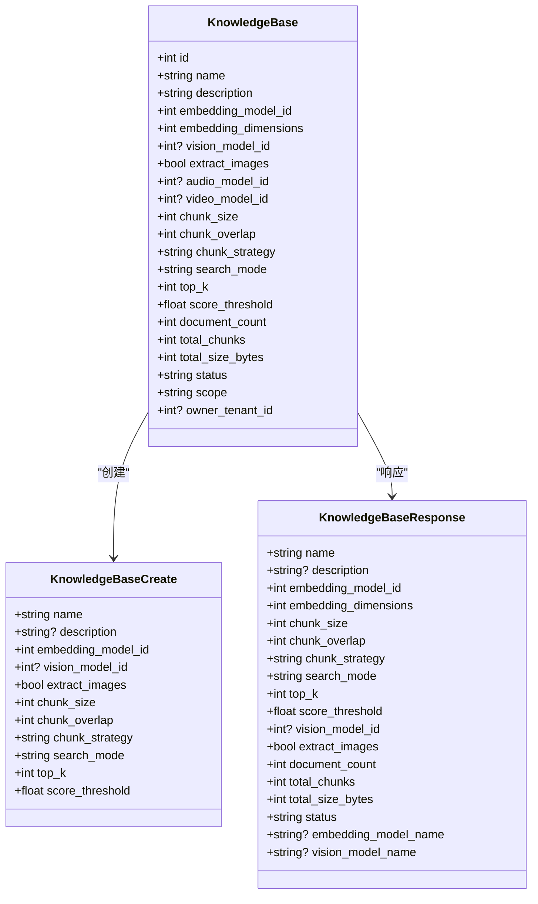
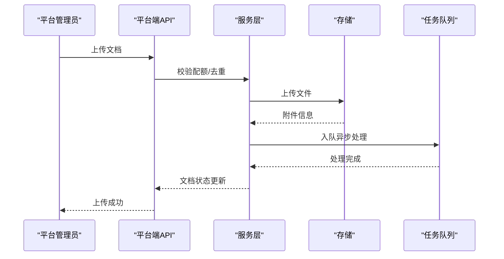
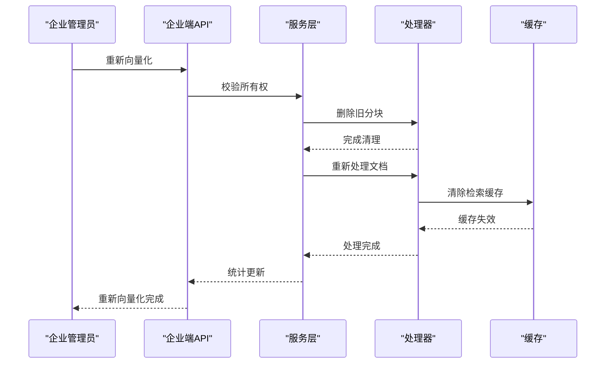
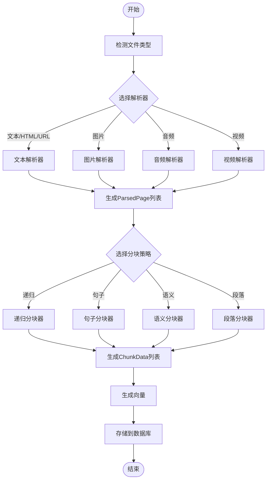
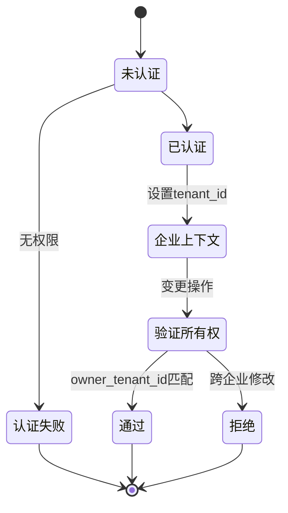
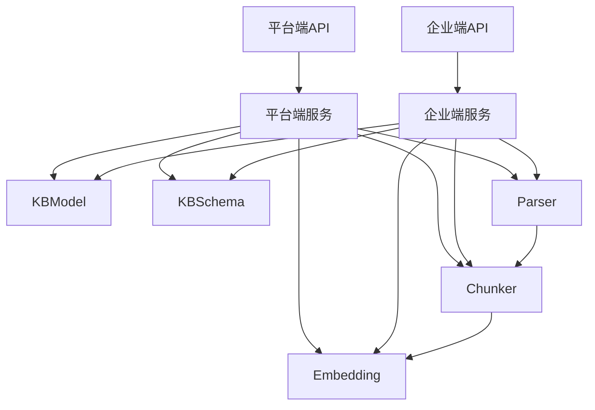

# 知识库管理API

<cite>
**本文引用的文件**
- [知识库模型](file://backend/app/models/ai/knowledge_base.py)
- [知识库Schema](file://backend/app/schemas/ai/knowledge_base.py)
- [平台端知识库API](file://backend/app/api/admin/knowledge_bases.py)
- [企业端知识库API](file://backend/app/api/tenant/knowledge_bases.py)
- [嵌入服务](file://backend/app/ai/rag/embedding.py)
- [文档解析器](file://backend/app/ai/rag/parser.py)
- [文档分块器](file://backend/app/ai/rag/chunker.py)
- [RAG中间件](file://backend/app/middleware/tenant.py)
</cite>

## 目录
1. [简介](#简介)
2. [项目结构](#项目结构)
3. [核心组件](#核心组件)
4. [架构概览](#架构概览)
5. [详细组件分析](#详细组件分析)
6. [依赖分析](#依赖分析)
7. [性能考虑](#性能考虑)
8. [故障排除指南](#故障排除指南)
9. [结论](#结论)
10. [附录](#附录)

## 简介
本文件为知识库管理API的详细技术文档，涵盖知识库的创建、配置、文档上传、检索查询等核心功能接口，并深入解释向量嵌入、关键词检索、混合检索等RAG相关接口。文档还包含文档解析、分块处理、元数据管理的实际使用示例，以及知识库权限控制、访问统计、性能监控的技术实现，并解释知识库在多租户环境中的隔离和共享机制。

## 项目结构
知识库管理API主要分布在以下模块中：
- API层：平台端与企业端分别提供独立的路由与权限控制
- RAG引擎：解析、分块、嵌入、检索等核心处理流程
- 数据模型与Schema：定义知识库、文档、分块的数据结构与约束
- 中间件：多租户隔离与权限控制

**图表来源**
- [平台端知识库API:114-800](file://backend/app/api/admin/knowledge_bases.py#L114-L800)
- [企业端知识库API:128-956](file://backend/app/api/tenant/knowledge_bases.py#L128-L956)
- [知识库模型:33-273](file://backend/app/models/ai/knowledge_base.py#L33-L273)
- [知识库Schema:63-480](file://backend/app/schemas/ai/knowledge_base.py#L63-L480)
- [RAG中间件](file://backend/app/middleware/tenant.py)

**章节来源**
- [平台端知识库API:114-800](file://backend/app/api/admin/knowledge_bases.py#L114-L800)
- [企业端知识库API:128-956](file://backend/app/api/tenant/knowledge_bases.py#L128-L956)

## 核心组件
- 知识库模型：定义知识库基本信息、嵌入配置、分块配置、检索配置及状态管理
- 知识库Schema：定义创建、更新、查询的请求与响应数据结构
- API控制器：平台端与企业端分别提供CRUD、文档管理、检索测试等接口
- RAG处理链：解析、分块、嵌入、检索的完整流水线
- 中间件：多租户隔离与权限控制

**章节来源**
- [知识库模型:33-273](file://backend/app/models/ai/knowledge_base.py#L33-L273)
- [知识库Schema:63-480](file://backend/app/schemas/ai/knowledge_base.py#L63-L480)

## 架构概览
知识库管理API采用分层架构，API层负责路由与权限控制，RAG引擎负责文档处理，数据层负责持久化与约束，中间件负责多租户隔离。

**图表来源**
- [平台端知识库API:409-557](file://backend/app/api/admin/knowledge_bases.py#L409-L557)
- [文档解析器:496-561](file://backend/app/ai/rag/parser.py#L496-L561)
- [文档分块器:444-465](file://backend/app/ai/rag/chunker.py#L444-L465)
- [嵌入服务:47-136](file://backend/app/ai/rag/embedding.py#L47-L136)

## 详细组件分析

### 知识库模型与Schema
- 知识库模型包含嵌入模型、视觉/音频/视频模型、分块策略、检索模式、统计指标等字段
- Schema定义了创建、更新、查询的请求与响应结构，包含字段长度、取值范围、默认值等约束
- 平台端Schema支持scope与企业分配，企业端Schema仅支持本企业范围

**图表来源**
- [知识库模型:33-273](file://backend/app/models/ai/knowledge_base.py#L33-L273)
- [知识库Schema:63-307](file://backend/app/schemas/ai/knowledge_base.py#L63-L307)

**章节来源**
- [知识库模型:33-273](file://backend/app/models/ai/knowledge_base.py#L33-L273)
- [知识库Schema:63-307](file://backend/app/schemas/ai/knowledge_base.py#L63-L307)

### 平台端知识库API
- 提供全企业知识库查询、统计监控、文档管理、检索测试等接口
- 支持scope为global/shared/admin的多级可见性与分配机制
- 提供回收站、进度查询、重试失败文档等功能

**图表来源**
- [平台端知识库API:409-557](file://backend/app/api/admin/knowledge_bases.py#L409-L557)

**章节来源**
- [平台端知识库API:114-800](file://backend/app/api/admin/knowledge_bases.py#L114-L800)

### 企业端知识库API
- 提供企业内知识库CRUD、文档上传/管理、检索测试、重新向量化等接口
- 严格的企业所有权验证，确保只对企业自有知识库进行变更操作
- 支持Redis实时进度查询、断点续传、批量QA导入等高级功能

**图表来源**
- [企业端知识库API:675-701](file://backend/app/api/tenant/knowledge_bases.py#L675-L701)

**章节来源**
- [企业端知识库API:128-956](file://backend/app/api/tenant/knowledge_bases.py#L128-L956)

### RAG处理链：解析、分块、嵌入
- 解析器支持PDF、DOCX、TXT、Markdown、CSV、XLSX、HTML、URL、PPTX、图片、音频、视频等11种格式
- 分块器支持递归、句子、语义、段落四种策略，具备重叠与结构感知能力
- 嵌入服务通过AI网关调用外部模型，支持单条与批量生成

**图表来源**
- [文档解析器:496-561](file://backend/app/ai/rag/parser.py#L496-L561)
- [文档分块器:444-465](file://backend/app/ai/rag/chunker.py#L444-L465)
- [嵌入服务:47-136](file://backend/app/ai/rag/embedding.py#L47-L136)

**章节来源**
- [文档解析器:46-582](file://backend/app/ai/rag/parser.py#L46-L582)
- [文档分块器:44-477](file://backend/app/ai/rag/chunker.py#L44-L477)
- [嵌入服务:25-164](file://backend/app/ai/rag/embedding.py#L25-L164)

### 多租户隔离与权限控制
- 知识库模型通过scope与owner_tenant_id表达投放范围
- 企业端API严格验证知识库所有权，防止跨企业变更
- 平台端API支持scope为global/shared/admin的分配机制
- 中间件确保请求在正确的企业上下文中执行

**图表来源**
- [知识库模型:90-96](file://backend/app/models/ai/knowledge_base.py#L90-L96)
- [企业端知识库API:62-81](file://backend/app/api/tenant/knowledge_bases.py#L62-L81)
- [RAG中间件](file://backend/app/middleware/tenant.py)

**章节来源**
- [知识库模型:33-273](file://backend/app/models/ai/knowledge_base.py#L33-L273)
- [企业端知识库API:62-81](file://backend/app/api/tenant/knowledge_bases.py#L62-L81)

## 依赖分析
- API层依赖服务层与Schema，服务层依赖模型与RAG引擎
- RAG引擎内部模块解耦，通过统一接口交互
- 数据层通过SQLAlchemy ORM与数据库交互

**图表来源**
- [平台端知识库API:59-63](file://backend/app/api/admin/knowledge_bases.py#L59-L63)
- [企业端知识库API:55-59](file://backend/app/api/tenant/knowledge_bases.py#L55-L59)

**章节来源**
- [平台端知识库API:59-63](file://backend/app/api/admin/knowledge_bases.py#L59-L63)
- [企业端知识库API:55-59](file://backend/app/api/tenant/knowledge_bases.py#L55-L59)

## 性能考虑
- 批量嵌入：嵌入服务默认批量大小为100，减少API调用次数
- 分块策略：递归分块器优先使用语义分隔符，避免硬切导致的语义断裂
- 缓存失效：重新向量化后清除检索缓存，保证查询一致性
- 进度查询：使用Redis存储实时进度，降低数据库压力

## 故障排除指南
- 文件类型不支持：检查文件扩展名与MIME类型，确认解析器支持
- 文档重复：根据file_hash去重，避免重复上传
- 权限不足：企业端API对非自有知识库的操作会被拒绝
- 处理失败：通过重试接口恢复，保留error_stage用于断点续传

**章节来源**
- [平台端知识库API:442-445](file://backend/app/api/admin/knowledge_bases.py#L442-L445)
- [企业端知识库API:377-381](file://backend/app/api/tenant/knowledge_bases.py#L377-L381)

## 结论
知识库管理API提供了完整的RAG工作流，从文档解析、分块、嵌入到检索查询，覆盖了企业知识库管理的核心需求。通过多租户隔离与权限控制，确保了不同企业间的资源安全。平台端与企业端API分别满足全局监控与企业自治的需求，配合丰富的配置选项与性能优化，能够适应多样化的应用场景。

## 附录
- 支持的文件格式：PDF、DOCX、TXT、Markdown、CSV、XLSX、HTML、URL、PPTX、图片(JPG/PNG/WebP/GIF)、音频、视频
- 分块策略：递归、句子、语义、段落
- 检索模式：向量检索、关键词检索、混合检索
- 配置参数：嵌入维度、分块大小、重叠、top_k、阈值等