# 租户API

<cite>
**本文引用的文件**
- [backend/app/api/tenant/auth.py](file://backend/app/api/tenant/auth.py)
- [backend/app/api/tenant/agents.py](file://backend/app/api/tenant/agents.py)
- [backend/app/api/tenant/agent_chat.py](file://backend/app/api/tenant/agent_chat.py)
- [backend/app/api/tenant/conversations.py](file://backend/app/api/tenant/conversations.py)
- [backend/app/api/tenant/knowledge_bases.py](file://backend/app/api/tenant/knowledge_bases.py)
- [backend/app/api/tenant/plugins.py](file://backend/app/api/tenant/plugins.py)
- [backend/app/api/tenant/ai_quotas.py](file://backend/app/api/tenant/ai_quotas.py)
- [backend/app/api/tenant/ai_usage.py](file://backend/app/api/tenant/ai_usage.py)
- [backend/app/api/tenant/configs.py](file://backend/app/api/tenant/configs.py)
- [backend/app/api/tenant/domains.py](file://backend/app/api/tenant/domains.py)
- [backend/app/api/tenant/user_roles.py](file://backend/app/api/tenant/user_roles.py)
- [backend/app/api/tenant/permissions.py](file://backend/app/api/tenant/permissions.py)
- [backend/app/middleware/tenant.py](file://backend/app/middleware/tenant.py)
- [backend/app/rbac/decorators.py](file://backend/app/rbac/decorators.py)
- [backend/app/schemas/tenant/agents.py](file://backend/app/schemas/tenant/agents.py)
- [backend/app/schemas/tenant/conversations.py](file://backend/app/schemas/tenant/conversations.py)
- [backend/app/schemas/tenant/knowledge_bases.py](file://backend/app/schemas/tenant/knowledge_bases.py)
- [backend/app/schemas/tenant/plugins.py](file://backend/app/schemas/tenant/plugins.py)
- [backend/app/schemas/tenant/ai_quotas.py](file://backend/app/schemas/tenant/ai_quotas.py)
- [backend/app/schemas/tenant/ai_usage.py](file://backend/app/schemas/tenant/ai_usage.py)
- [backend/app/schemas/tenant/configs.py](file://backend/app/schemas/tenant/configs.py)
- [backend/app/schemas/tenant/domains.py](file://backend/app/schemas/tenant/domains.py)
- [backend/app/schemas/tenant/user_roles.py](file://backend/app/schemas/tenant/user_roles.py)
- [backend/app/schemas/tenant/permissions.py](file://backend/app/schemas/tenant/permissions.py)
- [backend/app/models/tenant/agents.py](file://backend/app/models/tenant/agents.py)
- [backend/app/models/tenant/conversations.py](file://backend/app/models/tenant/conversations.py)
- [backend/app/models/tenant/knowledge_bases.py](file://backend/app/models/tenant/knowledge_bases.py)
- [backend/app/models/tenant/plugins.py](file://backend/app/models/tenant/plugins.py)
- [backend/app/models/tenant/ai_quotas.py](file://backend/app/models/tenant/ai_quotas.py)
- [backend/app/models/tenant/ai_usage.py](file://backend/app/models/tenant/ai_usage.py)
- [backend/app/models/tenant/configs.py](file://backend/app/models/tenant/configs.py)
- [backend/app/models/tenant/domains.py](file://backend/app/models/tenant/domains.py)
- [backend/app/models/tenant/user_roles.py](file://backend/app/models/tenant/user_roles.py)
- [backend/app/models/tenant/permissions.py](file://backend/app/models/tenant/permissions.py)
- [backend/app/services/tenant/agents.py](file://backend/app/services/tenant/agents.py)
- [backend/app/services/tenant/conversations.py](file://backend/app/services/tenant/conversations.py)
- [backend/app/services/tenant/knowledge_bases.py](file://backend/app/services/tenant/knowledge_bases.py)
- [backend/app/services/tenant/plugins.py](file://backend/app/services/tenant/plugins.py)
- [backend/app/services/tenant/ai_quotas.py](file://backend/app/services/tenant/ai_quotas.py)
- [backend/app/services/tenant/ai_usage.py](file://backend/app/services/tenant/ai_usage.py)
- [backend/app/services/tenant/configs.py](file://backend/app/services/tenant/configs.py)
- [backend/app/services/tenant/domains.py](file://backend/app/services/tenant/domains.py)
- [backend/app/services/tenant/user_roles.py](file://backend/app/services/tenant/user_roles.py)
- [backend/app/services/tenant/permissions.py](file://backend/app/services/tenant/permissions.py)
- [backend/app/repositories/tenant/agents.py](file://backend/app/repositories/tenant/agents.py)
- [backend/app/repositories/tenant/conversations.py](file://backend/app/repositories/tenant/conversations.py)
- [backend/app/repositories/tenant/knowledge_bases.py](file://backend/app/repositories/tenant/knowledge_bases.py)
- [backend/app/repositories/tenant/plugins.py](file://backend/app/repositories/tenant/plugins.py)
- [backend/app/repositories/tenant/ai_quotas.py](file://backend/app/repositories/tenant/ai_quotas.py)
- [backend/app/repositories/tenant/ai_usage.py](file://backend/app/repositories/tenant/ai_usage.py)
- [backend/app/repositories/tenant/configs.py](file://backend/app/repositories/tenant/configs.py)
- [backend/app/repositories/tenant/domains.py](file://backend/app/repositories/tenant/domains.py)
- [backend/app/repositories/tenant/user_roles.py](file://backend/app/repositories/tenant/user_roles.py)
- [backend/app/repositories/tenant/permissions.py](file://backend/app/repositories/tenant/permissions.py)
- [backend/app/enums/agent.py](file://backend/app/enums/agent.py)
- [backend/app/enums/knowledge_base.py](file://backend/app/enums/knowledge_base.py)
- [backend/app/enums/plugin.py](file://backend/app/enums/plugin.py)
- [backend/app/enums/billing.py](file://backend/app/enums/billing.py)
- [backend/app/enums/rbac.py](file://backend/app/enums/rbac.py)
- [backend/app/core/scope.py](file://backend/app/core/scope.py)
- [backend/app/core/identity.py](file://backend/app/core/identity.py)
- [backend/app/core/security.py](file://backend/app/core/security.py)
- [backend/app/migrations/versions/20260208_004_add_tenant_quotas.py](file://backend/app/migrations/versions/20260208_004_add_tenant_quotas.py)
- [backend/app/migrations/versions/20260211_0011_add_knowledge_base_tables.py](file://backend/app/migrations/versions/20260211_0011_add_knowledge_base_tables.py)
- [backend/app/migrations/versions/20260213_add_plugins_tables.py](file://backend/app/migrations/versions/20260213_add_plugins_tables.py)
- [backend/app/migrations/versions/20260213_add_skill_packages.py](file://backend/app/migrations/versions/20260213_add_skill_packages.py)
- [backend/app/migrations/versions/20260213_seed_system_agents_skills.py](file://backend/app/migrations/versions/20260213_seed_system_agents_skills.py)
- [backend/app/migrations/versions/20260214_add_global_scope.py](file://backend/app/migrations/versions/20260214_add_global_scope.py)
- [backend/app/migrations/versions/20260214_add_is_system_field.py](file://backend/app/migrations/versions/20260214_add_is_system_field.py)
- [backend/app/migrations/versions/20260214_normalize_scope_admin.py](file://backend/app/migrations/versions/20260214_normalize_scope_admin.py)
- [backend/app/migrations/versions/20260214_seed_system_data_intelligence.py](file://backend/app/migrations/versions/20260214_seed_system_data_intelligence.py)
- [backend/app/migrations/versions/20260215_add_crud_generation_records.py](file://backend/app/migrations/versions/20260215_add_crud_generation_records.py)
- [backend/app/migrations/versions/20260215_seed_agent_assignments.py](file://backend/app/migrations/versions/20260215_seed_agent_assignments.py)
- [backend/app/migrations/versions/20260216_add_consent_mode_to_bindings.py](file://backend/app/migrations/versions/20260216_add_consent_mode_to_bindings.py)
- [backend/app/migrations/versions/20260216_add_system_agent_assignments.py](file://backend/app/migrations/versions/20260216_add_system_agent_assignments.py)
- [backend/app/migrations/versions/20260216_add_tenant_id_to_agent_assignments.py](file://backend/app/migrations/versions/20260216_add_tenant_id_to_agent_assignments.py)
- [backend/app/migrations/versions/20260221_5c37f4f986ac_add_plugin_scope_and_tenant_assignments.py](file://backend/app/migrations/versions/20260221_5c37f4f986ac_add_plugin_scope_and_tenant_assignments.py)
- [backend/app/migrations/versions/20260224_add_kb_visibility_and_tenant_access.py](file://backend/app/migrations/versions/20260224_add_kb_visibility_and_tenant_access.py)
- [backend/app/migrations/versions/20260305_add_tenant_scoped_unique_constraints.py](file://backend/app/migrations/versions/20260305_add_tenant_scoped_unique_constraints.py)
- [backend/app/migrations/versions/20260314_0914_add_scope_to_ai_api_keys.py](file://backend/app/migrations/versions/20260314_0914_add_scope_to_ai_api_keys.py)
- [backend/app/migrations/versions/20260318_0001_add_audio_video_model_id_to_knowledge_bases.py](file://backend/app/migrations/versions/20260318_0001_add_audio_video_model_id_to_knowledge_bases.py)
- [backend/app/migrations/versions/20260320_unified_resource_and_permission_scope.py](file://backend/app/migrations/versions/20260320_unified_resource_and_permission_scope.py)
- [backend/app/migrations/versions/20260321_ai_call_log_contract.py](file://backend/app/migrations/versions/20260321_ai_call_log_contract.py)
- [backend/app/migrations/versions/20260322_ai_billing_ledger_merge.py](file://backend/app/migrations/versions/20260322_ai_billing_ledger_merge.py)
- [backend/app/migrations/versions/20260323_rename_ai_call_log_agent_resource_scope.py](file://backend/app/migrations/versions/20260323_rename_ai_call_log_agent_resource_scope.py)
- [backend/app/migrations/versions/20260324_add_conversation_owner_type_and_session_task_scope.py](file://backend/app/migrations/versions/20260324_add_conversation_owner_type_and_session_task_scope.py)
- [backend/app/migrations/versions/20260324_add_missing_recycle_bin_columns.py](file://backend/app/migrations/versions/20260324_add_missing_recycle_bin_columns.py)
- [backend/app/migrations/versions/20260324_periodic_tasks_owner_tenant_id_repair.py](file://backend/app/migrations/versions/20260324_periodic_tasks_owner_tenant_id_repair.py)
- [backend/app/migrations/versions/20260325_org_authority_rebuild.py](file://backend/app/migrations/versions/20260325_org_authority_rebuild.py)
- [backend/app/migrations/versions/20260325_org_node_perm.py](file://backend/app/migrations/versions/20260325_org_node_perm.py)
- [backend/app/migrations/versions/20260326_0001_ai_action_log_actor_snapshots.py](file://backend/app/migrations/versions/20260326_0001_ai_action_log_actor_snapshots.py)
- [backend/app/migrations/versions/20260327_1500_cleanup_legacy.py](file://backend/app/migrations/versions/20260327_1500_cleanup_legacy.py)
- [backend/app/migrations/versions/20260327_1930_residual_schema.py](file://backend/app/migrations/versions/20260327_1930_residual_schema.py)
- [backend/app/migrations/versions/20260327_2030_index_sync.py](file://backend/app/migrations/versions/20260327_2030_index_sync.py)
- [backend/app/migrations/versions/20260329_0010_normalize_task_definition_platform_scope.py](file://backend/app/migrations/versions/20260329_0010_normalize_task_definition_platform_scope.py)
- [backend/app/migrations/versions/20260329_0020_cleanup_task_binding_scope_semantics.py](file://backend/app/migrations/versions/20260329_0020_cleanup_task_binding_scope_semantics.py)
- [backend/app/migrations/versions/20260329_0030_add_memory_records.py](file://backend/app/migrations/versions/20260329_0030_add_memory_records.py)
- [backend/app/migrations/versions/20260329_0040_add_execution_trust_policies.py](file://backend/app/migrations/versions/20260329_0040_add_execution_trust_policies.py)
- [backend/app/migrations/versions/20260329_0050_add_execution_decisions.py](file://backend/app/migrations/versions/20260329_0050_add_execution_decisions.py)
- [backend/app/migrations/versions/20260330_0060_add_execution_decision_id_to_ai_action_logs.py](file://backend/app/migrations/versions/20260330_0060_add_execution_decision_id_to_ai_action_logs.py)
- [backend/app/migrations/versions/20260330_0070_add_profile_snapshots.py](file://backend/app/migrations/versions/20260330_0070_add_profile_snapshots.py)
- [backend/app/migrations/versions/20260330_0080_ephem_docs.py](file://backend/app/migrations/versions/20260330_0080_ephem_docs.py)
</cite>

## 目录
1. [简介](#简介)
2. [项目结构](#项目结构)
3. [核心组件](#核心组件)
4. [架构总览](#架构总览)
5. [详细组件分析](#详细组件分析)
6. [依赖关系分析](#依赖关系分析)
7. [性能考虑](#性能考虑)
8. [故障排除指南](#故障排除指南)
9. [结论](#结论)
10. [附录](#附录)

## 简介
本文件为租户级SaaS平台的API文档，聚焦于租户维度的RESTful接口设计与实现，覆盖用户认证、智能体管理、对话交互、知识库操作、插件使用、配额与计费、租户配置与权限等能力。文档强调租户作用域、数据隔离与权限控制，并提供智能体聊天、知识库检索、插件调用的典型使用示例与最佳实践。

## 项目结构
租户API位于后端应用的租户命名空间下，采用按功能分层组织：控制器（API路由）、服务层（业务逻辑）、仓储层（数据访问）、模型与模式（数据结构）以及RBAC装饰器与中间件保障权限与租户隔离。

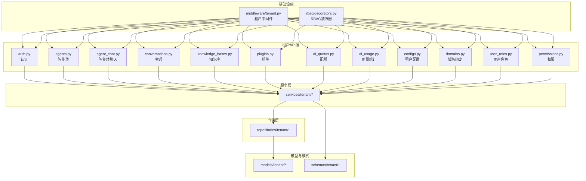

图表来源
- [backend/app/api/tenant/auth.py](file://backend/app/api/tenant/auth.py)
- [backend/app/api/tenant/agents.py](file://backend/app/api/tenant/agents.py)
- [backend/app/api/tenant/agent_chat.py](file://backend/app/api/tenant/agent_chat.py)
- [backend/app/api/tenant/conversations.py](file://backend/app/api/tenant/conversations.py)
- [backend/app/api/tenant/knowledge_bases.py](file://backend/app/api/tenant/knowledge_bases.py)
- [backend/app/api/tenant/plugins.py](file://backend/app/api/tenant/plugins.py)
- [backend/app/api/tenant/ai_quotas.py](file://backend/app/api/tenant/ai_quotas.py)
- [backend/app/api/tenant/ai_usage.py](file://backend/app/api/tenant/ai_usage.py)
- [backend/app/api/tenant/configs.py](file://backend/app/api/tenant/configs.py)
- [backend/app/api/tenant/domains.py](file://backend/app/api/tenant/domains.py)
- [backend/app/api/tenant/user_roles.py](file://backend/app/api/tenant/user_roles.py)
- [backend/app/api/tenant/permissions.py](file://backend/app/api/tenant/permissions.py)
- [backend/app/middleware/tenant.py](file://backend/app/middleware/tenant.py)
- [backend/app/rbac/decorators.py](file://backend/app/rbac/decorators.py)

章节来源
- [backend/app/api/tenant/auth.py](file://backend/app/api/tenant/auth.py)
- [backend/app/api/tenant/agents.py](file://backend/app/api/tenant/agents.py)
- [backend/app/api/tenant/agent_chat.py](file://backend/app/api/tenant/agent_chat.py)
- [backend/app/api/tenant/conversations.py](file://backend/app/api/tenant/conversations.py)
- [backend/app/api/tenant/knowledge_bases.py](file://backend/app/api/tenant/knowledge_bases.py)
- [backend/app/api/tenant/plugins.py](file://backend/app/api/tenant/plugins.py)
- [backend/app/api/tenant/ai_quotas.py](file://backend/app/api/tenant/ai_quotas.py)
- [backend/app/api/tenant/ai_usage.py](file://backend/app/api/tenant/ai_usage.py)
- [backend/app/api/tenant/configs.py](file://backend/app/api/tenant/configs.py)
- [backend/app/api/tenant/domains.py](file://backend/app/api/tenant/domains.py)
- [backend/app/api/tenant/user_roles.py](file://backend/app/api/tenant/user_roles.py)
- [backend/app/api/tenant/permissions.py](file://backend/app/api/tenant/permissions.py)

## 核心组件
- 认证与会话：提供租户内用户登录、令牌签发与校验、会话维护。
- 智能体管理：智能体创建、更新、删除、版本化、可见性与访问控制、与知识库/技能绑定。
- 对话交互：会话创建、消息发送、流式响应、上下文管理与内存策略。
- 知识库：知识库创建、索引、检索、可见性与租户访问控制。
- 插件：插件市场接入、安装、授权、租户范围内的可用性与访问控制。
- 配额与用量：租户级配额配置、并发控制、用量追踪与统计、计费对账。
- 租户配置：全局配置项、域名绑定、SSL证书、租户个性化设置。
- 权限与角色：基于RBAC的角色、权限、资源作用域与数据权限。

章节来源
- [backend/app/api/tenant/auth.py](file://backend/app/api/tenant/auth.py)
- [backend/app/api/tenant/agents.py](file://backend/app/api/tenant/agents.py)
- [backend/app/api/tenant/agent_chat.py](file://backend/app/api/tenant/agent_chat.py)
- [backend/app/api/tenant/conversations.py](file://backend/app/api/tenant/conversations.py)
- [backend/app/api/tenant/knowledge_bases.py](file://backend/app/api/tenant/knowledge_bases.py)
- [backend/app/api/tenant/plugins.py](file://backend/app/api/tenant/plugins.py)
- [backend/app/api/tenant/ai_quotas.py](file://backend/app/api/tenant/ai_quotas.py)
- [backend/app/api/tenant/ai_usage.py](file://backend/app/api/tenant/ai_usage.py)
- [backend/app/api/tenant/configs.py](file://backend/app/api/tenant/configs.py)
- [backend/app/api/tenant/domains.py](file://backend/app/api/tenant/domains.py)
- [backend/app/api/tenant/user_roles.py](file://backend/app/api/tenant/user_roles.py)
- [backend/app/api/tenant/permissions.py](file://backend/app/api/tenant/permissions.py)

## 架构总览
租户API通过中间件注入租户上下文，结合RBAC装饰器进行权限校验，服务层封装业务规则，仓储层负责数据持久化，模型与模式确保数据一致性与可扩展性。

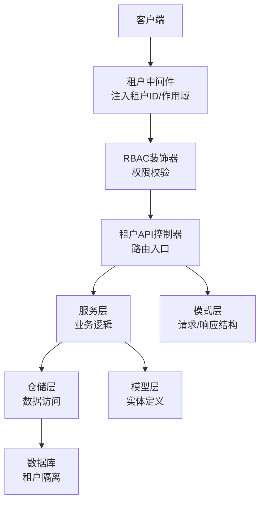

图表来源
- [backend/app/middleware/tenant.py](file://backend/app/middleware/tenant.py)
- [backend/app/rbac/decorators.py](file://backend/app/rbac/decorators.py)
- [backend/app/api/tenant/agents.py](file://backend/app/api/tenant/agents.py)
- [backend/app/services/tenant/agents.py](file://backend/app/services/tenant/agents.py)
- [backend/app/repositories/tenant/agents.py](file://backend/app/repositories/tenant/agents.py)
- [backend/app/models/tenant/agents.py](file://backend/app/models/tenant/agents.py)
- [backend/app/schemas/tenant/agents.py](file://backend/app/schemas/tenant/agents.py)

## 详细组件分析

### 认证与会话
- 路由与作用域：提供登录、登出、刷新令牌、当前用户信息等端点，均在租户作用域内执行。
- 数据隔离：用户凭据与会话状态与租户ID绑定，避免跨租户访问。
- 安全控制：令牌签发包含租户标识，后续请求通过中间件解析并注入到请求上下文。

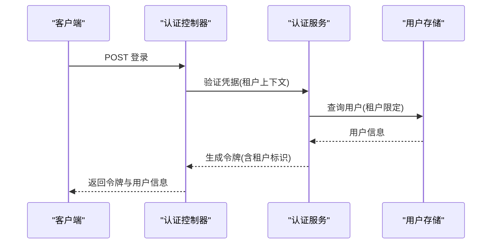

图表来源
- [backend/app/api/tenant/auth.py](file://backend/app/api/tenant/auth.py)
- [backend/app/services/tenant/auth.py](file://backend/app/services/tenant/auth.py)
- [backend/app/repositories/tenant/users.py](file://backend/app/repositories/tenant/users.py)
- [backend/app/models/tenant/users.py](file://backend/app/models/tenant/users.py)
- [backend/app/schemas/tenant/auth.py](file://backend/app/schemas/tenant/auth.py)

章节来源
- [backend/app/api/tenant/auth.py](file://backend/app/api/tenant/auth.py)
- [backend/app/middleware/tenant.py](file://backend/app/middleware/tenant.py)
- [backend/app/core/security.py](file://backend/app/core/security.py)

### 智能体管理
- 端点概览：创建、查询列表、详情、更新、删除、版本化、绑定知识库/技能、可见性与访问控制。
- 作用域与隔离：智能体与知识库、技能的绑定均受租户作用域约束；系统智能体与全局作用域区分。
- 版本与路由：支持多版本智能体并行，路由配置可按租户定制。

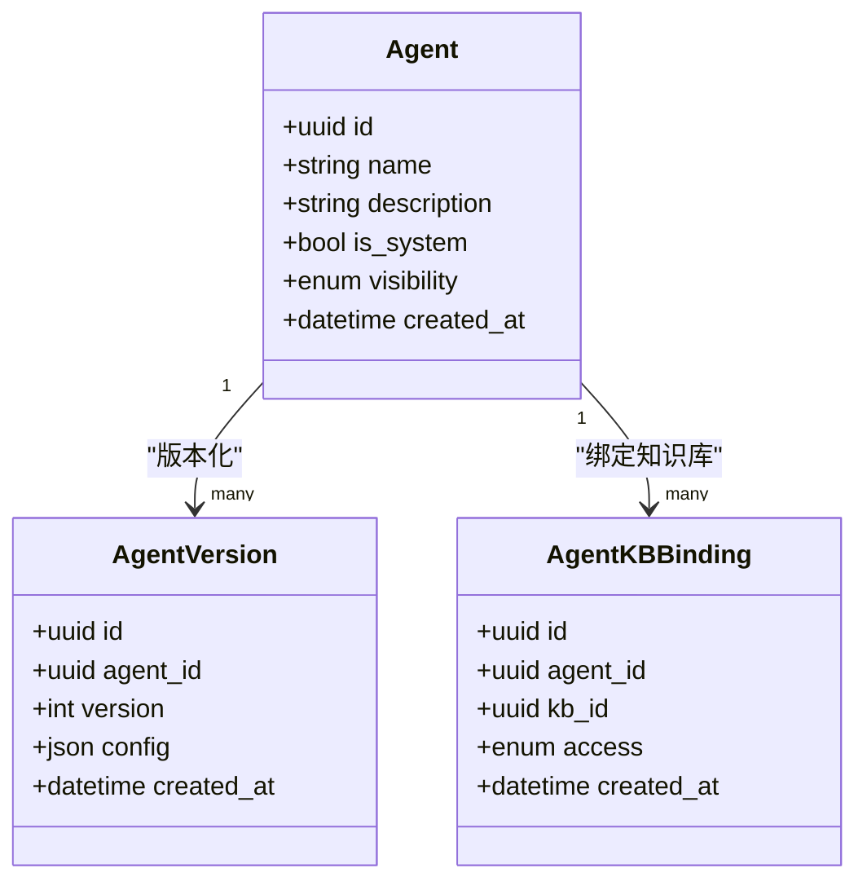

图表来源
- [backend/app/models/tenant/agents.py](file://backend/app/models/tenant/agents.py)
- [backend/app/models/tenant/agent_versions.py](file://backend/app/models/tenant/agent_versions.py)
- [backend/app/models/tenant/agent_kb_bindings.py](file://backend/app/models/tenant/agent_kb_bindings.py)
- [backend/app/enums/agent.py](file://backend/app/enums/agent.py)

章节来源
- [backend/app/api/tenant/agents.py](file://backend/app/api/tenant/agents.py)
- [backend/app/api/tenant/_agent_version.py](file://backend/app/api/tenant/_agent_version.py)
- [backend/app/api/tenant/_agent_kbs.py](file://backend/app/api/tenant/_agent_kbs.py)
- [backend/app/api/tenant/_agent_skills.py](file://backend/app/api/tenant/_agent_skills.py)
- [backend/app/services/tenant/agents.py](file://backend/app/services/tenant/agents.py)
- [backend/app/repositories/tenant/agents.py](file://backend/app/repositories/tenant/agents.py)
- [backend/app/enums/agent.py](file://backend/app/enums/agent.py)

### 对话交互与会话
- 端点概览：创建会话、发送消息、流式响应、历史消息查询、会话归档。
- 上下文与内存：支持会话上下文管理与内存策略配置；消息与会话归属租户。
- 流式输出：通过SSE或WebSocket推送增量结果，便于实时交互。

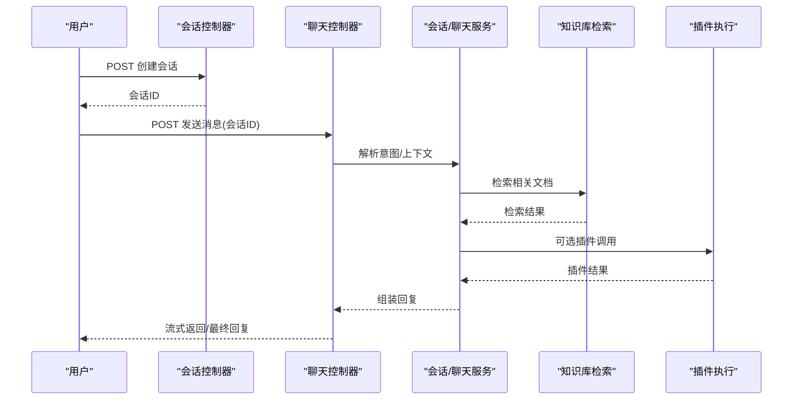

图表来源
- [backend/app/api/tenant/conversations.py](file://backend/app/api/tenant/conversations.py)
- [backend/app/api/tenant/agent_chat.py](file://backend/app/api/tenant/agent_chat.py)
- [backend/app/services/tenant/conversations.py](file://backend/app/services/tenant/conversations.py)
- [backend/app/services/tenant/knowledge_bases.py](file://backend/app/services/tenant/knowledge_bases.py)
- [backend/app/services/tenant/plugins.py](file://backend/app/services/tenant/plugins.py)

章节来源
- [backend/app/api/tenant/conversations.py](file://backend/app/api/tenant/conversations.py)
- [backend/app/api/tenant/agent_chat.py](file://backend/app/api/tenant/agent_chat.py)
- [backend/app/schemas/tenant/conversations.py](file://backend/app/schemas/tenant/conversations.py)
- [backend/app/schemas/tenant/agent_chat.py](file://backend/app/schemas/tenant/agent_chat.py)

### 知识库操作
- 端点概览：创建、索引、查询、可见性设置、租户访问控制。
- 检索增强：支持向量化检索、过滤与重排；可与智能体绑定以提升对话质量。
- 可见性与访问：公开/私有/租户共享等策略，防止跨租户数据泄露。

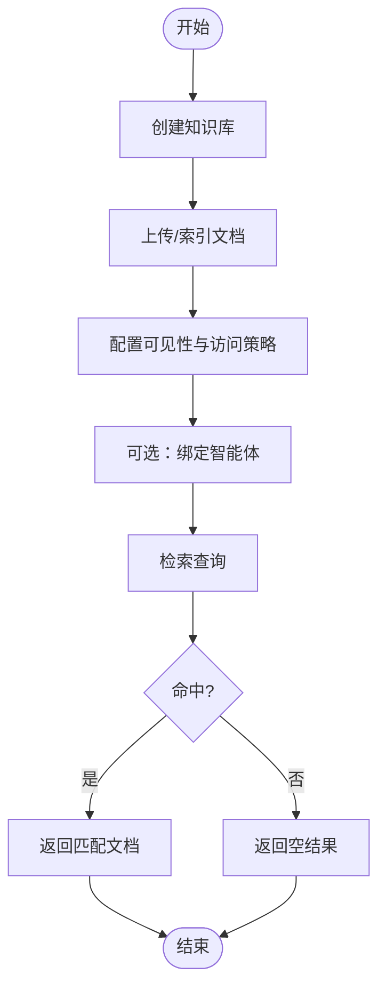

图表来源
- [backend/app/api/tenant/knowledge_bases.py](file://backend/app/api/tenant/knowledge_bases.py)
- [backend/app/services/tenant/knowledge_bases.py](file://backend/app/services/tenant/knowledge_bases.py)
- [backend/app/enums/knowledge_base.py](file://backend/app/enums/knowledge_base.py)

章节来源
- [backend/app/api/tenant/knowledge_bases.py](file://backend/app/api/tenant/knowledge_bases.py)
- [backend/app/schemas/tenant/knowledge_bases.py](file://backend/app/schemas/tenant/knowledge_bases.py)
- [backend/app/enums/knowledge_base.py](file://backend/app/enums/knowledge_base.py)

### 插件使用
- 端点概览：插件市场浏览、安装、授权、启用/禁用、租户范围内的可用性。
- 安全与合规：插件生命周期与许可证校验，执行决策与审计日志。
- 执行链路：插件消费端点由智能体或工具包触发，支持参数校验与结果聚合。

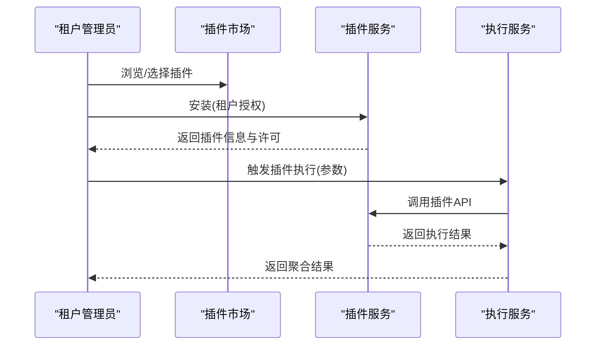

图表来源
- [backend/app/api/tenant/plugins.py](file://backend/app/api/tenant/plugins.py)
- [backend/app/services/tenant/plugins.py](file://backend/app/services/tenant/plugins.py)
- [backend/app/enums/plugin.py](file://backend/app/enums/plugin.py)

章节来源
- [backend/app/api/tenant/plugins.py](file://backend/app/api/tenant/plugins.py)
- [backend/app/schemas/tenant/plugins.py](file://backend/app/schemas/tenant/plugins.py)
- [backend/app/enums/plugin.py](file://backend/app/enums/plugin.py)

### 配额限制与计费
- 配额配置：租户级模型限额、并发数、额度周期与阈值。
- 用量追踪：按智能体、模型、时间维度统计调用次数与Token消耗。
- 计费对账：AI调用日志与账单合并，支持按租户维度导出与核对。

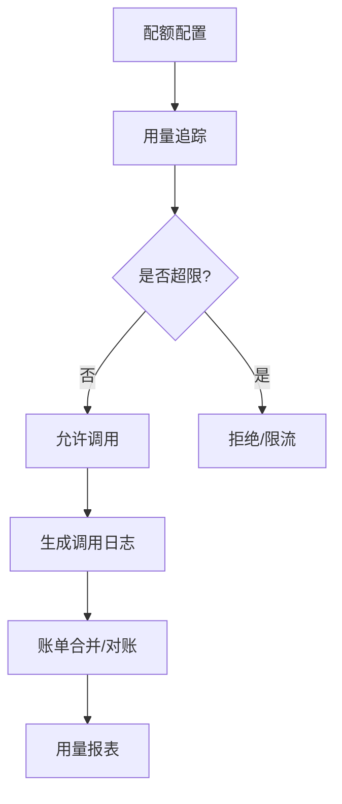

图表来源
- [backend/app/api/tenant/ai_quotas.py](file://backend/app/api/tenant/ai_quotas.py)
- [backend/app/api/tenant/ai_usage.py](file://backend/app/api/tenant/ai_usage.py)
- [backend/app/services/tenant/ai_quotas.py](file://backend/app/services/tenant/ai_quotas.py)
- [backend/app/services/tenant/ai_usage.py](file://backend/app/services/tenant/ai_usage.py)
- [backend/app/enums/billing.py](file://backend/app/enums/billing.py)

章节来源
- [backend/app/api/tenant/ai_quotas.py](file://backend/app/api/tenant/ai_quotas.py)
- [backend/app/api/tenant/ai_usage.py](file://backend/app/api/tenant/ai_usage.py)
- [backend/app/schemas/tenant/ai_quotas.py](file://backend/app/schemas/tenant/ai_quotas.py)
- [backend/app/schemas/tenant/ai_usage.py](file://backend/app/schemas/tenant/ai_usage.py)
- [backend/app/enums/billing.py](file://backend/app/enums/billing.py)

### 租户配置与域名绑定
- 配置项：租户个性化设置、默认模型、语言偏好、时区等。
- 域名绑定：支持自定义域名与SSL证书管理，确保HTTPS访问与安全传输。
- 域名迁移：支持域名切换与证书续期流程。

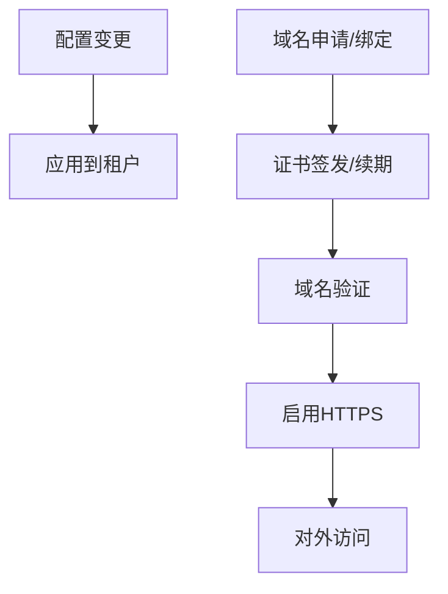

图表来源
- [backend/app/api/tenant/configs.py](file://backend/app/api/tenant/configs.py)
- [backend/app/api/tenant/domains.py](file://backend/app/api/tenant/domains.py)
- [backend/app/services/tenant/configs.py](file://backend/app/services/tenant/configs.py)
- [backend/app/services/tenant/domains.py](file://backend/app/services/tenant/domains.py)
- [backend/app/enums/domain.py](file://backend/app/enums/domain.py)

章节来源
- [backend/app/api/tenant/configs.py](file://backend/app/api/tenant/configs.py)
- [backend/app/api/tenant/domains.py](file://backend/app/api/tenant/domains.py)
- [backend/app/schemas/tenant/configs.py](file://backend/app/schemas/tenant/configs.py)
- [backend/app/schemas/tenant/domains.py](file://backend/app/schemas/tenant/domains.py)
- [backend/app/enums/domain.py](file://backend/app/enums/domain.py)

### 权限与角色
- 角色体系：基于RBAC的角色定义与层级关系，支持租户维度的角色继承与覆盖。
- 权限矩阵：资源作用域与操作权限的组合，确保最小权限原则。
- 数据权限：按租户与组织节点控制数据可见性与操作范围。

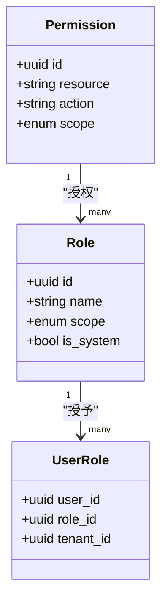

图表来源
- [backend/app/api/tenant/user_roles.py](file://backend/app/api/tenant/user_roles.py)
- [backend/app/api/tenant/permissions.py](file://backend/app/api/tenant/permissions.py)
- [backend/app/services/tenant/user_roles.py](file://backend/app/services/tenant/user_roles.py)
- [backend/app/services/tenant/permissions.py](file://backend/app/services/tenant/permissions.py)
- [backend/app/enums/rbac.py](file://backend/app/enums/rbac.py)

章节来源
- [backend/app/api/tenant/user_roles.py](file://backend/app/api/tenant/user_roles.py)
- [backend/app/api/tenant/permissions.py](file://backend/app/api/tenant/permissions.py)
- [backend/app/rbac/decorators.py](file://backend/app/rbac/decorators.py)
- [backend/app/enums/rbac.py](file://backend/app/enums/rbac.py)

## 依赖关系分析
- 控制器依赖服务层，服务层依赖仓储层与领域模型。
- 中间件与RBAC装饰器贯穿所有租户端点，确保统一的租户上下文与权限校验。
- 数据模型与模式在多处被引用，形成清晰的分层与职责边界。

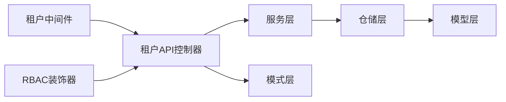

图表来源
- [backend/app/middleware/tenant.py](file://backend/app/middleware/tenant.py)
- [backend/app/rbac/decorators.py](file://backend/app/rbac/decorators.py)
- [backend/app/api/tenant/agents.py](file://backend/app/api/tenant/agents.py)
- [backend/app/services/tenant/agents.py](file://backend/app/services/tenant/agents.py)
- [backend/app/repositories/tenant/agents.py](file://backend/app/repositories/tenant/agents.py)
- [backend/app/models/tenant/agents.py](file://backend/app/models/tenant/agents.py)
- [backend/app/schemas/tenant/agents.py](file://backend/app/schemas/tenant/agents.py)

章节来源
- [backend/app/middleware/tenant.py](file://backend/app/middleware/tenant.py)
- [backend/app/rbac/decorators.py](file://backend/app/rbac/decorators.py)

## 性能考虑
- 并发与配额：通过租户级并发限制与队列调度降低热点影响。
- 缓存策略：对常用配置、权限映射与检索结果进行缓存，减少数据库压力。
- 异步处理：长耗时任务（如索引构建、批量导入）采用异步队列与进度上报。
- 监控与告警：用量与错误率监控，异常自动降级与熔断。

## 故障排除指南
- 认证失败：检查租户上下文是否正确注入、令牌是否过期、签名是否有效。
- 权限不足：确认用户角色与资源权限矩阵，检查租户作用域与数据权限。
- 超配额/限流：查看配额配置与用量统计，调整并发或升级套餐。
- 知识库检索异常：检查索引状态、可见性配置与绑定关系。
- 插件执行失败：核对插件许可证、执行决策与审计日志。

章节来源
- [backend/app/api/tenant/auth.py](file://backend/app/api/tenant/auth.py)
- [backend/app/api/tenant/ai_quotas.py](file://backend/app/api/tenant/ai_quotas.py)
- [backend/app/api/tenant/knowledge_bases.py](file://backend/app/api/tenant/knowledge_bases.py)
- [backend/app/api/tenant/plugins.py](file://backend/app/api/tenant/plugins.py)

## 结论
租户API通过严格的租户作用域、数据隔离与RBAC权限控制，提供了从认证到智能体、对话、知识库、插件、配额与计费的完整能力闭环。建议在生产环境中结合缓存、异步与监控体系，持续优化性能与稳定性。

## 附录
- 实际使用示例（步骤说明）
  - 智能体聊天：创建会话 → 发送消息 → 获取流式回复 → 查看历史。
  - 知识库检索：创建知识库 → 上传文档 → 配置可见性 → 绑定智能体 → 检索查询。
  - 插件调用：安装插件 → 授权启用 → 在智能体中配置工具 → 触发插件执行。
  - 配额与计费：配置租户配额 → 查看用量统计 → 导出账单对账。
  - 租户配置：设置个性化选项 → 绑定域名 → 配置SSL → 生效验证。