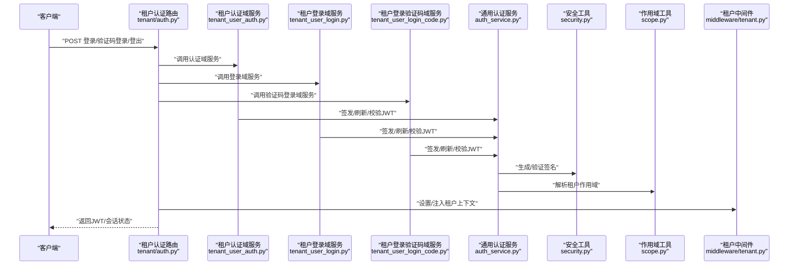
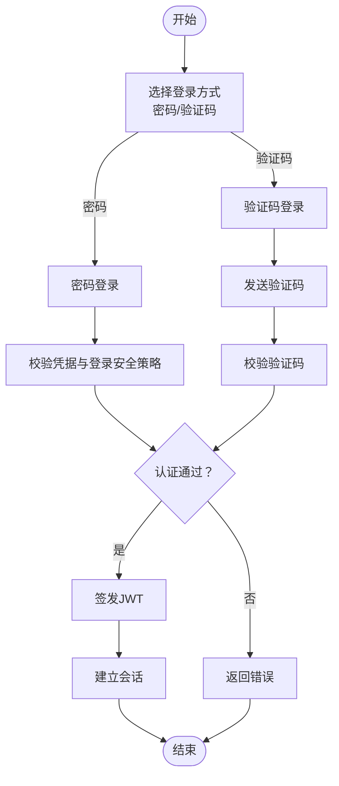
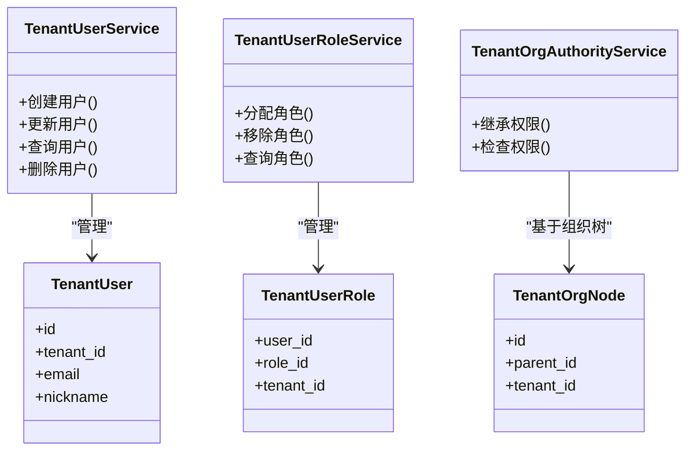
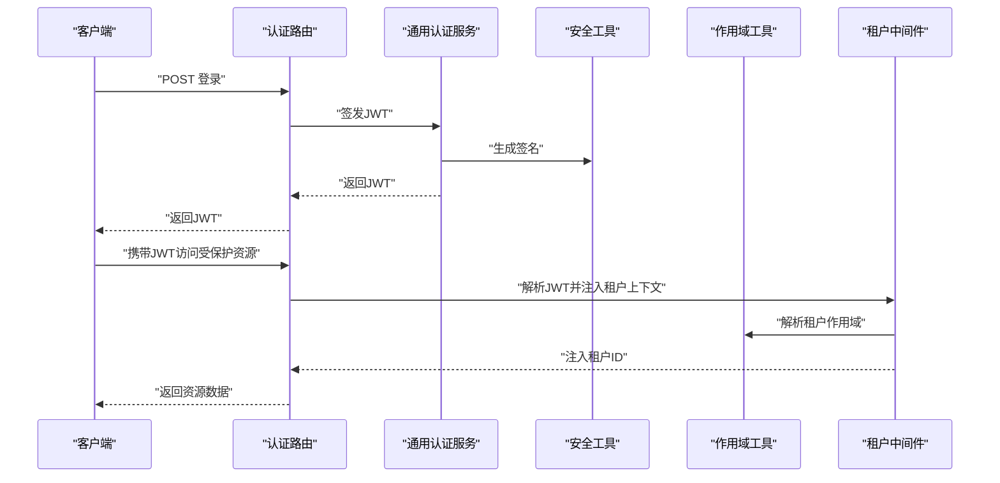
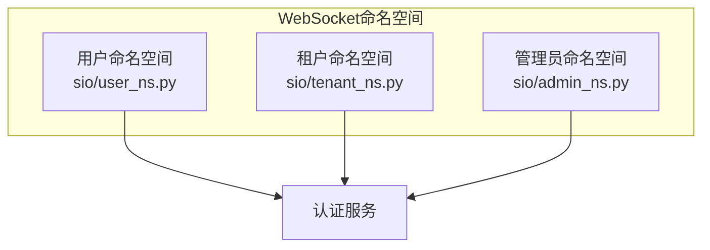
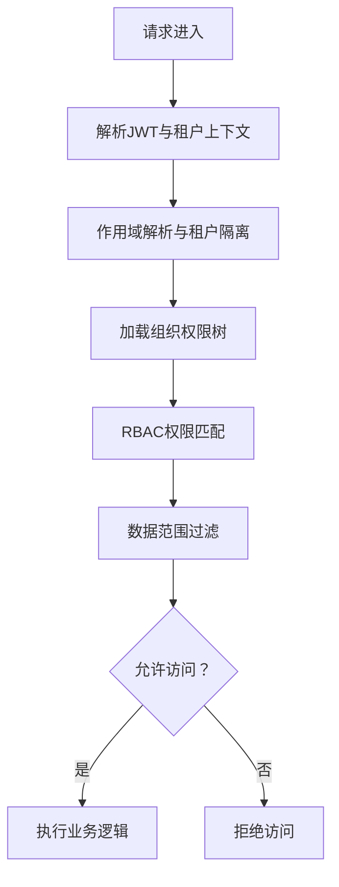
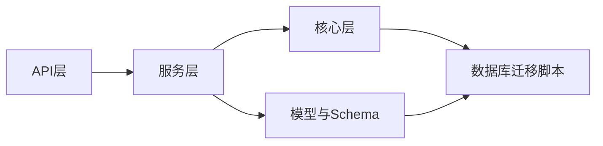

# 租户认证API

<cite>
**本文引用的文件**
- [backend/app/api/tenant/auth.py](file://backend/app/api/tenant/auth.py)
- [backend/app/api/tenant/users.py](file://backend/app/api/tenant/users.py)
- [backend/app/api/tenant/user_roles.py](file://backend/app/api/tenant/user_roles.py)
- [backend/app/api/tenant/permission_roles.py](file://backend/app/api/tenant/permission_roles.py)
- [backend/app/api/tenant/permissions.py](file://backend/app/api/tenant/permissions.py)
- [backend/app/api/tenant/admins.py](file://backend/app/api/tenant/admins.py)
- [backend/app/api/tenant/organization.py](file://backend/app/api/tenant/organization.py)
- [backend/app/api/tenant/ws.py](file://backend/app/api/tenant/ws.py)
- [backend/app/api/public/tenant.py](file://backend/app/api/public/tenant.py)
- [backend/app/api/user/auth.py](file://backend/app/api/user/auth.py)
- [backend/app/api/admin/auth.py](file://backend/app/api/admin/auth.py)
- [backend/app/services/common/auth_service.py](file://backend/app/services/common/auth_service.py)
- [backend/app/services/common/auth_domains/tenant_user_auth.py](file://backend/app/services/common/auth_domains/tenant_user_auth.py)
- [backend/app/services/common/auth_domains/tenant_user_login.py](file://backend/app/services/common/auth_domains/tenant_user_login.py)
- [backend/app/services/common/auth_domains/tenant_user_login_code.py](file://backend/app/services/common/auth_domains/tenant_user_login_code.py)
- [backend/app/services/common/auth_domains/login_security.py](file://backend/app/services/common/auth_domains/login_security.py)
- [backend/app/services/tenant/tenant_user_service.py](file://backend/app/services/tenant/tenant_user_service.py)
- [backend/app/services/tenant/tenant_user_role_service.py](file://backend/app/services/tenant/tenant_user_role_service.py)
- [backend/app/services/tenant/tenant_org_authority_service.py](file://backend/app/services/tenant/tenant_org_authority_service.py)
- [backend/app/services/system/admin_org_authority_service.py](file://backend/app/services/system/admin_org_authority_service.py)
- [backend/app/core/org_authority.py](file://backend/app/core/org_authority.py)
- [backend/app/middleware/tenant.py](file://backend/app/middleware/tenant.py)
- [backend/app/core/security.py](file://backend/app/core/security.py)
- [backend/app/core/scope.py](file://backend/app/core/scope.py)
- [backend/app/models/tenant/tenant_user.py](file://backend/app/models/tenant/tenant_user.py)
- [backend/app/models/tenant/tenant_admin.py](file://backend/app/models/tenant/tenant_admin.py)
- [backend/app/models/auth/tenant_user_role.py](file://backend/app/models/auth/tenant_user_role.py)
- [backend/app/models/auth/tenant_admin_role.py](file://backend/app/models/auth/tenant_admin_role.py)
- [backend/app/models/org/tenant_org_node.py](file://backend/app/models/org/tenant_org_node.py)
- [backend/app/schemas/tenant/user.py](file://backend/app/schemas/tenant/user.py)
- [backend/app/schemas/common/auth.py](file://backend/app/schemas/common/auth.py)
- [backend/app/schemas/tenant/user_role.py](file://backend/app/schemas/tenant/user_role.py)
- [backend/app/sio/user_ns.py](file://backend/app/sio/user_ns.py)
- [backend/app/sio/tenant_ns.py](file://backend/app/sio/tenant_ns.py)
- [backend/app/sio/admin_ns.py](file://backend/app/sio/admin_ns.py)
- [backend/migrations/versions/20260123_0006_add_login_security_fields.py](file://backend/migrations/versions/20260123_0006_add_login_security_fields.py)
- [backend/migrations/versions/20260318_1935_merge_all_heads.py](file://backend/migrations/versions/20260318_1935_merge_all_heads.py)
- [backend/migrations/versions/20260325_org_authority_rebuild.py](file://backend/migrations/versions/20260325_org_authority_rebuild.py)
- [backend/tests/api/test_tenant_auth.py](file://backend/tests/api/test_tenant_auth.py)
- [backend/tests/api/test_tenant_auth_profile_contract.py](file://backend/tests/api/test_tenant_auth_profile_contract.py)
- [backend/tests/api/test_tenant_auth_tenant_resolution.py](file://backend/tests/api/test_tenant_auth_tenant_resolution.py)
- [backend/tests/api/test_user_auth_tenant_resolution.py](file://backend/tests/api/test_user_auth_tenant_resolution.py)
- [backend/tests/services/test_auth_service.py](file://backend/tests/services/test_auth_service.py)
- [backend/tests/services/test_auth_logging.py](file://backend/tests/services/test_auth_logging.py)
</cite>

## 目录
1. [简介](#简介)
2. [项目结构](#项目结构)
3. [核心组件](#核心组件)
4. [架构总览](#架构总览)
5. [详细组件分析](#详细组件分析)
6. [依赖关系分析](#依赖关系分析)
7. [性能考虑](#性能考虑)
8. [故障排查指南](#故障排查指南)
9. [结论](#结论)
10. [附录](#附录)

## 简介
本文件为租户认证API的权威技术文档，覆盖用户登录、登出、密码重置、账户验证等认证相关接口，并深入说明租户作用域内的用户管理、角色权限分配、会话管理、JWT令牌生成与刷新机制、权限验证流程。同时提供用户注册、个人信息修改、安全设置等实际使用示例，解释租户边界内的数据隔离与权限控制机制。

## 项目结构
后端采用分层与按领域划分的组织方式，认证相关能力主要分布在以下模块：
- API层：租户域下的认证、用户、角色与权限路由
- 服务层：认证域服务、租户用户与角色服务、组织权限服务
- 核心层：安全、作用域、中间件
- 模型与Schema：租户用户、管理员、角色、组织节点等
- WebSocket：用户、租户、管理员命名空间
- 测试：认证API契约与租户解析测试

```mermaid
graph TB
subgraph "API层"
TAuth["租户认证路由<br/>backend/app/api/tenant/auth.py"]
TUsers["租户用户路由<br/>backend/app/api/tenant/users.py"]
TRoles["租户角色路由<br/>backend/app/api/tenant/user_roles.py"]
TPerms["租户权限路由<br/>backend/app/api/tenant/permissions.py"]
TAdmins["租户管理员路由<br/>backend/app/api/tenant/admins.py"]
Org["组织路由<br/>backend/app/api/tenant/organization.py"]
WS["WebSocket路由<br/>backend/app/api/tenant/ws.py"]
end
subgraph "服务层"
AuthService["通用认证服务<br/>backend/app/services/common/auth_service.py"]
TA["租户用户认证域服务<br/>backend/app/services/common/auth_domains/tenant_user_auth.py"]
TL["租户登录域服务<br/>backend/app/services/common/auth_domains/tenant_user_login.py"]
TLC["租户登录验证码域服务<br/>backend/app/services/common/auth_domains/tenant_user_login_code.py"]
TUSvc["租户用户服务<br/>backend/app/services/tenant/tenant_user_service.py"]
TURSvc["租户角色服务<br/>backend/app/services/tenant/tenant_user_role_service.py"]
TOrgSvc["租户组织权限服务<br/>backend/app/services/tenant/tenant_org_authority_service.py"]
SOrgSvc["系统组织权限服务<br/>backend/app/services/system/admin_org_authority_service.py"]
end
subgraph "核心层"
Sec["安全工具<br/>backend/app/core/security.py"]
Scope["作用域工具<br/>backend/app/core/scope.py"]
Mid["租户中间件<br/>backend/app/middleware/tenant.py"]
OrgAuth["组织权限核心<br/>backend/app/core/org_authority.py"]
end
subgraph "模型与Schema"
MU["租户用户模型<br/>backend/app/models/tenant/tenant_user.py"]
MA["租户管理员模型<br/>backend/app/models/tenant/tenant_admin.py"]
UR["租户用户角色模型<br/>backend/app/models/auth/tenant_user_role.py"]
AR["租户管理员角色模型<br/>backend/app/models/auth/tenant_admin_role.py"]
ON["租户组织节点模型<br/>backend/app/models/org/tenant_org_node.py"]
SU["用户Schema<br/>backend/app/schemas/tenant/user.py"]
SA["认证Schema<br/>backend/app/schemas/common/auth.py"]
end
TAuth --> AuthService
TAuth --> TA
TAuth --> TL
TAuth --> TLC
TUsers --> TUSvc
TRoles --> TURSvc
Org --> TOrgSvc
Org --> SOrgSvc
AuthService --> Sec
AuthService --> Scope
TA --> Mid
TL --> Mid
TLC --> Mid
TOrgSvc --> OrgAuth
SOrgSvc --> OrgAuth
TUSvc --> MU
TURSvc --> UR
Org --> ON
```

图表来源
- [backend/app/api/tenant/auth.py](file://backend/app/api/tenant/auth.py)
- [backend/app/api/tenant/users.py](file://backend/app/api/tenant/users.py)
- [backend/app/api/tenant/user_roles.py](file://backend/app/api/tenant/user_roles.py)
- [backend/app/api/tenant/permissions.py](file://backend/app/api/tenant/permissions.py)
- [backend/app/api/tenant/admins.py](file://backend/app/api/tenant/admins.py)
- [backend/app/api/tenant/organization.py](file://backend/app/api/tenant/organization.py)
- [backend/app/api/tenant/ws.py](file://backend/app/api/tenant/ws.py)
- [backend/app/services/common/auth_service.py](file://backend/app/services/common/auth_service.py)
- [backend/app/services/common/auth_domains/tenant_user_auth.py](file://backend/app/services/common/auth_domains/tenant_user_auth.py)
- [backend/app/services/common/auth_domains/tenant_user_login.py](file://backend/app/services/common/auth_domains/tenant_user_login.py)
- [backend/app/services/common/auth_domains/tenant_user_login_code.py](file://backend/app/services/common/auth_domains/tenant_user_login_code.py)
- [backend/app/services/tenant/tenant_user_service.py](file://backend/app/services/tenant/tenant_user_service.py)
- [backend/app/services/tenant/tenant_user_role_service.py](file://backend/app/services/tenant/tenant_user_role_service.py)
- [backend/app/services/tenant/tenant_org_authority_service.py](file://backend/app/services/tenant/tenant_org_authority_service.py)
- [backend/app/services/system/admin_org_authority_service.py](file://backend/app/services/system/admin_org_authority_service.py)
- [backend/app/core/security.py](file://backend/app/core/security.py)
- [backend/app/core/scope.py](file://backend/app/core/scope.py)
- [backend/app/middleware/tenant.py](file://backend/app/middleware/tenant.py)
- [backend/app/core/org_authority.py](file://backend/app/core/org_authority.py)
- [backend/app/models/tenant/tenant_user.py](file://backend/app/models/tenant/tenant_user.py)
- [backend/app/models/tenant/tenant_admin.py](file://backend/app/models/tenant/tenant_admin.py)
- [backend/app/models/auth/tenant_user_role.py](file://backend/app/models/auth/tenant_user_role.py)
- [backend/app/models/auth/tenant_admin_role.py](file://backend/app/models/auth/tenant_admin_role.py)
- [backend/app/models/org/tenant_org_node.py](file://backend/app/models/org/tenant_org_node.py)
- [backend/app/schemas/tenant/user.py](file://backend/app/schemas/tenant/user.py)
- [backend/app/schemas/common/auth.py](file://backend/app/schemas/common/auth.py)

章节来源
- [backend/app/api/tenant/auth.py](file://backend/app/api/tenant/auth.py)
- [backend/app/api/tenant/users.py](file://backend/app/api/tenant/users.py)
- [backend/app/api/tenant/user_roles.py](file://backend/app/api/tenant/user_roles.py)
- [backend/app/api/tenant/permissions.py](file://backend/app/api/tenant/permissions.py)
- [backend/app/api/tenant/admins.py](file://backend/app/api/tenant/admins.py)
- [backend/app/api/tenant/organization.py](file://backend/app/api/tenant/organization.py)
- [backend/app/api/tenant/ws.py](file://backend/app/api/tenant/ws.py)
- [backend/app/services/common/auth_service.py](file://backend/app/services/common/auth_service.py)
- [backend/app/services/common/auth_domains/tenant_user_auth.py](file://backend/app/services/common/auth_domains/tenant_user_auth.py)
- [backend/app/services/common/auth_domains/tenant_user_login.py](file://backend/app/services/common/auth_domains/tenant_user_login.py)
- [backend/app/services/common/auth_domains/tenant_user_login_code.py](file://backend/app/services/common/auth_domains/tenant_user_login_code.py)
- [backend/app/services/tenant/tenant_user_service.py](file://backend/app/services/tenant/tenant_user_service.py)
- [backend/app/services/tenant/tenant_user_role_service.py](file://backend/app/services/tenant/tenant_user_role_service.py)
- [backend/app/services/tenant/tenant_org_authority_service.py](file://backend/app/services/tenant/tenant_org_authority_service.py)
- [backend/app/services/system/admin_org_authority_service.py](file://backend/app/services/system/admin_org_authority_service.py)
- [backend/app/core/security.py](file://backend/app/core/security.py)
- [backend/app/core/scope.py](file://backend/app/core/scope.py)
- [backend/app/middleware/tenant.py](file://backend/app/middleware/tenant.py)
- [backend/app/core/org_authority.py](file://backend/app/core/org_authority.py)
- [backend/app/models/tenant/tenant_user.py](file://backend/app/models/tenant/tenant_user.py)
- [backend/app/models/tenant/tenant_admin.py](file://backend/app/models/tenant/tenant_admin.py)
- [backend/app/models/auth/tenant_user_role.py](file://backend/app/models/auth/tenant_user_role.py)
- [backend/app/models/auth/tenant_admin_role.py](file://backend/app/models/auth/tenant_admin_role.py)
- [backend/app/models/org/tenant_org_node.py](file://backend/app/models/org/tenant_org_node.py)
- [backend/app/schemas/tenant/user.py](file://backend/app/schemas/tenant/user.py)
- [backend/app/schemas/common/auth.py](file://backend/app/schemas/common/auth.py)

## 核心组件
- 认证域服务：负责租户用户认证、登录、验证码登录、登录安全策略等
- 通用认证服务：统一处理JWT签发、刷新、校验、会话管理
- 租户用户与角色服务：提供用户信息维护、角色分配与查询
- 组织权限服务：基于组织树的权限继承与约束
- 安全与作用域：提供加密、签名、租户作用域解析与隔离
- WebSocket命名空间：用户、租户、管理员的实时通信通道

章节来源
- [backend/app/services/common/auth_service.py](file://backend/app/services/common/auth_service.py)
- [backend/app/services/common/auth_domains/tenant_user_auth.py](file://backend/app/services/common/auth_domains/tenant_user_auth.py)
- [backend/app/services/common/auth_domains/tenant_user_login.py](file://backend/app/services/common/auth_domains/tenant_user_login.py)
- [backend/app/services/common/auth_domains/tenant_user_login_code.py](file://backend/app/services/common/auth_domains/tenant_user_login_code.py)
- [backend/app/services/tenant/tenant_user_service.py](file://backend/app/services/tenant/tenant_user_service.py)
- [backend/app/services/tenant/tenant_user_role_service.py](file://backend/app/services/tenant/tenant_user_role_service.py)
- [backend/app/services/tenant/tenant_org_authority_service.py](file://backend/app/services/tenant/tenant_org_authority_service.py)
- [backend/app/core/security.py](file://backend/app/core/security.py)
- [backend/app/core/scope.py](file://backend/app/core/scope.py)
- [backend/app/middleware/tenant.py](file://backend/app/middleware/tenant.py)

## 架构总览
下图展示租户认证API在请求生命周期中的关键交互：客户端通过租户域API发起认证请求，经由认证域服务与通用认证服务完成鉴权与会话建立，随后在租户作用域内进行资源访问与权限校验。

图表来源
- [backend/app/api/tenant/auth.py](file://backend/app/api/tenant/auth.py)
- [backend/app/services/common/auth_domains/tenant_user_auth.py](file://backend/app/services/common/auth_domains/tenant_user_auth.py)
- [backend/app/services/common/auth_domains/tenant_user_login.py](file://backend/app/services/common/auth_domains/tenant_user_login.py)
- [backend/app/services/common/auth_domains/tenant_user_login_code.py](file://backend/app/services/common/auth_domains/tenant_user_login_code.py)
- [backend/app/services/common/auth_service.py](file://backend/app/services/common/auth_service.py)
- [backend/app/core/security.py](file://backend/app/core/security.py)
- [backend/app/core/scope.py](file://backend/app/core/scope.py)
- [backend/app/middleware/tenant.py](file://backend/app/middleware/tenant.py)

## 详细组件分析

### 认证API与流程
- 用户登录
  - 支持账号密码登录与验证码登录两种模式
  - 登录成功后签发JWT，包含租户标识与用户角色信息
  - 登录安全策略（如失败次数限制、锁定策略）由登录安全域服务控制
- 验证码登录
  - 发送验证码至绑定邮箱/手机号，输入验证码完成登录
  - 验证码有效期与复用策略由验证码域服务管理
- 密码重置
  - 通过已登录上下文或重置令牌进行密码更新
  - 更新后使旧令牌失效并签发新令牌
- 账户验证
  - 邮箱/手机号验证流程，验证通过后解锁相应功能
- 登出
  - 服务端撤销会话或标记令牌失效，前端清理本地存储

图表来源
- [backend/app/services/common/auth_domains/tenant_user_login.py](file://backend/app/services/common/auth_domains/tenant_user_login.py)
- [backend/app/services/common/auth_domains/tenant_user_login_code.py](file://backend/app/services/common/auth_domains/tenant_user_login_code.py)
- [backend/app/services/common/auth_domains/login_security.py](file://backend/app/services/common/auth_domains/login_security.py)
- [backend/app/services/common/auth_service.py](file://backend/app/services/common/auth_service.py)

章节来源
- [backend/app/api/tenant/auth.py](file://backend/app/api/tenant/auth.py)
- [backend/app/services/common/auth_domains/tenant_user_login.py](file://backend/app/services/common/auth_domains/tenant_user_login.py)
- [backend/app/services/common/auth_domains/tenant_user_login_code.py](file://backend/app/services/common/auth_domains/tenant_user_login_code.py)
- [backend/app/services/common/auth_domains/login_security.py](file://backend/app/services/common/auth_domains/login_security.py)
- [backend/app/services/common/auth_service.py](file://backend/app/services/common/auth_service.py)

### 租户作用域内的用户管理
- 用户注册与信息维护
  - 通过租户用户服务进行用户创建、更新与查询
  - 用户信息包含基础资料、偏好设置与登录安全字段
- 角色与权限
  - 用户可被授予租户内不同角色，角色映射到具体权限
  - 权限支持数据范围控制，确保跨租户数据隔离
- 组织架构与权限继承
  - 基于组织节点树的权限继承，子节点自动继承父节点权限
  - 系统与租户两级组织权限服务分别处理全局与租户级权限

图表来源
- [backend/app/services/tenant/tenant_user_service.py](file://backend/app/services/tenant/tenant_user_service.py)
- [backend/app/services/tenant/tenant_user_role_service.py](file://backend/app/services/tenant/tenant_user_role_service.py)
- [backend/app/services/tenant/tenant_org_authority_service.py](file://backend/app/services/tenant/tenant_org_authority_service.py)
- [backend/app/models/tenant/tenant_user.py](file://backend/app/models/tenant/tenant_user.py)
- [backend/app/models/auth/tenant_user_role.py](file://backend/app/models/auth/tenant_user_role.py)
- [backend/app/models/org/tenant_org_node.py](file://backend/app/models/org/tenant_org_node.py)

章节来源
- [backend/app/api/tenant/users.py](file://backend/app/api/tenant/users.py)
- [backend/app/api/tenant/user_roles.py](file://backend/app/api/tenant/user_roles.py)
- [backend/app/api/tenant/permissions.py](file://backend/app/api/tenant/permissions.py)
- [backend/app/api/tenant/permission_roles.py](file://backend/app/api/tenant/permission_roles.py)
- [backend/app/services/tenant/tenant_user_service.py](file://backend/app/services/tenant/tenant_user_service.py)
- [backend/app/services/tenant/tenant_user_role_service.py](file://backend/app/services/tenant/tenant_user_role_service.py)
- [backend/app/services/tenant/tenant_org_authority_service.py](file://backend/app/services/tenant/tenant_org_authority_service.py)
- [backend/app/models/tenant/tenant_user.py](file://backend/app/models/tenant/tenant_user.py)
- [backend/app/models/auth/tenant_user_role.py](file://backend/app/models/auth/tenant_user_role.py)
- [backend/app/models/org/tenant_org_node.py](file://backend/app/models/org/tenant_org_node.py)

### JWT令牌生成、刷新与权限验证
- 令牌签发
  - 登录成功后由通用认证服务签发JWT，包含租户ID、用户ID、角色列表与过期时间
- 刷新机制
  - 提供刷新接口，在令牌即将过期时换取新令牌；旧令牌作废
- 权限验证
  - 中间件解析JWT并注入租户上下文，后续路由仅允许访问当前租户范围内的资源
  - 权限验证结合RBAC与数据范围控制，确保越权访问被拒绝

图表来源
- [backend/app/services/common/auth_service.py](file://backend/app/services/common/auth_service.py)
- [backend/app/core/security.py](file://backend/app/core/security.py)
- [backend/app/core/scope.py](file://backend/app/core/scope.py)
- [backend/app/middleware/tenant.py](file://backend/app/middleware/tenant.py)

章节来源
- [backend/app/services/common/auth_service.py](file://backend/app/services/common/auth_service.py)
- [backend/app/core/security.py](file://backend/app/core/security.py)
- [backend/app/core/scope.py](file://backend/app/core/scope.py)
- [backend/app/middleware/tenant.py](file://backend/app/middleware/tenant.py)

### 会话管理与WebSocket集成
- 会话生命周期
  - 登录建立会话，登出或刷新使旧会话失效
  - 会话状态与令牌状态保持一致
- WebSocket命名空间
  - 用户命名空间：个人消息推送
  - 租户命名空间：租户内广播与通知
  - 管理员命名空间：后台管理消息

图表来源
- [backend/app/sio/user_ns.py](file://backend/app/sio/user_ns.py)
- [backend/app/sio/tenant_ns.py](file://backend/app/sio/tenant_ns.py)
- [backend/app/sio/admin_ns.py](file://backend/app/sio/admin_ns.py)
- [backend/app/services/common/auth_service.py](file://backend/app/services/common/auth_service.py)

章节来源
- [backend/app/api/tenant/ws.py](file://backend/app/api/tenant/ws.py)
- [backend/app/sio/user_ns.py](file://backend/app/sio/user_ns.py)
- [backend/app/sio/tenant_ns.py](file://backend/app/sio/tenant_ns.py)
- [backend/app/sio/admin_ns.py](file://backend/app/sio/admin_ns.py)
- [backend/app/services/common/auth_service.py](file://backend/app/services/common/auth_service.py)

### 实际使用示例
- 用户注册
  - 请求路径：POST /tenant/users/register
  - 参数：邮箱、昵称、密码
  - 返回：用户ID、初始角色
- 修改个人信息
  - 请求路径：PATCH /tenant/users/profile
  - 参数：昵称、头像URL
  - 返回：更新后的用户信息
- 设置安全选项
  - 请求路径：PATCH /tenant/users/security
  - 参数：启用二次验证、修改登录安全策略
  - 返回：操作结果
- 登录
  - 请求路径：POST /tenant/auth/login
  - 参数：账号/邮箱、密码
  - 返回：JWT、用户信息、角色列表
- 验证码登录
  - 请求路径：POST /tenant/auth/login/code
  - 参数：邮箱、验证码
  - 返回：JWT、用户信息
- 登出
  - 请求路径：POST /tenant/auth/logout
  - 返回：登出结果
- 密码重置
  - 请求路径：POST /tenant/auth/password/reset
  - 参数：旧密码、新密码
  - 返回：重置结果

章节来源
- [backend/app/api/tenant/auth.py](file://backend/app/api/tenant/auth.py)
- [backend/app/api/tenant/users.py](file://backend/app/api/tenant/users.py)
- [backend/app/api/tenant/user_roles.py](file://backend/app/api/tenant/user_roles.py)
- [backend/app/api/tenant/permissions.py](file://backend/app/api/tenant/permissions.py)
- [backend/app/api/tenant/permission_roles.py](file://backend/app/api/tenant/permission_roles.py)
- [backend/app/api/tenant/admins.py](file://backend/app/api/tenant/admins.py)
- [backend/app/api/tenant/organization.py](file://backend/app/api/tenant/organization.py)
- [backend/app/api/tenant/ws.py](file://backend/app/api/tenant/ws.py)

### 数据隔离与权限控制机制
- 租户边界
  - 所有用户、角色、权限与资源均绑定租户ID
  - 中间件在每次请求中解析并注入租户上下文，保证跨模块访问均受租户约束
- 组织权限
  - 组织节点树决定权限继承关系，子节点自动继承父节点权限
  - 系统与租户两级组织权限服务协同工作，分别处理全局与租户级权限
- RBAC与数据范围
  - 角色映射到权限集合，权限可配置数据范围（如仅本人、仅所在部门）
  - 查询与写入操作均受数据范围约束，防止越权访问

图表来源
- [backend/app/middleware/tenant.py](file://backend/app/middleware/tenant.py)
- [backend/app/core/scope.py](file://backend/app/core/scope.py)
- [backend/app/core/org_authority.py](file://backend/app/core/org_authority.py)
- [backend/app/services/tenant/tenant_org_authority_service.py](file://backend/app/services/tenant/tenant_org_authority_service.py)
- [backend/app/services/system/admin_org_authority_service.py](file://backend/app/services/system/admin_org_authority_service.py)

章节来源
- [backend/app/middleware/tenant.py](file://backend/app/middleware/tenant.py)
- [backend/app/core/scope.py](file://backend/app/core/scope.py)
- [backend/app/core/org_authority.py](file://backend/app/core/org_authority.py)
- [backend/app/services/tenant/tenant_org_authority_service.py](file://backend/app/services/tenant/tenant_org_authority_service.py)
- [backend/app/services/system/admin_org_authority_service.py](file://backend/app/services/system/admin_org_authority_service.py)

## 依赖关系分析
- 组件耦合
  - API层依赖服务层；服务层依赖核心层（安全、作用域、中间件）
  - 认证域服务与通用认证服务紧密耦合，共同完成令牌生命周期管理
- 外部依赖
  - 依赖数据库迁移脚本以支持登录安全字段与组织权限重建
- 循环依赖
  - 当前设计避免循环导入，各层职责清晰

图表来源
- [backend/app/api/tenant/auth.py](file://backend/app/api/tenant/auth.py)
- [backend/app/services/common/auth_service.py](file://backend/app/services/common/auth_service.py)
- [backend/app/core/security.py](file://backend/app/core/security.py)
- [backend/app/core/scope.py](file://backend/app/core/scope.py)
- [backend/migrations/versions/20260123_0006_add_login_security_fields.py](file://backend/migrations/versions/20260123_0006_add_login_security_fields.py)
- [backend/migrations/versions/20260325_org_authority_rebuild.py](file://backend/migrations/versions/20260325_org_authority_rebuild.py)

章节来源
- [backend/app/api/tenant/auth.py](file://backend/app/api/tenant/auth.py)
- [backend/app/services/common/auth_service.py](file://backend/app/services/common/auth_service.py)
- [backend/app/core/security.py](file://backend/app/core/security.py)
- [backend/app/core/scope.py](file://backend/app/core/scope.py)
- [backend/migrations/versions/20260123_0006_add_login_security_fields.py](file://backend/migrations/versions/20260123_0006_add_login_security_fields.py)
- [backend/migrations/versions/20260325_org_authority_rebuild.py](file://backend/migrations/versions/20260325_org_authority_rebuild.py)

## 性能考虑
- 令牌缓存与校验优化
  - 对频繁校验的令牌进行短期缓存，降低数据库压力
- 登录安全策略
  - 失败次数与锁定策略减少暴力破解风险，同时避免对正常用户的影响
- 作用域解析
  - 将租户上下文注入到请求链路，避免重复解析
- WebSocket连接
  - 合理设置心跳与断线重连策略，减少无效连接占用

## 故障排查指南
- 登录失败
  - 检查登录凭据是否正确，确认登录安全策略未触发锁定
  - 参考测试用例定位问题：[test_tenant_auth.py](file://backend/tests/api/test_tenant_auth.py)
- 令牌无效或过期
  - 使用刷新接口获取新令牌；确认JWT签名与过期时间
  - 参考测试用例：[test_auth_service.py](file://backend/tests/services/test_auth_service.py)
- 权限不足
  - 检查用户角色与权限映射，确认数据范围配置
  - 参考组织权限服务与RBAC实现
- 租户解析异常
  - 确认中间件正确注入租户上下文，检查作用域工具解析逻辑
  - 参考测试用例：[test_tenant_auth_tenant_resolution.py](file://backend/tests/api/test_tenant_auth_tenant_resolution.py)

章节来源
- [backend/tests/api/test_tenant_auth.py](file://backend/tests/api/test_tenant_auth.py)
- [backend/tests/services/test_auth_service.py](file://backend/tests/services/test_auth_service.py)
- [backend/tests/api/test_tenant_auth_tenant_resolution.py](file://backend/tests/api/test_tenant_auth_tenant_resolution.py)

## 结论
本认证体系以租户为中心，通过JWT令牌、登录安全策略、组织权限树与数据范围控制，实现了强隔离与细粒度权限管理。API层提供完整的认证与用户管理能力，服务层抽象出通用认证与租户域服务，核心层提供安全与作用域支撑。配合WebSocket命名空间，形成从前端到后端的完整认证与会话管理闭环。

## 附录
- 关键迁移脚本
  - 登录安全字段：[20260123_0006_add_login_security_fields.py](file://backend/migrations/versions/20260123_0006_add_login_security_fields.py)
  - 组织权限重建：[20260325_org_authority_rebuild.py](file://backend/migrations/versions/20260325_org_authority_rebuild.py)
- 公共与用户域认证入口
  - 租户认证：[backend/app/api/tenant/auth.py](file://backend/app/api/tenant/auth.py)
  - 用户域认证：[backend/app/api/user/auth.py](file://backend/app/api/user/auth.py)
  - 管理员域认证：[backend/app/api/admin/auth.py](file://backend/app/api/admin/auth.py)
  - 公共租户域：[backend/app/api/public/tenant.py](file://backend/app/api/public/tenant.py)