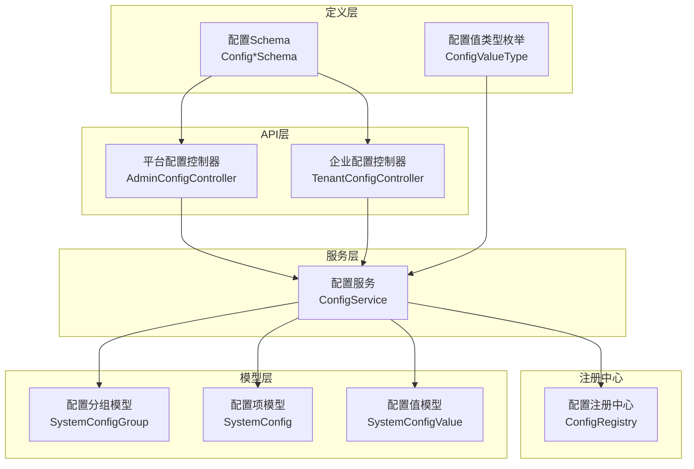
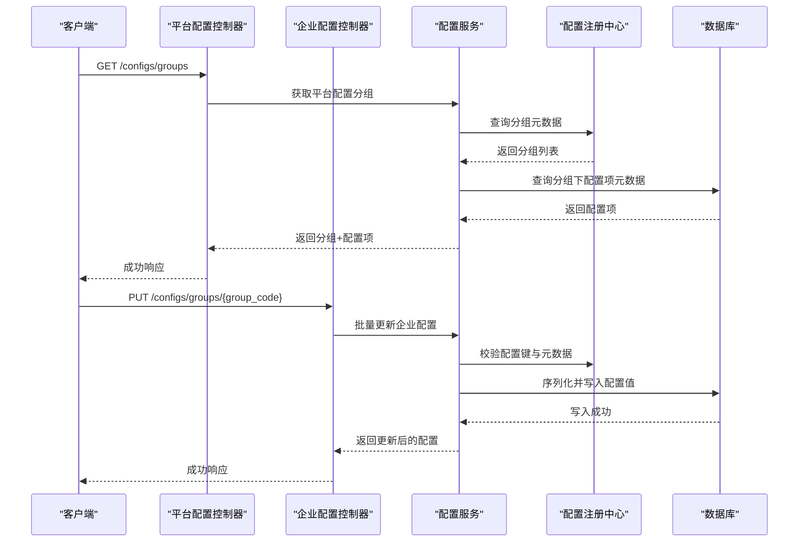
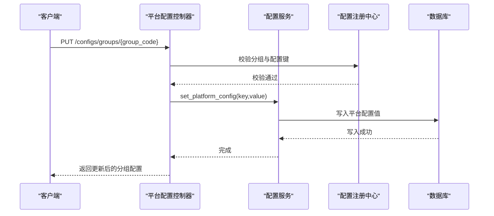
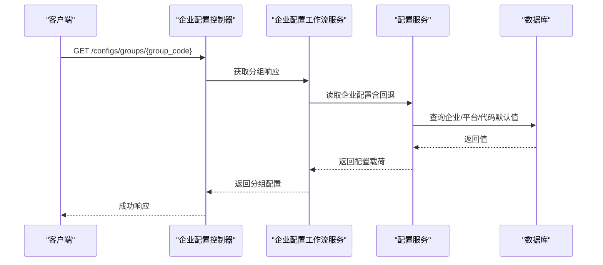
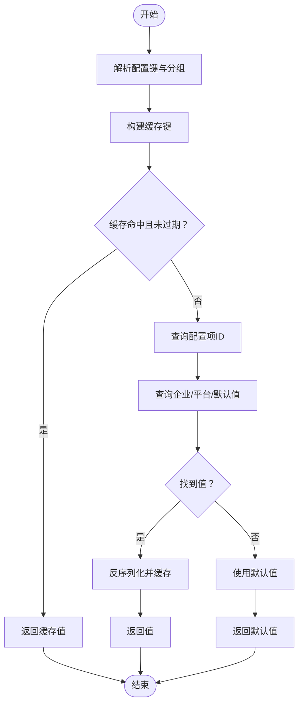
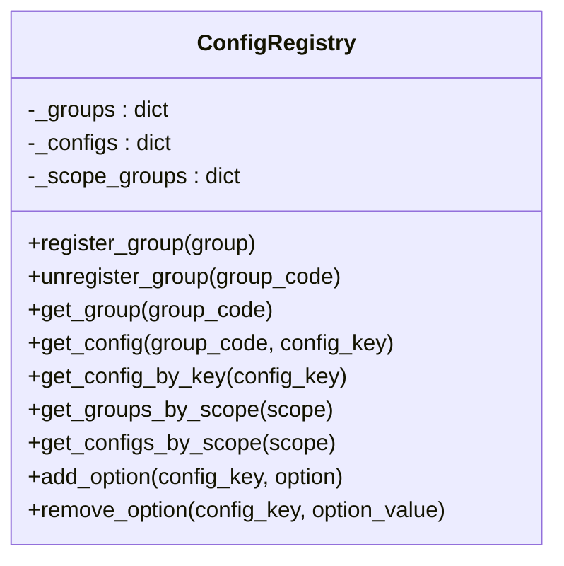
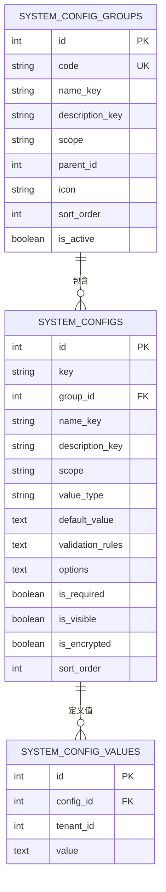
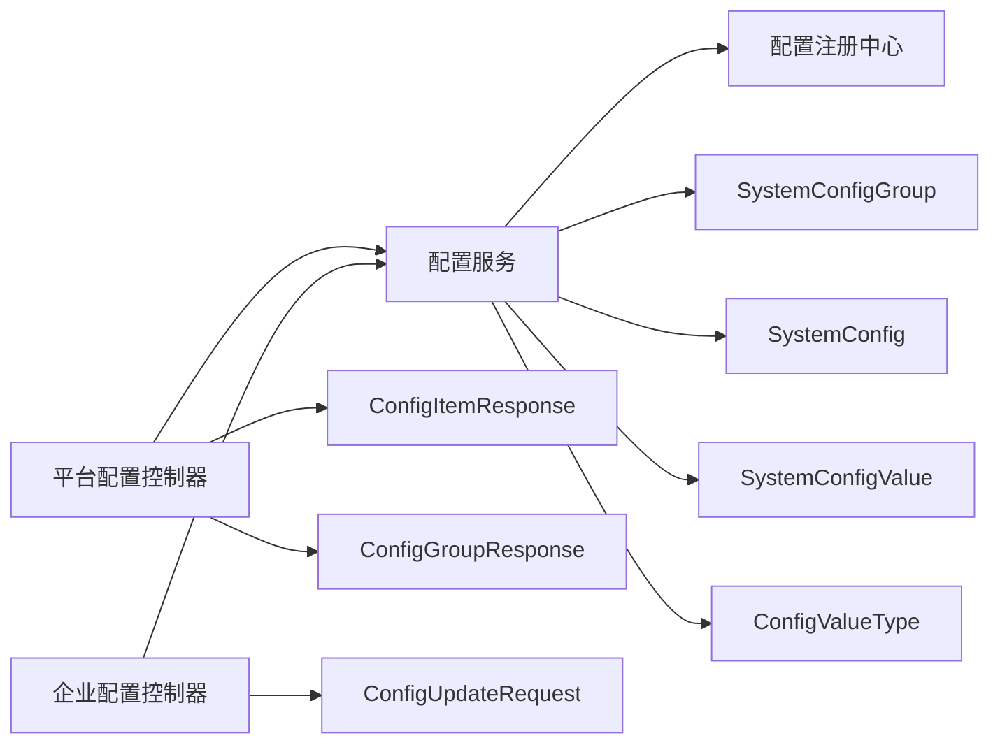

# 配置管理API

<cite>
**本文档引用的文件**
- [backend/app/api/admin/configs.py](file://backend/app/api/admin/configs.py)
- [backend/app/api/tenant/configs.py](file://backend/app/api/tenant/configs.py)
- [backend/app/configs/service.py](file://backend/app/configs/service.py)
- [backend/app/configs/registry.py](file://backend/app/configs/registry.py)
- [backend/app/configs/meta.py](file://backend/app/configs/meta.py)
- [backend/app/models/system/config.py](file://backend/app/models/system/config.py)
- [backend/app/schemas/system/config.py](file://backend/app/schemas/system/config.py)
- [backend/app/enums/config.py](file://backend/app/enums/config.py)
- [backend/migrations/versions/20260116_3f669a3f2342_add_system_config_tables.py](file://backend/migrations/versions/20260116_3f669a3f2342_add_system_config_tables.py)
</cite>

## 目录
1. [简介](#简介)
2. [项目结构](#项目结构)
3. [核心组件](#核心组件)
4. [架构总览](#架构总览)
5. [详细组件分析](#详细组件分析)
6. [依赖关系分析](#依赖关系分析)
7. [性能考虑](#性能考虑)
8. [故障排除指南](#故障排除指南)
9. [结论](#结论)
10. [附录](#附录)

## 简介
本文件面向配置管理API，系统性梳理平台配置、AI配置、域名设置、用户偏好等配置相关接口。重点说明配置项的分类、继承关系、默认值管理、配置验证、热更新、版本控制、导入导出、批量修改、权限控制以及租户间继承与覆盖规则。文档以代码为依据，提供可追溯的源码路径，并辅以图示帮助理解。

## 项目结构
配置管理API主要分布在以下模块：
- 控制器层：平台级与企业级配置API控制器
- 服务层：统一的配置读写服务，负责验证、回退与缓存
- 注册中心：集中管理配置分组与配置项元数据
- 模型层：数据库持久化模型，支持平台级与企业级配置
- 枚举与Schema：值类型、作用域、请求/响应结构定义

**图表来源**
- [backend/app/api/admin/configs.py:120-474](file://backend/app/api/admin/configs.py#L120-L474)
- [backend/app/api/tenant/configs.py:49-251](file://backend/app/api/tenant/configs.py#L49-L251)
- [backend/app/configs/service.py:45-800](file://backend/app/configs/service.py#L45-L800)
- [backend/app/configs/registry.py:20-311](file://backend/app/configs/registry.py#L20-L311)
- [backend/app/models/system/config.py:16-357](file://backend/app/models/system/config.py#L16-L357)
- [backend/app/enums/config.py:16-44](file://backend/app/enums/config.py#L16-L44)
- [backend/app/schemas/system/config.py:19-141](file://backend/app/schemas/system/config.py#L19-L141)

**章节来源**
- [backend/app/api/admin/configs.py:120-474](file://backend/app/api/admin/configs.py#L120-L474)
- [backend/app/api/tenant/configs.py:49-251](file://backend/app/api/tenant/configs.py#L49-L251)
- [backend/app/configs/service.py:45-800](file://backend/app/configs/service.py#L45-L800)
- [backend/app/configs/registry.py:20-311](file://backend/app/configs/registry.py#L20-L311)
- [backend/app/models/system/config.py:16-357](file://backend/app/models/system/config.py#L16-L357)
- [backend/app/enums/config.py:16-44](file://backend/app/enums/config.py#L16-L44)
- [backend/app/schemas/system/config.py:19-141](file://backend/app/schemas/system/config.py#L19-L141)

## 核心组件
- 平台配置控制器：提供平台级配置的分组列表、分组详情、批量更新、SSL DNS巡检、Fernet密钥生成、存储驱动测试与列表等接口。
- 企业配置控制器：提供企业级配置的分组列表、分组详情、批量更新、企业存储状态与连接测试、允许的存储驱动列表等接口。
- 配置服务：封装配置读写逻辑，支持平台与企业配置；实现值回退（企业未设时回退至平台默认）、缓存、HTML净化、值类型规范化与验证、序列化/反序列化。
- 配置注册中心：单例注册中心，维护分组与配置项元数据索引，支持动态注入/撤销选项（如存储驱动）。
- 数据模型：SystemConfigGroup、SystemConfig、SystemConfigValue三张表分别承载分组、配置项元数据与配置值，支持平台级（tenant_id=0）与企业级（tenant_id>0）。
- 枚举与Schema：定义配置值类型、作用域、请求/响应结构，保证前后端契约一致。

**章节来源**
- [backend/app/api/admin/configs.py:120-474](file://backend/app/api/admin/configs.py#L120-L474)
- [backend/app/api/tenant/configs.py:49-251](file://backend/app/api/tenant/configs.py#L49-L251)
- [backend/app/configs/service.py:45-800](file://backend/app/configs/service.py#L45-L800)
- [backend/app/configs/registry.py:20-311](file://backend/app/configs/registry.py#L20-L311)
- [backend/app/models/system/config.py:16-357](file://backend/app/models/system/config.py#L16-L357)
- [backend/app/enums/config.py:16-44](file://backend/app/enums/config.py#L16-L44)
- [backend/app/schemas/system/config.py:19-141](file://backend/app/schemas/system/config.py#L19-L141)

## 架构总览
配置管理API采用“控制器-服务-注册中心-模型”的分层架构，配合元数据驱动的配置定义与Schema约束，形成可扩展、可验证、可回退的配置体系。

**图表来源**
- [backend/app/api/admin/configs.py:134-174](file://backend/app/api/admin/configs.py#L134-L174)
- [backend/app/api/tenant/configs.py:139-161](file://backend/app/api/tenant/configs.py#L139-L161)
- [backend/app/configs/service.py:348-395](file://backend/app/configs/service.py#L348-L395)
- [backend/app/configs/registry.py:198-251](file://backend/app/configs/registry.py#L198-L251)
- [backend/app/models/system/config.py:147-357](file://backend/app/models/system/config.py#L147-L357)

## 详细组件分析

### 平台配置API
- 功能要点
  - 获取平台配置分组列表（不含具体配置项）
  - 获取指定分组的配置项列表（含当前值）
  - 批量更新分组配置（支持扁平/包裹两种格式）
  - SSL DNS配置巡检
  - 生成Fernet密钥
  - 存储连接测试与驱动列表
- 关键流程
  - 分组校验：通过注册中心按作用域筛选分组
  - 值回退：平台配置直接读取平台默认值
  - 验证：对SSL配置进行专项校验
  - 写入：逐项调用配置服务写入并失效缓存

**图表来源**
- [backend/app/api/admin/configs.py:255-346](file://backend/app/api/admin/configs.py#L255-L346)
- [backend/app/configs/service.py:107-122](file://backend/app/configs/service.py#L107-L122)
- [backend/app/configs/registry.py:198-251](file://backend/app/configs/registry.py#L198-L251)

**章节来源**
- [backend/app/api/admin/configs.py:134-346](file://backend/app/api/admin/configs.py#L134-L346)
- [backend/app/configs/service.py:86-140](file://backend/app/configs/service.py#L86-L140)

### 企业配置API
- 功能要点
  - 获取企业配置分组列表
  - 获取指定分组的配置项列表（含当前值）
  - 批量更新企业配置
  - 企业存储状态查询与连接测试
  - 企业允许的存储驱动列表
- 关键流程
  - 值回退：企业配置优先读取企业值，未设则回退平台默认值，再回退代码默认值
  - 工作流服务：企业配置更新通过工作流服务协调
  - 存储模式：支持平台白名单限制与企业自管模式

**图表来源**
- [backend/app/api/tenant/configs.py:107-137](file://backend/app/api/tenant/configs.py#L107-L137)
- [backend/app/configs/service.py:145-185](file://backend/app/configs/service.py#L145-L185)

**章节来源**
- [backend/app/api/tenant/configs.py:64-241](file://backend/app/api/tenant/configs.py#L64-L241)
- [backend/app/configs/service.py:145-241](file://backend/app/configs/service.py#L145-L241)

### 配置服务（读写与回退）
- 读取策略
  - 平台配置：直接读取平台值
  - 企业配置：优先企业值，其次平台默认值，再次代码默认值，最后传入默认值
  - 批量读取：按分组聚合返回
- 写入策略
  - 值规范化与验证：根据值类型执行标准化与规则校验
  - HTML净化：对HTML类型进行净化
  - 序列化存储：统一JSON字符串存储
  - 缓存失效：写入后立即失效对应缓存键
- 缓存机制
  - 配置ID映射缓存（TTL=5分钟）
  - 配置值缓存（TTL=60秒）

**图表来源**
- [backend/app/configs/service.py:401-452](file://backend/app/configs/service.py#L401-L452)
- [backend/app/configs/service.py:527-583](file://backend/app/configs/service.py#L527-L583)

**章节来源**
- [backend/app/configs/service.py:45-800](file://backend/app/configs/service.py#L45-L800)

### 配置注册中心（元数据管理）
- 职责
  - 单例注册中心，维护分组与配置项索引
  - 支持按作用域查询分组与配置
  - 动态注入/撤销配置选项（如存储驱动）
- 关键能力
  - 注册/注销分组
  - 跨分组按键查找配置
  - 按作用域聚合分组

**图表来源**
- [backend/app/configs/registry.py:20-311](file://backend/app/configs/registry.py#L20-L311)

**章节来源**
- [backend/app/configs/registry.py:20-311](file://backend/app/configs/registry.py#L20-L311)

### 数据模型与值类型
- 数据模型
  - SystemConfigGroup：配置分组，支持父子层级
  - SystemConfig：配置项元数据（键、类型、默认值、验证规则、选项等）
  - SystemConfigValue：配置值（JSON字符串存储），按配置与租户唯一
- 值类型
  - STRING、NUMBER、BOOLEAN、SELECT、MULTI_SELECT、JSON、TEXT、HTML、PASSWORD、COLOR、IMAGE、TAG、FILE
  - PASSWORD默认加密存储

**图表来源**
- [backend/app/models/system/config.py:16-357](file://backend/app/models/system/config.py#L16-L357)

**章节来源**
- [backend/app/models/system/config.py:16-357](file://backend/app/models/system/config.py#L16-L357)
- [backend/app/enums/config.py:16-44](file://backend/app/enums/config.py#L16-L44)

### 配置验证与默认值管理
- 验证规则
  - 必填校验：空值/空字符串/空集合/空字典均视为不合法
  - 数值范围：min/max/min_value/max_value
  - 长度校验：min_length/max_length
  - 正则匹配：pattern
  - 选择类型：SELECT/MULTI_SELECT需在选项中或允许动态选项
- 默认值回退
  - 企业配置：企业值 → 平台默认值 → 代码默认值 → 传入默认值
  - 平台配置：平台默认值 → 代码默认值 → 传入默认值
- HTML净化
  - HTML类型配置写入前进行净化

**章节来源**
- [backend/app/configs/service.py:590-767](file://backend/app/configs/service.py#L590-L767)
- [backend/app/configs/service.py:145-185](file://backend/app/configs/service.py#L145-L185)
- [backend/app/configs/service.py:554-560](file://backend/app/configs/service.py#L554-L560)

### 权限控制与菜单资源
- 资源与权限
  - 平台配置：platform_config:groups、platform_config:detail、platform_config:update、platform_config:read
  - 企业配置：tenant_config:groups、tenant_config:detail、tenant_config:update
- 菜单与排序
  - 平台配置菜单：系统配置 → 平台配置
  - 企业配置菜单：系统管理 → 系统配置 → 企业配置

**章节来源**
- [backend/app/api/admin/configs.py:107-119](file://backend/app/api/admin/configs.py#L107-L119)
- [backend/app/api/tenant/configs.py:36-48](file://backend/app/api/tenant/configs.py#L36-L48)

### 租户继承与覆盖规则
- 作用域
  - ConfigScope：ADMIN_ONLY（平台级）、ALL_TENANTS（企业级）
- 继承与覆盖
  - 企业配置优先使用企业值，未设置时回退平台默认值，再回退代码默认值
  - 平台配置直接使用平台默认值
- 初始化
  - 企业首次访问时可触发默认值初始化，为每个企业级配置创建默认值记录

**章节来源**
- [backend/app/enums/config.py:13-13](file://backend/app/enums/config.py#L13-L13)
- [backend/app/configs/service.py:145-241](file://backend/app/configs/service.py#L145-L241)
- [backend/app/configs/service.py:243-296](file://backend/app/configs/service.py#L243-L296)

### 热更新与版本控制
- 热更新
  - 写入后立即失效对应缓存键，确保后续读取获取最新值
- 版本控制
  - 当前实现未见显式的配置版本表或变更日志；可通过审计日志或业务侧记录变更历史

**章节来源**
- [backend/app/configs/service.py:580-583](file://backend/app/configs/service.py#L580-L583)

### 配置导入导出与批量修改
- 批量修改
  - PUT /configs/groups/{group_code} 支持扁平/包裹两种格式，逐项写入
- 导入导出
  - 未发现现成的导入导出接口；可通过读取分组配置后批量写入实现导入，或读取后序列化实现导出
- 存储驱动
  - 平台与企业均支持驱动列表查询与连接测试，便于批量迁移与验证

**章节来源**
- [backend/app/api/admin/configs.py:281-346](file://backend/app/api/admin/configs.py#L281-L346)
- [backend/app/api/tenant/configs.py:180-241](file://backend/app/api/tenant/configs.py#L180-L241)

## 依赖关系分析

**图表来源**
- [backend/app/api/admin/configs.py:120-474](file://backend/app/api/admin/configs.py#L120-L474)
- [backend/app/api/tenant/configs.py:49-251](file://backend/app/api/tenant/configs.py#L49-L251)
- [backend/app/configs/service.py:45-800](file://backend/app/configs/service.py#L45-L800)
- [backend/app/configs/registry.py:20-311](file://backend/app/configs/registry.py#L20-L311)
- [backend/app/models/system/config.py:16-357](file://backend/app/models/system/config.py#L16-L357)
- [backend/app/enums/config.py:16-44](file://backend/app/enums/config.py#L16-L44)
- [backend/app/schemas/system/config.py:43-141](file://backend/app/schemas/system/config.py#L43-L141)

**章节来源**
- [backend/app/api/admin/configs.py:120-474](file://backend/app/api/admin/configs.py#L120-L474)
- [backend/app/api/tenant/configs.py:49-251](file://backend/app/api/tenant/configs.py#L49-L251)
- [backend/app/configs/service.py:45-800](file://backend/app/configs/service.py#L45-L800)
- [backend/app/configs/registry.py:20-311](file://backend/app/configs/registry.py#L20-L311)
- [backend/app/models/system/config.py:16-357](file://backend/app/models/system/config.py#L16-L357)
- [backend/app/enums/config.py:16-44](file://backend/app/enums/config.py#L16-L44)
- [backend/app/schemas/system/config.py:43-141](file://backend/app/schemas/system/config.py#L43-L141)

## 性能考虑
- 缓存策略
  - 配置值缓存（TTL=60秒）与配置ID映射缓存（TTL=5分钟）显著降低数据库压力
- 序列化与验证
  - 写入前统一序列化与验证，减少存储冗余与异常传播
- 批量操作
  - 批量更新逐项写入，建议前端合并请求并做本地校验，减少往返

[本节为通用指导，无需特定文件分析]

## 故障排除指南
- 常见错误
  - 配置键无效：检查分组与键是否匹配
  - 配置验证失败：检查值类型、范围、正则、必填等规则
  - 存储连接失败：检查驱动配置、桶/根路径、基础URL与凭据
- 排查步骤
  - 使用连接测试接口快速定位问题
  - 查看配置注册中心的分组与配置项定义
  - 检查数据库中SystemConfig与SystemConfigValue的对应关系

**章节来源**
- [backend/app/api/admin/configs.py:291-296](file://backend/app/api/admin/configs.py#L291-L296)
- [backend/app/configs/service.py:584-588](file://backend/app/configs/service.py#L584-L588)
- [backend/app/api/admin/configs.py:365-421](file://backend/app/api/admin/configs.py#L365-L421)

## 结论
配置管理API以元数据驱动为核心，结合注册中心、服务层与模型层，实现了平台级与企业级配置的统一管理。其特性包括：
- 完整的配置生命周期：定义、注册、读取、写入、验证、回退、缓存
- 清晰的继承与覆盖规则：企业优先、平台回退、代码兜底
- 丰富的值类型与验证规则：满足多样化配置需求
- 完善的权限与菜单资源：保障安全可控
- 可扩展的存储驱动与连接测试：便于运维与迁移

[本节为总结性内容，无需特定文件分析]

## 附录

### API清单与权限对照
- 平台配置
  - GET /configs/groups → 权限：platform_config:groups
  - GET /configs/groups/{group_code} → 权限：platform_config:detail
  - PUT /configs/groups/{group_code} → 权限：platform_config:update
  - GET /configs/platform-ssl/dns-readiness → 权限：platform_config:detail
  - POST /configs/generate-fernet-key → 权限：platform_config:update
  - POST /configs/storage/test-connection → 权限：platform_config:update
  - GET /configs/storage/drivers → 权限：platform_config:read
  - GET /configs/storage/drivers/{driver_name}/schema → 权限：platform_config:read
- 企业配置
  - GET /configs/groups → 权限：tenant_config:groups
  - GET /configs/groups/{group_code} → 权限：tenant_config:detail
  - PUT /configs/groups/{group_code} → 权限：tenant_config:update
  - GET /configs/storage/status → 权限：tenant_config:groups
  - PUT /configs/storage → 权限：tenant_config:update
  - POST /configs/storage/test-connection → 权限：tenant_config:update
  - GET /configs/storage/drivers → 权限：tenant_config:groups

**章节来源**
- [backend/app/api/admin/configs.py:134-464](file://backend/app/api/admin/configs.py#L134-L464)
- [backend/app/api/tenant/configs.py:64-241](file://backend/app/api/tenant/configs.py#L64-L241)

### 数据库迁移与初始化
- 初始配置表结构已在迁移脚本中创建，包含配置分组、配置项与配置值三张表

**章节来源**
- [backend/migrations/versions/20260116_3f669a3f2342_add_system_config_tables.py](file://backend/migrations/versions/20260116_3f669a3f2342_add_system_config_tables.py)