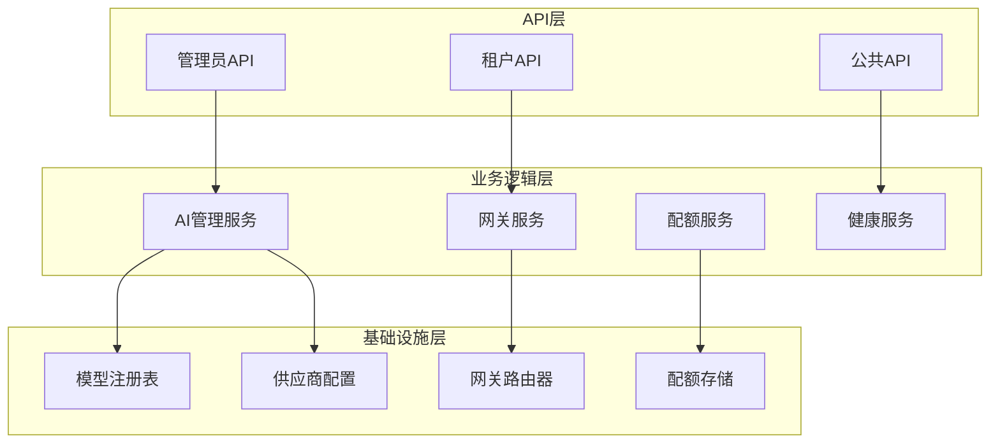
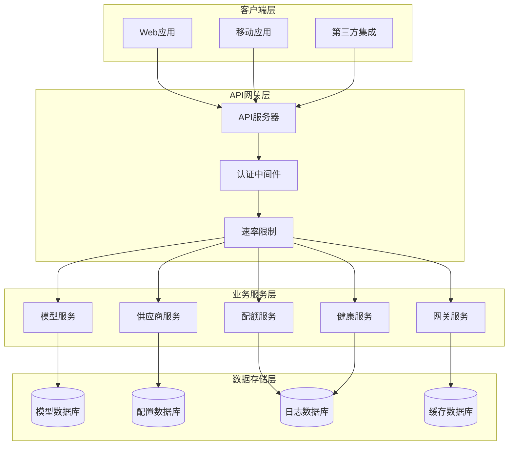
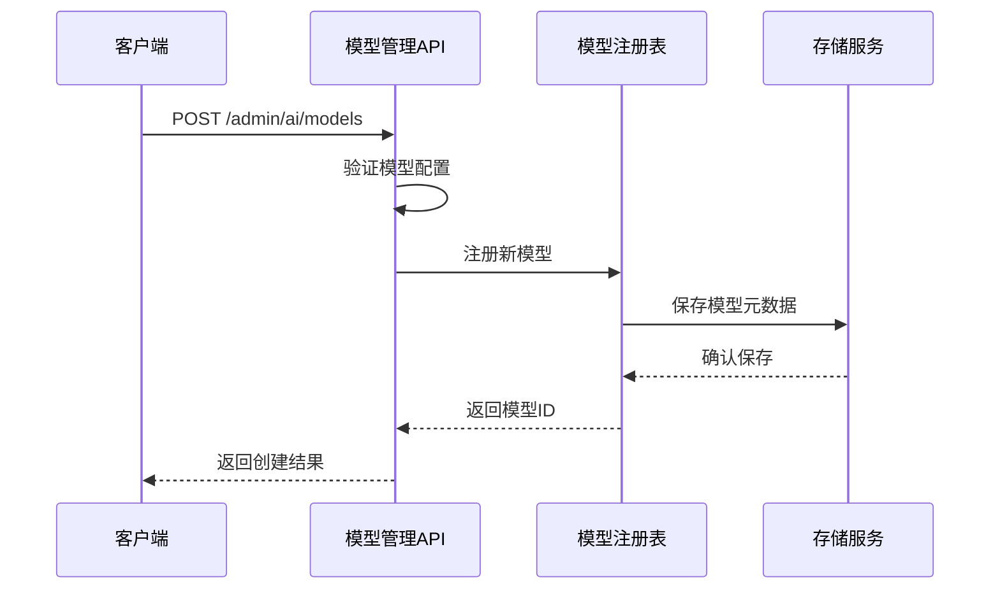
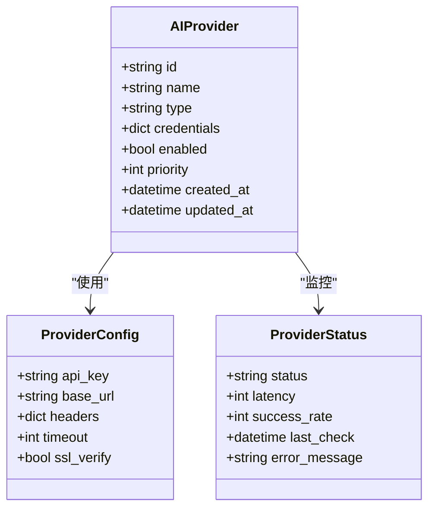
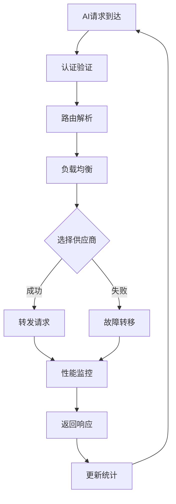
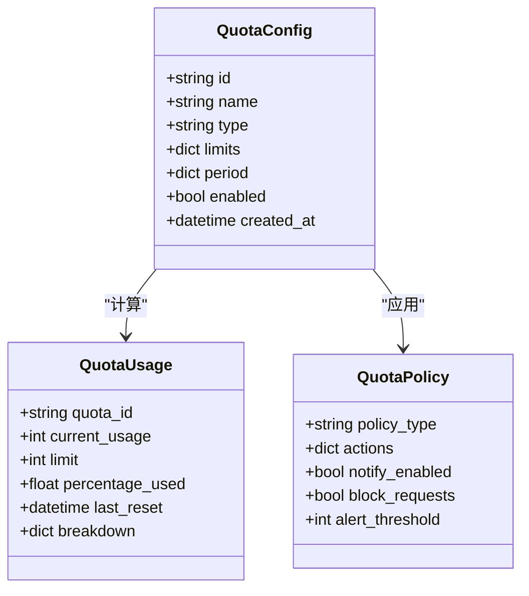
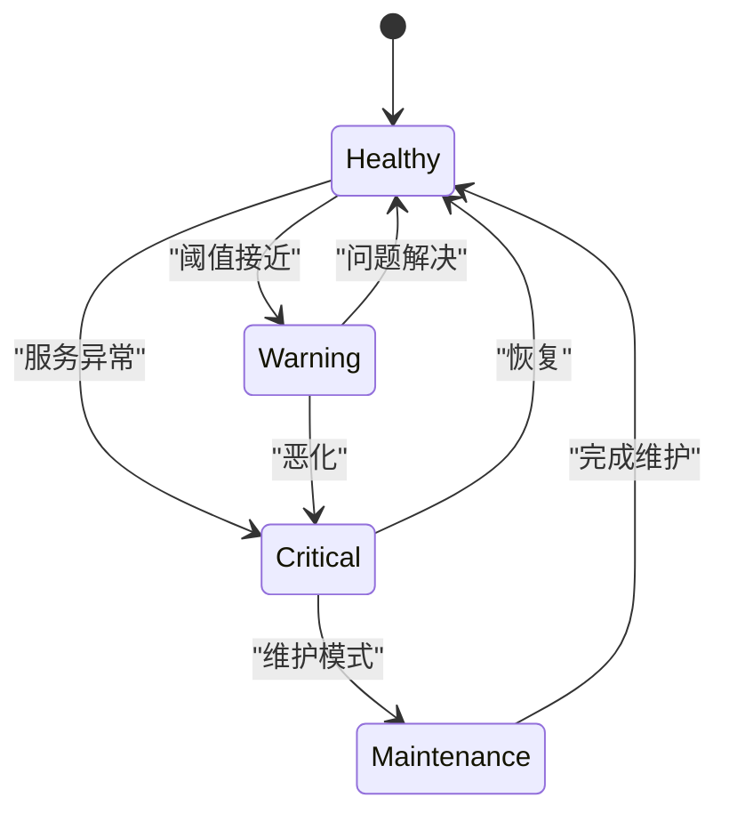
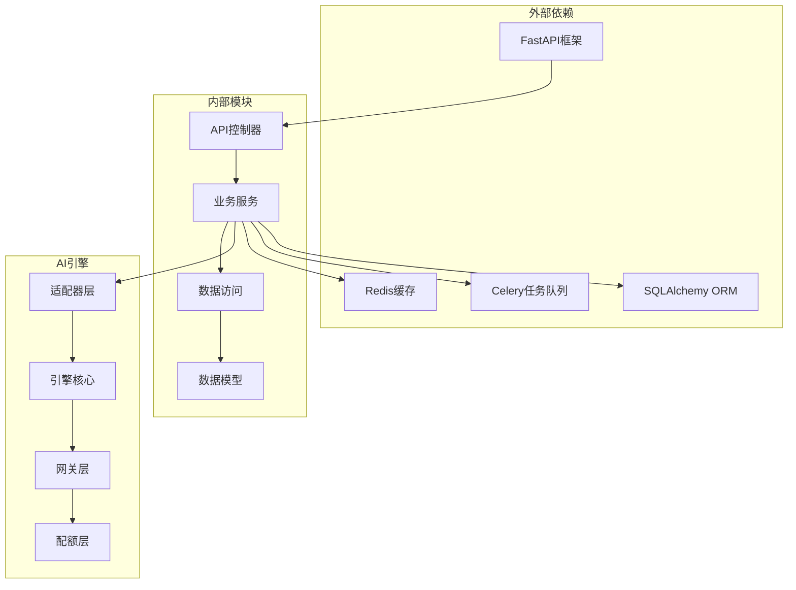

# AI系统管理API

<cite>
**本文档引用的文件**
- [ai_models.py](file://backend/app/api/admin/ai_models.py)
- [ai_providers.py](file://backend/app/api/admin/ai_providers.py)
- [ai_gateway.py](file://backend/app/api/admin/ai_gateway.py)
- [ai_quotas.py](file://backend/app/api/admin/ai_quotas.py)
- [ai_health.py](file://backend/app/api/admin/ai_health.py)
- [ai_api_keys.py](file://backend/app/api/admin/ai_api_keys.py)
- [ai_usage.py](file://backend/app/api/admin/ai_usage.py)
- [gateway.py](file://backend/app/ai/gateway.py)
- [quota_manager.py](file://backend/app/ai/quota_manager.py)
- [quota_models.py](file://backend/app/ai/quota_models.py)
- [quota_usage_tracker.py](file://backend/app/ai/quota_usage_tracker.py)
- [agent_quota_manager.py](file://backend/app/ai/agent_quota_manager.py)
- [failover.py](file://backend/app/ai/failover.py)
- [internal_ai_service.py](file://backend/app/ai/internal_ai_service.py)
- [ai_call_logs.py](file://backend/app/api/admin/ai_call_logs.py)
- [ai_runtime.py](file://backend/app/api/admin/ai_runtime.py)
</cite>

## 目录
1. [简介](#简介)
2. [项目结构](#项目结构)
3. [核心组件](#核心组件)
4. [架构概览](#架构概览)
5. [详细组件分析](#详细组件分析)
6. [依赖关系分析](#依赖关系分析)
7. [性能考虑](#性能考虑)
8. [故障排除指南](#故障排除指南)
9. [结论](#结论)

## 简介

AI系统管理API是一个完整的AI服务管理平台，提供了从模型管理到供应商配置、从网关设置到配额管理的全方位API接口。该系统支持多供应商AI模型接入、动态路由、智能故障转移、配额控制和健康监控等功能，为企业级AI应用提供可靠的服务管理能力。

系统采用模块化设计，通过RESTful API提供统一的管理接口，支持实时监控、性能分析和容量规划，确保AI服务的稳定运行和高效利用。

## 项目结构

AI系统管理API基于分层架构设计，主要分为以下几个层次：

**图表来源**
- [ai_models.py](file://backend/app/api/admin/ai_models.py)
- [ai_providers.py](file://backend/app/api/admin/ai_providers.py)
- [ai_gateway.py](file://backend/app/api/admin/ai_gateway.py)

**章节来源**
- [ai_models.py](file://backend/app/api/admin/ai_models.py)
- [ai_providers.py](file://backend/app/api/admin/ai_providers.py)
- [ai_gateway.py](file://backend/app/api/admin/ai_gateway.py)

## 核心组件

### 模型管理组件
负责AI模型的全生命周期管理，包括模型注册、配置、版本管理和状态控制。

### 供应商管理组件
管理AI服务供应商的接入和配置，支持多供应商动态切换和负载均衡。

### 网关管理组件
提供统一的AI服务访问入口，实现请求路由、协议转换和流量控制。

### 配额管理组件
实现精细化的使用配额控制，包括请求频率限制、资源消耗监控和超限处理。

### 健康监控组件
提供系统健康状态监控、性能指标收集和故障预警功能。

**章节来源**
- [ai_models.py](file://backend/app/api/admin/ai_models.py)
- [ai_providers.py](file://backend/app/api/admin/ai_providers.py)
- [ai_gateway.py](file://backend/app/api/admin/ai_gateway.py)
- [ai_quotas.py](file://backend/app/api/admin/ai_quotas.py)
- [ai_health.py](file://backend/app/api/admin/ai_health.py)

## 架构概览

AI系统采用微服务架构，通过API网关统一对外提供服务：

**图表来源**
- [gateway.py](file://backend/app/ai/gateway.py)
- [internal_ai_service.py](file://backend/app/ai/internal_ai_service.py)

## 详细组件分析

### 模型管理API

模型管理API提供完整的AI模型生命周期管理功能：

#### 主要功能
- 模型注册与发现
- 模型配置管理
- 版本控制与回滚
- 模型状态监控
- 性能指标统计

#### 核心接口
- GET `/admin/ai/models` - 获取模型列表
- POST `/admin/ai/models` - 创建新模型
- GET `/admin/ai/models/{model_id}` - 获取模型详情
- PUT `/admin/ai/models/{model_id}` - 更新模型配置
- DELETE `/admin/ai/models/{model_id}` - 删除模型
- POST `/admin/ai/models/{model_id}/versions` - 创建模型版本

**图表来源**
- [ai_models.py](file://backend/app/api/admin/ai_models.py)

**章节来源**
- [ai_models.py](file://backend/app/api/admin/ai_models.py)

### 供应商管理API

供应商管理API负责AI服务供应商的接入和配置：

#### 主要功能
- 供应商接入配置
- 认证信息管理
- 服务可用性检测
- 动态供应商切换
- 成本优化策略

#### 核心接口
- GET `/admin/ai/providers` - 获取供应商列表
- POST `/admin/ai/providers` - 添加新供应商
- GET `/admin/ai/providers/{provider_id}` - 获取供应商详情
- PUT `/admin/ai/providers/{provider_id}` - 更新供应商配置
- DELETE `/admin/ai/providers/{provider_id}` - 移除供应商
- POST `/admin/ai/providers/{provider_id}/test` - 测试供应商连接

**图表来源**
- [ai_providers.py](file://backend/app/api/admin/ai_providers.py)

**章节来源**
- [ai_providers.py](file://backend/app/api/admin/ai_providers.py)

### 网关管理API

网关管理API提供统一的AI服务访问入口：

#### 主要功能
- 请求路由配置
- 协议转换支持
- 流量控制策略
- 故障转移机制
- 实时监控告警

#### 核心接口
- GET `/admin/ai/gateway` - 获取网关配置
- PUT `/admin/ai/gateway` - 更新网关设置
- GET `/admin/ai/gateway/routes` - 获取路由规则
- POST `/admin/ai/gateway/routes` - 添加路由规则
- GET `/admin/ai/gateway/stats` - 获取网关统计
- POST `/admin/ai/gateway/failover` - 触发故障转移

**图表来源**
- [gateway.py](file://backend/app/ai/gateway.py)
- [failover.py](file://backend/app/ai/failover.py)

**章节来源**
- [ai_gateway.py](file://backend/app/api/admin/ai_gateway.py)
- [gateway.py](file://backend/app/ai/gateway.py)
- [failover.py](file://backend/app/ai/failover.py)

### 配额管理API

配额管理API实现精细化的使用控制：

#### 主要功能
- 配额策略配置
- 使用量实时跟踪
- 超限自动处理
- 成本控制优化
- 报表统计分析

#### 核心接口
- GET `/admin/ai/quotas` - 获取配额配置
- POST `/admin/ai/quotas` - 创建配额策略
- GET `/admin/ai/quotas/{quota_id}` - 获取配额详情
- PUT `/admin/ai/quotas/{quota_id}` - 更新配额设置
- GET `/admin/ai/quotas/{quota_id}/usage` - 获取使用情况
- POST `/admin/ai/quotas/{quota_id}/reset` - 重置配额

**图表来源**
- [quota_manager.py](file://backend/app/ai/quota_manager.py)
- [quota_models.py](file://backend/app/ai/quota_models.py)
- [quota_usage_tracker.py](file://backend/app/ai/quota_usage_tracker.py)

**章节来源**
- [ai_quotas.py](file://backend/app/api/admin/ai_quotas.py)
- [quota_manager.py](file://backend/app/ai/quota_manager.py)
- [quota_models.py](file://backend/app/ai/quota_models.py)

### 健康监控API

健康监控API提供系统状态的全面监控：

#### 主要功能
- 系统健康检查
- 性能指标收集
- 故障预警通知
- 运行状态报告
- 容量规划建议

#### 核心接口
- GET `/admin/ai/health` - 获取系统健康状态
- GET `/admin/ai/health/checks` - 执行健康检查
- GET `/admin/ai/health/metrics` - 获取性能指标
- GET `/admin/ai/health/logs` - 获取健康日志
- POST `/admin/ai/health/alerts` - 发送告警通知

**图表来源**
- [ai_health.py](file://backend/app/api/admin/ai_health.py)

**章节来源**
- [ai_health.py](file://backend/app/api/admin/ai_health.py)

### API密钥管理API

API密钥管理API提供安全的身份验证和授权：

#### 主要功能
- 密钥生成与分发
- 权限范围控制
- 使用审计追踪
- 安全策略管理
- 失效处理机制

#### 核心接口
- GET `/admin/ai/api-keys` - 获取密钥列表
- POST `/admin/ai/api-keys` - 创建新密钥
- GET `/admin/ai/api-keys/{key_id}` - 获取密钥详情
- PUT `/admin/ai/api-keys/{key_id}` - 更新密钥权限
- DELETE `/admin/ai/api-keys/{key_id}` - 禁用密钥
- POST `/admin/ai/api-keys/{key_id}/rotate` - 旋转密钥

**章节来源**
- [ai_api_keys.py](file://backend/app/api/admin/ai_api_keys.py)

### 使用统计API

使用统计API提供详细的使用情况分析：

#### 主要功能
- 使用量统计分析
- 成本计算与分摊
- 性能趋势分析
- 用户行为分析
- 报表生成导出

#### 核心接口
- GET `/admin/ai/usage` - 获取使用统计
- GET `/admin/ai/usage/trends` - 获取趋势分析
- GET `/admin/ai/usage/costs` - 获取成本分析
- GET `/admin/ai/usage/export` - 导出统计数据
- POST `/admin/ai/usage/reports` - 生成使用报表

**章节来源**
- [ai_usage.py](file://backend/app/api/admin/ai_usage.py)

## 依赖关系分析

AI系统管理API的依赖关系呈现清晰的分层结构：

**图表来源**
- [internal_ai_service.py](file://backend/app/ai/internal_ai_service.py)
- [gateway.py](file://backend/app/ai/gateway.py)

**章节来源**
- [internal_ai_service.py](file://backend/app/ai/internal_ai_service.py)
- [gateway.py](file://backend/app/ai/gateway.py)

## 性能考虑

### 缓存策略
系统采用多层缓存机制：
- Redis缓存热点数据
- 内存缓存频繁访问的配置
- CDN缓存静态资源

### 异步处理
- 使用Celery处理耗时任务
- 异步日志记录
- 后台统计分析

### 连接池管理
- 数据库连接池优化
- HTTP客户端连接复用
- 供应商API连接池

## 故障排除指南

### 常见问题诊断

#### 模型无法加载
1. 检查模型文件完整性
2. 验证供应商连接状态
3. 查看模型注册表错误日志

#### 供应商连接失败
1. 验证API密钥有效性
2. 检查网络连通性
3. 确认供应商服务状态

#### 配额超限
1. 检查当前使用量
2. 验证配额配置
3. 查看超限处理策略

**章节来源**
- [ai_health.py](file://backend/app/api/admin/ai_health.py)
- [ai_call_logs.py](file://backend/app/api/admin/ai_call_logs.py)

### 日志分析
系统提供详细的日志记录用于故障诊断：
- 请求响应日志
- 错误堆栈跟踪
- 性能指标监控
- 安全事件记录

## 结论

AI系统管理API提供了一个完整的企业级AI服务管理解决方案。通过模块化的架构设计和丰富的API接口，系统能够满足各种AI应用场景的需求。其特点包括：

1. **全面的功能覆盖**：从模型管理到供应商配置，从网关设置到配额管理
2. **高可用性设计**：支持故障转移和负载均衡
3. **精细化控制**：提供配额管理和成本控制
4. **完善的监控**：实时健康监控和性能分析
5. **安全可靠**：API密钥管理和审计追踪

该系统为企业部署和运营AI服务提供了坚实的技术基础，支持业务的快速发展和扩展需求。