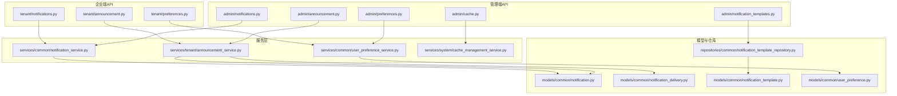
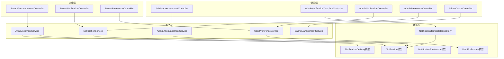
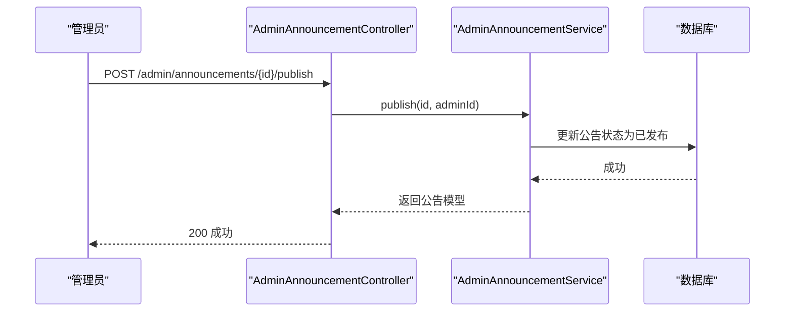
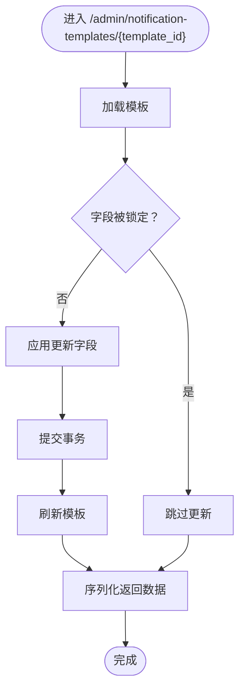
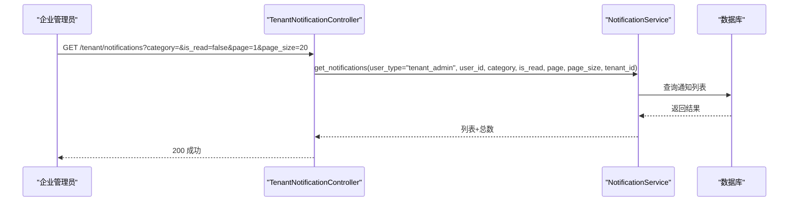
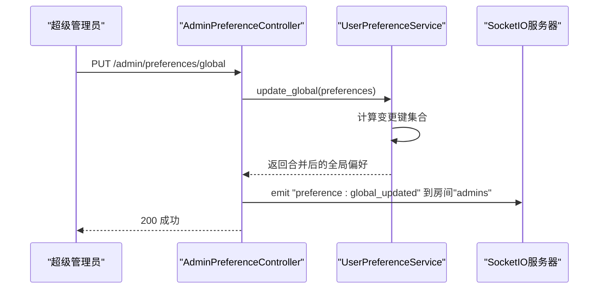
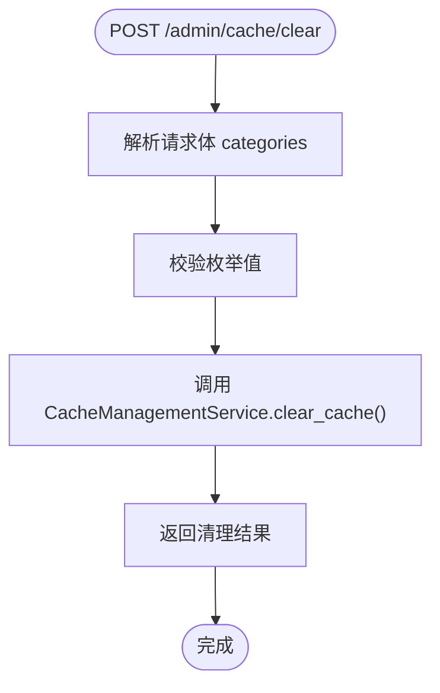
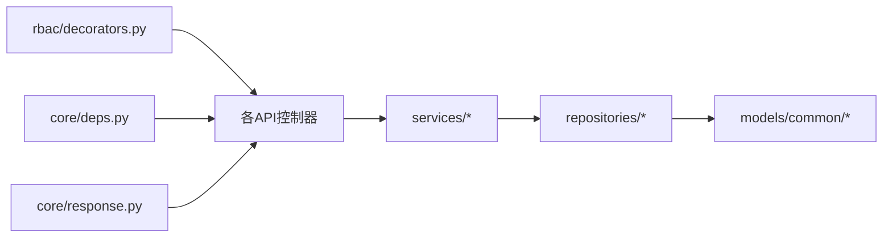
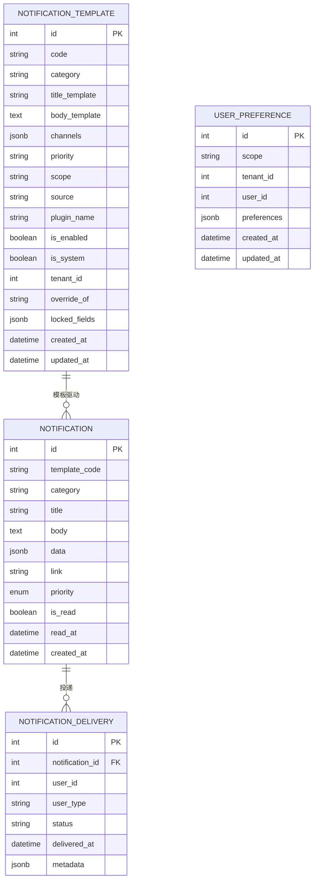

# 内容与运营API

<cite>
**本文档引用的文件**
- [backend/app/api/admin/announcement.py](file://backend/app/api/admin/announcement.py)
- [backend/app/api/tenant/announcement.py](file://backend/app/api/tenant/announcement.py)
- [backend/app/api/admin/notification_templates.py](file://backend/app/api/admin/notification_templates.py)
- [backend/app/api/admin/notifications.py](file://backend/app/api/admin/notifications.py)
- [backend/app/api/tenant/notifications.py](file://backend/app/api/tenant/notifications.py)
- [backend/app/api/admin/preferences.py](file://backend/app/api/admin/preferences.py)
- [backend/app/api/tenant/preferences.py](file://backend/app/api/tenant/preferences.py)
- [backend/app/api/admin/cache.py](file://backend/app/api/admin/cache.py)
- [backend/app/services/tenant/announcement_service.py](file://backend/app/services/tenant/announcement_service.py)
- [backend/app/services/common/notification_service.py](file://backend/app/services/common/notification_service.py)
- [backend/app/services/common/notification_preference_service.py](file://backend/app/services/common/notification_preference_service.py)
- [backend/app/services/common/user_preference_service.py](file://backend/app/services/common/user_preference_service.py)
- [backend/app/services/system/cache_management_service.py](file://backend/app/services/system/cache_management_service.py)
- [backend/app/repositories/common/notification_template_repository.py](file://backend/app/repositories/common/notification_template_repository.py)
- [backend/app/models/common/notification.py](file://backend/app/models/common/notification.py)
- [backend/app/models/common/notification_delivery.py](file://backend/app/models/common/notification_delivery.py)
- [backend/app/models/common/notification_preference.py](file://backend/app/models/common/notification_preference.py)
- [backend/app/models/common/notification_template.py](file://backend/app/models/common/notification_template.py)
- [backend/app/models/common/user_preference.py](file://backend/app/models/common/user_preference.py)
- [backend/app/schemas/system/cache.py](file://backend/app/schemas/system/cache.py)
- [backend/app/enums/cache.py](file://backend/app/enums/cache.py)
- [backend/app/enums/rbac.py](file://backend/app/enums/rbac.py)
- [backend/app/core/deps.py](file://backend/app/core/deps.py)
- [backend/app/core/response.py](file://backend/app/core/response.py)
- [backend/app/rbac/decorators.py](file://backend/app/rbac/decorators.py)
- [backend/migrations/versions/20260221_6b4fe69b2efc_add_notification_tables.py](file://backend/migrations/versions/20260221_6b4fe69b2efc_add_notification_tables.py)
- [backend/migrations/versions/20260314_0927_add_user_preferences_table.py](file://backend/migrations/versions/20260314_0927_add_user_preferences_table.py)
- [backend/migrations/versions/20260314_0949_notification_pref_add_global_layer.py](file://backend/migrations/versions/20260314_0949_notification_pref_add_global_layer.py)
</cite>

## 目录
1. [简介](#简介)
2. [项目结构](#项目结构)
3. [核心组件](#核心组件)
4. [架构总览](#架构总览)
5. [详细组件分析](#详细组件分析)
6. [依赖关系分析](#依赖关系分析)
7. [性能考量](#性能考量)
8. [故障排查指南](#故障排查指南)
9. [结论](#结论)
10. [附录](#附录)

## 简介
本文件为内容与运营API的权威技术文档，覆盖公告发布、通知模板管理、消息推送、用户偏好设置、缓存管理等能力，并对内容创作、多渠道分发、个性化推送、A/B测试、效果追踪等运营功能进行接口化说明。文档同时提供用户触达策略、内容审核流程、推送时机优化、用户反馈收集的管理接口，以及运营活动策划、用户画像分析和转化率优化的API说明。

## 项目结构
后端采用模块化分层设计，运营相关能力主要分布在以下目录：
- 管理端API：admin/ 下的公告、通知模板、通知、偏好、缓存等控制器
- 企业端API：tenant/ 下的公告、通知、偏好等控制器
- 服务层：services/ 下的业务服务，如公告服务、通知服务、偏好服务、缓存管理服务
- 模型与仓库：models/、repositories/ 下的数据模型与仓储实现
- 响应与依赖：core/response.py、core/deps.py 提供统一响应与依赖注入
- 权限与菜单：rbac/decorators.py 提供权限装饰器与菜单配置

图表来源
- [backend/app/api/admin/announcement.py:1-263](file://backend/app/api/admin/announcement.py#L1-L263)
- [backend/app/api/tenant/announcement.py:1-263](file://backend/app/api/tenant/announcement.py#L1-L263)
- [backend/app/api/admin/notification_templates.py:1-328](file://backend/app/api/admin/notification_templates.py#L1-L328)
- [backend/app/api/admin/notifications.py:1-137](file://backend/app/api/admin/notifications.py#L1-L137)
- [backend/app/api/tenant/notifications.py:1-148](file://backend/app/api/tenant/notifications.py#L1-L148)
- [backend/app/api/admin/preferences.py:1-142](file://backend/app/api/admin/preferences.py#L1-L142)
- [backend/app/api/tenant/preferences.py:1-154](file://backend/app/api/tenant/preferences.py#L1-L154)
- [backend/app/api/admin/cache.py:1-93](file://backend/app/api/admin/cache.py#L1-L93)
- [backend/app/services/tenant/announcement_service.py](file://backend/app/services/tenant/announcement_service.py)
- [backend/app/services/common/notification_service.py](file://backend/app/services/common/notification_service.py)
- [backend/app/services/common/user_preference_service.py](file://backend/app/services/common/user_preference_service.py)
- [backend/app/services/system/cache_management_service.py](file://backend/app/services/system/cache_management_service.py)
- [backend/app/repositories/common/notification_template_repository.py](file://backend/app/repositories/common/notification_template_repository.py)
- [backend/app/models/common/notification.py](file://backend/app/models/common/notification.py)
- [backend/app/models/common/notification_delivery.py](file://backend/app/models/common/notification_delivery.py)
- [backend/app/models/common/notification_template.py](file://backend/app/models/common/notification_template.py)
- [backend/app/models/common/user_preference.py](file://backend/app/models/common/user_preference.py)

章节来源
- [backend/app/api/admin/announcement.py:1-263](file://backend/app/api/admin/announcement.py#L1-L263)
- [backend/app/api/tenant/announcement.py:1-263](file://backend/app/api/tenant/announcement.py#L1-L263)
- [backend/app/api/admin/notification_templates.py:1-328](file://backend/app/api/admin/notification_templates.py#L1-L328)
- [backend/app/api/admin/notifications.py:1-137](file://backend/app/api/admin/notifications.py#L1-L137)
- [backend/app/api/tenant/notifications.py:1-148](file://backend/app/api/tenant/notifications.py#L1-L148)
- [backend/app/api/admin/preferences.py:1-142](file://backend/app/api/admin/preferences.py#L1-L142)
- [backend/app/api/tenant/preferences.py:1-154](file://backend/app/api/tenant/preferences.py#L1-L154)
- [backend/app/api/admin/cache.py:1-93](file://backend/app/api/admin/cache.py#L1-L93)

## 核心组件
- 公告管理：支持公告创建、查询、发布、反馈收集与阅读标记；管理端与企业端分别提供独立控制器，具备权限与租户隔离。
- 通知模板管理：支持模板列表、更新、生效预览、恢复默认、测试发送等；支持系统内置模板与租户覆盖。
- 消息推送：提供通知列表、未读计数、已读、全部已读、删除等管理接口；支持按分类与已读状态过滤。
- 用户偏好设置：支持平台全局偏好与个人覆盖、企业全局偏好与个人覆盖；变更会通过SocketIO广播影响在线客户端。
- 缓存管理：提供缓存统计与清理接口，支持按分类批量清理。

章节来源
- [backend/app/api/admin/announcement.py:36-263](file://backend/app/api/admin/announcement.py#L36-L263)
- [backend/app/api/tenant/announcement.py:36-263](file://backend/app/api/tenant/announcement.py#L36-L263)
- [backend/app/api/admin/notification_templates.py:43-328](file://backend/app/api/admin/notification_templates.py#L43-L328)
- [backend/app/api/admin/notifications.py:17-137](file://backend/app/api/admin/notifications.py#L17-L137)
- [backend/app/api/tenant/notifications.py:19-148](file://backend/app/api/tenant/notifications.py#L19-L148)
- [backend/app/api/admin/preferences.py:27-142](file://backend/app/api/admin/preferences.py#L27-L142)
- [backend/app/api/tenant/preferences.py:26-154](file://backend/app/api/tenant/preferences.py#L26-L154)
- [backend/app/api/admin/cache.py:31-93](file://backend/app/api/admin/cache.py#L31-L93)

## 架构总览
下图展示管理端与企业端在“公告—通知—偏好—缓存”方面的调用关系与职责边界：

图表来源
- [backend/app/api/admin/announcement.py:49-263](file://backend/app/api/admin/announcement.py#L49-L263)
- [backend/app/api/tenant/announcement.py:49-263](file://backend/app/api/tenant/announcement.py#L49-L263)
- [backend/app/api/admin/notification_templates.py:56-328](file://backend/app/api/admin/notification_templates.py#L56-L328)
- [backend/app/api/admin/notifications.py:17-137](file://backend/app/api/admin/notifications.py#L17-L137)
- [backend/app/api/tenant/notifications.py:19-148](file://backend/app/api/tenant/notifications.py#L19-L148)
- [backend/app/api/admin/preferences.py:27-142](file://backend/app/api/admin/preferences.py#L27-L142)
- [backend/app/api/tenant/preferences.py:26-154](file://backend/app/api/tenant/preferences.py#L26-L154)
- [backend/app/api/admin/cache.py:31-93](file://backend/app/api/admin/cache.py#L31-L93)
- [backend/app/services/tenant/announcement_service.py](file://backend/app/services/tenant/announcement_service.py)
- [backend/app/services/common/notification_service.py](file://backend/app/services/common/notification_service.py)
- [backend/app/services/common/user_preference_service.py](file://backend/app/services/common/user_preference_service.py)
- [backend/app/services/system/cache_management_service.py](file://backend/app/services/system/cache_management_service.py)
- [backend/app/repositories/common/notification_template_repository.py](file://backend/app/repositories/common/notification_template_repository.py)
- [backend/app/models/common/notification.py](file://backend/app/models/common/notification.py)
- [backend/app/models/common/notification_delivery.py](file://backend/app/models/common/notification_delivery.py)
- [backend/app/models/common/notification_template.py](file://backend/app/models/common/notification_template.py)
- [backend/app/models/common/user_preference.py](file://backend/app/models/common/user_preference.py)

## 详细组件分析

### 公告管理API
- 管理端公告管理（AdminAnnouncementController）
  - 路由前缀：/admin/announcements
  - 支持：待阅列表、我的公告、选择项、列表、详情、创建、更新、删除、发布、反馈列表、提交反馈、标记已读
  - 关键权限：resource=announcement，菜单配置于系统管理
  - 数据模型：Announcement、AnnouncementDelivery
- 企业端公告管理（TenantAnnouncementController）
  - 路由前缀：/tenant/announcements
  - 租户隔离：基于ActiveTenantAdmin.tenant_id
  - 功能与管理端一致，但作用域限定在当前租户

图表来源
- [backend/app/api/admin/announcement.py:189-204](file://backend/app/api/admin/announcement.py#L189-L204)
- [backend/app/services/tenant/announcement_service.py](file://backend/app/services/tenant/announcement_service.py)

章节来源
- [backend/app/api/admin/announcement.py:36-263](file://backend/app/api/admin/announcement.py#L36-L263)
- [backend/app/api/tenant/announcement.py:36-263](file://backend/app/api/tenant/announcement.py#L36-L263)

### 通知模板管理API
- 控制器：AdminNotificationTemplateController
  - 路由前缀：/admin/notification-templates
  - 支持：模板列表、更新（可更新channels/priority/title/body/is_enabled）、生效预览、恢复默认、测试发送
  - 仓库：NotificationTemplateRepository，支持解析生效模板与租户名称映射
  - 关键权限：resource=notification_template，菜单配置于系统配置

图表来源
- [backend/app/api/admin/notification_templates.py:154-196](file://backend/app/api/admin/notification_templates.py#L154-L196)
- [backend/app/repositories/common/notification_template_repository.py](file://backend/app/repositories/common/notification_template_repository.py)

章节来源
- [backend/app/api/admin/notification_templates.py:43-328](file://backend/app/api/admin/notification_templates.py#L43-L328)

### 消息推送与通知管理API
- 管理端通知（AdminNotificationController）
  - 路由前缀：/admin/notifications
  - 支持：列表（按category、is_read过滤）、未读计数、标记已读、全部已读、删除
- 企业端通知（TenantNotificationController）
  - 路由前缀：/tenant/notifications
  - 严格租户隔离：仅能查看本企业通知
- 服务：NotificationService
  - 统一处理通知的查询、标记已读、批量已读、删除与测试发送

图表来源
- [backend/app/api/tenant/notifications.py:22-73](file://backend/app/api/tenant/notifications.py#L22-L73)
- [backend/app/services/common/notification_service.py](file://backend/app/services/common/notification_service.py)

章节来源
- [backend/app/api/admin/notifications.py:17-137](file://backend/app/api/admin/notifications.py#L17-L137)
- [backend/app/api/tenant/notifications.py:19-148](file://backend/app/api/tenant/notifications.py#L19-L148)

### 用户偏好设置API
- 管理端偏好（AdminPreferenceController）
  - 路由前缀：/admin/preferences
  - 支持：获取平台全局偏好、更新平台全局偏好、获取/更新/重置个人偏好、获取系统默认
  - 变更广播：通过SocketIO向管理员房间广播“preference:global_updated”
- 企业端偏好（TenantPreferenceController）
  - 路由前缀：/tenant/preferences
  - 支持：获取企业全局偏好、更新企业全局偏好、获取/更新/重置个人偏好、获取系统默认
  - 变更广播：通过SocketIO向租户房间广播“preference:global_updated”

图表来源
- [backend/app/api/admin/preferences.py:53-81](file://backend/app/api/admin/preferences.py#L53-L81)
- [backend/app/services/common/user_preference_service.py](file://backend/app/services/common/user_preference_service.py)

章节来源
- [backend/app/api/admin/preferences.py:27-142](file://backend/app/api/admin/preferences.py#L27-L142)
- [backend/app/api/tenant/preferences.py:26-154](file://backend/app/api/tenant/preferences.py#L26-L154)

### 缓存管理API
- 控制器：AdminCacheController
  - 路由前缀：/admin/cache
  - 支持：获取缓存统计、按分类清理缓存
  - 枚举：CacheCategoryEnum
  - 请求体：CacheClearRequest

图表来源
- [backend/app/api/admin/cache.py:64-87](file://backend/app/api/admin/cache.py#L64-L87)
- [backend/app/services/system/cache_management_service.py](file://backend/app/services/system/cache_management_service.py)
- [backend/app/schemas/system/cache.py](file://backend/app/schemas/system/cache.py)
- [backend/app/enums/cache.py](file://backend/app/enums/cache.py)

章节来源
- [backend/app/api/admin/cache.py:31-93](file://backend/app/api/admin/cache.py#L31-L93)

## 依赖关系分析
- 权限与菜单：各控制器通过permission_resource装饰器声明资源与菜单配置，配合rbac.decorators中的auth_only、action_*等装饰器进行权限控制。
- 依赖注入：core/deps提供DbSession、ActiveAdmin、ActiveTenantAdmin、SuperAdmin、TenantOwner等依赖。
- 统一响应：core/response提供success、paginated等统一响应封装。
- 数据模型：通知、公告投递、通知模板、用户偏好等模型位于models/common下，仓储位于repositories/common下。

图表来源
- [backend/app/rbac/decorators.py](file://backend/app/rbac/decorators.py)
- [backend/app/core/deps.py](file://backend/app/core/deps.py)
- [backend/app/core/response.py](file://backend/app/core/response.py)
- [backend/app/api/admin/announcement.py:14-22](file://backend/app/api/admin/announcement.py#L14-L22)
- [backend/app/api/admin/notification_templates.py:20-28](file://backend/app/api/admin/notification_templates.py#L20-L28)

章节来源
- [backend/app/rbac/decorators.py](file://backend/app/rbac/decorators.py)
- [backend/app/core/deps.py](file://backend/app/core/deps.py)
- [backend/app/core/response.py](file://backend/app/core/response.py)

## 性能考量
- 分页与筛选：通知列表与模板列表均支持分页参数，建议前端按需设置page_size上限，避免一次性拉取过多数据。
- 批量操作：通知“全部已读”与模板“测试发送”涉及批量处理，注意在高并发场景下的锁竞争与事务提交成本。
- 缓存清理：按分类清理缓存时，建议先调用“获取缓存统计”确认目标分类规模，避免误清造成抖动。
- 广播开销：全局偏好更新会触发SocketIO广播，建议控制变更频率与广播粒度，避免对在线客户端造成压力。

## 故障排查指南
- 通知未读计数不准确
  - 检查通知是否正确标记已读或全部已读
  - 确认is_read参数是否传入布尔字符串
- 通知模板更新无效
  - 检查模板是否被锁定字段限制
  - 确认更新字段是否在允许范围内
- 公告发布失败
  - 确认公告状态与权限
  - 检查公告是否存在且可发布
- 偏好更新未生效
  - 确认是否为个人覆盖或全局覆盖
  - 检查SocketIO连接与房间订阅
- 缓存清理无响应
  - 确认传入的分类代码是否有效
  - 检查缓存服务可用性

章节来源
- [backend/app/api/admin/notifications.py:34-38](file://backend/app/api/admin/notifications.py#L34-L38)
- [backend/app/api/admin/notification_templates.py:178-182](file://backend/app/api/admin/notification_templates.py#L178-L182)
- [backend/app/api/admin/announcement.py:189-204](file://backend/app/api/admin/announcement.py#L189-L204)
- [backend/app/api/admin/preferences.py:70-76](file://backend/app/api/admin/preferences.py#L70-L76)
- [backend/app/api/admin/cache.py:79-82](file://backend/app/api/admin/cache.py#L79-L82)

## 结论
本文档系统梳理了内容与运营API在公告、通知模板、消息推送、用户偏好、缓存管理等方面的接口能力与调用关系。通过清晰的权限控制、租户隔离与统一响应机制，确保运营功能在多角色、多租户场景下的稳定与可维护性。建议在实际集成中结合分页与筛选参数、合理使用广播与批量操作，并关注缓存清理与通知标记的性能影响。

## 附录

### 数据模型概览

图表来源
- [backend/app/models/common/notification.py](file://backend/app/models/common/notification.py)
- [backend/app/models/common/notification_delivery.py](file://backend/app/models/common/notification_delivery.py)
- [backend/app/models/common/notification_template.py](file://backend/app/models/common/notification_template.py)
- [backend/app/models/common/user_preference.py](file://backend/app/models/common/user_preference.py)

### 运维与迁移参考
- 通知表初始化迁移：添加通知相关表与索引
- 用户偏好表初始化迁移：添加用户偏好表
- 通知偏好新增全局层级迁移：支持全局与租户层级偏好

章节来源
- [backend/migrations/versions/20260221_6b4fe69b2efc_add_notification_tables.py](file://backend/migrations/versions/20260221_6b4fe69b2efc_add_notification_tables.py)
- [backend/migrations/versions/20260314_0927_add_user_preferences_table.py](file://backend/migrations/versions/20260314_0927_add_user_preferences_table.py)
- [backend/migrations/versions/20260314_0949_notification_pref_add_global_layer.py](file://backend/migrations/versions/20260314_0949_notification_pref_add_global_layer.py)