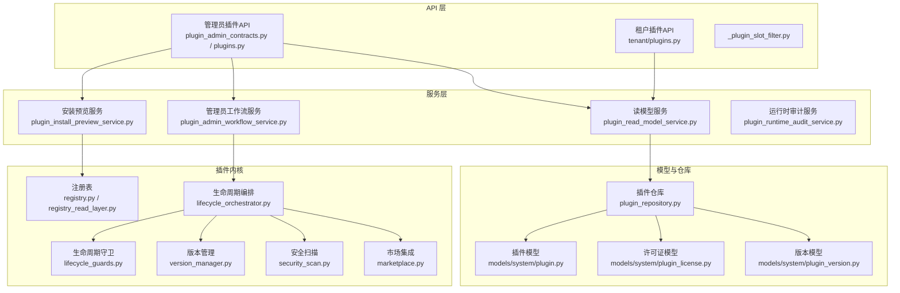
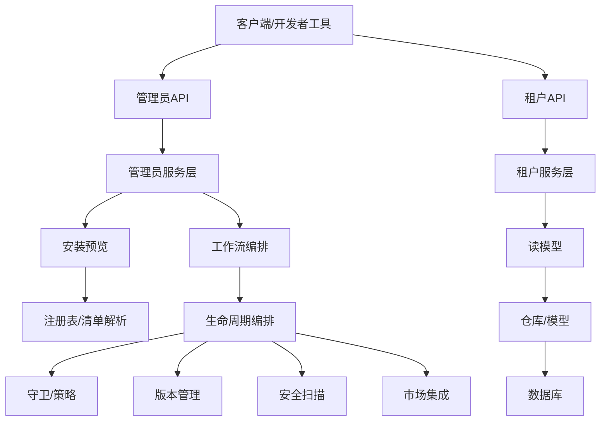
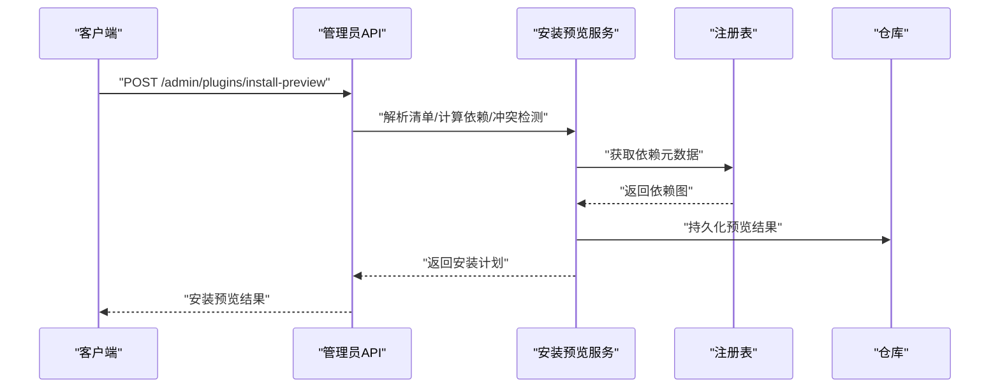
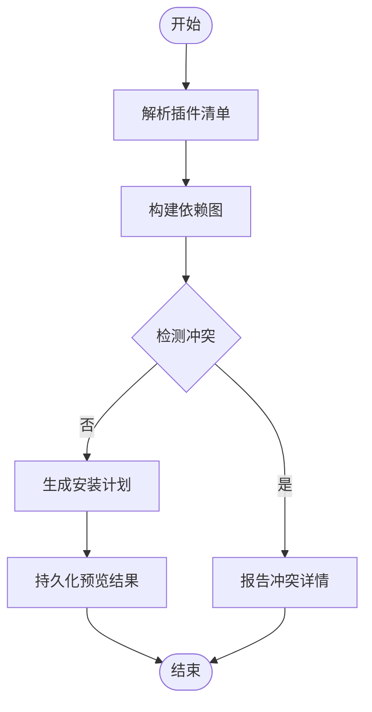
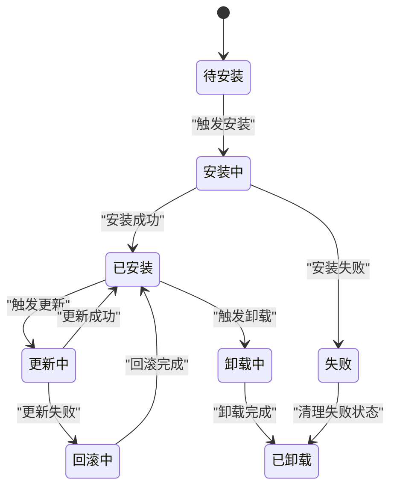
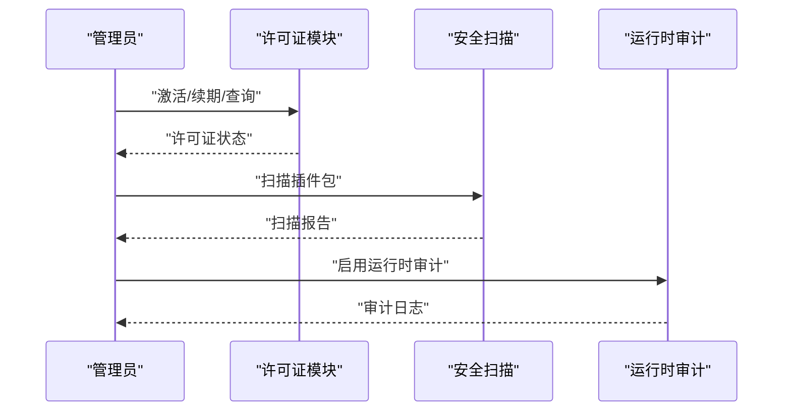
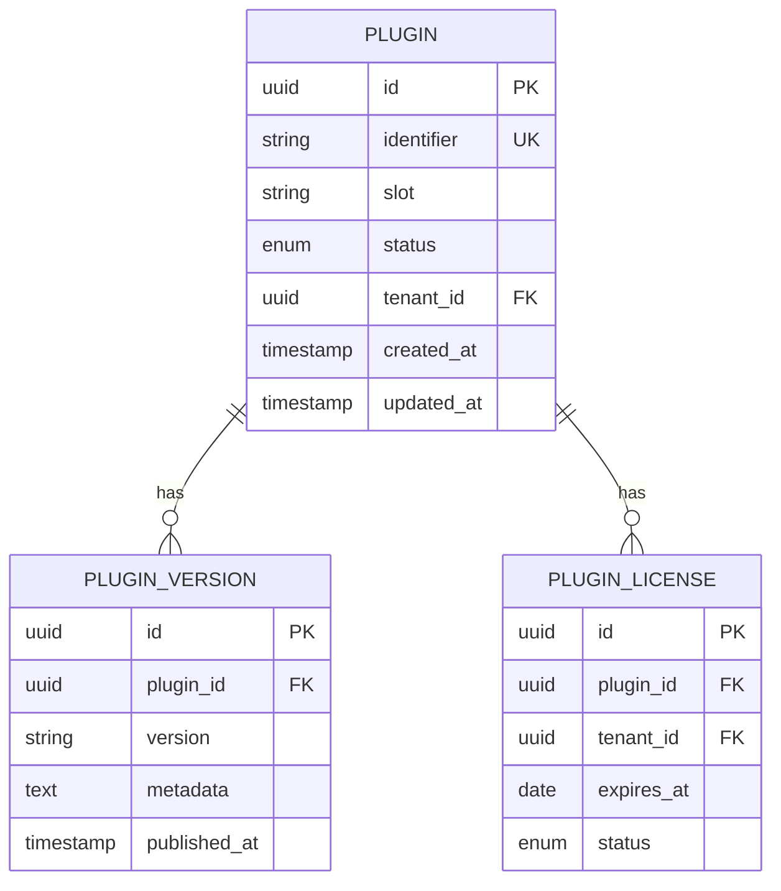
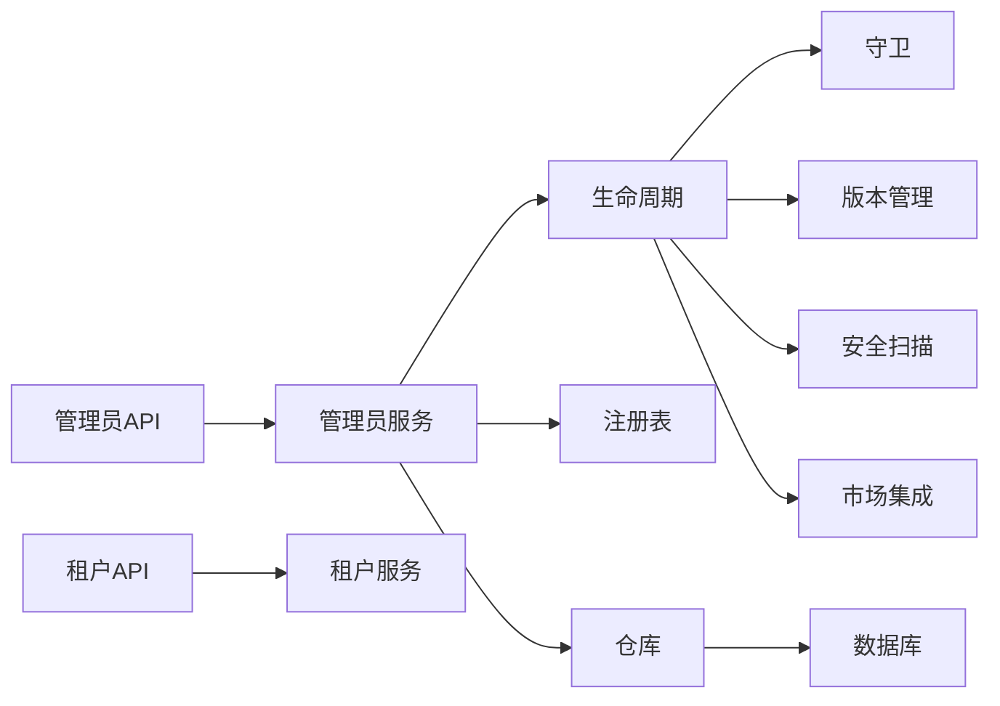

# 插件管理API

<cite>
**本文档引用的文件**
- [plugin_admin_contracts.py](file://backend/app/api/admin/plugin_admin_contracts.py)
- [plugin_install_preview.py](file://backend/app/api/admin/plugin_install_preview.py)
- [plugin_dependency_routes.py](file://backend/app/api/admin/plugin_dependency_routes.py)
- [plugins.py](file://backend/app/api/admin/plugins.py)
- [_plugin_slot_filter.py](file://backend/app/api/shared/_plugin_slot_filter.py)
- [plugins.py](file://backend/app/api/tenant/plugins.py)
- [plugin.py](file://backend/app/enums/plugin.py)
- [plugin.py](file://backend/app/models/system/plugin.py)
- [plugin_license.py](file://backend/app/models/system/plugin_license.py)
- [plugin_version.py](file://backend/app/models/system/plugin_version.py)
- [plugin_repository.py](file://backend/app/repositories/system/plugin_repository.py)
- [plugin_install_preview_service.py](file://backend/app/services/system/plugin_install_preview_service.py)
- [plugin_admin_workflow_service.py](file://backend/app/services/system/plugin_admin_workflow_service.py)
- [plugin_read_model_service.py](file://backend/app/services/system/plugin_read_model_service.py)
- [plugin_runtime_audit_service.py](file://backend/app/services/ai/plugin_runtime_audit.py)
- [marketplace.py](file://backend/app/plugins/marketplace.py)
- [marketplace.py](file://backend/app/configs/definitions/platform/marketplace.py)
- [license.py](file://backend/app/plugins/license.py)
- [security_scan.py](file://backend/app/plugins/security_scan.py)
- [package_security.py](file://backend/app/plugins/package_security.py)
- [version_manager.py](file://backend/app/plugins/version_manager.py)
- [lifecycle_orchestrator.py](file://backend/app/plugins/lifecycle_orchestrator.py)
- [lifecycle_installation.py](file://backend/app/plugins/lifecycle_installation.py)
- [lifecycle_guards.py](file://backend/app/plugins/lifecycle_guards.py)
- [lifecycle_dependency_runtime.py](file://backend/app/plugins/lifecycle_dependency_runtime.py)
- [scheduler_refresh.py](file://backend/app/plugins/scheduler_refresh.py)
- [startup.py](file://backend/app/plugins/startup.py)
- [runtime_recovery.py](file://backend/app/plugins/runtime_recovery.py)
- [webhook_dispatcher.py](file://backend/app/plugins/webhook_dispatcher.py)
- [event_bus.py](file://backend/app/plugins/event_bus.py)
- [progress.py](file://backend/app/plugins/progress.py)
- [preview.py](file://backend/app/plugins/preview.py)
- [manifest.py](file://backend/app/plugins/manifest.py)
- [manifest_helpers.py](file://backend/app/plugins/manifest_helpers.py)
- [registry.py](file://backend/app/plugins/registry.py)
- [registry_read_layer.py](file://backend/app/plugins/registry_read_layer.py)
- [marketplace_registry/registry.json](file://backend/app/plugins/marketplace_registry/registry.json)
- [test_admin_plugin_install_preview_routes_contract.py](file://backend/tests/test_admin_plugin_install_preview_routes_contract.py)
- [test_admin_plugin_dependency_contract.py](file://backend/tests/test_admin_plugin_dependency_contract.py)
- [test_admin_plugin_marketplace_contract.py](file://backend/tests/test_admin_plugin_marketplace_contract.py)
- [test_plugin_lifecycle_guards.py](file://backend/tests/test_plugin_lifecycle_guards.py)
- [test_plugin_package_security.py](file://backend/tests/test_plugin_package_security.py)
- [test_plugin_license_verification_policy.py](file://backend/tests/test_plugin_license_verification_policy.py)
</cite>

## 目录
1. [简介](#简介)
2. [项目结构](#项目结构)
3. [核心组件](#核心组件)
4. [架构总览](#架构总览)
5. [详细组件分析](#详细组件分析)
6. [依赖关系分析](#依赖关系分析)
7. [性能考虑](#性能考虑)
8. [故障排除指南](#故障排除指南)
9. [结论](#结论)
10. [附录](#附录)

## 简介
本文件为插件管理API的权威技术文档，覆盖插件生命周期管理（安装预览、依赖关系管理、安装/卸载、版本更新）、许可证管理、插件市场集成与安装流程验证、依赖冲突检测、批量安装与回滚机制、安全扫描与权限配置、运行时监控与性能分析，以及插件开发者发布流程、审核机制与用户反馈管理API说明。文档基于后端代码库中的插件子系统实现进行梳理，确保接口定义与实际功能一致。

## 项目结构
插件相关能力主要分布在以下模块：
- API层：管理员与租户侧插件路由与契约
- 服务层：安装预览、工作流、读模型、运行时审计等业务服务
- 插件内核：生命周期编排、依赖运行时、版本管理、安全扫描、市场集成等
- 模型与仓库：插件、许可证、版本数据模型及持久化
- 配置与测试：平台市场配置、单元与契约测试

**图表来源**
- [plugin_admin_contracts.py](file://backend/app/api/admin/plugin_admin_contracts.py)
- [plugins.py](file://backend/app/api/admin/plugins.py)
- [plugins.py](file://backend/app/api/tenant/plugins.py)
- [plugin_install_preview_service.py](file://backend/app/services/system/plugin_install_preview_service.py)
- [plugin_admin_workflow_service.py](file://backend/app/services/system/plugin_admin_workflow_service.py)
- [plugin_read_model_service.py](file://backend/app/services/system/plugin_read_model_service.py)
- [lifecycle_orchestrator.py](file://backend/app/plugins/lifecycle_orchestrator.py)
- [lifecycle_guards.py](file://backend/app/plugins/lifecycle_guards.py)
- [version_manager.py](file://backend/app/plugins/version_manager.py)
- [security_scan.py](file://backend/app/plugins/security_scan.py)
- [marketplace.py](file://backend/app/plugins/marketplace.py)
- [registry.py](file://backend/app/plugins/registry.py)
- [registry_read_layer.py](file://backend/app/plugins/registry_read_layer.py)
- [plugin.py](file://backend/app/models/system/plugin.py)
- [plugin_license.py](file://backend/app/models/system/plugin_license.py)
- [plugin_version.py](file://backend/app/models/system/plugin_version.py)
- [plugin_repository.py](file://backend/app/repositories/system/plugin_repository.py)

**章节来源**
- [plugin_admin_contracts.py](file://backend/app/api/admin/plugin_admin_contracts.py)
- [plugins.py](file://backend/app/api/admin/plugins.py)
- [plugins.py](file://backend/app/api/tenant/plugins.py)
- [plugin_install_preview_service.py](file://backend/app/services/system/plugin_install_preview_service.py)
- [plugin_admin_workflow_service.py](file://backend/app/services/system/plugin_admin_workflow_service.py)
- [plugin_read_model_service.py](file://backend/app/services/system/plugin_read_model_service.py)
- [lifecycle_orchestrator.py](file://backend/app/plugins/lifecycle_orchestrator.py)
- [lifecycle_guards.py](file://backend/app/plugins/lifecycle_guards.py)
- [version_manager.py](file://backend/app/plugins/version_manager.py)
- [security_scan.py](file://backend/app/plugins/security_scan.py)
- [marketplace.py](file://backend/app/plugins/marketplace.py)
- [registry.py](file://backend/app/plugins/registry.py)
- [registry_read_layer.py](file://backend/app/plugins/registry_read_layer.py)
- [plugin.py](file://backend/app/models/system/plugin.py)
- [plugin_license.py](file://backend/app/models/system/plugin_license.py)
- [plugin_version.py](file://backend/app/models/system/plugin_version.py)
- [plugin_repository.py](file://backend/app/repositories/system/plugin_repository.py)

## 核心组件
- 管理员插件API：提供插件安装预览、依赖关系查询、批量安装、工作流控制等管理能力
- 租户插件API：提供插件读取、状态查询、权限与作用域控制
- 安装预览服务：解析清单、计算依赖图、检测冲突并生成安装计划
- 生命周期编排：协调安装、迁移、更新、卸载与回滚
- 许可证与安全：许可证验证、包安全扫描、运行时审计
- 市场集成：插件市场元数据同步、安装源解析、刷新调度

**章节来源**
- [plugin_admin_contracts.py](file://backend/app/api/admin/plugin_admin_contracts.py)
- [plugin_install_preview_service.py](file://backend/app/services/system/plugin_install_preview_service.py)
- [lifecycle_orchestrator.py](file://backend/app/plugins/lifecycle_orchestrator.py)
- [license.py](file://backend/app/plugins/license.py)
- [security_scan.py](file://backend/app/plugins/security_scan.py)

## 架构总览
插件管理采用“API → 服务 → 内核”的分层设计，结合“读模型/写模型”分离与事件驱动机制，确保高可用与可观测性。

**图表来源**
- [plugins.py](file://backend/app/api/admin/plugins.py)
- [plugins.py](file://backend/app/api/tenant/plugins.py)
- [plugin_install_preview_service.py](file://backend/app/services/system/plugin_install_preview_service.py)
- [plugin_admin_workflow_service.py](file://backend/app/services/system/plugin_admin_workflow_service.py)
- [plugin_read_model_service.py](file://backend/app/services/system/plugin_read_model_service.py)
- [registry.py](file://backend/app/plugins/registry.py)
- [lifecycle_orchestrator.py](file://backend/app/plugins/lifecycle_orchestrator.py)
- [lifecycle_guards.py](file://backend/app/plugins/lifecycle_guards.py)
- [version_manager.py](file://backend/app/plugins/version_manager.py)
- [security_scan.py](file://backend/app/plugins/security_scan.py)
- [marketplace.py](file://backend/app/plugins/marketplace.py)
- [plugin_repository.py](file://backend/app/repositories/system/plugin_repository.py)

## 详细组件分析

### 管理员插件API
- 路由与契约：定义插件安装预览、依赖关系查询、批量安装、工作流控制等接口
- 权限与作用域：通过共享过滤器限制插件槽位与可见范围
- 批量操作：支持多插件并发安装与回滚

**图表来源**
- [plugin_install_preview.py](file://backend/app/api/admin/plugin_install_preview.py)
- [plugin_install_preview_service.py](file://backend/app/services/system/plugin_install_preview_service.py)
- [registry.py](file://backend/app/plugins/registry.py)
- [plugin_repository.py](file://backend/app/repositories/system/plugin_repository.py)

**章节来源**
- [plugin_admin_contracts.py](file://backend/app/api/admin/plugin_admin_contracts.py)
- [plugin_install_preview.py](file://backend/app/api/admin/plugin_install_preview.py)
- [_plugin_slot_filter.py](file://backend/app/api/shared/_plugin_slot_filter.py)

### 租户插件API
- 读取与查询：按租户维度查询已安装插件、版本与许可证状态
- 权限控制：基于插件暴露策略与租户计划进行访问控制
- 运行时状态：提供插件运行状态与健康检查

**章节来源**
- [plugins.py](file://backend/app/api/tenant/plugins.py)
- [plugin_read_model_service.py](file://backend/app/services/system/plugin_read_model_service.py)

### 安装预览与依赖管理
- 清单解析：从包中提取插件清单，校验元数据完整性
- 依赖图构建：解析依赖声明，生成有向无环图
- 冲突检测：识别版本冲突、循环依赖与不兼容组合
- 安装计划：输出最小变更集与执行顺序

**图表来源**
- [manifest.py](file://backend/app/plugins/manifest.py)
- [manifest_helpers.py](file://backend/app/plugins/manifest_helpers.py)
- [lifecycle_dependency_runtime.py](file://backend/app/plugins/lifecycle_dependency_runtime.py)
- [plugin_install_preview_service.py](file://backend/app/services/system/plugin_install_preview_service.py)

**章节来源**
- [plugin_install_preview_service.py](file://backend/app/services/system/plugin_install_preview_service.py)
- [lifecycle_dependency_runtime.py](file://backend/app/plugins/lifecycle_dependency_runtime.py)
- [manifest.py](file://backend/app/plugins/manifest.py)
- [manifest_helpers.py](file://backend/app/plugins/manifest_helpers.py)

### 生命周期编排与工作流
- 编排器：协调安装、迁移、更新、卸载与回滚步骤
- 守卫：在关键节点执行许可证、配额、权限与合规检查
- 版本管理：维护版本锁、迁移路径与回滚点
- 运行时恢复：异常后的状态修复与一致性保证

**图表来源**
- [lifecycle_orchestrator.py](file://backend/app/plugins/lifecycle_orchestrator.py)
- [lifecycle_guards.py](file://backend/app/plugins/lifecycle_guards.py)
- [version_manager.py](file://backend/app/plugins/version_manager.py)
- [runtime_recovery.py](file://backend/app/plugins/runtime_recovery.py)

**章节来源**
- [lifecycle_orchestrator.py](file://backend/app/plugins/lifecycle_orchestrator.py)
- [lifecycle_guards.py](file://backend/app/plugins/lifecycle_guards.py)
- [version_manager.py](file://backend/app/plugins/version_manager.py)
- [runtime_recovery.py](file://backend/app/plugins/runtime_recovery.py)

### 许可证与安全
- 许可证验证：检查过期时间、绑定关系与使用配额
- 包安全扫描：对插件包进行漏洞与恶意内容检测
- 运行时审计：记录插件调用链、权限使用与异常行为

**图表来源**
- [license.py](file://backend/app/plugins/license.py)
- [security_scan.py](file://backend/app/plugins/security_scan.py)
- [package_security.py](file://backend/app/plugins/package_security.py)
- [plugin_runtime_audit_service.py](file://backend/app/services/ai/plugin_runtime_audit.py)

**章节来源**
- [license.py](file://backend/app/plugins/license.py)
- [security_scan.py](file://backend/app/plugins/security_scan.py)
- [package_security.py](file://backend/app/plugins/package_security.py)
- [plugin_runtime_audit_service.py](file://backend/app/services/ai/plugin_runtime_audit.py)

### 插件市场集成与刷新
- 市场元数据：同步市场插件信息、版本与下载地址
- 刷新调度：定时任务自动拉取最新元数据
- 安装源解析：根据许可证与租户策略选择安装源

**章节来源**
- [marketplace.py](file://backend/app/plugins/marketplace.py)
- [marketplace.py](file://backend/app/configs/definitions/platform/marketplace.py)
- [scheduler_refresh.py](file://backend/app/plugins/scheduler_refresh.py)
- [marketplace_registry/registry.json](file://backend/app/plugins/marketplace_registry/registry.json)

### 数据模型与仓库
- 插件模型：标识、槽位、状态、许可证绑定
- 版本模型：版本号、迁移脚本、发布时间
- 许可证模型：有效期、绑定租户、使用统计
- 仓库：提供CRUD与复杂查询接口

**图表来源**
- [plugin.py](file://backend/app/models/system/plugin.py)
- [plugin_version.py](file://backend/app/models/system/plugin_version.py)
- [plugin_license.py](file://backend/app/models/system/plugin_license.py)
- [plugin_repository.py](file://backend/app/repositories/system/plugin_repository.py)

**章节来源**
- [plugin.py](file://backend/app/models/system/plugin.py)
- [plugin_version.py](file://backend/app/models/system/plugin_version.py)
- [plugin_license.py](file://backend/app/models/system/plugin_license.py)
- [plugin_repository.py](file://backend/app/repositories/system/plugin_repository.py)

## 依赖关系分析
- 组件耦合：API层仅依赖服务层；服务层依赖插件内核与仓库；内核内部通过事件总线解耦
- 外部依赖：市场API、存储驱动、任务调度器
- 循环依赖：通过分层与接口隔离避免

**图表来源**
- [plugins.py](file://backend/app/api/admin/plugins.py)
- [plugins.py](file://backend/app/api/tenant/plugins.py)
- [plugin_admin_workflow_service.py](file://backend/app/services/system/plugin_admin_workflow_service.py)
- [plugin_read_model_service.py](file://backend/app/services/system/plugin_read_model_service.py)
- [lifecycle_orchestrator.py](file://backend/app/plugins/lifecycle_orchestrator.py)
- [lifecycle_guards.py](file://backend/app/plugins/lifecycle_guards.py)
- [version_manager.py](file://backend/app/plugins/version_manager.py)
- [security_scan.py](file://backend/app/plugins/security_scan.py)
- [marketplace.py](file://backend/app/plugins/marketplace.py)
- [registry.py](file://backend/app/plugins/registry.py)
- [plugin_repository.py](file://backend/app/repositories/system/plugin_repository.py)

**章节来源**
- [plugins.py](file://backend/app/api/admin/plugins.py)
- [plugins.py](file://backend/app/api/tenant/plugins.py)
- [plugin_admin_workflow_service.py](file://backend/app/services/system/plugin_admin_workflow_service.py)
- [plugin_read_model_service.py](file://backend/app/services/system/plugin_read_model_service.py)
- [lifecycle_orchestrator.py](file://backend/app/plugins/lifecycle_orchestrator.py)
- [lifecycle_guards.py](file://backend/app/plugins/lifecycle_guards.py)
- [version_manager.py](file://backend/app/plugins/version_manager.py)
- [security_scan.py](file://backend/app/plugins/security_scan.py)
- [marketplace.py](file://backend/app/plugins/marketplace.py)
- [registry.py](file://backend/app/plugins/registry.py)
- [plugin_repository.py](file://backend/app/repositories/system/plugin_repository.py)

## 性能考虑
- 并发安装：通过队列与锁机制控制并发，避免资源争用
- 预览缓存：对常用依赖组合进行缓存以减少重复计算
- 分页与索引：读模型查询使用分页与合适索引提升响应速度
- 异步任务：安装/卸载/更新使用后台任务，避免阻塞请求

## 故障排除指南
- 安装失败：检查许可证状态、依赖冲突与包完整性
- 运行时异常：查看运行时审计日志与事件总线消息
- 市场同步失败：确认网络连通性与市场API可用性
- 回滚失败：检查版本锁与迁移脚本是否幂等

**章节来源**
- [test_plugin_lifecycle_guards.py](file://backend/tests/test_plugin_lifecycle_guards.py)
- [test_plugin_package_security.py](file://backend/tests/test_plugin_package_security.py)
- [test_plugin_license_verification_policy.py](file://backend/tests/test_plugin_license_verification_policy.py)
- [runtime_recovery.py](file://backend/app/plugins/runtime_recovery.py)
- [webhook_dispatcher.py](file://backend/app/plugins/webhook_dispatcher.py)
- [event_bus.py](file://backend/app/plugins/event_bus.py)

## 结论
插件管理API通过清晰的分层设计与完善的生命周期编排，实现了从市场集成到安装预览、依赖管理、许可证与安全控制、运行时审计与回滚恢复的全链路能力。建议在生产环境中配合异步任务、缓存与监控体系，确保高可用与可观测性。

## 附录
- 开发者发布流程：打包 → 校验 → 提交 → 审核 → 发布
- 审核机制：自动化安全扫描 + 人工复核
- 用户反馈：通过运行时审计与事件总线收集问题线索