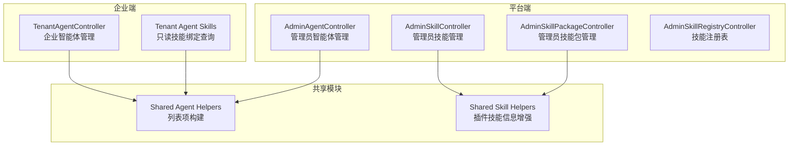
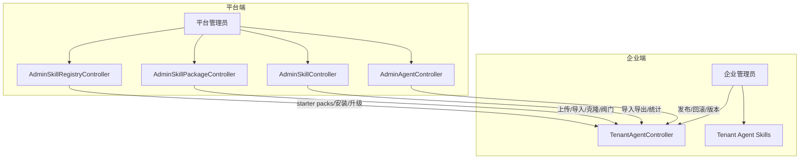
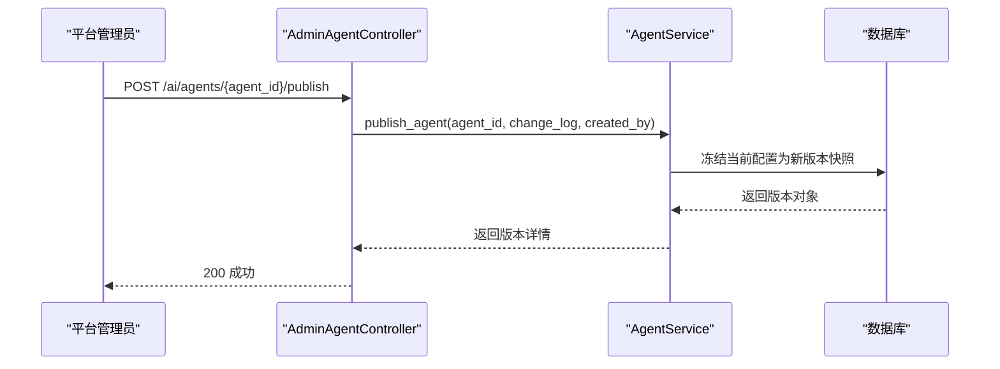
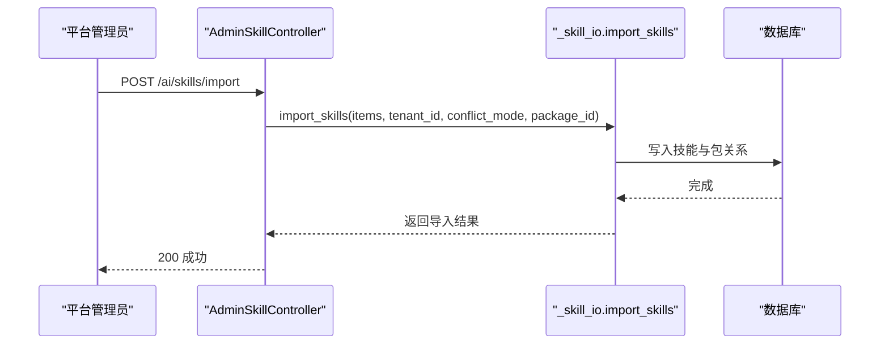
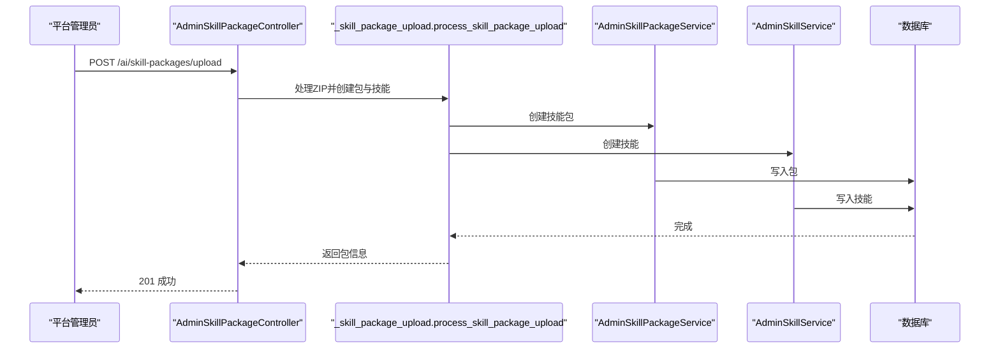
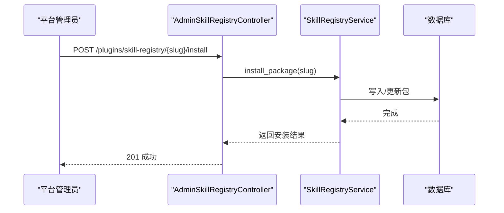
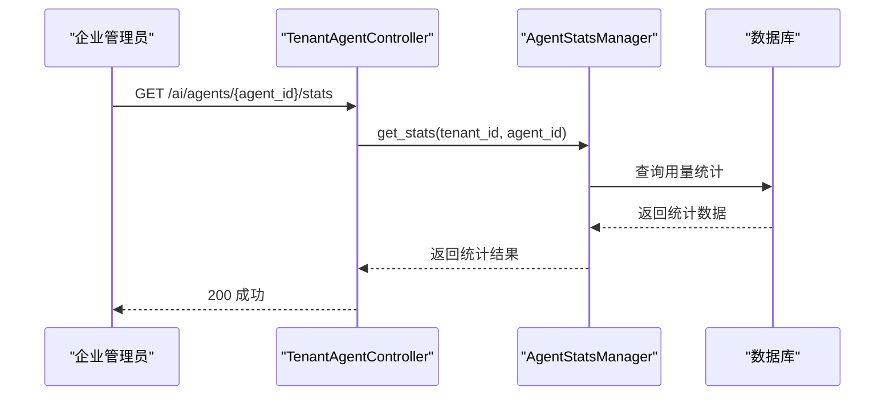
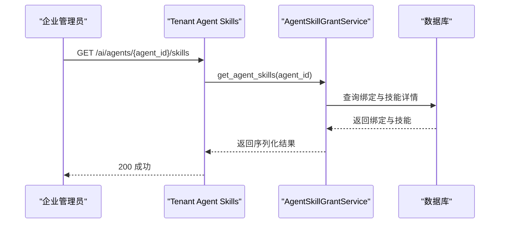
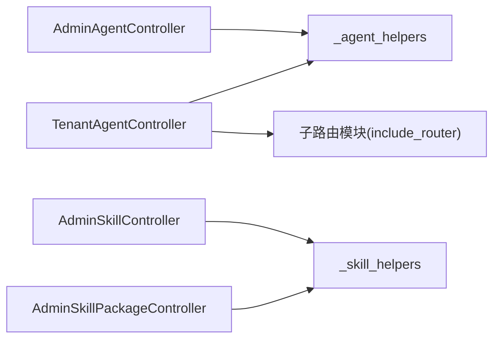

# 智能体与技能管理API

<cite>
**本文引用的文件**
- [backend/app/api/admin/agents.py](file://backend/app/api/admin/agents.py)
- [backend/app/api/admin/skills.py](file://backend/app/api/admin/skills.py)
- [backend/app/api/admin/skill_packages.py](file://backend/app/api/admin/skill_packages.py)
- [backend/app/api/admin/skill_registry.py](file://backend/app/api/admin/skill_registry.py)
- [backend/app/api/tenant/agents.py](file://backend/app/api/tenant/agents.py)
- [backend/app/api/tenant/_agent_skills.py](file://backend/app/api/tenant/_agent_skills.py)
- [backend/app/api/shared/_agent_helpers.py](file://backend/app/api/shared/_agent_helpers.py)
- [backend/app/api/shared/_skill_helpers.py](file://backend/app/api/shared/_skill_helpers.py)
</cite>

## 目录
1. [简介](#简介)
2. [项目结构](#项目结构)
3. [核心组件](#核心组件)
4. [架构总览](#架构总览)
5. [详细组件分析](#详细组件分析)
6. [依赖分析](#依赖分析)
7. [性能考量](#性能考量)
8. [故障排查指南](#故障排查指南)
9. [结论](#结论)
10. [附录](#附录)

## 简介
本文件为“智能体与技能管理API”的权威文档，覆盖以下能力范围：
- 智能体生命周期管理：创建、配置、发布、回滚、状态管理、回收站、版本历史对比
- 技能定义与管理：技能创建、更新、删除、状态切换、工具解析、配置测试、导入导出
- 技能包管理：技能包创建、更新、删除、状态切换、上传安装ZIP包、导出导入、克隆、阀门配置
- 技能市场与注册表：官方starter packs目录、安装/升级预览、批量升级、同步
- 智能体与技能绑定：单个/批量绑定、更新绑定配置、解绑、只读查询
- 智能体与知识库绑定：单个/批量绑定、更新绑定配置、解绑、只读查询
- 企业侧能力：配额用量查询、用量统计、访问权限配置、用户发布配置、记忆开关
- 平台侧能力：跨企业智能体列表、详情、状态管理、技能包/技能导入导出、统计概览
- 性能监控与统计：技能调用统计、技能包调用统计、智能体用量统计
- 权限控制与菜单：RBAC装饰器、菜单配置、权限动作标识

## 项目结构
本API主要分布在后端应用的多层架构中：
- 控制器层：平台端与企业端分别提供独立控制器，负责HTTP路由与权限校验
- 服务层：封装业务逻辑，如AgentService、AdminAgentService、AgentSkillGrantService、SkillPackageService等
- 共享模块：_agent_helpers、_skill_helpers等复用构建列表项与插件技能信息的通用逻辑
- Schema/Model：对应AI智能体、技能、技能包、绑定关系等实体的数据契约与ORM模型

图表来源
- [backend/app/api/admin/agents.py:136-800](file://backend/app/api/admin/agents.py#L136-L800)
- [backend/app/api/admin/skills.py:71-528](file://backend/app/api/admin/skills.py#L71-L528)
- [backend/app/api/admin/skill_packages.py:61-610](file://backend/app/api/admin/skill_packages.py#L61-L610)
- [backend/app/api/admin/skill_registry.py:26-168](file://backend/app/api/admin/skill_registry.py#L26-L168)
- [backend/app/api/tenant/agents.py:118-452](file://backend/app/api/tenant/agents.py#L118-L452)
- [backend/app/api/tenant/_agent_skills.py:1-40](file://backend/app/api/tenant/_agent_skills.py#L1-L40)
- [backend/app/api/shared/_agent_helpers.py:111-156](file://backend/app/api/shared/_agent_helpers.py#L111-L156)
- [backend/app/api/shared/_skill_helpers.py:19-51](file://backend/app/api/shared/_skill_helpers.py#L19-L51)

章节来源
- [backend/app/api/admin/agents.py:136-800](file://backend/app/api/admin/agents.py#L136-L800)
- [backend/app/api/admin/skills.py:71-528](file://backend/app/api/admin/skills.py#L71-L528)
- [backend/app/api/admin/skill_packages.py:61-610](file://backend/app/api/admin/skill_packages.py#L61-L610)
- [backend/app/api/admin/skill_registry.py:26-168](file://backend/app/api/admin/skill_registry.py#L26-L168)
- [backend/app/api/tenant/agents.py:118-452](file://backend/app/api/tenant/agents.py#L118-L452)
- [backend/app/api/tenant/_agent_skills.py:1-40](file://backend/app/api/tenant/_agent_skills.py#L1-L40)
- [backend/app/api/shared/_agent_helpers.py:111-156](file://backend/app/api/shared/_agent_helpers.py#L111-L156)
- [backend/app/api/shared/_skill_helpers.py:19-51](file://backend/app/api/shared/_skill_helpers.py#L19-L51)

## 核心组件
- 平台端智能体管理控制器：提供跨企业智能体列表、详情、状态管理、发布/回滚/版本管理、技能/知识库绑定管理
- 平台端技能管理控制器：提供技能列表、详情、CRUD、状态切换、工具解析、配置测试、导入导出、统计
- 平台端技能包管理控制器：提供技能包CRUD、状态切换、上传ZIP安装、导出导入、克隆、阀门配置、统计
- 平台端技能注册表控制器：提供官方starter packs目录、安装/升级预览、批量升级、同步
- 企业端智能体管理控制器：提供企业智能体CRUD、发布、配额用量、用量统计、访问权限配置、用户发布配置、记忆开关，并包含子路由模块
- 企业端智能体技能绑定只读路由：提供企业侧只读查询智能体绑定技能的能力
- 共享模块：_agent_helpers用于构建智能体列表项与抽取关联信息；_skill_helpers用于增强插件技能信息

章节来源
- [backend/app/api/admin/agents.py:136-800](file://backend/app/api/admin/agents.py#L136-L800)
- [backend/app/api/admin/skills.py:71-528](file://backend/app/api/admin/skills.py#L71-L528)
- [backend/app/api/admin/skill_packages.py:61-610](file://backend/app/api/admin/skill_packages.py#L61-L610)
- [backend/app/api/admin/skill_registry.py:26-168](file://backend/app/api/admin/skill_registry.py#L26-L168)
- [backend/app/api/tenant/agents.py:118-452](file://backend/app/api/tenant/agents.py#L118-L452)
- [backend/app/api/tenant/_agent_skills.py:1-40](file://backend/app/api/tenant/_agent_skills.py#L1-L40)
- [backend/app/api/shared/_agent_helpers.py:111-156](file://backend/app/api/shared/_agent_helpers.py#L111-L156)
- [backend/app/api/shared/_skill_helpers.py:19-51](file://backend/app/api/shared/_skill_helpers.py#L19-L51)

## 架构总览
下图展示了平台端与企业端在智能体与技能管理上的职责边界与交互关系。

图表来源
- [backend/app/api/admin/agents.py:136-800](file://backend/app/api/admin/agents.py#L136-L800)
- [backend/app/api/admin/skills.py:71-528](file://backend/app/api/admin/skills.py#L71-L528)
- [backend/app/api/admin/skill_packages.py:61-610](file://backend/app/api/admin/skill_packages.py#L61-L610)
- [backend/app/api/admin/skill_registry.py:26-168](file://backend/app/api/admin/skill_registry.py#L26-L168)
- [backend/app/api/tenant/agents.py:118-452](file://backend/app/api/tenant/agents.py#L118-L452)
- [backend/app/api/tenant/_agent_skills.py:1-40](file://backend/app/api/tenant/_agent_skills.py#L1-L40)

## 详细组件分析

### 平台端智能体管理API
- 路由前缀：/ai/agents
- 主要能力
  - 列表与详情：跨企业只读查看，支持JSON:API风格筛选、排序、分页
  - 创建/更新/删除：支持统一资源作用域与企业分配列表，平台端创建支持全局/企业/管理端专属
  - 状态管理：启用/禁用
  - 技能绑定：单个绑定、批量绑定（替换模式）、更新绑定配置、解绑、只读查询
  - 知识库绑定：单个绑定、批量绑定（替换模式）、更新绑定配置、解绑、只读查询
  - 发布/回滚/版本管理：冻结当前配置为新版本快照、回滚到指定版本、版本历史列表、版本差异对比、版本详情
  - 回收站：支持软删除与恢复
- 关键流程示例：发布智能体

图表来源
- [backend/app/api/admin/agents.py:678-730](file://backend/app/api/admin/agents.py#L678-L730)

章节来源
- [backend/app/api/admin/agents.py:136-800](file://backend/app/api/admin/agents.py#L136-L800)

### 平台端技能管理API
- 路由前缀：/ai/skills
- 主要能力
  - 技能类型枚举：内置+插件注册
  - 技能绑定选择器：分页检索，支持按目标智能体归属企业过滤
  - 列表与详情：跨企业查看，插件技能额外返回来源信息
  - CRUD：创建/更新/删除（软删除）
  - 状态管理：切换is_active
  - 工具解析：通过SkillResolver解析工具定义
  - 配置测试：按类型执行不同验证逻辑
  - 导入导出：批量导出JSON（自动脱敏敏感配置）、从JSON批量导入（冲突处理策略）
  - 统计：单技能调用统计、全部技能调用统计概览
- 关键流程示例：批量导入技能

图表来源
- [backend/app/api/admin/skills.py:426-454](file://backend/app/api/admin/skills.py#L426-L454)

章节来源
- [backend/app/api/admin/skills.py:71-528](file://backend/app/api/admin/skills.py#L71-L528)

### 平台端技能包管理API
- 路由前缀：/ai/skill-packages
- 主要能力
  - 下拉选项：技能包选择器
  - 推荐技能包：返回全部推荐包
  - 官方starter packs：目录与同步安装
  - 列表与详情：含技能数量
  - CRUD：创建/更新/删除（软删除，连带包内技能）
  - 状态管理：切换is_active（系统包保护）
  - 上传安装：上传ZIP包自动创建技能包与技能（平台归属）
  - 阀门配置：schema与当前值（secret字段脱敏）、更新校验
  - 技能列表：包内技能查询
  - 工具解析：统一通过SkillResolver解析包内所有技能工具
  - 导入导出：导出为JSON（含包信息与所有技能定义）、从JSON导入（冲突处理）
  - 克隆：克隆技能包（含所有技能）
  - 统计：包内技能调用统计
- 关键流程示例：上传ZIP包安装技能包

图表来源
- [backend/app/api/admin/skill_packages.py:332-377](file://backend/app/api/admin/skill_packages.py#L332-L377)

章节来源
- [backend/app/api/admin/skill_packages.py:61-610](file://backend/app/api/admin/skill_packages.py#L61-L610)

### 平台端技能注册表API
- 路由前缀：/plugins/skill-registry
- 主要能力
  - 注册表列表：关键词搜索、排序、标签过滤
  - 可升级包：列出已安装可升级包
  - 升级预览：针对slug的升级预览
  - 详情：获取包详情
  - 安装预览：针对slug的安装预览
  - 安装/升级：安装或升级指定slug包
  - 批量升级：按slug列表批量升级
  - 官方starter packs：目录与同步安装
- 关键流程示例：安装技能注册表包

图表来源
- [backend/app/api/admin/skill_registry.py:104-113](file://backend/app/api/admin/skill_registry.py#L104-L113)

章节来源
- [backend/app/api/admin/skill_registry.py:26-168](file://backend/app/api/admin/skill_registry.py#L26-L168)

### 企业端智能体管理API
- 路由前缀：/ai/agents
- 主要能力
  - 列表与详情：企业内智能体CRUD与详情
  - CRUD：创建/更新/删除（软删除）
  - 配额用量：获取智能体配额使用情况
  - 用量统计：获取智能体用量统计（对话次数、Token消耗）
  - 访问权限配置：获取与更新智能体访问权限配置（允许对平台分配的智能体配置）
  - 用户发布配置：获取与更新企业用户发布配置
  - 记忆开关：获取与设置企业侧记忆开关状态
  - 子路由模块：版本、技能绑定、知识库绑定、批量部署（由控制器include_router）
- 关键流程示例：获取智能体用量统计

图表来源
- [backend/app/api/tenant/agents.py:284-307](file://backend/app/api/tenant/agents.py#L284-L307)

章节来源
- [backend/app/api/tenant/agents.py:118-452](file://backend/app/api/tenant/agents.py#L118-L452)

### 企业端智能体技能绑定只读API
- 路由前缀：/ai/agents/{agent_id}/skills
- 主要能力
  - 只读查询：获取智能体绑定的所有技能（含Skill/Package详情）
- 关键流程示例：只读查询技能绑定

图表来源
- [backend/app/api/tenant/_agent_skills.py:21-39](file://backend/app/api/tenant/_agent_skills.py#L21-L39)

章节来源
- [backend/app/api/tenant/_agent_skills.py:1-40](file://backend/app/api/tenant/_agent_skills.py#L1-L40)

### 共享模块
- _agent_helpers：构建智能体列表项的基础字段，抽取模型能力、技能列表、知识库绑定等信息
- _skill_helpers：为插件注册的技能补充source_plugin与plugin_tools信息

章节来源
- [backend/app/api/shared/_agent_helpers.py:111-156](file://backend/app/api/shared/_agent_helpers.py#L111-L156)
- [backend/app/api/shared/_skill_helpers.py:19-51](file://backend/app/api/shared/_skill_helpers.py#L19-L51)

## 依赖分析
- 控制器到服务层：各控制器通过注入服务类完成业务逻辑，如AdminAgentController依赖AdminAgentService、AgentService等
- 控制器到共享模块：AdminAgentController与TenantAgentController依赖_shared/_agent_helpers；AdminSkillController依赖_shared/_skill_helpers
- 子路由模块：企业端控制器include_router引入版本、技能绑定、知识库绑定、批量部署等子模块
- 权限与菜单：各控制器使用permission_resource与action_*装饰器声明资源、权限与菜单配置

图表来源
- [backend/app/api/admin/agents.py:136-800](file://backend/app/api/admin/agents.py#L136-L800)
- [backend/app/api/tenant/agents.py:436-446](file://backend/app/api/tenant/agents.py#L436-L446)
- [backend/app/api/shared/_agent_helpers.py:111-156](file://backend/app/api/shared/_agent_helpers.py#L111-L156)
- [backend/app/api/shared/_skill_helpers.py:19-51](file://backend/app/api/shared/_skill_helpers.py#L19-L51)

章节来源
- [backend/app/api/admin/agents.py:136-800](file://backend/app/api/admin/agents.py#L136-L800)
- [backend/app/api/tenant/agents.py:436-446](file://backend/app/api/tenant/agents.py#L436-L446)
- [backend/app/api/shared/_agent_helpers.py:111-156](file://backend/app/api/shared/_agent_helpers.py#L111-L156)
- [backend/app/api/shared/_skill_helpers.py:19-51](file://backend/app/api/shared/_skill_helpers.py#L19-L51)

## 性能考量
- 分页与筛选：平台端与企业端均采用JSON:API风格分页与筛选，建议合理设置page_size上限，避免大页请求
- 批量操作：批量绑定技能/知识库采用“替换模式”，先清空再批量插入，注意大数据量时的事务开销
- 导入导出：批量导出/导入涉及大量技能与包数据，建议在后台任务中执行并提供进度反馈
- 统计查询：技能/技能包/智能体统计查询可能涉及聚合计算，建议缓存热点数据或异步生成报表
- 阀门配置：更新阀门配置需进行参数校验与脱敏，建议在服务层统一处理以减少重复逻辑

## 故障排查指南
- 常见错误与定位
  - 资源不存在：当查询或操作的对象不存在时，会抛出“未找到”异常，检查ID与权限范围
  - 系统受保护：对平台创建的全局智能体或他企智能体进行变更操作会被拒绝，确认owner_tenant_id与scope
  - 插件技能来源限制：若智能体由插件源创建，scope被锁定，更新时需遵循插件提供的scope
  - 导入冲突：导入技能/技能包时的冲突模式（跳过/覆盖/重命名）会影响最终结果，检查conflict_mode与目标租户
- 日志与审计：控制器使用LogManager记录日志，可在相应模块中查看详细错误堆栈
- 统计与监控：通过统计接口获取调用次数、成功率、平均耗时等指标，定位性能瓶颈与失败原因

章节来源
- [backend/app/api/admin/agents.py:272-287](file://backend/app/api/admin/agents.py#L272-L287)
- [backend/app/api/admin/skills.py:444-454](file://backend/app/api/admin/skills.py#L444-L454)
- [backend/app/api/admin/skill_packages.py:319-323](file://backend/app/api/admin/skill_packages.py#L319-L323)

## 结论
本API体系围绕“平台端统一治理、企业端灵活使用”的设计目标，提供了从智能体生命周期、技能定义与包管理、技能市场集成到企业侧权限与统计的完整能力闭环。通过清晰的控制器分层、共享模块复用与严格的权限控制，既保证了平台的集中管控，又满足了企业端的个性化需求。建议在生产环境中结合缓存、异步任务与监控告警机制，持续优化性能与稳定性。

## 附录
- 权限动作标识（节选）
  - 智能体：ai_agent:list、ai_agent:create、ai_agent:update、ai_agent:delete、ai_agent:update_status、ai_agent:skills、ai_agent:bind_skill、ai_agent:batch_bind_skills、ai_agent:update_skill_binding、ai_agent:unbind_skill、ai_agent:knowledge_bases、ai_agent:bind_kb、ai_agent:batch_bind_kbs、ai_agent:update_kb_binding、ai_agent:unbind_kb、ai_agent:publish、ai_agent:rollback、ai_agent:versions、ai_agent:version_diff、ai_agent:version_detail
  - 技能：ai_skill:list、ai_skill:create、ai_skill:update、ai_skill:delete、ai_skill:update_status、ai_skill:detail、ai_skill:tools、ai_skill:test、ai_skill:export、ai_skill:import、ai_skill:toolkit/parse
  - 技能包：ai_skill_package:list、ai_skill_package:create、ai_skill_package:update、ai_skill_package:delete、ai_skill_package:update_status、ai_skill_package:upload、ai_skill_package:valves、ai_skill_package:skills、ai_skill_package:resolved-tools、ai_skill_package:export、ai_skill_package:import、ai_skill_package:clone、ai_skill_package:stats
  - 技能注册表：plugin_skill_registry:list、plugin_skill_registry:detail、plugin_skill_registry:install
- 菜单与资源：控制器通过permission_resource与MenuConfig声明菜单、图标、路径与权限资源，确保RBAC生效

章节来源
- [backend/app/api/admin/agents.py:100-135](file://backend/app/api/admin/agents.py#L100-L135)
- [backend/app/api/admin/skills.py:64-70](file://backend/app/api/admin/skills.py#L64-L70)
- [backend/app/api/admin/skill_packages.py:48-60](file://backend/app/api/admin/skill_packages.py#L48-L60)
- [backend/app/api/admin/skill_registry.py:20-26](file://backend/app/api/admin/skill_registry.py#L20-L26)
- [backend/app/api/tenant/agents.py:82-117](file://backend/app/api/tenant/agents.py#L82-L117)