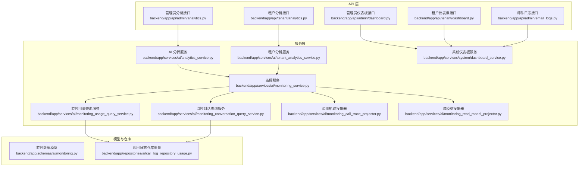
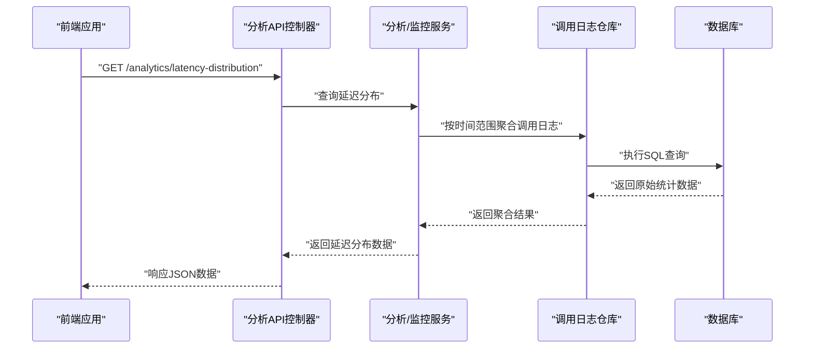
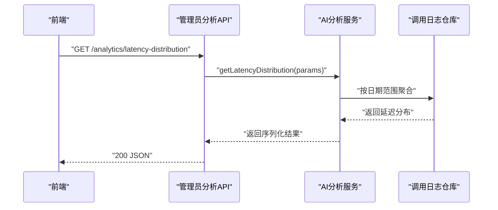
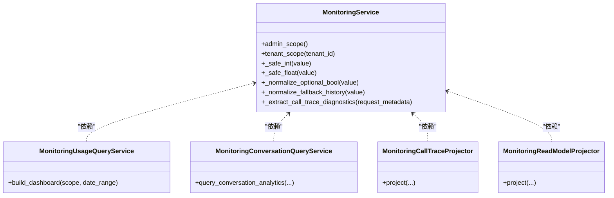
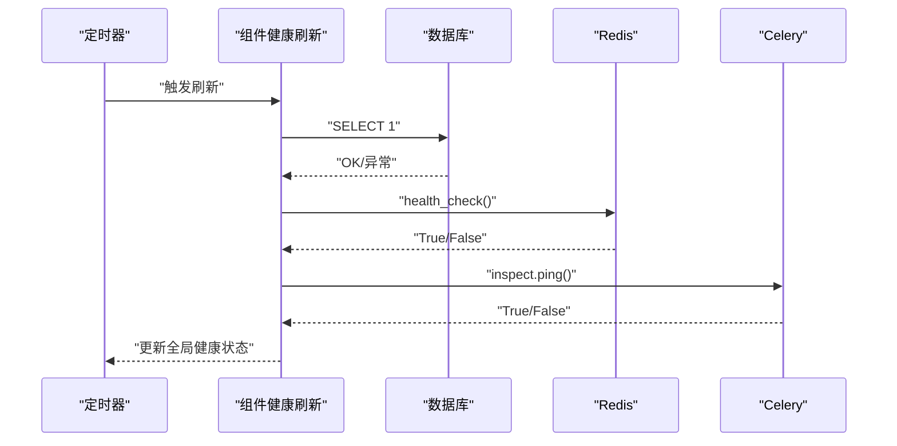
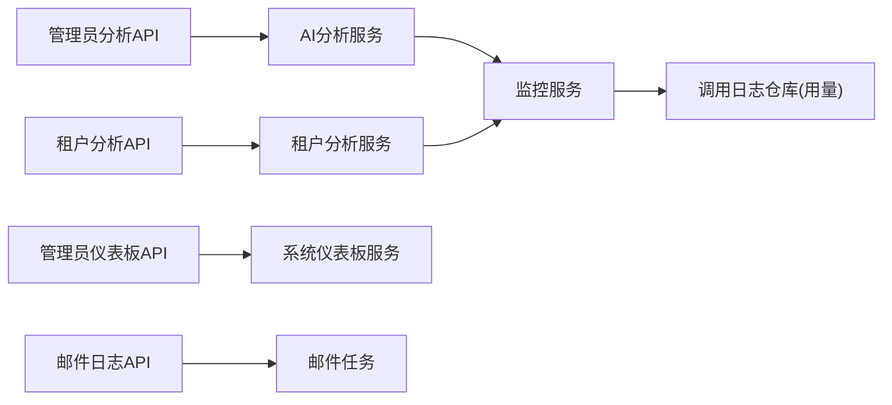

# 监控与分析API

<cite>
**本文档引用的文件**
- [backend/app/api/admin/analytics.py](file://backend/app/api/admin/analytics.py)
- [backend/app/api/tenant/analytics.py](file://backend/app/api/tenant/analytics.py)
- [backend/app/services/ai/analytics_service.py](file://backend/app/services/ai/analytics_service.py)
- [backend/app/services/ai/tenant_analytics_service.py](file://backend/app/services/ai/tenant_analytics_service.py)
- [backend/app/schemas/ai/monitoring.py](file://backend/app/schemas/ai/monitoring.py)
- [backend/app/services/ai/monitoring_service.py](file://backend/app/services/ai/monitoring_service.py)
- [backend/app/services/ai/monitoring_usage_query_service.py](file://backend/app/services/ai/monitoring_usage_query_service.py)
- [backend/app/services/ai/monitoring_conversation_query_service.py](file://backend/app/services/ai/monitoring_conversation_query_service.py)
- [backend/app/services/ai/monitoring_call_trace_projector.py](file://backend/app/services/ai/monitoring_call_trace_projector.py)
- [backend/app/services/ai/monitoring_read_model_projector.py](file://backend/app/services/ai/monitoring_read_model_projector.py)
- [backend/app/api/admin/dashboard.py](file://backend/app/api/admin/dashboard.py)
- [backend/app/api/tenant/dashboard.py](file://backend/app/api/tenant/dashboard.py)
- [backend/app/services/system/dashboard_service.py](file://backend/app/services/system/dashboard_service.py)
- [backend/app/services/system/dashboard_service_parts/admin.py](file://backend/app/services/system/dashboard_service_parts/admin.py)
- [backend/app/api/admin/email_logs.py](file://backend/app/api/admin/email_logs.py)
- [backend/app/repositories/ai/call_log_repository_usage.py](file://backend/app/repositories/ai/call_log_repository_usage.py)
- [backend/app/tasks/email.py](file://backend/app/tasks/email.py)
- [backend/migrations/versions/20260220_fbe521b42f77_add_email_logs_table.py](file://backend/migrations/versions/20260220_fbe521b42f77_add_email_logs_table.py)
- [backend/migrations/versions/20260207_002_add_ai_usage_stats.py](file://backend/migrations/versions/20260207_002_add_ai_usage_stats.py)
- [backend/app/main.py](file://backend/app/main.py)
- [frontend/apps/web-antd/src/api/admin/analytics.ts](file://frontend/apps/web-antd/src/api/admin/analytics.ts)
</cite>

## 目录
1. [简介](#简介)
2. [项目结构](#项目结构)
3. [核心组件](#核心组件)
4. [架构总览](#架构总览)
5. [详细组件分析](#详细组件分析)
6. [依赖关系分析](#依赖关系分析)
7. [性能考虑](#性能考虑)
8. [故障排查指南](#故障排查指南)
9. [结论](#结论)
10. [附录](#附录)

## 简介
本文件面向监控与分析API，系统性梳理并文档化以下能力：
- 使用统计：按天/模型/渠道/租户/用户聚合的用量与费用统计
- 性能监控：延迟分布、成功率趋势等关键指标
- 日志查询：操作日志、AI调用日志、邮件发送日志的检索与详情
- 运营分析：对话质量、调用轨迹、读模型投影等
- 邮件发送记录：邮件模板、发送状态、错误追踪
- 健康度评估：数据库、Redis、Celery等组件健康检查
- 实时监控仪表板与历史数据分析：管理员与租户维度的可视化入口
- 自定义报表：基于查询服务的聚合与导出能力

## 项目结构
后端采用分层架构，监控与分析相关代码主要分布在：
- API层：管理员与租户维度的分析与仪表板接口
- 服务层：AI分析、监控查询、读模型投影、仪表板健康检查
- 模型与仓库：监控数据模型、调用日志仓库
- 前端：管理员分析API的前端请求封装

图表来源
- [backend/app/api/admin/analytics.py](file://backend/app/api/admin/analytics.py)
- [backend/app/api/tenant/analytics.py](file://backend/app/api/tenant/analytics.py)
- [backend/app/api/admin/dashboard.py](file://backend/app/api/admin/dashboard.py)
- [backend/app/api/tenant/dashboard.py](file://backend/app/api/tenant/dashboard.py)
- [backend/app/api/admin/email_logs.py](file://backend/app/api/admin/email_logs.py)
- [backend/app/services/ai/analytics_service.py](file://backend/app/services/ai/analytics_service.py)
- [backend/app/services/ai/tenant_analytics_service.py](file://backend/app/services/ai/tenant_analytics_service.py)
- [backend/app/services/ai/monitoring_service.py](file://backend/app/services/ai/monitoring_service.py)
- [backend/app/services/ai/monitoring_usage_query_service.py](file://backend/app/services/ai/monitoring_usage_query_service.py)
- [backend/app/services/ai/monitoring_conversation_query_service.py](file://backend/app/services/ai/monitoring_conversation_query_service.py)
- [backend/app/services/ai/monitoring_call_trace_projector.py](file://backend/app/services/ai/monitoring_call_trace_projector.py)
- [backend/app/services/ai/monitoring_read_model_projector.py](file://backend/app/services/ai/monitoring_read_model_projector.py)
- [backend/app/services/system/dashboard_service.py](file://backend/app/services/system/dashboard_service.py)
- [backend/app/schemas/ai/monitoring.py](file://backend/app/schemas/ai/monitoring.py)
- [backend/app/repositories/ai/call_log_repository_usage.py](file://backend/app/repositories/ai/call_log_repository_usage.py)

章节来源
- [backend/app/api/admin/analytics.py](file://backend/app/api/admin/analytics.py)
- [backend/app/api/tenant/analytics.py](file://backend/app/api/tenant/analytics.py)
- [backend/app/api/admin/dashboard.py](file://backend/app/api/admin/dashboard.py)
- [backend/app/api/tenant/dashboard.py](file://backend/app/api/tenant/dashboard.py)
- [backend/app/api/admin/email_logs.py](file://backend/app/api/admin/email_logs.py)
- [backend/app/services/ai/analytics_service.py](file://backend/app/services/ai/analytics_service.py)
- [backend/app/services/ai/tenant_analytics_service.py](file://backend/app/services/ai/tenant_analytics_service.py)
- [backend/app/services/ai/monitoring_service.py](file://backend/app/services/ai/monitoring_service.py)
- [backend/app/services/ai/monitoring_usage_query_service.py](file://backend/app/services/ai/monitoring_usage_query_service.py)
- [backend/app/services/ai/monitoring_conversation_query_service.py](file://backend/app/services/ai/monitoring_conversation_query_service.py)
- [backend/app/services/ai/monitoring_call_trace_projector.py](file://backend/app/services/ai/monitoring_call_trace_projector.py)
- [backend/app/services/ai/monitoring_read_model_projector.py](file://backend/app/services/ai/monitoring_read_model_projector.py)
- [backend/app/services/system/dashboard_service.py](file://backend/app/services/system/dashboard_service.py)
- [backend/app/schemas/ai/monitoring.py](file://backend/app/schemas/ai/monitoring.py)
- [backend/app/repositories/ai/call_log_repository_usage.py](file://backend/app/repositories/ai/call_log_repository_usage.py)

## 核心组件
- 管理员与租户分析接口：提供延迟分布、成功率趋势、用量统计等分析数据
- 监控服务与查询服务：负责数据采集、聚合、读模型投影与查询支持
- 仪表板服务：提供系统健康度评估与资源使用信息
- 邮件日志接口：提供邮件发送记录的查询与详情
- 调用日志仓库：支撑用量统计与趋势分析的数据源

章节来源
- [backend/app/api/admin/analytics.py](file://backend/app/api/admin/analytics.py)
- [backend/app/api/tenant/analytics.py](file://backend/app/api/tenant/analytics.py)
- [backend/app/services/ai/monitoring_service.py](file://backend/app/services/ai/monitoring_service.py)
- [backend/app/services/ai/monitoring_usage_query_service.py](file://backend/app/services/ai/monitoring_usage_query_service.py)
- [backend/app/services/system/dashboard_service.py](file://backend/app/services/system/dashboard_service.py)
- [backend/app/api/admin/email_logs.py](file://backend/app/api/admin/email_logs.py)
- [backend/app/repositories/ai/call_log_repository_usage.py](file://backend/app/repositories/ai/call_log_repository_usage.py)

## 架构总览
监控与分析API通过API层接收请求，服务层进行业务处理与数据聚合，底层依赖数据库与缓存，并通过任务系统异步处理邮件发送等后台工作。

图表来源
- [backend/app/api/admin/analytics.py](file://backend/app/api/admin/analytics.py)
- [backend/app/services/ai/analytics_service.py](file://backend/app/services/ai/analytics_service.py)
- [backend/app/repositories/ai/call_log_repository_usage.py](file://backend/app/repositories/ai/call_log_repository_usage.py)

## 详细组件分析

### 管理员分析接口
- 接口：延迟分布、成功率趋势
- 功能：按时间范围返回延迟分布直方图与成功率趋势折线
- 数据来源：调用日志仓库与用量统计表
- 认证与权限：需要管理员角色访问控制

图表来源
- [backend/app/api/admin/analytics.py](file://backend/app/api/admin/analytics.py)
- [backend/app/services/ai/analytics_service.py](file://backend/app/services/ai/analytics_service.py)
- [frontend/apps/web-antd/src/api/admin/analytics.ts](file://frontend/apps/web-antd/src/api/admin/analytics.ts)

章节来源
- [backend/app/api/admin/analytics.py](file://backend/app/api/admin/analytics.py)
- [frontend/apps/web-antd/src/api/admin/analytics.ts](file://frontend/apps/web-antd/src/api/admin/analytics.ts)

### 租户分析接口
- 接口：租户维度的用量统计、趋势与排行
- 功能：支持按天聚合、模型维度、接入渠道、Top Agent/用户/租户排行
- 数据来源：监控用量查询服务与调用日志仓库

章节来源
- [backend/app/api/tenant/analytics.py](file://backend/app/api/tenant/analytics.py)
- [backend/app/services/ai/monitoring_usage_query_service.py](file://backend/app/services/ai/monitoring_usage_query_service.py)

### 监控服务与查询服务
- 监控服务：提供作用域管理、安全类型转换、调用轨迹诊断提取等通用能力
- 用量查询服务：构建监控仪表盘数据，包括汇总、日统计、模型统计、渠道统计、Top排行等
- 对话查询服务：提供对话维度的分析能力
- 读模型投影器：将写入事件投影为可查询的读模型
- 调用轨迹投影器：从请求元数据中提取调用轨迹诊断信息

图表来源
- [backend/app/services/ai/monitoring_service.py](file://backend/app/services/ai/monitoring_service.py)
- [backend/app/services/ai/monitoring_usage_query_service.py](file://backend/app/services/ai/monitoring_usage_query_service.py)
- [backend/app/services/ai/monitoring_conversation_query_service.py](file://backend/app/services/ai/monitoring_conversation_query_service.py)
- [backend/app/services/ai/monitoring_call_trace_projector.py](file://backend/app/services/ai/monitoring_call_trace_projector.py)
- [backend/app/services/ai/monitoring_read_model_projector.py](file://backend/app/services/ai/monitoring_read_model_projector.py)

章节来源
- [backend/app/services/ai/monitoring_service.py](file://backend/app/services/ai/monitoring_service.py)
- [backend/app/services/ai/monitoring_usage_query_service.py](file://backend/app/services/ai/monitoring_usage_query_service.py)
- [backend/app/services/ai/monitoring_conversation_query_service.py](file://backend/app/services/ai/monitoring_conversation_query_service.py)
- [backend/app/services/ai/monitoring_call_trace_projector.py](file://backend/app/services/ai/monitoring_call_trace_projector.py)
- [backend/app/services/ai/monitoring_read_model_projector.py](file://backend/app/services/ai/monitoring_read_model_projector.py)

### 仪表板服务与健康度评估
- 系统仪表板服务：提供整体健康度、Redis连接、数据库连通性、Celery可用性、内存占用、进程运行时长等指标
- 组件健康刷新：定时刷新数据库、Redis、Celery健康状态，避免频繁探测带来的开销

图表来源
- [backend/app/main.py](file://backend/app/main.py)
- [backend/app/services/system/dashboard_service_parts/admin.py](file://backend/app/services/system/dashboard_service_parts/admin.py)

章节来源
- [backend/app/services/system/dashboard_service.py](file://backend/app/services/system/dashboard_service.py)
- [backend/app/services/system/dashboard_service_parts/admin.py](file://backend/app/services/system/dashboard_service_parts/admin.py)
- [backend/app/main.py](file://backend/app/main.py)

### 邮件发送记录
- 接口：获取邮件日志详情，包含收件人、主题、状态、触发来源、HTML/文本正文、错误信息、发送时间等
- 数据库：邮件日志表在迁移中已创建索引以支持高效查询
- 任务：邮件发送由任务系统异步执行，日志记录用于审计与排障

章节来源
- [backend/app/api/admin/email_logs.py](file://backend/app/api/admin/email_logs.py)
- [backend/migrations/versions/20260220_fbe521b42f77_add_email_logs_table.py](file://backend/migrations/versions/20260220_fbe521b42f77_add_email_logs_table.py)
- [backend/app/tasks/email.py](file://backend/app/tasks/email.py)

### 数据模型与仓库
- 监控数据模型：定义监控仪表盘的结构与字段
- 调用日志仓库（用量）：提供按时间范围、模型、渠道等维度的用量统计查询

章节来源
- [backend/app/schemas/ai/monitoring.py](file://backend/app/schemas/ai/monitoring.py)
- [backend/app/repositories/ai/call_log_repository_usage.py](file://backend/app/repositories/ai/call_log_repository_usage.py)

## 依赖关系分析
- API层依赖对应的服务层实现
- 服务层依赖仓库层与数据库
- 监控服务依赖查询支持与投影器
- 仪表板服务依赖系统组件健康检查
- 邮件日志接口依赖邮件日志仓库与任务系统

图表来源
- [backend/app/api/admin/analytics.py](file://backend/app/api/admin/analytics.py)
- [backend/app/api/tenant/analytics.py](file://backend/app/api/tenant/analytics.py)
- [backend/app/services/ai/analytics_service.py](file://backend/app/services/ai/analytics_service.py)
- [backend/app/services/ai/tenant_analytics_service.py](file://backend/app/services/ai/tenant_analytics_service.py)
- [backend/app/services/ai/monitoring_service.py](file://backend/app/services/ai/monitoring_service.py)
- [backend/app/repositories/ai/call_log_repository_usage.py](file://backend/app/repositories/ai/call_log_repository_usage.py)
- [backend/app/api/admin/dashboard.py](file://backend/app/api/admin/dashboard.py)
- [backend/app/services/system/dashboard_service.py](file://backend/app/services/system/dashboard_service.py)
- [backend/app/api/admin/email_logs.py](file://backend/app/api/admin/email_logs.py)
- [backend/app/tasks/email.py](file://backend/app/tasks/email.py)

章节来源
- [backend/app/api/admin/analytics.py](file://backend/app/api/admin/analytics.py)
- [backend/app/api/tenant/analytics.py](file://backend/app/api/tenant/analytics.py)
- [backend/app/services/ai/analytics_service.py](file://backend/app/services/ai/analytics_service.py)
- [backend/app/services/ai/tenant_analytics_service.py](file://backend/app/services/ai/tenant_analytics_service.py)
- [backend/app/services/ai/monitoring_service.py](file://backend/app/services/ai/monitoring_service.py)
- [backend/app/repositories/ai/call_log_repository_usage.py](file://backend/app/repositories/ai/call_log_repository_usage.py)
- [backend/app/api/admin/dashboard.py](file://backend/app/api/admin/dashboard.py)
- [backend/app/services/system/dashboard_service.py](file://backend/app/services/system/dashboard_service.py)
- [backend/app/api/admin/email_logs.py](file://backend/app/api/admin/email_logs.py)
- [backend/app/tasks/email.py](file://backend/app/tasks/email.py)

## 性能考虑
- 查询优化：通过索引与分区策略提升按时间范围、模型、渠道的查询效率
- 异步处理：邮件发送与日志写入采用任务队列异步执行，降低主流程阻塞
- 缓存与健康检查：组件健康状态定期刷新并缓存，减少重复探测
- 聚合粒度：用量统计按天/小时等粒度聚合，避免过细粒度导致的存储与查询压力

## 故障排查指南
- 组件健康检查失败
  - 现象：数据库、Redis或Celery不可用导致健康度为不正常
  - 排查：确认对应服务连通性、认证配置与网络策略；查看定时刷新日志
- 邮件发送失败
  - 现象：邮件日志状态为失败且包含错误信息
  - 排查：检查邮件任务队列、SMTP配置、收件人地址与模板内容
- 分析接口无数据
  - 现象：延迟分布或用量统计为空
  - 排查：确认调用日志是否正常写入、时间范围参数是否正确、仓库查询是否成功

章节来源
- [backend/app/main.py](file://backend/app/main.py)
- [backend/app/services/system/dashboard_service_parts/admin.py](file://backend/app/services/system/dashboard_service_parts/admin.py)
- [backend/app/api/admin/email_logs.py](file://backend/app/api/admin/email_logs.py)

## 结论
监控与分析API覆盖了使用统计、性能监控、日志查询、运营分析、邮件发送记录等核心场景，结合仪表板健康度评估与趋势分析，为平台运维与运营提供了完整的数据支撑。建议在生产环境中配合缓存、异步任务与索引优化，确保高并发下的稳定性与性能。

## 附录
- 数据库迁移要点
  - 邮件日志表已创建，包含必要索引以支持高效查询
  - AI用量统计表已创建，支持用量聚合与报表生成
- 前端对接
  - 管理员分析API的前端封装已提供延迟分布与成功率趋势接口

章节来源
- [backend/migrations/versions/20260220_fbe521b42f77_add_email_logs_table.py](file://backend/migrations/versions/20260220_fbe521b42f77_add_email_logs_table.py)
- [backend/migrations/versions/20260207_002_add_ai_usage_stats.py](file://backend/migrations/versions/20260207_002_add_ai_usage_stats.py)
- [frontend/apps/web-antd/src/api/admin/analytics.ts](file://frontend/apps/web-antd/src/api/admin/analytics.ts)