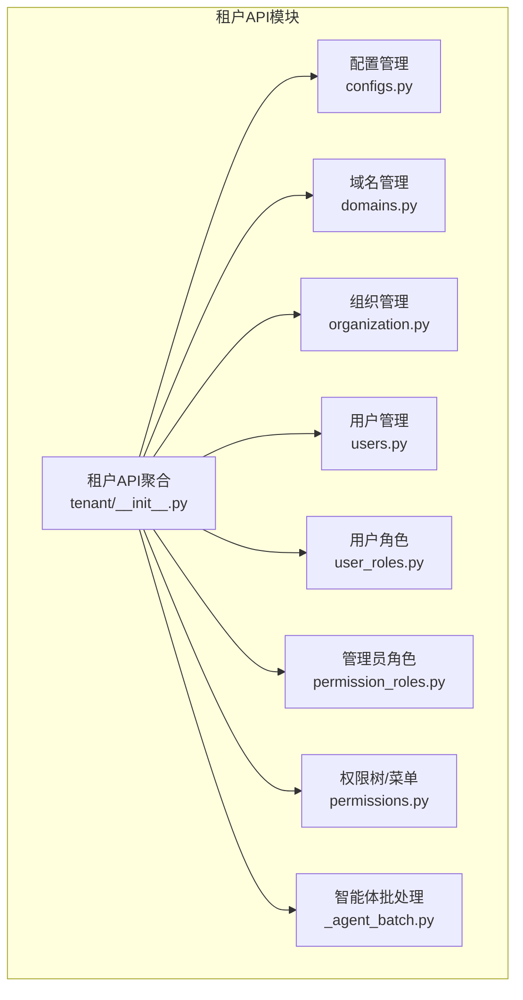
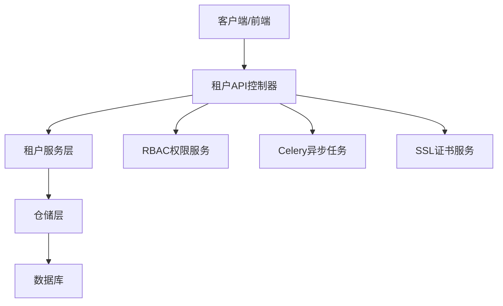
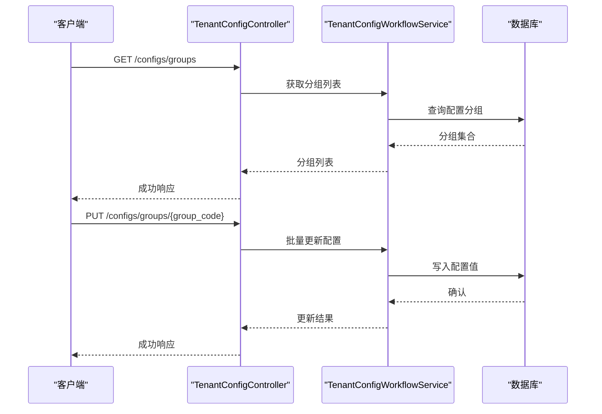
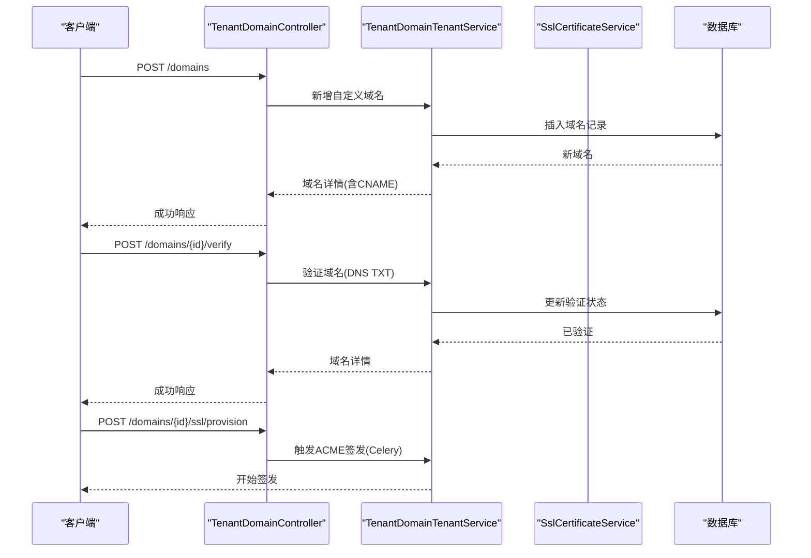
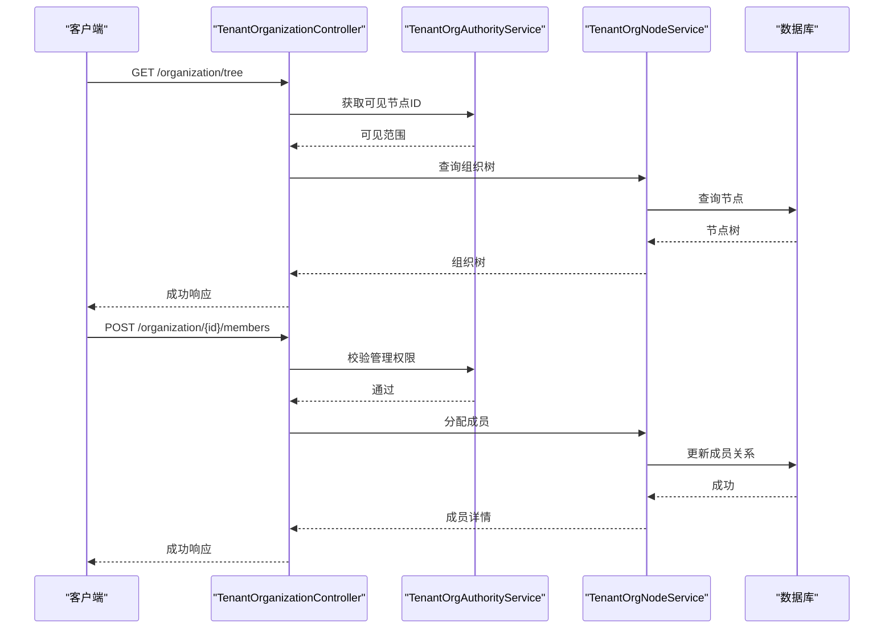
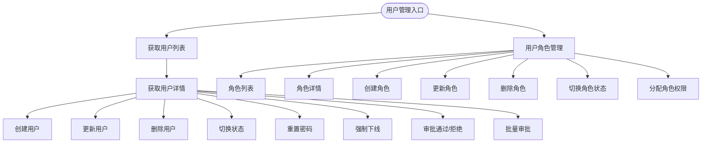
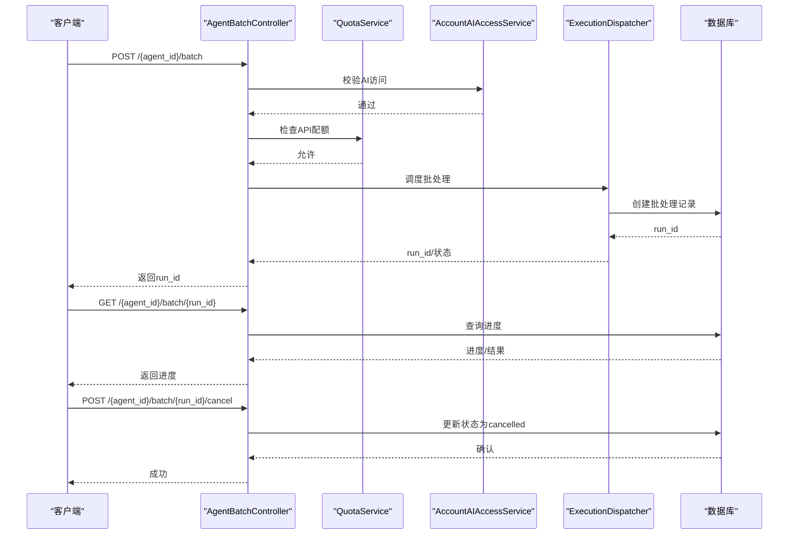
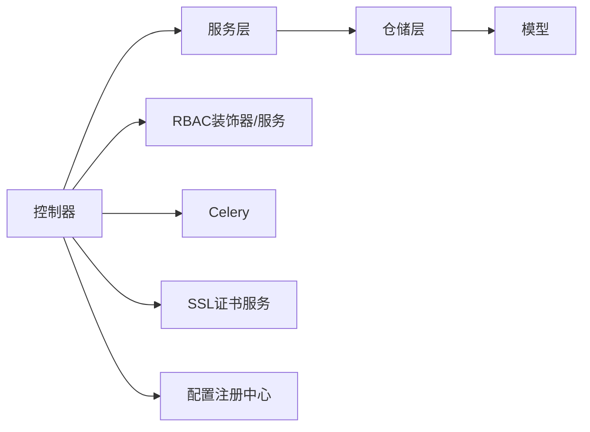
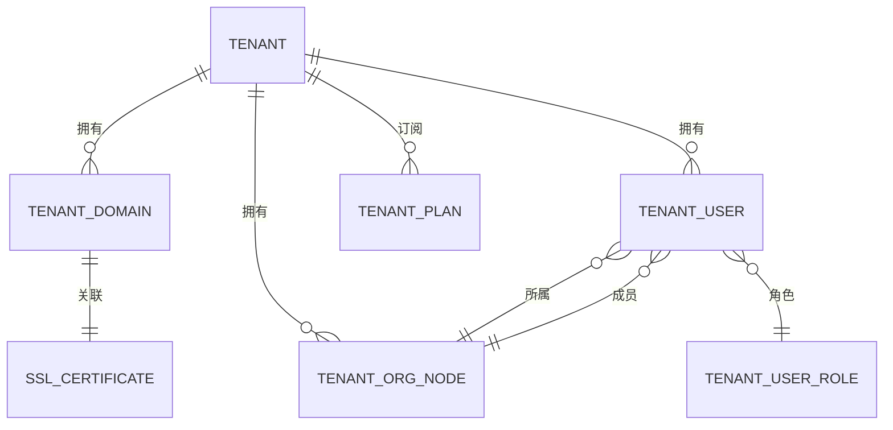

# 租户管理API

<cite>
**本文档引用的文件**
- [backend/app/api/tenant/__init__.py](file://backend/app/api/tenant/__init__.py)
- [backend/app/api/tenant/configs.py](file://backend/app/api/tenant/configs.py)
- [backend/app/api/tenant/domains.py](file://backend/app/api/tenant/domains.py)
- [backend/app/api/tenant/organization.py](file://backend/app/api/tenant/organization.py)
- [backend/app/api/tenant/users.py](file://backend/app/api/tenant/users.py)
- [backend/app/api/tenant/user_roles.py](file://backend/app/api/tenant/user_roles.py)
- [backend/app/api/tenant/permission_roles.py](file://backend/app/api/tenant/permission_roles.py)
- [backend/app/api/tenant/permissions.py](file://backend/app/api/tenant/permissions.py)
- [backend/app/api/tenant/_agent_batch.py](file://backend/app/api/tenant/_agent_batch.py)
- [backend/app/models/tenant/tenant.py](file://backend/app/models/tenant/tenant.py)
- [backend/app/models/tenant/tenant_domain.py](file://backend/app/models/tenant/tenant_domain.py)
- [backend/app/models/tenant/tenant_plan.py](file://backend/app/models/tenant/tenant_plan.py)
- [backend/app/models/tenant/tenant_user.py](file://backend/app/models/tenant/tenant_user.py)
- [backend/app/schemas/tenant/domain.py](file://backend/app/schemas/tenant/domain.py)
- [backend/app/schemas/tenant/plan.py](file://backend/app/schemas/tenant/plan.py)
- [backend/app/schemas/tenant/tenant_org_node.py](file://backend/app/schemas/tenant/tenant_org_node.py)
- [backend/app/schemas/tenant/user.py](file://backend/app/schemas/tenant/user.py)
- [backend/app/schemas/tenant/user_role.py](file://backend/app/schemas/tenant/user_role.py)
- [backend/app/schemas/tenant/tenant_permission_role.py](file://backend/app/schemas/tenant/tenant_permission_role.py)
- [backend/app/services/tenant/tenant_config_workflow_service.py](file://backend/app/services/tenant/tenant_config_workflow_service.py)
- [backend/app/services/tenant/tenant_org_node_service.py](file://backend/app/services/tenant/tenant_org_node_service.py)
- [backend/app/services/tenant/tenant_user_role_service.py](file://backend/app/services/tenant/tenant_user_role_service.py)
- [backend/app/services/tenant/tenant_permission_role_service.py](file://backend/app/services/tenant/tenant_permission_role_service.py)
- [backend/app/services/tenant/tenant_user_service.py](file://backend/app/services/tenant/tenant_user_service.py)
- [backend/app/services/system/tenant_domain_service.py](file://backend/app/services/system/tenant_domain_service.py)
- [backend/app/services/system/ssl_certificate_service.py](file://backend/app/services/system/ssl_certificate_service.py)
</cite>

## 目录
1. [简介](#简介)
2. [项目结构](#项目结构)
3. [核心组件](#核心组件)
4. [架构总览](#架构总览)
5. [详细组件分析](#详细组件分析)
6. [依赖关系分析](#依赖关系分析)
7. [性能考虑](#性能考虑)
8. [故障排除指南](#故障排除指南)
9. [结论](#结论)
10. [附录](#附录)

## 简介
本文件为租户管理API的全面技术文档，覆盖租户生命周期管理、域名绑定与SSL证书管理、组织架构与权限体系、配置与套餐计划、用户与角色管理、以及批处理任务等能力。文档面向系统管理员与开发者，提供接口定义、数据模型、流程图与最佳实践，帮助快速理解与集成。

## 项目结构
租户管理API位于后端应用的租户模块路径下，采用“按功能域划分”的组织方式，核心入口为租户API路由器聚合模块，统一注册各子域控制器。

**图表来源**
- [backend/app/api/tenant/__init__.py:67-120](file://backend/app/api/tenant/__init__.py#L67-L120)

**章节来源**
- [backend/app/api/tenant/__init__.py:11-150](file://backend/app/api/tenant/__init__.py#L11-L150)

## 核心组件
- 租户配置管理：提供企业级配置分组、批量更新、存储驱动与连接测试等能力。
- 域名与SSL管理：支持域名增删改查、DNS验证、主域名设置、ACME证书签发与续期、自定义证书上传与自动续期开关。
- 组织架构与权限：提供组织树、节点CRUD、成员管理、权限范围策略、AI可用性开关等。
- 用户与角色：支持用户CRUD、审批、强制下线、角色管理与权限分配。
- 权限体系：提供权限树与菜单树查询，支撑前端动态渲染。
- 批处理任务：面向智能体的批处理提交、进度查询与取消。

**章节来源**
- [backend/app/api/tenant/configs.py:49-244](file://backend/app/api/tenant/configs.py#L49-L244)
- [backend/app/api/tenant/domains.py:53-554](file://backend/app/api/tenant/domains.py#L53-L554)
- [backend/app/api/tenant/organization.py:195-800](file://backend/app/api/tenant/organization.py#L195-L800)
- [backend/app/api/tenant/users.py:83-349](file://backend/app/api/tenant/users.py#L83-L349)
- [backend/app/api/tenant/user_roles.py:88-202](file://backend/app/api/tenant/user_roles.py#L88-L202)
- [backend/app/api/tenant/permission_roles.py:69-191](file://backend/app/api/tenant/permission_roles.py#L69-L191)
- [backend/app/api/tenant/permissions.py:29-93](file://backend/app/api/tenant/permissions.py#L29-L93)
- [backend/app/api/tenant/_agent_batch.py:23-170](file://backend/app/api/tenant/_agent_batch.py#L23-L170)

## 架构总览
租户API采用“控制器-服务-仓储-模型”分层架构，控制器负责HTTP路由与鉴权，服务层封装业务逻辑，仓储层访问数据库，模型定义数据结构。权限通过装饰器与RBAC服务进行校验，部分高耗时操作通过Celery异步执行。

**图表来源**
- [backend/app/api/tenant/domains.py:36-37](file://backend/app/api/tenant/domains.py#L36-L37)
- [backend/app/api/tenant/_agent_batch.py:43-106](file://backend/app/api/tenant/_agent_batch.py#L43-L106)

## 详细组件分析

### 配置管理API
- 接口概览
  - 获取配置分组列表
  - 获取指定分组配置项（含当前值）
  - 批量更新分组配置
  - 企业存储状态查询
  - 保存企业存储配置
  - 测试企业存储连接
  - 获取企业允许的存储驱动列表
- 关键流程
  - 分组可见性与权限控制
  - 工作流服务处理配置更新
  - 存储驱动白名单与插件启用状态标记
- 数据模型
  - 配置分组响应、更新请求、存储状态等

**图表来源**
- [backend/app/api/tenant/configs.py:64-161](file://backend/app/api/tenant/configs.py#L64-L161)
- [backend/app/services/tenant/tenant_config_workflow_service.py](file://backend/app/services/tenant/tenant_config_workflow_service.py)

**章节来源**
- [backend/app/api/tenant/configs.py:49-244](file://backend/app/api/tenant/configs.py#L49-L244)

### 域名与SSL管理API
- 接口概览
  - 域名列表、详情、新增、更新、删除
  - 域名验证（DNS TXT记录检查）
  - 设置主域名
  - 获取/手动触发/续期/上传/删除/切换自动续期SSL证书
- 关键流程
  - DNS验证与CNAME目标计算
  - 主域名唯一性约束与验证要求
  - ACME签发与平台证书续期
  - 自定义证书上传与套餐授权校验
- 数据模型
  - 域名创建/更新请求、验证信息、SSL证书响应等

**图表来源**
- [backend/app/api/tenant/domains.py:158-324](file://backend/app/api/tenant/domains.py#L158-L324)
- [backend/app/services/system/tenant_domain_service.py](file://backend/app/services/system/tenant_domain_service.py)
- [backend/app/services/system/ssl_certificate_service.py](file://backend/app/services/system/ssl_certificate_service.py)

**章节来源**
- [backend/app/api/tenant/domains.py:53-554](file://backend/app/api/tenant/domains.py#L53-L554)

### 组织架构与权限API
- 接口概览
  - 组织树、根节点、批量重排序
  - 组织节点详情、子节点、创建、更新、移动、权限范围策略、删除
  - 成员列表、创建成员、更新成员、重置密码、切换状态、分配/移除成员、设置负责人
- 关键流程
  - 可见性范围与管理权限校验
  - AI可用性开关与覆盖策略
  - 成员活动可见性控制
- 数据模型
  - 组织节点、成员、权限角色、领导者等

**图表来源**
- [backend/app/api/tenant/organization.py:260-775](file://backend/app/api/tenant/organization.py#L260-L775)
- [backend/app/services/tenant/tenant_org_node_service.py](file://backend/app/services/tenant/tenant_org_node_service.py)

**章节来源**
- [backend/app/api/tenant/organization.py:195-800](file://backend/app/api/tenant/organization.py#L195-L800)

### 用户与角色管理API
- 用户管理
  - 用户列表、下拉选项、详情、创建、更新、删除
  - 切换状态、重置密码、强制下线、审批通过/拒绝、批量审批
- 用户角色管理
  - 角色列表、详情、创建、更新、删除、切换状态、分配权限
- 管理员角色管理
  - 角色列表、详情、创建、更新、删除、分配权限
- 权限树与菜单
  - 权限树、当前用户菜单

**图表来源**
- [backend/app/api/tenant/users.py:98-344](file://backend/app/api/tenant/users.py#L98-L344)
- [backend/app/api/tenant/user_roles.py:97-198](file://backend/app/api/tenant/user_roles.py#L97-L198)
- [backend/app/api/tenant/permission_roles.py:78-184](file://backend/app/api/tenant/permission_roles.py#L78-L184)
- [backend/app/api/tenant/permissions.py:44-86](file://backend/app/api/tenant/permissions.py#L44-L86)

**章节来源**
- [backend/app/api/tenant/users.py:83-349](file://backend/app/api/tenant/users.py#L83-L349)
- [backend/app/api/tenant/user_roles.py:88-202](file://backend/app/api/tenant/user_roles.py#L88-L202)
- [backend/app/api/tenant/permission_roles.py:69-191](file://backend/app/api/tenant/permission_roles.py#L69-L191)
- [backend/app/api/tenant/permissions.py:29-93](file://backend/app/api/tenant/permissions.py#L29-L93)

### 智能体批处理API
- 接口概览
  - 提交批处理任务（立即返回run_id，异步执行）
  - 查询批处理进度
  - 取消批处理任务
- 关键流程
  - AI访问与配额检查（Fail-closed）
  - 执行调度与状态跟踪
  - 任务取消与状态更新

**图表来源**
- [backend/app/api/tenant/_agent_batch.py:43-170](file://backend/app/api/tenant/_agent_batch.py#L43-L170)

**章节来源**
- [backend/app/api/tenant/_agent_batch.py:23-170](file://backend/app/api/tenant/_agent_batch.py#L23-L170)

## 依赖关系分析
- 控制器依赖
  - TenantController基类提供租户上下文与基础能力
  - RBAC装饰器与权限服务进行权限校验
  - 服务层封装业务逻辑，仓储层访问数据库
- 外部依赖
  - Celery用于异步任务（SSL续期、批处理等）
  - SSL证书服务处理ACME与自定义证书
  - 配置注册中心提供配置分组与可见性控制

**图表来源**
- [backend/app/api/tenant/domains.py:36-37](file://backend/app/api/tenant/domains.py#L36-L37)
- [backend/app/api/tenant/_agent_batch.py:43-106](file://backend/app/api/tenant/_agent_batch.py#L43-L106)

**章节来源**
- [backend/app/api/tenant/__init__.py:11-150](file://backend/app/api/tenant/__init__.py#L11-L150)

## 性能考虑
- 分页与排序：组织与用户列表均支持分页与排序，建议合理设置page/size并使用索引字段排序。
- 权限校验：组织树与成员查询涉及权限范围计算，建议缓存可见节点集合以减少重复查询。
- 异步任务：SSL签发与续期、批处理任务通过Celery异步执行，避免阻塞主线程。
- DNS验证：域名验证依赖外部DNS解析，建议增加超时与重试机制，并对频繁验证做速率限制。

## 故障排除指南
- 常见错误与定位
  - 404：域名或组织节点不存在，检查tenant_id与资源ID匹配。
  - 400：域名未验证即设为主域名、自定义证书无套餐授权、存储配置无效。
  - 403：无权限访问组织节点或执行操作，检查角色与权限范围。
  - 409：API调用配额不足，检查配额服务返回与套餐限制。
- 排查步骤
  - 核对请求参数与权限
  - 查看异步任务队列状态（SSL续期/批处理）
  - 检查DNS TXT记录与CNAME目标
  - 审核配置分组可见性与存储驱动白名单

**章节来源**
- [backend/app/api/tenant/domains.py:284-352](file://backend/app/api/tenant/domains.py#L284-L352)
- [backend/app/api/tenant/_agent_batch.py:31-41](file://backend/app/api/tenant/_agent_batch.py#L31-L41)

## 结论
租户管理API提供了从配置、域名、组织、用户到权限与批处理的完整能力集，采用清晰的分层架构与严格的权限控制，结合异步任务提升用户体验。建议在生产环境中配合监控与日志，关注配额与DNS验证的稳定性，并根据业务需求扩展套餐与存储策略。

## 附录

### 数据模型与Schema概览
- 租户模型：租户基本信息、状态与关联实体
- 域名模型：域名、验证令牌、SSL证书类型与状态
- 组织节点模型：层级结构、权限范围策略、成员统计
- 用户模型：基础信息、角色、组织节点、审批状态
- 角色模型：用户角色与管理员角色，权限集合与成员数

**图表来源**
- [backend/app/models/tenant/tenant.py](file://backend/app/models/tenant/tenant.py)
- [backend/app/models/tenant/tenant_domain.py](file://backend/app/models/tenant/tenant_domain.py)
- [backend/app/models/tenant/tenant_plan.py](file://backend/app/models/tenant/tenant_plan.py)
- [backend/app/models/tenant/tenant_user.py](file://backend/app/models/tenant/tenant_user.py)