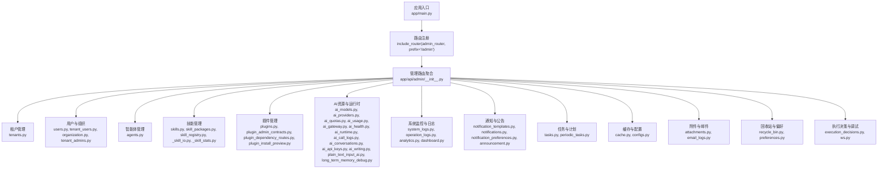
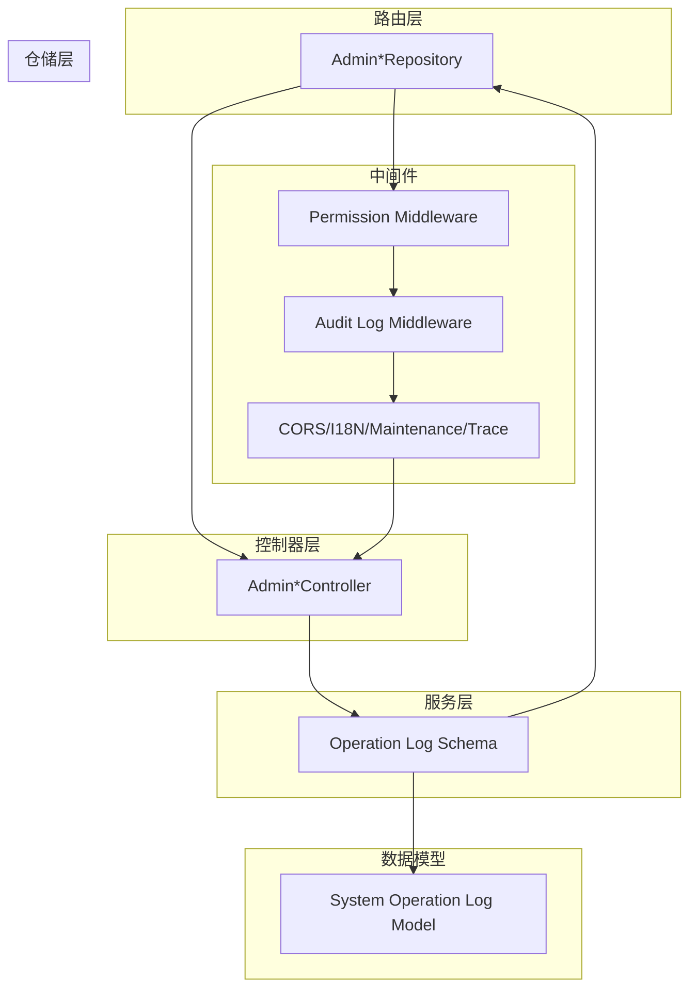
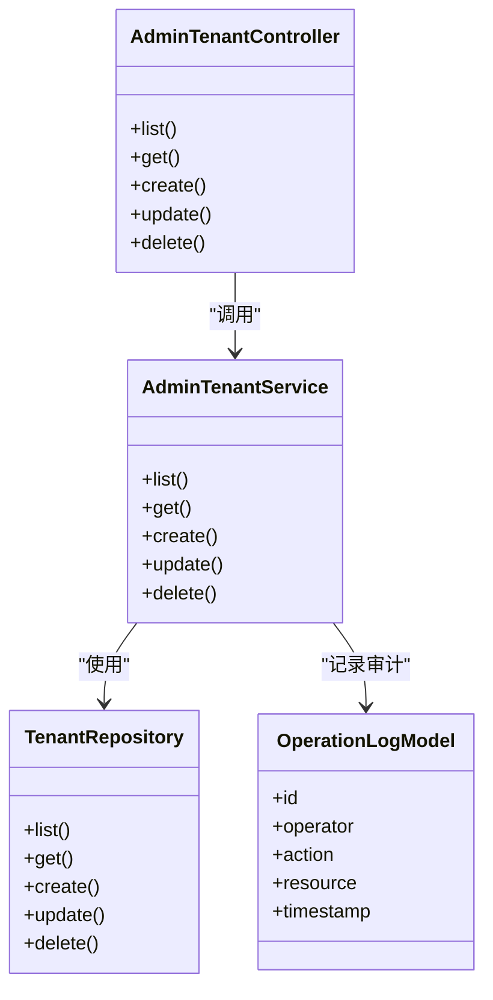

# 管理API

<cite>
**本文档引用的文件**
- [backend/app/api/admin/__init__.py](file://backend/app/api/admin/__init__.py)
- [backend/app/api/__init__.py](file://backend/app/api/__init__.py)
- [backend/app/main.py](file://backend/app/main.py)
- [backend/app/services/common/auth_domains/admin_auth.py](file://backend/app/services/common/auth_domains/admin_auth.py)
- [backend/app/middleware/audit_log.py](file://backend/app/middleware/audit_log.py)
- [backend/app/middleware/permission.py](file://backend/app/middleware/permission.py)
- [backend/app/rbac/decorators.py](file://backend/app/rbac/decorators.py)
- [backend/app/models/system/operation_log.py](file://backend/app/models/system/operation_log.py)
- [backend/app/schemas/system/operation_log.py](file://backend/app/schemas/system/operation_log.py)
- [backend/app/repositories/system/operation_log_repo.py](file://backend/app/repositories/system/operation_log_repo.py)
- [backend/app/api/admin/tenants.py](file://backend/app/api/admin/tenants.py)
- [backend/app/api/admin/users.py](file://backend/app/api/admin/users.py)
- [backend/app/api/admin/agents.py](file://backend/app/api/admin/agents.py)
- [backend/app/api/admin/skills.py](file://backend/app/api/admin/skills.py)
- [backend/app/api/admin/plugins.py](file://backend/app/api/admin/plugins.py)
- [backend/app/api/admin/system_logs.py](file://backend/app/api/admin/system_logs.py)
- [backend/app/api/admin/operation_logs.py](file://backend/app/api/admin/operation_logs.py)
- [backend/app/api/admin/analytics.py](file://backend/app/api/admin/analytics.py)
- [backend/app/api/admin/dashboard.py](file://backend/app/api/admin/dashboard.py)
- [backend/app/api/admin/recycle_bin.py](file://backend/app/api/admin/recycle_bin.py)
- [backend/app/api/admin/preferences.py](file://backend/app/api/admin/preferences.py)
- [backend/app/api/admin/permissions.py](file://backend/app/api/admin/permissions.py)
- [backend/app/api/admin/organization.py](file://backend/app/api/admin/organization.py)
- [backend/app/api/admin/tenant_admins.py](file://backend/app/api/admin/tenant_admins.py)
- [backend/app/api/admin/tenant_users.py](file://backend/app/api/admin/tenant_users.py)
- [backend/app/api/admin/tenant_domains.py](file://backend/app/api/admin/tenant_domains.py)
- [backend/app/api/admin/ai_models.py](file://backend/app/api/admin/ai_models.py)
- [backend/app/api/admin/ai_providers.py](file://backend/app/api/admin/ai_providers.py)
- [backend/app/api/admin/ai_quotas.py](file://backend/app/api/admin/ai_quotas.py)
- [backend/app/api/admin/ai_usage.py](file://backend/app/api/admin/ai_usage.py)
- [backend/app/api/admin/ai_gateway.py](file://backend/app/api/admin/ai_gateway.py)
- [backend/app/api/admin/ai_health.py](file://backend/app/api/admin/ai_health.py)
- [backend/app/api/admin/ai_call_logs.py](file://backend/app/api/admin/ai_call_logs.py)
- [backend/app/api/admin/ai_conversations.py](file://backend/app/api/admin/ai_conversations.py)
- [backend/app/api/admin/knowledge_bases.py](file://backend/app/api/admin/knowledge_bases.py)
- [backend/app/api/admin/notification_templates.py](file://backend/app/api/admin/notification_templates.py)
- [backend/app/api/admin/notifications.py](file://backend/app/api/admin/notifications.py)
- [backend/app/api/admin/tasks.py](file://backend/app/api/admin/tasks.py)
- [backend/app/api/admin/periodic_tasks.py](file://backend/app/api/admin/periodic_tasks.py)
- [backend/app/api/admin/cache.py](file://backend/app/api/admin/cache.py)
- [backend/app/api/admin/configs.py](file://backend/app/api/admin/configs.py)
- [backend/app/api/admin/codegen.py](file://backend/app/api/admin/codegen.py)
- [backend/app/api/admin/announcement.py](file://backend/app/api/admin/announcement.py)
- [backend/app/api/admin/execution_decisions.py](file://backend/app/api/admin/execution_decisions.py)
- [backend/app/api/admin/long_term_memory_debug.py](file://backend/app/api/admin/long_term_memory_debug.py)
- [backend/app/api/admin/plain_text_input_ai.py](file://backend/app/api/admin/plain_text_input_ai.py)
- [backend/app/api/admin/ws.py](file://backend/app/api/admin/ws.py)
- [backend/app/api/admin/ai_agent_chat.py](file://backend/app/api/admin/ai_agent_chat.py)
- [backend/app/api/admin/ai_api_keys.py](file://backend/app/api/admin/ai_api_keys.py)
- [backend/app/api/admin/ai_runtime.py](file://backend/app/api/admin/ai_runtime.py)
- [backend/app/api/admin/ai_writing.py](file://backend/app/api/admin/ai_writing.py)
- [backend/app/api/admin/attachment.py](file://backend/app/api/admin/attachments.py)
- [backend/app/api/admin/email_logs.py](file://backend/app/api/admin/email_logs.py)
- [backend/app/api/admin/notification_preferences.py](file://backend/app/api/admin/notification_preferences.py)
- [backend/app/api/admin/skill_packages.py](file://backend/app/api/admin/skill_packages.py)
- [backend/app/api/admin/skill_registry.py](file://backend/app/api/admin/skill_registry.py)
- [backend/app/api/admin/_skill_io.py](file://backend/app/api/admin/_skill_io.py)
- [backend/app/api/admin/_skill_stats.py](file://backend/app/api/admin/_skill_stats.py)
- [backend/app/api/admin/plugin_admin_contracts.py](file://backend/app/api/admin/plugin_admin_contracts.py)
- [backend/app/api/admin/plugin_dependency_routes.py](file://backend/app/api/admin/plugin_dependency_routes.py)
- [backend/app/api/admin/plugin_install_preview.py](file://backend/app/api/admin/plugin_install_preview.py)
</cite>

## 目录
1. [简介](#简介)
2. [项目结构](#项目结构)
3. [核心组件](#核心组件)
4. [架构总览](#架构总览)
5. [详细组件分析](#详细组件分析)
6. [依赖关系分析](#依赖关系分析)
7. [性能考虑](#性能考虑)
8. [故障排除指南](#故障排除指南)
9. [结论](#结论)
10. [附录](#附录)

## 简介
本文件为平台管理API的权威文档，覆盖管理员专用的RESTful接口，包括但不限于：租户管理、用户与组织管理、智能体管理、技能管理、插件管理、AI资源与运行时管理、系统监控与日志、运营与通知、任务与计划、回收站与偏好设置等。文档将逐项说明各端点的认证要求、权限级别、请求/响应格式与业务逻辑，并提供从创建到删除的完整工作流示例。同时阐述安全策略、审计日志与操作权限控制机制，并给出批量操作、数据导出与系统维护相关接口说明。

## 项目结构
管理API通过统一的前缀 `/admin` 对外暴露，所有管理端路由在应用启动时注册。管理端控制器按功能域拆分，每个控制器负责一组相关的CRUD与查询接口。权限控制基于RBAC装饰器与中间件实现，审计日志贯穿所有写操作。

**图表来源**
- [backend/app/main.py:849-852](file://backend/app/main.py#L849-L852)
- [backend/app/api/admin/__init__.py:12-32](file://backend/app/api/admin/__init__.py#L12-L32)

**章节来源**
- [backend/app/main.py:849-852](file://backend/app/main.py#L849-L852)
- [backend/app/api/admin/__init__.py:12-32](file://backend/app/api/admin/__init__.py#L12-L32)

## 核心组件
- 路由与注册
  - 管理路由在应用启动时通过 include_router 注册，前缀为 `/admin`，并绑定到 admin_router。
  - 所有管理端控制器均在此聚合，形成清晰的功能域划分。
- 认证与会话
  - 管理员登录采用专用认证域，生成访问令牌与刷新令牌，并记录活动令牌与登录信息。
  - 登录成功后返回标准令牌结构，支持会话超时配置。
- 权限与RBAC
  - 基于RBAC装饰器与中间件实现细粒度权限控制，确保仅具备相应角色与数据范围的管理员可访问对应资源。
- 审计与日志
  - 写操作自动记录操作日志，包含操作人、目标资源、动作类型、时间戳与上下文信息，便于审计与追踪。
- 中间件链
  - 包含权限校验、审计日志、跨域、国际化、维护模式、追踪等中间件，保障安全性与可观测性。

**章节来源**
- [backend/app/main.py:849-852](file://backend/app/main.py#L849-L852)
- [backend/app/services/common/auth_domains/admin_auth.py:37-86](file://backend/app/services/common/auth_domains/admin_auth.py#L37-L86)
- [backend/app/middleware/permission.py](file://backend/app/middleware/permission.py)
- [backend/app/middleware/audit_log.py](file://backend/app/middleware/audit_log.py)
- [backend/app/rbac/decorators.py](file://backend/app/rbac/decorators.py)

## 架构总览
管理API采用分层架构：路由层负责HTTP协议与参数解析；控制器层处理业务流程与调用服务层；服务层封装领域逻辑与数据访问；仓储层负责数据库交互；模型与Schema层定义数据结构与验证规则。中间件贯穿请求生命周期，提供统一的安全与可观测性能力。

**图表来源**
- [backend/app/api/admin/__init__.py:12-32](file://backend/app/api/admin/__init__.py#L12-L32)
- [backend/app/middleware/permission.py](file://backend/app/middleware/permission.py)
- [backend/app/middleware/audit_log.py](file://backend/app/middleware/audit_log.py)
- [backend/app/models/system/operation_log.py](file://backend/app/models/system/operation_log.py)
- [backend/app/schemas/system/operation_log.py](file://backend/app/schemas/system/operation_log.py)

## 详细组件分析

### 租户管理
- 功能概述
  - 提供租户的全生命周期管理，包括创建、更新、查询、删除与状态变更。
  - 支持租户域名配置、管理员分配、用户与组织关联。
- 关键端点
  - GET /admin/tenants：分页查询租户列表，支持过滤与排序。
  - GET /admin/tenants/{id}：获取租户详情。
  - POST /admin/tenants：创建租户，需提供基础信息与初始配置。
  - PUT /admin/tenants/{id}：更新租户信息。
  - DELETE /admin/tenants/{id}：删除租户（软删除或硬删除）。
  - POST /admin/tenants/{id}/disable：禁用租户。
  - POST /admin/tenants/{id}/enable：启用租户。
- 认证与权限
  - 需要管理员身份，部分操作需全局超级权限。
- 请求/响应
  - 请求参数遵循租户Schema定义；响应包含租户基本信息、状态、创建时间等。
- 业务逻辑
  - 创建租户时同步初始化默认组织、角色与配额；删除租户时触发回收站流程。
- 工作流示例
  - 创建 → 配置域名与管理员 → 启用 → 日常运维 → 禁用/删除

**章节来源**
- [backend/app/api/admin/tenants.py](file://backend/app/api/admin/tenants.py)
- [backend/app/api/admin/tenant_domains.py](file://backend/app/api/admin/tenant_domains.py)
- [backend/app/api/admin/tenant_admins.py](file://backend/app/api/admin/tenant_admins.py)
- [backend/app/api/admin/tenant_users.py](file://backend/app/api/admin/tenant_users.py)

### 用户与组织管理
- 功能概述
  - 管理平台级用户与组织节点，支持用户角色分配、组织树管理、成员活动审计。
- 关键端点
  - GET /admin/users：查询用户列表。
  - GET /admin/users/{id}：获取用户详情。
  - PUT /admin/users/{id}：更新用户信息。
  - POST /admin/users/{id}/sessions/force-logout：强制登出用户会话。
  - GET /admin/organizations/tree：获取组织树。
  - POST /admin/organizations：创建组织节点。
  - PUT /admin/organizations/{id}：更新组织节点。
  - DELETE /admin/organizations/{id}：删除组织节点。
- 权限控制
  - RBAC装饰器限制对组织节点的操作范围，确保管理员只能管理其授权范围内的节点。
- 审计日志
  - 用户登录、会话强制登出、组织节点变更等均记录操作日志。

**章节来源**
- [backend/app/api/admin/users.py](file://backend/app/api/admin/users.py)
- [backend/app/api/admin/organization.py](file://backend/app/api/admin/organization.py)
- [backend/app/middleware/audit_log.py](file://backend/app/middleware/audit_log.py)

### 智能体管理
- 功能概述
  - 提供智能体的创建、编辑、发布、版本管理与可见性控制。
- 关键端点
  - GET /admin/agents：分页查询智能体。
  - GET /admin/agents/{id}：获取智能体详情。
  - POST /admin/agents：创建智能体。
  - PUT /admin/agents/{id}：更新智能体。
  - DELETE /admin/agents/{id}：删除智能体。
  - POST /admin/agent-assignments：批量分配智能体给租户。
- 业务逻辑
  - 智能体与知识库、技能包绑定，支持上下文与输出模式配置。
- 工作流示例
  - 设计 → 绑定技能包与知识库 → 发布 → 分配给租户 → 运行与监控

**章节来源**
- [backend/app/api/admin/agents.py](file://backend/app/api/admin/agents.py)
- [backend/app/api/admin/agent_assignments.py](file://backend/app/api/admin/agent_assignments.py)

### 技能管理
- 功能概述
  - 技能的创建、导入导出、统计与市场注册。
- 关键端点
  - GET /admin/skills：查询技能列表。
  - GET /admin/skills/{id}：获取技能详情。
  - POST /admin/skills：创建技能。
  - PUT /admin/skills/{id}：更新技能。
  - DELETE /admin/skills/{id}：删除技能。
  - POST /admin/skills/_import：导入技能（支持批量）。
  - POST /admin/skills/_export：导出技能（支持批量）。
  - GET /admin/skill-packages：技能包管理。
  - GET /admin/skill-registry：技能注册表。
- 工作流示例
  - 设计 → 导入/导出 → 绑定到智能体 → 发布 → 监控调用统计

**章节来源**
- [backend/app/api/admin/skills.py](file://backend/app/api/admin/skills.py)
- [backend/app/api/admin/skill_packages.py](file://backend/app/api/admin/skill_packages.py)
- [backend/app/api/admin/skill_registry.py](file://backend/app/api/admin/skill_registry.py)
- [backend/app/api/admin/_skill_io.py](file://backend/app/api/admin/_skill_io.py)
- [backend/app/api/admin/_skill_stats.py](file://backend/app/api/admin/_skill_stats.py)

### 插件管理
- 功能概述
  - 插件的安装预览、依赖管理、市场注册与生命周期维护。
- 关键端点
  - GET /admin/plugins：查询插件列表。
  - GET /admin/plugins/{name}：获取插件详情。
  - POST /admin/plugins/{name}/install-preview：安装预览。
  - POST /admin/plugins/{name}/install：安装插件。
  - POST /admin/plugins/{name}/uninstall：卸载插件。
  - POST /admin/plugins/{name}/refresh-schedules：刷新调度。
  - GET /admin/plugin-dependency-routes：插件依赖路由。
  - GET /admin/plugin-admin-contracts：插件管理契约。
- 安全策略
  - 插件安装前进行许可证与依赖检查，确保系统安全与合规。
- 工作流示例
  - 预览 → 审核 → 安装 → 初始化 → 运行

**章节来源**
- [backend/app/api/admin/plugins.py](file://backend/app/api/admin/plugins.py)
- [backend/app/api/admin/plugin_install_preview.py](file://backend/app/api/admin/plugin_install_preview.py)
- [backend/app/api/admin/plugin_dependency_routes.py](file://backend/app/api/admin/plugin_dependency_routes.py)
- [backend/app/api/admin/plugin_admin_contracts.py](file://backend/app/api/admin/plugin_admin_contracts.py)

### AI资源与运行时管理
- 功能概述
  - AI模型、提供商、配额、用量、网关、健康检查、调用日志与会话管理。
- 关键端点
  - 模型与提供商：GET/POST/PUT/DELETE /admin/ai-models, /admin/ai-providers
  - 配额与用量：GET /admin/ai-quotas, /admin/ai-usage
  - 网关与健康：GET /admin/ai-gateway, /admin/ai-health
  - 调用日志与会话：GET /admin/ai-call-logs, /admin/ai-conversations
  - API密钥与运行时：GET /admin/ai-api-keys, /admin/ai-runtime
  - 写入与纯文本输入：GET /admin/ai-writing, /admin/plain-text-input-ai
- 业务逻辑
  - 模型与提供商的可用性与路由策略影响智能体调用；配额与用量用于成本控制与容量规划。
- 工作流示例
  - 配置提供商 → 创建模型 → 设置配额 → 监控用量 → 处理异常

**章节来源**
- [backend/app/api/admin/ai_models.py](file://backend/app/api/admin/ai_models.py)
- [backend/app/api/admin/ai_providers.py](file://backend/app/api/admin/ai_providers.py)
- [backend/app/api/admin/ai_quotas.py](file://backend/app/api/admin/ai_quotas.py)
- [backend/app/api/admin/ai_usage.py](file://backend/app/api/admin/ai_usage.py)
- [backend/app/api/admin/ai_gateway.py](file://backend/app/api/admin/ai_gateway.py)
- [backend/app/api/admin/ai_health.py](file://backend/app/api/admin/ai_health.py)
- [backend/app/api/admin/ai_call_logs.py](file://backend/app/api/admin/ai_call_logs.py)
- [backend/app/api/admin/ai_conversations.py](file://backend/app/api/admin/ai_conversations.py)
- [backend/app/api/admin/ai_api_keys.py](file://backend/app/api/admin/ai_api_keys.py)
- [backend/app/api/admin/ai_runtime.py](file://backend/app/api/admin/ai_runtime.py)
- [backend/app/api/admin/ai_writing.py](file://backend/app/api/admin/ai_writing.py)
- [backend/app/api/admin/plain_text_input_ai.py](file://backend/app/api/admin/plain_text_input_ai.py)

### 系统监控与日志
- 功能概述
  - 系统日志、操作日志、仪表盘与分析报表。
- 关键端点
  - GET /admin/system-logs：系统日志查询。
  - GET /admin/operation-logs：操作日志查询。
  - GET /admin/dashboard：仪表盘概览。
  - GET /admin/analytics：分析报表。
- 审计日志
  - 所有写操作自动记录，包含操作人、资源、动作、时间与上下文，支持检索与导出。

**章节来源**
- [backend/app/api/admin/system_logs.py](file://backend/app/api/admin/system_logs.py)
- [backend/app/api/admin/operation_logs.py](file://backend/app/api/admin/operation_logs.py)
- [backend/app/api/admin/dashboard.py](file://backend/app/api/admin/dashboard.py)
- [backend/app/api/admin/analytics.py](file://backend/app/api/admin/analytics.py)
- [backend/app/models/system/operation_log.py](file://backend/app/models/system/operation_log.py)
- [backend/app/schemas/system/operation_log.py](file://backend/app/schemas/system/operation_log.py)
- [backend/app/repositories/system/operation_log_repo.py](file://backend/app/repositories/system/operation_log_repo.py)

### 通知与公告
- 功能概述
  - 通知模板、通知发送与偏好设置。
- 关键端点
  - GET/POST/PUT/DELETE /admin/notification-templates
  - GET /admin/notifications
  - GET /admin/notification-preferences
  - POST /admin/announcement
- 工作流示例
  - 设计模板 → 配置偏好 → 发送通知 → 跟踪结果

**章节来源**
- [backend/app/api/admin/notification_templates.py](file://backend/app/api/admin/notification_templates.py)
- [backend/app/api/admin/notifications.py](file://backend/app/api/admin/notifications.py)
- [backend/app/api/admin/notification_preferences.py](file://backend/app/api/admin/notification_preferences.py)
- [backend/app/api/admin/announcement.py](file://backend/app/api/admin/announcement.py)

### 任务与计划
- 功能概述
  - 一次性任务与周期性任务的创建、调度与清理。
- 关键端点
  - GET/POST/PUT/DELETE /admin/tasks, /admin/periodic-tasks
  - POST /admin/tasks/{id}/cancel
  - POST /admin/periodic-tasks/{id}/pause/resume
- 工作流示例
  - 定义任务 → 配置调度 → 触发执行 → 查看结果 → 清理

**章节来源**
- [backend/app/api/admin/tasks.py](file://backend/app/api/admin/tasks.py)
- [backend/app/api/admin/periodic_tasks.py](file://backend/app/api/admin/periodic_tasks.py)

### 缓存与配置
- 功能概述
  - 缓存管理与系统配置。
- 关键端点
  - GET/POST/PUT /admin/cache
  - GET/POST/PUT /admin/configs
- 工作流示例
  - 查询配置 → 更新配置 → 刷新缓存

**章节来源**
- [backend/app/api/admin/cache.py](file://backend/app/api/admin/cache.py)
- [backend/app/api/admin/configs.py](file://backend/app/api/admin/configs.py)

### 附件与邮件
- 功能概述
  - 附件上传与邮件日志查询。
- 关键端点
  - GET /admin/attachments
  - GET /admin/email-logs

**章节来源**
- [backend/app/api/admin/attachments.py](file://backend/app/api/admin/attachments.py)
- [backend/app/api/admin/email_logs.py](file://backend/app/api/admin/email_logs.py)

### 回收站与偏好
- 功能概述
  - 资源回收与管理员偏好设置。
- 关键端点
  - GET /admin/recycle-bin
  - GET/POST/PUT /admin/preferences

**章节来源**
- [backend/app/api/admin/recycle_bin.py](file://backend/app/api/admin/recycle_bin.py)
- [backend/app/api/admin/preferences.py](file://backend/app/api/admin/preferences.py)

### 执行决策与调试
- 功能概述
  - 执行决策记录与长程记忆调试。
- 关键端点
  - GET /admin/execution-decisions
  - GET /admin/long-term-memory-debug
  - WS /admin/ws

**章节来源**
- [backend/app/api/admin/execution_decisions.py](file://backend/app/api/admin/execution_decisions.py)
- [backend/app/api/admin/long_term_memory_debug.py](file://backend/app/api/admin/long_term_memory_debug.py)
- [backend/app/api/admin/ws.py](file://backend/app/api/admin/ws.py)

## 依赖关系分析
管理API的依赖关系围绕控制器、服务、仓储与模型展开，中间件提供横切关注点。下图展示典型控制器到服务与仓储的依赖关系：

**图表来源**
- [backend/app/api/admin/tenants.py](file://backend/app/api/admin/tenants.py)
- [backend/app/api/admin/__init__.py:12-32](file://backend/app/api/admin/__init__.py#L12-L32)
- [backend/app/models/system/operation_log.py](file://backend/app/models/system/operation_log.py)

**章节来源**
- [backend/app/api/admin/tenants.py](file://backend/app/api/admin/tenants.py)
- [backend/app/api/admin/__init__.py:12-32](file://backend/app/api/admin/__init__.py#L12-L32)

## 性能考虑
- 分页与过滤
  - 列表查询应使用分页参数与索引字段过滤，避免全表扫描。
- 缓存策略
  - 对高频读取的配置与静态数据使用缓存，降低数据库压力。
- 异步任务
  - 大批量导入/导出与复杂计算建议异步执行，结合任务队列与进度反馈。
- 监控指标
  - 结合Prometheus指标端点与系统健康检查，持续观测关键指标。

## 故障排除指南
- 认证失败
  - 检查管理员登录凭据与会话是否过期；确认访问令牌与刷新令牌的有效性。
- 权限不足
  - 确认管理员角色与数据范围；检查RBAC装饰器与中间件是否正确生效。
- 审计日志缺失
  - 确认写操作已触发审计中间件；检查操作日志表结构与索引。
- 插件安装失败
  - 检查许可证与依赖；查看安装预览与错误日志。

**章节来源**
- [backend/app/services/common/auth_domains/admin_auth.py:37-86](file://backend/app/services/common/auth_domains/admin_auth.py#L37-L86)
- [backend/app/middleware/permission.py](file://backend/app/middleware/permission.py)
- [backend/app/middleware/audit_log.py](file://backend/app/middleware/audit_log.py)
- [backend/app/api/admin/plugins.py](file://backend/app/api/admin/plugins.py)

## 结论
管理API以清晰的分层架构与完善的中间件体系，提供了覆盖平台全生命周期的管理能力。通过严格的RBAC与审计日志，确保操作的可追溯与合规；通过丰富的监控与日志接口，支撑系统的可观测性与稳定性。建议在生产环境中结合缓存、异步任务与指标监控，持续优化性能与可靠性。

## 附录
- 认证与会话
  - 管理员登录成功后返回访问令牌与刷新令牌，支持会话超时配置。
- 权限装饰器与中间件
  - 使用RBAC装饰器与权限中间件，确保最小权限原则与数据范围控制。
- 审计日志
  - 所有写操作自动记录，支持检索与导出，满足合规要求。

**章节来源**
- [backend/app/services/common/auth_domains/admin_auth.py:37-86](file://backend/app/services/common/auth_domains/admin_auth.py#L37-L86)
- [backend/app/rbac/decorators.py](file://backend/app/rbac/decorators.py)
- [backend/app/middleware/permission.py](file://backend/app/middleware/permission.py)
- [backend/app/middleware/audit_log.py](file://backend/app/middleware/audit_log.py)
- [backend/app/models/system/operation_log.py](file://backend/app/models/system/operation_log.py)