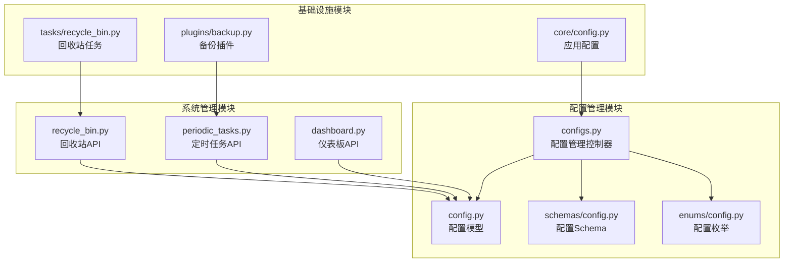
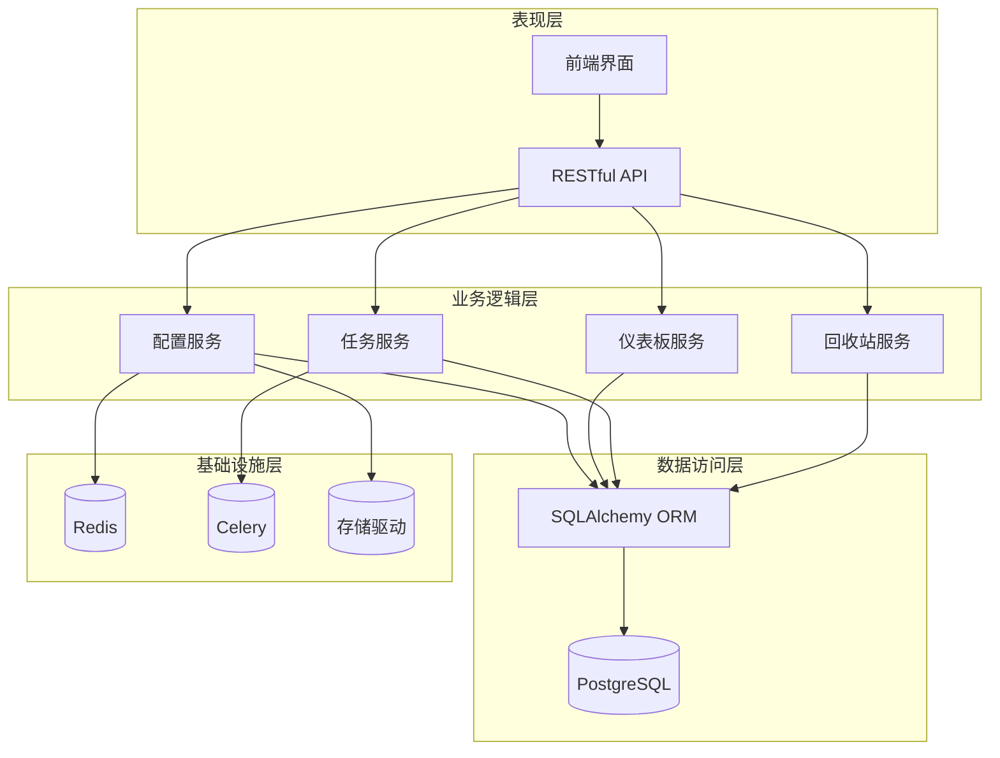
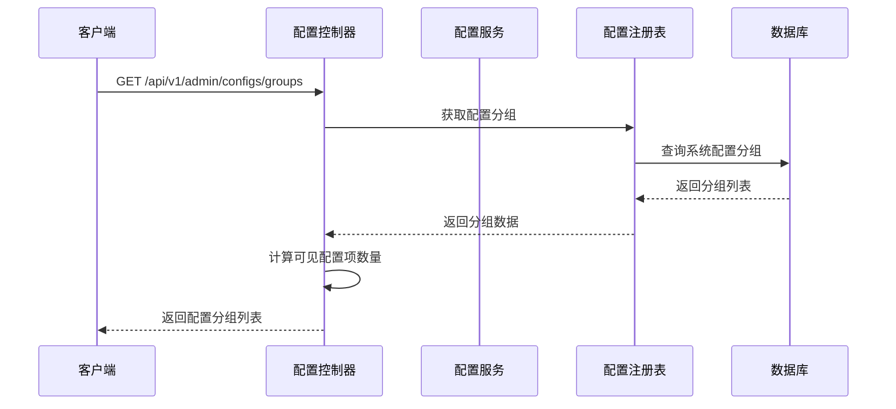
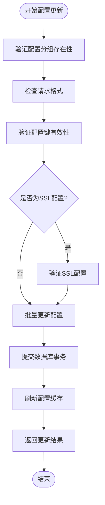
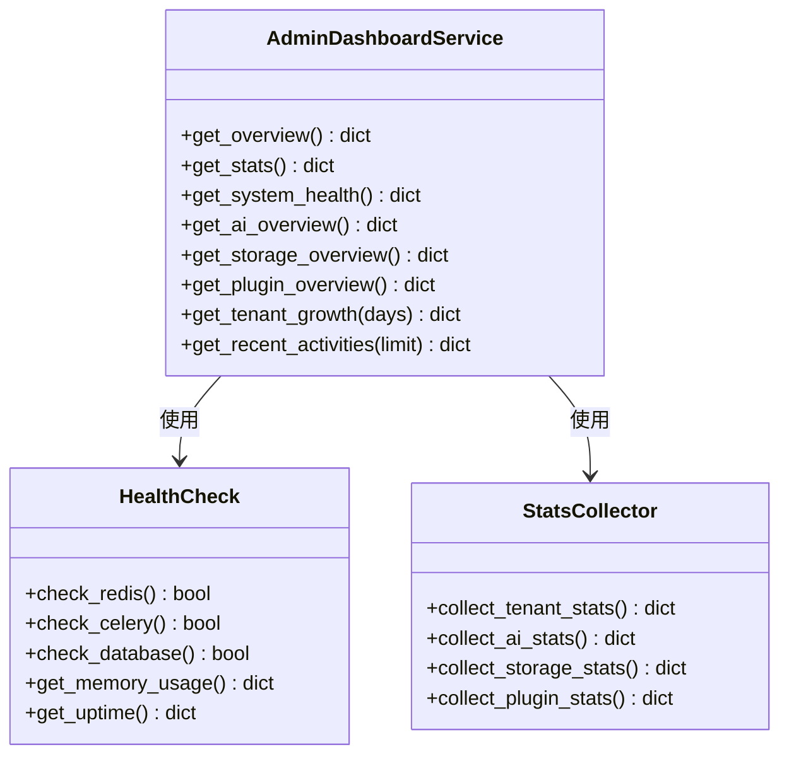
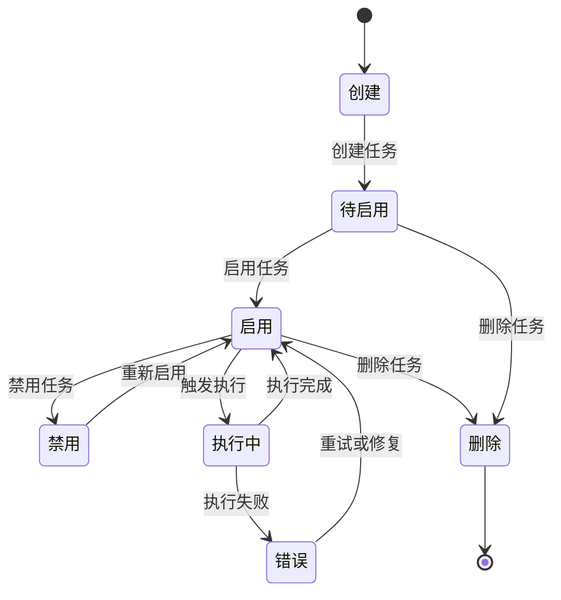
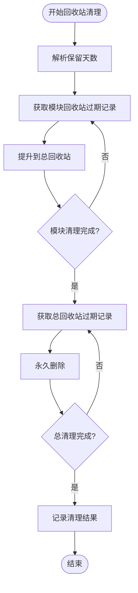
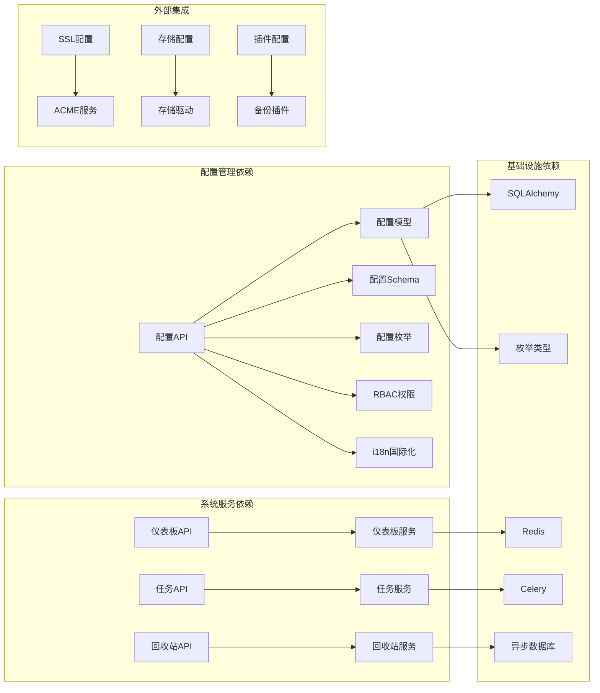

# 系统配置API

<cite>
**本文档引用的文件**
- [backend/app/api/admin/configs.py](file://backend/app/api/admin/configs.py)
- [backend/app/models/system/config.py](file://backend/app/models/system/config.py)
- [backend/app/schemas/system/config.py](file://backend/app/schemas/system/config.py)
- [backend/app/core/config.py](file://backend/app/core/config.py)
- [backend/app/enums/config.py](file://backend/app/enums/config.py)
- [backend/app/api/admin/dashboard.py](file://backend/app/api/admin/dashboard.py)
- [backend/app/api/admin/periodic_tasks.py](file://backend/app/api/admin/periodic_tasks.py)
- [backend/app/api/admin/recycle_bin.py](file://backend/app/api/admin/recycle_bin.py)
- [backend/app/plugins/backup.py](file://backend/app/plugins/backup.py)
- [backend/app/tasks/recycle_bin.py](file://backend/app/tasks/recycle_bin.py)
</cite>

## 目录
1. [简介](#简介)
2. [项目结构](#项目结构)
3. [核心组件](#核心组件)
4. [架构概览](#架构概览)
5. [详细组件分析](#详细组件分析)
6. [依赖分析](#依赖分析)
7. [性能考虑](#性能考虑)
8. [故障排除指南](#故障排除指南)
9. [结论](#结论)

## 简介

系统配置API是NovusAI SaaS平台的核心管理接口，提供全面的系统参数配置、仪表板定制、定时任务管理、后台任务调度、回收站管理等功能。该API支持平台级和租户级配置管理，具备完善的权限控制、参数验证、批量配置和配置备份恢复机制。

系统配置API采用模块化设计，通过统一的配置注册表管理所有配置项，支持多种配置值类型（字符串、数字、布尔值、下拉选择、多选、JSON对象、多行文本、HTML、密码、颜色选择器、图片上传、标签选择器、文件上传），并提供完整的配置生命周期管理。

## 项目结构

系统配置API主要分布在以下模块中：

**图表来源**
- [backend/app/api/admin/configs.py:1-474](file://backend/app/api/admin/configs.py#L1-L474)
- [backend/app/models/system/config.py:1-357](file://backend/app/models/system/config.py#L1-L357)
- [backend/app/schemas/system/config.py:1-141](file://backend/app/schemas/system/config.py#L1-L141)

**章节来源**
- [backend/app/api/admin/configs.py:1-474](file://backend/app/api/admin/configs.py#L1-L474)
- [backend/app/models/system/config.py:1-357](file://backend/app/models/system/config.py#L1-L357)
- [backend/app/schemas/system/config.py:1-141](file://backend/app/schemas/system/config.py#L1-L141)

## 核心组件

### 配置管理系统

配置管理系统是整个API的核心，提供以下关键功能：

- **配置分组管理**：支持平台级和租户级配置分组
- **配置项管理**：支持多种配置值类型和验证规则
- **批量配置更新**：支持扁平格式和包裹格式的配置更新
- **配置验证**：内置参数验证和显示规则支持

### 仪表板管理

仪表板API提供系统健康监控和统计数据展示：

- **系统健康状态**：Redis/Celery/数据库连通性检查
- **AI使用概览**：总调用次数、Token使用量、活跃供应商统计
- **存储使用概览**：总文件数、总存储大小、驱动分布
- **插件状态概览**：已安装、已启用、已禁用、错误数量统计

### 定时任务管理

定时任务API提供完整的任务生命周期管理：

- **任务创建/更新/删除**：支持CRUD操作
- **任务绑定管理**：支持企业级任务绑定
- **手动触发**：支持立即执行定时任务
- **启用/禁用**：动态控制任务执行

### 回收站管理

回收站API提供两级回收站管理机制：

- **模块回收站**：按模块分类的临时删除记录
- **总回收站**：跨模块的全局回收站
- **自动清理**：基于保留期限的自动清理机制
- **数据恢复**：支持从回收站恢复数据

**章节来源**
- [backend/app/api/admin/dashboard.py:1-156](file://backend/app/api/admin/dashboard.py#L1-L156)
- [backend/app/api/admin/periodic_tasks.py:1-473](file://backend/app/api/admin/periodic_tasks.py#L1-L473)
- [backend/app/api/admin/recycle_bin.py:1-212](file://backend/app/api/admin/recycle_bin.py#L1-L212)

## 架构概览

系统配置API采用分层架构设计，确保高内聚低耦合：

**图表来源**
- [backend/app/api/admin/configs.py:120-467](file://backend/app/api/admin/configs.py#L120-L467)
- [backend/app/api/admin/dashboard.py:21-155](file://backend/app/api/admin/dashboard.py#L21-L155)
- [backend/app/api/admin/periodic_tasks.py:52-472](file://backend/app/api/admin/periodic_tasks.py#L52-L472)

## 详细组件分析

### 配置管理控制器

配置管理控制器提供平台级配置的完整管理功能：

#### 配置分组接口

**图表来源**
- [backend/app/api/admin/configs.py:134-174](file://backend/app/api/admin/configs.py#L134-L174)

#### 配置更新流程

**图表来源**
- [backend/app/api/admin/configs.py:255-346](file://backend/app/api/admin/configs.py#L255-L346)

**章节来源**
- [backend/app/api/admin/configs.py:120-467](file://backend/app/api/admin/configs.py#L120-L467)

### 仪表板服务

仪表板服务提供系统监控和统计功能：

#### 系统健康检查

**图表来源**
- [backend/app/api/admin/dashboard.py:24-152](file://backend/app/api/admin/dashboard.py#L24-L152)

**章节来源**
- [backend/app/api/admin/dashboard.py:1-156](file://backend/app/api/admin/dashboard.py#L1-L156)

### 定时任务管理

定时任务管理提供完整的任务调度功能：

#### 任务生命周期管理

**图表来源**
- [backend/app/api/admin/periodic_tasks.py:136-470](file://backend/app/api/admin/periodic_tasks.py#L136-L470)

**章节来源**
- [backend/app/api/admin/periodic_tasks.py:1-473](file://backend/app/api/admin/periodic_tasks.py#L1-L473)

### 回收站管理

回收站管理提供两级数据保护机制：

#### 回收站清理流程

**图表来源**
- [backend/app/tasks/recycle_bin.py:235-382](file://backend/app/tasks/recycle_bin.py#L235-L382)

**章节来源**
- [backend/app/api/admin/recycle_bin.py:1-212](file://backend/app/api/admin/recycle_bin.py#L1-L212)
- [backend/app/tasks/recycle_bin.py:1-383](file://backend/app/tasks/recycle_bin.py#L1-L383)

## 依赖分析

系统配置API的依赖关系如下：

**图表来源**
- [backend/app/models/system/config.py:1-357](file://backend/app/models/system/config.py#L1-L357)
- [backend/app/enums/config.py:1-44](file://backend/app/enums/config.py#L1-L44)

**章节来源**
- [backend/app/core/config.py:1-305](file://backend/app/core/config.py#L1-L305)
- [backend/app/plugins/backup.py:1-312](file://backend/app/plugins/backup.py#L1-L312)

## 性能考虑

系统配置API在设计时充分考虑了性能优化：

### 缓存策略
- 配置注册表使用LRU缓存减少数据库查询
- 配置值缓存支持快速读取
- 仪表板数据定期缓存

### 批处理优化
- 批量配置更新支持事务性操作
- 回收站清理采用分批处理
- 定时任务批量执行

### 连接池管理
- 数据库连接池配置优化
- Redis连接池复用
- Celery工作进程池管理

## 故障排除指南

### 常见配置问题

**配置更新失败**
- 检查配置键的有效性
- 验证配置值的格式和范围
- 确认权限授权状态

**仪表板数据异常**
- 检查Redis连接状态
- 验证Celery任务队列
- 确认数据库连通性

**定时任务执行失败**
- 查看任务日志输出
- 检查任务依赖服务
- 验证任务参数配置

### 回收站清理问题

**清理任务未执行**
- 检查定时任务配置
- 验证清理条件设置
- 确认保留期限配置

**数据恢复失败**
- 检查备份文件完整性
- 验证恢复权限
- 确认数据一致性

**章节来源**
- [backend/app/api/admin/configs.py:290-346](file://backend/app/api/admin/configs.py#L290-L346)
- [backend/app/tasks/recycle_bin.py:320-382](file://backend/app/tasks/recycle_bin.py#L320-L382)

## 结论

系统配置API提供了完整的系统管理解决方案，具有以下特点：

1. **模块化设计**：清晰的职责分离和依赖管理
2. **权限控制**：基于RBAC的细粒度权限管理
3. **数据安全**：配置值加密存储和访问控制
4. **扩展性强**：支持插件化的配置扩展
5. **监控完善**：全面的系统健康监控和告警
6. **运维友好**：支持配置备份恢复和批量管理

该API为NovusAI SaaS平台提供了稳定可靠的配置管理基础，支持平台级和租户级的灵活配置需求，满足企业级应用的复杂管理场景。