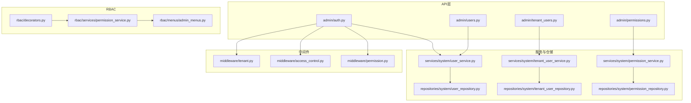
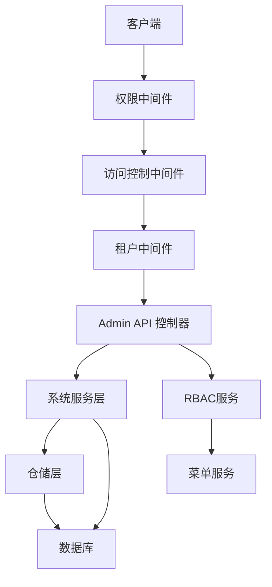
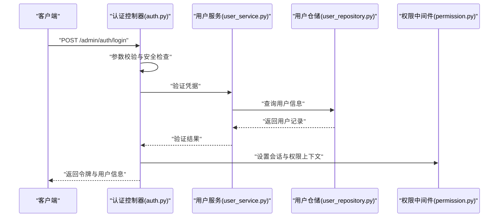
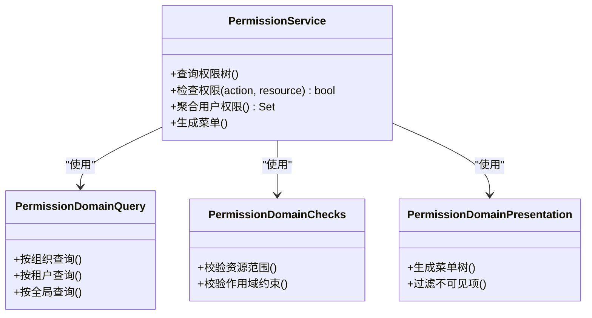
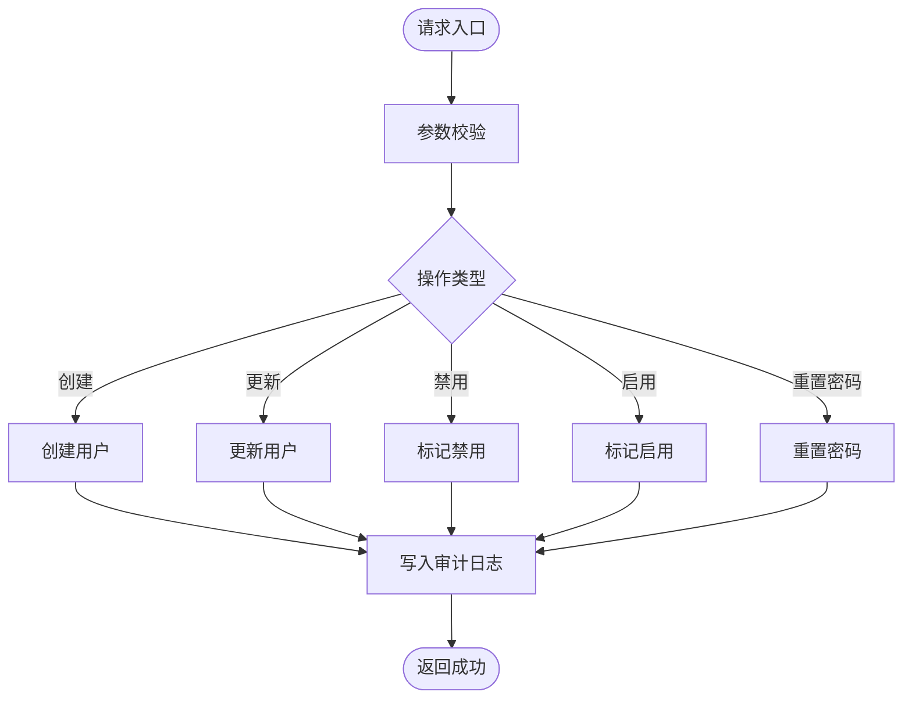
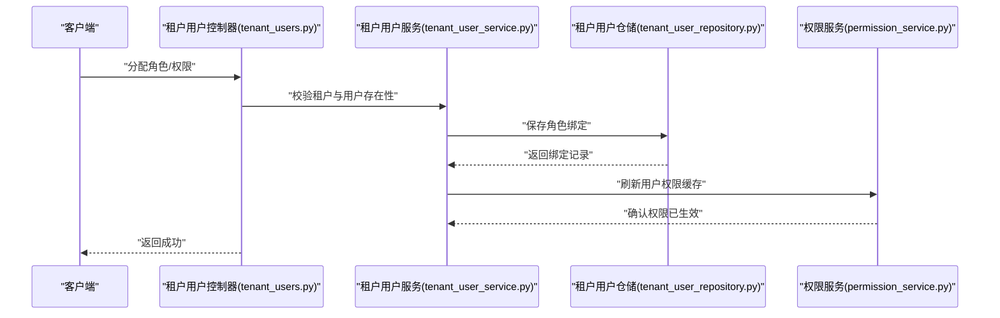
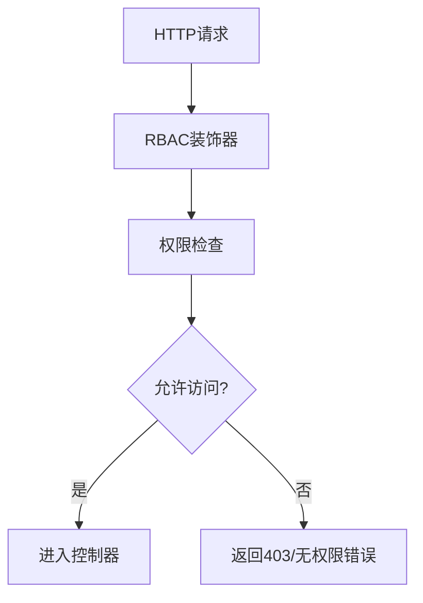
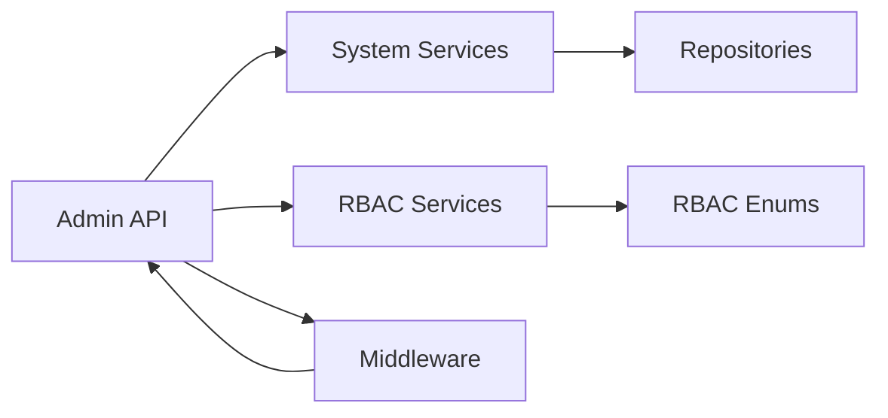

# 认证与权限管理API

<cite>
**本文档引用的文件**
- [backend/app/api/admin/auth.py](file://backend/app/api/admin/auth.py)
- [backend/app/api/admin/users.py](file://backend/app/api/admin/users.py)
- [backend/app/api/admin/tenant_users.py](file://backend/app/api/admin/tenant_users.py)
- [backend/app/api/admin/permissions.py](file://backend/app/api/admin/permissions.py)
- [backend/app/rbac/decorators.py](file://backend/app/rbac/decorators.py)
- [backend/app/middleware/permission.py](file://backend/app/middleware/permission.py)
- [backend/app/middleware/access_control.py](file://backend/app/middleware/access_control.py)
- [backend/app/middleware/tenant.py](file://backend/app/middleware/tenant.py)
- [backend/app/enums/rbac.py](file://backend/app/enums/rbac.py)
- [backend/app/enums/error_code.py](file://backend/app/enums/error_code.py)
- [backend/app/schemas/system/user.py](file://backend/app/schemas/system/user.py)
- [backend/app/schemas/system/tenant_user.py](file://backend/app/schemas/system/tenant_user.py)
- [backend/app/schemas/system/permission.py](file://backend/app/schemas/system/permission.py)
- [backend/app/services/system/user_service.py](file://backend/app/services/system/user_service.py)
- [backend/app/services/system/tenant_user_service.py](file://backend/app/services/system/tenant_user_service.py)
- [backend/app/services/system/permission_service.py](file://backend/app/services/system/permission_service.py)
- [backend/app/repositories/system/user_repository.py](file://backend/app/repositories/system/user_repository.py)
- [backend/app/repositories/system/tenant_user_repository.py](file://backend/app/repositories/system/tenant_user_repository.py)
- [backend/app/repositories/system/permission_repository.py](file://backend/app/repositories/system/permission_repository.py)
- [backend/app/models/system/user.py](file://backend/app/models/system/user.py)
- [backend/app/models/system/tenant_user.py](file://backend/app/models/system/tenant_user.py)
- [backend/app/models/system/permission.py](file://backend/app/models/system/permission.py)
- [backend/app/rbac/services/permission_service.py](file://backend/app/rbac/services/permission_service.py)
- [backend/app/rbac/services/permission_domains/query.py](file://backend/app/rbac/services/permission_domains/query.py)
- [backend/app/rbac/services/permission_domains/checks.py](file://backend/app/rbac/services/permission_domains/checks.py)
- [backend/app/rbac/services/permission_domains/presentation.py](file://backend/app/rbac/services/permission_domains/presentation.py)
- [backend/app/rbac/services/permission_domains/tenant_admin.py](file://backend/app/rbac/services/permission_domains/tenant_admin.py)
- [backend/app/rbac/menus/admin_menus.py](file://backend/app/rbac/menus/admin_menus.py)
- [backend/app/rbac/menus/tenant_menus.py](file://backend/app/rbac/menus/tenant_menus.py)
- [backend/app/rbac/menus/user_menus.py](file://backend/app/rbac/menus/user_menus.py)
</cite>

## 目录
1. [简介](#简介)
2. [项目结构](#项目结构)
3. [核心组件](#核心组件)
4. [架构总览](#架构总览)
5. [详细组件分析](#详细组件分析)
6. [依赖关系分析](#依赖关系分析)
7. [性能考虑](#性能考虑)
8. [故障排除指南](#故障排除指南)
9. [结论](#结论)

## 简介
本文件面向管理端的认证与权限管理API，覆盖管理员用户认证、权限分配、角色管理、用户账户管理等功能。文档化了登录认证流程、权限验证机制、用户状态管理、租户用户权限控制等接口，并解释RBAC权限模型在管理端的应用（权限继承、角色层级、资源访问控制）。内容包含请求参数、响应格式、错误码说明与使用示例，帮助开发者快速集成与排查问题。

## 项目结构
管理端认证与权限相关模块主要分布在以下路径：
- 后端API层：`backend/app/api/admin/`（认证、用户、租户用户、权限等）
- RBAC服务与菜单：`backend/app/rbac/`（装饰器、权限服务、菜单定义）
- 中间件：`backend/app/middleware/`（权限、访问控制、租户隔离）
- 枚举与数据模型：`backend/app/enums/`、`backend/app/models/system/`、`backend/app/schemas/system/`
- 服务与仓储：`backend/app/services/system/`、`backend/app/repositories/system/`

图表来源
- [backend/app/api/admin/auth.py](file://backend/app/api/admin/auth.py)
- [backend/app/api/admin/users.py](file://backend/app/api/admin/users.py)
- [backend/app/api/admin/tenant_users.py](file://backend/app/api/admin/tenant_users.py)
- [backend/app/api/admin/permissions.py](file://backend/app/api/admin/permissions.py)
- [backend/app/rbac/decorators.py](file://backend/app/rbac/decorators.py)
- [backend/app/rbac/services/permission_service.py](file://backend/app/rbac/services/permission_service.py)
- [backend/app/rbac/menus/admin_menus.py](file://backend/app/rbac/menus/admin_menus.py)
- [backend/app/middleware/permission.py](file://backend/app/middleware/permission.py)
- [backend/app/middleware/access_control.py](file://backend/app/middleware/access_control.py)
- [backend/app/middleware/tenant.py](file://backend/app/middleware/tenant.py)
- [backend/app/services/system/user_service.py](file://backend/app/services/system/user_service.py)
- [backend/app/services/system/tenant_user_service.py](file://backend/app/services/system/tenant_user_service.py)
- [backend/app/services/system/permission_service.py](file://backend/app/services/system/permission_service.py)
- [backend/app/repositories/system/user_repository.py](file://backend/app/repositories/system/user_repository.py)
- [backend/app/repositories/system/tenant_user_repository.py](file://backend/app/repositories/system/tenant_user_repository.py)
- [backend/app/repositories/system/permission_repository.py](file://backend/app/repositories/system/permission_repository.py)

章节来源
- [backend/app/api/admin/auth.py](file://backend/app/api/admin/auth.py)
- [backend/app/api/admin/users.py](file://backend/app/api/admin/users.py)
- [backend/app/api/admin/tenant_users.py](file://backend/app/api/admin/tenant_users.py)
- [backend/app/api/admin/permissions.py](file://backend/app/api/admin/permissions.py)
- [backend/app/rbac/decorators.py](file://backend/app/rbac/decorators.py)
- [backend/app/middleware/permission.py](file://backend/app/middleware/permission.py)
- [backend/app/middleware/access_control.py](file://backend/app/middleware/access_control.py)
- [backend/app/middleware/tenant.py](file://backend/app/middleware/tenant.py)

## 核心组件
- 认证接口：提供管理员登录、登出、会话维护、验证码等能力
- 权限与角色：基于RBAC模型的角色管理、权限分配、资源访问控制
- 用户与租户用户：系统用户与租户用户的增删改查、状态管理、权限绑定
- 中间件链路：权限校验、跨域、审计日志、租户隔离等横切关注点
- RBAC服务：权限聚合、查询、检查、呈现与菜单生成

章节来源
- [backend/app/api/admin/auth.py](file://backend/app/api/admin/auth.py)
- [backend/app/api/admin/permissions.py](file://backend/app/api/admin/permissions.py)
- [backend/app/api/admin/users.py](file://backend/app/api/admin/users.py)
- [backend/app/api/admin/tenant_users.py](file://backend/app/api/admin/tenant_users.py)
- [backend/app/rbac/decorators.py](file://backend/app/rbac/decorators.py)
- [backend/app/middleware/permission.py](file://backend/app/middleware/permission.py)

## 架构总览
管理端认证与权限的整体架构由API控制器、服务层、仓储层、RBAC服务与中间件共同组成。请求通过中间件进行租户隔离、权限校验与访问控制，再进入业务服务完成数据操作，最终返回标准化响应。

图表来源
- [backend/app/middleware/permission.py](file://backend/app/middleware/permission.py)
- [backend/app/middleware/access_control.py](file://backend/app/middleware/access_control.py)
- [backend/app/middleware/tenant.py](file://backend/app/middleware/tenant.py)
- [backend/app/api/admin/auth.py](file://backend/app/api/admin/auth.py)
- [backend/app/services/system/user_service.py](file://backend/app/services/system/user_service.py)
- [backend/app/repositories/system/user_repository.py](file://backend/app/repositories/system/user_repository.py)
- [backend/app/rbac/services/permission_service.py](file://backend/app/rbac/services/permission_service.py)
- [backend/app/rbac/menus/admin_menus.py](file://backend/app/rbac/menus/admin_menus.py)

## 详细组件分析

### 认证接口（管理员登录）
- 接口目标：为管理员用户提供安全登录、会话维护与登出能力
- 关键流程：
  - 参数校验与安全检查
  - 凭据验证（用户名/密码或验证码）
  - 会话建立与令牌签发
  - 登录审计与状态更新
- 请求参数（示例）：账号、密码、验证码、是否记住登录
- 响应格式：令牌、用户信息、权限集合、过期时间
- 错误码：账号不存在、密码错误、验证码错误、账户锁定、登录失败等

图表来源
- [backend/app/api/admin/auth.py](file://backend/app/api/admin/auth.py)
- [backend/app/services/system/user_service.py](file://backend/app/services/system/user_service.py)
- [backend/app/repositories/system/user_repository.py](file://backend/app/repositories/system/user_repository.py)
- [backend/app/middleware/permission.py](file://backend/app/middleware/permission.py)

章节来源
- [backend/app/api/admin/auth.py](file://backend/app/api/admin/auth.py)
- [backend/app/services/system/user_service.py](file://backend/app/services/system/user_service.py)
- [backend/app/repositories/system/user_repository.py](file://backend/app/repositories/system/user_repository.py)
- [backend/app/enums/error_code.py](file://backend/app/enums/error_code.py)

### 权限与角色管理
- 角色与权限：
  - 角色定义与层级（支持继承与覆盖）
  - 权限资源与动作（按组织/全局/租户维度）
  - 资源访问控制（基于范围与作用域）
- 权限服务：
  - 权限聚合与查询
  - 权限检查与缓存
  - 菜单呈现与动态生成
- 接口能力：角色创建/更新/删除、权限分配/回收、批量授权、菜单同步

图表来源
- [backend/app/rbac/services/permission_service.py](file://backend/app/rbac/services/permission_service.py)
- [backend/app/rbac/services/permission_domains/query.py](file://backend/app/rbac/services/permission_domains/query.py)
- [backend/app/rbac/services/permission_domains/checks.py](file://backend/app/rbac/services/permission_domains/checks.py)
- [backend/app/rbac/services/permission_domains/presentation.py](file://backend/app/rbac/services/permission_domains/presentation.py)

章节来源
- [backend/app/api/admin/permissions.py](file://backend/app/api/admin/permissions.py)
- [backend/app/rbac/services/permission_service.py](file://backend/app/rbac/services/permission_service.py)
- [backend/app/rbac/services/permission_domains/query.py](file://backend/app/rbac/services/permission_domains/query.py)
- [backend/app/rbac/services/permission_domains/checks.py](file://backend/app/rbac/services/permission_domains/checks.py)
- [backend/app/rbac/services/permission_domains/presentation.py](file://backend/app/rbac/services/permission_domains/presentation.py)
- [backend/app/rbac/menus/admin_menus.py](file://backend/app/rbac/menus/admin_menus.py)
- [backend/app/enums/rbac.py](file://backend/app/enums/rbac.py)

### 用户账户管理
- 功能范围：用户创建、更新、禁用/启用、重置密码、查询与分页
- 数据模型：用户基本信息、登录安全字段、状态与创建时间
- 服务职责：业务规则校验、密码处理、状态变更、审计日志
- 接口示例：GET/POST/PUT/DELETE /admin/users

图表来源
- [backend/app/api/admin/users.py](file://backend/app/api/admin/users.py)
- [backend/app/services/system/user_service.py](file://backend/app/services/system/user_service.py)
- [backend/app/repositories/system/user_repository.py](file://backend/app/repositories/system/user_repository.py)
- [backend/app/models/system/user.py](file://backend/app/models/system/user.py)
- [backend/app/schemas/system/user.py](file://backend/app/schemas/system/user.py)

章节来源
- [backend/app/api/admin/users.py](file://backend/app/api/admin/users.py)
- [backend/app/services/system/user_service.py](file://backend/app/services/system/user_service.py)
- [backend/app/repositories/system/user_repository.py](file://backend/app/repositories/system/user_repository.py)
- [backend/app/models/system/user.py](file://backend/app/models/system/user.py)
- [backend/app/schemas/system/user.py](file://backend/app/schemas/system/user.py)

### 租户用户权限控制
- 目标：为租户内的用户分配角色与权限，实现多租户隔离与细粒度控制
- 关键点：租户维度的角色绑定、资源作用域限制、权限继承与覆盖
- 接口：GET/POST/PUT/DELETE /admin/tenants/{tenant_id}/users

图表来源
- [backend/app/api/admin/tenant_users.py](file://backend/app/api/admin/tenant_users.py)
- [backend/app/services/system/tenant_user_service.py](file://backend/app/services/system/tenant_user_service.py)
- [backend/app/repositories/system/tenant_user_repository.py](file://backend/app/repositories/system/tenant_user_repository.py)
- [backend/app/rbac/services/permission_service.py](file://backend/app/rbac/services/permission_service.py)

章节来源
- [backend/app/api/admin/tenant_users.py](file://backend/app/api/admin/tenant_users.py)
- [backend/app/services/system/tenant_user_service.py](file://backend/app/services/system/tenant_user_service.py)
- [backend/app/repositories/system/tenant_user_repository.py](file://backend/app/repositories/system/tenant_user_repository.py)
- [backend/app/rbac/services/permission_service.py](file://backend/app/rbac/services/permission_service.py)

### RBAC装饰器与权限验证
- 装饰器：基于操作与资源的权限注解，自动注入权限检查逻辑
- 验证机制：在请求进入控制器前执行权限校验，支持快速失败与错误码返回
- 应用场景：保护敏感路由、菜单动态渲染、前端按钮级权限控制

图表来源
- [backend/app/rbac/decorators.py](file://backend/app/rbac/decorators.py)
- [backend/app/middleware/permission.py](file://backend/app/middleware/permission.py)

章节来源
- [backend/app/rbac/decorators.py](file://backend/app/rbac/decorators.py)
- [backend/app/middleware/permission.py](file://backend/app/middleware/permission.py)

## 依赖关系分析
- 组件耦合：
  - API控制器依赖服务层；服务层依赖仓储层；RBAC服务独立但被API与中间件调用
  - 中间件负责横切关注点（权限、租户、审计），降低控制器复杂度
- 外部依赖：
  - 数据库ORM模型与枚举驱动权限语义
  - 菜单服务依赖RBAC权限聚合结果
- 潜在循环依赖：当前结构清晰，未发现循环导入

图表来源
- [backend/app/api/admin/auth.py](file://backend/app/api/admin/auth.py)
- [backend/app/services/system/user_service.py](file://backend/app/services/system/user_service.py)
- [backend/app/repositories/system/user_repository.py](file://backend/app/repositories/system/user_repository.py)
- [backend/app/rbac/services/permission_service.py](file://backend/app/rbac/services/permission_service.py)
- [backend/app/enums/rbac.py](file://backend/app/enums/rbac.py)
- [backend/app/middleware/permission.py](file://backend/app/middleware/permission.py)

章节来源
- [backend/app/api/admin/auth.py](file://backend/app/api/admin/auth.py)
- [backend/app/services/system/user_service.py](file://backend/app/services/system/user_service.py)
- [backend/app/repositories/system/user_repository.py](file://backend/app/repositories/system/user_repository.py)
- [backend/app/rbac/services/permission_service.py](file://backend/app/rbac/services/permission_service.py)
- [backend/app/enums/rbac.py](file://backend/app/enums/rbac.py)
- [backend/app/middleware/permission.py](file://backend/app/middleware/permission.py)

## 性能考虑
- 缓存策略：权限检查结果与菜单树建议缓存，减少重复查询
- 分页与过滤：用户与租户用户列表接口应支持分页与条件过滤
- 并发控制：高并发登录场景下注意令牌签发与会话存储的并发安全
- 数据库索引：对用户账号、租户ID、权限资源等常用查询字段建立索引

## 故障排除指南
- 常见错误码：
  - 账号不存在/密码错误/验证码错误：登录失败
  - 权限不足：无权访问特定资源或操作
  - 账户被锁定：多次失败导致临时锁定
  - 参数不合法：缺少必填字段或格式错误
- 排查步骤：
  - 检查请求参数与头部信息（如租户标识）
  - 查看中间件日志（权限、审计、租户）
  - 核对用户角色与权限绑定情况
  - 确认RBAC权限聚合与缓存状态

章节来源
- [backend/app/enums/error_code.py](file://backend/app/enums/error_code.py)
- [backend/app/middleware/audit_log.py](file://backend/app/middleware/audit_log.py)
- [backend/app/middleware/permission.py](file://backend/app/middleware/permission.py)

## 结论
本文档系统梳理了管理端认证与权限管理API的设计与实现，明确了RBAC模型在多租户场景下的应用方式。通过中间件与装饰器实现横切权限控制，结合服务层与仓储层的数据一致性保障，能够满足复杂权限治理需求。建议在生产环境中配合缓存、索引与监控体系，确保性能与稳定性。