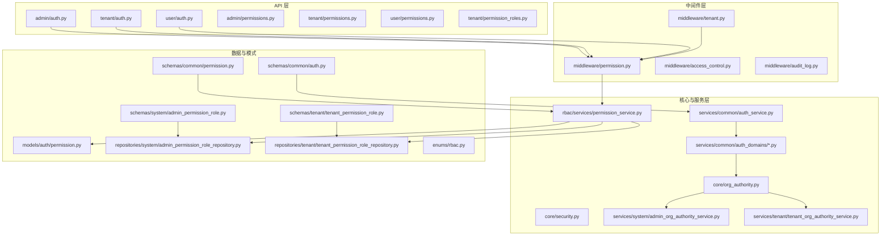
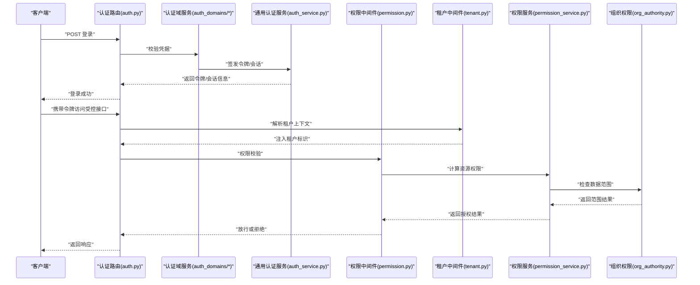
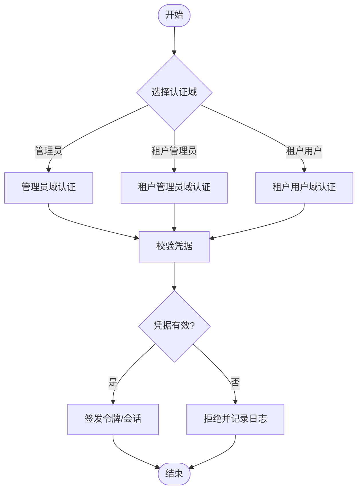
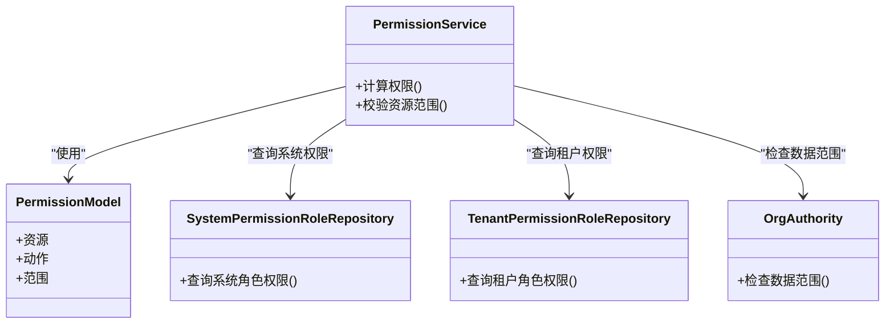
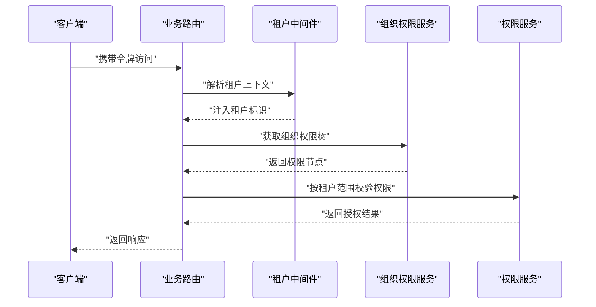
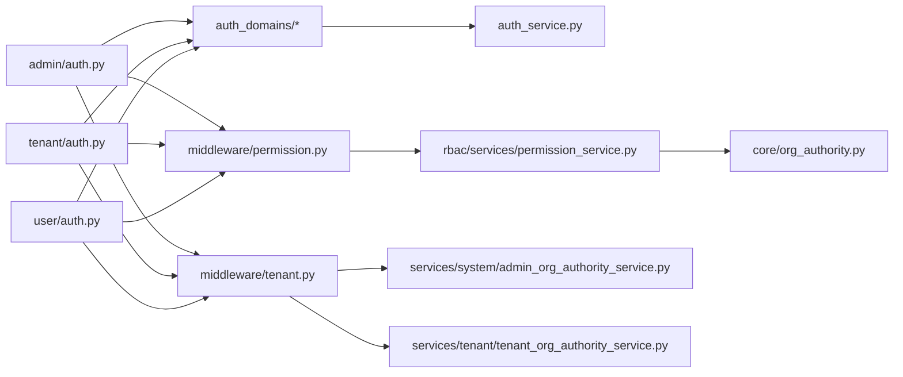

# 认证与授权

<cite>
**本文引用的文件**
- [backend/app/api/admin/auth.py](file://backend/app/api/admin/auth.py)
- [backend/app/api/tenant/auth.py](file://backend/app/api/tenant/auth.py)
- [backend/app/api/user/auth.py](file://backend/app/api/user/auth.py)
- [backend/app/api/admin/permissions.py](file://backend/app/api/admin/permissions.py)
- [backend/app/api/tenant/permissions.py](file://backend/app/api/tenant/permissions.py)
- [backend/app/api/user/permissions.py](file://backend/app/api/user/permissions.py)
- [backend/app/api/tenant/permission_roles.py](file://backend/app/api/tenant/permission_roles.py)
- [backend/app/core/org_authority.py](file://backend/app/core/org_authority.py)
- [backend/app/core/security.py](file://backend/app/core/security.py)
- [backend/app/middleware/permission.py](file://backend/app/middleware/permission.py)
- [backend/app/middleware/tenant.py](file://backend/app/middleware/tenant.py)
- [backend/app/middleware/access_control.py](file://backend/app/middleware/access_control.py)
- [backend/app/middleware/audit_log.py](file://backend/app/middleware/audit_log.py)
- [backend/app/models/auth/permission.py](file://backend/app/models/auth/permission.py)
- [backend/app/repositories/system/admin_permission_role_repository.py](file://backend/app/repositories/system/admin_permission_role_repository.py)
- [backend/app/repositories/tenant/tenant_permission_role_repository.py](file://backend/app/repositories/tenant/tenant_permission_role_repository.py)
- [backend/app/rbac/services/permission_service.py](file://backend/app/rbac/services/permission_service.py)
- [backend/app/services/common/auth_service.py](file://backend/app/services/common/auth_service.py)
- [backend/app/services/common/auth_domains/admin_auth.py](file://backend/app/services/common/auth_domains/admin_auth.py)
- [backend/app/services/common/auth_domains/tenant_admin_auth.py](file://backend/app/services/common/auth_domains/tenant_admin_auth.py)
- [backend/app/services/common/auth_domains/tenant_user_auth.py](file://backend/app/services/common/auth_domains/tenant_user_auth.py)
- [backend/app/services/common/auth_domains/login_security.py](file://backend/app/services/common/auth_domains/login_security.py)
- [backend/app/services/system/admin_org_authority_service.py](file://backend/app/services/system/admin_org_authority_service.py)
- [backend/app/services/tenant/tenant_org_authority_service.py](file://backend/app/services/tenant/tenant_org_authority_service.py)
- [backend/app/enums/rbac.py](file://backend/app/enums/rbac.py)
- [backend/app/schemas/common/auth.py](file://backend/app/schemas/common/auth.py)
- [backend/app/schemas/common/permission.py](file://backend/app/schemas/common/permission.py)
- [backend/app/schemas/system/admin_permission_role.py](file://backend/app/schemas/system/admin_permission_role.py)
- [backend/app/schemas/tenant/tenant_permission_role.py](file://backend/app/schemas/tenant/tenant_permission_role.py)
- [backend/migrations/versions/20260123_0006_add_login_security_fields.py](file://backend/migrations/versions/20260123_0006_add_login_security_fields.py)
- [backend/migrations/versions/20260325_org_authority_rebuild.py](file://backend/migrations/versions/20260325_org_authority_rebuild.py)
- [backend/migrations/versions/20260320_unified_resource_and_permission_scope.py](file://backend/migrations/versions/20260320_unified_resource_and_permission_scope.py)
- [backend/tests/api/test_admin_auth.py](file://backend/tests/api/test_admin_auth.py)
- [backend/tests/api/test_tenant_auth.py](file://backend/tests/api/test_tenant_auth.py)
- [backend/tests/api/test_user_auth_tenant_resolution.py](file://backend/tests/api/test_user_auth_tenant_resolution.py)
- [backend/tests/services/test_auth_service.py](file://backend/tests/services/test_auth_service.py)
- [backend/tests/services/test_auth_logging.py](file://backend/tests/services/test_auth_logging.py)
</cite>

## 目录
1. [简介](#简介)
2. [项目结构](#项目结构)
3. [核心组件](#核心组件)
4. [架构总览](#架构总览)
5. [详细组件分析](#详细组件分析)
6. [依赖关系分析](#依赖关系分析)
7. [性能考虑](#性能考虑)
8. [故障排查指南](#故障排查指南)
9. [结论](#结论)
10. [附录](#附录)

## 简介
本文件面向认证与授权系统，系统性梳理身份验证机制、权限控制策略与安全防护措施，覆盖 JWT 令牌管理、会话控制、角色权限分配与资源访问控制。文档解释不同 API 组（管理员、租户、用户）的认证要求、权限级别与访问控制规则，并提供从登录到 API 调用的完整流程示例。同时给出安全最佳实践、令牌刷新机制与会话超时处理建议，以及多租户环境下的权限隔离与数据安全保护策略。

## 项目结构
认证与授权相关代码主要分布在以下模块：
- API 层：管理员、租户、用户的认证与权限路由
- 中间件层：权限校验、多租户解析、访问控制与审计日志
- 核心与服务层：组织权限、RBAC 权限服务、认证域服务与通用认证服务
- 数据模型与仓库：权限模型、系统与租户权限角色仓库
- 枚举与模式：RBAC 枚举、权限与认证模式定义
- 迁移：登录安全字段、组织权限重建、统一资源与权限范围等

图表来源
- [backend/app/api/admin/auth.py](file://backend/app/api/admin/auth.py)
- [backend/app/api/tenant/auth.py](file://backend/app/api/tenant/auth.py)
- [backend/app/api/user/auth.py](file://backend/app/api/user/auth.py)
- [backend/app/middleware/permission.py](file://backend/app/middleware/permission.py)
- [backend/app/middleware/tenant.py](file://backend/app/middleware/tenant.py)
- [backend/app/rbac/services/permission_service.py](file://backend/app/rbac/services/permission_service.py)
- [backend/app/services/common/auth_service.py](file://backend/app/services/common/auth_service.py)
- [backend/app/services/common/auth_domains/admin_auth.py](file://backend/app/services/common/auth_domains/admin_auth.py)
- [backend/app/services/common/auth_domains/tenant_admin_auth.py](file://backend/app/services/common/auth_domains/tenant_admin_auth.py)
- [backend/app/services/common/auth_domains/tenant_user_auth.py](file://backend/app/services/common/auth_domains/tenant_user_auth.py)
- [backend/app/services/system/admin_org_authority_service.py](file://backend/app/services/system/admin_org_authority_service.py)
- [backend/app/services/tenant/tenant_org_authority_service.py](file://backend/app/services/tenant/tenant_org_authority_service.py)
- [backend/app/models/auth/permission.py](file://backend/app/models/auth/permission.py)
- [backend/app/repositories/system/admin_permission_role_repository.py](file://backend/app/repositories/system/admin_permission_role_repository.py)
- [backend/app/repositories/tenant/tenant_permission_role_repository.py](file://backend/app/repositories/tenant/tenant_permission_role_repository.py)
- [backend/app/enums/rbac.py](file://backend/app/enums/rbac.py)
- [backend/app/schemas/common/permission.py](file://backend/app/schemas/common/permission.py)
- [backend/app/schemas/common/auth.py](file://backend/app/schemas/common/auth.py)
- [backend/app/schemas/system/admin_permission_role.py](file://backend/app/schemas/system/admin_permission_role.py)
- [backend/app/schemas/tenant/tenant_permission_role.py](file://backend/app/schemas/tenant/tenant_permission_role.py)

章节来源
- [backend/app/api/admin/auth.py](file://backend/app/api/admin/auth.py)
- [backend/app/api/tenant/auth.py](file://backend/app/api/tenant/auth.py)
- [backend/app/api/user/auth.py](file://backend/app/api/user/auth.py)
- [backend/app/middleware/permission.py](file://backend/app/middleware/permission.py)
- [backend/app/middleware/tenant.py](file://backend/app/middleware/tenant.py)
- [backend/app/rbac/services/permission_service.py](file://backend/app/rbac/services/permission_service.py)
- [backend/app/services/common/auth_service.py](file://backend/app/services/common/auth_service.py)
- [backend/app/services/common/auth_domains/admin_auth.py](file://backend/app/services/common/auth_domains/admin_auth.py)
- [backend/app/services/common/auth_domains/tenant_admin_auth.py](file://backend/app/services/common/auth_domains/tenant_admin_auth.py)
- [backend/app/services/common/auth_domains/tenant_user_auth.py](file://backend/app/services/common/auth_domains/tenant_user_auth.py)
- [backend/app/services/system/admin_org_authority_service.py](file://backend/app/services/system/admin_org_authority_service.py)
- [backend/app/services/tenant/tenant_org_authority_service.py](file://backend/app/services/tenant/tenant_org_authority_service.py)
- [backend/app/models/auth/permission.py](file://backend/app/models/auth/permission.py)
- [backend/app/repositories/system/admin_permission_role_repository.py](file://backend/app/repositories/system/admin_permission_role_repository.py)
- [backend/app/repositories/tenant/tenant_permission_role_repository.py](file://backend/app/repositories/tenant/tenant_permission_role_repository.py)
- [backend/app/enums/rbac.py](file://backend/app/enums/rbac.py)
- [backend/app/schemas/common/permission.py](file://backend/app/schemas/common/permission.py)
- [backend/app/schemas/common/auth.py](file://backend/app/schemas/common/auth.py)
- [backend/app/schemas/system/admin_permission_role.py](file://backend/app/schemas/system/admin_permission_role.py)
- [backend/app/schemas/tenant/tenant_permission_role.py](file://backend/app/schemas/tenant/tenant_permission_role.py)

## 核心组件
- 认证域服务：负责管理员域、租户管理员域与租户用户域的认证逻辑，包括凭据校验、令牌签发与租户解析。
- 通用认证服务：提供统一的认证入口、令牌解析、会话状态维护与登出流程。
- 权限服务：基于 RBAC 的权限计算与资源访问控制，支持系统级与租户级权限角色。
- 中间件：权限校验、多租户上下文注入、访问控制与审计日志。
- 组织权限：组织层级权限与数据范围控制，确保跨租户与跨组织的数据隔离。
- 模式与枚举：定义权限、角色与作用域的标准化结构，保障权限语义一致。

章节来源
- [backend/app/services/common/auth_service.py](file://backend/app/services/common/auth_service.py)
- [backend/app/services/common/auth_domains/admin_auth.py](file://backend/app/services/common/auth_domains/admin_auth.py)
- [backend/app/services/common/auth_domains/tenant_admin_auth.py](file://backend/app/services/common/auth_domains/tenant_admin_auth.py)
- [backend/app/services/common/auth_domains/tenant_user_auth.py](file://backend/app/services/common/auth_domains/tenant_user_auth.py)
- [backend/app/rbac/services/permission_service.py](file://backend/app/rbac/services/permission_service.py)
- [backend/app/middleware/permission.py](file://backend/app/middleware/permission.py)
- [backend/app/middleware/tenant.py](file://backend/app/middleware/tenant.py)
- [backend/app/core/org_authority.py](file://backend/app/core/org_authority.py)
- [backend/app/enums/rbac.py](file://backend/app/enums/rbac.py)
- [backend/app/schemas/common/permission.py](file://backend/app/schemas/common/permission.py)
- [backend/app/schemas/common/auth.py](file://backend/app/schemas/common/auth.py)

## 架构总览
认证与授权的整体流程如下：
- 用户通过 API 登录，认证域服务进行凭据校验并生成令牌。
- 中间件在请求进入业务逻辑前进行多租户解析与权限校验。
- 权限服务根据用户角色与资源范围判断是否允许访问。
- 审计日志中间件记录关键操作，便于合规与追踪。

图表来源
- [backend/app/api/admin/auth.py](file://backend/app/api/admin/auth.py)
- [backend/app/api/tenant/auth.py](file://backend/app/api/tenant/auth.py)
- [backend/app/api/user/auth.py](file://backend/app/api/user/auth.py)
- [backend/app/services/common/auth_domains/admin_auth.py](file://backend/app/services/common/auth_domains/admin_auth.py)
- [backend/app/services/common/auth_domains/tenant_admin_auth.py](file://backend/app/services/common/auth_domains/tenant_admin_auth.py)
- [backend/app/services/common/auth_domains/tenant_user_auth.py](file://backend/app/services/common/auth_domains/tenant_user_auth.py)
- [backend/app/services/common/auth_service.py](file://backend/app/services/common/auth_service.py)
- [backend/app/middleware/permission.py](file://backend/app/middleware/permission.py)
- [backend/app/middleware/tenant.py](file://backend/app/middleware/tenant.py)
- [backend/app/rbac/services/permission_service.py](file://backend/app/rbac/services/permission_service.py)
- [backend/app/core/org_authority.py](file://backend/app/core/org_authority.py)

## 详细组件分析

### 认证域与登录流程
- 管理员域认证：处理平台级管理员登录，校验凭据后签发令牌并设置会话。
- 租户管理员域认证：处理租户管理员登录，解析租户上下文并签发令牌。
- 租户用户域认证：处理普通租户用户登录，解析租户并签发令牌。
- 登录安全：迁移中新增登录安全字段，用于增强登录风险控制与审计。

图表来源
- [backend/app/services/common/auth_domains/admin_auth.py](file://backend/app/services/common/auth_domains/admin_auth.py)
- [backend/app/services/common/auth_domains/tenant_admin_auth.py](file://backend/app/services/common/auth_domains/tenant_admin_auth.py)
- [backend/app/services/common/auth_domains/tenant_user_auth.py](file://backend/app/services/common/auth_domains/tenant_user_auth.py)
- [backend/migrations/versions/20260123_0006_add_login_security_fields.py](file://backend/migrations/versions/20260123_0006_add_login_security_fields.py)

章节来源
- [backend/app/api/admin/auth.py](file://backend/app/api/admin/auth.py)
- [backend/app/api/tenant/auth.py](file://backend/app/api/tenant/auth.py)
- [backend/app/api/user/auth.py](file://backend/app/api/user/auth.py)
- [backend/app/services/common/auth_domains/admin_auth.py](file://backend/app/services/common/auth_domains/admin_auth.py)
- [backend/app/services/common/auth_domains/tenant_admin_auth.py](file://backend/app/services/common/auth_domains/tenant_admin_auth.py)
- [backend/app/services/common/auth_domains/tenant_user_auth.py](file://backend/app/services/common/auth_domains/tenant_user_auth.py)
- [backend/migrations/versions/20260123_0006_add_login_security_fields.py](file://backend/migrations/versions/20260123_0006_add_login_security_fields.py)

### 权限控制与资源访问
- 权限模型：权限实体定义了资源、动作与范围，支持系统与租户维度。
- 权限服务：根据用户角色与资源范围计算可执行动作，结合组织权限进行数据范围过滤。
- 系统与租户权限角色：分别维护系统级与租户级的角色与权限映射。
- 权限中间件：在业务路由前拦截并执行权限校验，拒绝无权访问。

图表来源
- [backend/app/models/auth/permission.py](file://backend/app/models/auth/permission.py)
- [backend/app/rbac/services/permission_service.py](file://backend/app/rbac/services/permission_service.py)
- [backend/app/repositories/system/admin_permission_role_repository.py](file://backend/app/repositories/system/admin_permission_role_repository.py)
- [backend/app/repositories/tenant/tenant_permission_role_repository.py](file://backend/app/repositories/tenant/tenant_permission_role_repository.py)
- [backend/app/core/org_authority.py](file://backend/app/core/org_authority.py)

章节来源
- [backend/app/models/auth/permission.py](file://backend/app/models/auth/permission.py)
- [backend/app/rbac/services/permission_service.py](file://backend/app/rbac/services/permission_service.py)
- [backend/app/repositories/system/admin_permission_role_repository.py](file://backend/app/repositories/system/admin_permission_role_repository.py)
- [backend/app/repositories/tenant/tenant_permission_role_repository.py](file://backend/app/repositories/tenant/tenant_permission_role_repository.py)
- [backend/app/middleware/permission.py](file://backend/app/middleware/permission.py)
- [backend/app/core/org_authority.py](file://backend/app/core/org_authority.py)

### 多租户权限隔离与数据安全
- 租户中间件：在请求进入业务逻辑前解析当前租户上下文，确保后续权限与数据访问均基于正确租户。
- 组织权限服务：系统与租户组织权限服务负责构建与维护组织树与权限节点，确保跨层级权限继承与隔离。
- 统一资源与权限范围：迁移中统一资源与权限范围，减少越权与范围歧义。

图表来源
- [backend/app/middleware/tenant.py](file://backend/app/middleware/tenant.py)
- [backend/app/services/system/admin_org_authority_service.py](file://backend/app/services/system/admin_org_authority_service.py)
- [backend/app/services/tenant/tenant_org_authority_service.py](file://backend/app/services/tenant/tenant_org_authority_service.py)
- [backend/app/rbac/services/permission_service.py](file://backend/app/rbac/services/permission_service.py)
- [backend/migrations/versions/20260320_unified_resource_and_permission_scope.py](file://backend/migrations/versions/20260320_unified_resource_and_permission_scope.py)

章节来源
- [backend/app/middleware/tenant.py](file://backend/app/middleware/tenant.py)
- [backend/app/services/system/admin_org_authority_service.py](file://backend/app/services/system/admin_org_authority_service.py)
- [backend/app/services/tenant/tenant_org_authority_service.py](file://backend/app/services/tenant/tenant_org_authority_service.py)
- [backend/app/rbac/services/permission_service.py](file://backend/app/rbac/services/permission_service.py)
- [backend/migrations/versions/20260320_unified_resource_and_permission_scope.py](file://backend/migrations/versions/20260320_unified_resource_and_permission_scope.py)

### API 组与权限级别
- 管理员 API：平台级管理功能，通常需要系统管理员角色与全局范围权限。
- 租户 API：租户内管理与操作，需要对应租户角色与租户范围权限。
- 用户 API：面向租户用户的日常操作，权限范围限定在用户所属租户与资源。
- 权限角色：系统与租户分别维护角色与权限映射，支持精细化权限分配。

章节来源
- [backend/app/api/admin/permissions.py](file://backend/app/api/admin/permissions.py)
- [backend/app/api/tenant/permissions.py](file://backend/app/api/tenant/permissions.py)
- [backend/app/api/user/permissions.py](file://backend/app/api/user/permissions.py)
- [backend/app/api/tenant/permission_roles.py](file://backend/app/api/tenant/permission_roles.py)
- [backend/app/schemas/system/admin_permission_role.py](file://backend/app/schemas/system/admin_permission_role.py)
- [backend/app/schemas/tenant/tenant_permission_role.py](file://backend/app/schemas/tenant/tenant_permission_role.py)

### 令牌管理与会话控制
- 令牌签发：认证域服务在登录成功后签发令牌并建立会话。
- 令牌解析：通用认证服务负责解析与验证令牌有效性。
- 会话超时：建议在通用认证服务中实现会话过期检测与自动清理。
- 审计日志：审计中间件记录登录、登出与关键操作，便于追踪与合规。

章节来源
- [backend/app/services/common/auth_service.py](file://backend/app/services/common/auth_service.py)
- [backend/app/services/common/auth_domains/admin_auth.py](file://backend/app/services/common/auth_domains/admin_auth.py)
- [backend/app/services/common/auth_domains/tenant_admin_auth.py](file://backend/app/services/common/auth_domains/tenant_admin_auth.py)
- [backend/app/services/common/auth_domains/tenant_user_auth.py](file://backend/app/services/common/auth_domains/tenant_user_auth.py)
- [backend/app/middleware/audit_log.py](file://backend/app/middleware/audit_log.py)

### 安全最佳实践
- 强制多因素认证与登录安全字段（迁移中新增）。
- 最小权限原则：权限最小化分配，避免过度授权。
- 审计与追踪：启用审计日志中间件，记录所有关键操作。
- 传输安全：强制 HTTPS 与安全的 Cookie 设置。
- 令牌安全：短有效期与刷新令牌机制，定期轮换密钥。

章节来源
- [backend/migrations/versions/20260123_0006_add_login_security_fields.py](file://backend/migrations/versions/20260123_0006_add_login_security_fields.py)
- [backend/app/middleware/audit_log.py](file://backend/app/middleware/audit_log.py)

## 依赖关系分析
- API 路由依赖认证域服务与通用认证服务完成登录与令牌发放。
- 权限中间件依赖权限服务与组织权限进行访问控制。
- 权限服务依赖权限模型、系统与租户权限角色仓库以及组织权限。
- 租户中间件为整个链路提供租户上下文，贯穿权限校验与数据范围检查。

图表来源
- [backend/app/api/admin/auth.py](file://backend/app/api/admin/auth.py)
- [backend/app/api/tenant/auth.py](file://backend/app/api/tenant/auth.py)
- [backend/app/api/user/auth.py](file://backend/app/api/user/auth.py)
- [backend/app/services/common/auth_domains/admin_auth.py](file://backend/app/services/common/auth_domains/admin_auth.py)
- [backend/app/services/common/auth_domains/tenant_admin_auth.py](file://backend/app/services/common/auth_domains/tenant_admin_auth.py)
- [backend/app/services/common/auth_domains/tenant_user_auth.py](file://backend/app/services/common/auth_domains/tenant_user_auth.py)
- [backend/app/services/common/auth_service.py](file://backend/app/services/common/auth_service.py)
- [backend/app/middleware/permission.py](file://backend/app/middleware/permission.py)
- [backend/app/middleware/tenant.py](file://backend/app/middleware/tenant.py)
- [backend/app/rbac/services/permission_service.py](file://backend/app/rbac/services/permission_service.py)
- [backend/app/core/org_authority.py](file://backend/app/core/org_authority.py)
- [backend/app/services/system/admin_org_authority_service.py](file://backend/app/services/system/admin_org_authority_service.py)
- [backend/app/services/tenant/tenant_org_authority_service.py](file://backend/app/services/tenant/tenant_org_authority_service.py)

章节来源
- [backend/app/api/admin/auth.py](file://backend/app/api/admin/auth.py)
- [backend/app/api/tenant/auth.py](file://backend/app/api/tenant/auth.py)
- [backend/app/api/user/auth.py](file://backend/app/api/user/auth.py)
- [backend/app/middleware/permission.py](file://backend/app/middleware/permission.py)
- [backend/app/middleware/tenant.py](file://backend/app/middleware/tenant.py)
- [backend/app/rbac/services/permission_service.py](file://backend/app/rbac/services/permission_service.py)
- [backend/app/services/common/auth_service.py](file://backend/app/services/common/auth_service.py)
- [backend/app/services/common/auth_domains/admin_auth.py](file://backend/app/services/common/auth_domains/admin_auth.py)
- [backend/app/services/common/auth_domains/tenant_admin_auth.py](file://backend/app/services/common/auth_domains/tenant_admin_auth.py)
- [backend/app/services/common/auth_domains/tenant_user_auth.py](file://backend/app/services/common/auth_domains/tenant_user_auth.py)
- [backend/app/core/org_authority.py](file://backend/app/core/org_authority.py)
- [backend/app/services/system/admin_org_authority_service.py](file://backend/app/services/system/admin_org_authority_service.py)
- [backend/app/services/tenant/tenant_org_authority_service.py](file://backend/app/services/tenant/tenant_org_authority_service.py)

## 性能考虑
- 权限缓存：对常用权限与角色映射进行缓存，降低数据库查询压力。
- 令牌校验优化：采用轻量级解析与本地缓存校验结果，减少远程验证开销。
- 中间件顺序：将租户解析与权限校验前置，尽早失败以减少后续处理。
- 审计日志异步化：将审计写入异步化，避免阻塞主业务路径。

## 故障排查指南
- 登录失败：检查认证域服务的凭据校验与错误返回；查看登录安全字段配置。
- 权限拒绝：确认用户角色与资源范围；核对系统与租户权限角色仓库映射。
- 租户上下文缺失：检查租户中间件是否正确注入租户标识。
- 审计日志异常：确认审计中间件配置与日志输出目标。

章节来源
- [backend/tests/api/test_admin_auth.py](file://backend/tests/api/test_admin_auth.py)
- [backend/tests/api/test_tenant_auth.py](file://backend/tests/api/test_tenant_auth.py)
- [backend/tests/api/test_user_auth_tenant_resolution.py](file://backend/tests/api/test_user_auth_tenant_resolution.py)
- [backend/tests/services/test_auth_service.py](file://backend/tests/services/test_auth_service.py)
- [backend/tests/services/test_auth_logging.py](file://backend/tests/services/test_auth_logging.py)

## 结论
本认证与授权体系通过“认证域服务 + 通用认证服务 + 权限服务 + 中间件”的分层设计，实现了多租户环境下的细粒度权限控制与数据隔离。配合登录安全增强、审计日志与组织权限服务，系统在安全性与可维护性方面具备良好基础。建议进一步完善令牌刷新机制、会话超时策略与权限缓存，持续提升性能与用户体验。

## 附录
- 关键迁移要点：登录安全字段、组织权限重建、统一资源与权限范围。
- 测试覆盖：认证流程、租户解析与权限服务测试，确保核心路径稳定。

章节来源
- [backend/migrations/versions/20260123_0006_add_login_security_fields.py](file://backend/migrations/versions/20260123_0006_add_login_security_fields.py)
- [backend/migrations/versions/20260325_org_authority_rebuild.py](file://backend/migrations/versions/20260325_org_authority_rebuild.py)
- [backend/migrations/versions/20260320_unified_resource_and_permission_scope.py](file://backend/migrations/versions/20260320_unified_resource_and_permission_scope.py)
- [backend/tests/api/test_admin_auth.py](file://backend/tests/api/test_admin_auth.py)
- [backend/tests/api/test_tenant_auth.py](file://backend/tests/api/test_tenant_auth.py)
- [backend/tests/api/test_user_auth_tenant_resolution.py](file://backend/tests/api/test_user_auth_tenant_resolution.py)
- [backend/tests/services/test_auth_service.py](file://backend/tests/services/test_auth_service.py)
- [backend/tests/services/test_auth_logging.py](file://backend/tests/services/test_auth_logging.py)