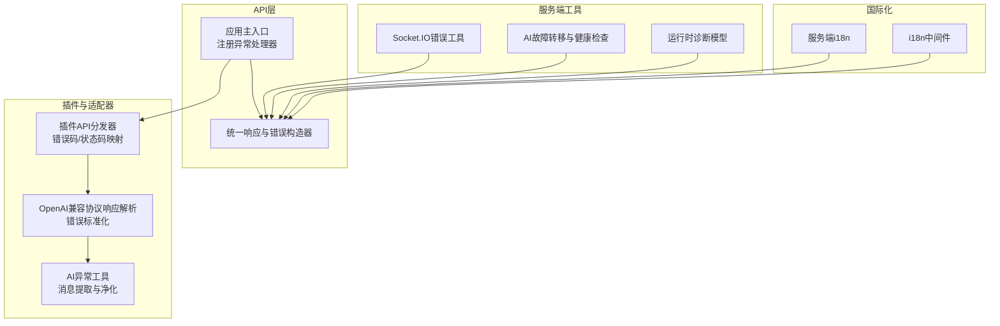
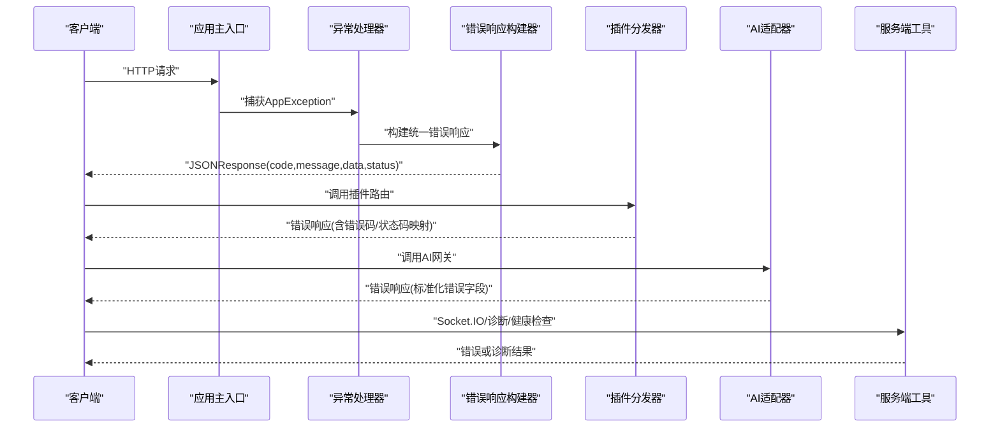
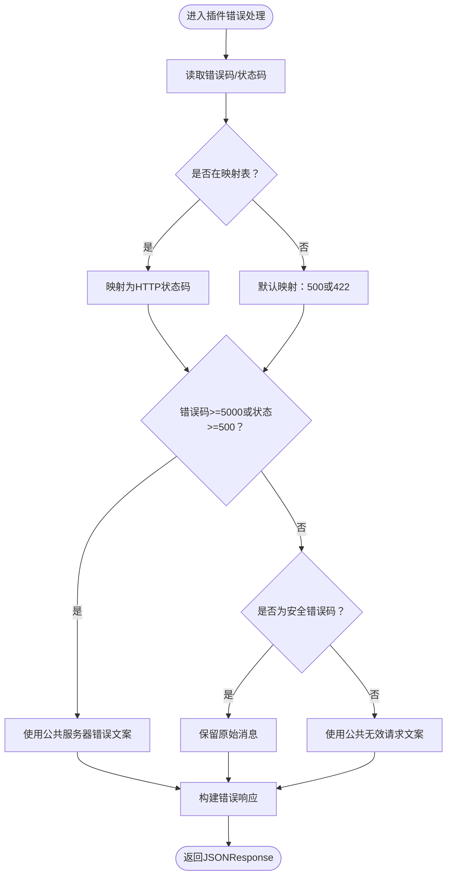
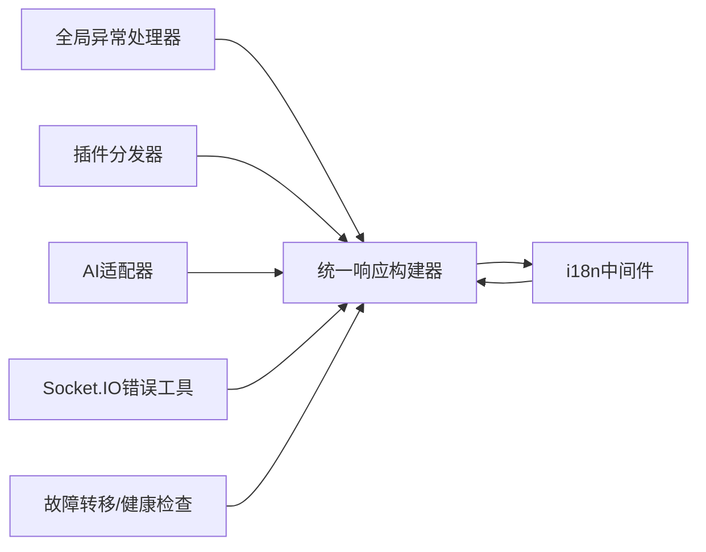

# 错误处理

<cite>
**本文引用的文件**
- [backend/app/enums/error_code.py](file://backend/app/enums/error_code.py)
- [backend/app/core/response.py](file://backend/app/core/response.py)
- [backend/app/main.py](file://backend/app/main.py)
- [backend/app/plugins/api_dispatcher.py](file://backend/app/plugins/api_dispatcher.py)
- [backend/app/ai/exceptions.py](file://backend/app/ai/exceptions.py)
- [backend/app/ai/adapters/openai_compatible/protocol_responses_stream.py](file://backend/app/ai/adapters/openai_compatible/protocol_responses_stream.py)
- [backend/app/sio/error_utils.py](file://backend/app/sio/error_utils.py)
- [backend/app/core/i18n.py](file://backend/app/core/i18n.py)
- [backend/app/middleware/i18n.py](file://backend/app/middleware/i18n.py)
- [backend/app/ai/failover.py](file://backend/app/ai/failover.py)
- [backend/app/schemas/ai/runtime_diagnostics.py](file://backend/app/schemas/ai/runtime_diagnostics.py)
- [backend/tests/test_plugin_api_dispatcher_security.py](file://backend/tests/test_plugin_api_dispatcher_security.py)
- [backend/tests/test_plugin_module_loader.py](file://backend/tests/test_plugin_module_loader.py)
- [backend/tests/core/test_error_response_payload.py](file://backend/tests/core/test_error_response_payload.py)
- [backend/tests/services/test_agent_chat_stream_error.py](file://backend/tests/services/test_agent_chat_stream_error.py)
- [backend/tests/services/test_task_engine_error_public_text.py](file://backend/tests/services/test_task_engine_error_public_text.py)
</cite>

## 目录
1. [简介](#简介)
2. [项目结构](#项目结构)
3. [核心组件](#核心组件)
4. [架构总览](#架构总览)
5. [详细组件分析](#详细组件分析)
6. [依赖关系分析](#依赖关系分析)
7. [性能考量](#性能考量)
8. [故障排查指南](#故障排查指南)
9. [结论](#结论)
10. [附录](#附录)

## 简介
本文件系统性梳理后端API错误处理体系，覆盖统一错误响应格式、状态码映射与错误分类、预定义错误类型与含义、错误码与HTTP状态码对应关系、客户端/服务器/业务/权限错误的处理策略、错误响应标准格式示例、错误信息本地化支持、错误日志记录与监控告警、故障恢复机制，以及常见错误场景的排查与解决建议。

## 项目结构
错误处理相关能力主要分布在以下模块：
- 错误码与分类：枚举定义与分类常量
- 统一响应与异常：通用错误响应构建器与全局异常处理器
- 插件错误适配：插件侧错误码与HTTP状态码映射、对外可见文案安全化
- AI适配器错误：第三方模型网关错误解析与标准化
- 服务端错误工具：Socket.IO错误工具、AI运行时诊断与健康检查
- 国际化：服务端i18n与中间件i18n
- 测试：针对错误响应、插件分发安全、公共文本提取等的测试用例

图表来源
- [backend/app/main.py:703-724](file://backend/app/main.py#L703-L724)
- [backend/app/core/response.py:481-587](file://backend/app/core/response.py#L481-L587)
- [backend/app/plugins/api_dispatcher.py:76-118](file://backend/app/plugins/api_dispatcher.py#L76-L118)
- [backend/app/ai/adapters/openai_compatible/protocol_responses_stream.py:126-174](file://backend/app/ai/adapters/openai_compatible/protocol_responses_stream.py#L126-L174)
- [backend/app/ai/exceptions.py:181-223](file://backend/app/ai/exceptions.py#L181-L223)
- [backend/app/sio/error_utils.py](file://backend/app/sio/error_utils.py)
- [backend/app/ai/failover.py:220-246](file://backend/app/ai/failover.py#L220-L246)
- [backend/app/schemas/ai/runtime_diagnostics.py:62-92](file://backend/app/schemas/ai/runtime_diagnostics.py#L62-L92)
- [backend/app/core/i18n.py](file://backend/app/core/i18n.py)
- [backend/app/middleware/i18n.py](file://backend/app/middleware/i18n.py)

章节来源
- [backend/app/main.py:703-724](file://backend/app/main.py#L703-L724)
- [backend/app/core/response.py:481-587](file://backend/app/core/response.py#L481-L587)

## 核心组件
- 统一错误响应格式
  - 字段：code、message、data、trace_id（可选）、details（可选）
  - 构建器：提供 bad_request、unauthorized、forbidden、not_found、validation_error、server_error 等快捷方法
- 全局异常处理器
  - 将 AppException 转换为JSONResponse，透传 status_code 与错误载荷
- 错误码与分类
  - 使用统一错误码前缀与范围划分：客户端错误(4xxx)、权限错误(4xxx)、业务验证(42xx)、服务器错误(5xxx)
- 插件错误适配
  - 将插件侧错误码映射到标准HTTP状态码，对不可信消息进行安全化处理
- AI网关错误解析
  - 从第三方响应中抽取status_code、error_code、message，标准化为内部错误类型
- 国际化
  - 服务端i18n与中间件i18n配合，确保错误消息按语言返回

章节来源
- [backend/app/core/response.py:481-587](file://backend/app/core/response.py#L481-L587)
- [backend/app/main.py:715-724](file://backend/app/main.py#L715-L724)
- [backend/app/enums/error_code.py](file://backend/app/enums/error_code.py)
- [backend/app/plugins/api_dispatcher.py:76-118](file://backend/app/plugins/api_dispatcher.py#L76-L118)
- [backend/app/ai/adapters/openai_compatible/protocol_responses_stream.py:126-174](file://backend/app/ai/adapters/openai_compatible/protocol_responses_stream.py#L126-L174)

## 架构总览
下图展示从请求进入、异常捕获、错误标准化到响应返回的完整链路，包括插件与AI适配器的错误处理分支。

图表来源
- [backend/app/main.py:715-724](file://backend/app/main.py#L715-L724)
- [backend/app/core/response.py:481-587](file://backend/app/core/response.py#L481-L587)
- [backend/app/plugins/api_dispatcher.py:76-118](file://backend/app/plugins/api_dispatcher.py#L76-L118)
- [backend/app/ai/adapters/openai_compatible/protocol_responses_stream.py:126-174](file://backend/app/ai/adapters/openai_compatible/protocol_responses_stream.py#L126-L174)
- [backend/app/sio/error_utils.py](file://backend/app/sio/error_utils.py)
- [backend/app/ai/failover.py:220-246](file://backend/app/ai/failover.py#L220-L246)

## 详细组件分析

### 统一错误响应与状态码
- 统一响应字段
  - code：整数错误码，按类别划分
  - message：人类可读的错误描述（支持本地化）
  - data：附加数据（如validation_error的errors列表）
  - trace_id：追踪ID（可选）
  - details：错误细节数组（可选）
- 快捷方法
  - 客户端错误：bad_request（4000）
  - 未授权：unauthorized（4010）
  - 禁止访问：forbidden（4030）
  - 资源不存在：not_found（4040）
  - 参数/模型验证：validation_error（4220），携带errors
  - 服务器错误：server_error（5000）
- HTTP状态码映射
  - 400/401/403/404/422/500 分别对应上述错误码
  - 插件侧错误码存在特定映射规则，见“插件错误适配”

章节来源
- [backend/app/core/response.py:481-587](file://backend/app/core/response.py#L481-L587)

### 全局异常处理器
- 将 AppException 转为 JSONResponse
- 透传 status_code 与错误载荷（to_dict）
- 对错误响应注入CORS头（便于跨域场景）

章节来源
- [backend/app/main.py:715-724](file://backend/app/main.py#L715-L724)

### 插件错误适配
- 错误码到HTTP状态码映射
  - 4001 -> 400
  - 4010 -> 401
  - 4030/4031 -> 403
  - 4040 -> 404
  - 4090 -> 409
  - 4220/4221 -> 422
  - 4290 -> 429
  - 5000/5001 -> 500
  - 5020 -> 502
  - 5030 -> 503
  - 其他5xxx类错误默认映射500，其他默认422
- 错误消息安全化
  - 5xxx或status>=500：使用公共错误文案（如“服务器内部错误”）
  - 非安全错误码：使用公共无效请求文案
  - 否则保留原始消息或回退为公共无效请求文案
- JSON响应处理
  - 若插件返回JSONResponse且包含错误字段，按约定包装为错误响应
  - 正常字典返回成功响应（code=0）

图表来源
- [backend/app/plugins/api_dispatcher.py:76-118](file://backend/app/plugins/api_dispatcher.py#L76-L118)
- [backend/tests/test_plugin_module_loader.py:268-307](file://backend/tests/test_plugin_module_loader.py#L268-L307)

章节来源
- [backend/app/plugins/api_dispatcher.py:76-118](file://backend/app/plugins/api_dispatcher.py#L76-L118)
- [backend/tests/test_plugin_module_loader.py:268-307](file://backend/tests/test_plugin_module_loader.py#L268-L307)

### AI网关错误解析与标准化
- 从第三方响应中抽取字段
  - status_code/status/http_status
  - code/type/error_code
  - message/detail/reason
- 标准化为内部错误类型，填充provider_code、model_code、error_code、status_code等
- 提供公共错误文案提取与HTML检测，避免泄露内部细节

章节来源
- [backend/app/ai/adapters/openai_compatible/protocol_responses_stream.py:126-174](file://backend/app/ai/adapters/openai_compatible/protocol_responses_stream.py#L126-L174)
- [backend/app/ai/exceptions.py:181-223](file://backend/app/ai/exceptions.py#L181-L223)

### Socket.IO与运行时诊断
- Socket.IO错误工具：封装连接/事件错误的统一格式
- 运行时诊断模型：包含整体状态、检查项、最近失败聚合、能力清单摘要、推荐动作等
- 故障转移与健康检查：通过Redis读取健康状态，异常时按安全策略拒绝未知健康

章节来源
- [backend/app/sio/error_utils.py](file://backend/app/sio/error_utils.py)
- [backend/app/schemas/ai/runtime_diagnostics.py:62-92](file://backend/app/schemas/ai/runtime_diagnostics.py#L62-L92)
- [backend/app/ai/failover.py:220-246](file://backend/app/ai/failover.py#L220-L246)

### 国际化与本地化
- 服务端i18n：提供本地化键值解析
- i18n中间件：根据请求上下文选择语言
- 错误消息采用本地化键，最终以用户语言呈现

章节来源
- [backend/app/core/i18n.py](file://backend/app/core/i18n.py)
- [backend/app/middleware/i18n.py](file://backend/app/middleware/i18n.py)

## 依赖关系分析
- 组件耦合
  - 全局异常处理器依赖统一响应构建器
  - 插件分发器依赖错误码映射与公共文案
  - AI适配器依赖错误消息提取与公共文案
  - Socket.IO与运行时诊断独立但共享统一错误语义
- 外部依赖
  - 插件生态与第三方AI网关
  - Redis用于健康检查
  - Prometheus中间件用于指标采集（间接影响错误观测）

图表来源
- [backend/app/main.py:715-724](file://backend/app/main.py#L715-L724)
- [backend/app/core/response.py:481-587](file://backend/app/core/response.py#L481-L587)
- [backend/app/plugins/api_dispatcher.py:76-118](file://backend/app/plugins/api_dispatcher.py#L76-L118)
- [backend/app/ai/adapters/openai_compatible/protocol_responses_stream.py:126-174](file://backend/app/ai/adapters/openai_compatible/protocol_responses_stream.py#L126-L174)
- [backend/app/sio/error_utils.py](file://backend/app/sio/error_utils.py)
- [backend/app/ai/failover.py:220-246](file://backend/app/ai/failover.py#L220-L246)
- [backend/app/middleware/i18n.py](file://backend/app/middleware/i18n.py)

## 性能考量
- 错误响应构建为轻量操作，主要成本在I/O与序列化
- 插件错误映射与消息安全化为常数时间操作
- 建议在高并发场景下：
  - 复用字符串与字典，减少临时对象分配
  - 控制错误详情数量，避免大对象序列化
  - 利用中间件缓存语言包键值（若实现）

## 故障排查指南
- 常见错误场景与定位
  - 插件返回JSONResponse且包含错误字段：确认status_code与code是否符合映射规则；检查消息是否被安全化
  - 第三方AI网关错误：核对status_code、error_code、message抽取是否正确；确认HTML泄露风险已过滤
  - Socket.IO连接/事件错误：检查错误工具封装的字段是否完整
  - 服务器内部错误：查看trace_id并结合日志定位
- 关联测试参考
  - 插件分发安全与错误响应：[backend/tests/test_plugin_api_dispatcher_security.py:328-361](file://backend/tests/test_plugin_api_dispatcher_security.py#L328-L361)
  - 插件模块加载与JSON响应包装：[backend/tests/test_plugin_module_loader.py:268-307](file://backend/tests/test_plugin_module_loader.py#L268-L307)
  - 错误响应载荷一致性：[backend/tests/core/test_error_response_payload.py](file://backend/tests/core/test_error_response_payload.py)
  - AI流式错误表面与公共文本：[backend/tests/services/test_agent_chat_stream_error.py](file://backend/tests/services/test_agent_chat_stream_error.py)
  - 任务引擎公共文本提取：[backend/tests/services/test_task_engine_error_public_text.py](file://backend/tests/services/test_task_engine_error_public_text.py)

章节来源
- [backend/tests/test_plugin_api_dispatcher_security.py:328-361](file://backend/tests/test_plugin_api_dispatcher_security.py#L328-L361)
- [backend/tests/test_plugin_module_loader.py:268-307](file://backend/tests/test_plugin_module_loader.py#L268-L307)
- [backend/tests/core/test_error_response_payload.py](file://backend/tests/core/test_error_response_payload.py)
- [backend/tests/services/test_agent_chat_stream_error.py](file://backend/tests/services/test_agent_chat_stream_error.py)
- [backend/tests/services/test_task_engine_error_public_text.py](file://backend/tests/services/test_task_engine_error_public_text.py)

## 结论
该错误处理系统通过统一的错误响应格式、明确的状态码映射与错误分类、严格的插件与AI网关错误适配、完善的国际化支持，以及配套的日志与健康检查机制，实现了高一致性的错误体验与可观测性。遵循本文档的规范与流程，可在保证安全性的同时，快速定位问题并稳定恢复。

## 附录

### 错误码与HTTP状态码对照（示例）
- 4000：客户端错误（HTTP 400）
- 4010：未授权（HTTP 401）
- 4030：禁止访问（HTTP 403）
- 4040：资源不存在（HTTP 404）
- 4220：参数/模型验证错误（HTTP 422）
- 5000：服务器内部错误（HTTP 500）

章节来源
- [backend/app/core/response.py:481-587](file://backend/app/core/response.py#L481-L587)
- [backend/app/plugins/api_dispatcher.py:76-118](file://backend/app/plugins/api_dispatcher.py#L76-L118)

### 错误响应标准格式示例
- 成功响应
  - code: 0
  - message: "成功"
  - data: {...}
- 错误响应
  - code: 4000/4010/4030/4040/4220/5000
  - message: "错误描述（本地化）"
  - data: 可选（如validation_error携带errors）
  - trace_id: 可选
  - details: 可选

章节来源
- [backend/app/core/response.py:481-587](file://backend/app/core/response.py#L481-L587)

### 错误分类与处理策略
- 客户端错误（4xxx）
  - 处理：校验输入、路径参数、请求体；返回4000与具体提示
- 权限错误（4xxx）
  - 处理：鉴权失败或RBAC拒绝；返回4010/4030
- 业务逻辑错误（42xx）
  - 处理：业务约束不满足；返回4220并附带errors
- 服务器错误（5xxx）
  - 处理：内部异常；返回5000，不泄露内部堆栈

章节来源
- [backend/app/core/response.py:481-587](file://backend/app/core/response.py#L481-L587)
- [backend/app/plugins/api_dispatcher.py:76-118](file://backend/app/plugins/api_dispatcher.py#L76-L118)

### 本地化支持
- 服务端i18n与中间件i18n协同工作，确保错误消息按用户语言返回
- 插件与AI适配器错误消息同样走本地化键，避免直接暴露内部细节

章节来源
- [backend/app/core/i18n.py](file://backend/app/core/i18n.py)
- [backend/app/middleware/i18n.py](file://backend/app/middleware/i18n.py)

### 日志记录、监控告警与故障恢复
- 日志记录
  - 异常处理器与健康检查均记录错误摘要
  - trace_id贯穿请求链路，便于关联日志
- 监控告警
  - Prometheus中间件用于指标采集
  - 健康探针定期刷新组件健康状态（数据库、Redis）
- 故障恢复
  - 故障转移：健康检查失败时拒绝未知健康，避免绕过
  - 运行时诊断：提供根因报告与推荐动作

章节来源
- [backend/app/main.py:513-593](file://backend/app/main.py#L513-L593)
- [backend/app/ai/failover.py:220-246](file://backend/app/ai/failover.py#L220-L246)
- [backend/app/schemas/ai/runtime_diagnostics.py:62-92](file://backend/app/schemas/ai/runtime_diagnostics.py#L62-L92)