# AI业务服务

<cite>
**本文引用的文件**
- [internal_ai_service.py](file://backend/app/ai/internal_ai_service.py)
- [gateway.py](file://backend/app/ai/gateway.py)
- [engine/base.py](file://backend/app/ai/engine/base.py)
- [engine/conversation.py](file://backend/app/ai/engine/conversation.py)
- [engine/stream_handler.py](file://backend/app/ai/engine/stream_handler.py)
- [context/orchestrator.py](file://backend/app/ai/context/orchestrator.py)
- [context/engine.py](file://backend/app/ai/context/engine.py)
- [skills/__init__.py](file://backend/app/ai/skills/__init__.py)
- [tools/__init__.py](file://backend/app/ai/tools/__init__.py)
- [rag/__init__.py](file://backend/app/ai/rag/__init__.py)
- [quota_manager.py](file://backend/app/ai/quota_manager.py)
- [agent_quota_manager.py](file://backend/app/ai/agent_quota_manager.py)
- [rate_limiter.py](file://backend/app/ai/rate_limiter.py)
- [retry_service.py](file://backend/app/ai/retry_service.py)
- [failover.py](file://backend/app/ai/failover.py)
- [usage_recorder_core.py](file://backend/app/ai/usage_recorder_core.py)
- [usage_recorder_context.py](file://backend/app/ai/usage_recorder_context.py)
- [usage_recorder_support.py](file://backend/app/ai/usage_recorder_support.py)
- [sse.py](file://backend/app/ai/sse.py)
- [constants.py](file://backend/app/ai/constants.py)
- [types.py](file://backend/app/ai/types.py)
- [exceptions.py](file://backend/app/ai/exceptions.py)
- [models/ai/agent.py](file://backend/app/models/ai/agent.py)
- [models/ai/conversation.py](file://backend/app/models/ai/conversation.py)
- [models/ai/knowledge_base.py](file://backend/app/models/ai/knowledge_base.py)
- [models/ai/skill.py](file://backend/app/models/ai/skill.py)
- [models/ai/model.py](file://backend/app/models/ai/model.py)
- [schemas/ai/agent.py](file://backend/app/schemas/ai/agent.py)
- [schemas/ai/conversation.py](file://backend/app/schemas/ai/conversation.py)
- [schemas/ai/knowledge_base.py](file://backend/app/schemas/ai/knowledge_base.py)
- [schemas/ai/skill.py](file://backend/app/schemas/ai/skill.py)
- [schemas/ai/model.py](file://backend/app/schemas/ai/model.py)
- [repositories/ai/agent.py](file://backend/app/repositories/ai/agent.py)
- [repositories/ai/conversation.py](file://backend/app/repositories/ai/conversation.py)
- [repositories/ai/knowledge_base.py](file://backend/app/repositories/ai/knowledge_base.py)
- [repositories/ai/skill.py](file://backend/app/repositories/ai/skill.py)
- [repositories/ai/model.py](file://backend/app/repositories/ai/model.py)
- [services/ai/agent.py](file://backend/app/services/ai/agent.py)
- [services/ai/conversation.py](file://backend/app/services/ai/conversation.py)
- [services/ai/knowledge_base.py](file://backend/app/services/ai/knowledge_base.py)
- [services/ai/skill.py](file://backend/app/services/ai/skill.py)
- [services/ai/model.py](file://backend/app/services/ai/model.py)
- [api/tenant/ai_agent.py](file://backend/app/api/tenant/ai_agent.py)
- [api/tenant/ai_conversation.py](file://backend/app/api/tenant/ai_conversation.py)
- [api/tenant/ai_knowledge_base.py](file://backend/app/api/tenant/ai_knowledge_base.py)
- [api/tenant/ai_skill.py](file://backend/app/api/tenant/ai_skill.py)
- [api/tenant/ai_model.py](file://backend/app/api/tenant/ai_model.py)
- [middleware/audit_log.py](file://backend/app/middleware/audit_log.py)
- [tasks/ai.py](file://backend/app/tasks/ai.py)
- [tasks/ai_health_check.py](file://backend/app/tasks/ai_health_check.py)
- [migrations/versions/..._add_ai_call_logs.py](file://backend/migrations/versions/20260212_147c588d9898_add_ai_call_logs_table.py)
- [migrations/versions/..._add_ai_action_logs.py](file://backend/migrations/versions/20260211_ee87f790553e_add_ai_action_logs_table.py)
- [migrations/versions/..._add_ai_query_logs.py](file://backend/migrations/versions/20260212_6f8e790c9a68_add_ai_query_logs_table.py)
- [migrations/versions/..._add_ai_usage_stats.py](file://backend/migrations/versions/20260207_002_add_ai_usage_stats.py)
- [migrations/versions/..._add_ai_model_limits.py](file://backend/migrations/versions/20260208_003_add_ai_model_limits.py)
- [migrations/versions/..._add_tenant_quotas.py](file://backend/migrations/versions/20260208_004_add_tenant_quotas.py)
- [migrations/versions/..._add_request_metadata_to_ai_call_logs.py](file://backend/migrations/versions/20260210_147c588d9898_add_request_metadata_to_ai_call_logs.py)
- [migrations/versions/..._add_routing_fields_to_ai_call_logs.py](file://backend/migrations/versions/20260301_075fdfee8a70_add_routing_fields_to_ai_call_logs.py)
- [migrations/versions/..._add_ai_action_log_actor_snapshots.py](file://backend/migrations/versions/20260326_0001_skill_architecture_foundation.py)
- [migrations/versions/..._add_execution_decisions.py](file://backend/migrations/versions/20260329_0050_add_execution_decisions.py)
- [migrations/versions/..._add_execution_decision_id_to_ai_action_logs.py](file://backend/migrations/versions/20260330_0060_add_execution_decision_id_to_ai_action_logs.py)
- [migrations/versions/..._add_profile_snapshots.py](file://backend/migrations/versions/20260330_0070_add_profile_snapshots.py)
- [migrations/versions/..._add_memory_records.py](file://backend/migrations/versions/20260329_0030_add_memory_records.py)
- [migrations/versions/..._add_conversation_owner_type_and_session_task_scope.py](file://backend/migrations/versions/20260324_0001_add_conversation_owner_type_and_session_task_scope.py)
- [migrations/versions/..._add_agent_id_to_conversation_messages.py](file://backend/migrations/versions/20260305_add_agent_id_to_conversation_messages.py)
- [migrations/versions/..._seed_router_agent_and_default_chat.py](file://backend/migrations/versions/20260305_seed_router_agent_and_default_chat.py)
- [migrations/versions/..._add_agent_memory_switch_and_override.py](file://backend/migrations/versions/20260302_9f2d1e34c7a1_add_agent_memory_switch_and_override.py)
- [migrations/versions/..._add_model_fallback.py](file://backend/migrations/versions/20260208_005_add_model_fallback.py)
- [migrations/versions/..._add_ai_table_policies_and_overrides.py](file://backend/migrations/versions/20260212_8d11e316fec0_add_ai_table_policies_and_overrides.py)
- [migrations/versions/..._add_ai_providers.py](file://backend/migrations/versions/20260120_001_add_ai_providers.py)
- [migrations/versions/..._add_operation_log_table.py](file://backend/migrations/versions/20260120_0001_add_operation_log_table.py)
- [migrations/versions/..._add_task_logs_table.py](file://backend/migrations/versions/20260208_0009_add_task_logs_table.py)
- [migrations/versions/..._add_periodic_tasks_table.py](file://backend/migrations/versions/20260208_0010_add_periodic_tasks_table.py)
- [migrations/versions/..._add_tenant_id_to_periodic_tasks.py](file://backend/migrations/versions/20260208_0011_add_tenant_id_to_periodic_tasks.py)
- [migrations/versions/..._enhance_periodic_tasks_fields.py](file://backend/migrations/versions/20260208_0012_enhance_periodic_tasks_fields.py)
</cite>

## 目录
1. [简介](#简介)
2. [项目结构](#项目结构)
3. [核心组件](#核心组件)
4. [架构总览](#架构总览)
5. [详细组件分析](#详细组件分析)
6. [依赖分析](#依赖分析)
7. [性能考虑](#性能考虑)
8. [故障排查指南](#故障排查指南)
9. [结论](#结论)
10. [附录](#附录)

## 简介
本技术文档面向AI业务服务，系统性阐述智能体管理、对话处理、知识库管理、技能系统、模型管理等核心业务逻辑与实现细节。文档重点覆盖以下方面：
- 服务间依赖关系、数据流转与业务规则
- AI调用日志、动作日志处理机制与审计能力
- 智能体生命周期管理、会话状态维护与上下文持久化策略
- 性能优化、并发控制与错误恢复机制
- 典型业务场景实现示例与最佳实践

## 项目结构
后端采用分层+领域模块化组织方式，AI相关能力集中在 backend/app/ai 目录下，围绕引擎（engine）、上下文（context）、技能（skills）、工具（tools）、RAG（rag）、网关（gateway）等子域构建完整闭环；同时配套API层、服务层、仓储层、模型/Schema层以及任务调度与中间件审计能力。

```mermaid
graph TB
subgraph "API层"
A1["ai_agent.py"]
A2["ai_conversation.py"]
A3["ai_knowledge_base.py"]
A4["ai_skill.py"]
A5["ai_model.py"]
end
subgraph "服务层"
S1["services/ai/agent.py"]
S2["services/ai/conversation.py"]
S3["services/ai/knowledge_base.py"]
S4["services/ai/skill.py"]
S5["services/ai/model.py"]
end
subgraph "AI引擎"
E0["internal_ai_service.py"]
E1["engine/base.py"]
E2["engine/conversation.py"]
E3["engine/stream_handler.py"]
end
subgraph "上下文与记忆"
C1["context/orchestrator.py"]
C2["context/engine.py"]
end
subgraph "技能与工具"
K1["skills/__init__.py"]
T1["tools/__init__.py"]
end
subgraph "RAG"
R1["rag/__init__.py"]
end
subgraph "网关与配额"
G1["gateway.py"]
Q1["quota_manager.py"]
AQ1["agent_quota_manager.py"]
RL["rate_limiter.py"]
end
subgraph "日志与审计"
L1["usage_recorder_core.py"]
L2["usage_recorder_context.py"]
L3["usage_recorder_support.py"]
M1["middleware/audit_log.py"]
end
A1 --> S1
A2 --> S2
A3 --> S3
A4 --> S4
A5 --> S5
S1 --> E0
S2 --> E0
S3 --> E0
S4 --> E0
S5 --> E0
E0 --> E1
E0 --> E2
E0 --> E3
E0 --> C1
E0 --> C2
E0 --> K1
E0 --> T1
E0 --> R1
E0 --> G1
E0 --> Q1
E0 --> AQ1
E0 --> RL
S1 --> L1
S2 --> L1
S3 --> L1
S4 --> L1
S5 --> L1
E0 --> M1
```

图表来源
- [internal_ai_service.py](file://backend/app/ai/internal_ai_service.py)
- [engine/base.py](file://backend/app/ai/engine/base.py)
- [engine/conversation.py](file://backend/app/ai/engine/conversation.py)
- [engine/stream_handler.py](file://backend/app/ai/engine/stream_handler.py)
- [context/orchestrator.py](file://backend/app/ai/context/orchestrator.py)
- [context/engine.py](file://backend/app/ai/context/engine.py)
- [skills/__init__.py](file://backend/app/ai/skills/__init__.py)
- [tools/__init__.py](file://backend/app/ai/tools/__init__.py)
- [rag/__init__.py](file://backend/app/ai/rag/__init__.py)
- [gateway.py](file://backend/app/ai/gateway.py)
- [quota_manager.py](file://backend/app/ai/quota_manager.py)
- [agent_quota_manager.py](file://backend/app/ai/agent_quota_manager.py)
- [rate_limiter.py](file://backend/app/ai/rate_limiter.py)
- [usage_recorder_core.py](file://backend/app/ai/usage_recorder_core.py)
- [usage_recorder_context.py](file://backend/app/ai/usage_recorder_context.py)
- [usage_recorder_support.py](file://backend/app/ai/usage_recorder_support.py)
- [middleware/audit_log.py](file://backend/app/middleware/audit_log.py)
- [api/tenant/ai_agent.py](file://backend/app/api/tenant/ai_agent.py)
- [api/tenant/ai_conversation.py](file://backend/app/api/tenant/ai_conversation.py)
- [api/tenant/ai_knowledge_base.py](file://backend/app/api/tenant/ai_knowledge_base.py)
- [api/tenant/ai_skill.py](file://backend/app/api/tenant/ai_skill.py)
- [api/tenant/ai_model.py](file://backend/app/api/tenant/ai_model.py)

章节来源
- [internal_ai_service.py](file://backend/app/ai/internal_ai_service.py)
- [engine/base.py](file://backend/app/ai/engine/base.py)
- [engine/conversation.py](file://backend/app/ai/engine/conversation.py)
- [engine/stream_handler.py](file://backend/app/ai/engine/stream_handler.py)
- [context/orchestrator.py](file://backend/app/ai/context/orchestrator.py)
- [context/engine.py](file://backend/app/ai/context/engine.py)
- [skills/__init__.py](file://backend/app/ai/skills/__init__.py)
- [tools/__init__.py](file://backend/app/ai/tools/__init__.py)
- [rag/__init__.py](file://backend/app/ai/rag/__init__.py)
- [gateway.py](file://backend/app/ai/gateway.py)
- [quota_manager.py](file://backend/app/ai/quota_manager.py)
- [agent_quota_manager.py](file://backend/app/ai/agent_quota_manager.py)
- [rate_limiter.py](file://backend/app/ai/rate_limiter.py)
- [usage_recorder_core.py](file://backend/app/ai/usage_recorder_core.py)
- [usage_recorder_context.py](file://backend/app/ai/usage_recorder_context.py)
- [usage_recorder_support.py](file://backend/app/ai/usage_recorder_support.py)
- [middleware/audit_log.py](file://backend/app/middleware/audit_log.py)
- [api/tenant/ai_agent.py](file://backend/app/api/tenant/ai_agent.py)
- [api/tenant/ai_conversation.py](file://backend/app/api/tenant/ai_conversation.py)
- [api/tenant/ai_knowledge_base.py](file://backend/app/api/tenant/ai_knowledge_base.py)
- [api/tenant/ai_skill.py](file://backend/app/api/tenant/ai_skill.py)
- [api/tenant/ai_model.py](file://backend/app/api/tenant/ai_model.py)

## 核心组件
- 内部AI服务：统一编排入口，协调引擎、上下文、技能、工具、RAG、网关、配额与限流等子系统，负责对话执行、流式输出、错误恢复与重试。
- 引擎层：包含基础引擎、对话引擎、流式处理器等，支撑同步/异步对话、工具调用、意图规划、系统提示渲染、预算与配额守卫等。
- 上下文与记忆：上下文编排器与上下文引擎负责会话组装、预算管理、压缩快照、裁剪策略、长期记忆与运行时摘要生成。
- 技能与工具：技能系统提供可插拔能力封装，工具系统承载具体外部能力调用与结果处理。
- RAG：检索增强生成能力，支持向量化检索、上下文注入与结果归并。
- 网关与配额：对接多模型供应商，提供模型选择、回退策略、租户/智能体配额与并发控制、速率限制。
- 日志与审计：调用日志、查询日志、动作日志、操作日志与任务日志，配合审计中间件形成闭环审计。
- API/服务/仓储/模型/Schema：对外暴露REST接口，内部通过服务层编排业务，仓储层访问数据库，模型/Schema定义数据结构与约束。

章节来源
- [internal_ai_service.py](file://backend/app/ai/internal_ai_service.py)
- [engine/base.py](file://backend/app/ai/engine/base.py)
- [engine/conversation.py](file://backend/app/ai/engine/conversation.py)
- [engine/stream_handler.py](file://backend/app/ai/engine/stream_handler.py)
- [context/orchestrator.py](file://backend/app/ai/context/orchestrator.py)
- [context/engine.py](file://backend/app/ai/context/engine.py)
- [skills/__init__.py](file://backend/app/ai/skills/__init__.py)
- [tools/__init__.py](file://backend/app/ai/tools/__init__.py)
- [rag/__init__.py](file://backend/app/ai/rag/__init__.py)
- [gateway.py](file://backend/app/ai/gateway.py)
- [quota_manager.py](file://backend/app/ai/quota_manager.py)
- [agent_quota_manager.py](file://backend/app/ai/agent_quota_manager.py)
- [rate_limiter.py](file://backend/app/ai/rate_limiter.py)
- [usage_recorder_core.py](file://backend/app/ai/usage_recorder_core.py)
- [usage_recorder_context.py](file://backend/app/ai/usage_recorder_context.py)
- [usage_recorder_support.py](file://backend/app/ai/usage_recorder_support.py)
- [middleware/audit_log.py](file://backend/app/middleware/audit_log.py)

## 架构总览
AI业务服务采用“API → 服务 → 引擎/上下文/技能/工具/RAG/网关/配额”的分层架构，结合任务调度与中间件审计，形成高内聚、低耦合的服务体系。

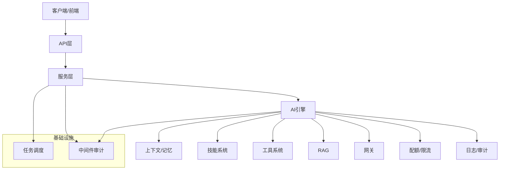

图表来源
- [internal_ai_service.py](file://backend/app/ai/internal_ai_service.py)
- [engine/base.py](file://backend/app/ai/engine/base.py)
- [context/orchestrator.py](file://backend/app/ai/context/orchestrator.py)
- [skills/__init__.py](file://backend/app/ai/skills/__init__.py)
- [tools/__init__.py](file://backend/app/ai/tools/__init__.py)
- [rag/__init__.py](file://backend/app/ai/rag/__init__.py)
- [gateway.py](file://backend/app/ai/gateway.py)
- [quota_manager.py](file://backend/app/ai/quota_manager.py)
- [rate_limiter.py](file://backend/app/ai/rate_limiter.py)
- [usage_recorder_core.py](file://backend/app/ai/usage_recorder_core.py)
- [middleware/audit_log.py](file://backend/app/middleware/audit_log.py)
- [tasks/ai.py](file://backend/app/tasks/ai.py)

## 详细组件分析

### 智能体管理
- 生命周期：从创建、配置、版本化到可见性与访问控制，贯穿绑定知识库、技能、路由策略与内存开关。
- 关键实体与接口：智能体模型/Schema/仓储/服务，API提供增删改查与版本发布。
- 会话与路由：支持路由字段与会话任务范围，结合内存开关与覆盖策略，保障会话一致性与性能。
- 审计与合规：操作日志、会话消息归属、租户级权限与策略覆盖。

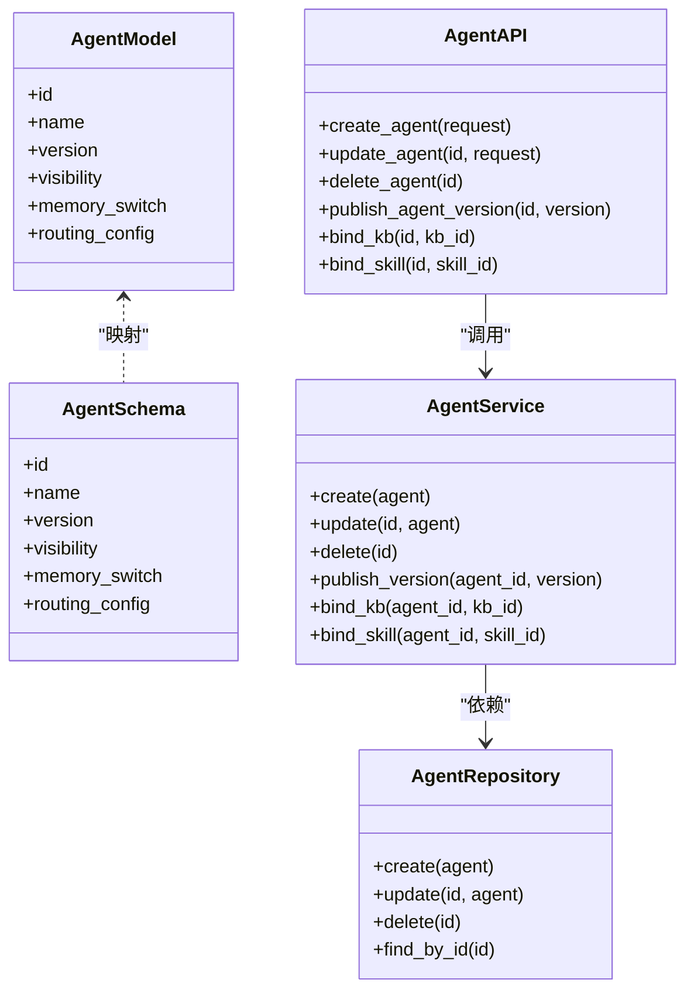

图表来源
- [models/ai/agent.py](file://backend/app/models/ai/agent.py)
- [schemas/ai/agent.py](file://backend/app/schemas/ai/agent.py)
- [repositories/ai/agent.py](file://backend/app/repositories/ai/agent.py)
- [services/ai/agent.py](file://backend/app/services/ai/agent.py)
- [api/tenant/ai_agent.py](file://backend/app/api/tenant/ai_agent.py)

章节来源
- [models/ai/agent.py](file://backend/app/models/ai/agent.py)
- [schemas/ai/agent.py](file://backend/app/schemas/ai/agent.py)
- [repositories/ai/agent.py](file://backend/app/repositories/ai/agent.py)
- [services/ai/agent.py](file://backend/app/services/ai/agent.py)
- [api/tenant/ai_agent.py](file://backend/app/api/tenant/ai_agent.py)
- [migrations/versions/..._add_ai_table_policies_and_overrides.py](file://backend/migrations/versions/20260212_8d11e316fec0_add_ai_table_policies_and_overrides.py)
- [migrations/versions/..._add_agent_memory_switch_and_override.py](file://backend/migrations/versions/20260302_9f2d1e34c7a1_add_agent_memory_switch_and_override.py)
- [migrations/versions/..._seed_router_agent_and_default_chat.py](file://backend/migrations/versions/20260305_seed_router_agent_and_default_chat.py)
- [migrations/versions/..._add_agent_id_to_conversation_messages.py](file://backend/migrations/versions/20260305_add_agent_id_to_conversation_messages.py)

### 对话处理
- 同步/异步入口：同步入口与流式入口分别适配不同交互模式，统一由内部AI服务编排。
- 执行管线：预飞行检查、预算守卫、意图规划、系统提示渲染、LLM调用、工具调用、后置处理与最终输出。
- 流式处理：流式处理器负责分块输出、事件记录、重放与最终化。
- 错误分类与恢复：失败分类、恢复决策、重试策略与工具结果归一化。

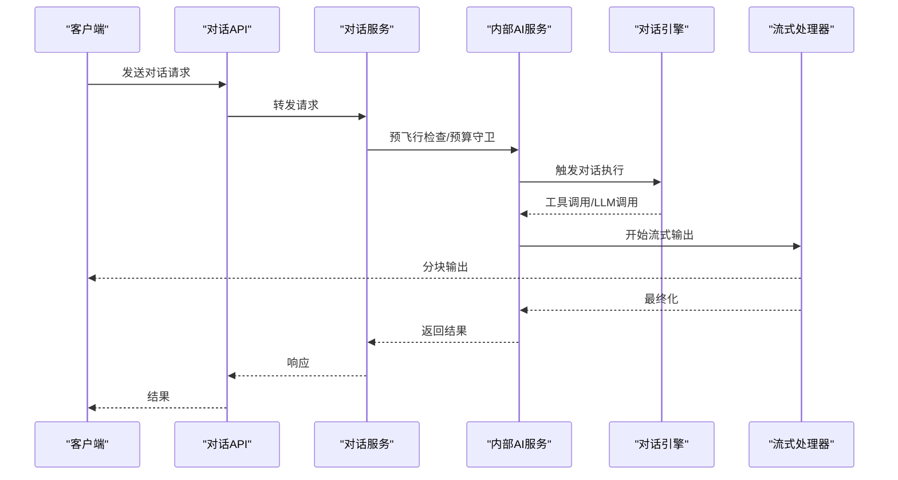

图表来源
- [api/tenant/ai_conversation.py](file://backend/app/api/tenant/ai_conversation.py)
- [services/ai/conversation.py](file://backend/app/services/ai/conversation.py)
- [internal_ai_service.py](file://backend/app/ai/internal_ai_service.py)
- [engine/conversation.py](file://backend/app/ai/engine/conversation.py)
- [engine/stream_handler.py](file://backend/app/ai/engine/stream_handler.py)

章节来源
- [api/tenant/ai_conversation.py](file://backend/app/api/tenant/ai_conversation.py)
- [services/ai/conversation.py](file://backend/app/services/ai/conversation.py)
- [internal_ai_service.py](file://backend/app/ai/internal_ai_service.py)
- [engine/conversation.py](file://backend/app/ai/engine/conversation.py)
- [engine/stream_handler.py](file://backend/app/ai/engine/stream_handler.py)

### 知识库管理
- 数据模型：知识库模型/Schema/仓储/服务，支持可见性、租户访问与音频/视频模型关联。
- 绑定与路由：智能体可绑定多个知识库，路由字段用于调用日志追踪。
- 操作日志：知识库变更、绑定、解绑均纳入操作日志与审计。

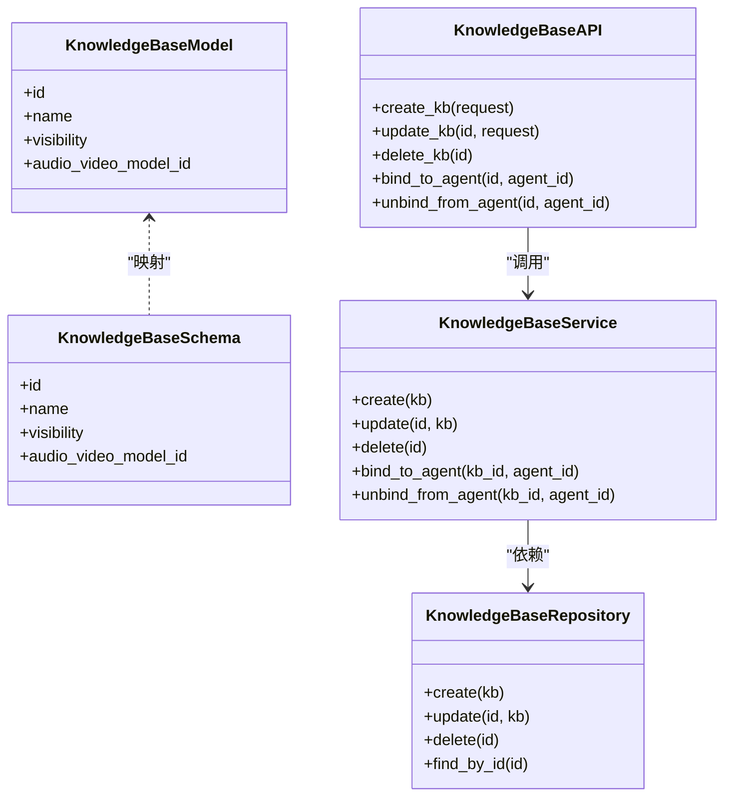

图表来源
- [models/ai/knowledge_base.py](file://backend/app/models/ai/knowledge_base.py)
- [schemas/ai/knowledge_base.py](file://backend/app/schemas/ai/knowledge_base.py)
- [repositories/ai/knowledge_base.py](file://backend/app/repositories/ai/knowledge_base.py)
- [services/ai/knowledge_base.py](file://backend/app/services/ai/knowledge_base.py)
- [api/tenant/ai_knowledge_base.py](file://backend/app/api/tenant/ai_knowledge_base.py)

章节来源
- [models/ai/knowledge_base.py](file://backend/app/models/ai/knowledge_base.py)
- [schemas/ai/knowledge_base.py](file://backend/app/schemas/ai/knowledge_base.py)
- [repositories/ai/knowledge_base.py](file://backend/app/repositories/ai/knowledge_base.py)
- [services/ai/knowledge_base.py](file://backend/app/services/ai/knowledge_base.py)
- [api/tenant/ai_knowledge_base.py](file://backend/app/api/tenant/ai_knowledge_base.py)
- [migrations/versions/..._add_ai_table_policies_and_overrides.py](file://backend/migrations/versions/20260212_8d11e316fec0_add_ai_table_policies_and_overrides.py)
- [migrations/versions/..._add_agent_kb_bindings.py](file://backend/migrations/versions/20260308_add_agent_kb_bindings.py)
- [migrations/versions/..._add_kb_visibility_and_tenant_access.py](file://backend/migrations/versions/20260224_add_kb_visibility_and_tenant_access.py)

### 技能系统
- 技能模型/Schema/仓储/服务：技能作为可复用能力单元，支持脚本、工具包、同意覆盖与路由配置。
- 绑定与执行：智能体可绑定技能，执行时按策略选择工具与信任策略。
- 动作日志：技能调用纳入动作日志，支持审计快照与执行决策ID。

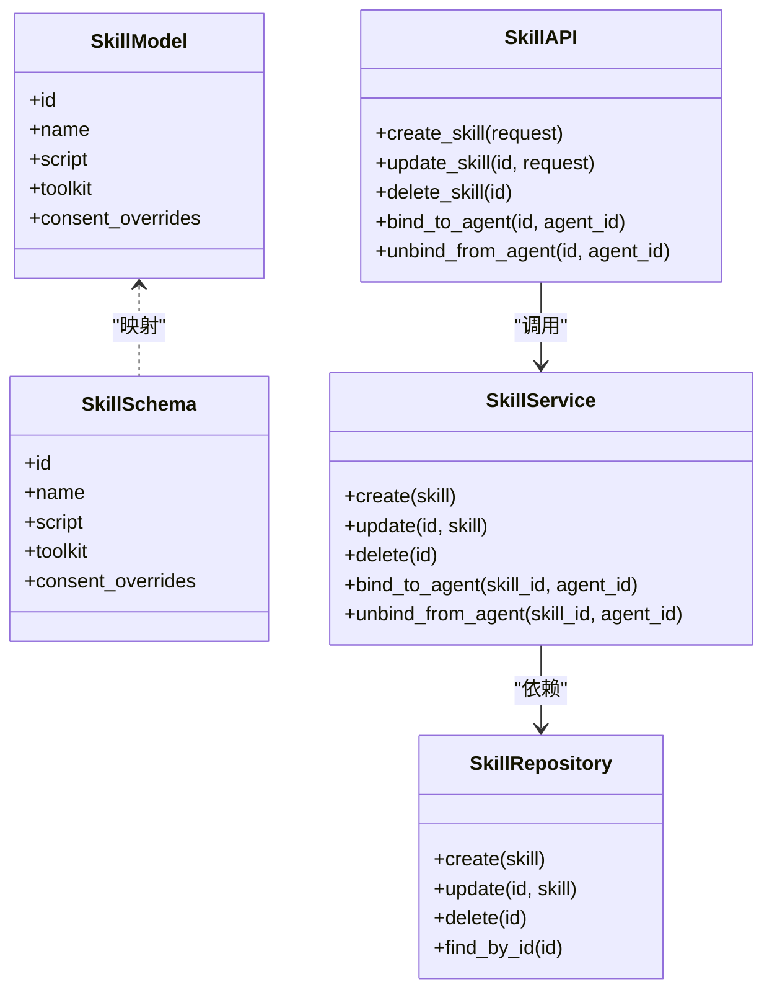

图表来源
- [models/ai/skill.py](file://backend/app/models/ai/skill.py)
- [schemas/ai/skill.py](file://backend/app/schemas/ai/skill.py)
- [repositories/ai/skill.py](file://backend/app/repositories/ai/skill.py)
- [services/ai/skill.py](file://backend/app/services/ai/skill.py)
- [api/tenant/ai_skill.py](file://backend/app/api/tenant/ai_skill.py)

章节来源
- [models/ai/skill.py](file://backend/app/models/ai/skill.py)
- [schemas/ai/skill.py](file://backend/app/schemas/ai/skill.py)
- [repositories/ai/skill.py](file://backend/app/repositories/ai/skill.py)
- [services/ai/skill.py](file://backend/app/services/ai/skill.py)
- [api/tenant/ai_skill.py](file://backend/app/api/tenant/ai_skill.py)
- [migrations/versions/..._add_ai_table_policies_and_overrides.py](file://backend/migrations/versions/20260212_8d11e316fec0_add_ai_table_policies_and_overrides.py)
- [migrations/versions/..._add_skill_consent_overrides_to_bindings.py](file://backend/migrations/versions/20260221_61e838badbfa_add_skill_consent_overrides_to_bindings.py)
- [migrations/versions/..._add_ai_action_log_actor_snapshots.py](file://backend/migrations/versions/20260326_0001_skill_architecture_foundation.py)

### 模型管理
- 模型与供应商：支持多供应商注册、模型能力与图像/音频/视频支持、模型等级与配额限制。
- 回退策略：当首选模型不可用时自动回退至备用模型或供应商。
- 使用统计与限额：模型使用统计、限额与租户配额联动。

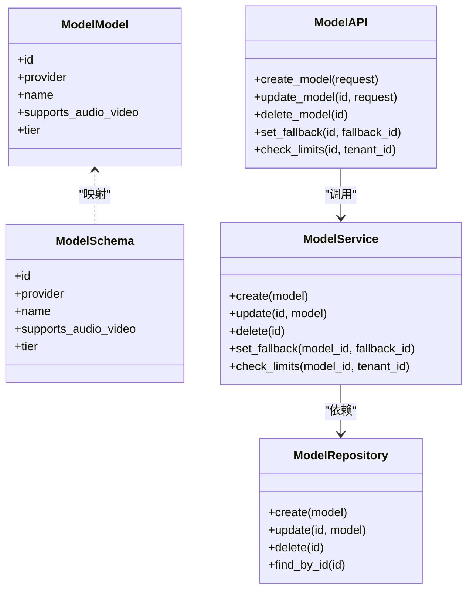

图表来源
- [models/ai/model.py](file://backend/app/models/ai/model.py)
- [schemas/ai/model.py](file://backend/app/schemas/ai/model.py)
- [repositories/ai/model.py](file://backend/app/repositories/ai/model.py)
- [services/ai/model.py](file://backend/app/services/ai/model.py)
- [api/tenant/ai_model.py](file://backend/app/api/tenant/ai_model.py)

章节来源
- [models/ai/model.py](file://backend/app/models/ai/model.py)
- [schemas/ai/model.py](file://backend/app/schemas/ai/model.py)
- [repositories/ai/model.py](file://backend/app/repositories/ai/model.py)
- [services/ai/model.py](file://backend/app/services/ai/model.py)
- [api/tenant/ai_model.py](file://backend/app/api/tenant/ai_model.py)
- [migrations/versions/..._add_ai_model_limits.py](file://backend/migrations/versions/20260208_003_add_ai_model_limits.py)
- [migrations/versions/..._add_model_fallback.py](file://backend/migrations/versions/20260208_005_add_model_fallback.py)
- [migrations/versions/..._add_ai_providers.py](file://backend/migrations/versions/20260120_001_add_ai_providers.py)

### 上下文与记忆
- 编排器：负责上下文组装、预算管理、压缩快照与裁剪策略。
- 上下文引擎：运行时摘要、长期记忆、提示补充与预算支持。
- 记忆记录：支持记忆记录表，便于清理与治理。

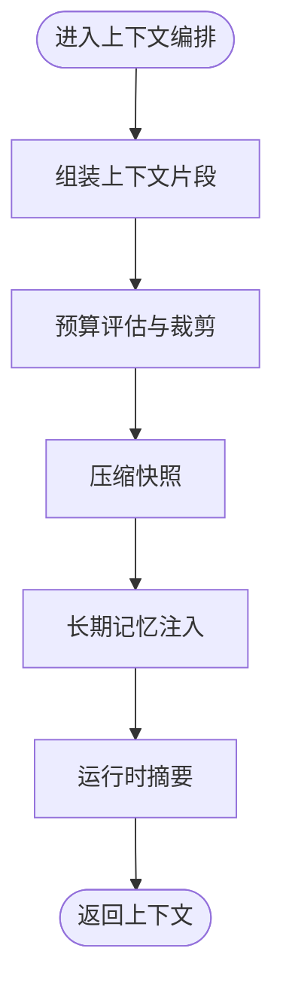

图表来源
- [context/orchestrator.py](file://backend/app/ai/context/orchestrator.py)
- [context/engine.py](file://backend/app/ai/context/engine.py)
- [migrations/versions/..._add_memory_records.py](file://backend/migrations/versions/20260329_0030_add_memory_records.py)

章节来源
- [context/orchestrator.py](file://backend/app/ai/context/orchestrator.py)
- [context/engine.py](file://backend/app/ai/context/engine.py)
- [migrations/versions/..._add_memory_records.py](file://backend/migrations/versions/20260329_0030_add_memory_records.py)

### 网关与配额
- 网关：统一接入多供应商，支持模型选择、回退与路由字段写入调用日志。
- 租户配额与并发：租户级配额、智能体并发控制、速率限制与重试策略。
- 失败回退：在异常情况下进行回退与降级处理。

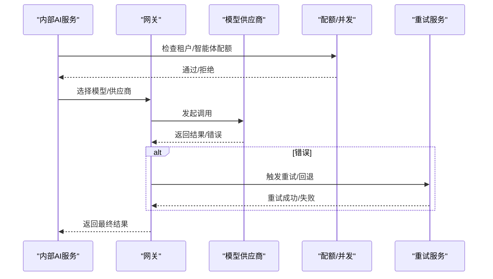

图表来源
- [gateway.py](file://backend/app/ai/gateway.py)
- [quota_manager.py](file://backend/app/ai/quota_manager.py)
- [agent_quota_manager.py](file://backend/app/ai/agent_quota_manager.py)
- [rate_limiter.py](file://backend/app/ai/rate_limiter.py)
- [retry_service.py](file://backend/app/ai/retry_service.py)
- [failover.py](file://backend/app/ai/failover.py)

章节来源
- [gateway.py](file://backend/app/ai/gateway.py)
- [quota_manager.py](file://backend/app/ai/quota_manager.py)
- [agent_quota_manager.py](file://backend/app/ai/agent_quota_manager.py)
- [rate_limiter.py](file://backend/app/ai/rate_limiter.py)
- [retry_service.py](file://backend/app/ai/retry_service.py)
- [failover.py](file://backend/app/ai/failover.py)

### 日志与审计
- 调用日志：记录请求元数据、路由字段、响应时间与状态。
- 查询日志：用户查询行为与上下文。
- 动作日志：技能调用、执行决策与快照。
- 操作日志：系统级操作与审计轨迹。
- 任务日志：后台任务执行情况。

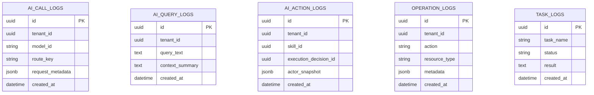

图表来源
- [migrations/versions/..._add_ai_call_logs.py](file://backend/migrations/versions/20260212_147c588d9898_add_ai_call_logs_table.py)
- [migrations/versions/..._add_ai_query_logs.py](file://backend/migrations/versions/20260212_6f8e790c9a68_add_ai_query_logs_table.py)
- [migrations/versions/..._add_ai_action_logs.py](file://backend/migrations/versions/20260211_ee87f790553e_add_ai_action_logs_table.py)
- [migrations/versions/..._add_operation_log_table.py](file://backend/migrations/versions/20260120_0001_add_operation_log_table.py)
- [migrations/versions/..._add_task_logs_table.py](file://backend/migrations/versions/20260208_0009_add_task_logs_table.py)

章节来源
- [migrations/versions/..._add_ai_call_logs.py](file://backend/migrations/versions/20260212_147c588d9898_add_ai_call_logs_table.py)
- [migrations/versions/..._add_ai_query_logs.py](file://backend/migrations/versions/20260212_6f8e790c9a68_add_ai_query_logs_table.py)
- [migrations/versions/..._add_ai_action_logs.py](file://backend/migrations/versions/20260211_ee87f790553e_add_ai_action_logs_table.py)
- [migrations/versions/..._add_operation_log_table.py](file://backend/migrations/versions/20260120_0001_add_operation_log_table.py)
- [migrations/versions/..._add_task_logs_table.py](file://backend/migrations/versions/20260208_0009_add_task_logs_table.py)
- [migrations/versions/..._add_ai_action_log_actor_snapshots.py](file://backend/migrations/versions/20260326_0001_skill_architecture_foundation.py)
- [migrations/versions/..._add_execution_decisions.py](file://backend/migrations/versions/20260329_0050_add_execution_decisions.py)
- [migrations/versions/..._add_execution_decision_id_to_ai_action_logs.py](file://backend/migrations/versions/20260330_0060_add_execution_decision_id_to_ai_action_logs.py)
- [migrations/versions/..._add_profile_snapshots.py](file://backend/migrations/versions/20260330_0070_add_profile_snapshots.py)

## 依赖分析
- 组件耦合：服务层对引擎与上下文存在强依赖；引擎对网关、配额、技能、工具、RAG存在横向依赖；API层仅依赖服务层。
- 外部依赖：模型供应商、存储驱动、任务队列与中间件。
- 循环依赖：未见明显循环依赖，分层清晰。
- 接口契约：API/服务/仓储/模型/Schema形成稳定契约，迁移友好。

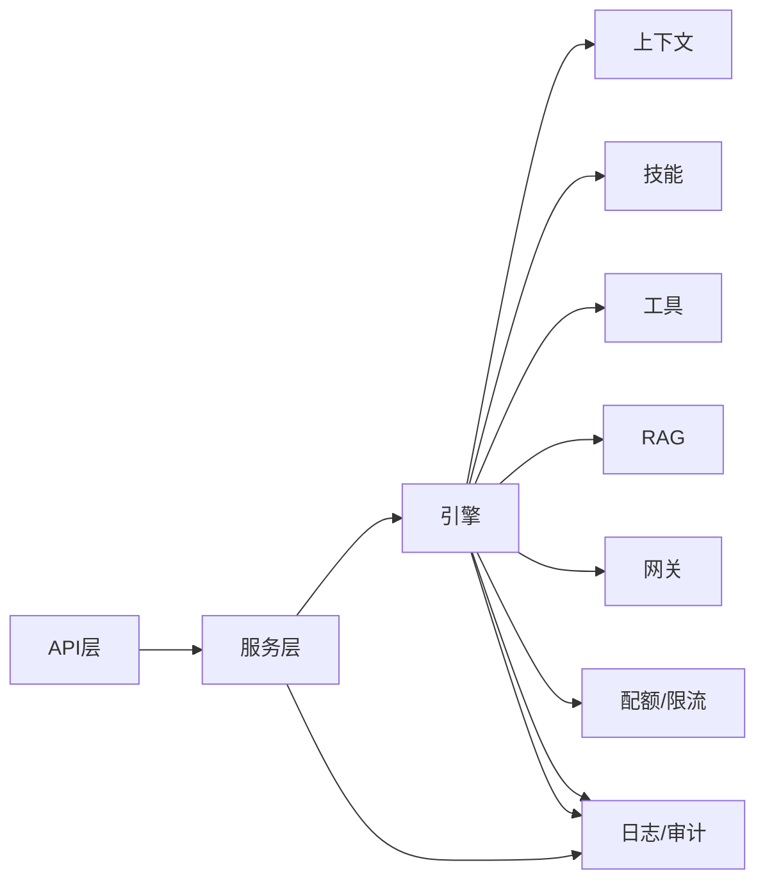

图表来源
- [internal_ai_service.py](file://backend/app/ai/internal_ai_service.py)
- [engine/base.py](file://backend/app/ai/engine/base.py)
- [context/orchestrator.py](file://backend/app/ai/context/orchestrator.py)
- [skills/__init__.py](file://backend/app/ai/skills/__init__.py)
- [tools/__init__.py](file://backend/app/ai/tools/__init__.py)
- [rag/__init__.py](file://backend/app/ai/rag/__init__.py)
- [gateway.py](file://backend/app/ai/gateway.py)
- [quota_manager.py](file://backend/app/ai/quota_manager.py)
- [rate_limiter.py](file://backend/app/ai/rate_limiter.py)
- [usage_recorder_core.py](file://backend/app/ai/usage_recorder_core.py)
- [middleware/audit_log.py](file://backend/app/middleware/audit_log.py)

章节来源
- [internal_ai_service.py](file://backend/app/ai/internal_ai_service.py)
- [engine/base.py](file://backend/app/ai/engine/base.py)
- [context/orchestrator.py](file://backend/app/ai/context/orchestrator.py)
- [skills/__init__.py](file://backend/app/ai/skills/__init__.py)
- [tools/__init__.py](file://backend/app/ai/tools/__init__.py)
- [rag/__init__.py](file://backend/app/ai/rag/__init__.py)
- [gateway.py](file://backend/app/ai/gateway.py)
- [quota_manager.py](file://backend/app/ai/quota_manager.py)
- [rate_limiter.py](file://backend/app/ai/rate_limiter.py)
- [usage_recorder_core.py](file://backend/app/ai/usage_recorder_core.py)
- [middleware/audit_log.py](file://backend/app/middleware/audit_log.py)

## 性能考虑
- 并发控制：租户与智能体维度的并发配额与速率限制，避免资源争用与雪崩。
- 预算守卫：对话前预算评估与上下文裁剪，降低长上下文带来的延迟与成本。
- 流式输出：流式处理器减少首字节延迟，提升用户体验。
- 缓存与快照：压缩快照与长期记忆缓存，加速后续会话。
- 重试与回退：指数退避与回退策略，提高可用性与稳定性。
- 任务调度：后台任务异步化，减轻请求路径压力。

## 故障排查指南
- 常见错误类型：配额不足、模型不可用、工具调用失败、上下文过长、网络超时。
- 排查步骤：
  - 查看调用日志与查询日志定位问题根因。
  - 检查动作日志中的执行决策与快照信息。
  - 核对配额/并发与速率限制配置。
  - 验证网关路由与模型回退策略。
  - 使用重试服务与失败回退机制进行恢复。
- 中间件审计：启用审计日志，确保操作可追溯。

章节来源
- [exceptions.py](file://backend/app/ai/exceptions.py)
- [retry_service.py](file://backend/app/ai/retry_service.py)
- [failover.py](file://backend/app/ai/failover.py)
- [middleware/audit_log.py](file://backend/app/middleware/audit_log.py)
- [migrations/versions/..._add_ai_call_logs.py](file://backend/migrations/versions/20260212_147c588d9898_add_ai_call_logs_table.py)
- [migrations/versions/..._add_ai_action_logs.py](file://backend/migrations/versions/20260211_ee87f790553e_add_ai_action_logs_table.py)

## 结论
本AI业务服务以引擎为核心，围绕上下文、技能、工具、RAG与网关构建统一编排能力，结合配额/并发与限流保障稳定性，并通过完善的日志与审计体系实现可运维与可追溯。该架构适合在多租户场景下扩展智能体、对话与知识增强能力，满足复杂业务需求。

## 附录
- 术语说明：智能体、会话、上下文、技能、工具、RAG、网关、配额、并发、流式输出、动作日志、调用日志、查询日志、操作日志、任务日志。
- 最佳实践：
  - 明确智能体边界与可见性，合理配置路由与内存策略。
  - 在对话前进行预算评估与上下文裁剪，避免超长上下文。
  - 使用流式输出提升用户体验，结合错误分类与回退策略。
  - 将关键操作纳入动作日志与审计，保留执行决策与快照。
  - 通过任务调度异步化非关键流程，保持请求路径轻量。