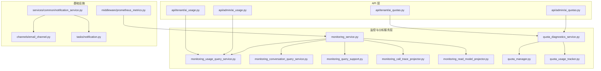
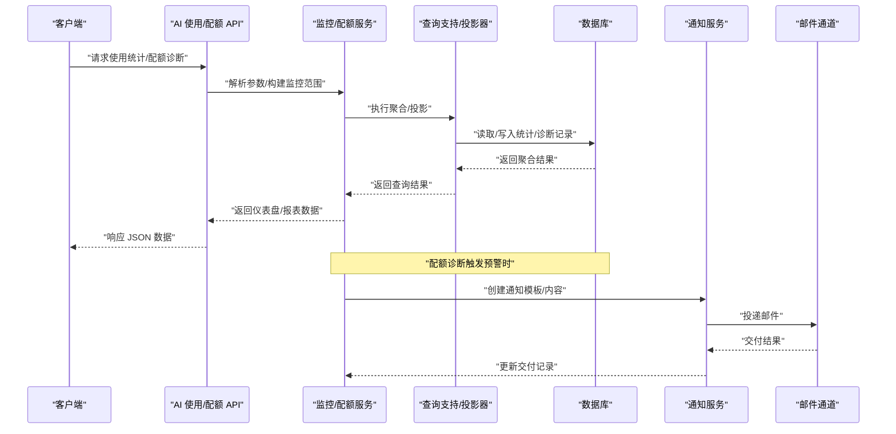
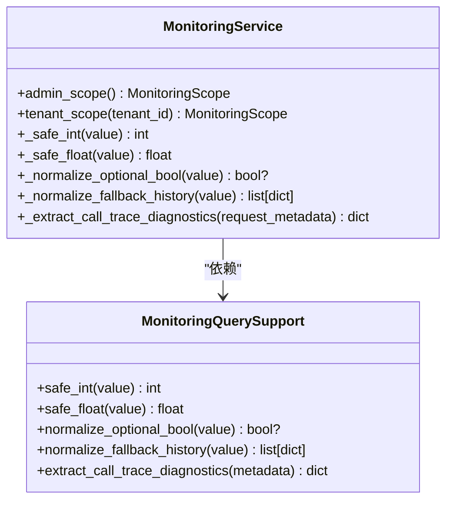
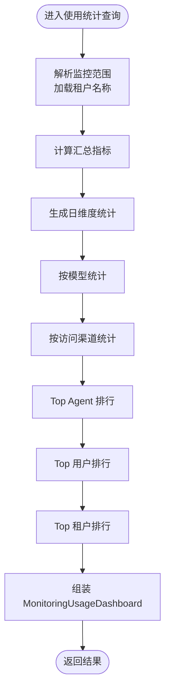
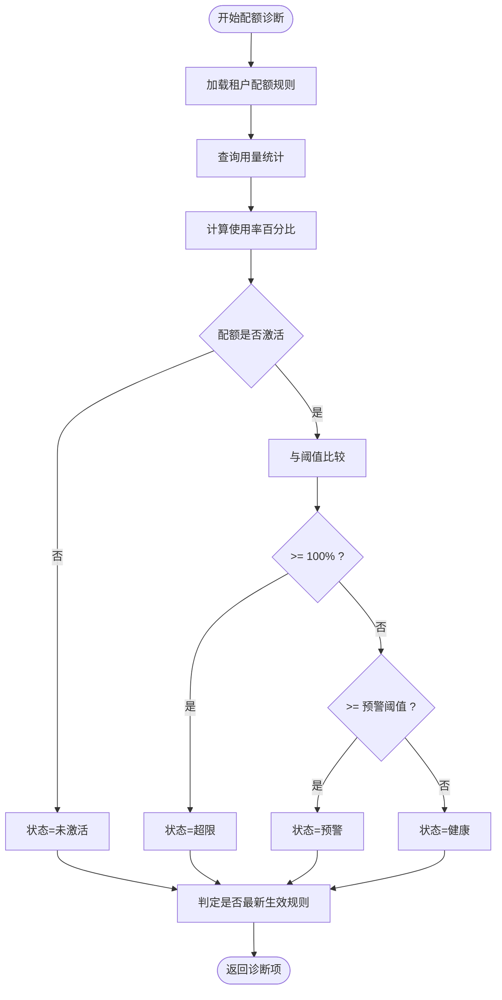
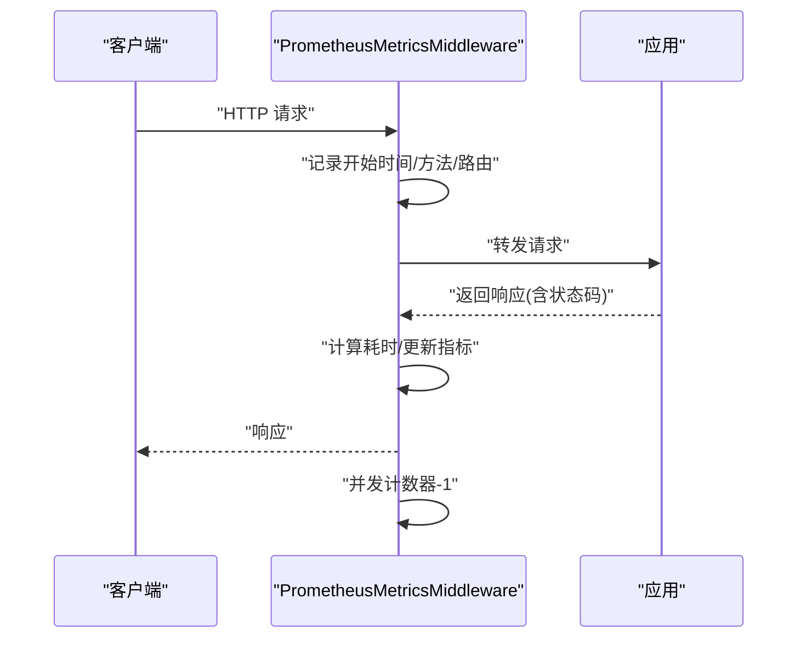
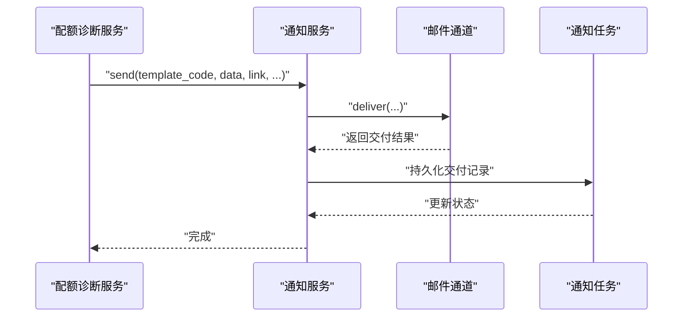
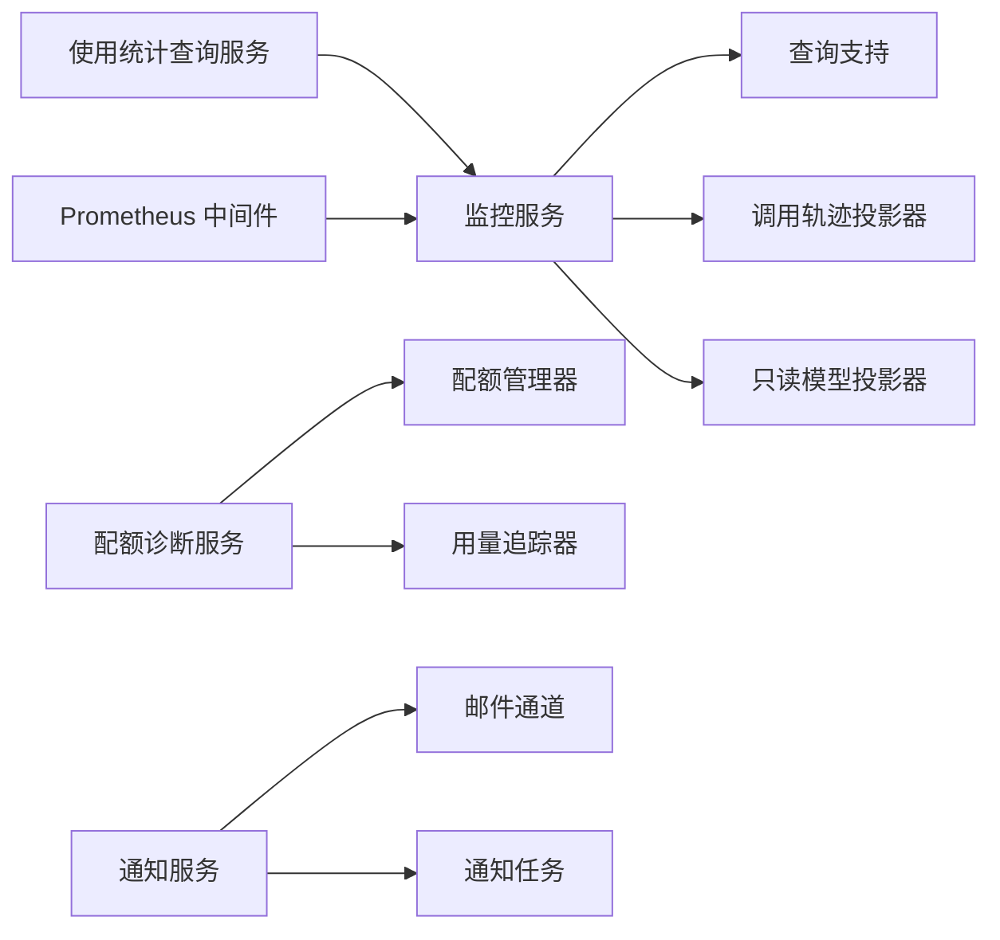

# 分析和监控服务

<cite>
**本文引用的文件**
- [backend/app/services/ai/monitoring_service.py](file://backend/app/services/ai/monitoring_service.py)
- [backend/app/services/ai/monitoring_usage_query_service.py](file://backend/app/services/ai/monitoring_usage_query_service.py)
- [backend/app/services/ai/monitoring_conversation_query_service.py](file://backend/app/services/ai/monitoring_conversation_query_service.py)
- [backend/app/services/ai/monitoring_query_support.py](file://backend/app/services/ai/monitoring_query_support.py)
- [backend/app/services/ai/monitoring_call_trace_projector.py](file://backend/app/services/ai/monitoring_call_trace_projector.py)
- [backend/app/services/ai/monitoring_read_model_projector.py](file://backend/app/services/ai/monitoring_read_model_projector.py)
- [backend/app/schemas/ai/monitoring.py](file://backend/app/schemas/ai/monitoring.py)
- [backend/app/middleware/prometheus_metrics.py](file://backend/app/middleware/prometheus_metrics.py)
- [backend/app/ai/quota_manager.py](file://backend/app/ai/quota_manager.py)
- [backend/app/ai/quota_usage_tracker.py](file://backend/app/ai/quota_usage_tracker.py)
- [backend/app/services/ai/quota_diagnostics_service.py](file://backend/app/services/ai/quota_diagnostics_service.py)
- [backend/app/repositories/ai/quota_diagnostics_repository.py](file://backend/app/repositories/ai/quota_diagnostics_repository.py)
- [backend/app/models/ai/tenant_quota.py](file://backend/app/models/ai/tenant_quota.py)
- [backend/app/api/admin/ai_usage.py](file://backend/app/api/admin/ai_usage.py)
- [backend/app/api/tenant/ai_usage.py](file://backend/app/api/tenant/ai_usage.py)
- [backend/app/api/admin/ai_quotas.py](file://backend/app/api/admin/ai_quotas.py)
- [backend/app/api/tenant/ai_quotas.py](file://backend/app/api/tenant/ai_quotas.py)
- [backend/app/services/common/notification_service.py](file://backend/app/services/common/notification_service.py)
- [backend/app/services/common/channels/email_channel.py](file://backend/app/services/common/channels/email_channel.py)
- [backend/app/tasks/notification.py](file://backend/app/tasks/notification.py)
- [backend/app/configs/definitions/platform/websocket.py](file://backend/app/configs/definitions/platform/websocket.py)
- [backend/docs/storage/RUN_LOG_ANALYSIS.md](file://backend/docs/storage/RUN_LOG_ANALYSIS.md)
- [backend/tests/core/test_metrics_endpoint.py](file://backend/tests/core/test_metrics_endpoint.py)
</cite>

## 目录
1. [引言](#引言)
2. [项目结构](#项目结构)
3. [核心组件](#核心组件)
4. [架构总览](#架构总览)
5. [详细组件分析](#详细组件分析)
6. [依赖关系分析](#依赖关系分析)
7. [性能考量](#性能考量)
8. [故障排查指南](#故障排查指南)
9. [结论](#结论)
10. [附录](#附录)

## 引言
本技术文档面向“分析与监控服务”，系统性阐述 AI 系统的监控架构与运行时诊断能力，覆盖性能指标采集、使用统计分析、数据采集与处理流水线、可视化展示、配额诊断与预警、租户级分析与报表生成、监控告警配置与通知机制，并提供性能瓶颈识别、容量规划与成本优化建议。文档以代码为依据，结合架构图与流程图，帮助读者快速理解与落地。

## 项目结构
后端采用分层与领域驱动设计，监控与分析相关模块主要集中在以下位置：
- 服务层：AI 监控服务、配额诊断服务、使用统计查询服务等
- 中间件：Prometheus 指标中间件
- API 层：管理员与租户维度的使用与配额接口
- 任务与通知：异步通知投递与渠道适配
- 文档与测试：运行日志分析文档与指标端点测试

图表来源
- [backend/app/services/ai/monitoring_service.py:52-90](file://backend/app/services/ai/monitoring_service.py#L52-L90)
- [backend/app/services/ai/monitoring_usage_query_service.py:352-369](file://backend/app/services/ai/monitoring_usage_query_service.py#L352-L369)
- [backend/app/services/ai/monitoring_conversation_query_service.py](file://backend/app/services/ai/monitoring_conversation_query_service.py)
- [backend/app/services/ai/monitoring_query_support.py](file://backend/app/services/ai/monitoring_query_support.py)
- [backend/app/services/ai/monitoring_call_trace_projector.py](file://backend/app/services/ai/monitoring_call_trace_projector.py)
- [backend/app/services/ai/monitoring_read_model_projector.py](file://backend/app/services/ai/monitoring_read_model_projector.py)
- [backend/app/services/ai/quota_diagnostics_service.py:116-150](file://backend/app/services/ai/quota_diagnostics_service.py#L116-L150)
- [backend/app/ai/quota_manager.py:56-74](file://backend/app/ai/quota_manager.py#L56-L74)
- [backend/app/ai/quota_usage_tracker.py](file://backend/app/ai/quota_usage_tracker.py)
- [backend/app/api/admin/ai_usage.py](file://backend/app/api/admin/ai_usage.py)
- [backend/app/api/tenant/ai_usage.py](file://backend/app/api/tenant/ai_usage.py)
- [backend/app/api/admin/ai_quotas.py](file://backend/app/api/admin/ai_quotas.py)
- [backend/app/api/tenant/ai_quotas.py](file://backend/app/api/tenant/ai_quotas.py)
- [backend/app/middleware/prometheus_metrics.py:146-168](file://backend/app/middleware/prometheus_metrics.py#L146-L168)
- [backend/app/services/common/notification_service.py:163-277](file://backend/app/services/common/notification_service.py#L163-L277)
- [backend/app/services/common/channels/email_channel.py:38-76](file://backend/app/services/common/channels/email_channel.py#L38-L76)
- [backend/app/tasks/notification.py:72-113](file://backend/app/tasks/notification.py#L72-L113)

章节来源
- [backend/app/services/ai/monitoring_service.py:52-90](file://backend/app/services/ai/monitoring_service.py#L52-L90)
- [backend/app/middleware/prometheus_metrics.py:146-168](file://backend/app/middleware/prometheus_metrics.py#L146-L168)

## 核心组件
- 监控服务与查询支持：提供监控范围抽象、参数标准化、调用追踪诊断提取等基础能力，支撑仪表盘与报表的数据需求。
- 使用统计查询服务：聚合平台/租户/模型/访问渠道等多维统计，输出汇总与分层数据，用于可视化与报表。
- 配额诊断服务：基于租户配额规则与用量统计，计算使用率、预警阈值与状态，输出健康度评估。
- Prometheus 指标中间件：统一采集 HTTP 请求总量、耗时分布与并发度，屏蔽业务细节，便于基础设施观测。
- 通知与告警：通过通知服务与邮件通道，将配额预警、健康检查异常等信息推送给管理员或租户。

章节来源
- [backend/app/services/ai/monitoring_service.py:52-90](file://backend/app/services/ai/monitoring_service.py#L52-L90)
- [backend/app/services/ai/monitoring_usage_query_service.py:352-369](file://backend/app/services/ai/monitoring_usage_query_service.py#L352-L369)
- [backend/app/services/ai/quota_diagnostics_service.py:116-150](file://backend/app/services/ai/quota_diagnostics_service.py#L116-L150)
- [backend/app/middleware/prometheus_metrics.py:146-168](file://backend/app/middleware/prometheus_metrics.py#L146-L168)
- [backend/app/services/common/notification_service.py:163-277](file://backend/app/services/common/notification_service.py#L163-L277)

## 架构总览
监控体系由“数据采集—处理投影—查询服务—可视化/报表—告警通知”构成闭环。Prometheus 中间件负责基础设施层指标；业务侧通过监控服务与查询服务产出平台/租户/模型等维度的统计；配额诊断服务对用量进行健康评估；通知服务将结果投递到邮件/站内信/WS 等渠道。

图表来源
- [backend/app/api/admin/ai_usage.py](file://backend/app/api/admin/ai_usage.py)
- [backend/app/api/tenant/ai_usage.py](file://backend/app/api/tenant/ai_usage.py)
- [backend/app/api/admin/ai_quotas.py](file://backend/app/api/admin/ai_quotas.py)
- [backend/app/api/tenant/ai_quotas.py](file://backend/app/api/tenant/ai_quotas.py)
- [backend/app/services/ai/monitoring_service.py:52-90](file://backend/app/services/ai/monitoring_service.py#L52-L90)
- [backend/app/services/ai/monitoring_usage_query_service.py:352-369](file://backend/app/services/ai/monitoring_usage_query_service.py#L352-L369)
- [backend/app/services/ai/quota_diagnostics_service.py:116-150](file://backend/app/services/ai/quota_diagnostics_service.py#L116-L150)
- [backend/app/services/common/notification_service.py:163-277](file://backend/app/services/common/notification_service.py#L163-L277)
- [backend/app/services/common/channels/email_channel.py:38-76](file://backend/app/services/common/channels/email_channel.py#L38-L76)

## 详细组件分析

### 监控服务与查询支持
- 职责：封装监控范围、参数安全转换、调用追踪诊断提取、平台/租户名称映射等。
- 关键点：提供 admin/tenant 两种作用域；对数值/布尔/可选字段进行安全归一化；从请求元数据中抽取调用诊断信息。

图表来源
- [backend/app/services/ai/monitoring_service.py:52-90](file://backend/app/services/ai/monitoring_service.py#L52-L90)
- [backend/app/services/ai/monitoring_query_support.py](file://backend/app/services/ai/monitoring_query_support.py)

章节来源
- [backend/app/services/ai/monitoring_service.py:52-90](file://backend/app/services/ai/monitoring_service.py#L52-L90)

### 使用统计查询服务与仪表盘
- 职责：按平台/租户/模型/访问渠道等维度聚合使用统计，生成日统计、模型统计、Top 排行等，供前端仪表盘展示。
- 关键点：根据监控范围加载租户名称；组装 MonitoringUsageDashboard 结构返回。

图表来源
- [backend/app/services/ai/monitoring_usage_query_service.py:352-369](file://backend/app/services/ai/monitoring_usage_query_service.py#L352-L369)

章节来源
- [backend/app/services/ai/monitoring_usage_query_service.py:352-369](file://backend/app/services/ai/monitoring_usage_query_service.py#L352-L369)

### 配额诊断与预警
- 职责：基于租户配额规则与用量统计，计算使用率、是否预警/超限、健康状态；判断是否为最新生效规则。
- 关键点：支持按周期/模型维度计量；默认预警阈值与超限阈值；健康状态枚举（健康/预警/超限/未激活）。

图表来源
- [backend/app/services/ai/quota_diagnostics_service.py:116-150](file://backend/app/services/ai/quota_diagnostics_service.py#L116-L150)
- [backend/app/ai/quota_usage_tracker.py](file://backend/app/ai/quota_usage_tracker.py)
- [backend/app/models/ai/tenant_quota.py](file://backend/app/models/ai/tenant_quota.py)

章节来源
- [backend/app/services/ai/quota_diagnostics_service.py:116-150](file://backend/app/services/ai/quota_diagnostics_service.py#L116-L150)

### Prometheus 指标中间件
- 职责：在 ASGI 应用层拦截请求，自动统计 HTTP 请求总量、耗时分布与并发度，并设置组件健康指标。
- 关键点：排除自身 /metrics 的采集；区分业务路由与基础设施路由；并发计数器随请求结束自减。

图表来源
- [backend/app/middleware/prometheus_metrics.py:146-168](file://backend/app/middleware/prometheus_metrics.py#L146-L168)
- [backend/tests/core/test_metrics_endpoint.py:60-189](file://backend/tests/core/test_metrics_endpoint.py#L60-L189)

章节来源
- [backend/app/middleware/prometheus_metrics.py:146-168](file://backend/app/middleware/prometheus_metrics.py#L146-L168)
- [backend/tests/core/test_metrics_endpoint.py:60-189](file://backend/tests/core/test_metrics_endpoint.py#L60-L189)

### 通知与告警投递
- 职责：统一管理通知模板渲染、渠道投递、交付记录与回写；邮件通道支持启用开关与 JSON 值解析。
- 关键点：模板缺失时的降级策略；WS/站内信通道优先级；邮件投递失败的分类与跳过逻辑。

图表来源
- [backend/app/services/common/notification_service.py:163-277](file://backend/app/services/common/notification_service.py#L163-L277)
- [backend/app/services/common/channels/email_channel.py:38-76](file://backend/app/services/common/channels/email_channel.py#L38-L76)
- [backend/app/tasks/notification.py:72-113](file://backend/app/tasks/notification.py#L72-L113)

章节来源
- [backend/app/services/common/notification_service.py:163-277](file://backend/app/services/common/notification_service.py#L163-L277)
- [backend/app/services/common/channels/email_channel.py:38-76](file://backend/app/services/common/channels/email_channel.py#L38-L76)
- [backend/app/tasks/notification.py:72-113](file://backend/app/tasks/notification.py#L72-L113)

### 运行时诊断与调用追踪
- 职责：从请求元数据中提取调用追踪诊断信息，辅助定位慢调用、错误链路与路由问题。
- 关联：监控服务提供提取入口，查询支持提供归一化工具。

章节来源
- [backend/app/services/ai/monitoring_service.py:89-90](file://backend/app/services/ai/monitoring_service.py#L89-L90)
- [backend/app/services/ai/monitoring_query_support.py](file://backend/app/services/ai/monitoring_query_support.py)

### 数据采集与处理流水线
- 职责：将原始调用日志转化为可查询的只读模型，支持聚合与 Top 排行。
- 组件：调用轨迹投影器、只读模型投影器、查询支持。

章节来源
- [backend/app/services/ai/monitoring_call_trace_projector.py](file://backend/app/services/ai/monitoring_call_trace_projector.py)
- [backend/app/services/ai/monitoring_read_model_projector.py](file://backend/app/services/ai/monitoring_read_model_projector.py)
- [backend/app/services/ai/monitoring_query_support.py](file://backend/app/services/ai/monitoring_query_support.py)

## 依赖关系分析
- 监控服务依赖查询支持与投影器，形成“范围抽象—参数归一化—诊断提取”的基础能力。
- 使用统计查询服务依赖监控服务提供的范围与归一化能力，以及租户名称映射。
- 配额诊断服务依赖用量追踪与租户配额模型，输出健康度与规则有效性判断。
- Prometheus 中间件独立于业务逻辑，仅依赖框架生命周期钩子。
- 通知服务与邮件通道解耦，通过模板与数据驱动交付。

图表来源
- [backend/app/services/ai/monitoring_service.py:52-90](file://backend/app/services/ai/monitoring_service.py#L52-L90)
- [backend/app/services/ai/monitoring_usage_query_service.py:352-369](file://backend/app/services/ai/monitoring_usage_query_service.py#L352-L369)
- [backend/app/services/ai/quota_diagnostics_service.py:116-150](file://backend/app/services/ai/quota_diagnostics_service.py#L116-L150)
- [backend/app/middleware/prometheus_metrics.py:146-168](file://backend/app/middleware/prometheus_metrics.py#L146-L168)
- [backend/app/services/common/notification_service.py:163-277](file://backend/app/services/common/notification_service.py#L163-L277)
- [backend/app/services/common/channels/email_channel.py:38-76](file://backend/app/services/common/channels/email_channel.py#L38-L76)
- [backend/app/tasks/notification.py:72-113](file://backend/app/tasks/notification.py#L72-L113)

章节来源
- [backend/app/services/ai/monitoring_service.py:52-90](file://backend/app/services/ai/monitoring_service.py#L52-L90)
- [backend/app/services/ai/quota_diagnostics_service.py:116-150](file://backend/app/services/ai/quota_diagnostics_service.py#L116-L150)

## 性能考量
- 指标采集开销：Prometheus 中间件仅在请求结束时更新计数器与直方图，避免阻塞主业务路径。
- 查询优化：使用查询支持进行参数安全转换与归一化，减少无效过滤；聚合查询应配合索引与物化视图（如存在）。
- 并发控制：中间件并发计数器随请求结束自减，防止指标漂移。
- 用量统计：配额诊断按周期/模型聚合，建议缓存热点租户的配额与用量，降低数据库压力。
- 通知投递：邮件通道启用开关与失败分类，避免无效重试与配置错误导致的抖动。

## 故障排查指南
- 指标不可见或异常
  - 确认 /metrics 路由注册与权限豁免；排除自采集计入业务指标。
  - 检查组件健康指标 TTL 缓存刷新频率。
- 配额预警不生效
  - 核对租户配额规则是否激活、阈值设置与周期匹配；确认用量统计是否正确写入。
  - 检查最新规则判定逻辑与生效时间。
- 通知未送达
  - 检查通知模板是否存在与渲染结果；核对邮件通道启用状态与配置完整性。
  - 查看通知任务交付记录与错误类型，区分配置问题与网络异常。

章节来源
- [backend/tests/core/test_metrics_endpoint.py:60-189](file://backend/tests/core/test_metrics_endpoint.py#L60-L189)
- [backend/app/services/ai/quota_diagnostics_service.py:116-150](file://backend/app/services/ai/quota_diagnostics_service.py#L116-L150)
- [backend/app/services/common/channels/email_channel.py:38-76](file://backend/app/services/common/channels/email_channel.py#L38-L76)
- [backend/app/tasks/notification.py:72-113](file://backend/app/tasks/notification.py#L72-L113)

## 结论
该监控体系以“基础设施指标 + 业务使用统计 + 配额健康诊断 + 通知告警”为核心闭环，通过查询支持与投影器实现高效的数据采集与聚合，辅以租户级仪表盘与报表能力。建议在生产环境中结合容量规划与成本优化策略，持续迭代配额阈值与预警策略，提升系统的可观测性与稳定性。

## 附录
- 运行日志分析参考文档：[RUN_LOG_ANALYSIS.md](file://backend/docs/storage/RUN_LOG_ANALYSIS.md)
- 平台通知配置项（示例）：通知保留天数、每用户最大通知存储条数、Webhook 开关等。

章节来源
- [backend/docs/storage/RUN_LOG_ANALYSIS.md](file://backend/docs/storage/RUN_LOG_ANALYSIS.md)
- [backend/app/configs/definitions/platform/websocket.py:84-125](file://backend/app/configs/definitions/platform/websocket.py#L84-L125)