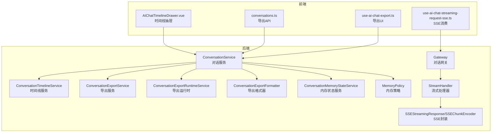
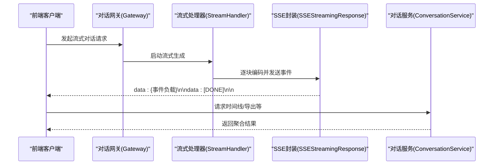
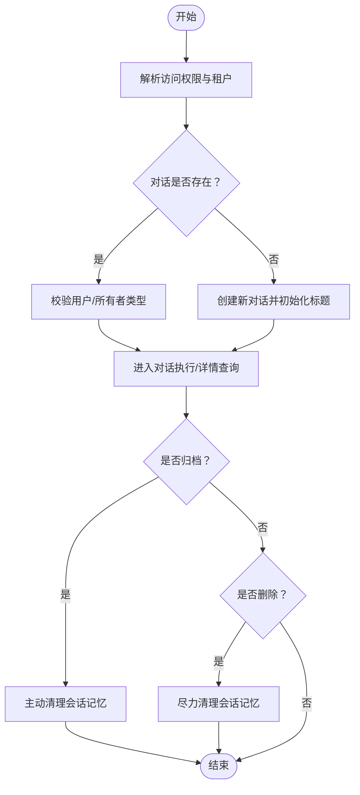
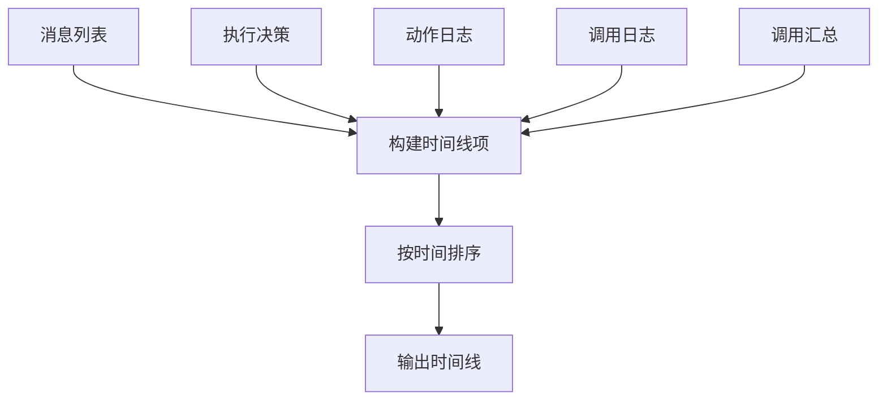
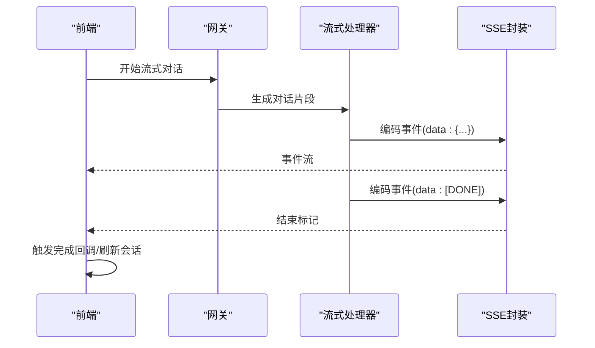
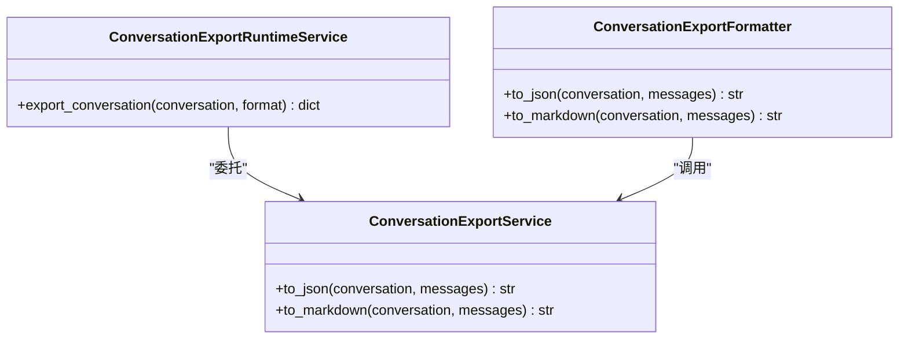
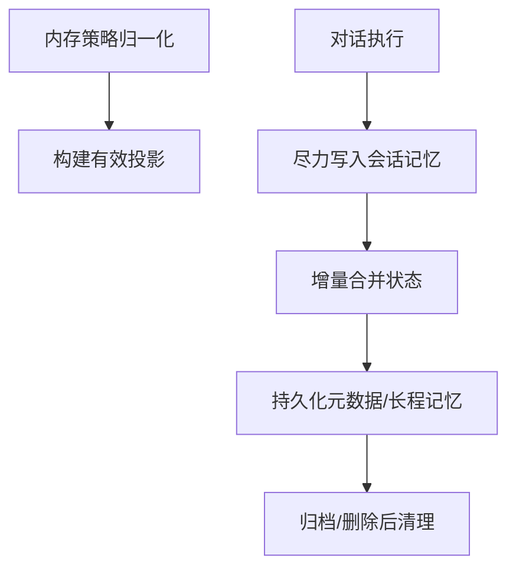
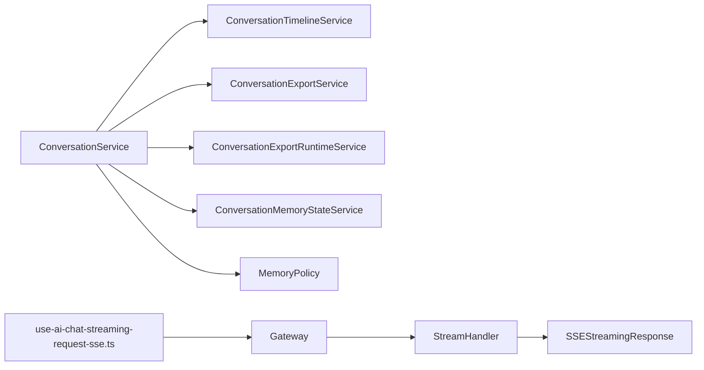

# 对话服务

<cite>
**本文引用的文件**   
- [conversation_service.py](file://backend/app/services/ai/conversation_service.py)
- [conversation_timeline_service.py](file://backend/app/services/ai/conversation_timeline_service.py)
- [conversation_export_service.py](file://backend/app/services/ai/conversation_export_service.py)
- [conversation_export_formatter.py](file://backend/app/services/ai/conversation_export_formatter.py)
- [conversation_export_runtime_service.py](file://backend/app/services/ai/conversation_export_runtime_service.py)
- [conversation_turn_flow_projector.py](file://backend/app/services/ai/conversation_turn_flow_projector.py)
- [skill_registry_query_service.py](file://backend/app/services/ai/skill_registry_query_service.py)
- [monitoring_query_support.py](file://backend/app/services/ai/monitoring_query_support.py)
- [agent_chat_memory_support.py](file://backend/app/services/ai/agent_chat_memory_support.py)
- [memory_policy.py](file://backend/app/ai/memory_policy.py)
- [conversation_memory_state_service.py](file://backend/app/services/ai/conversation_memory_state_service.py)
- [gateway.py](file://backend/app/ai/gateway.py)
- [stream_handler.py](file://backend/app/ai/engine/stream_handler.py)
- [sse.py](file://backend/app/ai/sse.py)
- [use-ai-chat-streaming-request-sse.ts](file://frontend/apps/web-antd/src/components/business/ai-chat-panel/use-ai-chat-streaming-request-sse.ts)
- [AIChatTimelineDrawer.vue](file://frontend/apps/web-antd/src/components/business/ai-slide-panel/AIChatTimelineDrawer.vue)
- [conversations.ts](file://frontend/apps/web-antd/src/api/tenant/conversations.ts)
- [use-ai-chat-export.ts](file://frontend/apps/web-antd/src/components/business/ai-chat-panel/use-ai-chat-export.ts)
- [test_sse.py](file://backend/tests/ai/test_sse.py)
- [test_conversation_timeline_service.py](file://backend/tests/services/test_conversation_timeline_service.py)
- [test_conversation_export_runtime_service.py](file://backend/tests/services/test_conversation_export_runtime_service.py)
</cite>

## 目录
1. [简介](#简介)
2. [项目结构](#项目结构)
3. [核心组件](#核心组件)
4. [架构总览](#架构总览)
5. [组件详解](#组件详解)
6. [依赖关系分析](#依赖关系分析)
7. [性能考量](#性能考量)
8. [故障排查指南](#故障排查指南)
9. [结论](#结论)
10. [附录](#附录)

## 简介
本文件系统性梳理对话服务的完整技术架构，覆盖对话创建、消息处理、历史记录与时间线生成、流式响应（SSE）、消息持久化、对话导出、搜索/过滤/排序、并发与性能优化以及安全与隐私策略。文档面向不同层次读者，既提供高层架构视图，也给出代码级关系与流程图示。

## 项目结构
对话服务主要由后端服务层与前端交互层构成：
- 后端服务层：对话生命周期管理、时间线聚合、导出格式化、内存策略与状态、流式引擎与SSE封装、监控查询支持等。
- 前端交互层：SSE流式消费、时间线抽屉展示、导出UI与API调用。

图表来源
- [conversation_service.py:44-608](file://backend/app/services/ai/conversation_service.py#L44-L608)
- [conversation_timeline_service.py:25-219](file://backend/app/services/ai/conversation_timeline_service.py#L25-L219)
- [conversation_export_service.py:44-144](file://backend/app/services/ai/conversation_export_service.py#L44-L144)
- [conversation_export_runtime_service.py:17-78](file://backend/app/services/ai/conversation_export_runtime_service.py#L17-L78)
- [conversation_export_formatter.py:1-18](file://backend/app/services/ai/conversation_export_formatter.py#L1-L18)
- [conversation_memory_state_service.py:98-126](file://backend/app/services/ai/conversation_memory_state_service.py#L98-L126)
- [memory_policy.py:71-536](file://backend/app/ai/memory_policy.py#L71-L536)
- [gateway.py:220-256](file://backend/app/ai/gateway.py#L220-L256)
- [stream_handler.py:1-18](file://backend/app/ai/engine/stream_handler.py#L1-L18)
- [sse.py:49-94](file://backend/app/ai/sse.py#L49-L94)
- [use-ai-chat-streaming-request-sse.ts:410-448](file://frontend/apps/web-antd/src/components/business/ai-chat-panel/use-ai-chat-streaming-request-sse.ts#L410-L448)
- [AIChatTimelineDrawer.vue:23-73](file://frontend/apps/web-antd/src/components/business/ai-slide-panel/AIChatTimelineDrawer.vue#L23-L73)
- [conversations.ts:156-166](file://frontend/apps/web-antd/src/api/tenant/conversations.ts#L156-L166)
- [use-ai-chat-export.ts:48-67](file://frontend/apps/web-antd/src/components/business/ai-chat-panel/use-ai-chat-export.ts#L48-L67)

章节来源
- [conversation_service.py:44-608](file://backend/app/services/ai/conversation_service.py#L44-L608)
- [conversation_timeline_service.py:25-219](file://backend/app/services/ai/conversation_timeline_service.py#L25-L219)
- [conversation_export_service.py:44-144](file://backend/app/services/ai/conversation_export_service.py#L44-L144)
- [conversation_export_runtime_service.py:17-78](file://backend/app/services/ai/conversation_export_runtime_service.py#L17-L78)
- [conversation_export_formatter.py:1-18](file://backend/app/services/ai/conversation_export_formatter.py#L1-L18)
- [conversation_memory_state_service.py:98-126](file://backend/app/services/ai/conversation_memory_state_service.py#L98-L126)
- [memory_policy.py:71-536](file://backend/app/ai/memory_policy.py#L71-L536)
- [gateway.py:220-256](file://backend/app/ai/gateway.py#L220-L256)
- [stream_handler.py:1-18](file://backend/app/ai/engine/stream_handler.py#L1-L18)
- [sse.py:49-94](file://backend/app/ai/sse.py#L49-L94)
- [use-ai-chat-streaming-request-sse.ts:410-448](file://frontend/apps/web-antd/src/components/business/ai-chat-panel/use-ai-chat-streaming-request-sse.ts#L410-L448)
- [AIChatTimelineDrawer.vue:23-73](file://frontend/apps/web-antd/src/components/business/ai-slide-panel/AIChatTimelineDrawer.vue#L23-L73)
- [conversations.ts:156-166](file://frontend/apps/web-antd/src/api/tenant/conversations.ts#L156-L166)
- [use-ai-chat-export.ts:48-67](file://frontend/apps/web-antd/src/components/business/ai-chat-panel/use-ai-chat-export.ts#L48-L67)

## 核心组件
- 对话服务（ConversationService）：统一管理对话生命周期、详情/列表增强、搜索、归档、删除、导出、内存状态读写与清理、长程记忆预览等。
- 时间线服务（ConversationTimelineService）：聚合消息、决策、动作日志、调用日志与汇总，输出可展示的时间线。
- 导出服务（ConversationExportService）：将对话与消息序列化为JSON/Markdown；导出运行时负责全量消息分批加载。
- 内存策略与状态（MemoryPolicy、ConversationMemoryStateService、AgentChatMemorySupport）：定义会话/长程记忆策略，增量合并状态并写入存储。
- 流式引擎与SSE（Gateway、StreamHandler、SSEStreamingResponse/SSEChunkEncoder）：封装SSE事件生成、编码与完成标记，支持令牌计数与回调。
- 前端交互（SSE消费、时间线抽屉、导出API与UI）：消费SSE事件、渲染时间线、触发导出请求。

章节来源
- [conversation_service.py:44-608](file://backend/app/services/ai/conversation_service.py#L44-L608)
- [conversation_timeline_service.py:25-219](file://backend/app/services/ai/conversation_timeline_service.py#L25-L219)
- [conversation_export_service.py:44-144](file://backend/app/services/ai/conversation_export_service.py#L44-L144)
- [conversation_export_runtime_service.py:17-78](file://backend/app/services/ai/conversation_export_runtime_service.py#L17-L78)
- [conversation_memory_state_service.py:98-126](file://backend/app/services/ai/conversation_memory_state_service.py#L98-L126)
- [memory_policy.py:71-536](file://backend/app/ai/memory_policy.py#L71-L536)
- [agent_chat_memory_support.py:335-356](file://backend/app/services/ai/agent_chat_memory_support.py#L335-L356)
- [gateway.py:220-256](file://backend/app/ai/gateway.py#L220-L256)
- [stream_handler.py:1-18](file://backend/app/ai/engine/stream_handler.py#L1-L18)
- [sse.py:49-94](file://backend/app/ai/sse.py#L49-L94)
- [use-ai-chat-streaming-request-sse.ts:410-448](file://frontend/apps/web-antd/src/components/business/ai-chat-panel/use-ai-chat-streaming-request-sse.ts#L410-L448)
- [AIChatTimelineDrawer.vue:23-73](file://frontend/apps/web-antd/src/components/business/ai-slide-panel/AIChatTimelineDrawer.vue#L23-L73)
- [conversations.ts:156-166](file://frontend/apps/web-antd/src/api/tenant/conversations.ts#L156-L166)
- [use-ai-chat-export.ts:48-67](file://frontend/apps/web-antd/src/components/business/ai-chat-panel/use-ai-chat-export.ts#L48-L67)

## 架构总览
对话服务采用“服务编排 + 分层职责”的架构模式：
- 控制层：API路由与网关（Gateway）接收请求，委派到对话服务与运行时。
- 业务层：ConversationService协调各子服务（时间线、导出、内存、监控等）。
- 数据层：消息、决策、动作日志、调用日志等多源聚合，统一格式化输出。
- 展示层：前端通过SSE持续接收流式事件，时间线抽屉展示多维度运行轨迹，导出API提供JSON/Markdown下载。

图表来源
- [gateway.py:220-256](file://backend/app/ai/gateway.py#L220-L256)
- [stream_handler.py:1-18](file://backend/app/ai/engine/stream_handler.py#L1-L18)
- [sse.py:76-94](file://backend/app/ai/sse.py#L76-L94)
- [use-ai-chat-streaming-request-sse.ts:410-448](file://frontend/apps/web-antd/src/components/business/ai-chat-panel/use-ai-chat-streaming-request-sse.ts#L410-L448)

## 组件详解

### 对话创建与生命周期
- 创建/续接：根据智能体、用户、首条消息决定是否新建或复用对话，并设置标题与状态。
- 权限校验：按租户/平台管理员/用户维度校验访问权限。
- 归档与删除：归档时主动清理会话记忆；删除后尽力清理会话记忆，不阻塞主流程。
- 标题更新：对输入进行裁剪与标准化。

图表来源
- [conversation_service.py:90-196](file://backend/app/services/ai/conversation_service.py#L90-L196)
- [conversation_service.py:478-520](file://backend/app/services/ai/conversation_service.py#L478-L520)
- [conversation_service.py:522-535](file://backend/app/services/ai/conversation_service.py#L522-L535)

章节来源
- [conversation_service.py:90-196](file://backend/app/services/ai/conversation_service.py#L90-L196)
- [conversation_service.py:478-535](file://backend/app/services/ai/conversation_service.py#L478-L535)

### 消息处理与持久化
- 消息分页加载：详情接口支持分页参数，避免一次性加载过多消息。
- 全文检索：跨对话全文搜索消息内容，支持分页与大小控制。
- 决策/动作/调用日志：统一聚合到时间线，便于审计与回溯。

章节来源
- [conversation_service.py:141-166](file://backend/app/services/ai/conversation_service.py#L141-L166)
- [conversation_service.py:451-472](file://backend/app/services/ai/conversation_service.py#L451-L472)
- [conversation_timeline_service.py:108-170](file://backend/app/services/ai/conversation_timeline_service.py#L108-L170)

### 历史记录与时间线生成
- 时间线项类型：消息、执行决策、动作日志、调用日志、调用汇总。
- 排序与摘要：按发生时间升序排列；调用汇总统计调用次数、Token总量与成本。
- 元数据清洗：剥离遗留投影字段，保留必要信息。

图表来源
- [conversation_timeline_service.py:37-195](file://backend/app/services/ai/conversation_timeline_service.py#L37-L195)
- [test_conversation_timeline_service.py:85-159](file://backend/tests/services/test_conversation_timeline_service.py#L85-L159)

章节来源
- [conversation_timeline_service.py:37-195](file://backend/app/services/ai/conversation_timeline_service.py#L37-L195)
- [test_conversation_timeline_service.py:85-159](file://backend/tests/services/test_conversation_timeline_service.py#L85-L159)

### 流式对话与SSE传输
- SSE事件编码：支持普通JSON事件与[DONE]结束标记，以及keepalive注释。
- 完成回调：在流结束后触发令牌计数与后续处理。
- 前端消费：解析事件负载，区分完成与错误分支，更新UI状态与会话同步。

图表来源
- [gateway.py:220-256](file://backend/app/ai/gateway.py#L220-L256)
- [stream_handler.py:1-18](file://backend/app/ai/engine/stream_handler.py#L1-L18)
- [sse.py:76-94](file://backend/app/ai/sse.py#L76-L94)
- [use-ai-chat-streaming-request-sse.ts:410-448](file://frontend/apps/web-antd/src/components/business/ai-chat-panel/use-ai-chat-streaming-request-sse.ts#L410-L448)
- [test_sse.py:57-68](file://backend/tests/ai/test_sse.py#L57-L68)

章节来源
- [gateway.py:220-256](file://backend/app/ai/gateway.py#L220-L256)
- [stream_handler.py:1-18](file://backend/app/ai/engine/stream_handler.py#L1-L18)
- [sse.py:49-94](file://backend/app/ai/sse.py#L49-L94)
- [use-ai-chat-streaming-request-sse.ts:410-448](file://frontend/apps/web-antd/src/components/business/ai-chat-panel/use-ai-chat-streaming-request-sse.ts#L410-L448)
- [test_sse.py:57-68](file://backend/tests/ai/test_sse.py#L57-L68)

### 对话导出（JSON/Markdown）
- 运行时加载：分批拉取全部消息，避免截断。
- 格式化器：提供to_json/to_markdown便捷入口。
- Markdown附件：支持附件类型、名称、ID与URL的格式化输出。

图表来源
- [conversation_export_service.py:44-144](file://backend/app/services/ai/conversation_export_service.py#L44-L144)
- [conversation_export_runtime_service.py:17-78](file://backend/app/services/ai/conversation_export_runtime_service.py#L17-L78)
- [conversation_export_formatter.py:1-18](file://backend/app/services/ai/conversation_export_formatter.py#L1-L18)

章节来源
- [conversation_export_service.py:44-144](file://backend/app/services/ai/conversation_export_service.py#L44-L144)
- [conversation_export_runtime_service.py:17-78](file://backend/app/services/ai/conversation_export_runtime_service.py#L17-L78)
- [conversation_export_formatter.py:1-18](file://backend/app/services/ai/conversation_export_formatter.py#L1-L18)
- [use-ai-chat-export.ts:48-67](file://frontend/apps/web-antd/src/components/business/ai-chat-panel/use-ai-chat-export.ts#L48-L67)
- [conversations.ts:156-166](file://frontend/apps/web-antd/src/api/tenant/conversations.ts#L156-L166)

### 对话搜索、过滤与排序
- 搜索：按关键词在消息内容中检索，支持分页。
- 过滤：监控查询支持拆分provider_id/model_id等运行时过滤条件。
- 排序：技能注册表查询支持按字段升/降序排序，支持标签筛选。

章节来源
- [conversation_service.py:451-472](file://backend/app/services/ai/conversation_service.py#L451-L472)
- [monitoring_query_support.py:162-200](file://backend/app/services/ai/monitoring_query_support.py#L162-L200)
- [skill_registry_query_service.py:72-91](file://backend/app/services/ai/skill_registry_query_service.py#L72-L91)

### 对话状态管理与内存策略
- 内存策略：会话/长程记忆启用状态、外部上下文污染标记等，统一归一化与投影。
- 会话记忆写入：在对话执行过程中尽力写入Redis，异常降级不阻塞主流程。
- 内存状态合并：增量delta去重合并，版本与更新时间取最大值。
- 清理策略：归档/删除后清理会话记忆与持久化元数据，长程记忆按作用域清理并刷新快照。

图表来源
- [memory_policy.py:368-536](file://backend/app/ai/memory_policy.py#L368-L536)
- [agent_chat_memory_support.py:335-356](file://backend/app/services/ai/agent_chat_memory_support.py#L335-L356)
- [conversation_memory_state_service.py:98-126](file://backend/app/services/ai/conversation_memory_state_service.py#L98-L126)
- [conversation_service.py:362-445](file://backend/app/services/ai/conversation_service.py#L362-L445)

章节来源
- [memory_policy.py:71-536](file://backend/app/ai/memory_policy.py#L71-L536)
- [agent_chat_memory_support.py:335-356](file://backend/app/services/ai/agent_chat_memory_support.py#L335-L356)
- [conversation_memory_state_service.py:98-126](file://backend/app/services/ai/conversation_memory_state_service.py#L98-L126)
- [conversation_service.py:362-445](file://backend/app/services/ai/conversation_service.py#L362-L445)

### 答案组装与运行阶段投影
- 思考阶段与答案组装阶段：根据意图计划/工具规划生成对应时间线项，记录度量与证据来源。
- 终态状态：completed/interrupted/error分别映射不同摘要文本。

章节来源
- [conversation_turn_flow_projector.py:1243-1399](file://backend/app/services/ai/conversation_turn_flow_projector.py#L1243-L1399)

## 依赖关系分析
- 服务内聚：ConversationService聚合时间线、导出、内存、监控等能力，形成高内聚低耦合。
- 外部依赖：SSE封装依赖FastAPI StreamingResponse；导出运行时依赖分页批量加载；前端依赖SSE事件协议。
- 循环依赖：未见直接循环；各模块通过服务接口解耦。

图表来源
- [conversation_service.py:44-608](file://backend/app/services/ai/conversation_service.py#L44-L608)
- [conversation_timeline_service.py:25-219](file://backend/app/services/ai/conversation_timeline_service.py#L25-L219)
- [conversation_export_service.py:44-144](file://backend/app/services/ai/conversation_export_service.py#L44-L144)
- [conversation_export_runtime_service.py:17-78](file://backend/app/services/ai/conversation_export_runtime_service.py#L17-L78)
- [conversation_memory_state_service.py:98-126](file://backend/app/services/ai/conversation_memory_state_service.py#L98-L126)
- [memory_policy.py:71-536](file://backend/app/ai/memory_policy.py#L71-L536)
- [gateway.py:220-256](file://backend/app/ai/gateway.py#L220-L256)
- [stream_handler.py:1-18](file://backend/app/ai/engine/stream_handler.py#L1-L18)
- [sse.py:76-94](file://backend/app/ai/sse.py#L76-L94)
- [use-ai-chat-streaming-request-sse.ts:410-448](file://frontend/apps/web-antd/src/components/business/ai-chat-panel/use-ai-chat-streaming-request-sse.ts#L410-L448)

章节来源
- [conversation_service.py:44-608](file://backend/app/services/ai/conversation_service.py#L44-L608)
- [gateway.py:220-256](file://backend/app/ai/gateway.py#L220-L256)
- [stream_handler.py:1-18](file://backend/app/ai/engine/stream_handler.py#L1-L18)
- [sse.py:76-94](file://backend/app/ai/sse.py#L76-L94)
- [use-ai-chat-streaming-request-sse.ts:410-448](file://frontend/apps/web-antd/src/components/business/ai-chat-panel/use-ai-chat-streaming-request-sse.ts#L410-L448)

## 性能考量
- 分页与批量：导出运行时采用分批加载全部消息，避免一次性大对象导致内存压力。
- SSE keepalive：通过注释维持连接，减少超时断连带来的重试成本。
- 内存写入降级：会话记忆写入Redis失败仅记录警告，不阻塞主流程，提升可用性。
- 查询过滤分离：监控查询将运行时过滤（provider_id/model_id）与剩余过滤规则分离，便于索引利用与性能优化。

章节来源
- [conversation_export_runtime_service.py:17-78](file://backend/app/services/ai/conversation_export_runtime_service.py#L17-L78)
- [sse.py:67-73](file://backend/app/ai/sse.py#L67-L73)
- [agent_chat_memory_support.py:335-356](file://backend/app/services/ai/agent_chat_memory_support.py#L335-L356)
- [monitoring_query_support.py:173-200](file://backend/app/services/ai/monitoring_query_support.py#L173-L200)

## 故障排查指南
- SSE解析错误：前端捕获并打印警告，检查后端事件编码与网络稳定性。
- 导出一致性：测试覆盖SSE载荷解码与字段校验，确保导出数据正确性。
- 时间线完整性：测试验证调用汇总统计与遗留投影字段剥离，确保时间线稳定输出。

章节来源
- [use-ai-chat-streaming-request-sse.ts:444-446](file://frontend/apps/web-antd/src/components/business/ai-chat-panel/use-ai-chat-streaming-request-sse.ts#L444-L446)
- [test_sse.py:57-68](file://backend/tests/ai/test_sse.py#L57-L68)
- [test_conversation_timeline_service.py:113-159](file://backend/tests/services/test_conversation_timeline_service.py#L113-L159)

## 结论
对话服务以清晰的服务边界与分层设计实现了从对话创建、消息处理、历史记录、流式响应到导出与内存管理的全链路能力。通过SSE事件模型、分批导出与内存降级策略，兼顾了用户体验与系统稳定性。建议在生产环境中结合监控查询过滤与内存策略配置，进一步优化查询性能与资源占用。

## 附录
- 前端时间线抽屉：展示时间线项的标题、摘要与明细负载，支持刷新操作。
- 前端导出API：支持JSON/Markdown两种格式，参数format控制。

章节来源
- [AIChatTimelineDrawer.vue:23-73](file://frontend/apps/web-antd/src/components/business/ai-slide-panel/AIChatTimelineDrawer.vue#L23-L73)
- [conversations.ts:156-166](file://frontend/apps/web-antd/src/api/tenant/conversations.ts#L156-L166)