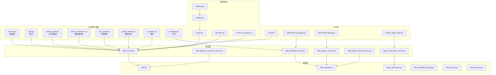
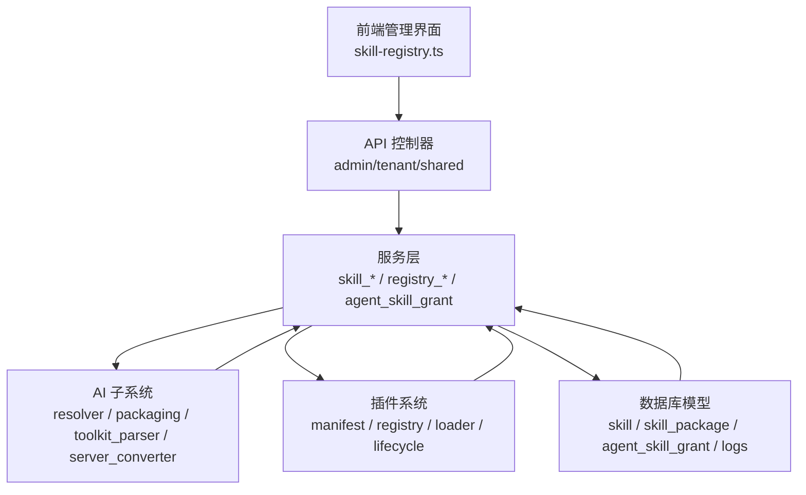
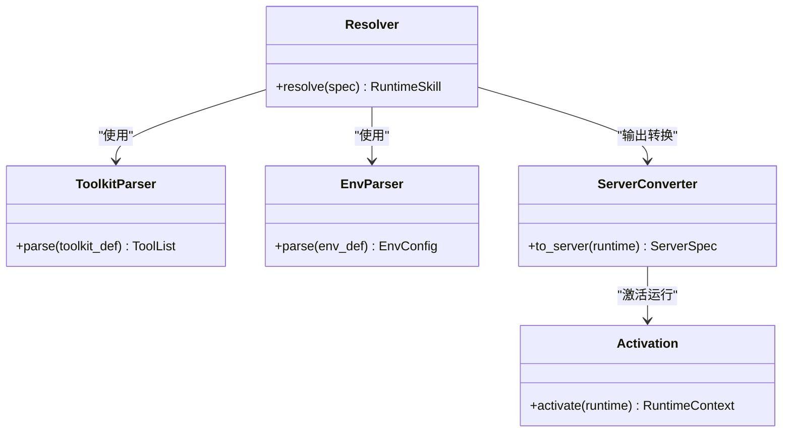
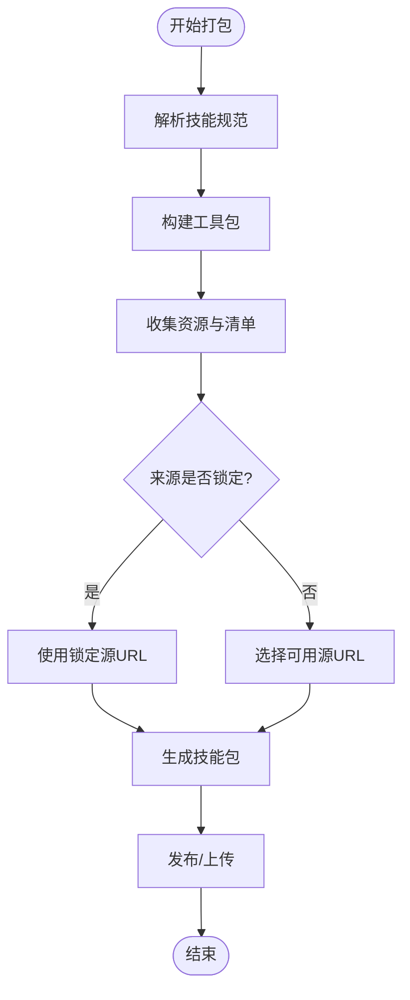
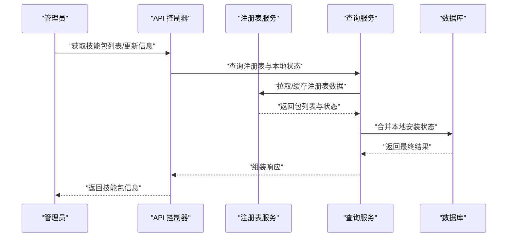
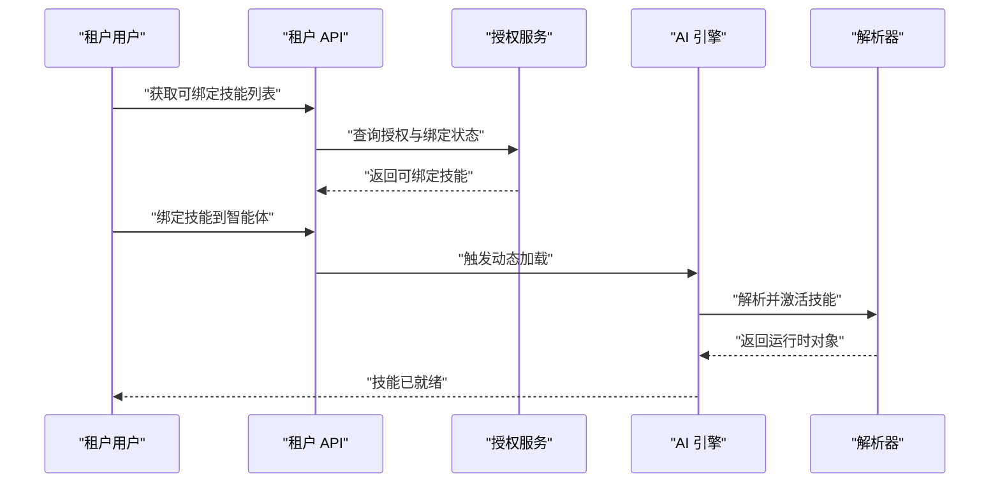
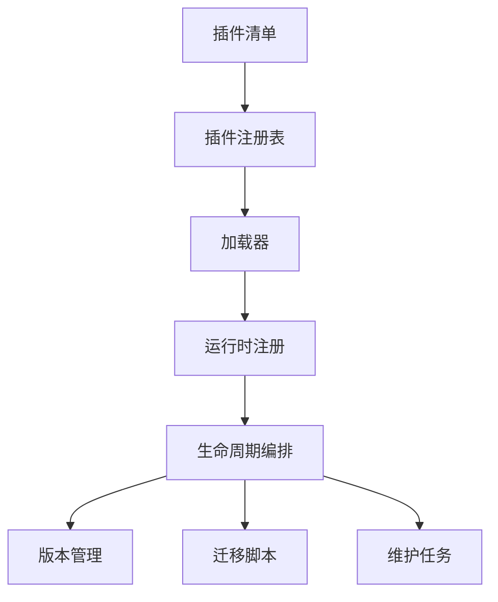
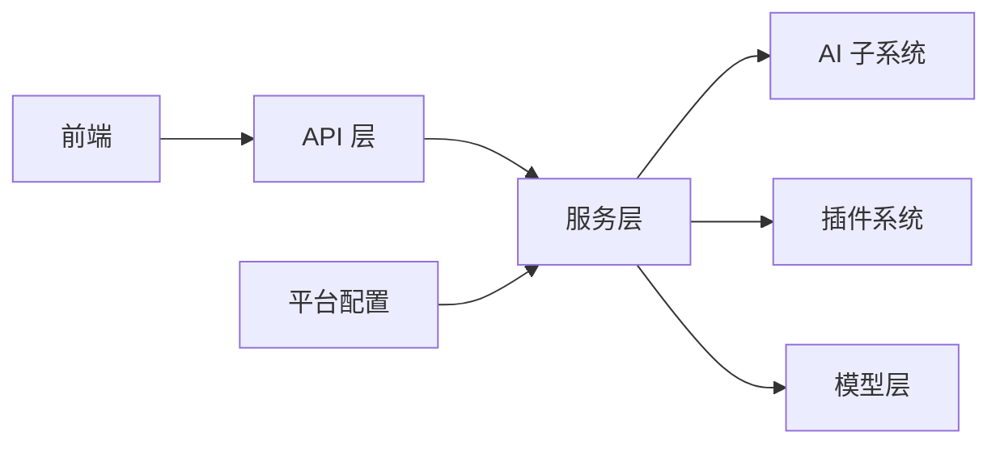

# 技能服务

<cite>

**本文引用的文件**
- [backend/app/ai/skills/resolver.py](file://backend/app/ai/skills/resolver.py)
- [backend/app/ai/skills/packaging.py](file://backend/app/ai/skills/packaging.py)
- [backend/app/ai/skills/spec.py](file://backend/app/ai/skills/spec.py)
- [backend/app/ai/skills/toolkit_parser.py](file://backend/app/ai/skills/toolkit_parser.py)
- [backend/app/ai/skills/resolution_contracts.py](file://backend/app/ai/skills/resolution_contracts.py)
- [backend/app/ai/skills/server_converter.py](file://backend/app/ai/skills/server_converter.py)
- [backend/app/ai/skills/server_converter_codegen.py](file://backend/app/ai/skills/server_converter_codegen.py)
- [backend/app/ai/skills/server_converter_helpers.py](file://backend/app/ai/skills/server_converter_helpers.py)
- [backend/app/ai/skills/env_parser.py](file://backend/app/ai/skills/env_parser.py)
- [backend/app/ai/skills/plugin_identity.py](file://backend/app/ai/skills/plugin_identity.py)
- [backend/app/ai/skills/activation.py](file://backend/app/ai/skills/activation.py)
- [backend/app/ai/skills/rich_text_actions.py](file://backend/app/ai/skills/rich_text_actions.py)
- [backend/app/ai/skills/toolkit_parser_helpers.py](file://backend/app/ai/skills/toolkit_parser_helpers.py)
- [backend/app/ai/skills/resolver_parts/loaders.py](file://backend/app/ai/skills/resolver_parts/loaders.py)
- [backend/app/ai/skills/resolver_parts/schema.py](file://backend/app/ai/skills/resolver_parts/schema.py)
- [backend/app/ai/skills/resolver_parts/builtin.py](file://backend/app/ai/skills/resolver_parts/builtin.py)
- [backend/app/ai/skills/resolver_parts/capability.py](file://backend/app/ai/skills/resolver_parts/capability.py)
- [backend/app/ai/skills/resolver_parts/semantics.py](file://backend/app/ai/skills/resolver_parts/semantics.py)
- [backend/app/services/ai/skill_service.py](file://backend/app/services/ai/skill_service.py)
- [backend/app/services/ai/skill_package_service.py](file://backend/app/services/ai/skill_package_service.py)
- [backend/app/services/ai/skill_registry_service.py](file://backend/app/services/ai/skill_registry_service.py)
- [backend/app/services/ai/skill_registry_command_service.py](file://backend/app/services/ai/skill_registry_command_service.py)
- [backend/app/services/ai/skill_registry_query_service.py](file://backend/app/services/ai/skill_registry_query_service.py)
- [backend/app/services/ai/agent_skill_grant_service.py](file://backend/app/services/ai/agent_skill_grant_service.py)
- [backend/app/services/ai/retired_skill_guard.py](file://backend/app/services/ai/retired_skill_guard.py)
- [backend/app/models/ai/skill.py](file://backend/app/models/ai/skill.py)
- [backend/app/models/ai/skill_package.py](file://backend/app/models/ai/skill_package.py)
- [backend/app/models/ai/agent_skill_grant.py](file://backend/app/models/ai/agent_skill_grant.py)
- [backend/app/models/ai/skill_capability_binding.py](file://backend/app/models/ai/skill_capability_binding.py)
- [backend/app/models/ai/skill_call_log.py](file://backend/app/models/ai/skill_call_log.py)
- [backend/app/models/ai/skill_resource.py](file://backend/app/models/ai/skill_resource.py)
- [backend/app/enums/skill.py](file://backend/app/enums/skill.py)
- [backend/app/api/admin/skill_packages.py](file://backend/app/api/admin/skill_packages.py)
- [backend/app/api/admin/skill_registry.py](file://backend/app/api/admin/skill_registry.py)
- [backend/app/api/admin/_skill_io.py](file://backend/app/api/admin/_skill_io.py)
- [backend/app/api/admin/_skill_stats.py](file://backend/app/api/admin/_skill_stats.py)
- [backend/app/api/tenant/_agent_skills.py](file://backend/app/api/tenant/_agent_skills.py)
- [backend/app/api/shared/_skill_helpers.py](file://backend/app/api/shared/_skill_helpers.py)
- [backend/app/api/shared/_skill_package_export.py](file://backend/app/api/shared/_skill_package_export.py)
- [backend/app/api/shared/_skill_package_upload.py](file://backend/app/api/shared/_skill_package_upload.py)
- [backend/app/api/shared/_skill_stats.py](file://backend/app/api/shared/_skill_stats.py)
- [backend/app/api/shared/_skill_test.py](file://backend/app/api/shared/_skill_test.py)
- [backend/app/configs/definitions/platform/marketplace.py](file://backend/app/configs/definitions/platform/marketplace.py)
- [backend/app/plugins/manifest.py](file://backend/app/plugins/manifest.py)
- [backend/app/plugins/registry.py](file://backend/app/plugins/registry.py)
- [backend/app/plugins/registry_read_layer.py](file://backend/app/plugins/registry_read_layer.py)
- [backend/app/plugins/loader.py](file://backend/app/plugins/loader.py)
- [backend/app/plugins/version_manager.py](file://backend/app/plugins/version_manager.py)
- [backend/app/plugins/lifecycle.py](file://backend/app/plugins/lifecycle.py)
- [backend/app/plugins/lifecycle_orchestrator.py](file://backend/app/plugins/lifecycle_orchestrator.py)
- [backend/app/plugins/lifecycle_guards.py](file://backend/app/plugins/lifecycle_guards.py)
- [backend/app/plugins/lifecycle_migrations.py](file://backend/app/plugins/lifecycle_migrations.py)
- [backend/app/plugins/lifecycle_installation.py](file://backend/app/plugins/lifecycle_installation.py)
- [backend/app/plugins/runtime_registration.py](file://backend/app/plugins/runtime_registration.py)
- [backend/app/plugins/runtime_gate.py](file://backend/app/plugins/runtime_gate.py)
- [backend/app/plugins/asset_runtime.py](file://backend/app/plugins/asset_runtime.py)
- [backend/app/plugins/asset_resolver.py](file://backend/app/plugins/asset_resolver.py)
- [backend/app/plugins/exposure_policy.py](file://backend/app/plugins/exposure_policy.py)
- [backend/app/plugins/feature_entitlement_guards.py](file://backend/app/plugins/feature_entitlement_guards.py)
- [backend/app/plugins/scheduler_refresh.py](file://backend/app/plugins/scheduler_refresh.py)
- [backend/app/plugins/update_checker.py](file://backend/app/plugins/update_checker.py)
- [backend/app/plugins/marketplace.py](file://backend/app/plugins/marketplace.py)
- [backend/app/plugins/marketplace_registry/registry.json](file://backend/app/plugins/marketplace_registry/registry.json)
- [frontend/apps/web-antd/src/api/admin/skill-registry.ts](file://frontend/apps/web-antd/src/api/admin/skill-registry.ts)
</cite>

## 目录
1. [引言](#引言)
2. [项目结构](#项目结构)
3. [核心组件](#核心组件)
4. [架构总览](#架构总览)
5. [详细组件分析](#详细组件分析)
6. [依赖分析](#依赖分析)
7. [性能考虑](#性能考虑)
8. [故障排查指南](#故障排查指南)
9. [结论](#结论)
10. [附录](#附录)

## 引言
本文件面向“技能服务”的技术文档，系统性阐述技能系统的完整架构与实现：从技能定义、包管理、注册表维护到插件集成；覆盖技能生命周期（开发、测试、发布）；详解技能包的打包、分发与版本管理；解释注册表查询优化与缓存策略；说明权限控制、访问限制与使用统计；并给出技能开发最佳实践与API设计规范，以及技能与智能体的绑定关系与动态加载机制。

## 项目结构
技能服务位于后端 Python 应用中，核心代码分布在以下区域：
- AI 技能子系统：解析、打包、转换、激活与运行时支持
- 服务层：技能、技能包、注册表命令/查询服务
- 模型层：技能、技能包、授权、能力绑定、调用日志等数据模型
- API 层：管理员与租户侧技能相关接口
- 插件系统：与技能生态的集成、生命周期与版本管理
- 配置层：平台级技能注册表地址与缓存配置

图表来源
- [backend/app/ai/skills/resolver.py](file://backend/app/ai/skills/resolver.py)
- [backend/app/ai/skills/packaging.py](file://backend/app/ai/skills/packaging.py)
- [backend/app/ai/skills/spec.py](file://backend/app/ai/skills/spec.py)
- [backend/app/ai/skills/toolkit_parser.py](file://backend/app/ai/skills/toolkit_parser.py)
- [backend/app/ai/skills/server_converter.py](file://backend/app/ai/skills/server_converter.py)
- [backend/app/ai/skills/server_converter_codegen.py](file://backend/app/ai/skills/server_converter_codegen.py)
- [backend/app/ai/skills/server_converter_helpers.py](file://backend/app/ai/skills/server_converter_helpers.py)
- [backend/app/ai/skills/env_parser.py](file://backend/app/ai/skills/env_parser.py)
- [backend/app/ai/skills/plugin_identity.py](file://backend/app/ai/skills/plugin_identity.py)
- [backend/app/ai/skills/activation.py](file://backend/app/ai/skills/activation.py)
- [backend/app/services/ai/skill_service.py](file://backend/app/services/ai/skill_service.py)
- [backend/app/services/ai/skill_package_service.py](file://backend/app/services/ai/skill_package_service.py)
- [backend/app/services/ai/skill_registry_service.py](file://backend/app/services/ai/skill_registry_service.py)
- [backend/app/services/ai/skill_registry_command_service.py](file://backend/app/services/ai/skill_registry_command_service.py)
- [backend/app/services/ai/skill_registry_query_service.py](file://backend/app/services/ai/skill_registry_query_service.py)
- [backend/app/services/ai/agent_skill_grant_service.py](file://backend/app/services/ai/agent_skill_grant_service.py)
- [backend/app/models/ai/skill.py](file://backend/app/models/ai/skill.py)
- [backend/app/models/ai/skill_package.py](file://backend/app/models/ai/skill_package.py)
- [backend/app/models/ai/agent_skill_grant.py](file://backend/app/models/ai/agent_skill_grant.py)
- [backend/app/models/ai/skill_capability_binding.py](file://backend/app/models/ai/skill_capability_binding.py)
- [backend/app/models/ai/skill_call_log.py](file://backend/app/models/ai/skill_call_log.py)
- [backend/app/models/ai/skill_resource.py](file://backend/app/models/ai/skill_resource.py)
- [backend/app/api/admin/skill_packages.py](file://backend/app/api/admin/skill_packages.py)
- [backend/app/api/admin/skill_registry.py](file://backend/app/api/admin/skill_registry.py)
- [backend/app/api/tenant/_agent_skills.py](file://backend/app/api/tenant/_agent_skills.py)
- [backend/app/api/shared/_skill_helpers.py](file://backend/app/api/shared/_skill_helpers.py)
- [backend/app/api/shared/_skill_package_export.py](file://backend/app/api/shared/_skill_package_export.py)
- [backend/app/api/shared/_skill_package_upload.py](file://backend/app/api/shared/_skill_package_upload.py)
- [backend/app/api/shared/_skill_stats.py](file://backend/app/api/shared/_skill_stats.py)
- [backend/app/api/shared/_skill_test.py](file://backend/app/api/shared/_skill_test.py)
- [backend/app/plugins/manifest.py](file://backend/app/plugins/manifest.py)
- [backend/app/plugins/registry.py](file://backend/app/plugins/registry.py)
- [backend/app/plugins/loader.py](file://backend/app/plugins/loader.py)
- [backend/app/plugins/lifecycle.py](file://backend/app/plugins/lifecycle.py)
- [backend/app/plugins/lifecycle_orchestrator.py](file://backend/app/plugins/lifecycle_orchestrator.py)
- [backend/app/plugins/version_manager.py](file://backend/app/plugins/version_manager.py)

章节来源
- [backend/app/ai/skills/resolver.py](file://backend/app/ai/skills/resolver.py)
- [backend/app/ai/skills/packaging.py](file://backend/app/ai/skills/packaging.py)
- [backend/app/ai/skills/spec.py](file://backend/app/ai/skills/spec.py)
- [backend/app/ai/skills/toolkit_parser.py](file://backend/app/ai/skills/toolkit_parser.py)
- [backend/app/ai/skills/server_converter.py](file://backend/app/ai/skills/server_converter.py)
- [backend/app/ai/skills/server_converter_codegen.py](file://backend/app/ai/skills/server_converter_codegen.py)
- [backend/app/ai/skills/server_converter_helpers.py](file://backend/app/ai/skills/server_converter_helpers.py)
- [backend/app/ai/skills/env_parser.py](file://backend/app/ai/skills/env_parser.py)
- [backend/app/ai/skills/plugin_identity.py](file://backend/app/ai/skills/plugin_identity.py)
- [backend/app/ai/skills/activation.py](file://backend/app/ai/skills/activation.py)
- [backend/app/services/ai/skill_service.py](file://backend/app/services/ai/skill_service.py)
- [backend/app/services/ai/skill_package_service.py](file://backend/app/services/ai/skill_package_service.py)
- [backend/app/services/ai/skill_registry_service.py](file://backend/app/services/ai/skill_registry_service.py)
- [backend/app/services/ai/skill_registry_command_service.py](file://backend/app/services/ai/skill_registry_command_service.py)
- [backend/app/services/ai/skill_registry_query_service.py](file://backend/app/services/ai/skill_registry_query_service.py)
- [backend/app/services/ai/agent_skill_grant_service.py](file://backend/app/services/ai/agent_skill_grant_service.py)
- [backend/app/models/ai/skill.py](file://backend/app/models/ai/skill.py)
- [backend/app/models/ai/skill_package.py](file://backend/app/models/ai/skill_package.py)
- [backend/app/models/ai/agent_skill_grant.py](file://backend/app/models/ai/agent_skill_grant.py)
- [backend/app/models/ai/skill_capability_binding.py](file://backend/app/models/ai/skill_capability_binding.py)
- [backend/app/models/ai/skill_call_log.py](file://backend/app/models/ai/skill_call_log.py)
- [backend/app/models/ai/skill_resource.py](file://backend/app/models/ai/skill_resource.py)
- [backend/app/api/admin/skill_packages.py](file://backend/app/api/admin/skill_packages.py)
- [backend/app/api/admin/skill_registry.py](file://backend/app/api/admin/skill_registry.py)
- [backend/app/api/tenant/_agent_skills.py](file://backend/app/api/tenant/_agent_skills.py)
- [backend/app/api/shared/_skill_helpers.py](file://backend/app/api/shared/_skill_helpers.py)
- [backend/app/api/shared/_skill_package_export.py](file://backend/app/api/shared/_skill_package_export.py)
- [backend/app/api/shared/_skill_package_upload.py](file://backend/app/api/shared/_skill_package_upload.py)
- [backend/app/api/shared/_skill_stats.py](file://backend/app/api/shared/_skill_stats.py)
- [backend/app/api/shared/_skill_test.py](file://backend/app/api/shared/_skill_test.py)
- [backend/app/plugins/manifest.py](file://backend/app/plugins/manifest.py)
- [backend/app/plugins/registry.py](file://backend/app/plugins/registry.py)
- [backend/app/plugins/loader.py](file://backend/app/plugins/loader.py)
- [backend/app/plugins/lifecycle.py](file://backend/app/plugins/lifecycle.py)
- [backend/app/plugins/lifecycle_orchestrator.py](file://backend/app/plugins/lifecycle_orchestrator.py)
- [backend/app/plugins/version_manager.py](file://backend/app/plugins/version_manager.py)

## 核心组件
- 技能解析与运行时
  - 解析器：负责将技能规范解析为可执行的运行时对象
  - 工具包解析：解析技能中的工具包定义
  - 环境解析：解析技能所需环境变量与依赖
  - 服务端转换：将技能转换为服务端可用的调用形式
  - 激活：在运行时激活技能，建立上下文与资源
- 服务层
  - 技能服务：技能的增删改查、版本管理、配置合并
  - 技能包服务：技能包的创建、更新、状态管理
  - 注册表服务：技能包的安装、升级、批量升级、离线/在线查询
  - 授权服务：技能与智能体的绑定与授权
- 模型层
  - 技能、技能包、授权、能力绑定、调用日志、资源等
- API 层
  - 管理员：技能包管理、注册表操作、统计与导出
  - 租户：技能与智能体绑定、使用与测试
- 插件系统
  - 清单、注册表、加载器、生命周期、版本管理与运行时扩展

章节来源
- [backend/app/ai/skills/resolver.py](file://backend/app/ai/skills/resolver.py)
- [backend/app/ai/skills/toolkit_parser.py](file://backend/app/ai/skills/toolkit_parser.py)
- [backend/app/ai/skills/env_parser.py](file://backend/app/ai/skills/env_parser.py)
- [backend/app/ai/skills/server_converter.py](file://backend/app/ai/skills/server_converter.py)
- [backend/app/ai/skills/activation.py](file://backend/app/ai/skills/activation.py)
- [backend/app/services/ai/skill_service.py](file://backend/app/services/ai/skill_service.py)
- [backend/app/services/ai/skill_package_service.py](file://backend/app/services/ai/skill_package_service.py)
- [backend/app/services/ai/skill_registry_service.py](file://backend/app/services/ai/skill_registry_service.py)
- [backend/app/services/ai/agent_skill_grant_service.py](file://backend/app/services/ai/agent_skill_grant_service.py)
- [backend/app/models/ai/skill.py](file://backend/app/models/ai/skill.py)
- [backend/app/models/ai/skill_package.py](file://backend/app/models/ai/skill_package.py)
- [backend/app/models/ai/agent_skill_grant.py](file://backend/app/models/ai/agent_skill_grant.py)
- [backend/app/api/admin/skill_packages.py](file://backend/app/api/admin/skill_packages.py)
- [backend/app/api/admin/skill_registry.py](file://backend/app/api/admin/skill_registry.py)
- [backend/app/api/tenant/_agent_skills.py](file://backend/app/api/tenant/_agent_skills.py)
- [backend/app/plugins/manifest.py](file://backend/app/plugins/manifest.py)
- [backend/app/plugins/registry.py](file://backend/app/plugins/registry.py)
- [backend/app/plugins/loader.py](file://backend/app/plugins/loader.py)
- [backend/app/plugins/lifecycle.py](file://backend/app/plugins/lifecycle.py)
- [backend/app/plugins/lifecycle_orchestrator.py](file://backend/app/plugins/lifecycle_orchestrator.py)
- [backend/app/plugins/version_manager.py](file://backend/app/plugins/version_manager.py)

## 架构总览
技能服务采用“解析—服务—模型—API—插件”五层架构，围绕技能生命周期进行组织。前端通过管理员与租户 API 调用后端服务，服务层协调 AI 子系统与插件系统完成技能的定义、打包、注册表交互、授权与运行。

图表来源
- [frontend/apps/web-antd/src/api/admin/skill-registry.ts](file://frontend/apps/web-antd/src/api/admin/skill-registry.ts)
- [backend/app/api/admin/skill_registry.py](file://backend/app/api/admin/skill_registry.py)
- [backend/app/api/admin/skill_packages.py](file://backend/app/api/admin/skill_packages.py)
- [backend/app/api/tenant/_agent_skills.py](file://backend/app/api/tenant/_agent_skills.py)
- [backend/app/services/ai/skill_registry_service.py](file://backend/app/services/ai/skill_registry_service.py)
- [backend/app/services/ai/skill_service.py](file://backend/app/services/ai/skill_service.py)
- [backend/app/services/ai/skill_package_service.py](file://backend/app/services/ai/skill_package_service.py)
- [backend/app/ai/skills/resolver.py](file://backend/app/ai/skills/resolver.py)
- [backend/app/ai/skills/packaging.py](file://backend/app/ai/skills/packaging.py)
- [backend/app/ai/skills/toolkit_parser.py](file://backend/app/ai/skills/toolkit_parser.py)
- [backend/app/ai/skills/server_converter.py](file://backend/app/ai/skills/server_converter.py)
- [backend/app/plugins/manifest.py](file://backend/app/plugins/manifest.py)
- [backend/app/plugins/registry.py](file://backend/app/plugins/registry.py)
- [backend/app/plugins/loader.py](file://backend/app/plugins/loader.py)
- [backend/app/models/ai/skill.py](file://backend/app/models/ai/skill.py)
- [backend/app/models/ai/skill_package.py](file://backend/app/models/ai/skill_package.py)
- [backend/app/models/ai/agent_skill_grant.py](file://backend/app/models/ai/agent_skill_grant.py)

## 详细组件分析

### 技能解析与运行时
- 解析器：将技能规范解析为运行时对象，支持能力语义、内置能力与加载器扩展
- 工具包解析：解析技能中的工具包定义，生成可执行的工具集合
- 环境解析：解析技能所需的环境变量与依赖，确保运行时一致性
- 服务端转换：将技能转换为服务端可用的调用形式，支持流式与同步两种模式
- 激活：在运行时激活技能，建立上下文与资源，处理失败与恢复

图表来源
- [backend/app/ai/skills/resolver.py](file://backend/app/ai/skills/resolver.py)
- [backend/app/ai/skills/toolkit_parser.py](file://backend/app/ai/skills/toolkit_parser.py)
- [backend/app/ai/skills/env_parser.py](file://backend/app/ai/skills/env_parser.py)
- [backend/app/ai/skills/server_converter.py](file://backend/app/ai/skills/server_converter.py)
- [backend/app/ai/skills/activation.py](file://backend/app/ai/skills/activation.py)

章节来源
- [backend/app/ai/skills/resolver.py](file://backend/app/ai/skills/resolver.py)
- [backend/app/ai/skills/toolkit_parser.py](file://backend/app/ai/skills/toolkit_parser.py)
- [backend/app/ai/skills/env_parser.py](file://backend/app/ai/skills/env_parser.py)
- [backend/app/ai/skills/server_converter.py](file://backend/app/ai/skills/server_converter.py)
- [backend/app/ai/skills/activation.py](file://backend/app/ai/skills/activation.py)

### 技能包管理与打包
- 打包：将技能规范、工具包、资源与清单打包为可分发的技能包
- 包管理：维护技能包的元数据、版本、下载链接与来源锁定
- 导入/导出：支持技能包的导入与导出，便于迁移与备份
- 版本管理：与插件版本管理协同，保证技能包与插件版本一致性

图表来源
- [backend/app/ai/skills/packaging.py](file://backend/app/ai/skills/packaging.py)
- [backend/app/ai/skills/spec.py](file://backend/app/ai/skills/spec.py)
- [backend/app/services/ai/skill_package_service.py](file://backend/app/services/ai/skill_package_service.py)
- [backend/app/api/shared/_skill_package_export.py](file://backend/app/api/shared/_skill_package_export.py)
- [backend/app/api/shared/_skill_package_upload.py](file://backend/app/api/shared/_skill_package_upload.py)

章节来源
- [backend/app/ai/skills/packaging.py](file://backend/app/ai/skills/packaging.py)
- [backend/app/ai/skills/spec.py](file://backend/app/ai/skills/spec.py)
- [backend/app/services/ai/skill_package_service.py](file://backend/app/services/ai/skill_package_service.py)
- [backend/app/api/shared/_skill_package_export.py](file://backend/app/api/shared/_skill_package_export.py)
- [backend/app/api/shared/_skill_package_upload.py](file://backend/app/api/shared/_skill_package_upload.py)

### 技能注册表与查询
- 注册表服务：提供技能包的安装、升级、批量升级与状态查询
- 查询服务：支持按关键词、标签、官方起始包等维度查询与汇总
- 缓存策略：通过平台配置项设置注册表缓存 TTL，减少网络请求与提升响应速度
- 连接测试：提供注册表连接测试接口，验证可达性与可用性

图表来源
- [backend/app/api/admin/skill_registry.py](file://backend/app/api/admin/skill_registry.py)
- [backend/app/services/ai/skill_registry_service.py](file://backend/app/services/ai/skill_registry_service.py)
- [backend/app/services/ai/skill_registry_query_service.py](file://backend/app/services/ai/skill_registry_query_service.py)
- [backend/app/configs/definitions/platform/marketplace.py](file://backend/app/configs/definitions/platform/marketplace.py)

章节来源
- [backend/app/api/admin/skill_registry.py](file://backend/app/api/admin/skill_registry.py)
- [backend/app/services/ai/skill_registry_service.py](file://backend/app/services/ai/skill_registry_service.py)
- [backend/app/services/ai/skill_registry_query_service.py](file://backend/app/services/ai/skill_registry_query_service.py)
- [backend/app/configs/definitions/platform/marketplace.py](file://backend/app/configs/definitions/platform/marketplace.py)
- [frontend/apps/web-antd/src/api/admin/skill-registry.ts](file://frontend/apps/web-antd/src/api/admin/skill-registry.ts)

### 技能与智能体的绑定与动态加载
- 绑定关系：通过授权模型将技能授予特定智能体，支持手动与自动绑定模式
- 动态加载：在运行时根据绑定关系动态加载技能，支持热更新与版本切换
- 访问控制：结合 RBAC 与功能授权守卫，确保仅授权用户可访问与使用技能
- 使用统计：记录技能调用日志，支持统计与审计

图表来源
- [backend/app/api/tenant/_agent_skills.py](file://backend/app/api/tenant/_agent_skills.py)
- [backend/app/services/ai/agent_skill_grant_service.py](file://backend/app/services/ai/agent_skill_grant_service.py)
- [backend/app/ai/skills/resolver.py](file://backend/app/ai/skills/resolver.py)
- [backend/app/models/ai/agent_skill_grant.py](file://backend/app/models/ai/agent_skill_grant.py)
- [backend/app/models/ai/skill_call_log.py](file://backend/app/models/ai/skill_call_log.py)

章节来源
- [backend/app/api/tenant/_agent_skills.py](file://backend/app/api/tenant/_agent_skills.py)
- [backend/app/services/ai/agent_skill_grant_service.py](file://backend/app/services/ai/agent_skill_grant_service.py)
- [backend/app/ai/skills/resolver.py](file://backend/app/ai/skills/resolver.py)
- [backend/app/models/ai/agent_skill_grant.py](file://backend/app/models/ai/agent_skill_grant.py)
- [backend/app/models/ai/skill_call_log.py](file://backend/app/models/ai/skill_call_log.py)

### 插件集成与生命周期
- 清单与注册表：插件清单定义技能包元数据，注册表提供发现与版本管理
- 加载器：动态加载技能包，支持模块化与隔离
- 生命周期：安装、升级、迁移、维护与卸载的全生命周期编排
- 版本管理：与技能包版本协同，确保兼容性与回滚能力

图表来源
- [backend/app/plugins/manifest.py](file://backend/app/plugins/manifest.py)
- [backend/app/plugins/registry.py](file://backend/app/plugins/registry.py)
- [backend/app/plugins/loader.py](file://backend/app/plugins/loader.py)
- [backend/app/plugins/runtime_registration.py](file://backend/app/plugins/runtime_registration.py)
- [backend/app/plugins/lifecycle.py](file://backend/app/plugins/lifecycle.py)
- [backend/app/plugins/lifecycle_orchestrator.py](file://backend/app/plugins/lifecycle_orchestrator.py)
- [backend/app/plugins/version_manager.py](file://backend/app/plugins/version_manager.py)
- [backend/app/plugins/lifecycle_migrations.py](file://backend/app/plugins/lifecycle_migrations.py)
- [backend/app/plugins/lifecycle_orchestrator_maintenance.py](file://backend/app/plugins/lifecycle_orchestrator_maintenance.py)

章节来源
- [backend/app/plugins/manifest.py](file://backend/app/plugins/manifest.py)
- [backend/app/plugins/registry.py](file://backend/app/plugins/registry.py)
- [backend/app/plugins/loader.py](file://backend/app/plugins/loader.py)
- [backend/app/plugins/runtime_registration.py](file://backend/app/plugins/runtime_registration.py)
- [backend/app/plugins/lifecycle.py](file://backend/app/plugins/lifecycle.py)
- [backend/app/plugins/lifecycle_orchestrator.py](file://backend/app/plugins/lifecycle_orchestrator.py)
- [backend/app/plugins/version_manager.py](file://backend/app/plugins/version_manager.py)
- [backend/app/plugins/lifecycle_migrations.py](file://backend/app/plugins/lifecycle_migrations.py)
- [backend/app/plugins/lifecycle_orchestrator_maintenance.py](file://backend/app/plugins/lifecycle_orchestrator_maintenance.py)

## 依赖分析
- 组件耦合
  - 解析器与工具包解析器高度内聚，共同构成技能运行时基础
  - 服务层对模型层与插件系统存在直接依赖，用于数据持久化与生态集成
  - API 层对服务层进行薄封装，保持业务逻辑集中
- 外部依赖
  - 平台配置提供注册表地址与缓存 TTL
  - 前端通过 API 客户端与后端交互
- 循环依赖
  - 当前结构以服务层为中枢，避免了循环依赖风险

图表来源
- [backend/app/api/admin/skill_registry.py](file://backend/app/api/admin/skill_registry.py)
- [backend/app/services/ai/skill_registry_service.py](file://backend/app/services/ai/skill_registry_service.py)
- [backend/app/ai/skills/resolver.py](file://backend/app/ai/skills/resolver.py)
- [backend/app/plugins/registry.py](file://backend/app/plugins/registry.py)
- [backend/app/models/ai/skill.py](file://backend/app/models/ai/skill.py)
- [backend/app/configs/definitions/platform/marketplace.py](file://backend/app/configs/definitions/platform/marketplace.py)
- [frontend/apps/web-antd/src/api/admin/skill-registry.ts](file://frontend/apps/web-antd/src/api/admin/skill-registry.ts)

章节来源
- [backend/app/api/admin/skill_registry.py](file://backend/app/api/admin/skill_registry.py)
- [backend/app/services/ai/skill_registry_service.py](file://backend/app/services/ai/skill_registry_service.py)
- [backend/app/ai/skills/resolver.py](file://backend/app/ai/skills/resolver.py)
- [backend/app/plugins/registry.py](file://backend/app/plugins/registry.py)
- [backend/app/models/ai/skill.py](file://backend/app/models/ai/skill.py)
- [backend/app/configs/definitions/platform/marketplace.py](file://backend/app/configs/definitions/platform/marketplace.py)
- [frontend/apps/web-antd/src/api/admin/skill-registry.ts](file://frontend/apps/web-antd/src/api/admin/skill-registry.ts)

## 性能考虑
- 注册表缓存：通过平台配置项设置缓存 TTL，降低网络抖动对用户体验的影响
- 查询优化：在查询服务中聚合本地安装状态与注册表数据，减少重复请求
- 分页与过滤：在 API 层对技能包列表进行分页与关键词过滤，避免一次性传输大量数据
- 流式处理：服务端转换支持流式输出，提升长耗时技能的响应体验
- 版本锁：来源锁定可避免频繁变更带来的性能波动，但需权衡更新频率

章节来源
- [backend/app/configs/definitions/platform/marketplace.py](file://backend/app/configs/definitions/platform/marketplace.py)
- [backend/app/services/ai/skill_registry_query_service.py](file://backend/app/services/ai/skill_registry_query_service.py)
- [backend/app/ai/skills/server_converter.py](file://backend/app/ai/skills/server_converter.py)

## 故障排查指南
- 注册表连接失败
  - 使用连接测试接口验证注册表可达性与默认地址
  - 检查平台配置项中的注册表地址与缓存 TTL 是否合理
- 安装/升级异常
  - 查看注册表服务的日志与错误码，确认网络与权限问题
  - 使用升级预览接口检查变更内容与兼容性
- 权限与授权问题
  - 检查授权服务的绑定状态与权限模型
  - 确认 RBAC 与功能授权守卫未阻断合法访问
- 使用统计缺失
  - 核对调用日志模型与记录逻辑
  - 确保统计服务正常运行且无数据丢失

章节来源
- [backend/app/api/admin/plugin_install_preview.py](file://backend/app/api/admin/plugin_install_preview.py)
- [backend/app/services/ai/skill_registry_service.py](file://backend/app/services/ai/skill_registry_service.py)
- [backend/app/services/ai/agent_skill_grant_service.py](file://backend/app/services/ai/agent_skill_grant_service.py)
- [backend/app/models/ai/skill_call_log.py](file://backend/app/models/ai/skill_call_log.py)

## 结论
技能服务通过清晰的分层架构与完善的生命周期管理，实现了从技能定义、打包、注册表维护到插件集成与动态加载的闭环。配合权限控制、访问限制与使用统计，满足企业级场景下的安全与可观测性需求。建议在生产环境中启用合理的注册表缓存策略，并持续完善测试与监控体系。

## 附录
- 最佳实践
  - 在技能规范中明确环境变量与依赖，确保可复现性
  - 使用来源锁定与版本管理，平衡稳定性与更新频率
  - 通过授权服务精细化控制技能访问范围
  - 利用调用日志与统计接口进行持续优化
- API 设计规范
  - 统一使用分页与过滤参数，提升大列表场景的性能
  - 对敏感操作增加权限校验与审计日志
  - 提供安装/升级预览接口，降低变更风险