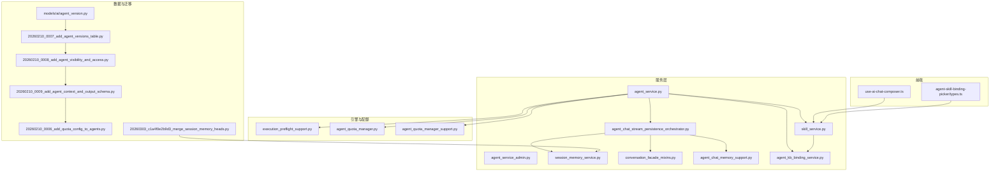
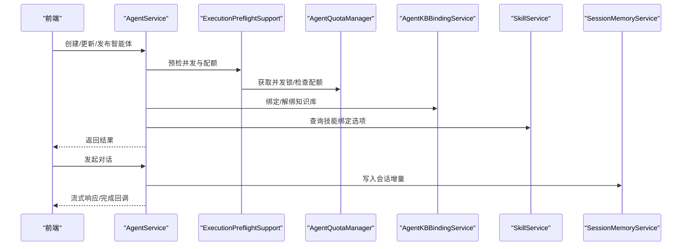
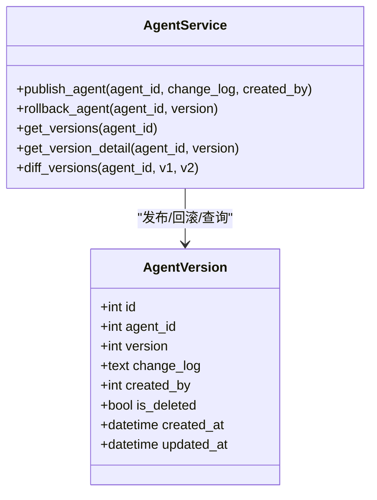
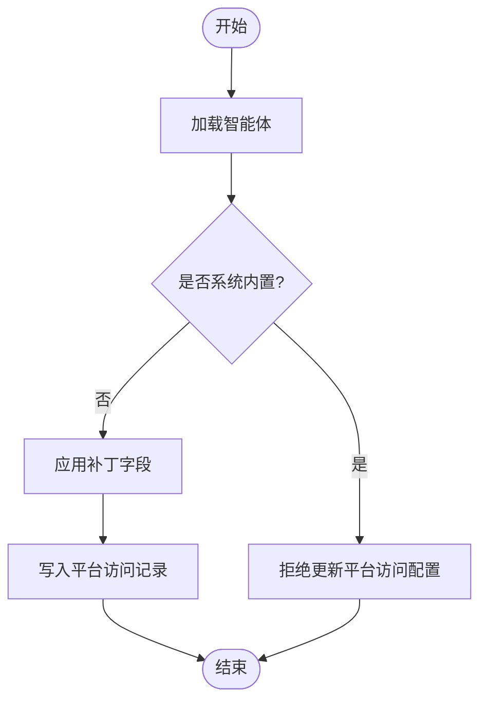
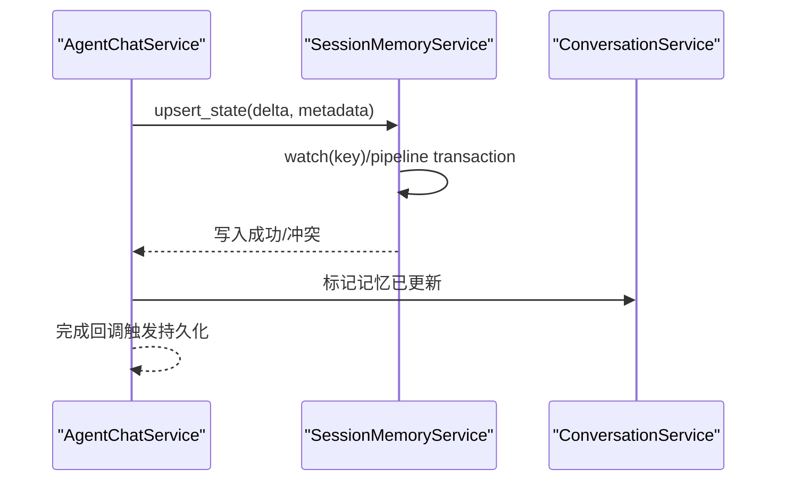
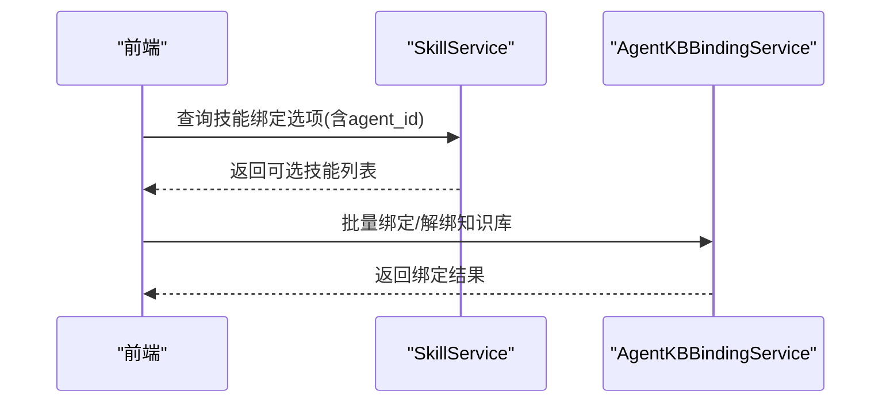
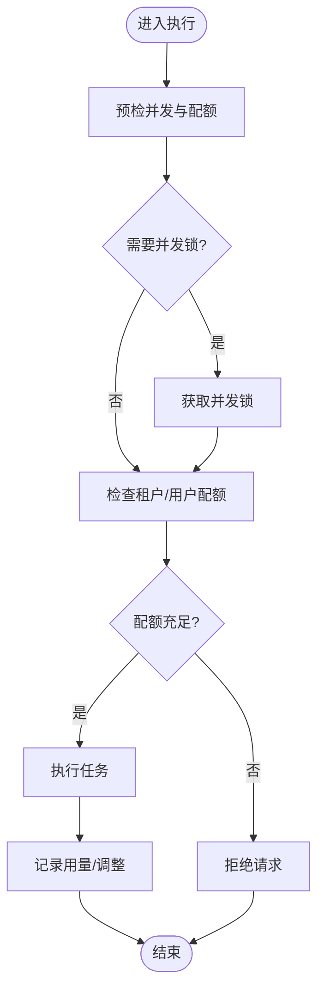
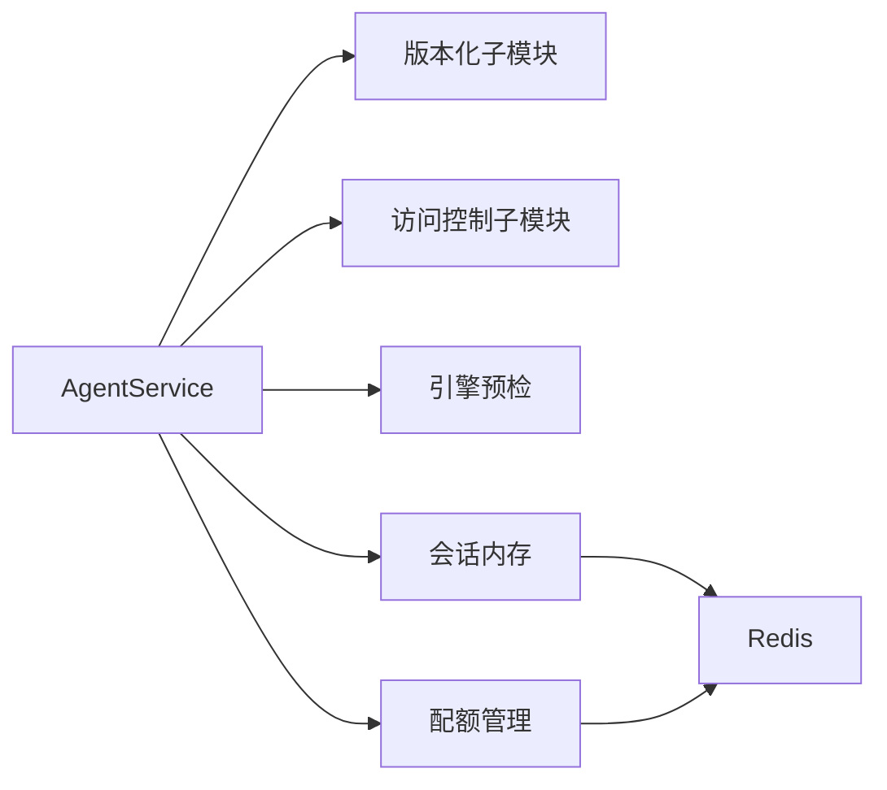

# 智能体管理服务

<cite>
**本文引用的文件**
- [backend/app/services/ai/agent_service.py](file://backend/app/services/ai/agent_service.py)
- [backend/app/services/ai/agent_service_admin.py](file://backend/app/services/ai/agent_service_admin.py)
- [backend/app/services/ai/agent_chat_stream_persistence_orchestrator.py](file://backend/app/services/ai/agent_chat_stream_persistence_orchestrator.py)
- [backend/app/services/ai/session_memory_service.py](file://backend/app/services/ai/session_memory_service.py)
- [backend/app/services/ai/conversation_facade_mixins.py](file://backend/app/services/ai/conversation_facade_mixins.py)
- [backend/app/services/ai/agent_chat_memory_support.py](file://backend/app/services/ai/agent_chat_memory_support.py)
- [backend/app/services/ai/agent_kb_binding_service.py](file://backend/app/services/ai/agent_kb_binding_service.py)
- [backend/app/services/ai/skill_service.py](file://backend/app/services/ai/skill_service.py)
- [backend/app/ai/engine/execution_preflight_support.py](file://backend/app/ai/engine/execution_preflight_support.py)
- [backend/app/ai/agent_quota_manager.py](file://backend/app/ai/agent_quota_manager.py)
- [backend/app/ai/agent_quota_manager_support.py](file://backend/app/ai/agent_quota_manager_support.py)
- [backend/app/models/ai/agent_version.py](file://backend/app/models/ai/agent_version.py)
- [backend/migrations/versions/20260210_0007_add_agent_versions_table.py](file://backend/migrations/versions/20260210_0007_add_agent_versions_table.py)
- [backend/migrations/versions/20260210_0008_add_agent_visibility_and_access.py](file://backend/migrations/versions/20260210_0008_add_agent_visibility_and_access.py)
- [backend/migrations/versions/20260210_0009_add_agent_context_and_output_schema.py](file://backend/migrations/versions/20260210_0009_add_agent_context_and_output_schema.py)
- [backend/migrations/versions/20260210_0006_add_quota_config_to_agents.py](file://backend/migrations/versions/20260210_0006_add_quota_config_to_agents.py)
- [backend/migrations/versions/20260303_c1a4f0e2b9d3_merge_session_memory_heads.py](file://backend/migrations/versions/20260303_c1a4f0e2b9d3_merge_session_memory_heads.py)
- [frontend/apps/web-antd/src/components/business/ai-chat-panel/use-ai-chat-composer.ts](file://frontend/apps/web-antd/src/components/business/ai-chat-panel/use-ai-chat-composer.ts)
- [frontend/apps/web-antd/src/components/business/agent-skill-binding-picker/types.ts](file://frontend/apps/web-antd/src/components/business/agent-skill-binding-picker/types.ts)
- [backend/tests/services/test_agent_chat_service_memory_scene.py](file://backend/tests/services/test_agent_chat_service_memory_scene.py)
- [backend/tests/services/test_agent_chat_stream_error.py](file://backend/tests/services/test_agent_chat_stream_error.py)
- [backend/tests/services/test_agent_chat_memory_support.py](file://backend/tests/services/test_agent_chat_memory_support.py)
- [backend/tests/api/test_admin_skill_select_route.py](file://backend/tests/api/test_admin_skill_select_route.py)
</cite>

## 目录
1. [简介](#简介)
2. [项目结构](#项目结构)
3. [核心组件](#核心组件)
4. [架构总览](#架构总览)
5. [详细组件分析](#详细组件分析)
6. [依赖分析](#依赖分析)
7. [性能考虑](#性能考虑)
8. [故障排查指南](#故障排查指南)
9. [结论](#结论)
10. [附录](#附录)

## 简介
本技术文档围绕智能体管理服务展开，系统性阐述智能体的全生命周期管理：从创建、配置、版本控制到权限与访问控制；覆盖智能体核心属性、行为配置与上下文管理；详解版本系统的实现原理（版本继承、变更追踪与回滚策略）；说明智能体与知识库、技能的绑定关系与路由策略；并提供内存管理、会话状态持久化与并发访问控制的实现细节与最佳实践。

## 项目结构
后端采用分层与领域驱动设计，智能体相关能力主要分布在以下模块：
- 服务层：agent_service、agent_service_admin、agent_chat_*、session_memory_service、agent_kb_binding_service、skill_service
- 引擎与配额：execution_preflight_support、agent_quota_manager、agent_quota_manager_support
- 数据模型与迁移：models.ai.agent_version、migrations/versions 中的智能体相关表结构演进
- 前端交互：AI 聊天面板与技能绑定选择器

图表来源
- [backend/app/services/ai/agent_service.py:146-187](file://backend/app/services/ai/agent_service.py#L146-L187)
- [backend/app/services/ai/agent_service_admin.py:145-182](file://backend/app/services/ai/agent_service_admin.py#L145-L182)
- [backend/app/services/ai/agent_chat_stream_persistence_orchestrator.py:102-129](file://backend/app/services/ai/agent_chat_stream_persistence_orchestrator.py#L102-L129)
- [backend/app/services/ai/session_memory_service.py:241-271](file://backend/app/services/ai/session_memory_service.py#L241-L271)
- [backend/app/services/ai/conversation_facade_mixins.py:388-426](file://backend/app/services/ai/conversation_facade_mixins.py#L388-L426)
- [backend/app/services/ai/agent_chat_memory_support.py:335-356](file://backend/app/services/ai/agent_chat_memory_support.py#L335-L356)
- [backend/app/services/ai/agent_kb_binding_service.py:279-316](file://backend/app/services/ai/agent_kb_binding_service.py#L279-L316)
- [backend/app/services/ai/skill_service.py:418-453](file://backend/app/services/ai/skill_service.py#L418-L453)
- [backend/app/ai/engine/execution_preflight_support.py:35-79](file://backend/app/ai/engine/execution_preflight_support.py#L35-L79)
- [backend/app/ai/agent_quota_manager.py:120-180](file://backend/app/ai/agent_quota_manager.py#L120-L180)
- [backend/app/ai/agent_quota_manager_support.py:170-221](file://backend/app/ai/agent_quota_manager_support.py#L170-L221)
- [backend/app/models/ai/agent_version.py:54-69](file://backend/app/models/ai/agent_version.py#L54-L69)
- [backend/migrations/versions/20260210_0007_add_agent_versions_table.py:21-47](file://backend/migrations/versions/20260210_0007_add_agent_versions_table.py#L21-L47)
- [backend/migrations/versions/20260210_0008_add_agent_visibility_and_access.py:21-29](file://backend/migrations/versions/20260210_0008_add_agent_visibility_and_access.py#L21-L29)
- [backend/migrations/versions/20260210_0009_add_agent_context_and_output_schema.py:21-31](file://backend/migrations/versions/20260210_0009_add_agent_context_and_output_schema.py#L21-L31)
- [backend/migrations/versions/20260210_0006_add_quota_config_to_agents.py:21-27](file://backend/migrations/versions/20260210_0006_add_quota_config_to_agents.py#L21-L27)
- [backend/migrations/versions/20260303_c1a4f0e2b9d3_merge_session_memory_heads.py:22-29](file://backend/migrations/versions/20260303_c1a4f0e2b9d3_merge_session_memory_heads.py#L22-L29)
- [frontend/apps/web-antd/src/components/business/ai-chat-panel/use-ai-chat-composer.ts:237-288](file://frontend/apps/web-antd/src/components/business/ai-chat-panel/use-ai-chat-composer.ts#L237-L288)
- [frontend/apps/web-antd/src/components/business/agent-skill-binding-picker/types.ts:36-58](file://frontend/apps/web-antd/src/components/business/agent-skill-binding-picker/types.ts#L36-L58)

章节来源
- [backend/app/services/ai/agent_service.py:146-187](file://backend/app/services/ai/agent_service.py#L146-L187)
- [backend/app/services/ai/agent_service_admin.py:145-182](file://backend/app/services/ai/agent_service_admin.py#L145-L182)
- [backend/app/services/ai/agent_chat_stream_persistence_orchestrator.py:102-129](file://backend/app/services/ai/agent_chat_stream_persistence_orchestrator.py#L102-L129)
- [backend/app/services/ai/session_memory_service.py:241-271](file://backend/app/services/ai/session_memory_service.py#L241-L271)
- [backend/app/services/ai/conversation_facade_mixins.py:388-426](file://backend/app/services/ai/conversation_facade_mixins.py#L388-L426)
- [backend/app/services/ai/agent_chat_memory_support.py:335-356](file://backend/app/services/ai/agent_chat_memory_support.py#L335-L356)
- [backend/app/services/ai/agent_kb_binding_service.py:279-316](file://backend/app/services/ai/agent_kb_binding_service.py#L279-L316)
- [backend/app/services/ai/skill_service.py:418-453](file://backend/app/services/ai/skill_service.py#L418-L453)
- [backend/app/ai/engine/execution_preflight_support.py:35-79](file://backend/app/ai/engine/execution_preflight_support.py#L35-L79)
- [backend/app/ai/agent_quota_manager.py:120-180](file://backend/app/ai/agent_quota_manager.py#L120-L180)
- [backend/app/ai/agent_quota_manager_support.py:170-221](file://backend/app/ai/agent_quota_manager_support.py#L170-L221)
- [backend/app/models/ai/agent_version.py:54-69](file://backend/app/models/ai/agent_version.py#L54-L69)
- [backend/migrations/versions/20260210_0007_add_agent_versions_table.py:21-47](file://backend/migrations/versions/20260210_0007_add_agent_versions_table.py#L21-L47)
- [backend/migrations/versions/20260210_0008_add_agent_visibility_and_access.py:21-29](file://backend/migrations/versions/20260210_0008_add_agent_visibility_and_access.py#L21-L29)
- [backend/migrations/versions/20260210_0009_add_agent_context_and_output_schema.py:21-31](file://backend/migrations/versions/20260210_0009_add_agent_context_and_output_schema.py#L21-L31)
- [backend/migrations/versions/20260210_0006_add_quota_config_to_agents.py:21-27](file://backend/migrations/versions/20260210_0006_add_quota_config_to_agents.py#L21-L27)
- [backend/migrations/versions/20260303_c1a4f0e2b9d3_merge_session_memory_heads.py:22-29](file://backend/migrations/versions/20260303_c1a4f0e2b9d3_merge_session_memory_heads.py#L22-L29)
- [frontend/apps/web-antd/src/components/business/ai-chat-panel/use-ai-chat-composer.ts:237-288](file://frontend/apps/web-antd/src/components/business/ai-chat-panel/use-ai-chat-composer.ts#L237-L288)
- [frontend/apps/web-antd/src/components/business/agent-skill-binding-picker/types.ts:36-58](file://frontend/apps/web-antd/src/components/business/agent-skill-binding-picker/types.ts#L36-L58)

## 核心组件
- 智能体服务（agent_service）：封装生命周期、版本发布与回滚、访问配置、全局推广等操作入口。
- 平台访问配置（agent_service_admin）：面向管理员的平台级访问控制配置与更新。
- 会话内存与持久化（session_memory_service、agent_chat_*）：负责会话状态的CAS写入、增量更新与持久化编排。
- 知识库绑定（agent_kb_binding_service）：智能体与知识库的绑定、解绑与一致性校验。
- 技能服务（skill_service）：技能查询、绑定选择与系统/租户可见性控制。
- 引擎预检与配额（execution_preflight_support、agent_quota_manager*）：并发槽位获取、实时配额检查与用量记录。
- 版本模型与迁移（agent_version、migrations）：版本表结构、字段扩展与历史合并。

章节来源
- [backend/app/services/ai/agent_service.py:146-187](file://backend/app/services/ai/agent_service.py#L146-L187)
- [backend/app/services/ai/agent_service_admin.py:145-182](file://backend/app/services/ai/agent_service_admin.py#L145-L182)
- [backend/app/services/ai/session_memory_service.py:241-271](file://backend/app/services/ai/session_memory_service.py#L241-L271)
- [backend/app/services/ai/agent_chat_stream_persistence_orchestrator.py:102-129](file://backend/app/services/ai/agent_chat_stream_persistence_orchestrator.py#L102-L129)
- [backend/app/services/ai/agent_kb_binding_service.py:279-316](file://backend/app/services/ai/agent_kb_binding_service.py#L279-L316)
- [backend/app/services/ai/skill_service.py:418-453](file://backend/app/services/ai/skill_service.py#L418-L453)
- [backend/app/ai/engine/execution_preflight_support.py:35-79](file://backend/app/ai/engine/execution_preflight_support.py#L35-L79)
- [backend/app/ai/agent_quota_manager.py:120-180](file://backend/app/ai/agent_quota_manager.py#L120-L180)
- [backend/app/ai/agent_quota_manager_support.py:170-221](file://backend/app/ai/agent_quota_manager_support.py#L170-L221)
- [backend/app/models/ai/agent_version.py:54-69](file://backend/app/models/ai/agent_version.py#L54-L69)

## 架构总览
智能体管理服务通过服务层聚合业务能力，引擎层负责执行前的配额与并发控制，存储层通过数据库与Redis实现状态持久化与并发一致性保障。前端通过聊天面板与技能绑定组件与后端交互。

图表来源
- [backend/app/services/ai/agent_service.py:146-187](file://backend/app/services/ai/agent_service.py#L146-L187)
- [backend/app/ai/engine/execution_preflight_support.py:35-79](file://backend/app/ai/engine/execution_preflight_support.py#L35-L79)
- [backend/app/ai/agent_quota_manager.py:120-180](file://backend/app/ai/agent_quota_manager.py#L120-L180)
- [backend/app/services/ai/agent_kb_binding_service.py:279-316](file://backend/app/services/ai/agent_kb_binding_service.py#L279-L316)
- [backend/app/services/ai/skill_service.py:418-453](file://backend/app/services/ai/skill_service.py#L418-L453)
- [backend/app/services/ai/session_memory_service.py:241-271](file://backend/app/services/ai/session_memory_service.py#L241-L271)

## 详细组件分析

### 智能体生命周期与版本系统
- 生命周期入口：服务层提供发布、回滚、版本列表与差异对比等接口，委托给版本化子模块处理。
- 版本模型：版本表包含智能体ID、版本号、变更日志、创建者等字段，并建立唯一索引以保证版本唯一性。
- 迁移演进：版本表、可见性与访问控制、上下文与输出模式、配额配置等字段逐步引入，支撑多租户与安全隔离。

图表来源
- [backend/app/models/ai/agent_version.py:54-69](file://backend/app/models/ai/agent_version.py#L54-L69)
- [backend/app/services/ai/agent_service.py:146-187](file://backend/app/services/ai/agent_service.py#L146-L187)
- [backend/migrations/versions/20260210_0007_add_agent_versions_table.py:21-47](file://backend/migrations/versions/20260210_0007_add_agent_versions_table.py#L21-L47)

章节来源
- [backend/app/services/ai/agent_service.py:146-187](file://backend/app/services/ai/agent_service.py#L146-L187)
- [backend/app/models/ai/agent_version.py:54-69](file://backend/app/models/ai/agent_version.py#L54-L69)
- [backend/migrations/versions/20260210_0007_add_agent_versions_table.py:21-47](file://backend/migrations/versions/20260210_0007_add_agent_versions_table.py#L21-L47)

### 权限与访问控制
- 平台级访问配置：管理员可设置智能体对管理员角色与租户角色的访问范围，保护系统内置智能体不受篡改。
- 可见性与发布配置：智能体支持公开/私有等可见性策略，发布配置可限定用户类型、角色、组织节点等访问维度。

图表来源
- [backend/app/services/ai/agent_service_admin.py:145-182](file://backend/app/services/ai/agent_service_admin.py#L145-L182)

章节来源
- [backend/app/services/ai/agent_service_admin.py:145-182](file://backend/app/services/ai/agent_service_admin.py#L145-L182)
- [backend/migrations/versions/20260210_0008_add_agent_visibility_and_access.py:21-29](file://backend/migrations/versions/20260210_0008_add_agent_visibility_and_access.py#L21-L29)

### 智能体核心属性与行为配置
- 配额配置：智能体支持按租户/并发限制、日/月令牌限额等配置，用于流量与成本控制。
- 上下文与输出模式：支持在智能体层面定义上下文配置与输出模式，影响对话与推理行为。
- 路由配置：智能体可配置路由策略，结合技能家族与工具族进行路由决策。

章节来源
- [backend/migrations/versions/20260210_0006_add_quota_config_to_agents.py:21-27](file://backend/migrations/versions/20260210_0006_add_quota_config_to_agents.py#L21-L27)
- [backend/migrations/versions/20260210_0009_add_agent_context_and_output_schema.py:21-31](file://backend/migrations/versions/20260210_0009_add_agent_context_and_output_schema.py#L21-L31)
- [backend/app/ai/engine/execution_preflight_support.py:35-79](file://backend/app/ai/engine/execution_preflight_support.py#L35-L79)

### 上下文管理与会话状态持久化
- 会话内存写入：采用Redis事务管道与CAS（Compare-And-Swap）确保并发写入一致性；失败时返回当前状态并降级处理。
- 增量持久化：对话完成后根据结果决定是否持久化会话记忆，支持事件ID与场景元数据。
- 面向对话的持久化门面：统一处理消息持久化与“记忆已更新”标记。

图表来源
- [backend/app/services/ai/session_memory_service.py:241-271](file://backend/app/services/ai/session_memory_service.py#L241-L271)
- [backend/app/services/ai/conversation_facade_mixins.py:388-426](file://backend/app/services/ai/conversation_facade_mixins.py#L388-L426)
- [backend/app/services/ai/agent_chat_stream_persistence_orchestrator.py:102-129](file://backend/app/services/ai/agent_chat_stream_persistence_orchestrator.py#L102-L129)

章节来源
- [backend/app/services/ai/session_memory_service.py:241-271](file://backend/app/services/ai/session_memory_service.py#L241-L271)
- [backend/app/services/ai/conversation_facade_mixins.py:388-426](file://backend/app/services/ai/conversation_facade_mixins.py#L388-L426)
- [backend/app/services/ai/agent_chat_stream_persistence_orchestrator.py:102-129](file://backend/app/services/ai/agent_chat_stream_persistence_orchestrator.py#L102-L129)
- [backend/tests/services/test_agent_chat_service_memory_scene.py:565-604](file://backend/tests/services/test_agent_chat_service_memory_scene.py#L565-L604)
- [backend/tests/services/test_agent_chat_stream_error.py:1337-1375](file://backend/tests/services/test_agent_chat_stream_error.py#L1337-L1375)
- [backend/tests/services/test_agent_chat_memory_support.py:144-170](file://backend/tests/services/test_agent_chat_memory_support.py#L144-L170)

### 智能体与知识库、技能的绑定关系与路由策略
- 知识库绑定：提供绑定/解绑能力，校验可访问性与唯一性，支持权重、排序与启用状态。
- 技能绑定：支持按智能体过滤的技能选择，区分系统/租户可见性，批量绑定与排序。
- 路由策略：基于工具家族与可执行技能集合进行路由决策，支持默认/偏好回退等策略。

图表来源
- [backend/app/services/ai/skill_service.py:418-453](file://backend/app/services/ai/skill_service.py#L418-L453)
- [backend/app/services/ai/agent_kb_binding_service.py:279-316](file://backend/app/services/ai/agent_kb_binding_service.py#L279-L316)
- [frontend/apps/web-antd/src/components/business/ai-chat-panel/use-ai-chat-composer.ts:237-288](file://frontend/apps/web-antd/src/components/business/ai-chat-panel/use-ai-chat-composer.ts#L237-L288)
- [frontend/apps/web-antd/src/components/business/agent-skill-binding-picker/types.ts:36-58](file://frontend/apps/web-antd/src/components/business/agent-skill-binding-picker/types.ts#L36-L58)
- [backend/tests/api/test_admin_skill_select_route.py:20-53](file://backend/tests/api/test_admin_skill_select_route.py#L20-L53)

章节来源
- [backend/app/services/ai/agent_kb_binding_service.py:279-316](file://backend/app/services/ai/agent_kb_binding_service.py#L279-L316)
- [backend/app/services/ai/skill_service.py:418-453](file://backend/app/services/ai/skill_service.py#L418-L453)
- [frontend/apps/web-antd/src/components/business/ai-chat-panel/use-ai-chat-composer.ts:237-288](file://frontend/apps/web-antd/src/components/business/ai-chat-panel/use-ai-chat-composer.ts#L237-L288)
- [frontend/apps/web-antd/src/components/business/agent-skill-binding-picker/types.ts:36-58](file://frontend/apps/web-antd/src/components/business/agent-skill-binding-picker/types.ts#L36-L58)
- [backend/tests/api/test_admin_skill_select_route.py:20-53](file://backend/tests/api/test_admin_skill_select_route.py#L20-L53)

### 并发访问控制与配额管理
- 并发槽位：当配置要求并发限制时，通过并发限制器获取槽位，避免超卖。
- 实时配额：检查租户/用户配额，支持估算与实际Token差异调整，配合Redis原子计数与过期策略。
- 使用统计：按日/月维度记录Token用量，提供原子调整与过期时间控制。

图表来源
- [backend/app/ai/engine/execution_preflight_support.py:35-79](file://backend/app/ai/engine/execution_preflight_support.py#L35-L79)
- [backend/app/ai/agent_quota_manager.py:120-180](file://backend/app/ai/agent_quota_manager.py#L120-L180)
- [backend/app/ai/agent_quota_manager_support.py:170-221](file://backend/app/ai/agent_quota_manager_support.py#L170-L221)

章节来源
- [backend/app/ai/engine/execution_preflight_support.py:35-79](file://backend/app/ai/engine/execution_preflight_support.py#L35-L79)
- [backend/app/ai/agent_quota_manager.py:120-180](file://backend/app/ai/agent_quota_manager.py#L120-L180)
- [backend/app/ai/agent_quota_manager_support.py:170-221](file://backend/app/ai/agent_quota_manager_support.py#L170-L221)

## 依赖分析
- 低耦合高内聚：服务层通过子模块（版本化、访问控制、内存、配额）解耦复杂逻辑。
- 外部依赖：Redis用于会话内存与配额计数；数据库用于结构化数据与版本历史。
- 并发与一致性：Redis事务与CAS保障会话状态一致性；配额管理采用Lua脚本原子调整。

图表来源
- [backend/app/services/ai/agent_service.py:146-187](file://backend/app/services/ai/agent_service.py#L146-L187)
- [backend/app/ai/engine/execution_preflight_support.py:35-79](file://backend/app/ai/engine/execution_preflight_support.py#L35-L79)
- [backend/app/ai/agent_quota_manager.py:120-180](file://backend/app/ai/agent_quota_manager.py#L120-L180)
- [backend/app/services/ai/session_memory_service.py:241-271](file://backend/app/services/ai/session_memory_service.py#L241-L271)

章节来源
- [backend/app/services/ai/agent_service.py:146-187](file://backend/app/services/ai/agent_service.py#L146-L187)
- [backend/app/ai/engine/execution_preflight_support.py:35-79](file://backend/app/ai/engine/execution_preflight_support.py#L35-L79)
- [backend/app/ai/agent_quota_manager.py:120-180](file://backend/app/ai/agent_quota_manager.py#L120-L180)
- [backend/app/services/ai/session_memory_service.py:241-271](file://backend/app/services/ai/session_memory_service.py#L241-L271)

## 性能考虑
- Redis热点与冲突：会话内存写入采用事务与CAS，建议合理设置事件ID与场景，降低冲突概率。
- 配额键空间：按日/月维度划分键空间，设置合适过期时间，避免Redis膨胀。
- 并发限制：在高并发场景下，优先使用并发槽位预检，减少无效排队。
- 前端缓存：前端组件对技能与KB绑定结果进行缓存，减少重复请求。

## 故障排查指南
- 会话内存写入失败：检查Redis可用性与键冲突日志，确认CAS版本期望值与当前版本一致。
- 对话持久化未生效：确认完成回调中是否调用持久化流程，以及“记忆已更新”标记是否正确设置。
- 技能/KB绑定异常：核对可访问性校验与唯一性约束，检查前端选择器与后端接口参数传递。

章节来源
- [backend/app/services/ai/session_memory_service.py:241-271](file://backend/app/services/ai/session_memory_service.py#L241-L271)
- [backend/app/services/ai/conversation_facade_mixins.py:388-426](file://backend/app/services/ai/conversation_facade_mixins.py#L388-L426)
- [backend/tests/services/test_agent_chat_service_memory_scene.py:565-604](file://backend/tests/services/test_agent_chat_service_memory_scene.py#L565-L604)
- [backend/tests/services/test_agent_chat_stream_error.py:1337-1375](file://backend/tests/services/test_agent_chat_stream_error.py#L1337-L1375)
- [backend/tests/services/test_agent_chat_memory_support.py:144-170](file://backend/tests/services/test_agent_chat_memory_support.py#L144-L170)

## 结论
智能体管理服务通过清晰的服务分层、完善的版本与权限体系、稳健的会话内存与配额控制，实现了从创建到运行的全生命周期管理。结合知识库与技能绑定、路由策略，满足多租户场景下的个性化与安全需求。建议在高并发与大规模部署场景下，持续优化Redis热点与键空间设计，并完善监控与告警体系。

## 附录
- 最佳实践
  - 合理设置并发与配额阈值，结合业务峰谷动态调整。
  - 使用事件ID与场景元数据降低会话内存冲突。
  - 对技能与KB绑定结果进行前端缓存，提升交互体验。
  - 在发布新版本前进行充分测试与回滚演练。
- 回滚策略
  - 通过版本表定位目标版本，执行回滚操作，确保业务连续性与数据一致性。