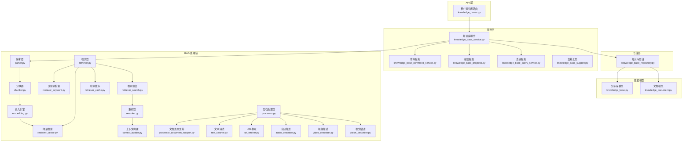
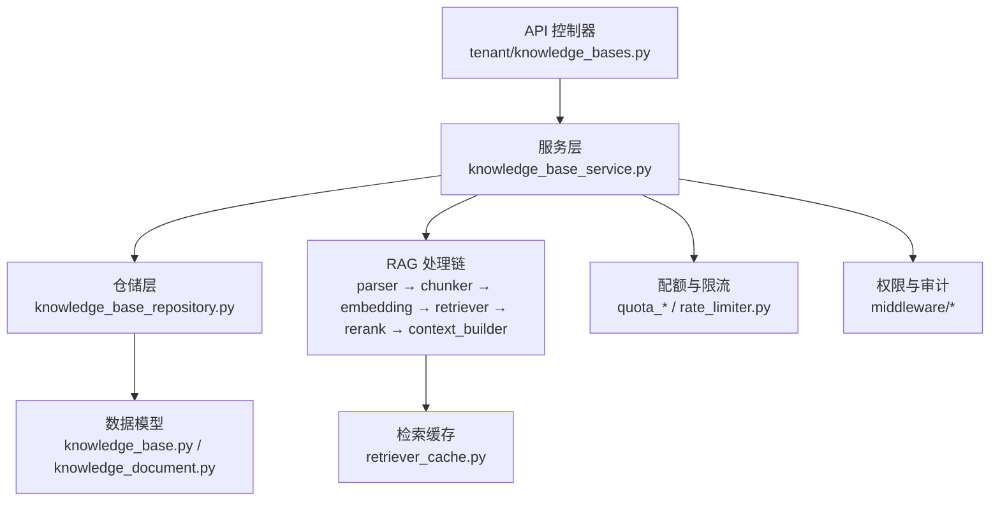
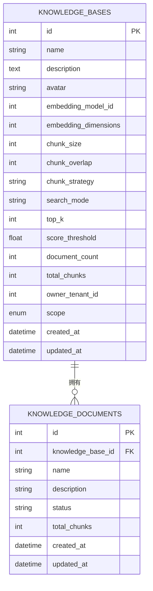
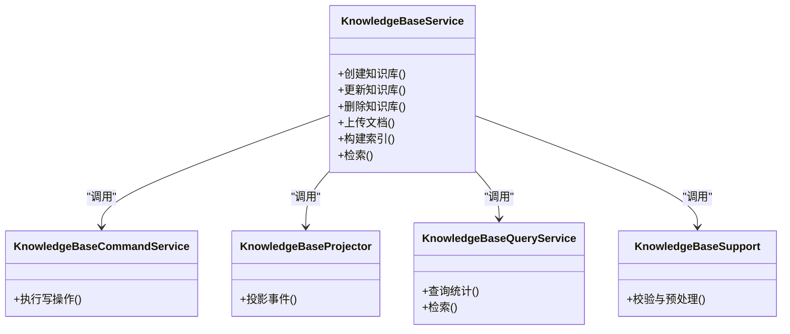
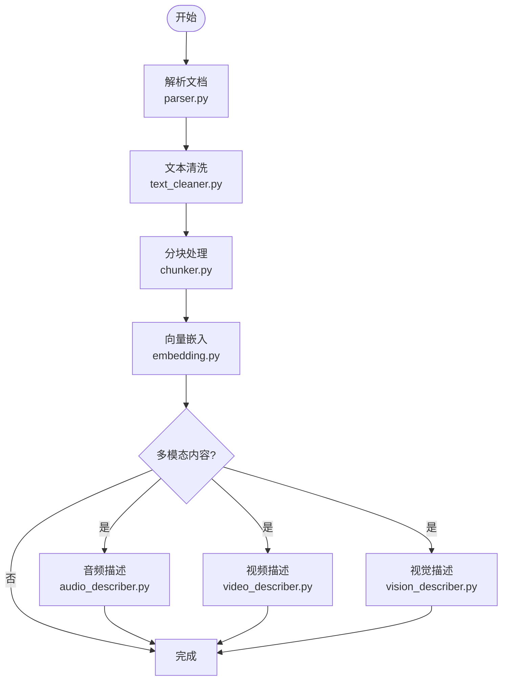
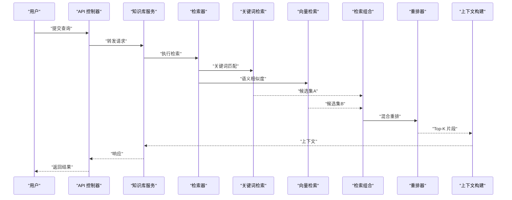
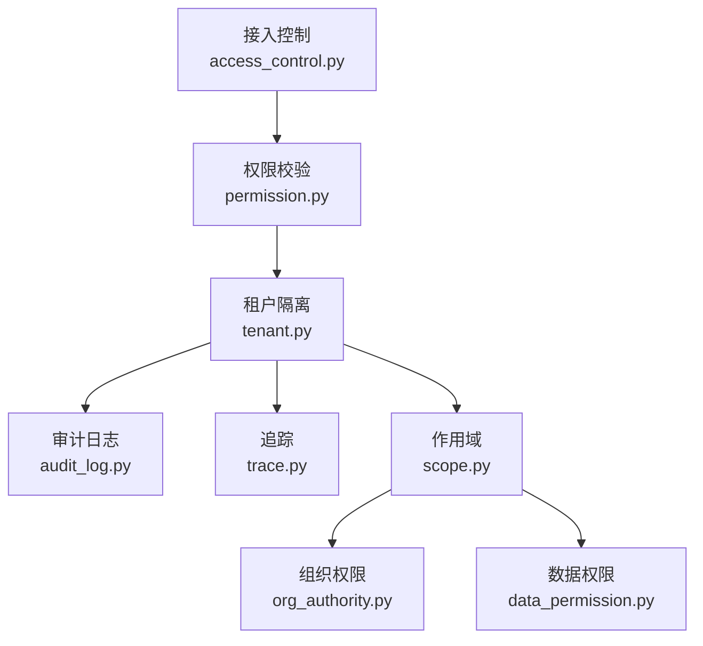
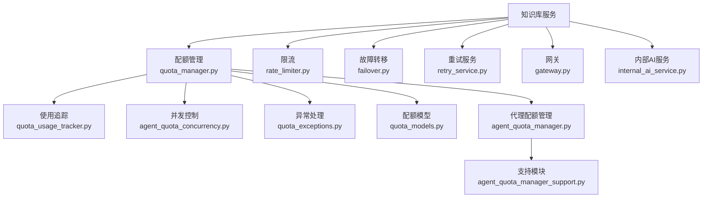
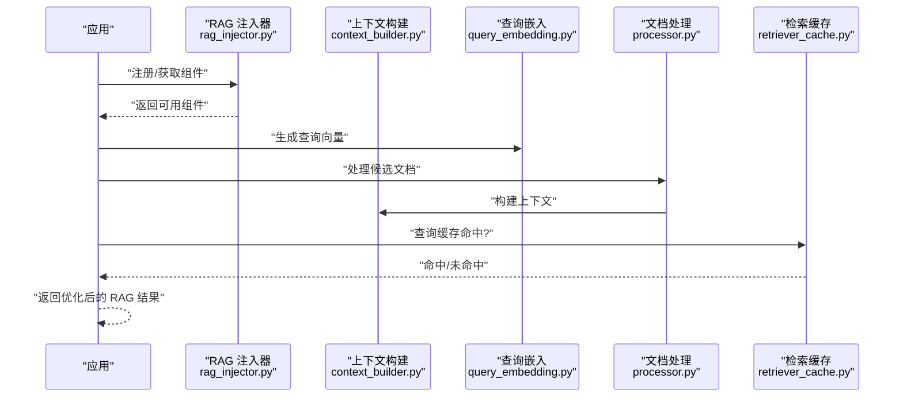
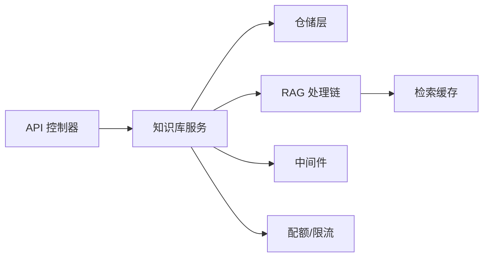

# 知识库服务

<cite>
**本文引用的文件**
- [knowledge_base.py](file://backend/app/models/ai/knowledge_base.py)
- [knowledge_document.py](file://backend/app/models/ai/knowledge_document.py)
- [knowledge_base.py](file://backend/app/schemas/ai/knowledge_base.py)
- [knowledge_base_repository.py](file://backend/app/repositories/ai/knowledge_base_repository.py)
- [knowledge_base_service.py](file://backend/app/services/ai/knowledge_base_service.py)
- [knowledge_base_command_service.py](file://backend/app/services/ai/knowledge_base_command_service.py)
- [knowledge_base_projector.py](file://backend/app/services/ai/knowledge_base_projector.py)
- [knowledge_base_query_service.py](file://backend/app/services/ai/knowledge_base_query_service.py)
- [knowledge_base_support.py](file://backend/app/services/ai/knowledge_base_support.py)
- [knowledge_bases.py](file://backend/app/api/tenant/knowledge_bases.py)
- [knowledge_base.py](file://backend/app/enums/knowledge_base.py)
- [20260211_0010_add_knowledge_base_tables.py](file://backend/migrations/versions/20260211_0010_add_knowledge_base_tables.py)
- [20260212_20a20a8194e9_add_scope_field_to_knowledge_bases_and_.py](file://backend/migrations/versions/20260212_20a20a8194e9_add_scope_field_to_knowledge_bases_and_.py)
- [20260318_0001_add_audio_video_model_id_to_knowledge_bases.py](file://backend/migrations/versions/20260318_0001_add_audio_video_model_id_to_knowledge_bases.py)
- [chunker.py](file://backend/app/ai/rag/chunker.py)
- [parser.py](file://backend/app/ai/rag/parser.py)
- [embedding.py](file://backend/app/ai/rag/embedding.py)
- [retriever.py](file://backend/app/ai/rag/retriever.py)
- [retriever_search.py](file://backend/app/ai/rag/retriever_search.py)
- [retriever_keyword.py](file://backend/app/ai/rag/retriever_keyword.py)
- [retriever_vector.py](file://backend/app/ai/rag/retriever_vector.py)
- [reranker.py](file://backend/app/ai/rag/reranker.py)
- [query_embedding.py](file://backend/app/ai/rag/query_embedding.py)
- [context_builder.py](file://backend/app/ai/rag/context_builder.py)
- [processor.py](file://backend/app/ai/rag/processor.py)
- [processor_document_support.py](file://backend/app/ai/rag/processor_document_support.py)
- [text_cleaner.py](file://backend/app/ai/rag/text_cleaner.py)
- [url_fetcher.py](file://backend/app/ai/rag/url_fetcher.py)
- [audio_describer.py](file://backend/app/ai/rag/audio_describer.py)
- [video_describer.py](file://backend/app/ai/rag/video_describer.py)
- [vision_describer.py](file://backend/app/ai/rag/vision_describer.py)
- [retriever_cache.py](file://backend/app/ai/rag/retriever_cache.py)
- [retriever_cache_ops.py](file://backend/app/ai/rag/retriever_cache_ops.py)
- [rag_injector.py](file://backend/app/rag_injector.py)
- [cache.py](file://backend/app/cache.py)
- [rate_limiter.py](file://backend/app/rate_limiter.py)
- [quota_manager.py](file://backend/app/quota_manager.py)
- [quota_usage_tracker.py](file://backend/app/quota_usage_tracker.py)
- [quota_exceptions.py](file://backend/app/quota_exceptions.py)
- [quota_models.py](file://backend/app/quota_models.py)
- [agent_quota_manager.py](file://backend/app/agent_quota_manager.py)
- [agent_quota_concurrency.py](file://backend/app/agent_quota_concurrency.py)
- [agent_quota_exceptions.py](file://backend/app/agent_quota_exceptions.py)
- [agent_quota_manager_support.py](file://backend/app/agent_quota_manager_support.py)
- [failover.py](file://backend/app/failover.py)
- [retry_service.py](file://backend/app/retry_service.py)
- [internal_ai_service.py](file://backend/app/internal_ai_service.py)
- [gateway.py](file://backend/app/gateway.py)
- [text_semantics.py](file://backend/app/text_semantics.py)
- [text_semantics_terms.py](file://backend/app/text_semantics_terms.py)
- [text_semantics_tokens.py](file://backend/app/text_semantics_tokens.py)
- [text_semantics_urls.py](file://backend/app/text_semantics_urls.py)
- [text_semantics_json.py](file://backend/app/text_semantics_json.py)
- [usage_recorder_core.py](file://backend/app/usage_recorder_core.py)
- [usage_recorder_context.py](file://backend/app/usage_recorder_context.py)
- [usage_recorder_support.py](file://backend/app/usage_recorder_support.py)
- [usage_mode.py](file://backend/app/usage_mode.py)
- [constants.py](file://backend/app/constants.py)
- [exceptions.py](file://backend/app/exceptions.py)
- [types.py](file://backend/app/types.py)
- [json_safe.py](file://backend/app/json_safe.py)
- [sse.py](file://backend/app/sse.py)
- [sio_bridge.py](file://backend/app/sio_bridge.py)
- [socketio_server.py](file://backend/app/socketio_server.py)
- [notification_seeds.py](file://backend/app/sio/notification_seeds.py)
- [tenant_ns.py](file://backend/app/sio/tenant_ns.py)
- [user_ns.py](file://backend/app/sio/user_ns.py)
- [admin_ns.py](file://backend/app/sio/admin_ns.py)
- [error_utils.py](file://backend/app/sio/error_utils.py)
- [ws_config.py](file://backend/app/sio/ws_config.py)
- [access_control.py](file://backend/app/middleware/access_control.py)
- [permission.py](file://backend/app/middleware/permission.py)
- [tenant.py](file://backend/app/middleware/tenant.py)
- [audit_log.py](file://backend/app/middleware/audit_log.py)
- [trace.py](file://backend/app/middleware/trace.py)
- [prometheus_metrics.py](file://backend/app/middleware/prometheus_metrics.py)
- [maintenance.py](file://backend/app/middleware/maintenance.py)
- [i18n.py](file://backend/app/middleware/i18n.py)
- [dynamic_cors.py](file://backend/app/middleware/dynamic_cors.py)
- [nocache.py](file://backend/app/middleware/nocache.py)
- [scope.py](file://backend/app/core/scope.py)
- [identity.py](file://backend/app/core/identity.py)
- [runtime_identity.py](file://backend/app/core/runtime_identity.py)
- [org_authority.py](file://backend/app/core/org_authority.py)
- [data_permission.py](file://backend/app/core/data_permission.py)
- [hosts_helper.py](file://backend/app/core/hosts_helper.py)
- [logging.py](file://backend/app/core/logging.py)
- [cors.py](file://backend/app/core/cors.py)
- [redis.py](file://backend/app/core/redis.py)
- [database.py](file://backend/app/core/database.py)
- [response.py](file://backend/app/core/response.py)
- [deletion.py](file://backend/app/core/deletion.py)
- [csv_export.py](file://backend/app/core/csv_export.py)
- [github_source_policy.py](file://backend/app/core/github_source_policy.py)
- [query_parser.py](file://backend/app/core/query_parser.py)
- [rate_limit.py](file://backend/app/core/rate_limit.py)
- [recycle_bin.py](file://backend/app/core/recycle_bin.py)
- [security.py](file://backend/app/core/security.py)
- [sio_bridge.py](file://backend/app/core/sio_bridge.py)
- [sse.py](file://backend/app/core/sse.py)
- [base_controller.py](file://backend/app/core/base_controller.py)
- [base_model.py](file://backend/app/core/base_model.py)
- [base_repository.py](file://backend/app/core/base_repository.py)
- [base_service.py](file://backend/app/core/base_service.py)
- [base_schema.py](file://backend/app/core/base_schema.py)
- [config.py](file://backend/app/core/config.py)
- [i18n.py](file://backend/app/locales/en/__init__.py)
- [i18n.py](file://backend/app/locales/zh_CN/__init__.py)
</cite>

## 目录
1. [简介](#简介)
2. [项目结构](#项目结构)
3. [核心组件](#核心组件)
4. [架构总览](#架构总览)
5. [详细组件分析](#详细组件分析)
6. [依赖关系分析](#依赖关系分析)
7. [性能考量](#性能考量)
8. [故障排除指南](#故障排除指南)
9. [结论](#结论)
10. [附录](#附录)

## 简介
本技术文档系统性阐述知识库服务的完整管理架构与实现细节，覆盖知识库创建、文档上传、索引构建、查询优化、权限控制、可见性与访问限制、性能优化与缓存策略、并发处理方案，以及 RAG（检索增强生成）的集成与优化策略。文档以代码为依据，结合可视化图示，帮助开发者与运维人员快速理解并高效维护该系统。

## 项目结构
知识库服务位于后端应用的 AI/RAG 子系统中，并通过 API 层暴露给租户与管理员。其数据模型、仓库层、服务层、API 控制器与 RAG 处理链路共同构成完整的知识库生命周期管理。

**图表来源**
- [knowledge_bases.py](file://backend/app/api/tenant/knowledge_bases.py)
- [knowledge_base_service.py](file://backend/app/services/ai/knowledge_base_service.py)
- [knowledge_base_command_service.py](file://backend/app/services/ai/knowledge_base_command_service.py)
- [knowledge_base_projector.py](file://backend/app/services/ai/knowledge_base_projector.py)
- [knowledge_base_query_service.py](file://backend/app/services/ai/knowledge_base_query_service.py)
- [knowledge_base_repository.py](file://backend/app/repositories/ai/knowledge_base_repository.py)
- [knowledge_base.py](file://backend/app/models/ai/knowledge_base.py)
- [knowledge_document.py](file://backend/app/models/ai/knowledge_document.py)
- [parser.py](file://backend/app/ai/rag/parser.py)
- [chunker.py](file://backend/app/ai/rag/chunker.py)
- [embedding.py](file://backend/app/ai/rag/embedding.py)
- [retriever.py](file://backend/app/ai/rag/retriever.py)
- [retriever_keyword.py](file://backend/app/ai/rag/retriever_keyword.py)
- [retriever_vector.py](file://backend/app/ai/rag/retriever_vector.py)
- [retriever_search.py](file://backend/app/ai/rag/retriever_search.py)
- [reranker.py](file://backend/app/ai/rag/reranker.py)
- [context_builder.py](file://backend/app/ai/rag/context_builder.py)
- [processor.py](file://backend/app/ai/rag/processor.py)
- [processor_document_support.py](file://backend/app/ai/rag/processor_document_support.py)
- [text_cleaner.py](file://backend/app/ai/rag/text_cleaner.py)
- [url_fetcher.py](file://backend/app/ai/rag/url_fetcher.py)
- [audio_describer.py](file://backend/app/ai/rag/audio_describer.py)
- [video_describer.py](file://backend/app/ai/rag/video_describer.py)
- [vision_describer.py](file://backend/app/ai/rag/vision_describer.py)
- [retriever_cache.py](file://backend/app/ai/rag/retriever_cache.py)

**章节来源**
- [knowledge_bases.py](file://backend/app/api/tenant/knowledge_bases.py)
- [knowledge_base_service.py](file://backend/app/services/ai/knowledge_base_service.py)
- [knowledge_base_repository.py](file://backend/app/repositories/ai/knowledge_base_repository.py)
- [knowledge_base.py](file://backend/app/models/ai/knowledge_base.py)
- [knowledge_document.py](file://backend/app/models/ai/knowledge_document.py)

## 核心组件
- 数据模型与表结构：定义知识库、文档及其关联字段、过滤与排序能力，以及删除依赖关系。
- 仓储层：封装对知识库与文档的持久化操作。
- 服务层：协调命令、投影、查询与支持工具，驱动知识库生命周期。
- API 层：对外暴露租户与管理员接口，进行资源访问控制与鉴权。
- RAG 处理链：解析、分块、嵌入、检索、重排与上下文构建，支撑查询优化与 RAG 集成。

**章节来源**
- [knowledge_base.py](file://backend/app/models/ai/knowledge_base.py)
- [knowledge_document.py](file://backend/app/models/ai/knowledge_document.py)
- [knowledge_base_repository.py](file://backend/app/repositories/ai/knowledge_base_repository.py)
- [knowledge_base_service.py](file://backend/app/services/ai/knowledge_base_service.py)
- [knowledge_base_command_service.py](file://backend/app/services/ai/knowledge_base_command_service.py)
- [knowledge_base_projector.py](file://backend/app/services/ai/knowledge_base_projector.py)
- [knowledge_base_query_service.py](file://backend/app/services/ai/knowledge_base_query_service.py)
- [knowledge_base_support.py](file://backend/app/services/ai/knowledge_base_support.py)
- [knowledge_bases.py](file://backend/app/api/tenant/knowledge_bases.py)

## 架构总览
知识库服务采用“API → 服务 → 仓储 → 模型”的分层架构；RAG 处理链独立于业务层，通过注入器与服务协作，形成可扩展的文档处理与检索体系。

**图表来源**
- [knowledge_bases.py](file://backend/app/api/tenant/knowledge_bases.py)
- [knowledge_base_service.py](file://backend/app/services/ai/knowledge_base_service.py)
- [knowledge_base_repository.py](file://backend/app/repositories/ai/knowledge_base_repository.py)
- [knowledge_base.py](file://backend/app/models/ai/knowledge_base.py)
- [knowledge_document.py](file://backend/app/models/ai/knowledge_document.py)
- [retriever_cache.py](file://backend/app/ai/rag/retriever_cache.py)
- [quota_manager.py](file://backend/app/quota_manager.py)
- [rate_limiter.py](file://backend/app/rate_limiter.py)
- [access_control.py](file://backend/app/middleware/access_control.py)
- [permission.py](file://backend/app/middleware/permission.py)
- [audit_log.py](file://backend/app/middleware/audit_log.py)

## 详细组件分析

### 数据模型与表结构
- 知识库模型：包含名称、描述、嵌入模型 ID、向量维度、分块参数、检索模式、默认返回数、相似度阈值、文档计数等字段，并定义删除依赖（级联删除绑定与软删除文档）。
- 文档模型：与知识库关联，记录文档元数据与状态。
- 迁移脚本：初始化知识库表结构，新增作用域字段与多模态模型字段，确保扩展性与兼容性。

**图表来源**
- [knowledge_base.py](file://backend/app/models/ai/knowledge_base.py)
- [knowledge_document.py](file://backend/app/models/ai/knowledge_document.py)
- [20260211_0010_add_knowledge_base_tables.py](file://backend/migrations/versions/20260211_0010_add_knowledge_base_tables.py)
- [20260212_20a20a8194e9_add_scope_field_to_knowledge_bases_and_.py](file://backend/migrations/versions/20260212_20a20a8194e9_add_scope_field_to_knowledge_bases_and_.py)
- [20260318_0001_add_audio_video_model_id_to_knowledge_bases.py](file://backend/migrations/versions/20260318_0001_add_audio_video_model_id_to_knowledge_bases.py)

**章节来源**
- [knowledge_base.py](file://backend/app/models/ai/knowledge_base.py)
- [knowledge_document.py](file://backend/app/models/ai/knowledge_document.py)
- [20260211_0010_add_knowledge_base_tables.py](file://backend/migrations/versions/20260211_0010_add_knowledge_base_tables.py)
- [20260212_20a20a8194e9_add_scope_field_to_knowledge_bases_and_.py](file://backend/migrations/versions/20260212_20a20a8194e9_add_scope_field_to_knowledge_bases_and_.py)
- [20260318_0001_add_audio_video_model_id_to_knowledge_bases.py](file://backend/migrations/versions/20260318_0001_add_audio_video_model_id_to_knowledge_bases.py)

### 服务层与控制器
- 知识库服务：编排命令、投影、查询与支持工具，负责知识库生命周期管理。
- 命令服务：执行创建、更新、删除等写操作。
- 投影服务：负责状态同步与事件投影。
- 查询服务：提供检索与统计查询能力。
- 支持工具：辅助处理与校验。
- API 控制器：面向租户暴露知识库 CRUD 与检索接口，配合中间件进行权限与审计。

**图表来源**
- [knowledge_base_service.py](file://backend/app/services/ai/knowledge_base_service.py)
- [knowledge_base_command_service.py](file://backend/app/services/ai/knowledge_base_command_service.py)
- [knowledge_base_projector.py](file://backend/app/services/ai/knowledge_base_projector.py)
- [knowledge_base_query_service.py](file://backend/app/services/ai/knowledge_base_query_service.py)
- [knowledge_base_support.py](file://backend/app/services/ai/knowledge_base_support.py)

**章节来源**
- [knowledge_base_service.py](file://backend/app/services/ai/knowledge_base_service.py)
- [knowledge_base_command_service.py](file://backend/app/services/ai/knowledge_base_command_service.py)
- [knowledge_base_projector.py](file://backend/app/services/ai/knowledge_base_projector.py)
- [knowledge_base_query_service.py](file://backend/app/services/ai/knowledge_base_query_service.py)
- [knowledge_base_support.py](file://backend/app/services/ai/knowledge_base_support.py)
- [knowledge_bases.py](file://backend/app/api/tenant/knowledge_bases.py)

### 文档解析、分块与向量嵌入
- 解析器：支持多种文档格式，提取纯文本与结构化内容。
- 分块器：按策略将长文本切分为固定长度且带重叠的片段，便于向量化与检索。
- 嵌入引擎：将文本片段转换为高维向量，支持批量与异步处理。
- 多模态支持：音频、视频与视觉描述器用于非文本内容的向量化。
- 文本清洗：去除噪声与无关字符，提升嵌入质量。
- URL 抓取：远程资源抓取与解析。

**图表来源**
- [parser.py](file://backend/app/ai/rag/parser.py)
- [text_cleaner.py](file://backend/app/ai/rag/text_cleaner.py)
- [chunker.py](file://backend/app/ai/rag/chunker.py)
- [embedding.py](file://backend/app/ai/rag/embedding.py)
- [audio_describer.py](file://backend/app/ai/rag/audio_describer.py)
- [video_describer.py](file://backend/app/ai/rag/video_describer.py)
- [vision_describer.py](file://backend/app/ai/rag/vision_describer.py)

**章节来源**
- [parser.py](file://backend/app/ai/rag/parser.py)
- [chunker.py](file://backend/app/ai/rag/chunker.py)
- [embedding.py](file://backend/app/ai/rag/embedding.py)
- [text_cleaner.py](file://backend/app/ai/rag/text_cleaner.py)
- [audio_describer.py](file://backend/app/ai/rag/audio_describer.py)
- [video_describer.py](file://backend/app/ai/rag/video_describer.py)
- [vision_describer.py](file://backend/app/ai/rag/vision_describer.py)

### 检索算法与查询优化
- 关键词检索：基于关键词匹配，快速筛选候选片段。
- 向量检索：基于语义相似度计算，返回高相关性片段。
- 检索组合：融合关键词与向量结果，提升召回与精度。
- 重排器：对混合结果进行再排序，优化最终输出。
- 查询改写：对用户输入进行改写，提升检索效果。
- 上下文构建：将候选片段组织为提示上下文，供 LLM 使用。
- 检索缓存：缓存热门查询结果，降低延迟与成本。

**图表来源**
- [knowledge_base_query_service.py](file://backend/app/services/ai/knowledge_base_query_service.py)
- [retriever.py](file://backend/app/ai/rag/retriever.py)
- [retriever_keyword.py](file://backend/app/ai/rag/retriever_keyword.py)
- [retriever_vector.py](file://backend/app/ai/rag/retriever_vector.py)
- [retriever_search.py](file://backend/app/ai/rag/retriever_search.py)
- [reranker.py](file://backend/app/ai/rag/reranker.py)
- [context_builder.py](file://backend/app/ai/rag/context_builder.py)

**章节来源**
- [knowledge_base_query_service.py](file://backend/app/services/ai/knowledge_base_query_service.py)
- [retriever.py](file://backend/app/ai/rag/retriever.py)
- [retriever_keyword.py](file://backend/app/ai/rag/retriever_keyword.py)
- [retriever_vector.py](file://backend/app/ai/rag/retriever_vector.py)
- [retriever_search.py](file://backend/app/ai/rag/retriever_search.py)
- [reranker.py](file://backend/app/ai/rag/reranker.py)
- [context_builder.py](file://backend/app/ai/rag/context_builder.py)

### 权限控制、可见性与访问限制
- 中间件：统一接入控制、权限校验、租户隔离、审计日志、追踪与国际化。
- 作用域与组织权限：通过作用域与组织权限模型，限定资源可见范围。
- 数据权限：在查询与写入时进行数据权限过滤。
- 审计与追踪：记录关键操作，便于合规与回溯。

**图表来源**
- [access_control.py](file://backend/app/middleware/access_control.py)
- [permission.py](file://backend/app/middleware/permission.py)
- [tenant.py](file://backend/app/middleware/tenant.py)
- [audit_log.py](file://backend/app/middleware/audit_log.py)
- [trace.py](file://backend/app/middleware/trace.py)
- [scope.py](file://backend/app/core/scope.py)
- [org_authority.py](file://backend/app/core/org_authority.py)
- [data_permission.py](file://backend/app/core/data_permission.py)

**章节来源**
- [access_control.py](file://backend/app/middleware/access_control.py)
- [permission.py](file://backend/app/middleware/permission.py)
- [tenant.py](file://backend/app/middleware/tenant.py)
- [audit_log.py](file://backend/app/middleware/audit_log.py)
- [trace.py](file://backend/app/middleware/trace.py)
- [scope.py](file://backend/app/core/scope.py)
- [org_authority.py](file://backend/app/core/org_authority.py)
- [data_permission.py](file://backend/app/core/data_permission.py)

### 并发处理与配额/限流
- 配额管理：统一配额模型与使用追踪，防止资源滥用。
- 并发控制：代理配额并发管理，保障系统稳定性。
- 限流与降级：全局与模型级限流，配合故障转移与重试策略。
- 内部 AI 服务与网关：统一调度与路由，支持多适配器。

**图表来源**
- [quota_manager.py](file://backend/app/quota_manager.py)
- [quota_usage_tracker.py](file://backend/app/quota_usage_tracker.py)
- [agent_quota_concurrency.py](file://backend/app/agent_quota_concurrency.py)
- [quota_exceptions.py](file://backend/app/quota_exceptions.py)
- [quota_models.py](file://backend/app/quota_models.py)
- [agent_quota_manager.py](file://backend/app/agent_quota_manager.py)
- [agent_quota_manager_support.py](file://backend/app/agent_quota_manager_support.py)
- [rate_limiter.py](file://backend/app/rate_limiter.py)
- [failover.py](file://backend/app/failover.py)
- [retry_service.py](file://backend/app/retry_service.py)
- [gateway.py](file://backend/app/gateway.py)
- [internal_ai_service.py](file://backend/app/internal_ai_service.py)

**章节来源**
- [quota_manager.py](file://backend/app/quota_manager.py)
- [quota_usage_tracker.py](file://backend/app/quota_usage_tracker.py)
- [agent_quota_concurrency.py](file://backend/app/agent_quota_concurrency.py)
- [quota_exceptions.py](file://backend/app/quota_exceptions.py)
- [quota_models.py](file://backend/app/quota_models.py)
- [agent_quota_manager.py](file://backend/app/agent_quota_manager.py)
- [agent_quota_manager_support.py](file://backend/app/agent_quota_manager_support.py)
- [rate_limiter.py](file://backend/app/rate_limiter.py)
- [failover.py](file://backend/app/failover.py)
- [retry_service.py](file://backend/app/retry_service.py)
- [gateway.py](file://backend/app/gateway.py)
- [internal_ai_service.py](file://backend/app/internal_ai_service.py)

### RAG 集成与优化策略
- 注入器：集中式注入 RAG 组件，保证一致性与可替换性。
- 上下文构建：将检索到的片段组织为提示上下文，支持模板化与动态拼接。
- 查询改写：提升检索鲁棒性与准确性。
- 缓存策略：热点查询缓存，减少重复计算。
- 性能优化：批量化嵌入、异步处理、向量化加速与内存复用。

**图表来源**
- [rag_injector.py](file://backend/app/rag_injector.py)
- [context_builder.py](file://backend/app/ai/rag/context_builder.py)
- [query_embedding.py](file://backend/app/ai/rag/query_embedding.py)
- [processor.py](file://backend/app/ai/rag/processor.py)
- [retriever_cache.py](file://backend/app/ai/rag/retriever_cache.py)

**章节来源**
- [rag_injector.py](file://backend/app/rag_injector.py)
- [context_builder.py](file://backend/app/ai/rag/context_builder.py)
- [query_embedding.py](file://backend/app/ai/rag/query_embedding.py)
- [processor.py](file://backend/app/ai/rag/processor.py)
- [retriever_cache.py](file://backend/app/ai/rag/retriever_cache.py)

## 依赖关系分析
- 组件耦合：服务层聚合仓储与 RAG 组件，API 层仅负责协议与鉴权，职责清晰。
- 外部依赖：数据库、缓存、网关与适配器；通过注入器与中间件解耦。
- 可能的循环依赖：当前结构以服务层为中心向外辐射，未见明显循环依赖迹象。

**图表来源**
- [knowledge_bases.py](file://backend/app/api/tenant/knowledge_bases.py)
- [knowledge_base_service.py](file://backend/app/services/ai/knowledge_base_service.py)
- [knowledge_base_repository.py](file://backend/app/repositories/ai/knowledge_base_repository.py)
- [retriever_cache.py](file://backend/app/ai/rag/retriever_cache.py)
- [access_control.py](file://backend/app/middleware/access_control.py)
- [quota_manager.py](file://backend/app/quota_manager.py)

**章节来源**
- [knowledge_bases.py](file://backend/app/api/tenant/knowledge_bases.py)
- [knowledge_base_service.py](file://backend/app/services/ai/knowledge_base_service.py)
- [knowledge_base_repository.py](file://backend/app/repositories/ai/knowledge_base_repository.py)
- [retriever_cache.py](file://backend/app/ai/rag/retriever_cache.py)
- [access_control.py](file://backend/app/middleware/access_control.py)
- [quota_manager.py](file://backend/app/quota_manager.py)

## 性能考量
- 批量化与异步：嵌入与检索支持批量处理与异步执行，降低延迟。
- 缓存策略：热点查询与候选集缓存，显著减少重复计算。
- 向量化加速：选择合适维度与模型，平衡精度与性能。
- 资源配额：通过配额与并发控制，避免过载。
- I/O 优化：解析与分块阶段尽量减少磁盘与网络 I/O。

[本节为通用性能建议，不直接分析具体文件]

## 故障排除指南
- 常见错误类型：配置错误、权限不足、配额超限、检索失败、缓存异常。
- 排查步骤：检查中间件日志、审计日志与追踪 ID；核对配额与限流状态；验证缓存命中率与 TTL；确认 RAG 组件可用性。
- 重试与降级：启用重试服务与故障转移，保障可用性。
- 监控指标：Prometheus 指标、速率限制与使用记录。

**章节来源**
- [exceptions.py](file://backend/app/exceptions.py)
- [quota_exceptions.py](file://backend/app/quota_exceptions.py)
- [retry_service.py](file://backend/app/retry_service.py)
- [failover.py](file://backend/app/failover.py)
- [prometheus_metrics.py](file://backend/app/middleware/prometheus_metrics.py)
- [audit_log.py](file://backend/app/middleware/audit_log.py)
- [trace.py](file://backend/app/middleware/trace.py)
- [usage_recorder_core.py](file://backend/app/usage_recorder_core.py)
- [usage_recorder_context.py](file://backend/app/usage_recorder_context.py)
- [usage_recorder_support.py](file://backend/app/usage_recorder_support.py)

## 结论
知识库服务通过清晰的分层架构与可插拔的 RAG 处理链，实现了从文档解析、分块、嵌入到检索与重排的全链路能力。结合权限控制、可见性管理、配额与限流、缓存与并发策略，系统在功能完整性与运行稳定性之间取得良好平衡。建议在生产环境中持续监控检索命中率、缓存效率与资源使用情况，以进一步优化性能与成本。

[本节为总结性内容，不直接分析具体文件]

## 附录
- 最佳实践：合理设置分块参数与检索阈值；定期清理无效文档；启用审计与追踪；使用缓存与批处理；严格权限与作用域管理。
- RAG 优化：查询改写、混合检索、重排策略与上下文模板化；多模态内容优先级与质量评估。

[本节为概念性内容，不直接分析具体文件]