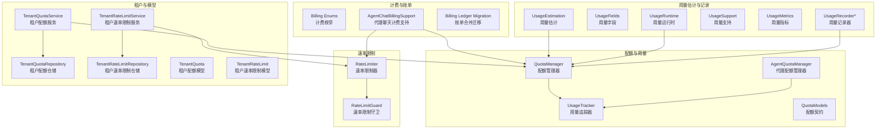
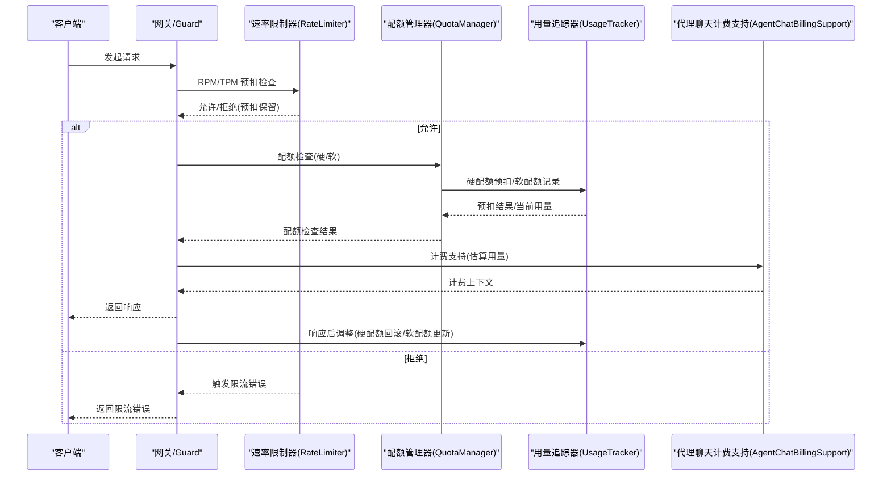
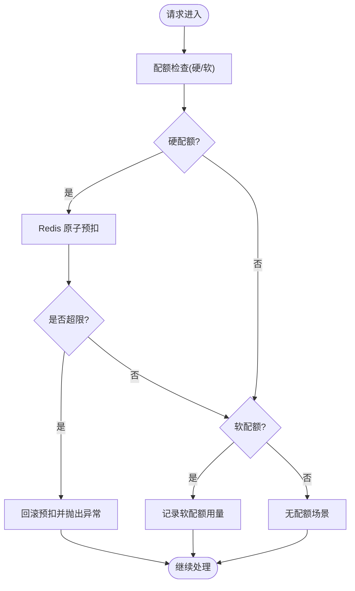
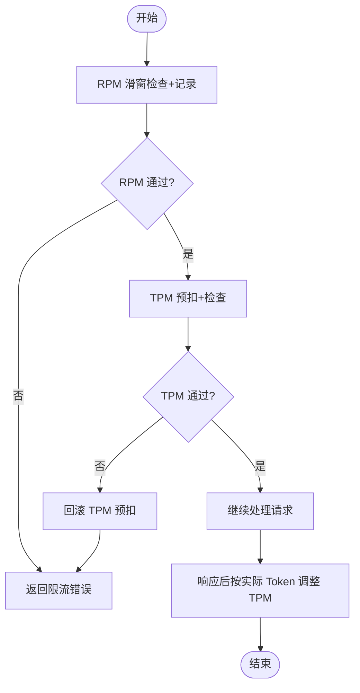
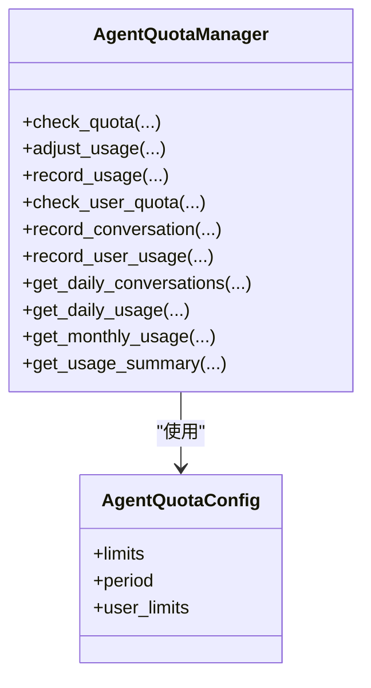
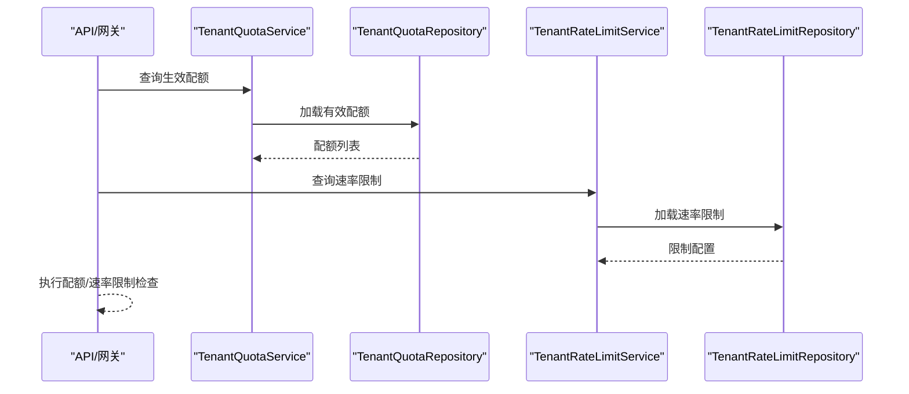
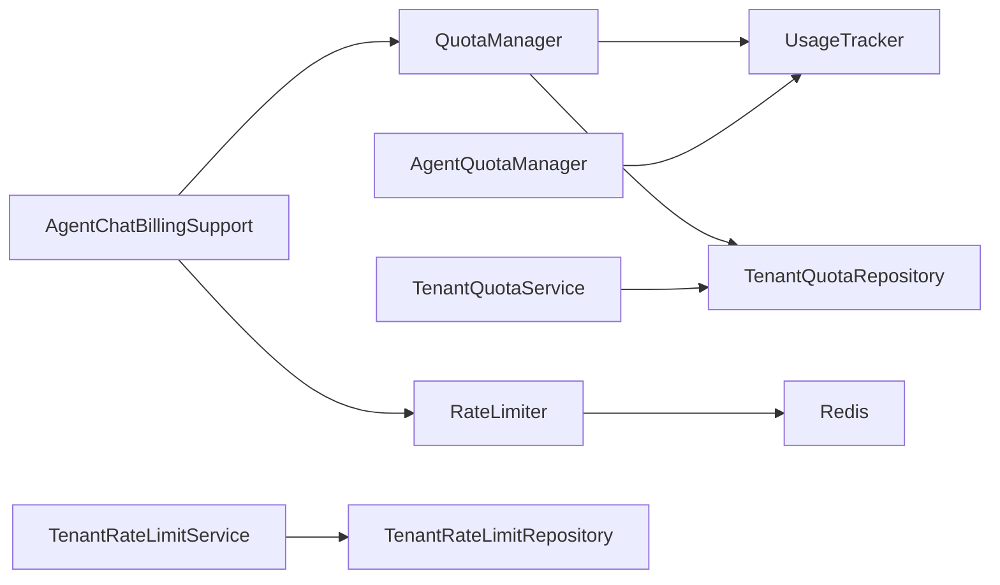

# 计费和配额服务

<cite>
**本文引用的文件**
- [backend/app/ai/quota_manager.py](file://backend/app/ai/quota_manager.py)
- [backend/app/ai/quota_models.py](file://backend/app/ai/quota_models.py)
- [backend/app/ai/quota_usage_tracker.py](file://backend/app/ai/quota_usage_tracker.py)
- [backend/app/ai/rate_limiter.py](file://backend/app/ai/rate_limiter.py)
- [backend/app/ai/agent_quota_manager.py](file://backend/app/ai/agent_quota_manager.py)
- [backend/app/ai/agent_quota_config.py](file://backend/app/ai/agent_quota_config.py)
- [backend/app/ai/agent_quota_manager_support.py](file://backend/app/ai/agent_quota_manager_support.py)
- [backend/app/ai/gateway_support/quota_guard.py](file://backend/app/ai/gateway_support/quota_guard.py)
- [backend/app/ai/gateway_support/rate_limit_guard.py](file://backend/app/ai/gateway_support/rate_limit_guard.py)
- [backend/app/models/ai/tenant_quota.py](file://backend/app/models/ai/tenant_quota.py)
- [backend/app/repositories/ai/tenant_quota_repository.py](file://backend/app/repositories/ai/tenant_quota_repository.py)
- [backend/app/schemas/ai/tenant_quota.py](file://backend/app/schemas/ai/tenant_quota.py)
- [backend/app/services/ai/tenant_quota_service.py](file://backend/app/services/ai/tenant_quota_service.py)
- [backend/app/models/ai/tenant_rate_limit.py](file://backend/app/models/ai/tenant_rate_limit.py)
- [backend/app/repositories/ai/tenant_rate_limit_repository.py](file://backend/app/repositories/ai/tenant_rate_limit_repository.py)
- [backend/app/schemas/ai/tenant_rate_limit.py](file://backend/app/schemas/ai/tenant_rate_limit.py)
- [backend/app/services/ai/tenant_rate_limit_service.py](file://backend/app/services/ai/tenant_rate_limit_service.py)
- [backend/app/enums/billing.py](file://backend/app/enums/billing.py)
- [backend/app/services/ai/agent_chat_billing_support.py](file://backend/app/services/ai/agent_chat_billing_support.py)
- [backend/migrations/versions/20260322_ai_billing_ledger_merge.py](file://backend/migrations/versions/20260322_ai_billing_ledger_merge.py)
- [backend/app/api/admin/ai_quotas.py](file://backend/app/api/admin/ai_quotas.py)
- [backend/app/api/tenant/ai_quotas.py](file://backend/app/api/tenant/ai_quotas.py)
- [backend/app/api/admin/ai_usage.py](file://backend/app/api/admin/ai_usage.py)
- [backend/app/api/tenant/ai_usage.py](file://backend/app/api/tenant/ai_usage.py)
- [backend/app/repositories/ai/quota_diagnostics_repository.py](file://backend/app/repositories/ai/quota_diagnostics_repository.py)
- [backend/app/schemas/ai/quota_diagnostics.py](file://backend/app/schemas/ai/quota_diagnostics.py)
- [backend/app/services/ai/quota_diagnostics_service.py](file://backend/app/services/ai/quota_diagnostics_service.py)
- [backend/app/services/ai/monitoring_usage_query_service.py](file://backend/app/services/ai/monitoring_usage_query_service.py)
- [backend/app/ai/adapters/openai_compatible/support/usage_estimation.py](file://backend/app/ai/adapters/openai_compatible/support/usage_estimation.py)
- [backend/app/ai/adapters/openai_compatible/support/usage_fields.py](file://backend/app/ai/adapters/openai_compatible/support/usage_fields.py)
- [backend/app/ai/adapters/openai_compatible/support/usage_runtime.py](file://backend/app/ai/adapters/openai_compatible/support/usage_runtime.py)
- [backend/app/ai/adapters/openai_compatible/support/usage_support.py](file://backend/app/ai/adapters/openai_compatible/support/usage_support.py)
- [backend/app/ai/runtime/usage_metrics.py](file://backend/app/ai/runtime/usage_metrics.py)
- [backend/app/ai/usage_mode.py](file://backend/app/ai/usage_mode.py)
- [backend/app/ai/usage_recorder_context.py](file://backend/app/ai/usage_recorder_context.py)
- [backend/app/ai/usage_recorder_core.py](file://backend/app/ai/usage_recorder_core.py)
- [backend/app/ai/usage_recorder_support.py](file://backend/app/ai/usage_recorder_support.py)
</cite>

## 目录
1. [引言](#引言)
2. [项目结构](#项目结构)
3. [核心组件](#核心组件)
4. [架构总览](#架构总览)
5. [详细组件分析](#详细组件分析)
6. [依赖分析](#依赖分析)
7. [性能考虑](#性能考虑)
8. [故障排查指南](#故障排查指南)
9. [结论](#结论)
10. [附录](#附录)

## 引言
本技术文档聚焦于计费与配额服务在 AI 服务中的实现与集成，系统性阐述用量统计、限额控制、费用计算、租户配额分配与调整、速率限制（令牌桶、滑动窗口）、代理聊天计费与费用归集、配额预警与续费、欠费处理、计费策略配置与定价模型设计，以及费用审计、账单生成与退款处理机制。文档以代码级分析为基础，辅以可视化图示，帮助读者快速理解并落地实施。

## 项目结构
计费与配额相关能力主要分布在以下模块：
- 配额管理：QuotaManager、UsageTracker、AgentQuotaManager 及其支持模块
- 速率限制：RateLimiter 及网关守卫
- 租户配额与速率限制的模型、仓储、服务与 API
- 用量估计与记录：适配器支持、运行时指标、用量记录器
- 计费与账单：计费枚举、代理聊天计费支持、账单合并迁移
- 监控与诊断：配额诊断、用量查询服务

图表来源
- [backend/app/ai/quota_manager.py:22-309](file://backend/app/ai/quota_manager.py#L22-L309)
- [backend/app/ai/quota_usage_tracker.py:11-340](file://backend/app/ai/quota_usage_tracker.py#L11-L340)
- [backend/app/ai/agent_quota_manager.py:45-308](file://backend/app/ai/agent_quota_manager.py#L45-L308)
- [backend/app/ai/rate_limiter.py:41-357](file://backend/app/ai/rate_limiter.py#L41-L357)
- [backend/app/models/ai/tenant_quota.py](file://backend/app/models/ai/tenant_quota.py)
- [backend/app/models/ai/tenant_rate_limit.py](file://backend/app/models/ai/tenant_rate_limit.py)
- [backend/app/services/ai/tenant_quota_service.py](file://backend/app/services/ai/tenant_quota_service.py)
- [backend/app/services/ai/tenant_rate_limit_service.py](file://backend/app/services/ai/tenant_rate_limit_service.py)
- [backend/app/services/ai/agent_chat_billing_support.py](file://backend/app/services/ai/agent_chat_billing_support.py)
- [backend/app/enums/billing.py](file://backend/app/enums/billing.py)
- [backend/migrations/versions/20260322_ai_billing_ledger_merge.py](file://backend/migrations/versions/20260322_ai_billing_ledger_merge.py)

章节来源
- [backend/app/ai/quota_manager.py:22-309](file://backend/app/ai/quota_manager.py#L22-L309)
- [backend/app/ai/rate_limiter.py:41-357](file://backend/app/ai/rate_limiter.py#L41-L357)
- [backend/app/ai/agent_quota_manager.py:45-308](file://backend/app/ai/agent_quota_manager.py#L45-L308)

## 核心组件
- 配额管理器（QuotaManager）：负责租户维度的配额检查、预扣、回滚与调整；区分硬配额与软配额；通过 UsageTracker 进行 Redis 原子操作。
- 用量追踪器（UsageTracker）：基于 Redis 的每日/每月用量键空间，提供原子预扣、回滚与调整，避免竞态条件。
- 速率限制器（RateLimiter）：RPM（滑动窗口）与 TPM（令牌桶）双通道，Lua 原子脚本保证一致性；提供预扣、回滚与响应后调整。
- 代理配额管理器（AgentQuotaManager）：面向代理的用量与对话配额，支持用户级配额与汇总统计。
- 租户配额/速率限制模型与服务：仓储层加载有效配额与速率限制，服务层协调业务逻辑。
- 计费与账单：计费枚举定义计费状态与类型；代理聊天计费支持对接配额与速率限制；账单合并迁移确保历史数据兼容。

章节来源
- [backend/app/ai/quota_manager.py:22-309](file://backend/app/ai/quota_manager.py#L22-L309)
- [backend/app/ai/quota_usage_tracker.py:11-340](file://backend/app/ai/quota_usage_tracker.py#L11-L340)
- [backend/app/ai/rate_limiter.py:41-357](file://backend/app/ai/rate_limiter.py#L41-L357)
- [backend/app/ai/agent_quota_manager.py:45-308](file://backend/app/ai/agent_quota_manager.py#L45-L308)
- [backend/app/enums/billing.py](file://backend/app/enums/billing.py)
- [backend/app/services/ai/agent_chat_billing_support.py](file://backend/app/services/ai/agent_chat_billing_support.py)

## 架构总览
下图展示从请求进入网关到配额/速率限制检查、用量记录与计费支持的整体流程。

图表来源
- [backend/app/ai/rate_limiter.py:96-202](file://backend/app/ai/rate_limiter.py#L96-L202)
- [backend/app/ai/quota_manager.py:40-139](file://backend/app/ai/quota_manager.py#L40-L139)
- [backend/app/ai/quota_usage_tracker.py:152-194](file://backend/app/ai/quota_usage_tracker.py#L152-L194)
- [backend/app/services/ai/agent_chat_billing_support.py](file://backend/app/services/ai/agent_chat_billing_support.py)

## 详细组件分析

### 配额管理与用量追踪
- 配额类型与检查流程
  - 硬配额：请求前原子预扣，超限时回滚并抛出异常；响应后根据实际用量调整。
  - 软配额：仅记录当前用量，超过阈值触发预警通知（按日去重）。
  - 全局配额：统一映射到模型桶 0，便于跨模型聚合。
- 用量追踪
  - Redis 键空间：每日/每月前缀，带过期策略；Lua 原子脚本保证并发安全。
  - 预扣与回滚：先预扣再检查，超限则回滚；调整阶段将预估用量替换为实际用量。
- 计费上下文
  - QuotaMeteringItem 与 QuotaCheckResult 记录命中规则，确保响应阶段对同一 Redis 桶进行精确调整。

图表来源
- [backend/app/ai/quota_manager.py:40-139](file://backend/app/ai/quota_manager.py#L40-L139)
- [backend/app/ai/quota_usage_tracker.py:152-194](file://backend/app/ai/quota_usage_tracker.py#L152-L194)

章节来源
- [backend/app/ai/quota_manager.py:22-309](file://backend/app/ai/quota_manager.py#L22-L309)
- [backend/app/ai/quota_models.py:8-37](file://backend/app/ai/quota_models.py#L8-L37)
- [backend/app/ai/quota_usage_tracker.py:11-340](file://backend/app/ai/quota_usage_tracker.py#L11-L340)

### 速率限制：滑动窗口与令牌桶
- RPM（请求/分钟）：基于有序集合的滑动窗口，Lua 原子清理过期、计数与新增成员，避免竞态。
- TPM（Token/分钟）：基于两个相邻分钟键的累加，Lua 原子预扣与检查，超限则回滚。
- 预扣与回滚：在后续门禁拒绝时可撤销预扣，避免误扣。
- 响应后调整：将预估 Token 替换为实际 Token，保证计费精度。

图表来源
- [backend/app/ai/rate_limiter.py:96-202](file://backend/app/ai/rate_limiter.py#L96-L202)
- [backend/app/ai/rate_limiter.py:226-263](file://backend/app/ai/rate_limiter.py#L226-L263)

章节来源
- [backend/app/ai/rate_limiter.py:41-357](file://backend/app/ai/rate_limiter.py#L41-L357)

### 代理聊天计费支持与费用归集
- 代理配额管理器：提供代理维度的用量、对话数与用户级用量统计；支持按日/月键空间与 Lua 原子调整。
- 计费支持：结合配额与速率限制，估算 Token 并在响应后归集实际用量，确保计费准确。

图表来源
- [backend/app/ai/agent_quota_manager.py:45-308](file://backend/app/ai/agent_quota_manager.py#L45-L308)
- [backend/app/ai/agent_quota_config.py](file://backend/app/ai/agent_quota_config.py)

章节来源
- [backend/app/ai/agent_quota_manager.py:45-308](file://backend/app/ai/agent_quota_manager.py#L45-L308)
- [backend/app/services/ai/agent_chat_billing_support.py](file://backend/app/services/ai/agent_chat_billing_support.py)

### 租户配额与速率限制：分配、监控与调整
- 模型与仓储：TenantQuota/TenantRateLimit 模型承载配额与速率限制定义；仓储加载“生效配额”；服务协调业务。
- 网关守卫：在请求入口处执行配额与速率限制检查，失败时快速拒绝并返回相应错误。
- 监控与诊断：提供用量查询与配额诊断接口，辅助运维与告警。

图表来源
- [backend/app/services/ai/tenant_quota_service.py](file://backend/app/services/ai/tenant_quota_service.py)
- [backend/app/repositories/ai/tenant_quota_repository.py](file://backend/app/repositories/ai/tenant_quota_repository.py)
- [backend/app/services/ai/tenant_rate_limit_service.py](file://backend/app/services/ai/tenant_rate_limit_service.py)
- [backend/app/repositories/ai/tenant_rate_limit_repository.py](file://backend/app/repositories/ai/tenant_rate_limit_repository.py)

章节来源
- [backend/app/models/ai/tenant_quota.py](file://backend/app/models/ai/tenant_quota.py)
- [backend/app/schemas/ai/tenant_quota.py](file://backend/app/schemas/ai/tenant_quota.py)
- [backend/app/models/ai/tenant_rate_limit.py](file://backend/app/models/ai/tenant_rate_limit.py)
- [backend/app/schemas/ai/tenant_rate_limit.py](file://backend/app/schemas/ai/tenant_rate_limit.py)
- [backend/app/api/admin/ai_quotas.py](file://backend/app/api/admin/ai_quotas.py)
- [backend/app/api/tenant/ai_quotas.py](file://backend/app/api/tenant/ai_quotas.py)
- [backend/app/api/admin/ai_usage.py](file://backend/app/api/admin/ai_usage.py)
- [backend/app/api/tenant/ai_usage.py](file://backend/app/api/tenant/ai_usage.py)
- [backend/app/repositories/ai/quota_diagnostics_repository.py](file://backend/app/repositories/ai/quota_diagnostics_repository.py)
- [backend/app/schemas/ai/quota_diagnostics.py](file://backend/app/schemas/ai/quota_diagnostics.py)
- [backend/app/services/ai/quota_diagnostics_service.py](file://backend/app/services/ai/quota_diagnostics_service.py)
- [backend/app/services/ai/monitoring_usage_query_service.py](file://backend/app/services/ai/monitoring_usage_query_service.py)

### 用量估计与记录
- 适配器支持：OpenAI 兼容适配器提供用量估计、字段与运行时支持，确保不同供应商输出一致。
- 运行时指标：用量指标与模式定义，支撑用量记录器上下文与核心逻辑。
- 用量记录器：封装上下文、核心与支持模块，统一记录与调整 Token 用量。

章节来源
- [backend/app/ai/adapters/openai_compatible/support/usage_estimation.py](file://backend/app/ai/adapters/openai_compatible/support/usage_estimation.py)
- [backend/app/ai/adapters/openai_compatible/support/usage_fields.py](file://backend/app/ai/adapters/openai_compatible/support/usage_fields.py)
- [backend/app/ai/adapters/openai_compatible/support/usage_runtime.py](file://backend/app/ai/adapters/openai_compatible/support/usage_runtime.py)
- [backend/app/ai/adapters/openai_compatible/support/usage_support.py](file://backend/app/ai/adapters/openai_compatible/support/usage_support.py)
- [backend/app/ai/runtime/usage_metrics.py](file://backend/app/ai/runtime/usage_metrics.py)
- [backend/app/ai/usage_mode.py](file://backend/app/ai/usage_mode.py)
- [backend/app/ai/usage_recorder_context.py](file://backend/app/ai/usage_recorder_context.py)
- [backend/app/ai/usage_recorder_core.py](file://backend/app/ai/usage_recorder_core.py)
- [backend/app/ai/usage_recorder_support.py](file://backend/app/ai/usage_recorder_support.py)

## 依赖分析
- 组件耦合
  - QuotaManager 依赖 UsageTracker 与 TenantQuotaRepository；AgentQuotaManager 依赖 Redis Lua 脚本与内部支持函数。
  - RateLimiter 依赖 Redis 与 Lua 脚本，提供 RPM/TPM 两种限流策略。
  - 租户配额/速率限制服务通过仓储加载配置，API 层在网关处执行检查。
- 外部依赖
  - Redis：作为高吞吐、低延迟的存储与计数后端，支撑原子 Lua 脚本。
  - 通知服务：软配额预警通过通知服务向管理员发送消息。
- 循环依赖
  - 代码中未见循环导入；各模块职责清晰，通过服务层解耦仓储与控制器。

图表来源
- [backend/app/ai/quota_manager.py:30-38](file://backend/app/ai/quota_manager.py#L30-L38)
- [backend/app/ai/quota_usage_tracker.py:57-59](file://backend/app/ai/quota_usage_tracker.py#L57-L59)
- [backend/app/ai/rate_limiter.py:18-18](file://backend/app/ai/rate_limiter.py#L18-L18)
- [backend/app/services/ai/tenant_quota_service.py](file://backend/app/services/ai/tenant_quota_service.py)
- [backend/app/services/ai/tenant_rate_limit_service.py](file://backend/app/services/ai/tenant_rate_limit_service.py)
- [backend/app/services/ai/agent_chat_billing_support.py](file://backend/app/services/ai/agent_chat_billing_support.py)

章节来源
- [backend/app/ai/quota_manager.py:22-309](file://backend/app/ai/quota_manager.py#L22-L309)
- [backend/app/ai/rate_limiter.py:41-357](file://backend/app/ai/rate_limiter.py#L41-L357)
- [backend/app/ai/agent_quota_manager.py:45-308](file://backend/app/ai/agent_quota_manager.py#L45-L308)

## 性能考虑
- Redis 原子脚本：通过 Lua 脚本在单命令内完成检查、预扣、回滚与调整，避免竞态与网络往返。
- 键空间设计：按租户与模型分桶，减少热点冲突；每日/每月键带过期策略，降低内存压力。
- 预扣策略：先预扣再检查，避免“检查—记录”窗口导致的超支；响应后按实际用量调整，兼顾准确性与性能。
- RPM 滑窗：有序集合 zset 的清理与计数在单次 Lua 中完成，窗口大小固定为 60 秒，成本可控。
- TPM 两键累加：覆盖 60 秒窗口，避免跨分钟边界误差，同时保持 Lua 原子调整。

## 故障排查指南
- 配额超限
  - 现象：硬配额检查失败，抛出配额超限异常；日志包含当前用量与限额。
  - 排查：确认配额规则、周期与跟踪模型 ID；检查 Redis 对应键值与过期时间。
- 软配额预警未达预期
  - 现象：软配额超阈未通知。
  - 排查：确认通知键按日去重逻辑；检查管理员账户状态与通知模板。
- 限流频繁
  - 现象：RPM/TPM 频繁触发限流。
  - 排查：核对 RPM/TPM 限额配置；检查请求时间戳与分钟键；确认预扣与回滚路径。
- 响应后用量不一致
  - 现象：预估与实际 Token 差异未正确调整。
  - 排查：确认响应阶段调整逻辑与分钟键；检查 Lua 脚本返回值与差值计算。

章节来源
- [backend/app/ai/quota_manager.py:85-101](file://backend/app/ai/quota_manager.py#L85-L101)
- [backend/app/ai/quota_usage_tracker.py:314-336](file://backend/app/ai/quota_usage_tracker.py#L314-L336)
- [backend/app/ai/rate_limiter.py:150-195](file://backend/app/ai/rate_limiter.py#L150-L195)
- [backend/app/ai/rate_limiter.py:257-263](file://backend/app/ai/rate_limiter.py#L257-L263)

## 结论
本计费与配额体系以 Redis 原子脚本为核心，结合硬/软配额与 RPM/TPM 双通道限流，在保障高并发一致性的同时，提供了灵活的用量统计、预警与计费支持。通过租户配额与速率限制的服务化与网关守卫集成，系统实现了从入口到响应的全链路限额控制与费用归集，满足多模型、多代理场景下的精细化运营需求。

## 附录

### 计费策略与定价模型设计要点
- 配额周期与类型：支持日/月周期与硬/软配额，便于按资源消耗与SLA分级。
- 用量估计与计费：适配器用量估计与实际用量调整相结合，确保计费精度。
- 代理维度计费：代理配额支持用户级用量与汇总统计，便于多用户共享与隔离。
- 账单与审计：账单合并迁移与用量查询服务为账单生成与审计提供基础。

章节来源
- [backend/app/enums/billing.py](file://backend/app/enums/billing.py)
- [backend/migrations/versions/20260322_ai_billing_ledger_merge.py](file://backend/migrations/versions/20260322_ai_billing_ledger_merge.py)
- [backend/app/services/ai/monitoring_usage_query_service.py](file://backend/app/services/ai/monitoring_usage_query_service.py)