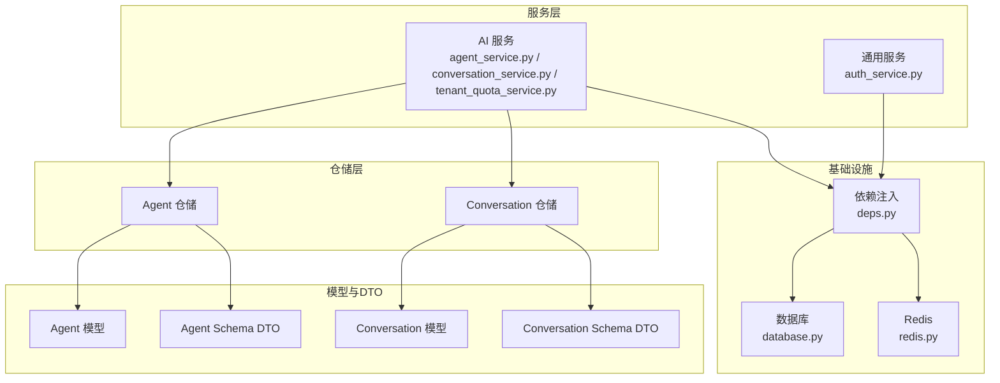
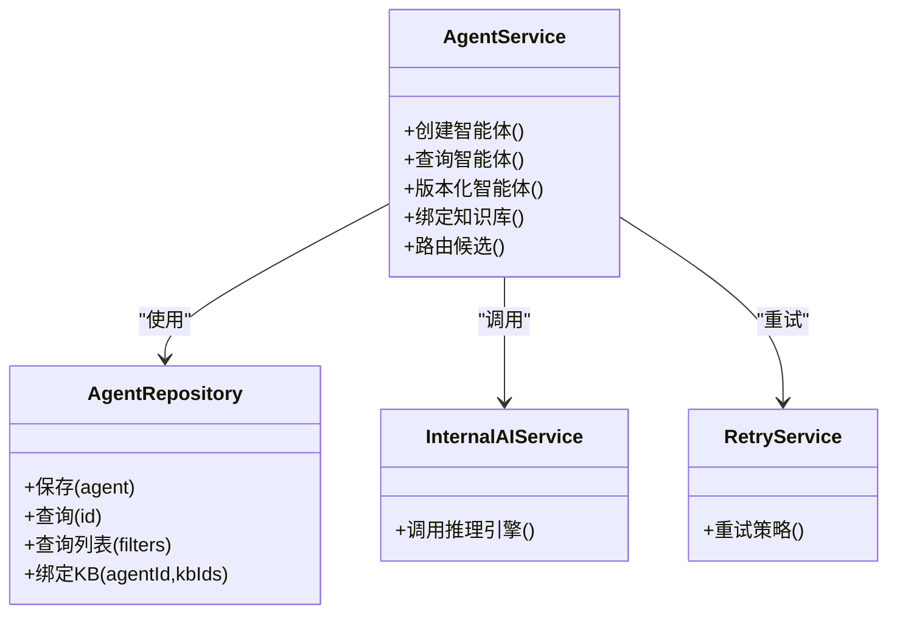
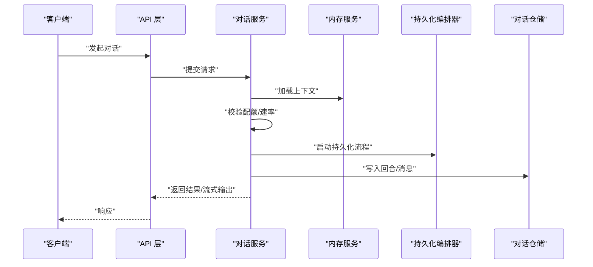
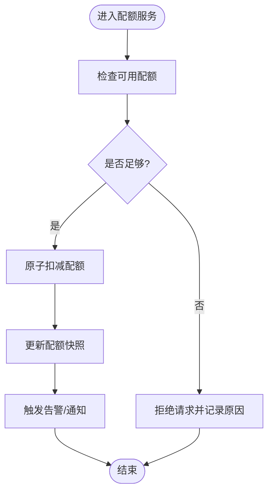
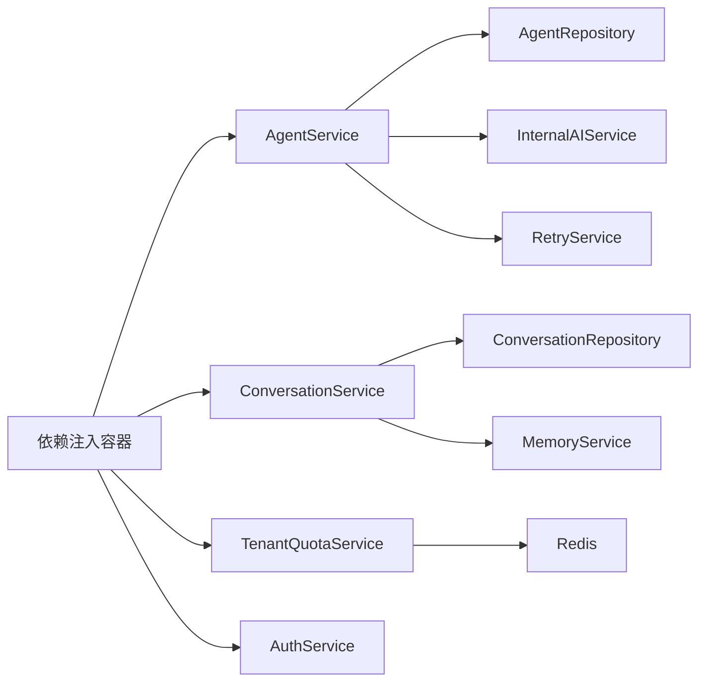

# 业务服务层

<cite>
**本文引用的文件**
- [backend/app/core/base_service.py](file://backend/app/core/base_service.py)
- [backend/app/services/ai/agent_service.py](file://backend/app/services/ai/agent_service.py)
- [backend/app/services/ai/conversation_service.py](file://backend/app/services/ai/conversation_service.py)
- [backend/app/services/ai/tenant_quota_service.py](file://backend/app/services/ai/tenant_quota_service.py)
- [backend/app/services/common/auth_service.py](file://backend/app/services/common/auth_service.py)
- [backend/app/ai/internal_ai_service.py](file://backend/app/ai/internal_ai_service.py)
- [backend/app/ai/retry_service.py](file://backend/app/ai/retry_service.py)
- [backend/app/core/deps.py](file://backend/app/core/deps.py)
- [backend/app/core/database.py](file://backend/app/core/database.py)
- [backend/app/core/redis.py](file://backend/app/core/redis.py)
- [backend/app/repositories/ai/agent_repository.py](file://backend/app/repositories/ai/agent_repository.py)
- [backend/app/repositories/ai/conversation_repository.py](file://backend/app/repositories/ai/conversation_repository.py)
- [backend/app/models/ai/agent.py](file://backend/app/models/ai/agent.py)
- [backend/app/models/ai/conversation.py](file://backend/app/models/ai/conversation.py)
- [backend/app/schemas/ai/agent.py](file://backend/app/schemas/ai/agent.py)
- [backend/app/schemas/ai/conversation.py](file://backend/app/schemas/ai/conversation.py)
- [backend/app/enums/ai.py](file://backend/app/enums/ai.py)
- [backend/app/enums/cache.py](file://backend/app/enums/cache.py)
- [backend/app/exceptions/base.py](file://backend/app/exceptions/base.py)
- [backend/app/middleware/trace.py](file://backend/app/middleware/trace.py)
- [backend/app/middleware/prometheus_metrics.py](file://backend/app/middleware/prometheus_metrics.py)
- [backend/tests/services/ai/test_agent_service.py](file://backend/tests/services/ai/test_agent_service.py)
- [backend/tests/services/ai/test_conversation_service.py](file://backend/tests/services/ai/test_conversation_service.py)
- [backend/tests/services/common/test_auth_service.py](file://backend/tests/services/common/test_auth_service.py)
</cite>

## 目录
1. [引言](#引言)
2. [项目结构](#项目结构)
3. [核心组件](#核心组件)
4. [架构总览](#架构总览)
5. [详细组件分析](#详细组件分析)
6. [依赖关系分析](#依赖关系分析)
7. [性能考量](#性能考量)
8. [故障排查指南](#故障排查指南)
9. [结论](#结论)
10. [附录](#附录)

## 引言
本文件面向业务服务层，系统性阐述服务层架构、事务管理、服务间组合模式、依赖注入与生命周期管理、业务规则与数据校验、异常处理、性能优化与并发控制、服务与仓储层交互模式及数据传输对象（DTO）设计，并提供测试策略与最佳实践案例。目标是帮助开发者在不深入源码的前提下，快速理解并高效扩展业务服务。

## 项目结构
后端采用“按领域分层+按功能分包”的组织方式：services 存放业务服务；repositories 提供仓储实现；models/schemas 定义实体与传输模型；core 提供基础设施（依赖注入、数据库、Redis 等）。AI 领域服务以 ai 命名空间聚合，tenant/system/common 等命名空间分别覆盖租户、系统与通用能力。



图表来源
- [backend/app/services/ai/agent_service.py](file://backend/app/services/ai/agent_service.py)
- [backend/app/services/ai/conversation_service.py](file://backend/app/services/ai/conversation_service.py)
- [backend/app/services/ai/tenant_quota_service.py](file://backend/app/services/ai/tenant_quota_service.py)
- [backend/app/services/common/auth_service.py](file://backend/app/services/common/auth_service.py)
- [backend/app/core/deps.py](file://backend/app/core/deps.py)
- [backend/app/core/database.py](file://backend/app/core/database.py)
- [backend/app/core/redis.py](file://backend/app/core/redis.py)
- [backend/app/repositories/ai/agent_repository.py](file://backend/app/repositories/ai/agent_repository.py)
- [backend/app/repositories/ai/conversation_repository.py](file://backend/app/repositories/ai/conversation_repository.py)
- [backend/app/models/ai/agent.py](file://backend/app/models/ai/agent.py)
- [backend/app/models/ai/conversation.py](file://backend/app/models/ai/conversation.py)
- [backend/app/schemas/ai/agent.py](file://backend/app/schemas/ai/agent.py)
- [backend/app/schemas/ai/conversation.py](file://backend/app/schemas/ai/conversation.py)

章节来源
- [backend/app/services/ai/agent_service.py](file://backend/app/services/ai/agent_service.py)
- [backend/app/services/ai/conversation_service.py](file://backend/app/services/ai/conversation_service.py)
- [backend/app/services/ai/tenant_quota_service.py](file://backend/app/services/ai/tenant_quota_service.py)
- [backend/app/services/common/auth_service.py](file://backend/app/services/common/auth_service.py)
- [backend/app/core/deps.py](file://backend/app/core/deps.py)
- [backend/app/core/database.py](file://backend/app/core/database.py)
- [backend/app/core/redis.py](file://backend/app/core/redis.py)

## 核心组件
- 基础设施与依赖注入
  - 依赖注入容器与工厂：通过依赖注入模块集中管理服务实例与外部资源（数据库连接、Redis 连接等），确保服务解耦与可替换性。
  - 数据库与事务：数据库会话管理与事务边界由基础设施统一提供，服务层在方法粒度声明事务语义。
  - 缓存：Redis 统一接入，支持读写分离与失效策略。
- 业务服务
  - AI 领域服务：Agent、对话、配额、租户限额、运行时诊断等服务，负责编排仓储与跨域协作。
  - 通用服务：认证服务等横切能力。
- 仓储层
  - 聚合查询与持久化：面向模型的仓储封装，屏蔽 SQL 细节，暴露领域语义操作。
- 模型与 DTO
  - 模型：映射数据库表结构，承载状态与约束。
  - DTO：用于接口层与服务层之间的数据传输，保证契约稳定与序列化安全。

章节来源
- [backend/app/core/base_service.py](file://backend/app/core/base_service.py)
- [backend/app/core/deps.py](file://backend/app/core/deps.py)
- [backend/app/core/database.py](file://backend/app/core/database.py)
- [backend/app/core/redis.py](file://backend/app/core/redis.py)

## 架构总览
服务层遵循“职责单一、组合编排、事务边界清晰”的原则。服务之间通过依赖注入进行装配，避免硬编码耦合；对外通过 DTO 传递数据，对内通过仓储访问模型；异常与监控贯穿全链路。

```mermaid
graph TB
Client["客户端/调用方"] --> API["API 层"]
API --> SVC["业务服务层"]
SVC --> REPO["仓储层"]
REPO --> DB["数据库"]
SVC --> CACHE["缓存层"]
SVC --> EXT["外部网关/工具"]
SVC --> LOG["日志/追踪"]
SVC --> METRICS["指标采集"]
classDef svc fill:#fff,stroke:#333,stroke-width:1px
SVC class svc
```

图表来源
- [backend/app/services/ai/agent_service.py](file://backend/app/services/ai/agent_service.py)
- [backend/app/services/ai/conversation_service.py](file://backend/app/services/ai/conversation_service.py)
- [backend/app/services/ai/tenant_quota_service.py](file://backend/app/services/ai/tenant_quota_service.py)
- [backend/app/services/common/auth_service.py](file://backend/app/services/common/auth_service.py)
- [backend/app/core/deps.py](file://backend/app/core/deps.py)
- [backend/app/core/database.py](file://backend/app/core/database.py)
- [backend/app/core/redis.py](file://backend/app/core/redis.py)

## 详细组件分析

### Agent 服务（AI 领域）
- 角色与职责
  - 负责智能体的创建、查询、版本化、可见性与访问控制等业务编排。
  - 协调知识库绑定、路由策略、内存与信任策略等子服务。
- 事务与并发
  - 关键写入操作在单事务中完成，失败回滚；并发冲突通过唯一约束与重试策略处理。
- 依赖注入与生命周期
  - 通过依赖注入容器注入仓储、缓存、内部 AI 服务与重试器；服务实例按请求/会话生命周期管理。
- 与仓储交互
  - 使用 Agent 仓储执行 CRUD 与复杂查询；返回模型或投影 DTO。
- 业务规则与校验
  - 输入参数校验、可见性范围校验、访问授权校验、版本一致性校验。
- 异常处理
  - 包装领域异常为统一错误码与消息；记录追踪 ID 便于定位。



图表来源
- [backend/app/services/ai/agent_service.py](file://backend/app/services/ai/agent_service.py)
- [backend/app/repositories/ai/agent_repository.py](file://backend/app/repositories/ai/agent_repository.py)
- [backend/app/ai/internal_ai_service.py](file://backend/app/ai/internal_ai_service.py)
- [backend/app/ai/retry_service.py](file://backend/app/ai/retry_service.py)

章节来源
- [backend/app/services/ai/agent_service.py](file://backend/app/services/ai/agent_service.py)
- [backend/app/repositories/ai/agent_repository.py](file://backend/app/repositories/ai/agent_repository.py)
- [backend/app/ai/internal_ai_service.py](file://backend/app/ai/internal_ai_service.py)
- [backend/app/ai/retry_service.py](file://backend/app/ai/retry_service.py)

### 对话服务（AI 领域）
- 角色与职责
  - 负责对话回合的生成、持久化、流式输出与统计分析。
  - 协调内存、上下文、输出解析与持久化编排。
- 事务与并发
  - 回合写入与计费在事务中完成；并发写入通过乐观锁与幂等键保障。
- 依赖注入与生命周期
  - 注入对话仓储、内存服务、持久化编排器、指标中间件等。
- 与仓储交互
  - 使用对话仓储与消息仓储进行读写；返回投影 DTO 与只读视图。
- 业务规则与校验
  - 输入负载清洗、交互模式校验、配额与速率限制检查、输出格式校验。
- 异常处理
  - 将底层异常归一化，携带追踪 ID 与建议重试策略。



图表来源
- [backend/app/services/ai/conversation_service.py](file://backend/app/services/ai/conversation_service.py)
- [backend/app/services/ai/session_memory_service.py](file://backend/app/services/ai/session_memory_service.py)
- [backend/app/services/ai/conversation_message_persistence_service.py](file://backend/app/services/ai/conversation_message_persistence_service.py)
- [backend/app/repositories/ai/conversation_repository.py](file://backend/app/repositories/ai/conversation_repository.py)

章节来源
- [backend/app/services/ai/conversation_service.py](file://backend/app/services/ai/conversation_service.py)
- [backend/app/repositories/ai/conversation_repository.py](file://backend/app/repositories/ai/conversation_repository.py)

### 租户配额服务（AI 领域）
- 角色与职责
  - 负责租户级 AI 使用配额的查询、扣减、恢复与告警。
- 事务与并发
  - 扣减与恢复在原子事务中完成；并发冲突通过分布式锁或 CAS 实现。
- 依赖注入与生命周期
  - 注入 Redis 计数器、配额仓储、通知服务。
- 与仓储交互
  - 读取配额配置与使用快照；更新配额账户与流水。
- 业务规则与校验
  - 配额类型校验、周期校验、阈值告警、跨域权限校验。
- 异常处理
  - 配额不足、过期、锁定等异常统一转换为业务错误。



图表来源
- [backend/app/services/ai/tenant_quota_service.py](file://backend/app/services/ai/tenant_quota_service.py)
- [backend/app/enums/cache.py](file://backend/app/enums/cache.py)

章节来源
- [backend/app/services/ai/tenant_quota_service.py](file://backend/app/services/ai/tenant_quota_service.py)
- [backend/app/enums/cache.py](file://backend/app/enums/cache.py)

### 认证服务（通用）
- 角色与职责
  - 负责用户认证、会话管理、权限校验与令牌签发。
- 事务与并发
  - 登录/登出在事务中完成；并发登录通过令牌刷新与黑名单机制控制。
- 依赖注入与生命周期
  - 注入鉴权仓储、令牌服务、审计中间件。
- 与仓储交互
  - 用户信息、角色与权限、登录日志等。
- 业务规则与校验
  - 密码强度、验证码、多因子、租户域校验。
- 异常处理
  - 账号锁定、密码错误、令牌无效等统一处理。

章节来源
- [backend/app/services/common/auth_service.py](file://backend/app/services/common/auth_service.py)

## 依赖关系分析
- 服务到仓储
  - 服务通过仓储接口访问模型，避免直接依赖 ORM 明细。
- 服务到服务
  - 通过依赖注入装配；避免循环依赖，必要时引入门面或异步编排。
- 外部依赖
  - 内部 AI 推理服务、重试器、缓存、指标与追踪中间件。
- 依赖注入与生命周期
  - 在依赖注入容器中注册服务与仓储，按请求/会话作用域管理；避免长生命周期持有短生命周期资源。



图表来源
- [backend/app/core/deps.py](file://backend/app/core/deps.py)
- [backend/app/services/ai/agent_service.py](file://backend/app/services/ai/agent_service.py)
- [backend/app/services/ai/conversation_service.py](file://backend/app/services/ai/conversation_service.py)
- [backend/app/services/ai/tenant_quota_service.py](file://backend/app/services/ai/tenant_quota_service.py)
- [backend/app/services/common/auth_service.py](file://backend/app/services/common/auth_service.py)
- [backend/app/ai/internal_ai_service.py](file://backend/app/ai/internal_ai_service.py)
- [backend/app/ai/retry_service.py](file://backend/app/ai/retry_service.py)
- [backend/app/core/redis.py](file://backend/app/core/redis.py)

章节来源
- [backend/app/core/deps.py](file://backend/app/core/deps.py)

## 性能考量
- 事务管理
  - 将高冲突写入合并为批量事务，减少锁竞争；长事务拆分为多个短事务。
- 并发控制
  - 对易冲突字段使用乐观锁或 CAS；对热点资源使用本地缓存与延迟双删。
- 缓存策略
  - 读多写少场景使用强一致缓存（写后失效）；写多读少使用最终一致缓存（定期刷新）。
- 指标与追踪
  - 通过中间件埋点关键路径耗时与错误率；结合追踪 ID 快速定位瓶颈。
- 重试与降级
  - 对瞬时故障启用指数退避重试；对外部依赖设置超时与熔断降级。

章节来源
- [backend/app/middleware/prometheus_metrics.py](file://backend/app/middleware/prometheus_metrics.py)
- [backend/app/middleware/trace.py](file://backend/app/middleware/trace.py)
- [backend/app/ai/retry_service.py](file://backend/app/ai/retry_service.py)
- [backend/app/core/redis.py](file://backend/app/core/redis.py)

## 故障排查指南
- 常见问题
  - 事务死锁：检查锁顺序与事务时长，必要时调整索引与加锁策略。
  - 缓存穿透：对空结果设置短 TTL；对热点数据预热。
  - 缓存雪崩：随机化 TTL；使用互斥锁避免同时重建。
  - 配额异常：核对配额账户与流水，检查并发扣减逻辑。
- 定位手段
  - 查看追踪 ID 与日志上下文；结合指标面板定位异常时段。
  - 使用单元测试与集成测试复现问题；编写最小化回归用例。

章节来源
- [backend/app/exceptions/base.py](file://backend/app/exceptions/base.py)
- [backend/app/middleware/trace.py](file://backend/app/middleware/trace.py)
- [backend/app/middleware/prometheus_metrics.py](file://backend/app/middleware/prometheus_metrics.py)

## 结论
业务服务层通过清晰的职责划分、严格的事务边界、完善的依赖注入与生命周期管理，实现了高内聚低耦合的架构。配合仓储层与 DTO 的契约设计、统一的异常与监控体系，以及缓存与并发控制策略，能够支撑复杂 AI 场景下的高性能与高可靠性。

## 附录

### 服务与仓储交互模式
- 读模型：仓储返回只读投影 DTO，服务进行聚合与裁剪。
- 写模型：服务组装命令对象，仓储执行持久化，返回结果 DTO。
- 事件驱动：对不可逆写入采用异步事件编排，降低主流程阻塞。

章节来源
- [backend/app/repositories/ai/agent_repository.py](file://backend/app/repositories/ai/agent_repository.py)
- [backend/app/repositories/ai/conversation_repository.py](file://backend/app/repositories/ai/conversation_repository.py)
- [backend/app/models/ai/agent.py](file://backend/app/models/ai/agent.py)
- [backend/app/models/ai/conversation.py](file://backend/app/models/ai/conversation.py)
- [backend/app/schemas/ai/agent.py](file://backend/app/schemas/ai/agent.py)
- [backend/app/schemas/ai/conversation.py](file://backend/app/schemas/ai/conversation.py)

### 测试策略与示例
- 单元测试
  - 使用模拟仓储与缓存，验证服务方法的输入输出与异常分支。
  - 示例参考：[test_agent_service.py](file://backend/tests/services/ai/test_agent_service.py)、[test_conversation_service.py](file://backend/tests/services/ai/test_conversation_service.py)、[test_auth_service.py](file://backend/tests/services/common/test_auth_service.py)
- 集成测试
  - 搭建最小化数据库与 Redis 环境，验证服务与仓储的协同行为。
  - 关注事务边界、并发冲突与缓存一致性。
- 行为驱动
  - 以业务场景为用例，覆盖正常路径、异常路径与边界条件。

章节来源
- [backend/tests/services/ai/test_agent_service.py](file://backend/tests/services/ai/test_agent_service.py)
- [backend/tests/services/ai/test_conversation_service.py](file://backend/tests/services/ai/test_conversation_service.py)
- [backend/tests/services/common/test_auth_service.py](file://backend/tests/services/common/test_auth_service.py)