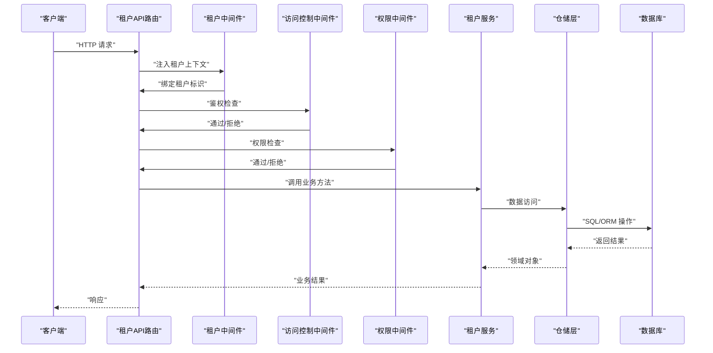
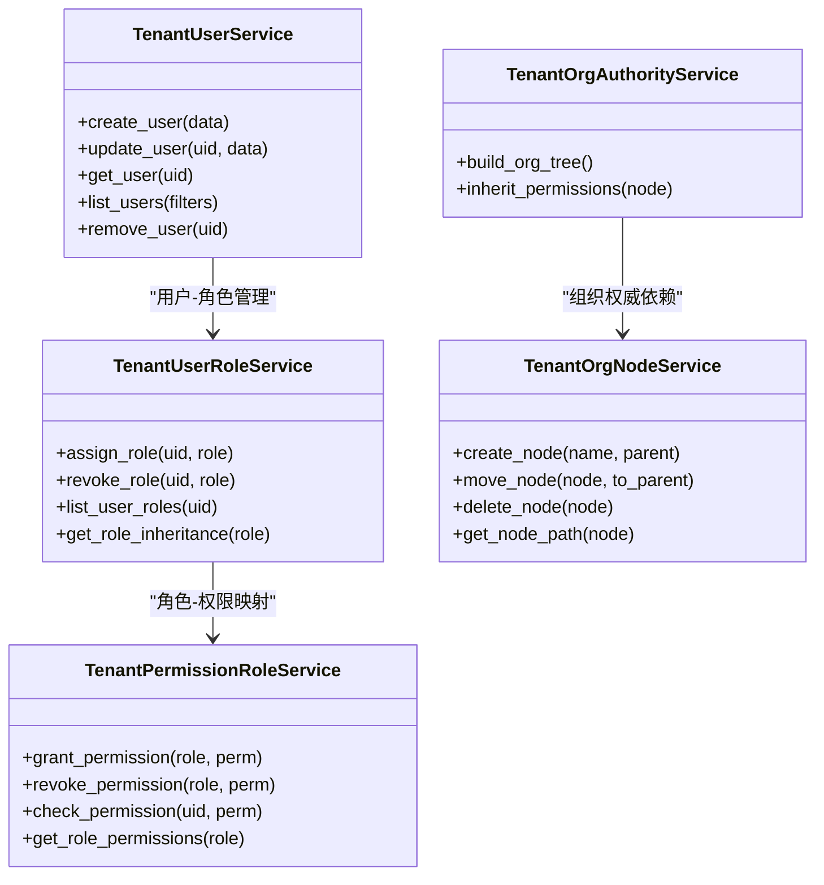
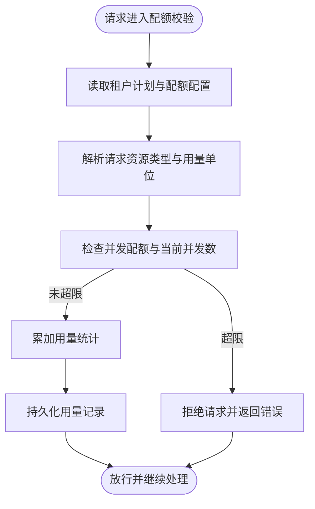
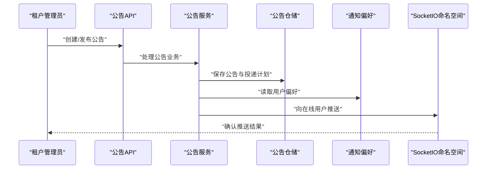
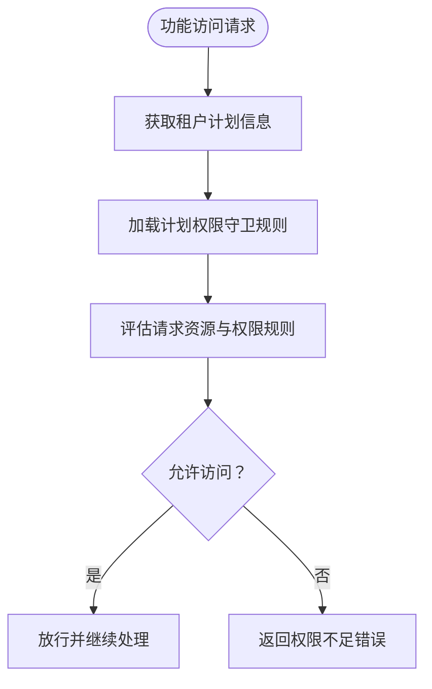
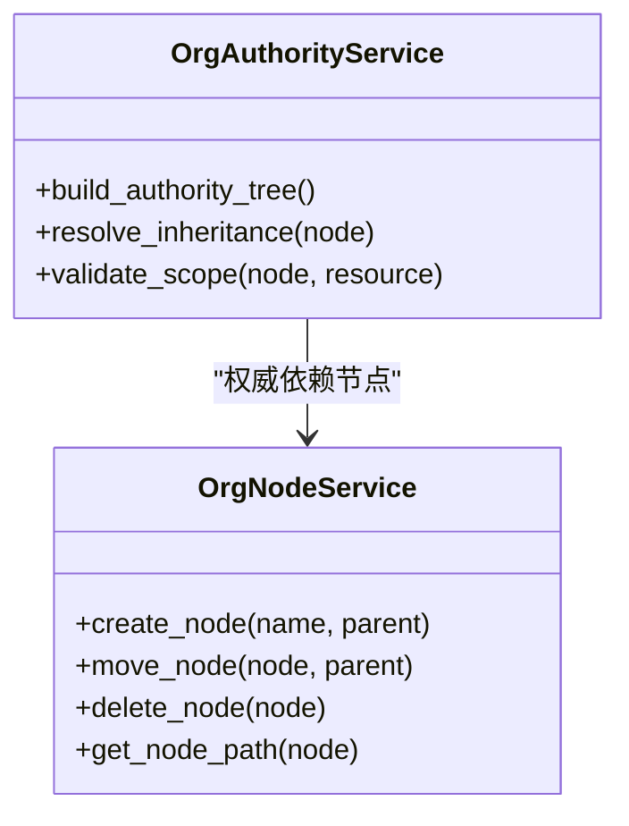
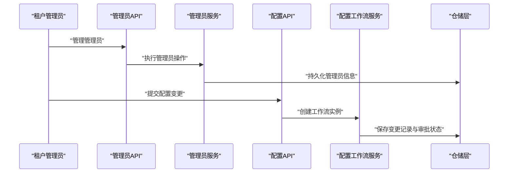
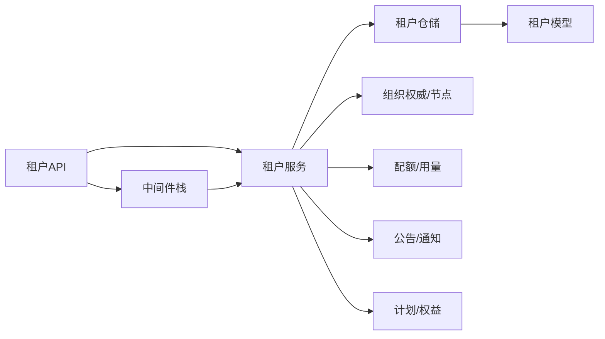

# 租户业务服务

<cite>

**本文引用的文件**
- [backend/app/services/tenant/tenant_user_service.py](file://backend/app/services/tenant/tenant_user_service.py)
- [backend/app/services/tenant/tenant_user_role_service.py](file://backend/app/services/tenant/tenant_user_role_service.py)
- [backend/app/services/tenant/tenant_permission_role_service.py](file://backend/app/services/tenant/tenant_permission_role_service.py)
- [backend/app/services/tenant/quota_service.py](file://backend/app/services/tenant/quota_service.py)
- [backend/app/services/tenant/announcement_service.py](file://backend/app/services/tenant/announcement_service.py)
- [backend/app/services/tenant/tenant_plan_service.py](file://backend/app/services/tenant/tenant_plan_service.py)
- [backend/app/services/tenant/plan_permission_guard.py](file://backend/app/services/tenant/plan_permission_guard.py)
- [backend/app/services/tenant/tenant_org_authority_service.py](file://backend/app/services/tenant/tenant_org_authority_service.py)
- [backend/app/services/tenant/tenant_org_node_service.py](file://backend/app/services/tenant/tenant_org_node_service.py)
- [backend/app/services/tenant/tenant_admin_service.py](file://backend/app/services/tenant/tenant_admin_service.py)
- [backend/app/services/tenant/tenant_config_workflow_service.py](file://backend/app/services/tenant/tenant_config_workflow_service.py)
- [backend/app/services/tenant/tenant_plan_plugin_entitlement_service.py](file://backend/app/services/tenant/tenant_plan_plugin_entitlement_service.py)
- [backend/app/repositories/tenant/tenant_user_repository.py](file://backend/app/repositories/tenant/tenant_user_repository.py)
- [backend/app/repositories/tenant/tenant_permission_role_repository.py](file://backend/app/repositories/tenant/tenant_permission_role_repository.py)
- [backend/app/repositories/tenant/announcement_repository.py](file://backend/app/repositories/tenant/announcement_repository.py)
- [backend/app/repositories/tenant/tenant_plan_repository.py](file://backend/app/repositories/tenant/tenant_plan_repository.py)
- [backend/app/repositories/tenant/tenant_org_node_repository.py](file://backend/app/repositories/tenant/tenant_org_node_repository.py)
- [backend/app/models/tenant/tenant.py](file://backend/app/models/tenant/tenant.py)
- [backend/app/models/tenant/tenant_user.py](file://backend/app/models/tenant/tenant_user.py)
- [backend/app/models/tenant/announcement.py](file://backend/app/models/tenant/announcement.py)
- [backend/app/models/tenant/tenant_plan.py](file://backend/app/models/tenant/tenant_plan.py)
- [backend/app/middleware/tenant.py](file://backend/app/middleware/tenant.py)
- [backend/app/api/tenant/users.py](file://backend/app/api/tenant/users.py)
- [backend/app/api/tenant/permission_roles.py](file://backend/app/api/tenant/permission_roles.py)
- [backend/app/api/tenant/announcements.py](file://backend/app/api/tenant/announcements.py)
- [backend/app/api/tenant/ai_quotas.py](file://backend/app/api/tenant/ai_quotas.py)
- [backend/app/api/tenant/organization.py](file://backend/app/api/tenant/organization.py)
- [backend/app/api/tenant/domains.py](file://backend/app/api/tenant/domains.py)
- [backend/app/api/tenant/admins.py](file://backend/app/api/tenant/admins.py)
- [backend/app/api/tenant/configs.py](file://backend/app/api/tenant/configs.py)
- [backend/app/api/tenant/plugins.py](file://backend/app/api/tenant/plugins.py)
- [backend/app/api/tenant/operation_logs.py](file://backend/app/api/tenant/operation_logs.py)
- [backend/app/api/tenant/notification_preferences.py](file://backend/app/api/tenant/notification_preferences.py)
- [backend/app/api/tenant/notifications.py](file://backend/app/api/tenant/notifications.py)
- [backend/app/api/tenant/analytics.py](file://backend/app/api/tenant/analytics.py)
- [backend/app/api/tenant/dashboard.py](file://backend/app/api/tenant/dashboard.py)
- [backend/app/api/tenant/conversations.py](file://backend/app/api/tenant/conversations.py)
- [backend/app/api/tenant/knowledge_bases.py](file://backend/app/api/tenant/knowledge_bases.py)
- [backend/app/api/tenant/agents.py](file://backend/app/api/tenant/agents.py)
- [backend/app/api/tenant/ai_call_logs.py](file://backend/app/api/tenant/ai_call_logs.py)
- [backend/app/api/tenant/ai_usage.py](file://backend/app/api/tenant/ai_usage.py)
- [backend/app/api/tenant/execution_decisions.py](file://backend/app/api/tenant/execution_decisions.py)
- [backend/app/api/tenant/preferences.py](file://backend/app/api/tenant/preferences.py)
- [backend/app/api/tenant/user_roles.py](file://backend/app/api/tenant/user_roles.py)
- [backend/app/api/tenant/ws.py](file://backend/app/api/tenant/ws.py)
- [backend/app/api/tenant/plain_text_input_ai.py](file://backend/app/api/tenant/plain_text_input_ai.py)
- [backend/app/api/tenant/ai_config.py](file://backend/app/api/tenant/ai_config.py)
- [backend/app/api/tenant/ai_gateway.py](file://backend/app/api/tenant/ai_gateway.py)
- [backend/app/api/tenant/ai_writing.py](file://backend/app/api/tenant/ai_writing.py)
- [backend/app/api/tenant/agent_assignments.py](file://backend/app/api/tenant/agent_assignments.py)
- [backend/app/api/tenant/agent_chat.py](file://backend/app/api/tenant/agent_chat.py)
- [backend/app/api/tenant/_agent_batch.py](file://backend/app/api/tenant/_agent_batch.py)
- [backend/app/api/tenant/_agent_kbs.py](file://backend/app/api/tenant/_agent_kbs.py)
- [backend/app/api/tenant/_agent_skills.py](file://backend/app/api/tenant/_agent_skills.py)
- [backend/app/api/tenant/_agent_version.py](file://backend/app/api/tenant/_agent_version.py)
- [backend/app/middleware/access_control.py](file://backend/app/middleware/access_control.py)
- [backend/app/middleware/permission.py](file://backend/app/middleware/permission.py)
- [backend/app/middleware/prometheus_metrics.py](file://backend/app/middleware/prometheus_metrics.py)
- [backend/app/middleware/audit_log.py](file://backend/app/middleware/audit_log.py)
- [backend/app/core/security.py](file://backend/app/core/security.py)
- [backend/app/core/scope.py](file://backend/app/core/scope.py)
- [backend/app/core/org_authority.py](file://backend/app/core/org_authority.py)
- [backend/app/enums/rbac.py](file://backend/app/enums/rbac.py)
- [backend/app/enums/domain.py](file://backend/app/enums/domain.py)
- [backend/app/enums/billing.py](file://backend/app/enums/billing.py)
- [backend/app/enums/common.py](file://backend/app/enums/common.py)
- [backend/app/enums/error_code.py](file://backend/app/enums/error_code.py)
- [backend/app/tasks/scheduler.py](file://backend/app/tasks/scheduler.py)
- [backend/app/tasks/periodic_tasks.py](file://backend/app/tasks/periodic_tasks.py)
- [backend/app/sio/tenant_ns.py](file://backend/app/sio/tenant_ns.py)
- [backend/app/sio/user_ns.py](file://backend/app/sio/user_ns.py)
- [backend/app/sio/admin_ns.py](file://backend/app/sio/admin_ns.py)
- [backend/app/sio/ws_config.py](file://backend/app/sio/ws_config.py)
- [backend/app/sio/notification_seeds.py](file://backend/app/sio/notification_seeds.py)
- [backend/app/sio/presence.py](file://backend/app/sio/presence.py)
- [backend/app/sio/socket_trace.py](file://backend/app/sio/socket_trace.py)
- [backend/app/sio/error_utils.py](file://backend/app/sio/error_utils.py)
- [backend/app/storage/manager.py](file://backend/app/storage/manager.py)
- [backend/app/storage/base.py](file://backend/app/storage/base.py)
- [backend/app/storage/drivers/](file://backend/app/storage/drivers/)
- [backend/app/captcha/service.py](file://backend/app/captcha/service.py)
- [backend/app/captcha/provider.py](file://backend/app/captcha/provider.py)
- [backend/app/captcha/registry.py](file://backend/app/captcha/registry.py)
- [backend/app/captcha/runtime.py](file://backend/app/captcha/runtime.py)
- [backend/app/codegen/generator.py](file://backend/app/codegen/generator.py)
- [backend/app/codegen/templates/](file://backend/app/codegen/templates/)
- [backend/app/codegen/manifest.py](file://backend/app/codegen/manifest.py)
- [backend/app/codegen/options.py](file://backend/app/codegen/options.py)
- [backend/app/codegen/constants.py](file://backend/app/codegen/constants.py)
- [backend/app/codegen/db_introspector.py](file://backend/app/codegen/db_introspector.py)
- [backend/app/codegen/file_writer.py](file://backend/app/codegen/file_writer.py)
- [backend/app/codegen/auto_fix.py](file://backend/app/codegen/auto_fix.py)
- [backend/app/codegen/config_parser.py](file://backend/app/codegen/config_parser.py)
- [backend/app/codegen/generator_context_builder.py](file://backend/app/codegen/generator_context_builder.py)
- [backend/app/codegen/generator_output_assembler.py](file://backend/app/codegen/generator_output_assembler.py)
- [backend/app/codegen/generator_support.py](file://backend/app/codegen/generator_support.py)
- [backend/app/codegen/generator_types.py](file://backend/app/codegen/generator_types.py)
- [backend/app/codegen/migration_helper.py](file://backend/app/codegen/migration_helper.py)
- [backend/app/codegen/preset_loader.py](file://backend/app/codegen/preset_loader.py)
- [backend/app/codegen/rollback.py](file://backend/app/codegen/rollback.py)
- [backend/app/codegen/type_registry.py](file://backend/app/codegen/type_registry.py)
- [backend/app/codegen/zip_exporter.py](file://backend/app/codegen/zip_exporter.py)
- [backend/app/cli_commands/entrypoint.py](file://backend/app/cli_commands/entrypoint.py)
- [backend/app/cli_commands/state.py](file://backend/app/cli_commands/state.py)
- [backend/app/cli_commands/trace_commands.py](file://backend/app/cli_commands/trace_commands.py)
- [backend/app/cli_commands/health_commands.py](file://backend/app/cli_commands/health_commands.py)
- [backend/app/cli_commands/ai_commands.py](file://backend/app/cli_commands/ai_commands.py)
- [backend/app/cli_commands/ai_norm.py](file://backend/app/cli_commands/ai_norm.py)
- [backend/app/cli_commands/ai_render.py](file://backend/app/cli_commands/ai_render.py)
- [backend/app/cli_commands/ai_snapshot.py](file://backend/app/cli_commands/ai_snapshot.py)
- [backend/app/cli_commands/core_commands.py](file://backend/app/cli_commands/core_commands.py)
- [backend/app/cli_commands/codegen_core.py](file://backend/app/cli_commands/codegen_core.py)
- [backend/app/cli_commands/codegen_manage.py](file://backend/app/cli_commands/codegen_manage.py)
- [backend/app/main.py](file://backend/app/main.py)
- [backend/app/core/database.py](file://backend/app/core/database.py)
- [backend/app/core/redis.py](file://backend/app/core/redis.py)
- [backend/app/core/logging.py](file://backend/app/core/logging.py)
- [backend/app/core/response.py](file://backend/app/core/response.py)
- [backend/app/core/cors.py](file://backend/app/core/cors.py)
- [backend/app/core/i18n.py](file://backend/app/core/i18n.py)
- [backend/app/core/rate_limit.py](file://backend/app/core/rate_limit.py)
- [backend/app/core/deletion.py](file://backend/app/core/deletion.py)
- [backend/app/core/recycle_bin.py](file://backend/app/core/recycle_bin.py)
- [backend/app/core/runtime_identity.py](file://backend/app/core/runtime_identity.py)
- [backend/app/core/identity.py](file://backend/app/core/identity.py)
- [backend/app/core/query_parser.py](file://backend/app/core/query_parser.py)
- [backend/app/core/csv_export.py](file://backend/app/core/csv_export.py)
- [backend/app/core/data_permission.py](file://backend/app/core/data_permission.py)
- [backend/app/core/github_source_policy.py](file://backend/app/core/github_source_policy.py)
- [backend/app/core/hosts_helper.py](file://backend/app/core/hosts_helper.py)
- [backend/app/core/sse.py](file://backend/app/core/sse.py)
- [backend/app/core/sio_bridge.py](file://backend/app/core/sio_bridge.py)
- [backend/app/core/socketio_server.py](file://backend/app/core/socketio_server.py)
- [backend/app/core/base_service.py](file://backend/app/core/base_service.py)
- [backend/app/core/base_repository.py](file://backend/app/core/base_repository.py)
- [backend/app/core/base_model.py](file://backend/app/core/base_model.py)
- [backend/app/core/base_controller.py](file://backend/app/core/base_controller.py)
- [backend/app/core/base_schema.py](file://backend/app/core/base_schema.py)
- [backend/app/core/config.py](file://backend/app/core/config.py)
- [backend/app/core/dependency_checker.py](file://backend/app/core/dependency_checker.py)
- [backend/app/core/trace.py](file://backend/app/core/trace.py)
- [backend/app/core/identity_snapshot.py](file://backend/app/core/identity_snapshot.py)
- [backend/app/core/usage_recorder_core.py](file://backend/app/core/usage_recorder_core.py)
- [backend/app/core/usage_recorder_context.py](file://backend/app/core/usage_recorder_context.py)
- [backend/app/core/usage_recorder_support.py](file://backend/app/core/usage_recorder_support.py)
- [backend/app/core/usage_mode.py](file://backend/app/core/usage_mode.py)
- [backend/app/core/text_semantics.py](file://backend/app/core/text_semantics.py)
- [backend/app/core/text_semantics_json.py](file://backend/app/core/text_semantics_json.py)
- [backend/app/core/text_semantics_terms.py](file://backend/app/core/text_semantics_terms.py)
- [backend/app/core/text_semantics_tokens.py](file://backend/app/core/text_semantics_tokens.py)
- [backend/app/core/text_semantics_urls.py](file://backend/app/core/text_semantics_urls.py)
- [backend/app/core/json_safe.py](file://backend/app/core/json_safe.py)
- [backend/app/core/memory_policy.py](file://backend/app/core/memory_policy.py)
- [backend/app/core/page_locale.py](file://backend/app/core/page_locale.py)
- [backend/app/core/types.py](file://backend/app/core/types.py)
- [backend/app/core/constants.py](file://backend/app/core/constants.py)
- [backend/app/core/exceptions.py](file://backend/app/core/exceptions.py)
- [backend/app/core/failover.py](file://backend/app/core/failover.py)
- [backend/app/core/gateway.py](file://backend/app/core/gateway.py)
- [backend/app/core/internal_ai_service.py](file://backend/app/core/internal_ai_service.py)
- [backend/app/core/retry_service.py](file://backend/app/core/retry_service.py)
</cite>

## 目录
1. [引言](#引言)
2. [项目结构](#项目结构)
3. [核心组件](#核心组件)
4. [架构总览](#架构总览)
5. [详细组件分析](#详细组件分析)
6. [依赖关系分析](#依赖关系分析)
7. [性能考虑](#性能考虑)
8. [故障排查指南](#故障排查指南)
9. [结论](#结论)
10. [附录](#附录)

## 引言
本技术文档面向租户业务服务，系统化阐述多租户架构下的业务服务设计与实现，覆盖租户管理、用户与权限、配额与用量、公告管理等核心能力；并深入解析租户隔离机制、权限继承与资源分配策略，以及租户生命周期管理、角色与计划权限控制、数据安全与访问控制、配置与监控告警、故障处理与扩展开发等主题。文档以仓库中的实际代码为依据，结合接口层、服务层、仓储层与中间件、任务调度、实时通信等模块，形成从高层到细节的完整说明。

## 项目结构
后端采用分层架构：接口层（API）负责对外暴露REST/WS端点；服务层封装业务逻辑；仓储层负责数据持久化；中间件提供横切能力（鉴权、审计、指标、速率限制等）；任务调度与SocketIO提供异步与实时能力；存储抽象屏蔽底层驱动差异；代码生成与CLI命令支撑平台运维与扩展。

```mermaid
graph TB
subgraph "接口层(API)"
A_users["用户相关路由<br/>users.py"]
A_perms["权限与角色路由<br/>permission_roles.py, user_roles.py"]
A_ann["公告路由<br/>announcements.py"]
A_quota["配额路由<br/>ai_quotas.py"]
A_org["组织路由<br/>organization.py"]
A_cfg["配置路由<br/>configs.py"]
A_dom["域名路由<br/>domains.py"]
A_admin["管理员路由<br/>admins.py"]
A_ws["WebSocket路由<br/>ws.py"]
end
subgraph "服务层(Tenant)"
S_user["租户用户服务<br/>tenant_user_service.py"]
S_role["租户角色服务<br/>tenant_user_role_service.py"]
S_perm["权限角色服务<br/>tenant_permission_role_service.py"]
S_quota["配额服务<br/>quota_service.py"]
S_ann["公告服务<br/>announcement_service.py"]
S_plan["租户计划服务<br/>tenant_plan_service.py"]
S_guard["计划权限守卫<br/>plan_permission_guard.py"]
S_org["组织权威服务<br/>tenant_org_authority_service.py"]
S_node["组织节点服务<br/>tenant_org_node_service.py"]
S_admin["租户管理员服务<br/>tenant_admin_service.py"]
S_cfgwf["配置工作流服务<br/>tenant_config_workflow_service.py"]
S_ent["插件权益服务<br/>tenant_plan_plugin_entitlement_service.py"]
end
subgraph "仓储层"
R_user["租户用户仓储<br/>tenant_user_repository.py"]
R_perm["权限角色仓储<br/>tenant_permission_role_repository.py"]
R_ann["公告仓储<br/>announcement_repository.py"]
R_plan["租户计划仓储<br/>tenant_plan_repository.py"]
R_node["组织节点仓储<br/>tenant_org_node_repository.py"]
end
subgraph "模型层"
M_tenant["租户模型<br/>tenant.py"]
M_user["租户用户模型<br/>tenant_user.py"]
M_ann["公告模型<br/>announcement.py"]
M_plan["租户计划模型<br/>tenant_plan.py"]
end
subgraph "中间件与基础设施"
MW_tenant["租户中间件<br/>tenant.py"]
MW_ac["访问控制中间件<br/>access_control.py"]
MW_perm["权限中间件<br/>permission.py"]
MW_prom["Prometheus指标<br/>prometheus_metrics.py"]
MW_audit["审计日志<br/>audit_log.py"]
SIO["SocketIO命名空间<br/>tenant_ns.py, user_ns.py, admin_ns.py"]
Task["定时任务<br/>scheduler.py, periodic_tasks.py"]
end
A_users --> S_user
A_perms --> S_role
A_perms --> S_perm
A_quota --> S_quota
A_ann --> S_ann
A_org --> S_org
A_org --> S_node
A_admin --> S_admin
A_cfg --> S_cfgwf
A_ws --> S_user
S_user --> R_user
S_role --> R_perm
S_perm --> R_perm
S_quota --> R_plan
S_ann --> R_ann
S_org --> R_node
S_node --> R_node
S_admin --> R_user
S_cfgwf --> R_plan
R_user --> M_user
R_perm --> M_user
R_ann --> M_ann
R_plan --> M_plan
R_node --> M_user
MW_tenant --> A_users
MW_tenant --> A_perms
MW_tenant --> A_quota
MW_tenant --> A_ann
MW_tenant --> A_org
MW_tenant --> A_cfg
MW_tenant --> A_dom
MW_tenant --> A_admin
MW_tenant --> A_ws
SIO --> A_ws
Task --> A_users
```

图表来源
- [backend/app/api/tenant/users.py](file://backend/app/api/tenant/users.py)
- [backend/app/api/tenant/permission_roles.py](file://backend/app/api/tenant/permission_roles.py)
- [backend/app/api/tenant/announcements.py](file://backend/app/api/tenant/announcements.py)
- [backend/app/api/tenant/ai_quotas.py](file://backend/app/api/tenant/ai_quotas.py)
- [backend/app/api/tenant/organization.py](file://backend/app/api/tenant/organization.py)
- [backend/app/api/tenant/configs.py](file://backend/app/api/tenant/configs.py)
- [backend/app/api/tenant/domains.py](file://backend/app/api/tenant/domains.py)
- [backend/app/api/tenant/admins.py](file://backend/app/api/tenant/admins.py)
- [backend/app/api/tenant/ws.py](file://backend/app/api/tenant/ws.py)
- [backend/app/services/tenant/tenant_user_service.py](file://backend/app/services/tenant/tenant_user_service.py)
- [backend/app/services/tenant/tenant_user_role_service.py](file://backend/app/services/tenant/tenant_user_role_service.py)
- [backend/app/services/tenant/tenant_permission_role_service.py](file://backend/app/services/tenant/tenant_permission_role_service.py)
- [backend/app/services/tenant/quota_service.py](file://backend/app/services/tenant/quota_service.py)
- [backend/app/services/tenant/announcement_service.py](file://backend/app/services/tenant/announcement_service.py)
- [backend/app/services/tenant/tenant_org_authority_service.py](file://backend/app/services/tenant/tenant_org_authority_service.py)
- [backend/app/services/tenant/tenant_org_node_service.py](file://backend/app/services/tenant/tenant_org_node_service.py)
- [backend/app/services/tenant/tenant_admin_service.py](file://backend/app/services/tenant/tenant_admin_service.py)
- [backend/app/services/tenant/tenant_config_workflow_service.py](file://backend/app/services/tenant/tenant_config_workflow_service.py)
- [backend/app/repositories/tenant/tenant_user_repository.py](file://backend/app/repositories/tenant/tenant_user_repository.py)
- [backend/app/repositories/tenant/tenant_permission_role_repository.py](file://backend/app/repositories/tenant/tenant_permission_role_repository.py)
- [backend/app/repositories/tenant/announcement_repository.py](file://backend/app/repositories/tenant/announcement_repository.py)
- [backend/app/repositories/tenant/tenant_org_node_repository.py](file://backend/app/repositories/tenant/tenant_org_node_repository.py)
- [backend/app/models/tenant/tenant_user.py](file://backend/app/models/tenant/tenant_user.py)
- [backend/app/models/tenant/announcement.py](file://backend/app/models/tenant/announcement.py)
- [backend/app/middleware/tenant.py](file://backend/app/middleware/tenant.py)
- [backend/app/middleware/access_control.py](file://backend/app/middleware/access_control.py)
- [backend/app/middleware/permission.py](file://backend/app/middleware/permission.py)
- [backend/app/middleware/prometheus_metrics.py](file://backend/app/middleware/prometheus_metrics.py)
- [backend/app/middleware/audit_log.py](file://backend/app/middleware/audit_log.py)
- [backend/app/sio/tenant_ns.py](file://backend/app/sio/tenant_ns.py)
- [backend/app/tasks/scheduler.py](file://backend/app/tasks/scheduler.py)
- [backend/app/tasks/periodic_tasks.py](file://backend/app/tasks/periodic_tasks.py)

章节来源
- [backend/app/api/tenant/](file://backend/app/api/tenant/)
- [backend/app/services/tenant/](file://backend/app/services/tenant/)
- [backend/app/repositories/tenant/](file://backend/app/repositories/tenant/)
- [backend/app/models/tenant/](file://backend/app/models/tenant/)
- [backend/app/middleware/](file://backend/app/middleware/)
- [backend/app/sio/](file://backend/app/sio/)
- [backend/app/tasks/](file://backend/app/tasks/)

## 核心组件
- 租户用户与角色体系：围绕租户用户、角色与权限展开，支持用户在租户内的身份、角色与权限继承，以及跨层级的组织权威与节点管理。
- 配额与用量：提供租户级配额管理、用量追踪与并发控制，保障资源使用的公平与可控。
- 公告与通知：支持租户内公告发布、投递与响应统计，以及偏好设置与实时推送。
- 计划与权益：基于租户计划定义功能权限与资源上限，并通过守卫机制在运行时进行权限校验。
- 组织权威与节点：提供组织树形结构、权限继承与范围约束，确保权限与数据在组织层级上的正确传播与隔离。
- 管理员与配置工作流：支持租户管理员操作、配置变更流程与审批，保障租户配置的安全与可追溯。
- 中间件与基础设施：统一的租户上下文注入、访问控制、审计日志、指标采集与速率限制，贯穿所有租户相关接口。

章节来源
- [backend/app/services/tenant/tenant_user_service.py](file://backend/app/services/tenant/tenant_user_service.py)
- [backend/app/services/tenant/tenant_user_role_service.py](file://backend/app/services/tenant/tenant_user_role_service.py)
- [backend/app/services/tenant/tenant_permission_role_service.py](file://backend/app/services/tenant/tenant_permission_role_service.py)
- [backend/app/services/tenant/quota_service.py](file://backend/app/services/tenant/quota_service.py)
- [backend/app/services/tenant/announcement_service.py](file://backend/app/services/tenant/announcement_service.py)
- [backend/app/services/tenant/tenant_plan_service.py](file://backend/app/services/tenant/tenant_plan_service.py)
- [backend/app/services/tenant/plan_permission_guard.py](file://backend/app/services/tenant/plan_permission_guard.py)
- [backend/app/services/tenant/tenant_org_authority_service.py](file://backend/app/services/tenant/tenant_org_authority_service.py)
- [backend/app/services/tenant/tenant_org_node_service.py](file://backend/app/services/tenant/tenant_org_node_service.py)
- [backend/app/services/tenant/tenant_admin_service.py](file://backend/app/services/tenant/tenant_admin_service.py)
- [backend/app/services/tenant/tenant_config_workflow_service.py](file://backend/app/services/tenant/tenant_config_workflow_service.py)
- [backend/app/middleware/tenant.py](file://backend/app/middleware/tenant.py)
- [backend/app/middleware/access_control.py](file://backend/app/middleware/access_control.py)
- [backend/app/middleware/permission.py](file://backend/app/middleware/permission.py)
- [backend/app/middleware/audit_log.py](file://backend/app/middleware/audit_log.py)
- [backend/app/middleware/prometheus_metrics.py](file://backend/app/middleware/prometheus_metrics.py)

## 架构总览
租户业务服务遵循“接口-服务-仓储-模型”的分层设计，配合中间件与基础设施，形成完整的租户域闭环。请求经由租户中间件注入租户上下文，再由访问控制与权限中间件进行鉴权与授权，随后进入对应的服务层执行业务逻辑，最终通过仓储层持久化或查询数据。

图表来源
- [backend/app/middleware/tenant.py](file://backend/app/middleware/tenant.py)
- [backend/app/middleware/access_control.py](file://backend/app/middleware/access_control.py)
- [backend/app/middleware/permission.py](file://backend/app/middleware/permission.py)
- [backend/app/api/tenant/users.py](file://backend/app/api/tenant/users.py)
- [backend/app/services/tenant/tenant_user_service.py](file://backend/app/services/tenant/tenant_user_service.py)
- [backend/app/repositories/tenant/tenant_user_repository.py](file://backend/app/repositories/tenant/tenant_user_repository.py)

## 详细组件分析

### 租户用户与角色管理
- 用户服务：负责租户内用户注册、更新、查询、状态管理与租户成员关系维护。
- 角色服务：管理用户在租户内的角色分配与继承，支持层级角色与权限映射。
- 权限角色服务：将具体权限与角色绑定，支持按资源范围与数据权限进行过滤与校验。
- 组织权威与节点：提供组织树构建、节点移动与权限继承规则，确保权限在组织层级上的正确传播。

图表来源
- [backend/app/services/tenant/tenant_user_service.py](file://backend/app/services/tenant/tenant_user_service.py)
- [backend/app/services/tenant/tenant_user_role_service.py](file://backend/app/services/tenant/tenant_user_role_service.py)
- [backend/app/services/tenant/tenant_permission_role_service.py](file://backend/app/services/tenant/tenant_permission_role_service.py)
- [backend/app/services/tenant/tenant_org_authority_service.py](file://backend/app/services/tenant/tenant_org_authority_service.py)
- [backend/app/services/tenant/tenant_org_node_service.py](file://backend/app/services/tenant/tenant_org_node_service.py)

章节来源
- [backend/app/services/tenant/tenant_user_service.py](file://backend/app/services/tenant/tenant_user_service.py)
- [backend/app/services/tenant/tenant_user_role_service.py](file://backend/app/services/tenant/tenant_user_role_service.py)
- [backend/app/services/tenant/tenant_permission_role_service.py](file://backend/app/services/tenant/tenant_permission_role_service.py)
- [backend/app/services/tenant/tenant_org_authority_service.py](file://backend/app/services/tenant/tenant_org_authority_service.py)
- [backend/app/services/tenant/tenant_org_node_service.py](file://backend/app/services/tenant/tenant_org_node_service.py)
- [backend/app/api/tenant/users.py](file://backend/app/api/tenant/users.py)
- [backend/app/api/tenant/user_roles.py](file://backend/app/api/tenant/user_roles.py)
- [backend/app/api/tenant/permission_roles.py](file://backend/app/api/tenant/permission_roles.py)
- [backend/app/api/tenant/organization.py](file://backend/app/api/tenant/organization.py)

### 配额与用量控制
- 配额服务：提供租户配额的查询、调整与并发控制，支持按模型、时间窗口与资源类型进行限额管理。
- 用量记录：通过核心用量记录器与上下文包装，对AI调用、写入等资源使用进行细粒度统计与归档。
- 并发与限流：结合并发配额与全局限流策略，避免资源争抢与过载。

图表来源
- [backend/app/services/tenant/quota_service.py](file://backend/app/services/tenant/quota_service.py)
- [backend/app/api/tenant/ai_quotas.py](file://backend/app/api/tenant/ai_quotas.py)
- [backend/app/core/usage_recorder_core.py](file://backend/app/core/usage_recorder_core.py)
- [backend/app/core/usage_recorder_context.py](file://backend/app/core/usage_recorder_context.py)
- [backend/app/core/usage_recorder_support.py](file://backend/app/core/usage_recorder_support.py)

章节来源
- [backend/app/services/tenant/quota_service.py](file://backend/app/services/tenant/quota_service.py)
- [backend/app/api/tenant/ai_quotas.py](file://backend/app/api/tenant/ai_quotas.py)
- [backend/app/core/usage_recorder_core.py](file://backend/app/core/usage_recorder_core.py)
- [backend/app/core/usage_recorder_context.py](file://backend/app/core/usage_recorder_context.py)
- [backend/app/core/usage_recorder_support.py](file://backend/app/core/usage_recorder_support.py)

### 公告与通知管理
- 公告服务：支持公告创建、编辑、发布、投递与响应统计，提供面向租户的公告生命周期管理。
- 通知偏好与推送：支持用户通知偏好的设置与默认值，结合SocketIO命名空间实现实时推送。

图表来源
- [backend/app/services/tenant/announcement_service.py](file://backend/app/services/tenant/announcement_service.py)
- [backend/app/api/tenant/announcements.py](file://backend/app/api/tenant/announcements.py)
- [backend/app/repositories/tenant/announcement_repository.py](file://backend/app/repositories/tenant/announcement_repository.py)
- [backend/app/api/tenant/notification_preferences.py](file://backend/app/api/tenant/notification_preferences.py)
- [backend/app/sio/tenant_ns.py](file://backend/app/sio/tenant_ns.py)

章节来源
- [backend/app/services/tenant/announcement_service.py](file://backend/app/services/tenant/announcement_service.py)
- [backend/app/api/tenant/announcements.py](file://backend/app/api/tenant/announcements.py)
- [backend/app/repositories/tenant/announcement_repository.py](file://backend/app/repositories/tenant/announcement_repository.py)
- [backend/app/api/tenant/notification_preferences.py](file://backend/app/api/tenant/notification_preferences.py)
- [backend/app/sio/tenant_ns.py](file://backend/app/sio/tenant_ns.py)

### 计划权限与权益控制
- 租户计划服务：维护租户计划与资源上限，支持计划升级、降级与到期处理。
- 计划权限守卫：在运行时根据租户计划与资源配额对功能访问进行动态校验。
- 插件权益服务：基于计划定义插件市场与安装权限，控制插件的可用性与功能开关。

图表来源
- [backend/app/services/tenant/tenant_plan_service.py](file://backend/app/services/tenant/tenant_plan_service.py)
- [backend/app/services/tenant/plan_permission_guard.py](file://backend/app/services/tenant/plan_permission_guard.py)
- [backend/app/api/tenant/plugins.py](file://backend/app/api/tenant/plugins.py)
- [backend/app/services/tenant/tenant_plan_plugin_entitlement_service.py](file://backend/app/services/tenant/tenant_plan_plugin_entitlement_service.py)

章节来源
- [backend/app/services/tenant/tenant_plan_service.py](file://backend/app/services/tenant/tenant_plan_service.py)
- [backend/app/services/tenant/plan_permission_guard.py](file://backend/app/services/tenant/plan_permission_guard.py)
- [backend/app/api/tenant/plugins.py](file://backend/app/api/tenant/plugins.py)
- [backend/app/services/tenant/tenant_plan_plugin_entitlement_service.py](file://backend/app/services/tenant/tenant_plan_plugin_entitlement_service.py)

### 组织权威与节点管理
- 组织权威服务：构建组织权威树，定义权限继承与范围约束规则。
- 组织节点服务：提供节点的创建、移动、删除与路径查询，支撑复杂的组织结构与权限传播。

图表来源
- [backend/app/services/tenant/tenant_org_authority_service.py](file://backend/app/services/tenant/tenant_org_authority_service.py)
- [backend/app/services/tenant/tenant_org_node_service.py](file://backend/app/services/tenant/tenant_org_node_service.py)

章节来源
- [backend/app/services/tenant/tenant_org_authority_service.py](file://backend/app/services/tenant/tenant_org_authority_service.py)
- [backend/app/services/tenant/tenant_org_node_service.py](file://backend/app/services/tenant/tenant_org_node_service.py)
- [backend/app/api/tenant/organization.py](file://backend/app/api/tenant/organization.py)

### 管理员与配置工作流
- 管理员服务：提供租户管理员的增删改查、权限回收与审计记录。
- 配置工作流服务：支持租户配置的变更申请、审批与回滚，确保配置变更的可追溯与可恢复。

图表来源
- [backend/app/services/tenant/tenant_admin_service.py](file://backend/app/services/tenant/tenant_admin_service.py)
- [backend/app/api/tenant/admins.py](file://backend/app/api/tenant/admins.py)
- [backend/app/services/tenant/tenant_config_workflow_service.py](file://backend/app/services/tenant/tenant_config_workflow_service.py)
- [backend/app/api/tenant/configs.py](file://backend/app/api/tenant/configs.py)

章节来源
- [backend/app/services/tenant/tenant_admin_service.py](file://backend/app/services/tenant/tenant_admin_service.py)
- [backend/app/api/tenant/admins.py](file://backend/app/api/tenant/admins.py)
- [backend/app/services/tenant/tenant_config_workflow_service.py](file://backend/app/services/tenant/tenant_config_workflow_service.py)
- [backend/app/api/tenant/configs.py](file://backend/app/api/tenant/configs.py)

### 数据安全、访问控制与合规
- 安全与范围：通过范围枚举与数据权限策略，限定资源可见性与操作范围。
- 审计日志：对敏感操作与配置变更进行审计记录，支持操作日志查询与导出。
- 合规策略：结合组织权威与权限继承，确保权限授予与使用符合最小权限与职责分离原则。

章节来源
- [backend/app/core/security.py](file://backend/app/core/security.py)
- [backend/app/core/scope.py](file://backend/app/core/scope.py)
- [backend/app/core/data_permission.py](file://backend/app/core/data_permission.py)
- [backend/app/middleware/audit_log.py](file://backend/app/middleware/audit_log.py)
- [backend/app/enums/rbac.py](file://backend/app/enums/rbac.py)
- [backend/app/enums/common.py](file://backend/app/enums/common.py)

### 配置管理、监控告警与故障处理
- 配置管理：通过配置服务与工作流，实现租户配置的集中化管理与版本化控制。
- 监控告警：接入Prometheus指标中间件，收集请求量、错误率与耗时等关键指标。
- 故障处理：结合重试服务与降级策略，提升系统在异常场景下的稳定性。

章节来源
- [backend/app/middleware/prometheus_metrics.py](file://backend/app/middleware/prometheus_metrics.py)
- [backend/app/core/retry_service.py](file://backend/app/core/retry_service.py)
- [backend/app/core/failover.py](file://backend/app/core/failover.py)
- [backend/app/tasks/scheduler.py](file://backend/app/tasks/scheduler.py)
- [backend/app/tasks/periodic_tasks.py](file://backend/app/tasks/periodic_tasks.py)

### 扩展开发与定制化配置
- 插件生态：通过插件清单与运行时注册，支持第三方能力的集成与扩展。
- 代码生成：提供代码生成器与模板系统，辅助快速生成模型、仓储与服务骨架。
- CLI命令：提供健康检查、状态查询与跟踪命令，便于运维与排障。

章节来源
- [backend/app/plugins/](file://backend/app/plugins/)
- [backend/app/codegen/generator.py](file://backend/app/codegen/generator.py)
- [backend/app/codegen/templates/](file://backend/app/codegen/templates/)
- [backend/app/codegen/manifest.py](file://backend/app/codegen/manifest.py)
- [backend/app/cli_commands/entrypoint.py](file://backend/app/cli_commands/entrypoint.py)
- [backend/app/cli_commands/health_commands.py](file://backend/app/cli_commands/health_commands.py)
- [backend/app/cli_commands/trace_commands.py](file://backend/app/cli_commands/trace_commands.py)

## 依赖关系分析
租户相关模块之间存在清晰的依赖层次：API层依赖服务层；服务层依赖仓储层；仓储层依赖模型层；中间件贯穿于API与服务之间，提供横切能力。组织权威与节点服务为权限继承提供基础；配额与用量服务为资源控制提供保障；公告与通知服务为租户沟通提供通道；计划与权益服务为功能边界提供约束。

图表来源
- [backend/app/api/tenant/](file://backend/app/api/tenant/)
- [backend/app/services/tenant/](file://backend/app/services/tenant/)
- [backend/app/repositories/tenant/](file://backend/app/repositories/tenant/)
- [backend/app/models/tenant/](file://backend/app/models/tenant/)
- [backend/app/middleware/](file://backend/app/middleware/)

章节来源
- [backend/app/api/tenant/](file://backend/app/api/tenant/)
- [backend/app/services/tenant/](file://backend/app/services/tenant/)
- [backend/app/repositories/tenant/](file://backend/app/repositories/tenant/)
- [backend/app/models/tenant/](file://backend/app/models/tenant/)
- [backend/app/middleware/](file://backend/app/middleware/)

## 性能考虑
- 资源隔离：通过租户中间件与范围策略，确保不同租户的资源访问相互隔离，降低跨租户干扰。
- 缓存与并发：在配额与权限校验处引入缓存与并发控制，减少重复计算与竞争条件。
- 指标与观测：利用Prometheus中间件收集关键指标，结合日志与审计，建立完善的可观测性体系。
- 存储抽象：通过存储管理器与驱动层解耦，便于在不同存储后端间切换与优化。

## 故障排查指南
- 审计与日志：优先查看审计日志与操作日志，定位异常操作与失败原因。
- 指标与告警：结合Prometheus指标与告警规则，识别异常流量与错误趋势。
- 重试与降级：检查重试策略与降级开关，确认系统在异常场景下的恢复能力。
- 任务与队列：核查定时任务与周期性任务的执行状态，确保后台作业正常运行。

章节来源
- [backend/app/middleware/audit_log.py](file://backend/app/middleware/audit_log.py)
- [backend/app/middleware/prometheus_metrics.py](file://backend/app/middleware/prometheus_metrics.py)
- [backend/app/core/retry_service.py](file://backend/app/core/retry_service.py)
- [backend/app/core/failover.py](file://backend/app/core/failover.py)
- [backend/app/tasks/scheduler.py](file://backend/app/tasks/scheduler.py)
- [backend/app/tasks/periodic_tasks.py](file://backend/app/tasks/periodic_tasks.py)

## 结论
本租户业务服务以清晰的分层架构与完善的中间件体系为基础，围绕用户与角色、配额与用量、公告与通知、计划与权益、组织权威与节点等核心能力，构建了可扩展、可治理、可审计的多租户平台。通过严格的租户隔离、权限继承与资源分配策略，以及配置、监控与故障处理机制，满足企业级租户在安全性、合规性与可运维性方面的综合需求。

## 附录
- 关键枚举与常量：RBAC、通用、领域与错误码等枚举用于统一权限、范围与错误语义。
- 实时通信：SocketIO命名空间提供租户、用户与管理员的实时消息通道。
- 存储驱动：存储管理器与驱动层抽象屏蔽底层差异，支持多种存储后端。

章节来源
- [backend/app/enums/rbac.py](file://backend/app/enums/rbac.py)
- [backend/app/enums/common.py](file://backend/app/enums/common.py)
- [backend/app/enums/domain.py](file://backend/app/enums/domain.py)
- [backend/app/enums/billing.py](file://backend/app/enums/billing.py)
- [backend/app/enums/error_code.py](file://backend/app/enums/error_code.py)
- [backend/app/sio/tenant_ns.py](file://backend/app/sio/tenant_ns.py)
- [backend/app/sio/user_ns.py](file://backend/app/sio/user_ns.py)
- [backend/app/sio/admin_ns.py](file://backend/app/sio/admin_ns.py)
- [backend/app/storage/manager.py](file://backend/app/storage/manager.py)
- [backend/app/storage/base.py](file://backend/app/storage/base.py)