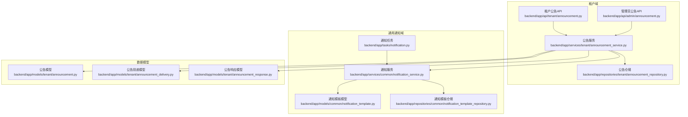
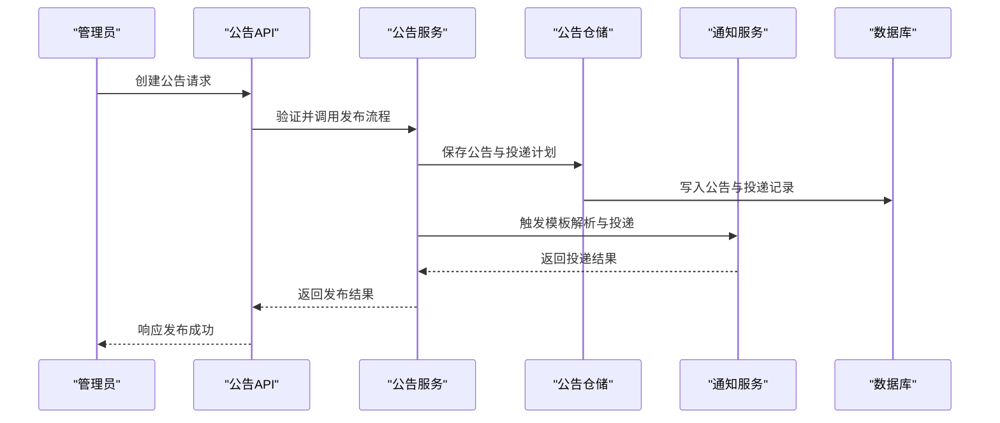
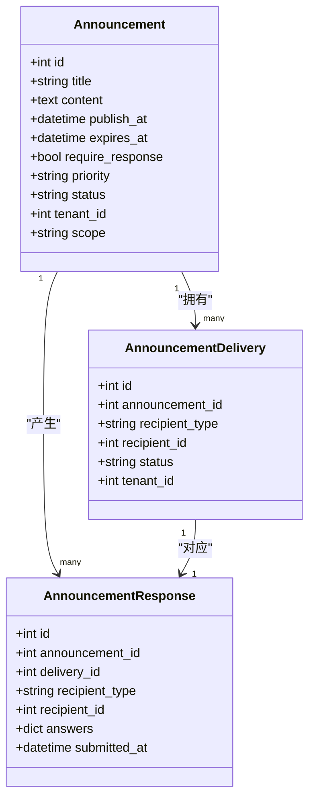
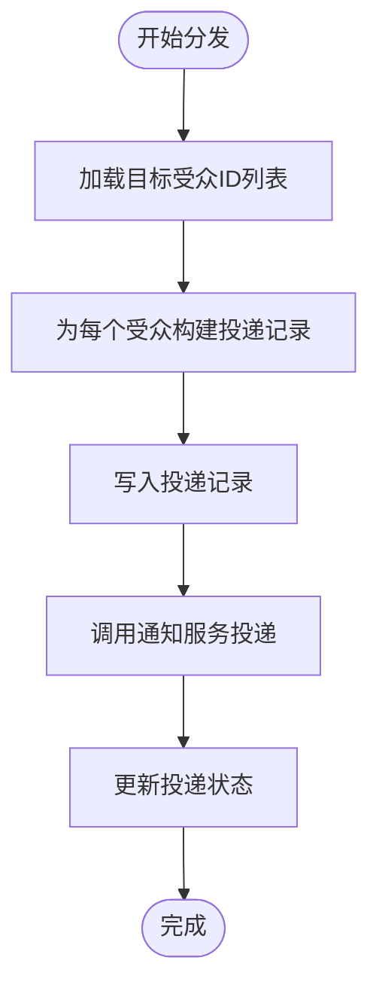
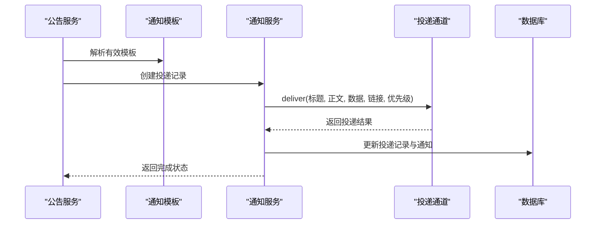
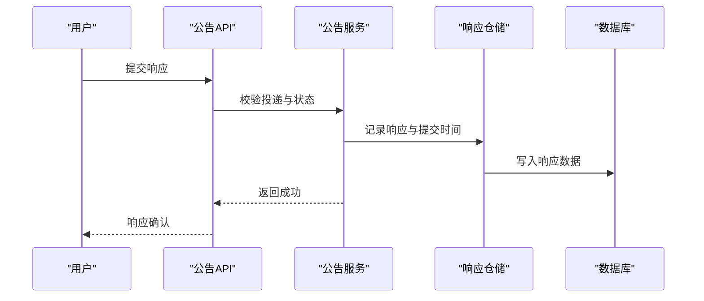
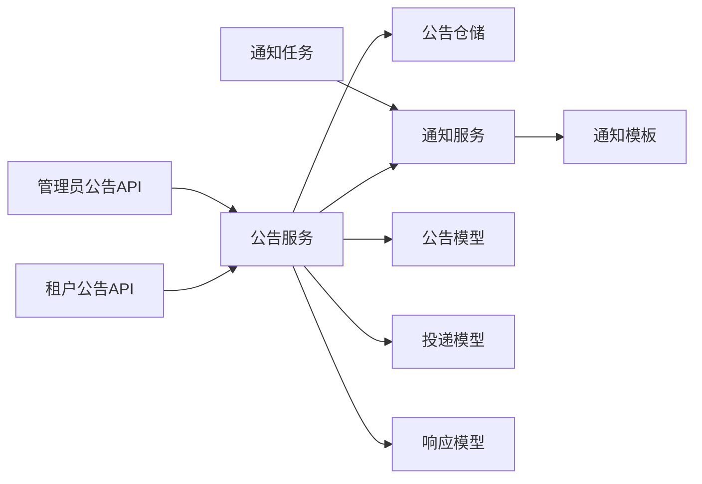

# 租户公告服务

<cite>
**本文档引用的文件**
- [backend/app/services/tenant/announcement_service.py](file://backend/app/services/tenant/announcement_service.py)
- [backend/app/models/tenant/announcement.py](file://backend/app/models/tenant/announcement.py)
- [backend/app/models/tenant/announcement_delivery.py](file://backend/app/models/tenant/announcement_delivery.py)
- [backend/app/models/tenant/announcement_response.py](file://backend/app/models/tenant/announcement_response.py)
- [backend/app/repositories/tenant/announcement_repository.py](file://backend/app/repositories/tenant/announcement_repository.py)
- [backend/app/api/tenant/announcement.py](file://backend/app/api/tenant/announcement.py)
- [backend/app/api/admin/announcement.py](file://backend/app/api/admin/announcement.py)
- [backend/app/services/common/notification_service.py](file://backend/app/services/common/notification_service.py)
- [backend/app/models/common/notification_template.py](file://backend/app/models/common/notification_template.py)
- [backend/app/repositories/common/notification_template_repository.py](file://backend/app/repositories/common/notification_template_repository.py)
- [backend/app/tasks/notification.py](file://backend/app/tasks/notification.py)
- [backend/app/schemas/tenant/announcement.py](file://backend/app/schemas/tenant/announcement.py)
- [backend/tests/services/tenant/test_announcement_service.py](file://backend/tests/services/tenant/test_announcement_service.py)
- [backend/migrations/versions/20260430_0022_add_announcements.py](file://backend/migrations/versions/20260430_0022_add_announcements.py)
</cite>

## 目录
1. [简介](#简介)
2. [项目结构](#项目结构)
3. [核心组件](#核心组件)
4. [架构概览](#架构概览)
5. [详细组件分析](#详细组件分析)
6. [依赖关系分析](#依赖关系分析)
7. [性能考虑](#性能考虑)
8. [故障排除指南](#故障排除指南)
9. [结论](#结论)
10. [附录](#附录)

## 简介
本技术文档面向租户公告服务，系统性阐述公告发布、分发与响应管理的完整流程。文档覆盖公告内容管理、目标受众定位、分发策略、投递机制、用户响应收集与统计分析、个性化推送、优先级管理以及效果评估等关键能力，并包含模板系统、定时发布与用户反馈处理的实现要点。

## 项目结构
租户公告服务位于后端应用的租户域下，采用分层架构：API 控制器负责请求入口与参数校验；服务层封装业务逻辑（含公告发布、分发、响应处理）；仓储层提供数据访问；通知服务与模板系统支撑消息投递；任务调度负责定时发布与清理。

**图表来源**
- [backend/app/api/tenant/announcement.py](file://backend/app/api/tenant/announcement.py)
- [backend/app/api/admin/announcement.py](file://backend/app/api/admin/announcement.py)
- [backend/app/services/tenant/announcement_service.py](file://backend/app/services/tenant/announcement_service.py)
- [backend/app/repositories/tenant/announcement_repository.py](file://backend/app/repositories/tenant/announcement_repository.py)
- [backend/app/services/common/notification_service.py](file://backend/app/services/common/notification_service.py)
- [backend/app/models/common/notification_template.py](file://backend/app/models/common/notification_template.py)
- [backend/app/repositories/common/notification_template_repository.py](file://backend/app/repositories/common/notification_template_repository.py)
- [backend/app/tasks/notification.py](file://backend/app/tasks/notification.py)
- [backend/app/models/tenant/announcement.py](file://backend/app/models/tenant/announcement.py)
- [backend/app/models/tenant/announcement_delivery.py](file://backend/app/models/tenant/announcement_delivery.py)
- [backend/app/models/tenant/announcement_response.py](file://backend/app/models/tenant/announcement_response.py)

**章节来源**
- [backend/app/services/tenant/announcement_service.py](file://backend/app/services/tenant/announcement_service.py)
- [backend/app/api/tenant/announcement.py](file://backend/app/api/tenant/announcement.py)
- [backend/app/api/admin/announcement.py](file://backend/app/api/admin/announcement.py)

## 核心组件
- 公告服务（AnnouncementService）：封装公告生命周期管理、受众定位、投递控制、响应处理与统计接口。
- 公告模型（Announcement）：定义公告内容、状态、受众范围、是否需要响应等字段。
- 投递模型（AnnouncementDelivery）：记录单个用户的投递状态与关联信息。
- 响应模型（AnnouncementResponse）：保存用户提交的反馈答案与提交时间。
- 通知服务（NotificationService）：统一的消息通道投递引擎，支持模板解析、优先级与渠道选择。
- 通知模板（NotificationTemplate）：可被公告复用的模板实体，支持多渠道与优先级配置。
- 定时任务（notification.py）：负责公告定时发布与清理等后台作业。

**章节来源**
- [backend/app/services/tenant/announcement_service.py](file://backend/app/services/tenant/announcement_service.py)
- [backend/app/models/tenant/announcement.py](file://backend/app/models/tenant/announcement.py)
- [backend/app/models/tenant/announcement_delivery.py](file://backend/app/models/tenant/announcement_delivery.py)
- [backend/app/models/tenant/announcement_response.py](file://backend/app/models/tenant/announcement_response.py)
- [backend/app/services/common/notification_service.py](file://backend/app/services/common/notification_service.py)
- [backend/app/models/common/notification_template.py](file://backend/app/models/common/notification_template.py)
- [backend/app/tasks/notification.py](file://backend/app/tasks/notification.py)

## 架构概览
公告服务通过 API 层接收请求，服务层协调仓储与通知服务完成内容持久化、受众计算、模板渲染与消息投递，并在用户侧提供响应提交与查看待办的能力。定时任务负责周期性触发公告发布与清理。

**图表来源**
- [backend/app/api/admin/announcement.py](file://backend/app/api/admin/announcement.py)
- [backend/app/services/tenant/announcement_service.py](file://backend/app/services/tenant/announcement_service.py)
- [backend/app/repositories/tenant/announcement_repository.py](file://backend/app/repositories/tenant/announcement_repository.py)
- [backend/app/services/common/notification_service.py](file://backend/app/services/common/notification_service.py)

## 详细组件分析

### 公告内容管理
- 字段设计：标题、正文、开始/结束时间、受众范围、是否需要响应、优先级、状态（草稿/已发布）、租户与平台作用域等。
- 生命周期：支持草稿保存、定时发布、状态变更与回收站处理。
- 内容安全：模板变量解析与注入，避免 XSS 与不合规内容传播。

**图表来源**
- [backend/app/models/tenant/announcement.py](file://backend/app/models/tenant/announcement.py)
- [backend/app/models/tenant/announcement_delivery.py](file://backend/app/models/tenant/announcement_delivery.py)
- [backend/app/models/tenant/announcement_response.py](file://backend/app/models/tenant/announcement_response.py)

**章节来源**
- [backend/app/models/tenant/announcement.py](file://backend/app/models/tenant/announcement.py)
- [backend/app/models/tenant/announcement_delivery.py](file://backend/app/models/tenant/announcement_delivery.py)
- [backend/app/models/tenant/announcement_response.py](file://backend/app/models/tenant/announcement_response.py)

### 目标受众定位与分发策略
- 受众类型：支持 admin、tenant_admin、tenant_user 三类角色定位。
- 分发边界：按租户维度隔离，确保跨租户数据不可见。
- 投递状态：pending（待处理）、sent（已发送）、read（已读）、expired（已过期）等状态机管理。
- 限制策略：后台加载待办公告数量上限，避免查询放大。

**图表来源**
- [backend/app/services/tenant/announcement_service.py](file://backend/app/services/tenant/announcement_service.py)
- [backend/app/repositories/tenant/announcement_repository.py](file://backend/app/repositories/tenant/announcement_repository.py)

**章节来源**
- [backend/app/services/tenant/announcement_service.py](file://backend/app/services/tenant/announcement_service.py)
- [backend/tests/services/tenant/test_announcement_service.py](file://backend/tests/services/tenant/test_announcement_service.py)

### 投递机制与模板系统
- 模板复用：公告可复用通知模板，模板包含标题、正文、渠道与优先级。
- 渲染与投递：通知服务根据模板解析变量、选择通道（如站内信、邮件），并记录投递结果。
- 外部集成：支持扩展不同投递通道（如邮件、IM、推送），通过统一接口抽象。

**图表来源**
- [backend/app/services/tenant/announcement_service.py](file://backend/app/services/tenant/announcement_service.py)
- [backend/app/services/common/notification_service.py](file://backend/app/services/common/notification_service.py)
- [backend/app/models/common/notification_template.py](file://backend/app/models/common/notification_template.py)

**章节来源**
- [backend/app/services/common/notification_service.py](file://backend/app/services/common/notification_service.py)
- [backend/app/models/common/notification_template.py](file://backend/app/models/common/notification_template.py)

### 用户响应收集与统计分析
- 响应回传：用户在公告详情页提交答案，服务层校验投递有效性与状态后落库。
- 统计维度：按公告、受众类型、提交时间、渠道等进行聚合统计，支持导出与可视化。
- 效果评估：结合打开率、完成率、平均耗时等指标评估公告效果。

**图表来源**
- [backend/app/services/tenant/announcement_service.py](file://backend/app/services/tenant/announcement_service.py)
- [backend/app/models/tenant/announcement_response.py](file://backend/app/models/tenant/announcement_response.py)

**章节来源**
- [backend/app/services/tenant/announcement_service.py](file://backend/app/services/tenant/announcement_service.py)
- [backend/app/models/tenant/announcement_response.py](file://backend/app/models/tenant/announcement_response.py)

### 个性化推送与优先级管理
- 个性化：基于用户偏好与历史行为，动态调整展示顺序与内容片段。
- 优先级：支持 normal/high/urgent 三级优先级，影响投递顺序与提醒强度。
- 限流与节流：对同一用户在短时间内重复投递进行节流控制，避免打扰。

**章节来源**
- [backend/app/services/common/notification_service.py](file://backend/app/services/common/notification_service.py)
- [backend/app/models/common/notification_template.py](file://backend/app/models/common/notification_template.py)

### 定时发布与清理
- 定时发布：通过任务调度器定期扫描待发布公告，按设定时间批量触发发布。
- 清理策略：过期公告自动归档或删除，释放存储空间并保持查询性能。

**章节来源**
- [backend/app/tasks/notification.py](file://backend/app/tasks/notification.py)
- [backend/migrations/versions/20260430_0022_add_announcements.py](file://backend/migrations/versions/20260430_0022_add_announcements.py)

## 依赖关系分析
公告服务与通知域存在强耦合：公告发布依赖通知模板与通道；响应收集依赖通知状态一致性；定时任务驱动发布节奏。仓储层承担数据持久化职责，API 层负责契约与权限控制。

**图表来源**
- [backend/app/api/tenant/announcement.py](file://backend/app/api/tenant/announcement.py)
- [backend/app/api/admin/announcement.py](file://backend/app/api/admin/announcement.py)
- [backend/app/services/tenant/announcement_service.py](file://backend/app/services/tenant/announcement_service.py)
- [backend/app/repositories/tenant/announcement_repository.py](file://backend/app/repositories/tenant/announcement_repository.py)
- [backend/app/services/common/notification_service.py](file://backend/app/services/common/notification_service.py)
- [backend/app/models/common/notification_template.py](file://backend/app/models/common/notification_template.py)
- [backend/app/tasks/notification.py](file://backend/app/tasks/notification.py)

**章节来源**
- [backend/app/services/tenant/announcement_service.py](file://backend/app/services/tenant/announcement_service.py)
- [backend/app/repositories/tenant/announcement_repository.py](file://backend/app/repositories/tenant/announcement_repository.py)
- [backend/app/services/common/notification_service.py](file://backend/app/services/common/notification_service.py)

## 性能考虑
- 查询优化：对投递记录建立复合索引，限制后台加载待办数量，避免 N+1 查询。
- 批量投递：对大批量受众采用分批投递与异步处理，降低峰值压力。
- 缓存策略：对常用模板与受众映射进行缓存，减少重复解析与查询。
- 清理与归档：定期清理过期公告与冗余响应，保持表规模可控。

## 故障排除指南
- 投递失败：检查通知模板是否启用、通道配置是否正确、用户偏好是否屏蔽该类型通知。
- 响应异常：确认投递状态为 pending 且未过期；核对用户角色与受众匹配。
- 发布延迟：核查定时任务运行状态与数据库时区设置；检查公告发布时间戳。
- 权限问题：确认调用方具备相应角色权限；核对租户隔离策略。

**章节来源**
- [backend/app/services/tenant/announcement_service.py](file://backend/app/services/tenant/announcement_service.py)
- [backend/tests/services/tenant/test_announcement_service.py](file://backend/tests/services/tenant/test_announcement_service.py)

## 结论
租户公告服务以清晰的分层架构实现了从内容到投递再到响应的全链路闭环。通过模板系统与通知服务解耦、受众与状态机管理、定时任务与清理策略，满足了多租户场景下的高效、可控与可审计的公告运营需求。建议持续完善个性化推荐与效果评估体系，提升用户体验与运营效率。

## 附录
- 数据模型关系图（ER）
- API 接口清单与示例
- 运维监控指标建议