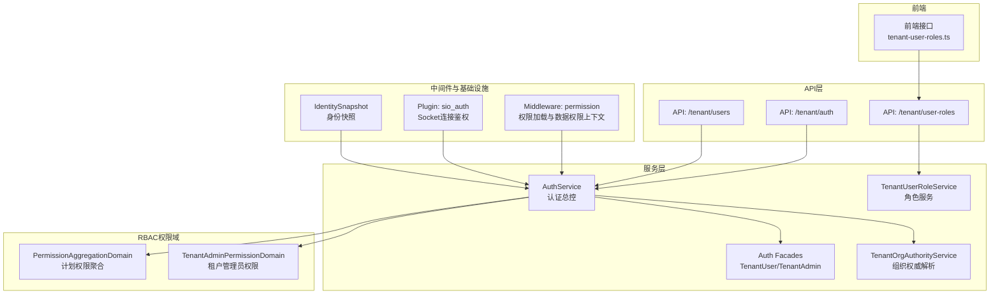
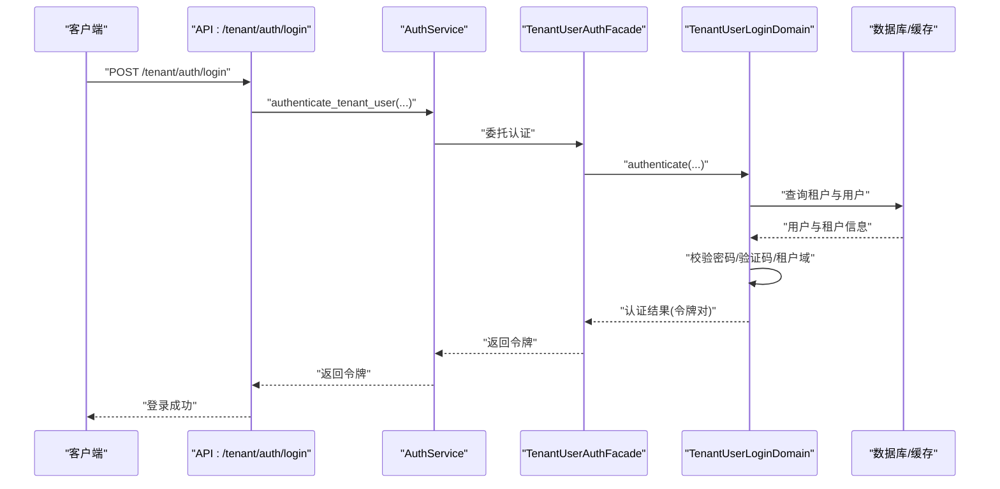
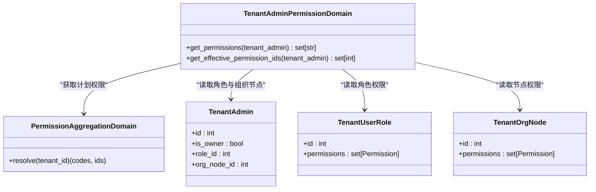
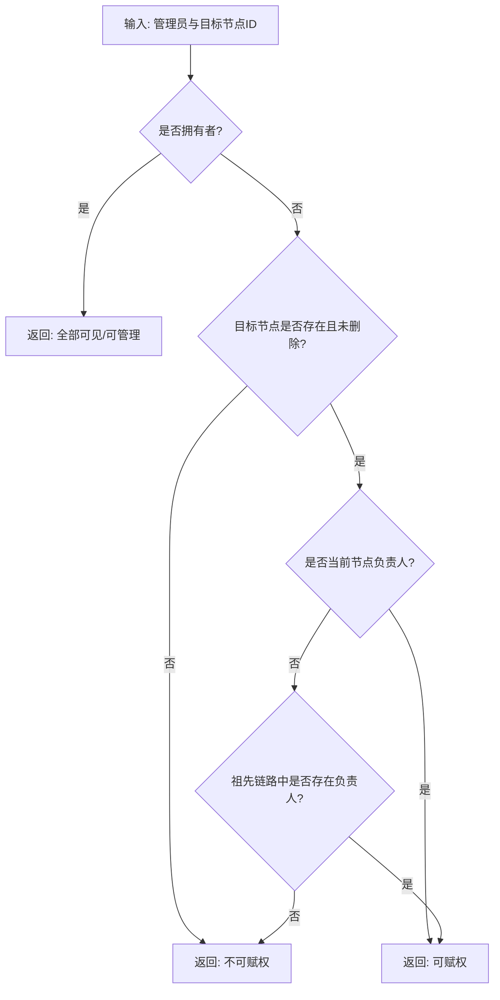
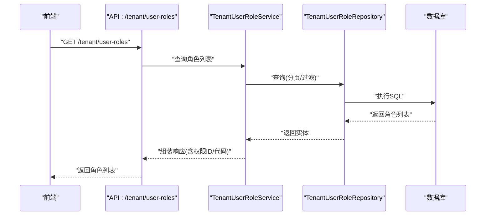
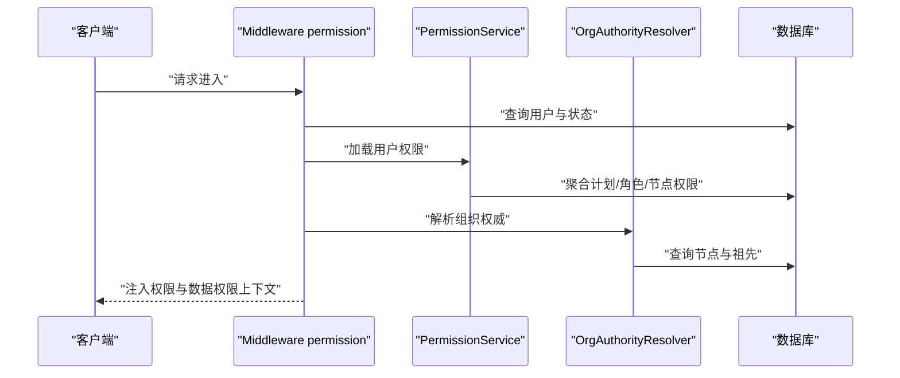
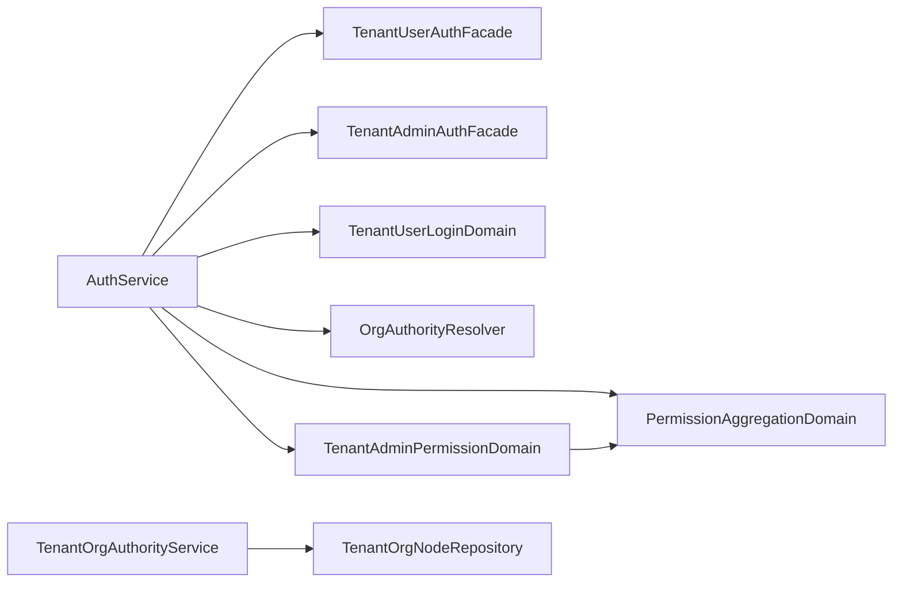

# 租户用户管理服务

<cite>
**本文档引用的文件**
- [backend/app/services/common/auth_service.py](file://backend/app/services/common/auth_service.py)
- [backend/app/services/common/auth_domains/facades.py](file://backend/app/services/common/auth_domains/facades.py)
- [backend/app/services/common/auth_domains/tenant_user_auth.py](file://backend/app/services/common/auth_domains/tenant_user_auth.py)
- [backend/app/services/common/auth_domains/tenant_admin_auth.py](file://backend/app/services/common/auth_domains/tenant_admin_auth.py)
- [backend/app/services/common/auth_domains/tenant_user_login.py](file://backend/app/services/common/auth_domains/tenant_user_login.py)
- [backend/app/services/tenant/tenant_org_authority_service.py](file://backend/app/services/tenant/tenant_org_authority_service.py)
- [backend/app/services/system/admin_org_authority_service.py](file://backend/app/services/system/admin_org_authority_service.py)
- [backend/app/services/tenant/tenant_user_role_service.py](file://backend/app/services/tenant/tenant_user_role_service.py)
- [backend/app/repositories/tenant/tenant_user_role_repository.py](file://backend/app/repositories/tenant/tenant_user_role_repository.py)
- [backend/app/rbac/services/permission_domains/tenant_admin.py](file://backend/app/rbac/services/permission_domains/tenant_admin.py)
- [backend/app/rbac/services/permission_domains/aggregation.py](file://backend/app/rbac/services/permission_domains/aggregation.py)
- [backend/app/middleware/permission.py](file://backend/app/middleware/permission.py)
- [backend/app/api/tenant/auth.py](file://backend/app/api/tenant/auth.py)
- [backend/app/api/tenant/users.py](file://backend/app/api/tenant/users.py)
- [backend/app/api/tenant/user_roles.py](file://backend/app/api/tenant/user_roles.py)
- [backend/app/models/tenant/tenant_user.py](file://backend/app/models/tenant/tenant_user.py)
- [backend/app/models/tenant/tenant_admin.py](file://backend/app/models/tenant/tenant_admin.py)
- [backend/app/models/auth/tenant_user_role.py](file://backend/app/models/auth/tenant_user_role.py)
- [backend/app/models/org/tenant_org_node.py](file://backend/app/models/org/tenant_org_node.py)
- [backend/app/core/identity_snapshot.py](file://backend/app/core/identity_snapshot.py)
- [backend/app/plugins/sio_auth.py](file://backend/app/plugins/sio_auth.py)
- [frontend/apps/web-antd/src/api/tenant/tenant-user-roles.ts](file://frontend/apps/web-antd/src/api/tenant/tenant-user-roles.ts)
</cite>

## 目录
1. [简介](#简介)
2. [项目结构](#项目结构)
3. [核心组件](#核心组件)
4. [架构总览](#架构总览)
5. [详细组件分析](#详细组件分析)
6. [依赖关系分析](#依赖关系分析)
7. [性能考虑](#性能考虑)
8. [故障排除指南](#故障排除指南)
9. [结论](#结论)
10. [附录](#附录)

## 简介
本技术文档面向租户用户管理服务，系统性阐述用户注册、认证、权限分配与组织架构管理等核心能力。重点覆盖以下方面：
- 用户身份认证与会话管理：支持用户名/密码、验证码登录、开发引导登录、刷新令牌、密码修改与重置。
- 权限体系与继承：基于租户计划权限、角色权限与组织节点权限的聚合计算，支持有效权限集与菜单权限识别。
- 组织架构管理：支持部门/岗位类型的组织节点树形结构、父子类型校验、路径与层级维护、可见与可管理范围解析。
- 多租户权限控制：通过租户隔离、组织权威解析与数据权限上下文注入，实现细粒度的权限边界。
- 用户服务的组织权威、角色展示与权限同步：组织权威服务解析可见/可管理范围，角色服务提供角色与权限映射，权限聚合服务统一来源。
- 批量操作、权限审计与安全合规：强制下线、Redis令牌撤销、Socket在线状态清理、审计日志与登录安全域。

## 项目结构
租户用户管理服务由后端服务层、API路由层、RBAC权限域、组织权威服务与前端接口三部分组成，采用分层与领域划分相结合的设计：

**图表来源**
- [backend/app/api/tenant/auth.py](file://backend/app/api/tenant/auth.py)
- [backend/app/api/tenant/users.py](file://backend/app/api/tenant/users.py)
- [backend/app/api/tenant/user_roles.py](file://backend/app/api/tenant/user_roles.py)
- [backend/app/services/common/auth_service.py](file://backend/app/services/common/auth_service.py)
- [backend/app/services/tenant/tenant_org_authority_service.py](file://backend/app/services/tenant/tenant_org_authority_service.py)
- [backend/app/rbac/services/permission_domains/aggregation.py](file://backend/app/rbac/services/permission_domains/aggregation.py)
- [backend/app/rbac/services/permission_domains/tenant_admin.py](file://backend/app/rbac/services/permission_domains/tenant_admin.py)
- [backend/app/middleware/permission.py](file://backend/app/middleware/permission.py)
- [backend/app/plugins/sio_auth.py](file://backend/app/plugins/sio_auth.py)
- [backend/app/core/identity_snapshot.py](file://backend/app/core/identity_snapshot.py)
- [frontend/apps/web-antd/src/api/tenant/tenant-user-roles.ts](file://frontend/apps/web-antd/src/api/tenant/tenant-user-roles.ts)

**章节来源**
- [backend/app/api/tenant/auth.py](file://backend/app/api/tenant/auth.py)
- [backend/app/api/tenant/users.py](file://backend/app/api/tenant/users.py)
- [backend/app/api/tenant/user_roles.py](file://backend/app/api/tenant/user_roles.py)
- [backend/app/services/common/auth_service.py](file://backend/app/services/common/auth_service.py)
- [backend/app/services/tenant/tenant_org_authority_service.py](file://backend/app/services/tenant/tenant_org_authority_service.py)
- [backend/app/rbac/services/permission_domains/aggregation.py](file://backend/app/rbac/services/permission_domains/aggregation.py)
- [backend/app/rbac/services/permission_domains/tenant_admin.py](file://backend/app/rbac/services/permission_domains/tenant_admin.py)
- [backend/app/middleware/permission.py](file://backend/app/middleware/permission.py)
- [backend/app/plugins/sio_auth.py](file://backend/app/plugins/sio_auth.py)
- [backend/app/core/identity_snapshot.py](file://backend/app/core/identity_snapshot.py)
- [frontend/apps/web-antd/src/api/tenant/tenant-user-roles.ts](file://frontend/apps/web-antd/src/api/tenant/tenant-user-roles.ts)

## 核心组件
- 认证服务与门面
  - AuthService：统一协调管理员、企业管理员与企业用户的认证流程，包括密码验证、验证码、开发引导登录、令牌签发与刷新、密码修改与重置、登录失败记录与锁定策略。
  - TenantUserAuthFacade/TenantAdminAuthFacade：面向租户用户的认证门面，封装登录、刷新、密码变更、登录码发送与验证码登录、注册、资料更新、密码重置等接口。
- 组织权威服务
  - TenantOrgAuthorityService：解析租户管理员对组织节点的可见与可管理范围，支持根节点创建、父子节点赋权判断、祖先链路检查与成员AI开关管理范围。
- 权限聚合与查询
  - PermissionAggregationDomain：从租户计划中聚合权限集合，区分权限代码与ID，并识别菜单权限ID集合。
  - TenantAdminPermissionDomain：结合租户管理员的角色与组织节点权限，计算其最终可用权限集，支持拥有者豁免与计划权限交集。
- 角色与权限映射
  - TenantUserRoleService：提供角色创建、更新、删除、权限分配、列表查询与详情展示；TenantUserRoleRepository提供按编码查询与唯一性校验。
- 中间件与基础设施
  - Middleware permission：在请求进入时加载用户与权限，注入数据权限上下文，支持租户管理员与租户业务用户。
  - Socket鉴权插件：在WebSocket连接时进行用户类型判定、在线状态维护与房间加入。
  - 身份快照：根据用户类型与租户ID查询用户与组织节点、角色关联信息。

**章节来源**
- [backend/app/services/common/auth_service.py](file://backend/app/services/common/auth_service.py)
- [backend/app/services/common/auth_domains/facades.py](file://backend/app/services/common/auth_domains/facades.py)
- [backend/app/services/tenant/tenant_org_authority_service.py](file://backend/app/services/tenant/tenant_org_authority_service.py)
- [backend/app/rbac/services/permission_domains/aggregation.py](file://backend/app/rbac/services/permission_domains/aggregation.py)
- [backend/app/rbac/services/permission_domains/tenant_admin.py](file://backend/app/rbac/services/permission_domains/tenant_admin.py)
- [backend/app/services/tenant/tenant_user_role_service.py](file://backend/app/services/tenant/tenant_user_role_service.py)
- [backend/app/repositories/tenant/tenant_user_role_repository.py](file://backend/app/repositories/tenant/tenant_user_role_repository.py)
- [backend/app/middleware/permission.py](file://backend/app/middleware/permission.py)
- [backend/app/plugins/sio_auth.py](file://backend/app/plugins/sio_auth.py)
- [backend/app/core/identity_snapshot.py](file://backend/app/core/identity_snapshot.py)

## 架构总览
租户用户管理服务遵循“API → 服务 → RBAC/组织权威 → 数据模型”的分层架构，围绕认证、权限与组织三大域协同工作。

**图表来源**
- [backend/app/api/tenant/auth.py](file://backend/app/api/tenant/auth.py)
- [backend/app/services/common/auth_service.py](file://backend/app/services/common/auth_service.py)
- [backend/app/services/common/auth_domains/facades.py](file://backend/app/services/common/auth_domains/facades.py)
- [backend/app/services/common/auth_domains/tenant_user_login.py](file://backend/app/services/common/auth_domains/tenant_user_login.py)

**章节来源**
- [backend/app/api/tenant/auth.py](file://backend/app/api/tenant/auth.py)
- [backend/app/services/common/auth_service.py](file://backend/app/services/common/auth_service.py)
- [backend/app/services/common/auth_domains/facades.py](file://backend/app/services/common/auth_domains/facades.py)
- [backend/app/services/common/auth_domains/tenant_user_login.py](file://backend/app/services/common/auth_domains/tenant_user_login.py)

## 详细组件分析

### 认证与会话管理
- 支持多种登录方式
  - 用户名/密码登录：需提供租户域参数，否则拒绝。
  - 验证码登录：支持挑战-解答回调与提供商代码。
  - 开发引导登录：通过引导密钥与主机规则校验，用于开发环境快速登录。
  - 登录码发送与验证码登录：支持短信/邮件验证码登录。
  - 注册：根据租户域参数与租户配置决定是否允许注册。
- 令牌与会话
  - 生成访问令牌与刷新令牌，支持自定义过期时间与额外声明。
  - 记录活跃令牌，支持强制下线与Redis撤销，触发Socket通知与Presence离线。
  - 密码策略校验与登录失败次数限制，支持账户锁定与失败重置。
- 安全与审计
  - 认证日志格式化与敏感信息掩码。
  - 主机匹配规则与开发引导开关校验。

```mermaid
flowchart TD
Start(["开始: 用户提交登录请求"]) --> CheckTenant["校验租户域参数"]
CheckTenant --> |缺失| Reject["拒绝: 租户域必填"]
CheckTenant --> |存在| LoadUser["加载用户与租户信息"]
LoadUser --> VerifyCaptcha["验证码校验(可选)"]
VerifyCaptcha --> VerifyPwd["验证密码/登录码"]
VerifyPwd --> |失败| RecordFail["记录失败并可能锁定账户"]
VerifyPwd --> |成功| IssueTokens["签发访问/刷新令牌"]
IssueTokens --> LogSuccess["记录成功日志"]
LogSuccess --> End(["结束"])
RecordFail --> End
Reject --> End
```

**图表来源**
- [backend/app/services/common/auth_domains/tenant_user_login.py](file://backend/app/services/common/auth_domains/tenant_user_login.py)
- [backend/app/services/common/auth_service.py](file://backend/app/services/common/auth_service.py)

**章节来源**
- [backend/app/services/common/auth_service.py](file://backend/app/services/common/auth_service.py)
- [backend/app/services/common/auth_domains/tenant_user_auth.py](file://backend/app/services/common/auth_domains/tenant_user_auth.py)
- [backend/app/services/common/auth_domains/tenant_user_login.py](file://backend/app/services/common/auth_domains/tenant_user_login.py)

### 权限体系与继承机制
- 权限来源
  - 租户计划权限：从租户与计划关联中提取启用且未删除的权限集合。
  - 角色权限：用户角色绑定的权限集合。
  - 组织节点权限：用户所在组织节点授予的权限集合。
- 权限聚合
  - 有效权限集：对角色与组织节点权限进行去重与启用状态过滤，再与计划权限求交集。
  - 菜单权限识别：在聚合过程中识别菜单类权限ID集合，便于前端菜单渲染。
- 租户管理员权限
  - 拥有者拥有全部计划权限；非拥有者合并角色与组织节点权限后与计划权限求交集。

**图表来源**
- [backend/app/rbac/services/permission_domains/aggregation.py](file://backend/app/rbac/services/permission_domains/aggregation.py)
- [backend/app/rbac/services/permission_domains/tenant_admin.py](file://backend/app/rbac/services/permission_domains/tenant_admin.py)
- [backend/app/models/auth/tenant_user_role.py](file://backend/app/models/auth/tenant_user_role.py)
- [backend/app/models/org/tenant_org_node.py](file://backend/app/models/org/tenant_org_node.py)
- [backend/app/models/tenant/tenant_admin.py](file://backend/app/models/tenant/tenant_admin.py)

**章节来源**
- [backend/app/rbac/services/permission_domains/aggregation.py](file://backend/app/rbac/services/permission_domains/aggregation.py)
- [backend/app/rbac/services/permission_domains/tenant_admin.py](file://backend/app/rbac/services/permission_domains/tenant_admin.py)

### 组织架构管理与组织权威
- 组织节点类型与父子关系
  - 支持部门与岗位两类节点，父子类型校验确保结构合法性。
  - 路径与层级维护：新增/移动节点时重建子树路径与层级，防止深度超限。
- 可见与可管理范围
  - 拥有者可管理全部节点；普通管理员基于自身领导节点与子树范围。
  - 权限赋权能力：仅当前节点负责人或祖先负责人可为该节点赋权。
- 成员AI开关管理范围：仅节点或祖先负责人可管理成员AI开关与成员活动查看。

**图表来源**
- [backend/app/services/tenant/tenant_org_authority_service.py](file://backend/app/services/tenant/tenant_org_authority_service.py)

**章节来源**
- [backend/app/services/tenant/tenant_org_authority_service.py](file://backend/app/services/tenant/tenant_org_authority_service.py)
- [backend/app/repositories/tenant/tenant_org_node_repository.py](file://backend/app/repositories/tenant/tenant_org_node_repository.py)

### 用户角色体系与角色显示
- 角色模型与仓储
  - TenantUserRole：角色实体，包含权限集合与系统/激活状态。
  - TenantUserRoleRepository：提供按编码查询与唯一性校验，自动按租户过滤。
- 角色服务
  - 支持角色创建、更新、删除、权限分配、列表与详情展示。
  - 角色显示：前端接口将后端snake_case字段转换为前端camelCase，包含权限ID与权限代码列表。
- 角色与权限同步
  - 更新角色权限时，服务层将权限ID规范化并写回角色权限集合，保证与数据库一致。

**图表来源**
- [backend/app/api/tenant/user_roles.py](file://backend/app/api/tenant/user_roles.py)
- [backend/app/services/tenant/tenant_user_role_service.py](file://backend/app/services/tenant/tenant_user_role_service.py)
- [backend/app/repositories/tenant/tenant_user_role_repository.py](file://backend/app/repositories/tenant/tenant_user_role_repository.py)
- [frontend/apps/web-antd/src/api/tenant/tenant-user-roles.ts](file://frontend/apps/web-antd/src/api/tenant/tenant-user-roles.ts)

**章节来源**
- [backend/app/services/tenant/tenant_user_role_service.py](file://backend/app/services/tenant/tenant_user_role_service.py)
- [backend/app/repositories/tenant/tenant_user_role_repository.py](file://backend/app/repositories/tenant/tenant_user_role_repository.py)
- [backend/app/api/tenant/user_roles.py](file://backend/app/api/tenant/user_roles.py)
- [frontend/apps/web-antd/src/api/tenant/tenant-user-roles.ts](file://frontend/apps/web-antd/src/api/tenant/tenant-user-roles.ts)

### 多租户权限控制与数据权限上下文
- 中间件权限加载
  - 对于租户管理员：加载其计划权限与组织权威，注入数据权限上下文。
  - 对于租户业务用户：若无角色则解析组织权威，否则加载角色权限集合。
- 身份快照
  - 根据用户类型与租户ID查询用户、组织节点与角色关联，确保权限计算一致性。
- Socket连接鉴权
  - 根据用户类型判定租户ID与用户名，建立标准房间并维护在线状态。

**图表来源**
- [backend/app/middleware/permission.py](file://backend/app/middleware/permission.py)
- [backend/app/core/identity_snapshot.py](file://backend/app/core/identity_snapshot.py)
- [backend/app/plugins/sio_auth.py](file://backend/app/plugins/sio_auth.py)

**章节来源**
- [backend/app/middleware/permission.py](file://backend/app/middleware/permission.py)
- [backend/app/core/identity_snapshot.py](file://backend/app/core/identity_snapshot.py)
- [backend/app/plugins/sio_auth.py](file://backend/app/plugins/sio_auth.py)

### 批量操作、权限审计与安全合规
- 强制下线
  - 读取Redis中的活跃令牌，撤销访问与刷新令牌，清理Presence并按用户类型向对应Socket命名空间发送强制下线事件。
- 登录安全与审计
  - 记录登录失败、账户锁定与失败重置；开发引导登录的安全校验与主机规则匹配。
- 权限审计
  - 认证日志格式化与敏感信息掩码，便于审计追踪。

**章节来源**
- [backend/app/services/common/auth_service.py](file://backend/app/services/common/auth_service.py)
- [backend/tests/services/test_force_logout.py](file://backend/tests/services/test_force_logout.py)

## 依赖关系分析
- 组件耦合
  - AuthService作为认证总控，依赖多个领域域（登录域、会话域、安全域、管理员域、租户管理员域、租户用户域）与权限聚合域。
  - TenantOrgAuthorityService依赖组织节点仓储，提供可见/可管理范围与权限赋权判断。
  - PermissionAggregationDomain与TenantAdminPermissionDomain共同完成计划权限与用户实际权限的聚合。
- 外部依赖
  - Redis用于令牌存储与撤销；数据库用于用户、角色、组织节点与权限持久化。
  - SocketIO用于实时通知与Presence管理。

**图表来源**
- [backend/app/services/common/auth_service.py](file://backend/app/services/common/auth_service.py)
- [backend/app/services/tenant/tenant_org_authority_service.py](file://backend/app/services/tenant/tenant_org_authority_service.py)
- [backend/app/rbac/services/permission_domains/aggregation.py](file://backend/app/rbac/services/permission_domains/aggregation.py)
- [backend/app/rbac/services/permission_domains/tenant_admin.py](file://backend/app/rbac/services/permission_domains/tenant_admin.py)

**章节来源**
- [backend/app/services/common/auth_service.py](file://backend/app/services/common/auth_service.py)
- [backend/app/services/tenant/tenant_org_authority_service.py](file://backend/app/services/tenant/tenant_org_authority_service.py)
- [backend/app/rbac/services/permission_domains/aggregation.py](file://backend/app/rbac/services/permission_domains/aggregation.py)
- [backend/app/rbac/services/permission_domains/tenant_admin.py](file://backend/app/rbac/services/permission_domains/tenant_admin.py)

## 性能考虑
- 查询优化
  - 使用selectinload预加载角色权限，避免N+1查询。
  - 组织节点树查询使用路径前缀匹配与排序，减少扫描范围。
- 缓存与会话
  - 令牌活跃记录与撤销通过Redis高效处理，降低数据库压力。
- 权限计算
  - 权限聚合在内存中进行集合运算，建议控制角色与节点权限规模，避免过大集合导致CPU开销增加。

## 故障排除指南
- 登录失败与锁定
  - 检查登录失败计数与锁定阈值，必要时重置失败计数。
- 令牌撤销无效
  - 确认Redis中活跃令牌键值存在，检查撤销函数调用与Socket事件发送。
- 组织节点赋权失败
  - 校验父子类型合法性、节点是否存在且未删除、祖先链路中是否存在负责人。
- 权限不生效
  - 确认用户角色权限与组织节点权限均处于启用状态，且与计划权限存在交集。

**章节来源**
- [backend/app/services/common/auth_service.py](file://backend/app/services/common/auth_service.py)
- [backend/tests/services/test_force_logout.py](file://backend/tests/services/test_force_logout.py)
- [backend/app/services/tenant/tenant_org_authority_service.py](file://backend/app/services/tenant/tenant_org_authority_service.py)

## 结论
租户用户管理服务通过清晰的分层设计与领域划分，实现了多租户场景下的认证、权限与组织管理能力。AuthService作为核心枢纽，整合了认证域、会话域与安全域；TenantOrgAuthorityService与Permission聚合域共同保障权限边界与继承逻辑；前端接口与API层形成完整的用户交互闭环。配合强制下线、审计日志与Socket通知，满足企业级安全与合规要求。

## 附录
- 关键API与服务映射
  - /tenant/auth：认证入口，支持多种登录方式与开发引导登录。
  - /tenant/users：用户资料与密码相关操作。
  - /tenant/user-roles：角色管理与权限分配。
- 前端接口约定
  - 响应字段从后端snake_case转换为前端camelCase，包含权限ID与权限代码列表，便于前端展示与权限判断。

**章节来源**
- [backend/app/api/tenant/auth.py](file://backend/app/api/tenant/auth.py)
- [backend/app/api/tenant/users.py](file://backend/app/api/tenant/users.py)
- [backend/app/api/tenant/user_roles.py](file://backend/app/api/tenant/user_roles.py)
- [frontend/apps/web-antd/src/api/tenant/tenant-user-roles.ts](file://frontend/apps/web-antd/src/api/tenant/tenant-user-roles.ts)