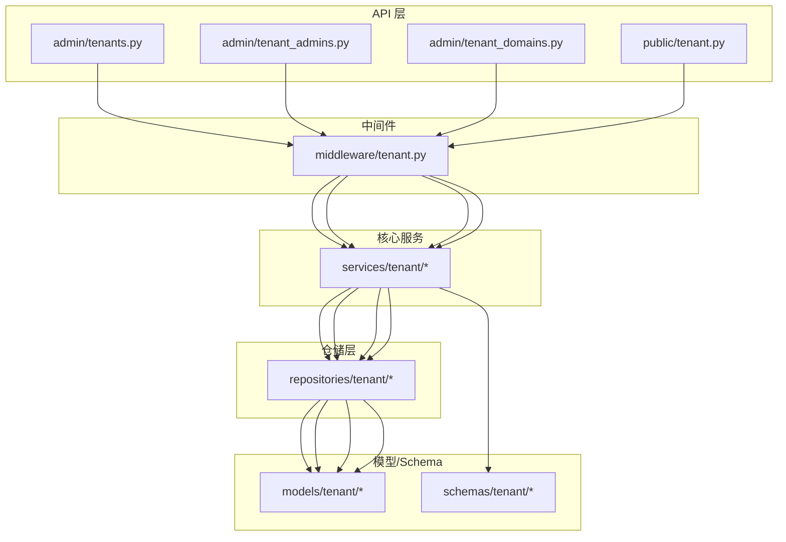
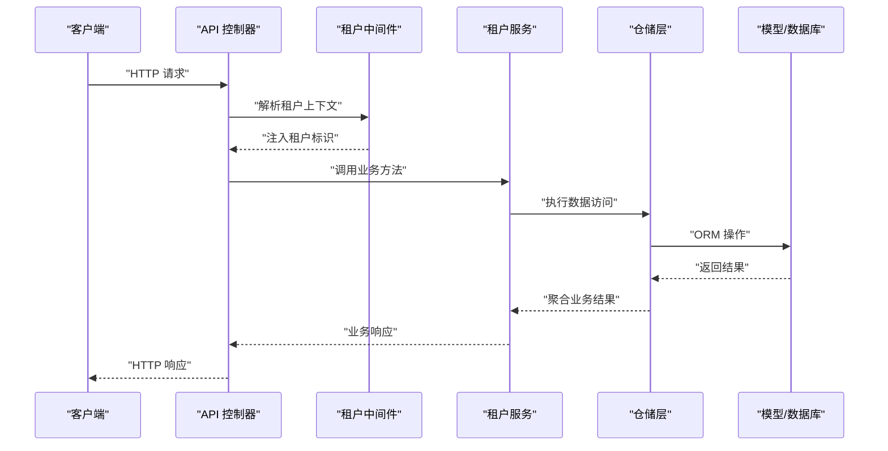
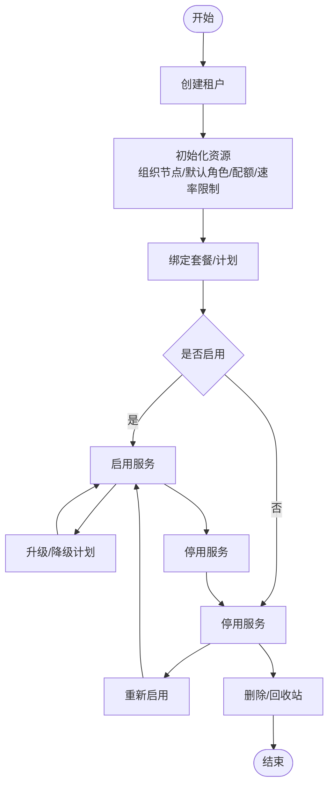
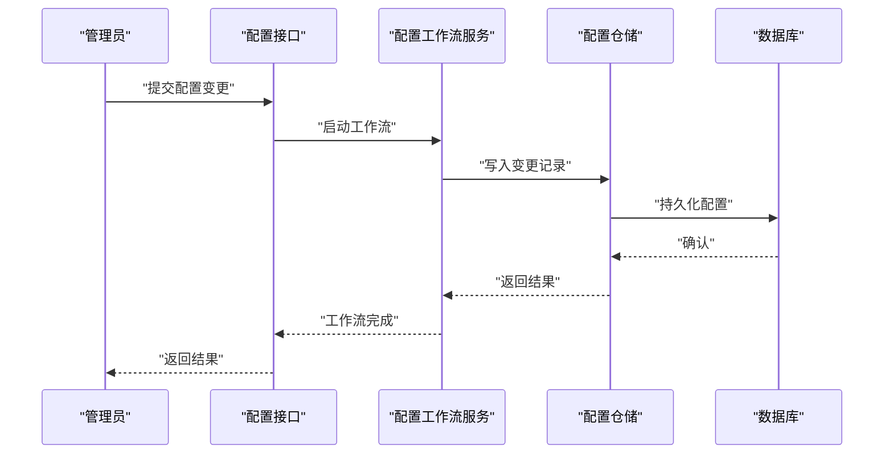
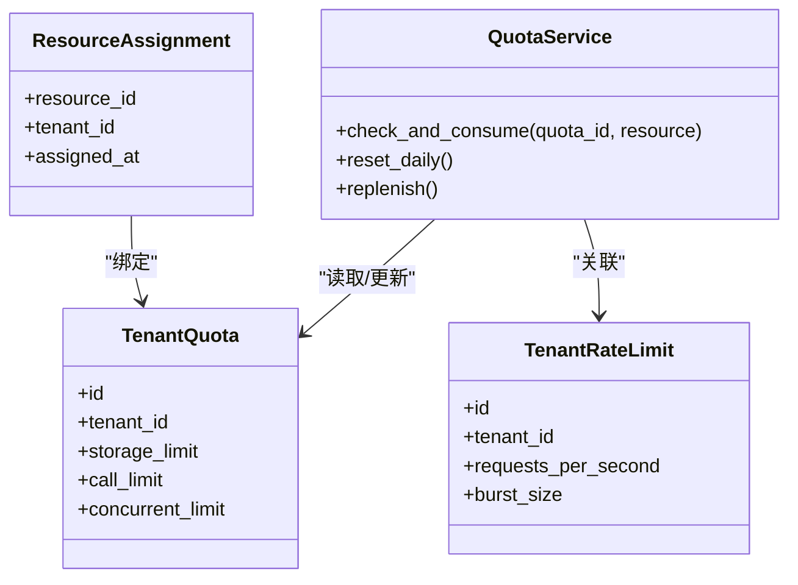
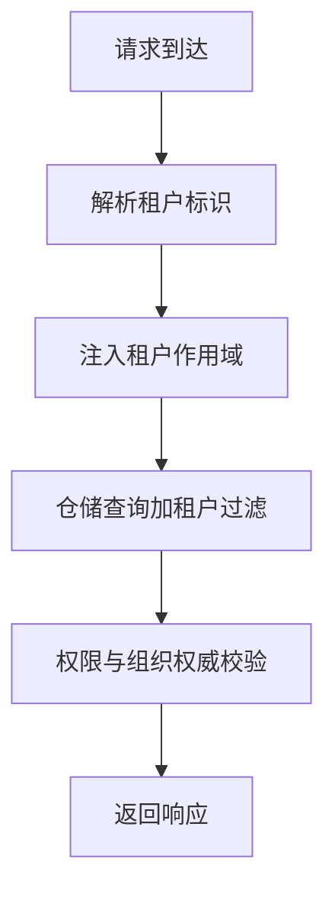
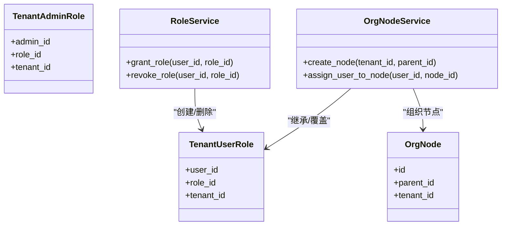
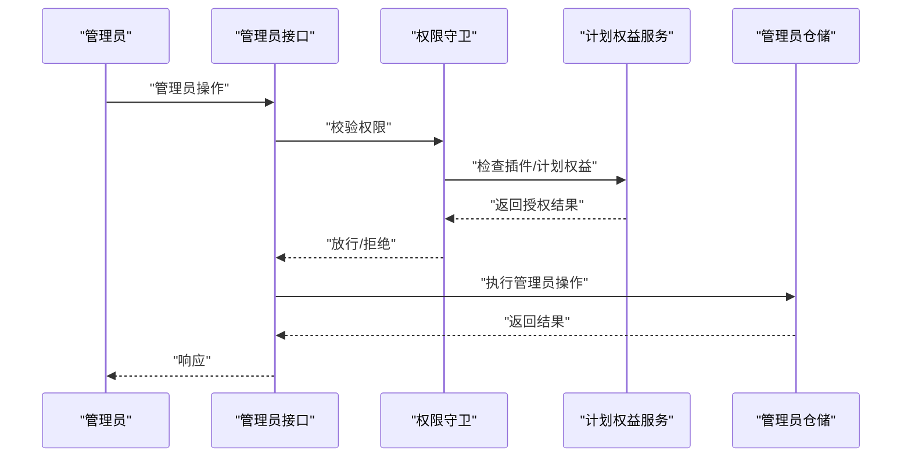
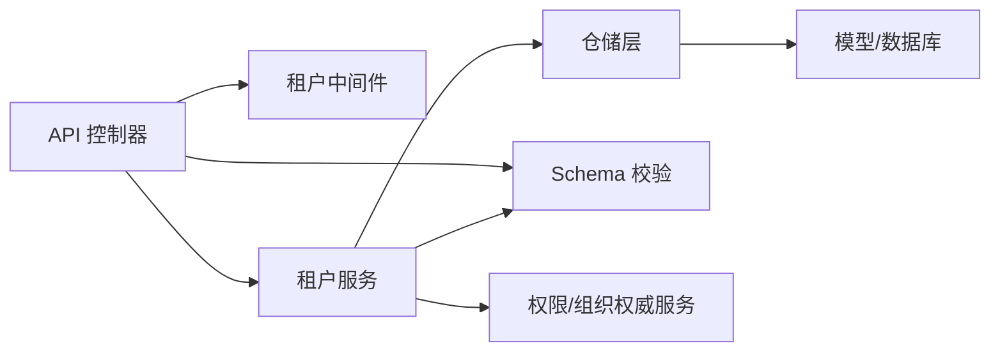

# 租户管理服务

<cite>

**本文引用的文件**
- [backend/app/api/admin/tenants.py](file://backend/app/api/admin/tenants.py)
- [backend/app/api/admin/tenant_admins.py](file://backend/app/api/admin/tenant_admins.py)
- [backend/app/api/admin/tenant_domains.py](file://backend/app/api/admin/tenant_domains.py)
- [backend/app/api/public/tenant.py](file://backend/app/api/public/tenant.py)
- [backend/app/middleware/tenant.py](file://backend/app/middleware/tenant.py)
- [backend/app/core/repository_parts/tenant_scope.py](file://backend/app/core/repository_parts/tenant_scope.py)
- [backend/app/models/tenant/tenant.py](file://backend/app/models/tenant/tenant.py)
- [backend/app/models/tenant/tenant_admin.py](file://backend/app/models/tenant/tenant_admin.py)
- [backend/app/models/tenant/tenant_domain.py](file://backend/app/models/tenant/tenant_domain.py)
- [backend/app/models/tenant/tenant_plan.py](file://backend/app/models/tenant/tenant_plan.py)
- [backend/app/models/auth/tenant_admin_role.py](file://backend/app/models/auth/tenant_admin_role.py)
- [backend/app/models/auth/tenant_user_role.py](file://backend/app/models/auth/tenant_user_role.py)
- [backend/app/models/org/tenant_org_node.py](file://backend/app/models/org/tenant_org_node.py)
- [backend/app/models/system/resource_tenant_assignment.py](file://backend/app/models/system/resource_tenant_assignment.py)
- [backend/app/models/system/tenant_task_binding.py](file://backend/app/models/system/tenant_task_binding.py)
- [backend/app/models/ai/tenant_quota.py](file://backend/app/models/ai/tenant_quota.py)
- [backend/app/models/ai/tenant_rate_limit.py](file://backend/app/models/ai/tenant_rate_limit.py)
- [backend/app/repositories/tenant/tenant_user_repository.py](file://backend/app/repositories/tenant/tenant_user_repository.py)
- [backend/app/repositories/tenant/tenant_admin_repository.py](file://backend/app/repositories/tenant/tenant_admin_repository.py)
- [backend/app/repositories/tenant/tenant_domain_tenant_repository.py](file://backend/app/repositories/tenant/tenant_domain_tenant_repository.py)
- [backend/app/repositories/tenant/tenant_plan_repository.py](file://backend/app/repositories/tenant/tenant_plan_repository.py)
- [backend/app/repositories/tenant/tenant_org_node_repository.py](file://backend/app/repositories/tenant/tenant_org_node_repository.py)
- [backend/app/services/tenant/tenant_user_service.py](file://backend/app/services/tenant/tenant_user_service.py)
- [backend/app/services/tenant/tenant_admin_service.py](file://backend/app/services/tenant/tenant_admin_service.py)
- [backend/app/services/tenant/tenant_config_workflow_service.py](file://backend/app/services/tenant/tenant_config_workflow_service.py)
- [backend/app/services/tenant/tenant_plan_service.py](file://backend/app/services/tenant/tenant_plan_service.py)
- [backend/app/services/tenant/quota_service.py](file://backend/app/services/tenant/quota_service.py)
- [backend/app/services/tenant/tenant_org_authority_service.py](file://backend/app/services/tenant/tenant_org_authority_service.py)
- [backend/app/services/tenant/tenant_org_node_service.py](file://backend/app/services/tenant/tenant_org_node_service.py)
- [backend/app/services/tenant/tenant_permission_role_service.py](file://backend/app/services/tenant/tenant_permission_role_service.py)
- [backend/app/services/tenant/tenant_user_role_service.py](file://backend/app/services/tenant/tenant_user_role_service.py)
- [backend/app/services/tenant/tenant_plan_plugin_entitlement_service.py](file://backend/app/services/tenant/tenant_plan_plugin_entitlement_service.py)
- [backend/app/schemas/tenant/tenant.py](file://backend/app/schemas/tenant/tenant.py)
- [backend/app/schemas/tenant/tenant_admin.py](file://backend/app/schemas/tenant/tenant_admin.py)
- [backend/app/schemas/tenant/tenant_domain.py](file://backend/app/schemas/tenant/tenant_domain.py)
- [backend/app/schemas/tenant/tenant_plan.py](file://backend/app/schemas/tenant/tenant_plan.py)
- [backend/app/schemas/tenant/tenant_user.py](file://backend/app/schemas/tenant/tenant_user.py)
- [backend/app/schemas/tenant/tenant_user_role.py](file://backend/app/schemas/tenant/tenant_user_role.py)
- [backend/app/schemas/tenant/tenant_user_role_display.py](file://backend/app/schemas/tenant/tenant_user_role_display.py)
- [backend/app/schemas/tenant/announcement.py](file://backend/app/schemas/tenant/announcement.py)
- [backend/app/schemas/tenant/announcement_delivery.py](file://backend/app/schemas/tenant/announcement_delivery.py)
- [backend/app/schemas/tenant/announcement_response.py](file://backend/app/schemas/tenant/announcement_response.py)
- [backend/app/schemas/tenant/attachment.py](file://backend/app/schemas/tenant/attachment.py)
- [backend/app/schemas/tenant/domain_ssl_certificate.py](file://backend/app/schemas/tenant/domain_ssl_certificate.py)
</cite>

## 目录
1. [简介](#简介)
2. [项目结构](#项目结构)
3. [核心组件](#核心组件)
4. [架构总览](#架构总览)
5. [详细组件分析](#详细组件分析)
6. [依赖关系分析](#依赖关系分析)
7. [性能考虑](#性能考虑)
8. [故障排查指南](#故障排查指南)
9. [结论](#结论)
10. [附录](#附录)

## 简介
本技术文档围绕租户管理服务展开，系统性阐述租户生命周期管理（创建、配置、升级/降级、停用与删除）、租户隔离与数据安全、访问控制模型、配置工作流、存储配额与资源管理、监控告警与故障恢复、以及扩展开发与定制化实践。文档以代码库中的实际实现为依据，结合架构图与流程图帮助读者快速理解并高效使用与维护该服务。

## 项目结构
租户管理服务在后端采用分层架构：API 层负责对外接口；中间件负责租户上下文注入与作用域隔离；模型/仓库/服务三层分别承担数据建模、持久化与业务逻辑；Schema 负责输入输出校验与序列化；Admin/Public 接口分别面向管理员与公共场景。

图表来源
- [backend/app/api/admin/tenants.py](file://backend/app/api/admin/tenants.py)
- [backend/app/api/admin/tenant_admins.py](file://backend/app/api/admin/tenant_admins.py)
- [backend/app/api/admin/tenant_domains.py](file://backend/app/api/admin/tenant_domains.py)
- [backend/app/api/public/tenant.py](file://backend/app/api/public/tenant.py)
- [backend/app/middleware/tenant.py](file://backend/app/middleware/tenant.py)
- [backend/app/services/tenant/tenant_user_service.py](file://backend/app/services/tenant/tenant_user_service.py)
- [backend/app/repositories/tenant/tenant_user_repository.py](file://backend/app/repositories/tenant/tenant_user_repository.py)
- [backend/app/models/tenant/tenant.py](file://backend/app/models/tenant/tenant.py)
- [backend/app/schemas/tenant/tenant.py](file://backend/app/schemas/tenant/tenant.py)

章节来源
- [backend/app/api/admin/tenants.py](file://backend/app/api/admin/tenants.py)
- [backend/app/api/admin/tenant_admins.py](file://backend/app/api/admin/tenant_admins.py)
- [backend/app/api/admin/tenant_domains.py](file://backend/app/api/admin/tenant_domains.py)
- [backend/app/api/public/tenant.py](file://backend/app/api/public/tenant.py)
- [backend/app/middleware/tenant.py](file://backend/app/middleware/tenant.py)

## 核心组件
- 租户模型与领域对象：tenant、tenant_admin、tenant_domain、tenant_plan 等，承载租户实体、管理员、域名与套餐信息。
- 仓储层：提供对租户相关实体的 CRUD 与查询封装，确保数据访问的一致性与可测试性。
- 服务层：封装租户生命周期、配置工作流、权限与角色、组织节点、配额与速率限制、计划与插件权益等业务能力。
- API 层：Admin 与 Public 两类接口，Admin 面向系统管理员操作租户，Public 面向租户侧公开能力。
- 中间件：注入当前租户上下文，实现请求级作用域隔离与权限判定。
- Schema：统一输入输出校验与序列化，保障接口契约稳定。

章节来源
- [backend/app/models/tenant/tenant.py](file://backend/app/models/tenant/tenant.py)
- [backend/app/models/tenant/tenant_admin.py](file://backend/app/models/tenant/tenant_admin.py)
- [backend/app/models/tenant/tenant_domain.py](file://backend/app/models/tenant/tenant_domain.py)
- [backend/app/models/tenant/tenant_plan.py](file://backend/app/models/tenant/tenant_plan.py)
- [backend/app/repositories/tenant/tenant_user_repository.py](file://backend/app/repositories/tenant/tenant_user_repository.py)
- [backend/app/repositories/tenant/tenant_admin_repository.py](file://backend/app/repositories/tenant/tenant_admin_repository.py)
- [backend/app/repositories/tenant/tenant_domain_tenant_repository.py](file://backend/app/repositories/tenant/tenant_domain_tenant_repository.py)
- [backend/app/repositories/tenant/tenant_plan_repository.py](file://backend/app/repositories/tenant/tenant_plan_repository.py)
- [backend/app/services/tenant/tenant_user_service.py](file://backend/app/services/tenant/tenant_user_service.py)
- [backend/app/services/tenant/tenant_admin_service.py](file://backend/app/services/tenant/tenant_admin_service.py)
- [backend/app/services/tenant/tenant_config_workflow_service.py](file://backend/app/services/tenant/tenant_config_workflow_service.py)
- [backend/app/services/tenant/tenant_plan_service.py](file://backend/app/services/tenant/tenant_plan_service.py)
- [backend/app/services/tenant/quota_service.py](file://backend/app/services/tenant/quota_service.py)
- [backend/app/services/tenant/tenant_org_authority_service.py](file://backend/app/services/tenant/tenant_org_authority_service.py)
- [backend/app/services/tenant/tenant_org_node_service.py](file://backend/app/services/tenant/tenant_org_node_service.py)
- [backend/app/services/tenant/tenant_permission_role_service.py](file://backend/app/services/tenant/tenant_permission_role_service.py)
- [backend/app/services/tenant/tenant_user_role_service.py](file://backend/app/services/tenant/tenant_user_role_service.py)
- [backend/app/services/tenant/tenant_plan_plugin_entitlement_service.py](file://backend/app/services/tenant/tenant_plan_plugin_entitlement_service.py)
- [backend/app/schemas/tenant/tenant.py](file://backend/app/schemas/tenant/tenant.py)
- [backend/app/schemas/tenant/tenant_admin.py](file://backend/app/schemas/tenant/tenant_admin.py)
- [backend/app/schemas/tenant/tenant_domain.py](file://backend/app/schemas/tenant/tenant_domain.py)
- [backend/app/schemas/tenant/tenant_plan.py](file://backend/app/schemas/tenant/tenant_plan.py)
- [backend/app/schemas/tenant/tenant_user.py](file://backend/app/schemas/tenant/tenant_user.py)
- [backend/app/schemas/tenant/tenant_user_role.py](file://backend/app/schemas/tenant/tenant_user_role.py)
- [backend/app/schemas/tenant/tenant_user_role_display.py](file://backend/app/schemas/tenant/tenant_user_role_display.py)

## 架构总览
租户管理服务通过中间件在请求进入时解析并注入租户上下文，随后由 API 控制器调用对应服务，服务层协调仓储与模型完成数据持久化与业务处理，并通过 Schema 进行输入输出约束。Admin 与 Public 接口分别服务于不同角色与场景。

图表来源
- [backend/app/middleware/tenant.py](file://backend/app/middleware/tenant.py)
- [backend/app/api/admin/tenants.py](file://backend/app/api/admin/tenants.py)
- [backend/app/services/tenant/tenant_user_service.py](file://backend/app/services/tenant/tenant_user_service.py)
- [backend/app/repositories/tenant/tenant_user_repository.py](file://backend/app/repositories/tenant/tenant_user_repository.py)
- [backend/app/models/tenant/tenant.py](file://backend/app/models/tenant/tenant.py)

## 详细组件分析

### 租户生命周期管理
- 创建：Admin 接口提供租户创建能力，结合 Schema 校验与服务层初始化默认资源（如组织节点、默认角色、配额与速率限制等）。
- 升级/降级：基于套餐服务与计划仓储，动态调整租户可用能力与资源上限。
- 停用/启用：通过状态字段与权限开关控制租户整体服务能力。
- 删除：遵循软删除与回收站策略，保证审计与恢复能力。

图表来源
- [backend/app/services/tenant/tenant_plan_service.py](file://backend/app/services/tenant/tenant_plan_service.py)
- [backend/app/repositories/tenant/tenant_plan_repository.py](file://backend/app/repositories/tenant/tenant_plan_repository.py)
- [backend/app/models/tenant/tenant_plan.py](file://backend/app/models/tenant/tenant_plan.py)

章节来源
- [backend/app/api/admin/tenants.py](file://backend/app/api/admin/tenants.py)
- [backend/app/services/tenant/tenant_plan_service.py](file://backend/app/services/tenant/tenant_plan_service.py)
- [backend/app/repositories/tenant/tenant_plan_repository.py](file://backend/app/repositories/tenant/tenant_plan_repository.py)
- [backend/app/models/tenant/tenant_plan.py](file://backend/app/models/tenant/tenant_plan.py)

### 租户配置工作流
- 配置项定义与版本化：通过配置服务与同步机制管理租户配置变更历史。
- 工作流编排：配置工作流服务协调多步骤变更，确保一致性与回滚能力。
- 审计与通知：变更记录与事件驱动通知，便于追踪与告警。

图表来源
- [backend/app/services/tenant/tenant_config_workflow_service.py](file://backend/app/services/tenant/tenant_config_workflow_service.py)
- [backend/app/repositories/tenant/tenant_user_repository.py](file://backend/app/repositories/tenant/tenant_user_repository.py)

章节来源
- [backend/app/services/tenant/tenant_config_workflow_service.py](file://backend/app/services/tenant/tenant_config_workflow_service.py)
- [backend/app/repositories/tenant/tenant_user_repository.py](file://backend/app/repositories/tenant/tenant_user_repository.py)

### 存储配额与资源管理
- 配额模型：租户配额模型定义存储、并发、调用次数等资源上限。
- 用量追踪：用量追踪器记录实时消耗，配合配额服务进行阈值判断与阻断。
- 速率限制：速率限制模型用于请求频率控制，避免滥用与资源争抢。
- 资源分配：资源到租户的分配与回收，支持动态扩容与回收。

图表来源
- [backend/app/models/ai/tenant_quota.py](file://backend/app/models/ai/tenant_quota.py)
- [backend/app/models/ai/tenant_rate_limit.py](file://backend/app/models/ai/tenant_rate_limit.py)
- [backend/app/models/system/resource_tenant_assignment.py](file://backend/app/models/system/resource_tenant_assignment.py)
- [backend/app/services/tenant/quota_service.py](file://backend/app/services/tenant/quota_service.py)

章节来源
- [backend/app/models/ai/tenant_quota.py](file://backend/app/models/ai/tenant_quota.py)
- [backend/app/models/ai/tenant_rate_limit.py](file://backend/app/models/ai/tenant_rate_limit.py)
- [backend/app/models/system/resource_tenant_assignment.py](file://backend/app/models/system/resource_tenant_assignment.py)
- [backend/app/services/tenant/quota_service.py](file://backend/app/services/tenant/quota_service.py)

### 租户隔离与数据安全
- 请求级作用域：中间件根据请求头或子域名解析当前租户，所有后续操作均在该租户作用域内执行。
- 数据权限：仓储层通过租户作用域过滤查询，防止跨租户数据泄露。
- 组织权威：组织节点与权限角色服务确保最小权限原则与职责分离。
- 传输与静态安全：域名 SSL 证书模型与存储驱动抽象，保障数据传输与存储安全。

图表来源
- [backend/app/middleware/tenant.py](file://backend/app/middleware/tenant.py)
- [backend/app/core/repository_parts/tenant_scope.py](file://backend/app/core/repository_parts/tenant_scope.py)
- [backend/app/services/tenant/tenant_org_authority_service.py](file://backend/app/services/tenant/tenant_org_authority_service.py)
- [backend/app/models/tenant/domain_ssl_certificate.py](file://backend/app/models/tenant/domain_ssl_certificate.py)

章节来源
- [backend/app/middleware/tenant.py](file://backend/app/middleware/tenant.py)
- [backend/app/core/repository_parts/tenant_scope.py](file://backend/app/core/repository_parts/tenant_scope.py)
- [backend/app/services/tenant/tenant_org_authority_service.py](file://backend/app/services/tenant/tenant_org_authority_service.py)
- [backend/app/models/tenant/domain_ssl_certificate.py](file://backend/app/models/tenant/domain_ssl_certificate.py)

### 访问控制模型
- 角色与权限：租户用户角色与管理员角色模型定义权限集合；权限角色服务与用户角色服务负责授权与撤销。
- 组织节点：组织节点服务支持树形组织结构下的继承与覆盖规则。
- RBAC 同步：RBAC 注册表与同步服务确保权限与菜单、动作的统一管理。

图表来源
- [backend/app/models/auth/tenant_user_role.py](file://backend/app/models/auth/tenant_user_role.py)
- [backend/app/models/auth/tenant_admin_role.py](file://backend/app/models/auth/tenant_admin_role.py)
- [backend/app/models/org/tenant_org_node.py](file://backend/app/models/org/tenant_org_node.py)
- [backend/app/services/tenant/tenant_user_role_service.py](file://backend/app/services/tenant/tenant_user_role_service.py)
- [backend/app/services/tenant/tenant_permission_role_service.py](file://backend/app/services/tenant/tenant_permission_role_service.py)
- [backend/app/services/tenant/tenant_org_node_service.py](file://backend/app/services/tenant/tenant_org_node_service.py)

章节来源
- [backend/app/models/auth/tenant_user_role.py](file://backend/app/models/auth/tenant_user_role.py)
- [backend/app/models/auth/tenant_admin_role.py](file://backend/app/models/auth/tenant_admin_role.py)
- [backend/app/models/org/tenant_org_node.py](file://backend/app/models/org/tenant_org_node.py)
- [backend/app/services/tenant/tenant_user_role_service.py](file://backend/app/services/tenant/tenant_user_role_service.py)
- [backend/app/services/tenant/tenant_permission_role_service.py](file://backend/app/services/tenant/tenant_permission_role_service.py)
- [backend/app/services/tenant/tenant_org_node_service.py](file://backend/app/services/tenant/tenant_org_node_service.py)

### 管理员权限控制
- 管理员模型与仓储：管理员实体与仓储提供管理员 CRUD 与查询能力。
- 权限守卫：计划插件权益服务与权限守卫确保管理员仅能操作其授权范围内的资源。
- 任务绑定：租户任务绑定模型支持定时任务按租户维度调度与隔离。

图表来源
- [backend/app/models/tenant/tenant_admin.py](file://backend/app/models/tenant/tenant_admin.py)
- [backend/app/repositories/tenant/tenant_admin_repository.py](file://backend/app/repositories/tenant/tenant_admin_repository.py)
- [backend/app/services/tenant/tenant_plan_plugin_entitlement_service.py](file://backend/app/services/tenant/tenant_plan_plugin_entitlement_service.py)
- [backend/app/models/system/tenant_task_binding.py](file://backend/app/models/system/tenant_task_binding.py)

章节来源
- [backend/app/models/tenant/tenant_admin.py](file://backend/app/models/tenant/tenant_admin.py)
- [backend/app/repositories/tenant/tenant_admin_repository.py](file://backend/app/repositories/tenant/tenant_admin_repository.py)
- [backend/app/services/tenant/tenant_plan_plugin_entitlement_service.py](file://backend/app/services/tenant/tenant_plan_plugin_entitlement_service.py)
- [backend/app/models/system/tenant_task_binding.py](file://backend/app/models/system/tenant_task_binding.py)

### 公共租户能力
- 公共接口：提供租户侧公开能力，如租户信息查询、公告、附件等。
- 安全边界：公共接口同样受租户作用域与权限控制，确保只暴露授权范围内的数据。

章节来源
- [backend/app/api/public/tenant.py](file://backend/app/api/public/tenant.py)
- [backend/app/schemas/tenant/announcement.py](file://backend/app/schemas/tenant/announcement.py)
- [backend/app/schemas/tenant/attachment.py](file://backend/app/schemas/tenant/attachment.py)

## 依赖关系分析
- 控制器依赖中间件注入租户上下文，再委托服务层处理业务。
- 服务层依赖仓储层进行数据访问，仓储层依赖模型层映射数据库。
- Schema 在控制器与服务层之间提供契约约束，降低耦合度。
- 权限与组织权威服务贯穿多个服务，形成横切关注点。

图表来源
- [backend/app/api/admin/tenants.py](file://backend/app/api/admin/tenants.py)
- [backend/app/middleware/tenant.py](file://backend/app/middleware/tenant.py)
- [backend/app/services/tenant/tenant_user_service.py](file://backend/app/services/tenant/tenant_user_service.py)
- [backend/app/repositories/tenant/tenant_user_repository.py](file://backend/app/repositories/tenant/tenant_user_repository.py)
- [backend/app/schemas/tenant/tenant.py](file://backend/app/schemas/tenant/tenant.py)

章节来源
- [backend/app/api/admin/tenants.py](file://backend/app/api/admin/tenants.py)
- [backend/app/middleware/tenant.py](file://backend/app/middleware/tenant.py)
- [backend/app/services/tenant/tenant_user_service.py](file://backend/app/services/tenant/tenant_user_service.py)
- [backend/app/repositories/tenant/tenant_user_repository.py](file://backend/app/repositories/tenant/tenant_user_repository.py)
- [backend/app/schemas/tenant/tenant.py](file://backend/app/schemas/tenant/tenant.py)

## 性能考虑
- 查询过滤：仓储层统一加入租户作用域过滤，避免全表扫描；建议为常用过滤字段建立索引。
- 缓存策略：热点配置与权限数据可引入缓存，降低数据库压力；注意缓存失效与一致性。
- 批处理与异步：批量导入/导出、大文件上传等场景采用异步任务与队列，提升吞吐。
- 速率限制与熔断：结合配额与速率限制模型，对异常流量进行限流与熔断，保护系统稳定性。
- 监控指标：Prometheus 指标中间件可用于采集请求量、错误率、耗时等关键指标。

## 故障排查指南
- 租户上下文缺失：检查中间件是否正确解析租户标识，确认请求头或子域名参数。
- 权限不足：核对管理员/用户角色与组织节点关系，确认权限守卫与计划权益。
- 配额超限：检查配额模型与用量追踪器，确认阈值设置与重置策略。
- 数据不一致：核查事务边界与幂等设计，必要时启用补偿机制与审计日志。
- 存储与网络：验证存储驱动与 SSL 证书配置，排查网络连通性与超时问题。

章节来源
- [backend/app/middleware/tenant.py](file://backend/app/middleware/tenant.py)
- [backend/app/services/tenant/tenant_plan_plugin_entitlement_service.py](file://backend/app/services/tenant/tenant_plan_plugin_entitlement_service.py)
- [backend/app/services/tenant/quota_service.py](file://backend/app/services/tenant/quota_service.py)
- [backend/app/models/tenant/domain_ssl_certificate.py](file://backend/app/models/tenant/domain_ssl_certificate.py)

## 结论
租户管理服务通过清晰的分层架构与完善的租户隔离机制，实现了从创建到生命周期管理、从配置工作流到资源配额控制的全链路能力。结合严格的权限模型与组织权威体系，确保了多租户环境下的安全性与合规性。建议在生产环境中强化监控告警、缓存与异步处理，并持续完善权限与配额策略以适应业务增长。

## 附录
- 扩展开发：新增租户能力时，优先复用现有仓储与服务抽象，遵循 Schema 契约与中间件作用域注入。
- 定制化配置：通过配置工作流与计划权益服务实现差异化能力开放，确保变更可审计与可回滚。
- 最佳实践：统一使用租户作用域过滤、最小权限原则、幂等设计与可观测性指标，保障系统稳定与可维护性。