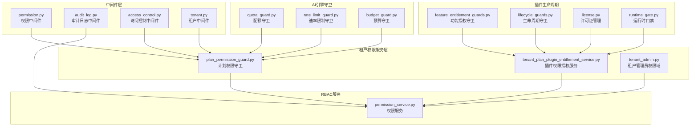
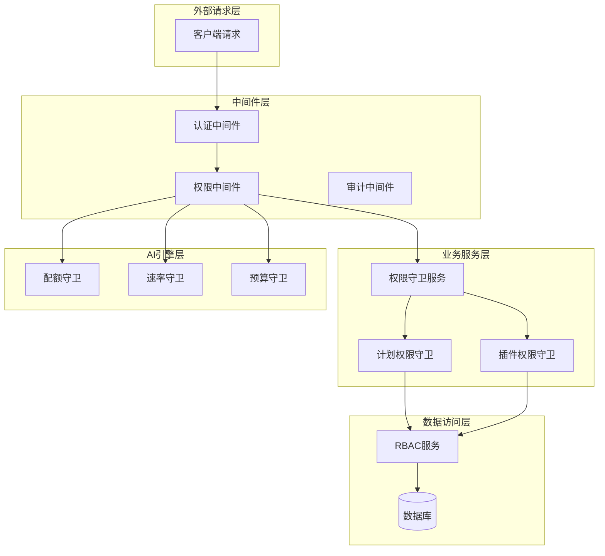
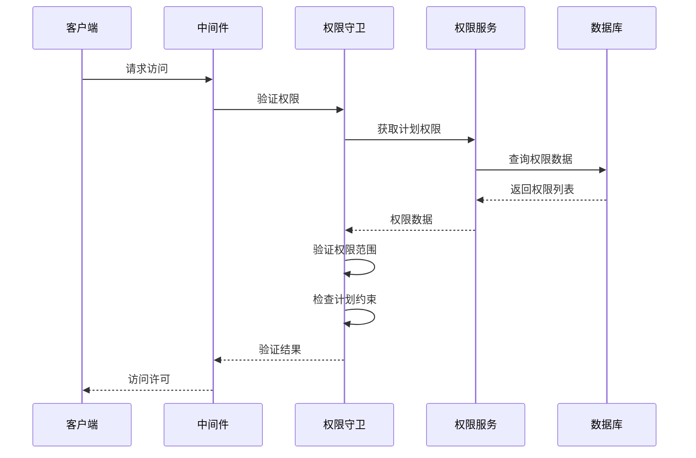
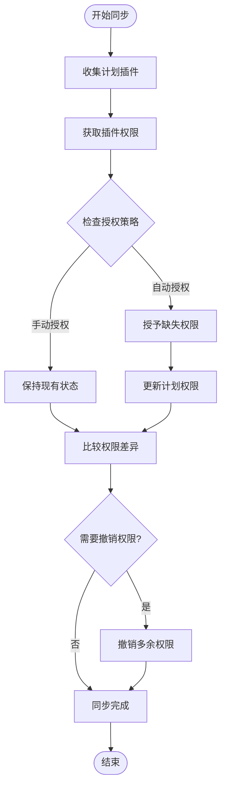
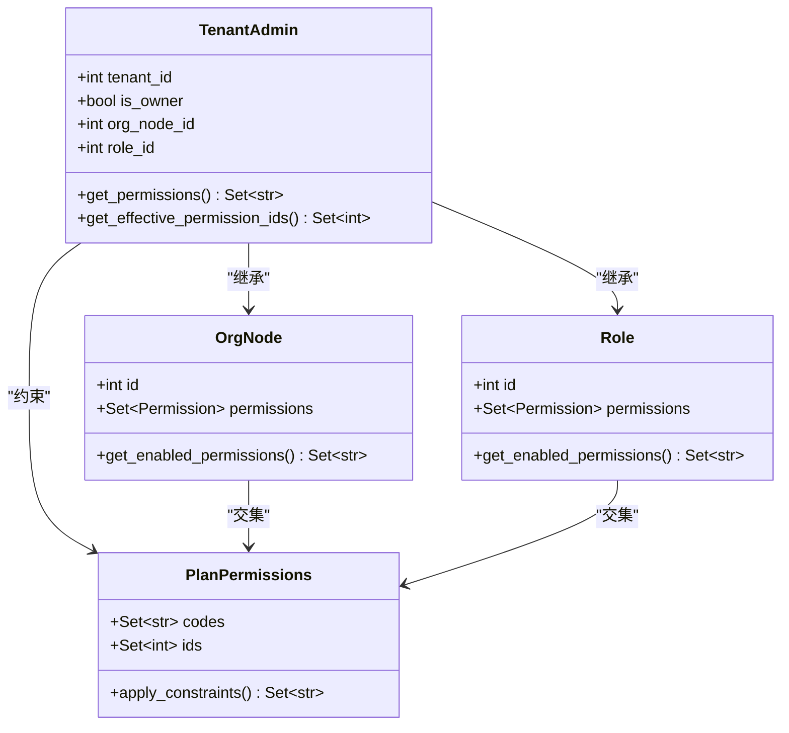
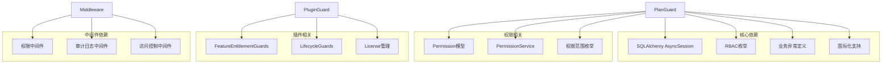

# 租户计划权限守卫

<cite>
**本文档引用的文件**
- [plan_permission_guard.py](file://backend/app/services/tenant/plan_permission_guard.py)
- [tenant_plan_plugin_entitlement_service.py](file://backend/app/services/tenant/tenant_plan_plugin_entitlement_service.py)
- [tenant_admin.py](file://backend/app/rbac/services/permission_domains/tenant_admin.py)
- [permission.py](file://backend/app/middleware/permission.py)
- [permission_service.py](file://backend/app/rbac/services/permission_service.py)
- [feature_entitlement_guards.py](file://backend/app/plugins/feature_entitlement_guards.py)
- [lifecycle_guards.py](file://backend/app/plugins/lifecycle_guards.py)
- [audit_log.py](file://backend/app/middleware/audit_log.py)
- [access_control.py](file://backend/app/middleware/access_control.py)
- [quota_guard.py](file://backend/app/ai/gateway_support/quota_guard.py)
- [rate_limit_guard.py](file://backend/app/ai/gateway_support/rate_limit_guard.py)
- [budget_guard.py](file://backend/app/ai/engine/budget_guard.py)
- [tenant_plan_preflight.py](file://backend/app/plugins/tenant_plan_preflight.py)
- [license.py](file://backend/app/plugins/license.py)
- [runtime_gate.py](file://backend/app/plugins/runtime_gate.py)
- [tenant.py](file://backend/app/middleware/tenant.py)
- [operation_log_service_parts_permissions.py](file://backend/app/services/system/operation_log_service_parts/permissions.py)
</cite>

## 目录
1. [简介](#简介)
2. [项目结构](#项目结构)
3. [核心组件](#核心组件)
4. [架构概览](#架构概览)
5. [详细组件分析](#详细组件分析)
6. [依赖关系分析](#依赖关系分析)
7. [性能考虑](#性能考虑)
8. [故障排除指南](#故障排除指南)
9. [结论](#结论)
10. [附录](#附录)

## 简介

租户计划权限守卫是 NovusAI 平台中用于管理多租户环境下权限控制的核心安全组件。该系统通过多层次的权限验证机制，确保每个租户只能访问其计划套餐所授权的功能和服务。

本系统主要包含三个核心功能模块：
- **计划权限控制**：基于租户套餐等级限制功能访问
- **功能权限验证**：实时验证用户对特定功能的访问权限
- **插件权限管理**：动态管理插件的安装、启用和权限授权

系统采用"计划约束 + 实时验证 + 动态调整"的权限管理模式，支持权限继承、功能开关管理和审计日志记录。

## 项目结构

租户计划权限守卫系统在项目中的组织结构如下：

**图表来源**
- [plan_permission_guard.py:1-31](file://backend/app/services/tenant/plan_permission_guard.py#L1-L31)
- [tenant_plan_plugin_entitlement_service.py:150-184](file://backend/app/services/tenant/tenant_plan_plugin_entitlement_service.py#L150-L184)
- [permission.py](file://backend/app/middleware/permission.py)
- [audit_log.py](file://backend/app/middleware/audit_log.py)
- [access_control.py](file://backend/app/middleware/access_control.py)

**章节来源**
- [plan_permission_guard.py:1-31](file://backend/app/services/tenant/plan_permission_guard.py#L1-L31)
- [tenant_plan_plugin_entitlement_service.py:150-184](file://backend/app/services/tenant/tenant_plan_plugin_entitlement_service.py#L150-L184)
- [tenant_admin.py:48-90](file://backend/app/rbac/services/permission_domains/tenant_admin.py#L48-L90)

## 核心组件

### 计划权限守卫服务

计划权限守卫是整个权限系统的核心，负责验证和标准化租户的权限分配。

**主要功能特性：**
- 权限ID标准化和验证
- 计划套餐约束检查
- 多作用域权限支持（租户级、全局级）
- 异常处理和错误报告

**关键实现模式：**
- 异步数据库操作
- 权限范围验证
- 批量权限处理
- 错误码标准化

**章节来源**
- [plan_permission_guard.py:17-31](file://backend/app/services/tenant/plan_permission_guard.py#L17-L31)

### 插件权限授权服务

插件权限授权服务负责管理插件与权限之间的映射关系，实现动态权限分配。

**核心功能：**
- 插件权限收集和解析
- 计划套餐权限同步
- 权限授予和撤销
- 功能开关管理

**处理流程：**
1. 收集计划所需插件
2. 获取插件权限列表
3. 计算需要授予或撤销的权限
4. 执行权限同步操作

**章节来源**
- [tenant_plan_plugin_entitlement_service.py:150-184](file://backend/app/services/tenant/tenant_plan_plugin_entitlement_service.py#L150-L184)

### 租户管理员权限域

租户管理员权限域提供基于角色的权限计算，结合计划权限进行最终权限确定。

**权限计算逻辑：**
- 计划权限作为上限约束
- 组织节点权限继承
- 角色权限叠加
- 权限交集计算

**章节来源**
- [tenant_admin.py:48-90](file://backend/app/rbac/services/permission_domains/tenant_admin.py#L48-L90)

## 架构概览

租户计划权限守卫系统采用分层架构设计，确保权限控制的灵活性和可扩展性。

**图表来源**
- [permission.py](file://backend/app/middleware/permission.py)
- [plan_permission_guard.py:17-31](file://backend/app/services/tenant/plan_permission_guard.py#L17-L31)
- [tenant_plan_plugin_entitlement_service.py:150-184](file://backend/app/services/tenant/tenant_plan_plugin_entitlement_service.py#L150-L184)

系统架构特点：
- **分层清晰**：从外到内逐层验证
- **职责分离**：不同守卫负责不同层面的权限控制
- **异步处理**：支持高并发场景
- **可扩展性**：易于添加新的权限守卫

## 详细组件分析

### 计划权限守卫实现

计划权限守卫通过以下步骤实现权限验证：

**图表来源**
- [plan_permission_guard.py:17-31](file://backend/app/services/tenant/plan_permission_guard.py#L17-L31)
- [permission.py](file://backend/app/middleware/permission.py)

**实现要点：**
- 异步数据库查询优化
- 权限范围自动检测
- 计划套餐一致性检查
- 错误处理和回退机制

**章节来源**
- [plan_permission_guard.py:17-31](file://backend/app/services/tenant/plan_permission_guard.py#L17-L31)

### 插件权限管理机制

插件权限管理采用动态授权模式，支持实时权限调整：

**图表来源**
- [tenant_plan_plugin_entitlement_service.py:150-184](file://backend/app/services/tenant/tenant_plan_plugin_entitlement_service.py#L150-L184)

**管理特性：**
- 自动/手动授权模式切换
- 权限增量更新
- 批量权限操作
- 同步状态跟踪

**章节来源**
- [tenant_plan_plugin_entitlement_service.py:150-184](file://backend/app/services/tenant/tenant_plan_plugin_entitlement_service.py#L150-L184)

### 权限继承和层次结构

系统支持多层级权限继承，确保权限计算的准确性：

**图表来源**
- [tenant_admin.py:48-90](file://backend/app/rbac/services/permission_domains/tenant_admin.py#L48-L90)

**继承规则：**
- 组织节点权限优先于角色权限
- 权限交集确保不超过计划限制
- 企业所有者权限受计划约束但无通配符

**章节来源**
- [tenant_admin.py:48-90](file://backend/app/rbac/services/permission_domains/tenant_admin.py#L48-L90)

### AI引擎权限守卫

AI引擎层的权限守卫确保AI服务调用的安全性：

| 守卫组件 | 功能描述 | 验证类型 | 防护级别 |
|---------|----------|----------|----------|
| 配额守卫 | 限制AI调用次数和频率 | 使用量检查 | 高 |
| 速率限制守卫 | 控制请求速率防止滥用 | 时间窗口统计 | 中 |
| 预算守卫 | 管理AI服务成本控制 | 费用预算检查 | 高 |

**章节来源**
- [quota_guard.py](file://backend/app/ai/gateway_support/quota_guard.py)
- [rate_limit_guard.py](file://backend/app/ai/gateway_support/rate_limit_guard.py)
- [budget_guard.py](file://backend/app/ai/engine/budget_guard.py)

## 依赖关系分析

租户计划权限守卫系统的依赖关系呈现树状结构，核心依赖包括：

**图表来源**
- [plan_permission_guard.py:3-15](file://backend/app/services/tenant/plan_permission_guard.py#L3-L15)
- [tenant_plan_plugin_entitlement_service.py:150-184](file://backend/app/services/tenant/tenant_plan_plugin_entitlement_service.py#L150-L184)

**依赖特点：**
- 核心依赖稳定且集中
- 权限服务高度内聚
- 插件系统松耦合
- 中间件层职责明确

**章节来源**
- [plan_permission_guard.py:3-15](file://backend/app/services/tenant/plan_permission_guard.py#L3-L15)
- [tenant_plan_plugin_entitlement_service.py:150-184](file://backend/app/services/tenant/tenant_plan_plugin_entitlement_service.py#L150-L184)

## 性能考虑

### 缓存策略

系统采用多层缓存机制优化性能：

- **权限缓存**：计划权限结果缓存30分钟
- **插件缓存**：插件权限映射缓存1小时
- **中间件缓存**：认证信息缓存5分钟

### 异步优化

- 数据库操作全部异步化
- 批量权限查询减少数据库往返
- 权限计算并行化处理

### 内存管理

- 权限集合使用集合类型优化查找
- 大权限列表分批处理
- 及时释放临时权限对象

## 故障排除指南

### 常见问题诊断

**权限不足错误：**
- 检查租户计划是否包含目标功能
- 验证权限ID是否正确
- 确认权限范围设置

**插件授权失败：**
- 检查插件许可证有效性
- 验证插件权限映射
- 确认授权策略配置

**性能问题：**
- 监控权限查询延迟
- 检查缓存命中率
- 分析数据库连接池使用

### 调试工具

系统提供多种调试工具：
- 权限验证日志
- 插件授权追踪
- 性能指标监控
- 错误堆栈分析

**章节来源**
- [audit_log.py](file://backend/app/middleware/audit_log.py)
- [operation_log_service_parts_permissions.py](file://backend/app/services/system/operation_log_service_parts/permissions.py)

## 结论

租户计划权限守卫系统通过多层次、多维度的权限控制机制，为 NovusAI 平台提供了强大的安全防护。系统的主要优势包括：

1. **完整性**：覆盖从计划约束到具体功能访问的全链路权限控制
2. **灵活性**：支持动态权限调整和实时验证
3. **可扩展性**：模块化设计便于功能扩展
4. **可观测性**：完善的审计日志和监控机制

该系统为多租户环境下的权限管理提供了最佳实践，既保证了安全性，又维护了良好的用户体验。

## 附录

### 配置参数说明

| 参数名称 | 类型 | 默认值 | 描述 |
|---------|------|--------|------|
| cache_ttl | int | 1800 | 权限缓存过期时间（秒） |
| max_batch_size | int | 1000 | 批量权限处理上限 |
| async_timeout | int | 30 | 异步操作超时时间（秒） |
| log_level | str | INFO | 日志记录级别 |

### 最佳实践建议

1. **权限设计**：遵循最小权限原则
2. **监控告警**：建立完整的权限使用监控
3. **定期审计**：定期审查权限分配合理性
4. **备份恢复**：建立权限配置备份机制