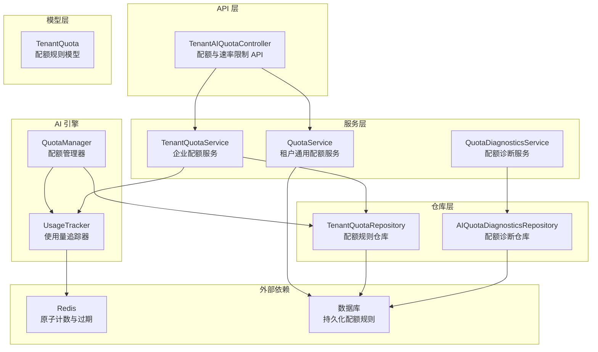
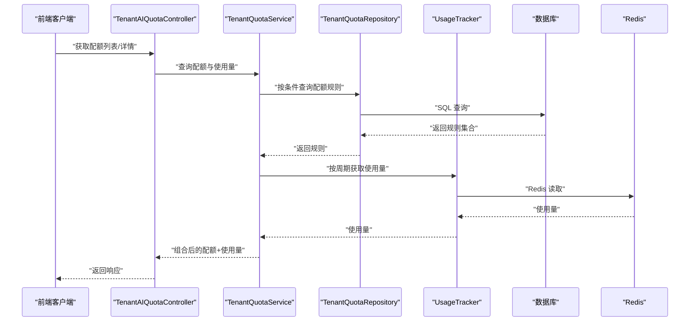
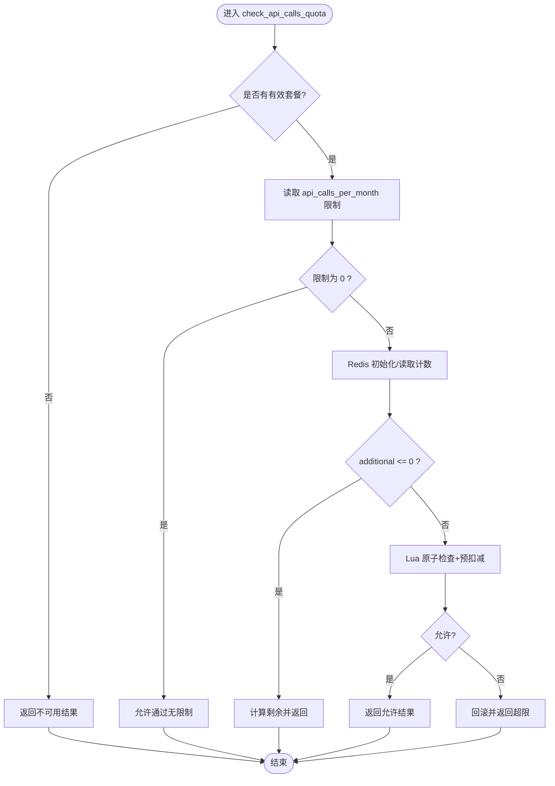
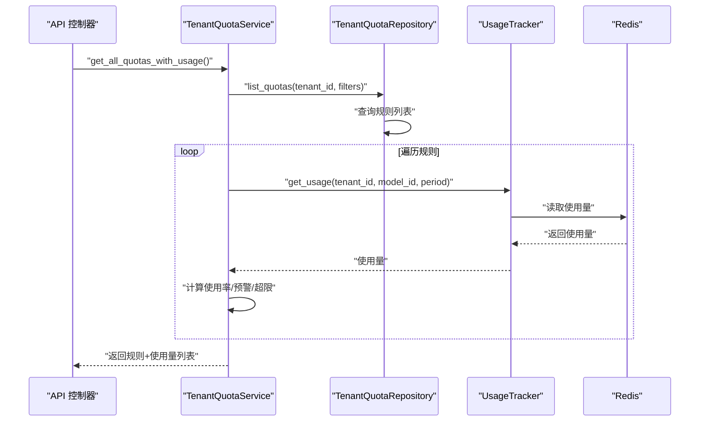
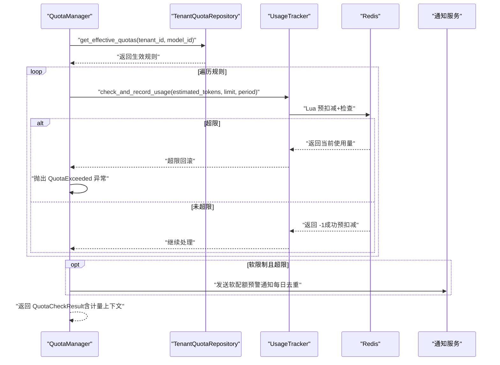
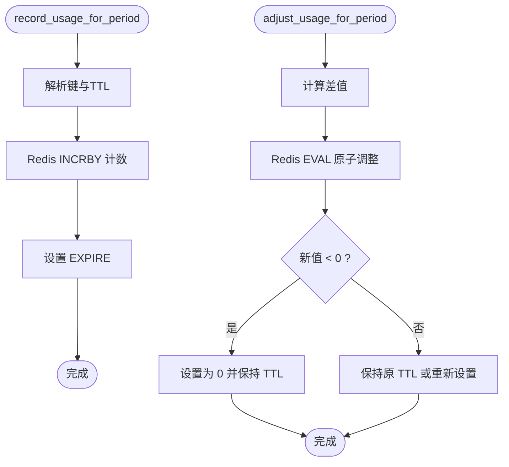
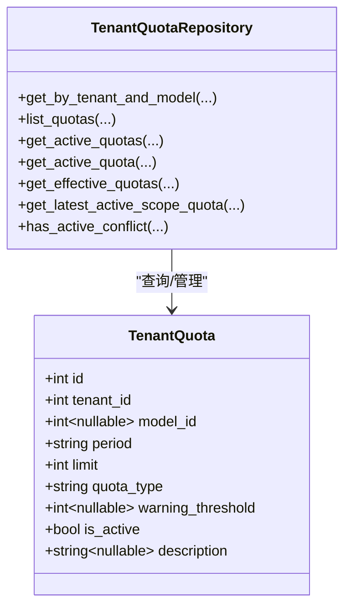
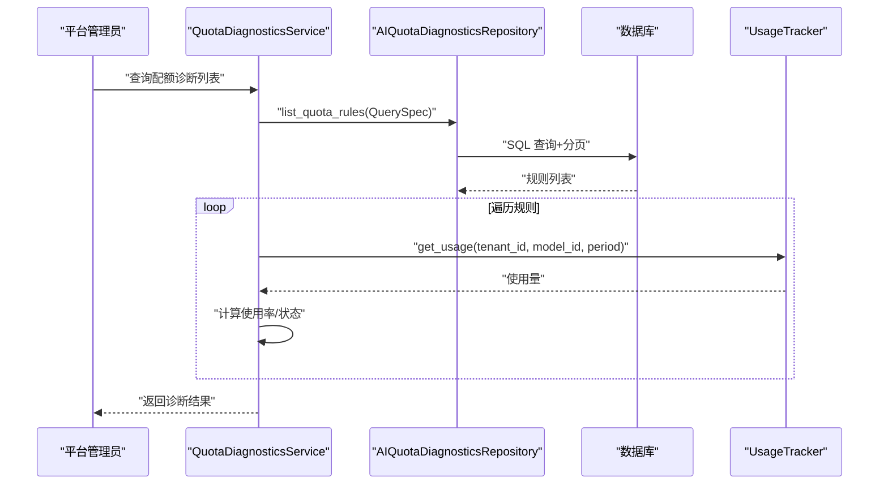
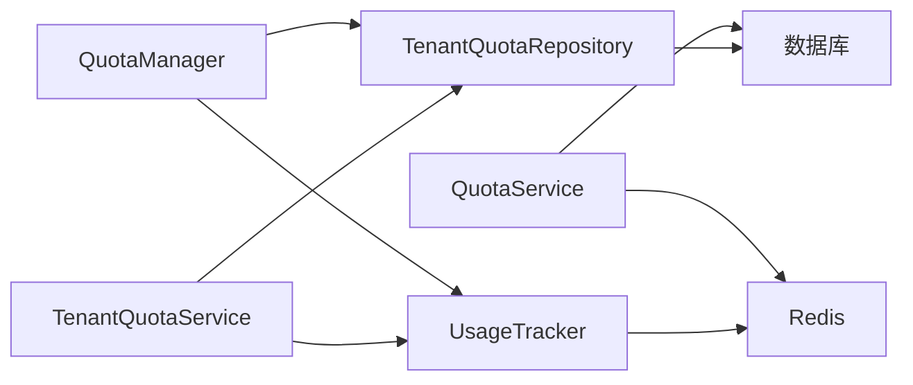

# 租户配额管理服务

<cite>
**本文档引用的文件**
- [backend/app/services/tenant/quota_service.py](file://backend/app/services/tenant/quota_service.py)
- [backend/app/ai/quota_manager.py](file://backend/app/ai/quota_manager.py)
- [backend/app/ai/quota_usage_tracker.py](file://backend/app/ai/quota_usage_tracker.py)
- [backend/app/models/ai/tenant_quota.py](file://backend/app/models/ai/tenant_quota.py)
- [backend/app/repositories/ai/tenant_quota_repository.py](file://backend/app/repositories/ai/tenant_quota_repository.py)
- [backend/app/api/tenant/ai_quotas.py](file://backend/app/api/tenant/ai_quotas.py)
- [backend/app/services/ai/tenant_quota_service.py](file://backend/app/services/ai/tenant_quota_service.py)
- [backend/app/ai/quota_models.py](file://backend/app/ai/quota_models.py)
- [backend/app/ai/quota_exceptions.py](file://backend/app/ai/quota_exceptions.py)
- [backend/app/repositories/ai/quota_diagnostics_repository.py](file://backend/app/repositories/ai/quota_diagnostics_repository.py)
- [backend/app/services/ai/quota_diagnostics_service.py](file://backend/app/services/ai/quota_diagnostics_service.py)
- [backend/app/services/tenant/tenant_role_option_service.py](file://backend/app/services/tenant/tenant_role_option_service.py)
- [frontend/apps/web-antd/src/api/tenant/ai.ts](file://frontend/apps/web-antd/src/api/tenant/ai.ts)
</cite>

## 目录
1. [简介](#简介)
2. [项目结构](#项目结构)
3. [核心组件](#核心组件)
4. [架构总览](#架构总览)
5. [详细组件分析](#详细组件分析)
6. [依赖关系分析](#依赖关系分析)
7. [性能考量](#性能考量)
8. [故障排查指南](#故障排查指南)
9. [结论](#结论)
10. [附录](#附录)

## 简介
本技术文档面向租户配额管理服务，系统性阐述资源配额控制、使用量统计与限制策略管理。文档重点覆盖以下方面：
- 配额计算模型与使用量跟踪机制
- 超限处理策略（硬限制拒绝与软限制预警）
- 租户配额服务、速率限制与存储配额管理
- 实时监控、预警通知与自动调整策略
- 配额管理的配置管理、审计日志与合规性检查

该服务采用“Redis 原子操作 + 数据库存储”的混合模式，既保证高并发下的强一致与低延迟，又通过数据库持久化实现长期统计与审计。

## 项目结构
围绕租户配额管理的关键模块分布如下：
- API 层：提供企业端配额与速率限制的 REST 接口
- 服务层：封装业务逻辑，协调仓库与外部依赖
- 仓库层：负责配额规则的查询与冲突校验
- 模型层：定义配额规则的数据结构
- AI 配额引擎：负责 AI Token 使用量的实时追踪与配额执行
- 前端 API 客户端：对接配额与速率限制的前端交互

图表来源
- [backend/app/api/tenant/ai_quotas.py:58-387](file://backend/app/api/tenant/ai_quotas.py#L58-L387)
- [backend/app/services/ai/tenant_quota_service.py:19-275](file://backend/app/services/ai/tenant_quota_service.py#L19-L275)
- [backend/app/services/tenant/quota_service.py:46-625](file://backend/app/services/tenant/quota_service.py#L46-L625)
- [backend/app/services/ai/quota_diagnostics_service.py:84-150](file://backend/app/services/ai/quota_diagnostics_service.py#L84-L150)
- [backend/app/repositories/ai/tenant_quota_repository.py:22-258](file://backend/app/repositories/ai/tenant_quota_repository.py#L22-L258)
- [backend/app/repositories/ai/quota_diagnostics_repository.py:16-192](file://backend/app/repositories/ai/quota_diagnostics_repository.py#L16-L192)
- [backend/app/models/ai/tenant_quota.py:18-121](file://backend/app/models/ai/tenant_quota.py#L18-L121)
- [backend/app/ai/quota_manager.py:22-308](file://backend/app/ai/quota_manager.py#L22-L308)
- [backend/app/ai/quota_usage_tracker.py:11-339](file://backend/app/ai/quota_usage_tracker.py#L11-L339)

章节来源
- [backend/app/api/tenant/ai_quotas.py:58-387](file://backend/app/api/tenant/ai_quotas.py#L58-L387)
- [backend/app/services/ai/tenant_quota_service.py:19-275](file://backend/app/services/ai/tenant_quota_service.py#L19-L275)
- [backend/app/services/tenant/quota_service.py:46-625](file://backend/app/services/tenant/quota_service.py#L46-L625)
- [backend/app/repositories/ai/tenant_quota_repository.py:22-258](file://backend/app/repositories/ai/tenant_quota_repository.py#L22-L258)
- [backend/app/models/ai/tenant_quota.py:18-121](file://backend/app/models/ai/tenant_quota.py#L18-L121)
- [backend/app/ai/quota_manager.py:22-308](file://backend/app/ai/quota_manager.py#L22-L308)
- [backend/app/ai/quota_usage_tracker.py:11-339](file://backend/app/ai/quota_usage_tracker.py#L11-L339)

## 核心组件
- 租户通用配额服务（QuotaService）：提供存储、用户数、管理员数、自定义域名、API 调用次数、文件大小等配额检查能力，支持“企业覆盖 > 套餐默认”的优先级策略，并通过数据库行级锁避免并发超配。
- 企业 AI 配额服务（TenantQuotaService）：提供配额规则的增删改查、使用量聚合与预警状态检查，支持按模型与周期（日/月）查询。
- AI 配额管理器（QuotaManager）：在请求阶段进行配额检查与预扣减，在响应阶段根据实际 Token 数量进行调整；支持硬限制（拒绝）与软限制（预警）两种策略。
- 使用量追踪器（UsageTracker）：基于 Redis 的原子计数与 TTL 管理，提供每日/每月 Token 使用量的读取、记录、调整与预扣减检查。
- 配额规则模型（TenantQuota）：定义配额周期、类型（硬/软）、预警阈值、启用状态等字段。
- 配额规则仓库（TenantQuotaRepository）：提供按模型/周期/启用状态的查询、生效规则合并（模型优先、全局回退）与冲突检测。
- 诊断服务与仓库：为平台管理员提供配额与速率限制的诊断视图，支持分页、过滤与排序。

章节来源
- [backend/app/services/tenant/quota_service.py:46-625](file://backend/app/services/tenant/quota_service.py#L46-L625)
- [backend/app/services/ai/tenant_quota_service.py:19-275](file://backend/app/services/ai/tenant_quota_service.py#L19-L275)
- [backend/app/ai/quota_manager.py:22-308](file://backend/app/ai/quota_manager.py#L22-L308)
- [backend/app/ai/quota_usage_tracker.py:11-339](file://backend/app/ai/quota_usage_tracker.py#L11-L339)
- [backend/app/models/ai/tenant_quota.py:18-121](file://backend/app/models/ai/tenant_quota.py#L18-L121)
- [backend/app/repositories/ai/tenant_quota_repository.py:22-258](file://backend/app/repositories/ai/tenant_quota_repository.py#L22-L258)
- [backend/app/services/ai/quota_diagnostics_service.py:84-150](file://backend/app/services/ai/quota_diagnostics_service.py#L84-L150)
- [backend/app/repositories/ai/quota_diagnostics_repository.py:16-192](file://backend/app/repositories/ai/quota_diagnostics_repository.py#L16-L192)

## 架构总览
租户配额管理服务采用分层架构：
- 控制器层：接收前端请求，调用服务层完成业务处理
- 服务层：封装配额检查、规则管理与使用量聚合
- 仓库层：提供规则查询与冲突校验
- 引擎层：AI Token 使用量的实时追踪与配额执行
- 外部依赖：Redis 用于高并发原子计数，数据库用于持久化

图表来源
- [backend/app/api/tenant/ai_quotas.py:75-128](file://backend/app/api/tenant/ai_quotas.py#L75-L128)
- [backend/app/services/ai/tenant_quota_service.py:50-129](file://backend/app/services/ai/tenant_quota_service.py#L50-L129)
- [backend/app/repositories/ai/tenant_quota_repository.py:68-106](file://backend/app/repositories/ai/tenant_quota_repository.py#L68-L106)
- [backend/app/ai/quota_usage_tracker.py:260-278](file://backend/app/ai/quota_usage_tracker.py#L260-L278)

## 详细组件分析

### 租户通用配额服务（QuotaService）
- 功能要点
  - 存储配额：支持 GB 限制与字节换算，0 表示无限制
  - 用户/管理员/域名配额：通过数据库行级锁避免并发超配
  - API 调用次数配额：基于 Redis 原子计数与 TTL，Lua 脚本实现“预扣减+检查”
  - 文件大小限制：MB 限制，0 表示无限制
  - 特性开关：支持从企业覆盖或套餐默认读取
- 关键流程
  - 月度 API 调用计数初始化：若 Redis 中不存在，则从数据库统计当月调用并写入 Redis，设置 TTL
  - 预扣减检查：Lua 脚本原子地增加计数并检查是否超过限制，超限时回滚
  - 结果封装：返回允许状态、当前使用量、限制、剩余量与消息

图表来源
- [backend/app/services/tenant/quota_service.py:438-500](file://backend/app/services/tenant/quota_service.py#L438-L500)
- [backend/app/services/tenant/quota_service.py:103-128](file://backend/app/services/tenant/quota_service.py#L103-L128)
- [backend/app/services/tenant/quota_service.py:55-63](file://backend/app/services/tenant/quota_service.py#L55-L63)

章节来源
- [backend/app/services/tenant/quota_service.py:230-536](file://backend/app/services/tenant/quota_service.py#L230-L536)

### 企业 AI 配额服务（TenantQuotaService）
- 功能要点
  - 规则 CRUD：创建、查询、更新、删除配额规则
  - 使用量聚合：按周期与模型获取使用量并计算使用率、预警与超限状态
  - 冲突检测：同一租户+作用域+周期下仅能存在一个启用规则
- 关键流程
  - 获取配额与使用量：组合规则与 Redis 使用量，计算使用率与状态
  - 列表查询：支持按周期、模型、启用状态过滤
  - 创建/更新前置校验：冲突检测与错误提示

图表来源
- [backend/app/services/ai/tenant_quota_service.py:101-129](file://backend/app/services/ai/tenant_quota_service.py#L101-L129)
- [backend/app/repositories/ai/tenant_quota_repository.py:68-106](file://backend/app/repositories/ai/tenant_quota_repository.py#L68-L106)
- [backend/app/ai/quota_usage_tracker.py:260-278](file://backend/app/ai/quota_usage_tracker.py#L260-L278)

章节来源
- [backend/app/services/ai/tenant_quota_service.py:19-275](file://backend/app/services/ai/tenant_quota_service.py#L19-L275)
- [backend/app/repositories/ai/tenant_quota_repository.py:22-258](file://backend/app/repositories/ai/tenant_quota_repository.py#L22-L258)

### AI 配额管理器（QuotaManager）
- 功能要点
  - 请求阶段：按生效规则（模型优先、全局回退）进行硬/软限制检查
  - 硬限制：预扣减 Redis 计数，超限则抛出配额超限异常
  - 软限制：记录预警，每天最多一次通知
  - 响应阶段：根据实际 Token 数量调整使用量（硬限制回写，软限制追加）
- 关键流程
  - 生效规则合并：按周期分别取模型专属规则或全局规则
  - 预扣减与检查：使用 Redis 原子脚本，避免竞态
  - 通知策略：按租户+模型+周期+日期去重，每日仅一次

图表来源
- [backend/app/ai/quota_manager.py:40-139](file://backend/app/ai/quota_manager.py#L40-L139)
- [backend/app/ai/quota_usage_tracker.py:151-194](file://backend/app/ai/quota_usage_tracker.py#L151-L194)
- [backend/app/ai/quota_exceptions.py:8-16](file://backend/app/ai/quota_exceptions.py#L8-L16)

章节来源
- [backend/app/ai/quota_manager.py:22-308](file://backend/app/ai/quota_manager.py#L22-L308)
- [backend/app/ai/quota_usage_tracker.py:11-339](file://backend/app/ai/quota_usage_tracker.py#L11-L339)
- [backend/app/ai/quota_exceptions.py:8-16](file://backend/app/ai/quota_exceptions.py#L8-L16)

### 使用量追踪器（UsageTracker）
- 功能要点
  - 日/月维度使用量读取与记录
  - 原子调整：INCRBY + TTL 管理，不足 0 保护
  - 预扣减+检查：Lua 脚本实现“预扣减成功返回 -1，否则回滚并返回当前使用量”
- 关键流程
  - 键命名规范：按前缀+租户+模型+日期/年月生成
  - TTL 设计：日维度短 TTL，月维度长 TTL，到期自动清理
  - 调整策略：硬限制回写，软限制追加

图表来源
- [backend/app/ai/quota_usage_tracker.py:281-336](file://backend/app/ai/quota_usage_tracker.py#L281-L336)

章节来源
- [backend/app/ai/quota_usage_tracker.py:11-339](file://backend/app/ai/quota_usage_tracker.py#L11-L339)

### 配额规则模型与仓库
- TenantQuota 模型
  - 字段：周期（日/月）、限制（Token）、类型（硬/软）、预警阈值、启用状态、描述、模型关联
  - 过滤与排序：支持按周期、类型、启用状态等过滤与排序
- 仓库方法
  - 按租户+模型+周期+启用状态查询
  - 生效规则合并：模型专属优先，否则回退到全局规则
  - 冲突检测：同一作用域+周期仅允许一个启用规则

图表来源
- [backend/app/models/ai/tenant_quota.py:18-121](file://backend/app/models/ai/tenant_quota.py#L18-L121)
- [backend/app/repositories/ai/tenant_quota_repository.py:22-258](file://backend/app/repositories/ai/tenant_quota_repository.py#L22-L258)

章节来源
- [backend/app/models/ai/tenant_quota.py:18-121](file://backend/app/models/ai/tenant_quota.py#L18-L121)
- [backend/app/repositories/ai/tenant_quota_repository.py:22-258](file://backend/app/repositories/ai/tenant_quota_repository.py#L22-L258)

### 诊断与监控
- 平台诊断服务
  - 列出所有配额与速率限制规则，支持分页、过滤与排序
  - 计算使用率、预警阈值、是否超限与是否为最新规则
- 前端集成
  - 企业端配额与速率限制 API，支持列表、详情、创建、更新、删除
  - 前端通过 API 客户端进行配额 CRUD 与速率限制查询

图表来源
- [backend/app/services/ai/quota_diagnostics_service.py:84-150](file://backend/app/services/ai/quota_diagnostics_service.py#L84-L150)
- [backend/app/repositories/ai/quota_diagnostics_repository.py:27-74](file://backend/app/repositories/ai/quota_diagnostics_repository.py#L27-L74)

章节来源
- [backend/app/services/ai/quota_diagnostics_service.py:84-150](file://backend/app/services/ai/quota_diagnostics_service.py#L84-L150)
- [backend/app/repositories/ai/quota_diagnostics_repository.py:16-192](file://backend/app/repositories/ai/quota_diagnostics_repository.py#L16-L192)
- [backend/app/api/tenant/ai_quotas.py:136-180](file://backend/app/api/tenant/ai_quotas.py#L136-L180)
- [frontend/apps/web-antd/src/api/tenant/ai.ts:471-513](file://frontend/apps/web-antd/src/api/tenant/ai.ts#L471-L513)

## 依赖关系分析
- 组件耦合
  - QuotaManager 依赖 TenantQuotaRepository 获取生效规则，依赖 UsageTracker 执行使用量检查与调整
  - TenantQuotaService 依赖 TenantQuotaRepository 与 UsageTracker 提供配额与使用量聚合
  - QuotaService 依赖数据库与 Redis，提供通用配额检查
- 外部依赖
  - Redis：提供原子计数、TTL 管理与通知去重缓存
  - 数据库：持久化配额规则与审计日志
- 可能的循环依赖
  - 未发现直接循环依赖；各层职责清晰，通过服务层解耦

图表来源
- [backend/app/ai/quota_manager.py:22-308](file://backend/app/ai/quota_manager.py#L22-L308)
- [backend/app/services/ai/tenant_quota_service.py:19-275](file://backend/app/services/ai/tenant_quota_service.py#L19-L275)
- [backend/app/services/tenant/quota_service.py:46-625](file://backend/app/services/tenant/quota_service.py#L46-L625)
- [backend/app/ai/quota_usage_tracker.py:11-339](file://backend/app/ai/quota_usage_tracker.py#L11-L339)
- [backend/app/repositories/ai/tenant_quota_repository.py:22-258](file://backend/app/repositories/ai/tenant_quota_repository.py#L22-L258)

章节来源
- [backend/app/ai/quota_manager.py:22-308](file://backend/app/ai/quota_manager.py#L22-L308)
- [backend/app/services/ai/tenant_quota_service.py:19-275](file://backend/app/services/ai/tenant_quota_service.py#L19-L275)
- [backend/app/services/tenant/quota_service.py:46-625](file://backend/app/services/tenant/quota_service.py#L46-L625)
- [backend/app/ai/quota_usage_tracker.py:11-339](file://backend/app/ai/quota_usage_tracker.py#L11-L339)
- [backend/app/repositories/ai/tenant_quota_repository.py:22-258](file://backend/app/repositories/ai/tenant_quota_repository.py#L22-L258)

## 性能考量
- Redis 原子操作
  - 使用 Lua 脚本实现“预扣减+检查”与“原子调整”，避免竞态与一致性问题
  - TTL 策略：日维度短 TTL，月维度长 TTL，减少内存占用与过期风暴
- 数据库行级锁
  - 在用户/管理员/域名配额检查中使用行级锁，避免并发超配
- 缓存与批量查询
  - 企业端角色选项服务批量获取存储统计，减少多次查询开销
- 前端 API
  - 通过 include_usage 参数一次性返回配额与使用量，降低往返次数

章节来源
- [backend/app/ai/quota_usage_tracker.py:22-55](file://backend/app/ai/quota_usage_tracker.py#L22-L55)
- [backend/app/ai/quota_usage_tracker.py:305-336](file://backend/app/ai/quota_usage_tracker.py#L305-L336)
- [backend/app/services/tenant/quota_service.py:143-153](file://backend/app/services/tenant/quota_service.py#L143-L153)
- [backend/app/services/tenant/tenant_role_option_service.py:72-111](file://backend/app/services/tenant/tenant_role_option_service.py#L72-L111)
- [frontend/apps/web-antd/src/api/tenant/ai.ts:471-513](file://frontend/apps/web-antd/src/api/tenant/ai.ts#L471-L513)

## 故障排查指南
- 配额超限异常
  - 现象：QuotaExceeded 异常，响应状态码 429
  - 排查：确认配额规则类型（硬/软）、周期与模型匹配、Redis 预扣减是否成功
- 速率限制冲突
  - 现象：创建/更新配额时报重复启用规则
  - 排查：检查同一租户+作用域+周期是否存在多个启用规则
- Redis 计数异常
  - 现象：使用量不正确或持续增长
  - 排查：检查 Lua 脚本执行结果、TTL 设置与键命名规范
- 通知未触发
  - 现象：软配额超限未收到预警
  - 排查：确认通知去重键是否已存在、模板代码与收件人列表

章节来源
- [backend/app/ai/quota_exceptions.py:8-16](file://backend/app/ai/quota_exceptions.py#L8-L16)
- [backend/app/services/ai/tenant_quota_service.py:237-272](file://backend/app/services/ai/tenant_quota_service.py#L237-L272)
- [backend/app/ai/quota_manager.py:235-284](file://backend/app/ai/quota_manager.py#L235-L284)

## 结论
租户配额管理服务通过“Redis 原子计数 + 数据库持久化”的设计，在高并发场景下实现了可靠的配额控制与使用量统计。服务支持硬/软两种限制策略、多周期与多模型的灵活配置，并提供完善的诊断与监控能力。结合前端 API 与通知机制，能够满足企业级租户在资源配额、速率限制与存储管理方面的多样化需求。

## 附录
- 前端 API 路径
  - 创建配额：POST /api/tenant/ai/quotas
  - 更新配额：PUT /api/tenant/ai/quotas/{quota_id}
  - 删除配额：DELETE /api/tenant/ai/quotas/{quota_id}
  - 获取配额列表：GET /api/tenant/ai/quotas
  - 获取速率限制列表：GET /api/tenant/ai/quotas/rate-limits
  - 获取有效速率限制：GET /api/tenant/ai/quotas/rate-limits/effective/{model_id}

章节来源
- [frontend/apps/web-antd/src/api/tenant/ai.ts:471-513](file://frontend/apps/web-antd/src/api/tenant/ai.ts#L471-L513)