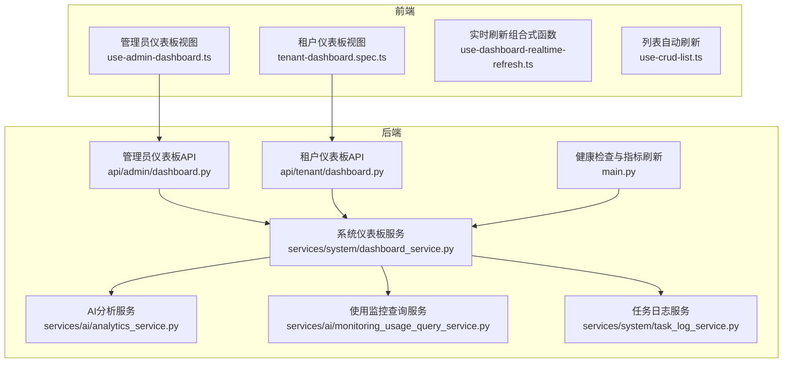
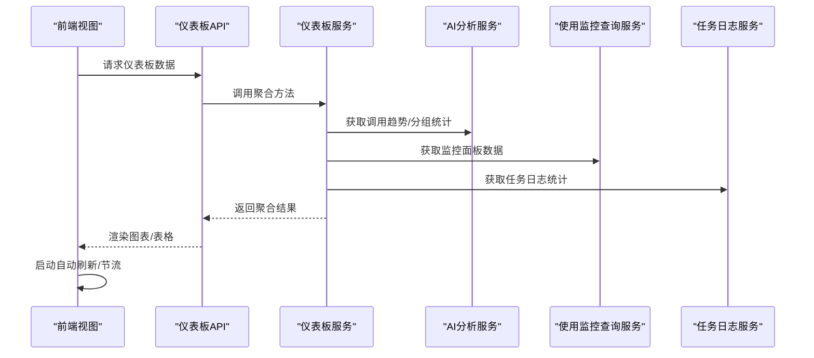
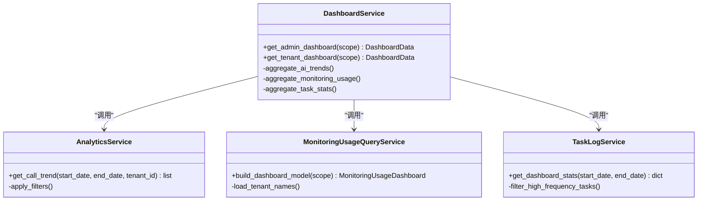
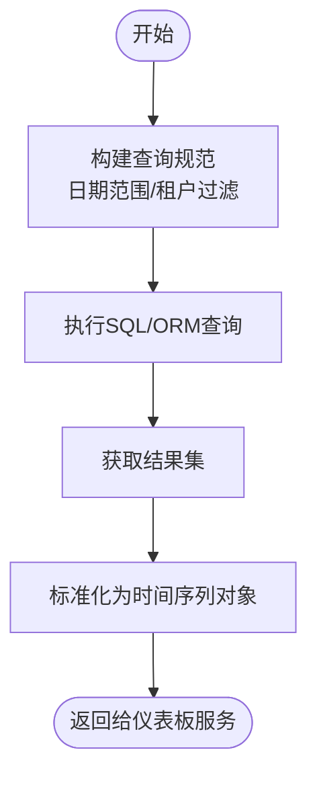
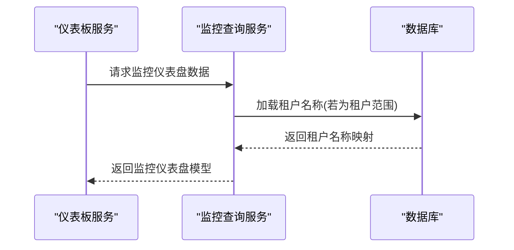
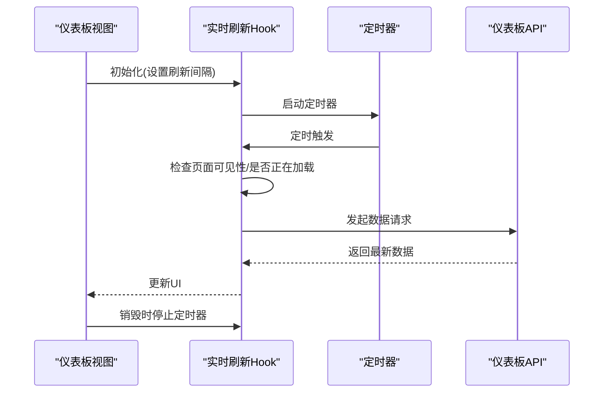
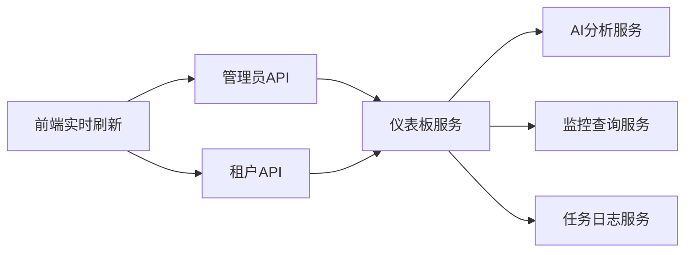

# 仪表板分析服务

<cite>
**本文档引用的文件**
- [dashboard_service.py](file://backend/app/services/system/dashboard_service.py)
- [analytics_service.py](file://backend/app/services/ai/analytics_service.py)
- [monitoring_usage_query_service.py](file://backend/app/services/ai/monitoring_usage_query_service.py)
- [dashboard.py（管理员）](file://backend/app/api/admin/dashboard.py)
- [dashboard.py（租户）](file://backend/app/api/tenant/dashboard.py)
- [task_log_service.py](file://backend/app/services/system/task_log_service.py)
- [use-dashboard-realtime-refresh.ts](file://frontend/apps/web-antd/src/views/_shared/dashboard/use-dashboard-realtime-refresh.ts)
- [use-monitoring-usage-dashboard.ts](file://frontend/apps/web-antd/src/features/ai-monitoring/pages/monitoring-usage/use-monitoring-usage-dashboard.ts)
- [tenant-dashboard.spec.ts](file://frontend/apps/web-antd/__tests__/e2e/tenant-dashboard.spec.ts)
- [admin-dashboard.spec.ts](file://frontend/apps/web-antd/__tests__/e2e/admin-dashboard.spec.ts)
- [dashboard.json（管理员）](file://frontend/apps/web-antd/src/locales/langs/zh-CN/admin/dashboard.json)
- [dashboard.json（租户）](file://frontend/apps/web-antd/src/locales/langs/zh-CN/tenant/dashboard.json)
- [dashboard.json（用户）](file://frontend/apps/web-antd/src/locales/langs/zh-CN/user/dashboard.json)
- [main.py](file://backend/app/main.py)
- [use-crud-list.ts](file://frontend/apps/web-antd/src/composables/use-crud-list.ts)
</cite>

## 目录
1. [简介](#简介)
2. [项目结构](#项目结构)
3. [核心组件](#核心组件)
4. [架构总览](#架构总览)
5. [详细组件分析](#详细组件分析)
6. [依赖关系分析](#依赖关系分析)
7. [性能考虑](#性能考虑)
8. [故障排查指南](#故障排查指南)
9. [结论](#结论)
10. [附录](#附录)

## 简介
本文件面向“仪表板分析服务”的技术文档，聚焦于系统仪表板的数据聚合、可视化展示与实时更新机制；阐述权限分级、数据隔离与个性化配置能力；梳理活动统计、租户分析与管理员视图的数据处理流程；说明组件化设计、数据源管理与性能优化策略；并提供自定义指标、图表类型与布局配置的扩展指引，以及缓存策略、数据刷新与用户体验优化建议。

## 项目结构
仪表板分析服务由后端服务层、API 层与前端视图层协同完成，覆盖管理员与租户两个维度，并通过任务日志与 AI 使用监控等数据源提供聚合能力。

**图表来源**
- [dashboard_service.py](file://backend/app/services/system/dashboard_service.py)
- [analytics_service.py](file://backend/app/services/ai/analytics_service.py)
- [monitoring_usage_query_service.py](file://backend/app/services/ai/monitoring_usage_query_service.py)
- [dashboard.py（管理员）](file://backend/app/api/admin/dashboard.py)
- [dashboard.py（租户）](file://backend/app/api/tenant/dashboard.py)
- [task_log_service.py](file://backend/app/services/system/task_log_service.py)
- [use-dashboard-realtime-refresh.ts](file://frontend/apps/web-antd/src/views/_shared/dashboard/use-dashboard-realtime-refresh.ts)
- [use-crud-list.ts](file://frontend/apps/web-antd/src/composables/use-crud-list.ts)
- [main.py](file://backend/app/main.py)

**章节来源**
- [dashboard_service.py](file://backend/app/services/system/dashboard_service.py)
- [analytics_service.py](file://backend/app/services/ai/analytics_service.py)
- [monitoring_usage_query_service.py](file://backend/app/services/ai/monitoring_usage_query_service.py)
- [dashboard.py（管理员）](file://backend/app/api/admin/dashboard.py)
- [dashboard.py（租户）](file://backend/app/api/tenant/dashboard.py)
- [task_log_service.py](file://backend/app/services/system/task_log_service.py)
- [use-dashboard-realtime-refresh.ts](file://frontend/apps/web-antd/src/views/_shared/dashboard/use-dashboard-realtime-refresh.ts)
- [use-crud-list.ts](file://frontend/apps/web-antd/src/composables/use-crud-list.ts)
- [main.py](file://backend/app/main.py)

## 核心组件
- 系统仪表板服务：负责聚合多源数据，生成管理员与租户视图所需的汇总信息与趋势数据。
- AI 分析服务：提供调用趋势、按日期/租户过滤的统计口径，支撑时间序列与分组统计。
- 使用监控查询服务：封装监控仪表盘的数据模型与聚合逻辑，支持按范围、租户与维度进行统计。
- 任务日志服务：提供基于日期范围的任务执行统计，作为系统运行状态与负载的参考指标。
- 前端实时刷新组合式函数：统一管理仪表板的自动刷新、节流与可见性感知，提升用户体验。
- 健康检查与指标刷新：在 Prometheus 抓取前主动刷新数据库与 Redis 的健康状态，确保指标准确性。

**章节来源**
- [dashboard_service.py](file://backend/app/services/system/dashboard_service.py)
- [analytics_service.py](file://backend/app/services/ai/analytics_service.py)
- [monitoring_usage_query_service.py](file://backend/app/services/ai/monitoring_usage_query_service.py)
- [task_log_service.py](file://backend/app/services/system/task_log_service.py)
- [use-dashboard-realtime-refresh.ts](file://frontend/apps/web-antd/src/views/_shared/dashboard/use-dashboard-realtime-refresh.ts)
- [main.py](file://backend/app/main.py)

## 架构总览
仪表板服务采用“API → 服务 → 数据源”的分层设计，后端通过服务层聚合来自不同表/模块的数据，前端通过组合式函数与自动刷新策略实现近实时的可视化更新。

**图表来源**
- [dashboard.py（管理员）](file://backend/app/api/admin/dashboard.py)
- [dashboard.py（租户）](file://backend/app/api/tenant/dashboard.py)
- [dashboard_service.py](file://backend/app/services/system/dashboard_service.py)
- [analytics_service.py](file://backend/app/services/ai/analytics_service.py)
- [monitoring_usage_query_service.py](file://backend/app/services/ai/monitoring_usage_query_service.py)
- [task_log_service.py](file://backend/app/services/system/task_log_service.py)
- [use-dashboard-realtime-refresh.ts](file://frontend/apps/web-antd/src/views/_shared/dashboard/use-dashboard-realtime-refresh.ts)

## 详细组件分析

### 系统仪表板服务（聚合中枢）
- 职责：整合 AI 调用趋势、监控使用统计、任务日志统计与租户/组织上下文，输出管理员与租户视图所需的数据结构。
- 关键点：
  - 权限与范围：根据当前身份与租户上下文限定数据范围，确保数据隔离。
  - 统一聚合：对多源数据进行去重、合并与格式化，保证返回结构稳定。
  - 可扩展：预留扩展点以接入更多数据源（如存储用量、插件使用等）。

**图表来源**
- [dashboard_service.py](file://backend/app/services/system/dashboard_service.py)
- [analytics_service.py](file://backend/app/services/ai/analytics_service.py)
- [monitoring_usage_query_service.py](file://backend/app/services/ai/monitoring_usage_query_service.py)
- [task_log_service.py](file://backend/app/services/system/task_log_service.py)

**章节来源**
- [dashboard_service.py](file://backend/app/services/system/dashboard_service.py)

### AI 分析服务（调用趋势与分组统计）
- 职责：提供按日期范围的调用次数、Token 消耗、模型分布等趋势数据；支持按租户过滤。
- 关键点：
  - 过滤器：支持起止日期、租户 ID、平台租户零值保留过滤等。
  - 输出：标准化的时间序列对象，便于前端折线/柱状图渲染。
  - 测试覆盖：包含日期过滤、租户过滤与边界条件的单元测试。

**图表来源**
- [analytics_service.py](file://backend/app/services/ai/analytics_service.py)

**章节来源**
- [analytics_service.py](file://backend/app/services/ai/analytics_service.py)

### 使用监控查询服务（监控仪表盘模型）
- 职责：封装监控仪表盘的数据模型，按范围与租户加载名称，组装完整监控视图。
- 关键点：
  - 租户名称映射：在租户范围下加载租户名，用于展示与分组。
  - 模型装配：将摘要、每日统计、模型统计、访问渠道、Top 排行等字段组装为统一视图。

**图表来源**
- [monitoring_usage_query_service.py](file://backend/app/services/ai/monitoring_usage_query_service.py)

**章节来源**
- [monitoring_usage_query_service.py](file://backend/app/services/ai/monitoring_usage_query_service.py)

### 任务日志服务（系统运行状态参考）
- 职责：提供按日期范围的任务执行统计，区分内部高频任务与执行视图，辅助管理员评估系统负载。
- 关键点：
  - 视图隔离：内部视图包含高频任务，执行视图排除高频任务，避免噪声干扰。
  - 聚合口径：按日期聚合任务数量与状态分布。

**章节来源**
- [task_log_service.py](file://backend/app/services/system/task_log_service.py)

### 前端实时刷新与自动刷新
- 实时刷新组合式函数：统一管理仪表板的自动刷新周期、可见性感知与节流，避免后台标签页或慢请求导致的重复请求。
- 列表自动刷新：在 CRUD 场景中，提供自动刷新开关、定时器生命周期管理与 KeepAlive 场景下的暂停/恢复。

**图表来源**
- [use-dashboard-realtime-refresh.ts](file://frontend/apps/web-antd/src/views/_shared/dashboard/use-dashboard-realtime-refresh.ts)
- [use-crud-list.ts](file://frontend/apps/web-antd/src/composables/use-crud-list.ts)

**章节来源**
- [use-dashboard-realtime-refresh.ts](file://frontend/apps/web-antd/src/views/_shared/dashboard/use-dashboard-realtime-refresh.ts)
- [use-crud-list.ts](file://frontend/apps/web-antd/src/composables/use-crud-list.ts)

### API 层（管理员与租户）
- 管理员仪表板 API：面向平台级管理员，提供全局视角的活动统计、租户分析与系统运行概览。
- 租户仪表板 API：面向租户用户，提供租户内的调用趋势、资源使用与近期活动等数据。
- 共同点：均调用仪表板服务进行数据聚合，并返回结构化的响应体供前端渲染。

**章节来源**
- [dashboard.py（管理员）](file://backend/app/api/admin/dashboard.py)
- [dashboard.py（租户）](file://backend/app/api/tenant/dashboard.py)

### 健康检查与指标刷新（后端）
- 在 Prometheus 抓取前主动刷新组件健康状态，避免仅依赖就绪探针副作用导致的指标延迟。
- 包含数据库与 Redis 的健康检查与超时控制，确保指标准确反映运行状态。

**章节来源**
- [main.py](file://backend/app/main.py)

## 依赖关系分析
- 低耦合高内聚：API 层仅负责路由与参数校验，业务逻辑集中在服务层；服务层再按需调用分析与监控模块。
- 外部依赖：数据库、Redis（健康检查）、前端 Vue 生态（组合式函数与自动刷新）。
- 扩展点：服务层预留扩展接口，便于接入新的数据源或统计口径。

**图表来源**
- [dashboard.py（管理员）](file://backend/app/api/admin/dashboard.py)
- [dashboard.py（租户）](file://backend/app/api/tenant/dashboard.py)
- [dashboard_service.py](file://backend/app/services/system/dashboard_service.py)
- [analytics_service.py](file://backend/app/services/ai/analytics_service.py)
- [monitoring_usage_query_service.py](file://backend/app/services/ai/monitoring_usage_query_service.py)
- [task_log_service.py](file://backend/app/services/system/task_log_service.py)
- [use-dashboard-realtime-refresh.ts](file://frontend/apps/web-antd/src/views/_shared/dashboard/use-dashboard-realtime-refresh.ts)

**章节来源**
- [dashboard.py（管理员）](file://backend/app/api/admin/dashboard.py)
- [dashboard.py（租户）](file://backend/app/api/tenant/dashboard.py)
- [dashboard_service.py](file://backend/app/services/system/dashboard_service.py)
- [analytics_service.py](file://backend/app/services/ai/analytics_service.py)
- [monitoring_usage_query_service.py](file://backend/app/services/ai/monitoring_usage_query_service.py)
- [task_log_service.py](file://backend/app/services/system/task_log_service.py)
- [use-dashboard-realtime-refresh.ts](file://frontend/apps/web-antd/src/views/_shared/dashboard/use-dashboard-realtime-refresh.ts)

## 性能考虑
- 前端节流与可见性感知：避免后台标签页或慢请求导致的重复请求，降低后端压力。
- 后端健康指标预刷新：在 Prometheus 抓取前主动刷新数据库与 Redis 健康状态，减少指标抖动。
- 查询优化：AI 分析服务支持日期范围与租户过滤，建议前端默认限制时间跨度，避免全量扫描。
- 缓存策略：可结合 Redis 或本地内存缓存热点时间段的趋势数据，缩短响应时间。

[本节为通用性能建议，不直接分析具体文件]

## 故障排查指南
- 健康检查失败：查看后端健康检查日志，确认数据库连接与 Redis 可达性。
- 前端无数据或长时间加载：检查自动刷新配置与定时器状态，确认页面可见性判断逻辑。
- 租户数据为空：核对租户上下文与过滤参数，确保租户 ID 传入正确。
- 图表异常：检查时间序列数据格式与日期范围，确保前端渲染组件接收到了预期结构。

**章节来源**
- [main.py](file://backend/app/main.py)
- [use-dashboard-realtime-refresh.ts](file://frontend/apps/web-antd/src/views/_shared/dashboard/use-dashboard-realtime-refresh.ts)
- [use-crud-list.ts](file://frontend/apps/web-antd/src/composables/use-crud-list.ts)

## 结论
仪表板分析服务通过清晰的分层设计与统一的聚合服务，实现了管理员与租户双视角的数据可视化。配合前端的实时刷新与节流策略、后端的健康指标预刷新，整体具备良好的可维护性与用户体验。未来可在服务层扩展更多数据源、完善缓存与增量刷新策略，并持续优化前端渲染性能与交互体验。

[本节为总结性内容，不直接分析具体文件]

## 附录

### 权限分级与数据隔离
- 管理员视角：可访问全局统计数据与跨租户分析，但需遵循平台级权限控制。
- 租户视角：仅能查看自身租户范围内的数据，确保数据隔离。
- 上下文绑定：服务层根据当前身份与租户上下文动态调整查询范围与字段。

**章节来源**
- [dashboard_service.py](file://backend/app/services/system/dashboard_service.py)

### 个性化配置与本地化
- 语言包：提供管理员、租户、用户三个维度的本地化文案，便于适配不同角色的界面表达。
- 布局与指标：前端通过配置项控制图表类型、时间粒度与展示字段，支持租户级个性化。

**章节来源**
- [dashboard.json（管理员）](file://frontend/apps/web-antd/src/locales/langs/zh-CN/admin/dashboard.json)
- [dashboard.json（租户）](file://frontend/apps/web-antd/src/locales/langs/zh-CN/tenant/dashboard.json)
- [dashboard.json（用户）](file://frontend/apps/web-antd/src/locales/langs/zh-CN/user/dashboard.json)

### 数据处理流程（活动统计、租户分析、管理员视图）
- 活动统计：从任务日志与操作日志聚合，区分内部高频任务与执行视图，按日期汇总。
- 租户分析：结合 AI 调用趋势与监控使用统计，按租户维度进行 Top 排行与成本分析。
- 管理员视图：整合全局活动、租户分布与系统健康指标，形成全景概览。

**章节来源**
- [task_log_service.py](file://backend/app/services/system/task_log_service.py)
- [analytics_service.py](file://backend/app/services/ai/analytics_service.py)
- [monitoring_usage_query_service.py](file://backend/app/services/ai/monitoring_usage_query_service.py)

### 组件化设计与扩展点
- 服务层扩展：新增数据源时，在仪表板服务中增加对应聚合方法，保持对外接口稳定。
- 前端扩展：通过组合式函数与配置项扩展图表类型与布局，不影响核心逻辑。
- 监控与告警：结合健康检查与指标刷新，建立完善的可观测性体系。

**章节来源**
- [dashboard_service.py](file://backend/app/services/system/dashboard_service.py)
- [use-dashboard-realtime-refresh.ts](file://frontend/apps/web-antd/src/views/_shared/dashboard/use-dashboard-realtime-refresh.ts)

### 用户体验优化
- 自动刷新：默认关闭或短周期刷新，用户可手动触发刷新按钮。
- 可见性感知：后台标签页自动暂停刷新，恢复时再启动，节省资源。
- 错误重试：在前端查询库中启用重试与回退策略，提升弱网环境下的稳定性。

**章节来源**
- [use-dashboard-realtime-refresh.ts](file://frontend/apps/web-antd/src/views/_shared/dashboard/use-dashboard-realtime-refresh.ts)
- [use-crud-list.ts](file://frontend/apps/web-antd/src/composables/use-crud-list.ts)