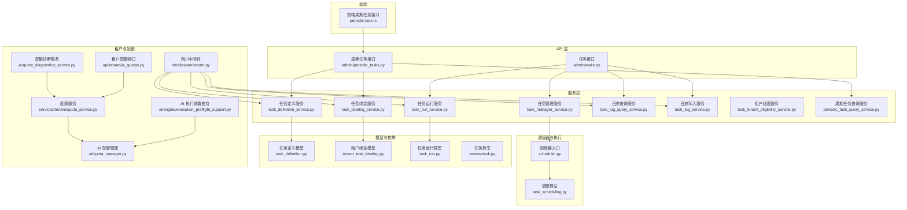
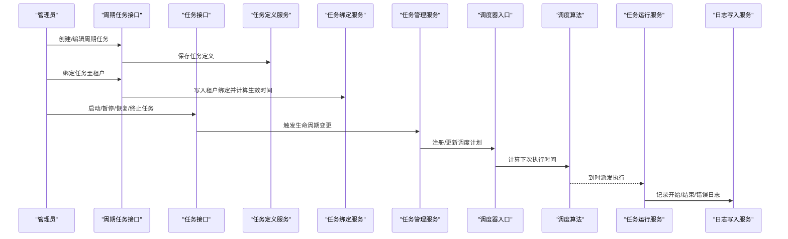
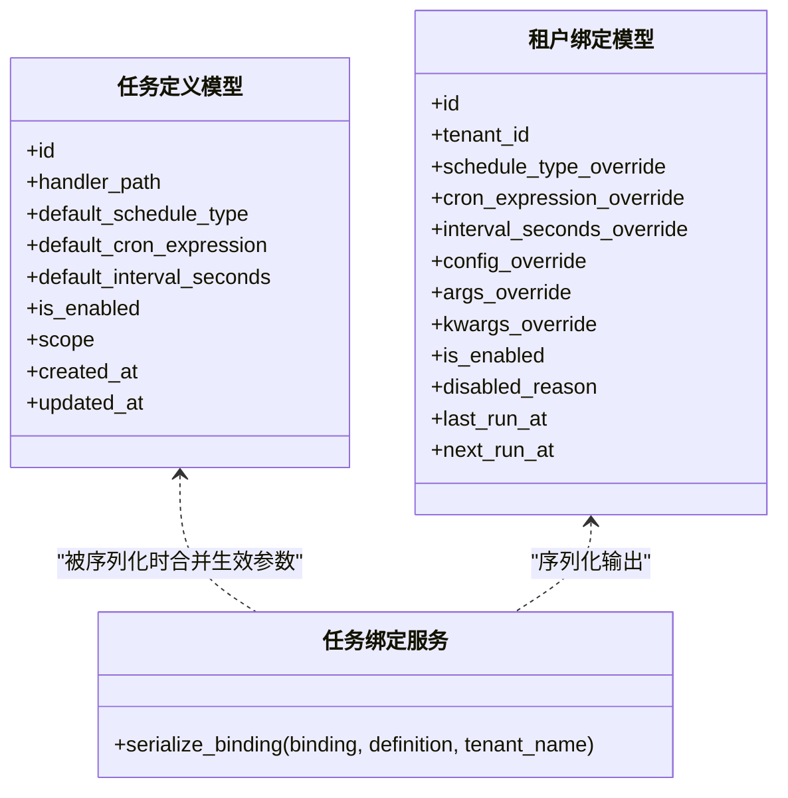
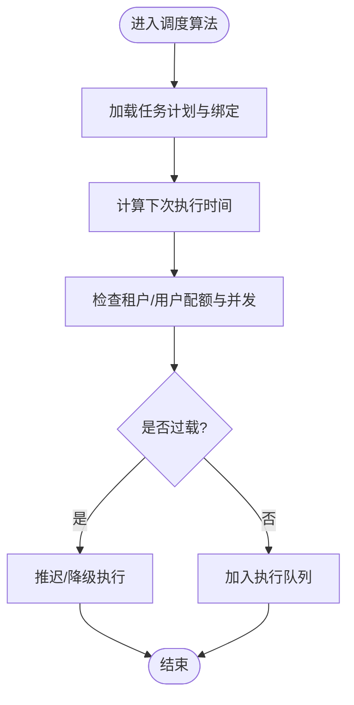
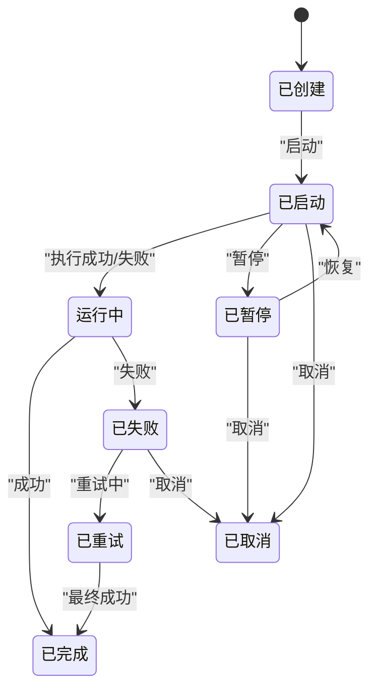
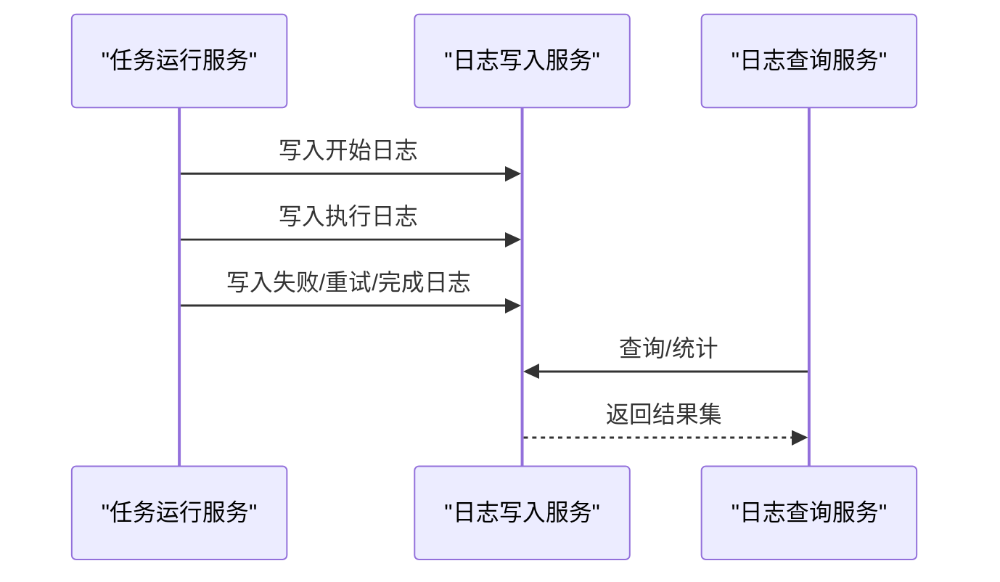
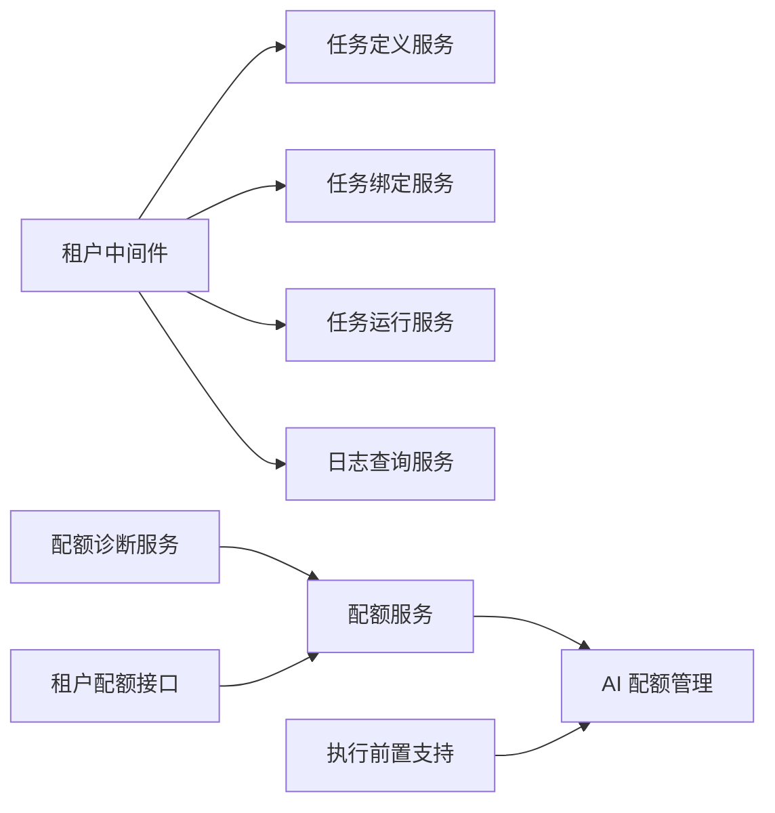
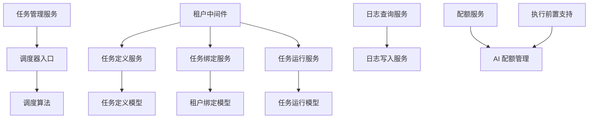

# 任务调度服务

<cite>
**本文引用的文件**
- [backend/app/tasks/scheduler.py](file://backend/app/tasks/scheduler.py)
- [backend/app/tasks/task_scheduling.py](file://backend/app/tasks/task_scheduling.py)
- [backend/app/services/system/task_manager_service.py](file://backend/app/services/system/task_manager_service.py)
- [backend/app/services/system/task_definition_service.py](file://backend/app/services/system/task_definition_service.py)
- [backend/app/services/system/task_binding_service.py](file://backend/app/services/system/task_binding_service.py)
- [backend/app/services/system/periodic_task_query_service.py](file://backend/app/services/system/periodic_task_query_service.py)
- [backend/app/services/system/task_run_service.py](file://backend/app/services/system/task_run_service.py)
- [backend/app/services/system/task_log_query_service.py](file://backend/app/services/system/task_log_query_service.py)
- [backend/app/services/system/task_log_service.py](file://backend/app/services/system/task_log_service.py)
- [backend/app/services/system/task_tenant_eligibility_service.py](file://backend/app/services/system/task_tenant_eligibility_service.py)
- [backend/app/models/system/task_definition.py](file://backend/app/models/system/task_definition.py)
- [backend/app/models/system/tenant_task_binding.py](file://backend/app/models/system/tenant_task_binding.py)
- [backend/app/models/system/task_run.py](file://backend/app/models/system/task_run.py)
- [backend/app/schemas/system/periodic_task.py](file://backend/app/schemas/system/periodic_task.py)
- [backend/app/schemas/system/task_log.py](file://backend/app/schemas/system/task_log.py)
- [backend/app/enums/task.py](file://backend/app/enums/task.py)
- [backend/app/api/admin/periodic_tasks.py](file://backend/app/api/admin/periodic_tasks.py)
- [backend/app/api/admin/tasks.py](file://backend/app/api/admin/tasks.py)
- [backend/app/middleware/tenant.py](file://backend/app/middleware/tenant.py)
- [backend/app/plugins/lifecycle.py](file://backend/app/plugins/lifecycle.py)
- [backend/app/plugins/lifecycle_parts/facade_modules.py](file://backend/app/plugins/lifecycle_parts/facade_modules.py)
- [backend/app/ai/engine/execution_preflight_support.py](file://backend/app/ai/engine/execution_preflight_support.py)
- [backend/app/ai/quota_manager.py](file://backend/app/ai/quota_manager.py)
- [backend/app/services/tenant/quota_service.py](file://backend/app/services/tenant/quota_service.py)
- [backend/app/services/ai/quota_diagnostics_service.py](file://backend/app/services/ai/quota_diagnostics_service.py)
- [backend/app/api/tenant/ai_quotas.py](file://backend/app/api/tenant/ai_quotas.py)
- [frontend/apps/web-antd/src/api/admin/periodic-task.ts](file://frontend/apps/web-antd/src/api/admin/periodic-task.ts)
</cite>

## 目录
1. [简介](#简介)
2. [项目结构](#项目结构)
3. [核心组件](#核心组件)
4. [架构总览](#架构总览)
5. [详细组件分析](#详细组件分析)
6. [依赖关系分析](#依赖关系分析)
7. [性能考虑](#性能考虑)
8. [故障排查指南](#故障排查指南)
9. [结论](#结论)
10. [附录](#附录)

## 简介
本技术文档围绕任务调度服务展开，系统性阐述任务定义、任务绑定、任务执行与任务监控的完整流程；深入解析调度器的优先级管理、并发控制与资源分配机制；梳理任务生命周期（创建、启动、暂停、恢复、终止）；说明任务与租户权限的集成（绑定范围、执行权限与配额管理）；给出任务日志的查询、分析与归档策略；并提供性能优化、故障恢复与重试机制的设计要点，以及扩展点与自定义调度算法的实现指导。

## 项目结构
任务调度相关能力主要分布在以下层次：
- 任务定义与模型层：系统任务定义、租户任务绑定、任务运行记录等模型与枚举
- 服务层：任务定义服务、绑定服务、运行服务、日志查询与写入、租户适配服务、周期任务查询服务
- 调度器与执行层：调度器入口、调度算法、任务运行与生命周期管理
- API 层：管理员端周期任务与任务管理接口
- 前端：周期任务列表与展示的数据转换
- 租户与配额：租户中间件、配额服务、AI 配额与诊断

图表来源
- [backend/app/api/admin/periodic_tasks.py](file://backend/app/api/admin/periodic_tasks.py)
- [backend/app/api/admin/tasks.py](file://backend/app/api/admin/tasks.py)
- [backend/app/services/system/periodic_task_query_service.py](file://backend/app/services/system/periodic_task_query_service.py)
- [backend/app/services/system/task_definition_service.py](file://backend/app/services/system/task_definition_service.py)
- [backend/app/services/system/task_binding_service.py](file://backend/app/services/system/task_binding_service.py)
- [backend/app/services/system/task_manager_service.py](file://backend/app/services/system/task_manager_service.py)
- [backend/app/services/system/task_run_service.py](file://backend/app/services/system/task_run_service.py)
- [backend/app/services/system/task_log_query_service.py](file://backend/app/services/system/task_log_query_service.py)
- [backend/app/services/system/task_log_service.py](file://backend/app/services/system/task_log_service.py)
- [backend/app/tasks/scheduler.py](file://backend/app/tasks/scheduler.py)
- [backend/app/tasks/task_scheduling.py](file://backend/app/tasks/task_scheduling.py)
- [backend/app/models/system/task_definition.py](file://backend/app/models/system/task_definition.py)
- [backend/app/models/system/tenant_task_binding.py](file://backend/app/models/system/tenant_task_binding.py)
- [backend/app/models/system/task_run.py](file://backend/app/models/system/task_run.py)
- [backend/app/enums/task.py](file://backend/app/enums/task.py)
- [backend/app/middleware/tenant.py](file://backend/app/middleware/tenant.py)
- [backend/app/services/tenant/quota_service.py](file://backend/app/services/tenant/quota_service.py)
- [backend/app/ai/engine/execution_preflight_support.py](file://backend/app/ai/engine/execution_preflight_support.py)
- [backend/app/ai/quota_manager.py](file://backend/app/ai/quota_manager.py)
- [backend/app/services/ai/quota_diagnostics_service.py](file://backend/app/services/ai/quota_diagnostics_service.py)
- [backend/app/api/tenant/ai_quotas.py](file://backend/app/api/tenant/ai_quotas.py)
- [frontend/apps/web-antd/src/api/admin/periodic-task.ts](file://frontend/apps/web-antd/src/api/admin/periodic-task.ts)

章节来源
- [backend/app/tasks/scheduler.py](file://backend/app/tasks/scheduler.py)
- [backend/app/tasks/task_scheduling.py](file://backend/app/tasks/task_scheduling.py)
- [backend/app/services/system/task_manager_service.py](file://backend/app/services/system/task_manager_service.py)
- [backend/app/services/system/task_definition_service.py](file://backend/app/services/system/task_definition_service.py)
- [backend/app/services/system/task_binding_service.py](file://backend/app/services/system/task_binding_service.py)
- [backend/app/services/system/periodic_task_query_service.py](file://backend/app/services/system/periodic_task_query_service.py)
- [backend/app/services/system/task_run_service.py](file://backend/app/services/system/task_run_service.py)
- [backend/app/services/system/task_log_query_service.py](file://backend/app/services/system/task_log_query_service.py)
- [backend/app/services/system/task_log_service.py](file://backend/app/services/system/task_log_service.py)
- [backend/app/services/system/task_tenant_eligibility_service.py](file://backend/app/services/system/task_tenant_eligibility_service.py)
- [backend/app/models/system/task_definition.py](file://backend/app/models/system/task_definition.py)
- [backend/app/models/system/tenant_task_binding.py](file://backend/app/models/system/tenant_task_binding.py)
- [backend/app/models/system/task_run.py](file://backend/app/models/system/task_run.py)
- [backend/app/schemas/system/periodic_task.py](file://backend/app/schemas/system/periodic_task.py)
- [backend/app/schemas/system/task_log.py](file://backend/app/schemas/system/task_log.py)
- [backend/app/enums/task.py](file://backend/app/enums/task.py)
- [backend/app/api/admin/periodic_tasks.py](file://backend/app/api/admin/periodic_tasks.py)
- [backend/app/api/admin/tasks.py](file://backend/app/api/admin/tasks.py)
- [backend/app/middleware/tenant.py](file://backend/app/middleware/tenant.py)
- [frontend/apps/web-antd/src/api/admin/periodic-task.ts](file://frontend/apps/web-antd/src/api/admin/periodic-task.ts)

## 核心组件
- 任务定义与绑定
  - 任务定义模型与服务负责任务元数据、默认调度参数、启用状态与平台作用域
  - 租户绑定模型与服务负责将任务定义按租户维度进行覆盖与生效时间计算
- 调度器与执行
  - 调度器入口与调度算法共同决定任务何时触发、如何并发与如何回退
  - 任务运行服务负责任务实例的创建、状态推进与异常处理
- 日志与监控
  - 日志查询与写入服务支撑任务执行轨迹、错误定位与审计
- 租户与配额
  - 租户中间件确保请求上下文中的租户隔离
  - 配额服务与 AI 执行前置支持保障在并发与资源上受控

章节来源
- [backend/app/services/system/task_definition_service.py](file://backend/app/services/system/task_definition_service.py)
- [backend/app/services/system/task_binding_service.py](file://backend/app/services/system/task_binding_service.py)
- [backend/app/services/system/task_run_service.py](file://backend/app/services/system/task_run_service.py)
- [backend/app/services/system/task_log_query_service.py](file://backend/app/services/system/task_log_query_service.py)
- [backend/app/services/system/task_log_service.py](file://backend/app/services/system/task_log_service.py)
- [backend/app/middleware/tenant.py](file://backend/app/middleware/tenant.py)
- [backend/app/services/tenant/quota_service.py](file://backend/app/services/tenant/quota_service.py)
- [backend/app/ai/engine/execution_preflight_support.py](file://backend/app/ai/engine/execution_preflight_support.py)

## 架构总览
下图展示了从“周期任务定义”到“租户绑定生效”再到“调度器触发执行”的全链路：

图表来源
- [backend/app/api/admin/periodic_tasks.py](file://backend/app/api/admin/periodic_tasks.py)
- [backend/app/api/admin/tasks.py](file://backend/app/api/admin/tasks.py)
- [backend/app/services/system/task_definition_service.py](file://backend/app/services/system/task_definition_service.py)
- [backend/app/services/system/task_binding_service.py](file://backend/app/services/system/task_binding_service.py)
- [backend/app/services/system/task_manager_service.py](file://backend/app/services/system/task_manager_service.py)
- [backend/app/tasks/scheduler.py](file://backend/app/tasks/scheduler.py)
- [backend/app/tasks/task_scheduling.py](file://backend/app/tasks/task_scheduling.py)
- [backend/app/services/system/task_run_service.py](file://backend/app/services/system/task_run_service.py)
- [backend/app/services/system/task_log_service.py](file://backend/app/services/system/task_log_service.py)

## 详细组件分析

### 任务定义与绑定
- 任务定义模型包含 handler 路径、默认调度类型与表达式、启用状态、平台作用域等字段
- 任务绑定模型支持租户级覆盖（调度类型、Cron 表达式、间隔秒数、配置与参数覆盖），并计算生效/下次运行时间
- 绑定序列化时会合并定义与绑定的生效参数，便于前端展示与控制

图表来源
- [backend/app/models/system/task_definition.py](file://backend/app/models/system/task_definition.py)
- [backend/app/models/system/tenant_task_binding.py](file://backend/app/models/system/tenant_task_binding.py)
- [backend/app/services/system/task_binding_service.py](file://backend/app/services/system/task_binding_service.py)

章节来源
- [backend/app/models/system/task_definition.py](file://backend/app/models/system/task_definition.py)
- [backend/app/models/system/tenant_task_binding.py](file://backend/app/models/system/tenant_task_binding.py)
- [backend/app/services/system/task_binding_service.py](file://backend/app/services/system/task_binding_service.py)
- [backend/app/services/system/periodic_task_query_service.py](file://backend/app/services/system/periodic_task_query_service.py)

### 调度器与调度算法
- 调度器入口负责注册与维护任务计划，结合调度算法计算下次执行时间
- 调度算法需考虑优先级、并发上限、租户配额与资源可用性，避免过载与饥饿

图表来源
- [backend/app/tasks/scheduler.py](file://backend/app/tasks/scheduler.py)
- [backend/app/tasks/task_scheduling.py](file://backend/app/tasks/task_scheduling.py)
- [backend/app/ai/engine/execution_preflight_support.py](file://backend/app/ai/engine/execution_preflight_support.py)
- [backend/app/ai/quota_manager.py](file://backend/app/ai/quota_manager.py)

章节来源
- [backend/app/tasks/scheduler.py](file://backend/app/tasks/scheduler.py)
- [backend/app/tasks/task_scheduling.py](file://backend/app/tasks/task_scheduling.py)
- [backend/app/ai/engine/execution_preflight_support.py](file://backend/app/ai/engine/execution_preflight_support.py)
- [backend/app/ai/quota_manager.py](file://backend/app/ai/quota_manager.py)

### 任务运行与生命周期
- 任务运行服务负责创建运行记录、推进状态、处理异常与重试
- 生命周期包括：创建、启动、暂停、恢复、终止；每个阶段均应写入日志并同步到调度器

图表来源
- [backend/app/services/system/task_run_service.py](file://backend/app/services/system/task_run_service.py)
- [backend/app/enums/task.py](file://backend/app/enums/task.py)

章节来源
- [backend/app/services/system/task_run_service.py](file://backend/app/services/system/task_run_service.py)
- [backend/app/enums/task.py](file://backend/app/enums/task.py)

### 日志查询、分析与归档
- 日志查询服务提供分页、过滤与聚合统计
- 日志写入服务在任务开始、结束、失败、重试等关键节点落盘
- 建议对历史日志进行归档与索引优化，以支持长周期审计与分析

图表来源
- [backend/app/services/system/task_log_service.py](file://backend/app/services/system/task_log_service.py)
- [backend/app/services/system/task_log_query_service.py](file://backend/app/services/system/task_log_query_service.py)

章节来源
- [backend/app/services/system/task_log_service.py](file://backend/app/services/system/task_log_service.py)
- [backend/app/services/system/task_log_query_service.py](file://backend/app/services/system/task_log_query_service.py)

### 租户权限与配额集成
- 租户中间件确保请求上下文中的租户隔离，所有任务操作均基于当前租户
- 配额服务与 AI 执行前置支持在任务执行前进行并发与用量检查，防止超配额执行
- 诊断服务可评估配额健康状态，辅助告警与治理

图表来源
- [backend/app/middleware/tenant.py](file://backend/app/middleware/tenant.py)
- [backend/app/services/tenant/quota_service.py](file://backend/app/services/tenant/quota_service.py)
- [backend/app/ai/engine/execution_preflight_support.py](file://backend/app/ai/engine/execution_preflight_support.py)
- [backend/app/ai/quota_manager.py](file://backend/app/ai/quota_manager.py)
- [backend/app/services/ai/quota_diagnostics_service.py](file://backend/app/services/ai/quota_diagnostics_service.py)
- [backend/app/api/tenant/ai_quotas.py](file://backend/app/api/tenant/ai_quotas.py)

章节来源
- [backend/app/middleware/tenant.py](file://backend/app/middleware/tenant.py)
- [backend/app/services/tenant/quota_service.py](file://backend/app/services/tenant/quota_service.py)
- [backend/app/ai/engine/execution_preflight_support.py](file://backend/app/ai/engine/execution_preflight_support.py)
- [backend/app/ai/quota_manager.py](file://backend/app/ai/quota_manager.py)
- [backend/app/services/ai/quota_diagnostics_service.py](file://backend/app/services/ai/quota_diagnostics_service.py)
- [backend/app/api/tenant/ai_quotas.py](file://backend/app/api/tenant/ai_quotas.py)

### 周期任务查询与前端展示
- 周期任务查询服务将定义、绑定与插件信息整合，生成前端所需的数据结构
- 前端接口对周期任务信息进行本地化与字段映射，支持展示绑定数量、生效状态与通知配置

章节来源
- [backend/app/services/system/periodic_task_query_service.py](file://backend/app/services/system/periodic_task_query_service.py)
- [frontend/apps/web-antd/src/api/admin/periodic-task.ts](file://frontend/apps/web-antd/src/api/admin/periodic-task.ts)

## 依赖关系分析
- 低耦合高内聚：服务层职责清晰，调度器与执行层通过服务接口解耦
- 外部依赖：Redis/数据库用于持久化与缓存；Celery 可作为可选执行后端（根据项目实际）
- 循环依赖风险：当前结构未见循环导入，但需注意服务间调用链长度与事务边界

图表来源
- [backend/app/services/system/task_definition_service.py](file://backend/app/services/system/task_definition_service.py)
- [backend/app/services/system/task_binding_service.py](file://backend/app/services/system/task_binding_service.py)
- [backend/app/services/system/task_run_service.py](file://backend/app/services/system/task_run_service.py)
- [backend/app/services/system/task_manager_service.py](file://backend/app/services/system/task_manager_service.py)
- [backend/app/tasks/scheduler.py](file://backend/app/tasks/scheduler.py)
- [backend/app/tasks/task_scheduling.py](file://backend/app/tasks/task_scheduling.py)
- [backend/app/services/system/task_log_query_service.py](file://backend/app/services/system/task_log_query_service.py)
- [backend/app/services/system/task_log_service.py](file://backend/app/services/system/task_log_service.py)
- [backend/app/middleware/tenant.py](file://backend/app/middleware/tenant.py)
- [backend/app/services/tenant/quota_service.py](file://backend/app/services/tenant/quota_service.py)
- [backend/app/ai/engine/execution_preflight_support.py](file://backend/app/ai/engine/execution_preflight_support.py)
- [backend/app/ai/quota_manager.py](file://backend/app/ai/quota_manager.py)

章节来源
- [backend/app/services/system/task_definition_service.py](file://backend/app/services/system/task_definition_service.py)
- [backend/app/services/system/task_binding_service.py](file://backend/app/services/system/task_binding_service.py)
- [backend/app/services/system/task_run_service.py](file://backend/app/services/system/task_run_service.py)
- [backend/app/services/system/task_manager_service.py](file://backend/app/services/system/task_manager_service.py)
- [backend/app/tasks/scheduler.py](file://backend/app/tasks/scheduler.py)
- [backend/app/tasks/task_scheduling.py](file://backend/app/tasks/task_scheduling.py)
- [backend/app/services/system/task_log_query_service.py](file://backend/app/services/system/task_log_query_service.py)
- [backend/app/services/system/task_log_service.py](file://backend/app/services/system/task_log_service.py)
- [backend/app/middleware/tenant.py](file://backend/app/middleware/tenant.py)
- [backend/app/services/tenant/quota_service.py](file://backend/app/services/tenant/quota_service.py)
- [backend/app/ai/engine/execution_preflight_support.py](file://backend/app/ai/engine/execution_preflight_support.py)
- [backend/app/ai/quota_manager.py](file://backend/app/ai/quota_manager.py)

## 性能考虑
- 并发控制与资源分配
  - 在调度算法中引入租户级并发上限与全局并发上限，避免热点租户抢占资源
  - 结合配额服务进行实时用量检查，必要时延迟或降级执行
- 优先级管理
  - 为不同任务类型设置优先级权重，结合队列与限流策略保证高优任务及时执行
- 存储与索引
  - 对任务运行日志按时间分区与索引，定期清理过期数据，降低查询成本
- 调度频率与抖动
  - 使用指数退避与抖动参数减少“惊群效应”，提升系统稳定性

## 故障排查指南
- 常见问题
  - 任务未触发：检查绑定生效时间、调度类型与 Cron 表达式是否正确
  - 任务频繁失败：查看日志写入服务记录的错误堆栈，确认重试次数与延迟策略
  - 超配额阻塞：通过配额诊断服务与租户配额接口核对限额与使用量
- 排查步骤
  - 定位任务定义与绑定状态
  - 检查调度器计划与算法执行路径
  - 核验租户上下文与配额前置检查
  - 分析日志查询服务返回的错误与耗时指标

章节来源
- [backend/app/services/system/task_log_query_service.py](file://backend/app/services/system/task_log_query_service.py)
- [backend/app/services/ai/quota_diagnostics_service.py](file://backend/app/services/ai/quota_diagnostics_service.py)
- [backend/app/api/tenant/ai_quotas.py](file://backend/app/api/tenant/ai_quotas.py)

## 结论
该任务调度服务以“定义—绑定—调度—执行—监控”为主线，通过租户中间件与配额体系实现安全可控的多租户执行环境。调度器与调度算法承担着资源协调与公平性的关键角色，建议在生产环境中进一步完善优先级队列、配额预警与日志归档策略，并持续评估调度抖动与重试退避参数，以获得更稳定的吞吐与更低的尾延迟。

## 附录
- 扩展点设计
  - 自定义调度算法：在调度算法模块中新增策略类，遵循统一接口，支持按租户/任务类型差异化调度
  - 执行后端扩展：若采用 Celery 等异步执行框架，可在任务运行服务中抽象出执行适配器
  - 插件化生命周期：参考插件生命周期设计，将任务生命周期钩子（如启动前/后、失败回调）作为可插拔扩展
- 自定义调度算法实现指导
  - 输入：任务定义、租户绑定、当前时间、历史运行统计
  - 输出：下次执行时间、并发许可、降级策略
  - 关键约束：配额上限、租户公平性、抖动与退避

章节来源
- [backend/app/plugins/lifecycle.py](file://backend/app/plugins/lifecycle.py)
- [backend/app/plugins/lifecycle_parts/facade_modules.py](file://backend/app/plugins/lifecycle_parts/facade_modules.py)
- [backend/app/tasks/task_scheduling.py](file://backend/app/tasks/task_scheduling.py)