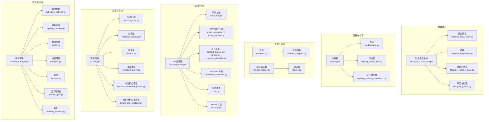
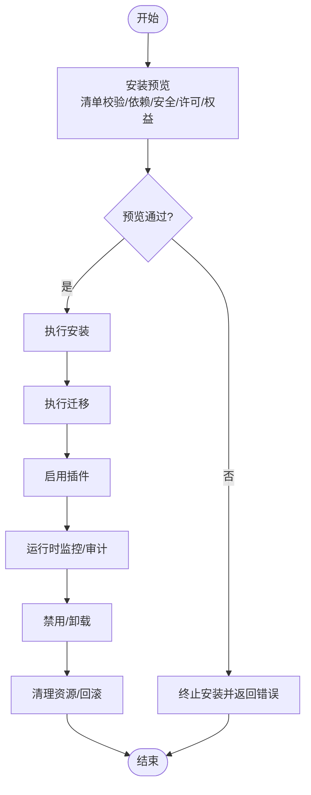
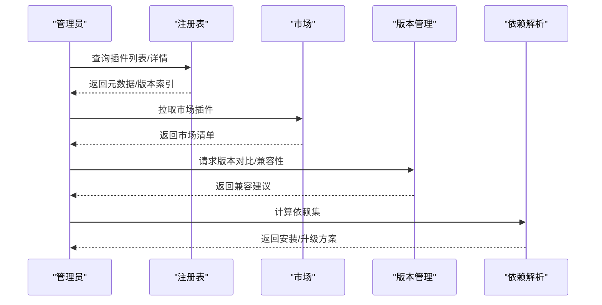
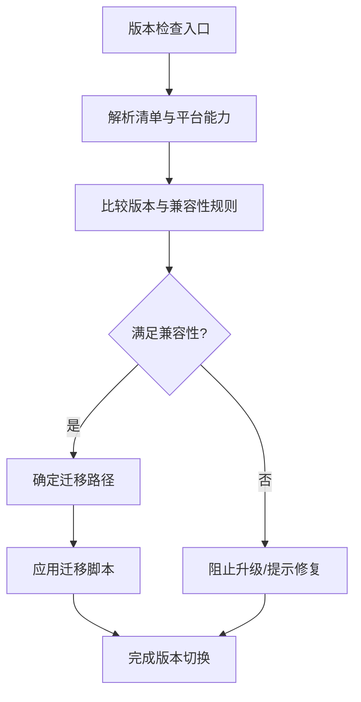
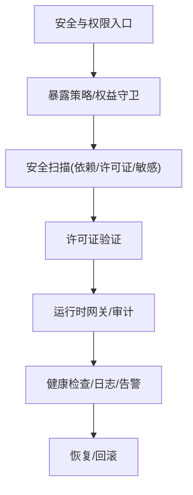
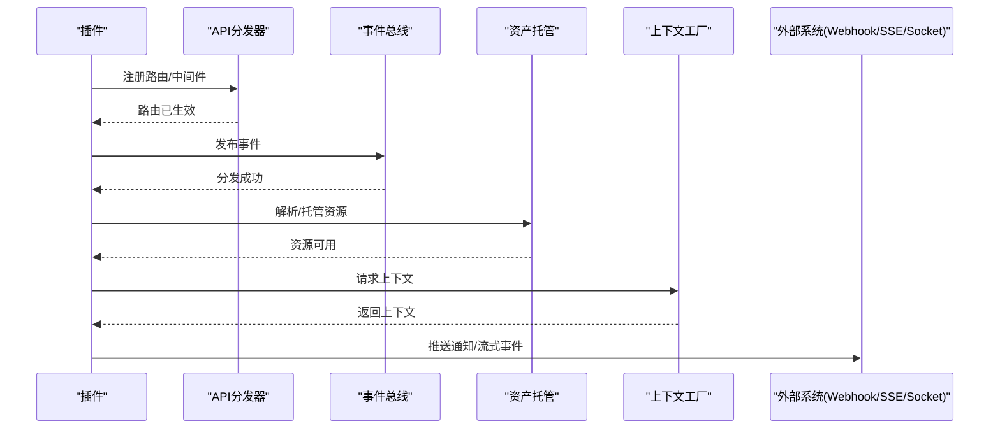
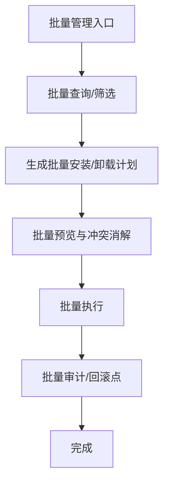
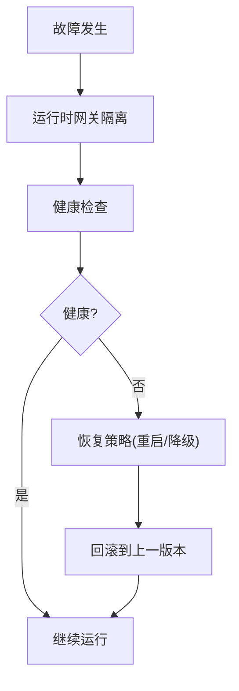
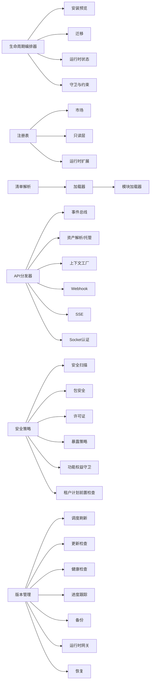

# 插件系统服务

<cite>
**本文引用的文件**
- [backend/app/plugins/lifecycle.py](file://backend/app/plugins/lifecycle.py)
- [backend/app/plugins/lifecycle_installation.py](file://backend/app/plugins/lifecycle_installation.py)
- [backend/app/plugins/lifecycle_orchestrator.py](file://backend/app/plugins/lifecycle_orchestrator.py)
- [backend/app/plugins/lifecycle_migrations.py](file://backend/app/plugins/lifecycle_migrations.py)
- [backend/app/plugins/lifecycle_runtime_state.py](file://backend/app/plugins/lifecycle_runtime_state.py)
- [backend/app/plugins/lifecycle_guards.py](file://backend/app/plugins/lifecycle_guards.py)
- [backend/app/plugins/preview.py](file://backend/app/plugins/preview.py)
- [backend/app/plugins/registry.py](file://backend/app/plugins/registry.py)
- [backend/app/plugins/manifest.py](file://backend/app/plugins/manifest.py)
- [backend/app/plugins/module_loader.py](file://backend/app/plugins/module_loader.py)
- [backend/app/plugins/loader.py](file://backend/app/plugins/loader.py)
- [backend/app/plugins/api_dispatcher.py](file://backend/app/plugins/api_dispatcher.py)
- [backend/app/plugins/event_bus.py](file://backend/app/plugins/event_bus.py)
- [backend/app/plugins/security.py](file://backend/app/plugins/security.py)
- [backend/app/plugins/security_scan.py](file://backend/app/plugins/security_scan.py)
- [backend/app/plugins/package_security.py](file://backend/app/plugins/package_security.py)
- [backend/app/plugins/runtime_recovery.py](file://backend/app/plugins/runtime_recovery.py)
- [backend/app/plugins/version_manager.py](file://backend/app/plugins/version_manager.py)
- [backend/app/plugins/marketplace.py](file://backend/app/plugins/marketplace.py)
- [backend/app/plugins/scheduler_refresh.py](file://backend/app/plugins/scheduler_refresh.py)
- [backend/app/plugins/system_hooks.py](file://backend/app/plugins/system_hooks.py)
- [backend/app/plugins/license.py](file://backend/app/plugins/license.py)
- [backend/app/plugins/exposure_policy.py](file://backend/app/plugins/exposure_policy.py)
- [backend/app/plugins/asset_resolver.py](file://backend/app/plugins/asset_resolver.py)
- [backend/app/plugins/asset_runtime.py](file://backend/app/plugins/asset_runtime.py)
- [backend/app/plugins/startup.py](file://backend/app/plugins/startup.py)
- [backend/app/plugins/context.py](file://backend/app/plugins/context.py)
- [backend/app/plugins/context_factory.py](file://backend/app/plugins/context_factory.py)
- [backend/app/plugins/context_primitives.py](file://backend/app/plugins/context_primitives.py)
- [backend/app/plugins/webhook_dispatcher.py](file://backend/app/plugins/webhook_dispatcher.py)
- [backend/app/plugins/sse.py](file://backend/app/plugins/sse.py)
- [backend/app/plugins/sio_auth.py](file://backend/app/plugins/sio_auth.py)
- [backend/app/plugins/dependencies.py](file://backend/app/plugins/dependencies.py)
- [backend/app/plugins/runtime_gate.py](file://backend/app/plugins/runtime_gate.py)
- [backend/app/plugins/health.py](file://backend/app/plugins/health.py)
- [backend/app/plugins/progress.py](file://backend/app/plugins/progress.py)
- [backend/app/plugins/crypto.py](file://backend/app/plugins/crypto.py)
- [backend/app/plugins/host_read_facade.py](file://backend/app/plugins/host_read_facade.py)
- [backend/app/plugins/frontend_contract.py](file://backend/app/plugins/frontend_contract.py)
- [backend/app/plugins/frontend_contract_checks.py](file://backend/app/plugins/frontend_contract_checks.py)
- [backend/app/plugins/tenant_plan_preflight.py](file://backend/app/plugins/tenant_plan_preflight.py)
- [backend/app/plugins/update_checker.py](file://backend/app/plugins/update_checker.py)
- [backend/app/plugins/backup.py](file://backend/app/plugins/backup.py)
- [backend/app/plugins/base.py](file://backend/app/plugins/base.py)
- [backend/app/plugins/_extension_registrar.py](file://backend/app/plugins/_extension_registrar.py)
- [backend/app/plugins/registry_read_layer.py](file://backend/app/plugins/registry_read_layer.py)
- [backend/app/plugins/registry_runtime_extensions.py](file://backend/app/plugins/registry_runtime_extensions.py)
- [backend/app/plugins/runtime_registration.py](file://backend/app/plugins/runtime_registration.py)
- [backend/app/plugins/scope.py](file://backend/app/plugins/scope.py)
- [backend/app/plugins/migration_paths.py](file://backend/app/plugins/migration_paths.py)
- [backend/app/plugins/lifecycle_dependency_runtime.py](file://backend/app/plugins/lifecycle_dependency_runtime.py)
- [backend/app/plugins/lifecycle_support.py](file://backend/app/plugins/lifecycle_support.py)
- [backend/app/plugins/lifecycle_orchestrator_maintenance.py](file://backend/app/plugins/lifecycle_orchestrator_maintenance.py)
- [backend/app/plugins/feature_entitlement_guards.py](file://backend/app/plugins/feature_entitlement_guards.py)
</cite>

## 目录
1. [引言](#引言)
2. [项目结构](#项目结构)
3. [核心组件](#核心组件)
4. [架构总览](#架构总览)
5. [详细组件分析](#详细组件分析)
6. [依赖关系分析](#依赖关系分析)
7. [性能考量](#性能考量)
8. [故障排查指南](#故障排查指南)
9. [结论](#结论)
10. [附录](#附录)

## 引言
本文件面向插件系统服务，系统性阐述插件生命周期管理（安装预览、运行时审计与清理）、注册发现与依赖解析、版本管理与兼容性检查、权限控制与安全扫描、运行时监控、与系统服务的集成（API扩展、事件订阅、资源托管）、批量管理与运维、故障恢复与回滚、以及扩展点设计与自定义插件开发最佳实践。内容基于仓库中 backend/app/plugins 目录下的实现进行归纳总结。

## 项目结构
插件系统位于后端应用的 plugins 子模块下，采用按功能域分层组织：生命周期编排、注册表与市场、清单与元数据、模块加载与运行时、安全与合规、事件与API扩展、调度与系统钩子等。核心文件包括生命周期编排器、安装预览、注册表、清单解析、模块加载器、API分发器、事件总线、安全扫描、版本管理、许可证与配额、前端契约与暴露策略、资产解析与托管、运行时恢复与网关、健康检查与进度跟踪等。

图示来源
- [backend/app/plugins/lifecycle_orchestrator.py](file://backend/app/plugins/lifecycle_orchestrator.py)
- [backend/app/plugins/lifecycle_installation.py](file://backend/app/plugins/lifecycle_installation.py)
- [backend/app/plugins/lifecycle_migrations.py](file://backend/app/plugins/lifecycle_migrations.py)
- [backend/app/plugins/lifecycle_runtime_state.py](file://backend/app/plugins/lifecycle_runtime_state.py)
- [backend/app/plugins/lifecycle_guards.py](file://backend/app/plugins/lifecycle_guards.py)
- [backend/app/plugins/registry.py](file://backend/app/plugins/registry.py)
- [backend/app/plugins/marketplace.py](file://backend/app/plugins/marketplace.py)
- [backend/app/plugins/registry_read_layer.py](file://backend/app/plugins/registry_read_layer.py)
- [backend/app/plugins/registry_runtime_extensions.py](file://backend/app/plugins/registry_runtime_extensions.py)
- [backend/app/plugins/manifest.py](file://backend/app/plugins/manifest.py)
- [backend/app/plugins/manifest_helpers.py](file://backend/app/plugins/manifest_helpers.py)
- [backend/app/plugins/module_loader.py](file://backend/app/plugins/module_loader.py)
- [backend/app/plugins/loader.py](file://backend/app/plugins/loader.py)
- [backend/app/plugins/api_dispatcher.py](file://backend/app/plugins/api_dispatcher.py)
- [backend/app/plugins/event_bus.py](file://backend/app/plugins/event_bus.py)
- [backend/app/plugins/asset_resolver.py](file://backend/app/plugins/asset_resolver.py)
- [backend/app/plugins/asset_runtime.py](file://backend/app/plugins/asset_runtime.py)
- [backend/app/plugins/context_factory.py](file://backend/app/plugins/context_factory.py)
- [backend/app/plugins/context.py](file://backend/app/plugins/context.py)
- [backend/app/plugins/context_primitives.py](file://backend/app/plugins/context_primitives.py)
- [backend/app/plugins/webhook_dispatcher.py](file://backend/app/plugins/webhook_dispatcher.py)
- [backend/app/plugins/sse.py](file://backend/app/plugins/sse.py)
- [backend/app/plugins/sio_auth.py](file://backend/app/plugins/sio_auth.py)
- [backend/app/plugins/security.py](file://backend/app/plugins/security.py)
- [backend/app/plugins/security_scan.py](file://backend/app/plugins/security_scan.py)
- [backend/app/plugins/package_security.py](file://backend/app/plugins/package_security.py)
- [backend/app/plugins/license.py](file://backend/app/plugins/license.py)
- [backend/app/plugins/exposure_policy.py](file://backend/app/plugins/exposure_policy.py)
- [backend/app/plugins/feature_entitlement_guards.py](file://backend/app/plugins/feature_entitlement_guards.py)
- [backend/app/plugins/tenant_plan_preflight.py](file://backend/app/plugins/tenant_plan_preflight.py)
- [backend/app/plugins/version_manager.py](file://backend/app/plugins/version_manager.py)
- [backend/app/plugins/scheduler_refresh.py](file://backend/app/plugins/scheduler_refresh.py)
- [backend/app/plugins/update_checker.py](file://backend/app/plugins/update_checker.py)
- [backend/app/plugins/health.py](file://backend/app/plugins/health.py)
- [backend/app/plugins/progress.py](file://backend/app/plugins/progress.py)
- [backend/app/plugins/backup.py](file://backend/app/plugins/backup.py)
- [backend/app/plugins/runtime_gate.py](file://backend/app/plugins/runtime_gate.py)
- [backend/app/plugins/runtime_recovery.py](file://backend/app/plugins/runtime_recovery.py)

章节来源
- [backend/app/plugins/lifecycle_orchestrator.py](file://backend/app/plugins/lifecycle_orchestrator.py)
- [backend/app/plugins/registry.py](file://backend/app/plugins/registry.py)
- [backend/app/plugins/manifest.py](file://backend/app/plugins/manifest.py)
- [backend/app/plugins/module_loader.py](file://backend/app/plugins/module_loader.py)
- [backend/app/plugins/api_dispatcher.py](file://backend/app/plugins/api_dispatcher.py)
- [backend/app/plugins/security.py](file://backend/app/plugins/security.py)
- [backend/app/plugins/version_manager.py](file://backend/app/plugins/version_manager.py)

## 核心组件
- 生命周期编排：负责插件从安装到运行再到维护的全周期编排，协调安装预览、迁移、运行时状态管理与守卫约束。
- 注册表与市场：提供插件注册、查询、只读访问与运行时扩展能力；支持插件市场对接与元数据同步。
- 清单与加载：解析插件清单，生成元数据模型，驱动模块加载与运行时装配。
- 运行时扩展：通过API分发器、事件总线、资产解析与托管、上下文工厂、Webhook/SSE/Socket集成，实现系统扩展。
- 安全与合规：统一的安全策略、包安全与安全扫描、许可证与功能权益守卫、暴露策略与租户计划前置检查。
- 版本与运维：版本管理、调度刷新、更新检查、健康检查、进度跟踪、备份、运行时网关与恢复。

章节来源
- [backend/app/plugins/lifecycle_orchestrator.py](file://backend/app/plugins/lifecycle_orchestrator.py)
- [backend/app/plugins/registry.py](file://backend/app/plugins/registry.py)
- [backend/app/plugins/marketplace.py](file://backend/app/plugins/marketplace.py)
- [backend/app/plugins/manifest.py](file://backend/app/plugins/manifest.py)
- [backend/app/plugins/module_loader.py](file://backend/app/plugins/module_loader.py)
- [backend/app/plugins/loader.py](file://backend/app/plugins/loader.py)
- [backend/app/plugins/api_dispatcher.py](file://backend/app/plugins/api_dispatcher.py)
- [backend/app/plugins/event_bus.py](file://backend/app/plugins/event_bus.py)
- [backend/app/plugins/asset_resolver.py](file://backend/app/plugins/asset_resolver.py)
- [backend/app/plugins/asset_runtime.py](file://backend/app/plugins/asset_runtime.py)
- [backend/app/plugins/context_factory.py](file://backend/app/plugins/context_factory.py)
- [backend/app/plugins/context.py](file://backend/app/plugins/context.py)
- [backend/app/plugins/context_primitives.py](file://backend/app/plugins/context_primitives.py)
- [backend/app/plugins/webhook_dispatcher.py](file://backend/app/plugins/webhook_dispatcher.py)
- [backend/app/plugins/sse.py](file://backend/app/plugins/sse.py)
- [backend/app/plugins/sio_auth.py](file://backend/app/plugins/sio_auth.py)
- [backend/app/plugins/security.py](file://backend/app/plugins/security.py)
- [backend/app/plugins/security_scan.py](file://backend/app/plugins/security_scan.py)
- [backend/app/plugins/package_security.py](file://backend/app/plugins/package_security.py)
- [backend/app/plugins/license.py](file://backend/app/plugins/license.py)
- [backend/app/plugins/exposure_policy.py](file://backend/app/plugins/exposure_policy.py)
- [backend/app/plugins/feature_entitlement_guards.py](file://backend/app/plugins/feature_entitlement_guards.py)
- [backend/app/plugins/tenant_plan_preflight.py](file://backend/app/plugins/tenant_plan_preflight.py)
- [backend/app/plugins/version_manager.py](file://backend/app/plugins/version_manager.py)
- [backend/app/plugins/scheduler_refresh.py](file://backend/app/plugins/scheduler_refresh.py)
- [backend/app/plugins/update_checker.py](file://backend/app/plugins/update_checker.py)
- [backend/app/plugins/health.py](file://backend/app/plugins/health.py)
- [backend/app/plugins/progress.py](file://backend/app/plugins/progress.py)
- [backend/app/plugins/backup.py](file://backend/app/plugins/backup.py)
- [backend/app/plugins/runtime_gate.py](file://backend/app/plugins/runtime_gate.py)
- [backend/app/plugins/runtime_recovery.py](file://backend/app/plugins/runtime_recovery.py)

## 架构总览
插件系统以“生命周期编排器”为核心，串联安装预览、迁移、运行时状态与守卫；注册表与市场提供发现与元数据支撑；清单与加载完成装配；运行时扩展通过API分发、事件、资产与上下文实现系统集成；安全与合规贯穿始终；版本与运维保障稳定性与可恢复性。

```mermaid
graph TB
Orchestrator["生命周期编排器"] --> Installer["安装预览"]
Orchestrator --> Migrator["迁移"]
Orchestrator --> RuntimeState["运行时状态"]
Orchestrator --> Guards["守卫与约束"]
Registry["注册表"] --> Market["市场"]
Registry --> ReadLayer["只读层"]
Registry --> RuntimeExt["运行时扩展"]
Manifest["清单解析"] --> Loader["加载器"]
Loader --> ModuleLoader["模块加载器"]
API["API分发器"] --> EventBus["事件总线"]
API --> Assets["资产解析/托管"]
API --> Ctx["上下文工厂"]
API --> Webhook["Webhook"]
API --> SSE["SSE"]
API --> SIO["Socket认证"]
Security["安全策略"] --> Scan["安全扫描"]
Security --> PackageSec["包安全"]
Security --> License["许可证"]
Security --> Exposure["暴露策略"]
Security --> Entitlement["功能权益守卫"]
Security --> PlanCheck["租户计划前置检查"]
VersionMgr["版本管理"] --> SchedulerRefresh["调度刷新"]
VersionMgr --> UpdateCheck["更新检查"]
VersionMgr --> Health["健康检查"]
VersionMgr --> Progress["进度跟踪"]
VersionMgr --> Backup["备份"]
VersionMgr --> Gate["运行时网关"]
VersionMgr --> Recovery["恢复"]
```

图示来源
- [backend/app/plugins/lifecycle_orchestrator.py](file://backend/app/plugins/lifecycle_orchestrator.py)
- [backend/app/plugins/lifecycle_installation.py](file://backend/app/plugins/lifecycle_installation.py)
- [backend/app/plugins/lifecycle_migrations.py](file://backend/app/plugins/lifecycle_migrations.py)
- [backend/app/plugins/lifecycle_runtime_state.py](file://backend/app/plugins/lifecycle_runtime_state.py)
- [backend/app/plugins/lifecycle_guards.py](file://backend/app/plugins/lifecycle_guards.py)
- [backend/app/plugins/registry.py](file://backend/app/plugins/registry.py)
- [backend/app/plugins/marketplace.py](file://backend/app/plugins/marketplace.py)
- [backend/app/plugins/registry_read_layer.py](file://backend/app/plugins/registry_read_layer.py)
- [backend/app/plugins/registry_runtime_extensions.py](file://backend/app/plugins/registry_runtime_extensions.py)
- [backend/app/plugins/manifest.py](file://backend/app/plugins/manifest.py)
- [backend/app/plugins/loader.py](file://backend/app/plugins/loader.py)
- [backend/app/plugins/module_loader.py](file://backend/app/plugins/module_loader.py)
- [backend/app/plugins/api_dispatcher.py](file://backend/app/plugins/api_dispatcher.py)
- [backend/app/plugins/event_bus.py](file://backend/app/plugins/event_bus.py)
- [backend/app/plugins/asset_resolver.py](file://backend/app/plugins/asset_resolver.py)
- [backend/app/plugins/asset_runtime.py](file://backend/app/plugins/asset_runtime.py)
- [backend/app/plugins/context_factory.py](file://backend/app/plugins/context_factory.py)
- [backend/app/plugins/context.py](file://backend/app/plugins/context.py)
- [backend/app/plugins/context_primitives.py](file://backend/app/plugins/context_primitives.py)
- [backend/app/plugins/webhook_dispatcher.py](file://backend/app/plugins/webhook_dispatcher.py)
- [backend/app/plugins/sse.py](file://backend/app/plugins/sse.py)
- [backend/app/plugins/sio_auth.py](file://backend/app/plugins/sio_auth.py)
- [backend/app/plugins/security.py](file://backend/app/plugins/security.py)
- [backend/app/plugins/security_scan.py](file://backend/app/plugins/security_scan.py)
- [backend/app/plugins/package_security.py](file://backend/app/plugins/package_security.py)
- [backend/app/plugins/license.py](file://backend/app/plugins/license.py)
- [backend/app/plugins/exposure_policy.py](file://backend/app/plugins/exposure_policy.py)
- [backend/app/plugins/feature_entitlement_guards.py](file://backend/app/plugins/feature_entitlement_guards.py)
- [backend/app/plugins/tenant_plan_preflight.py](file://backend/app/plugins/tenant_plan_preflight.py)
- [backend/app/plugins/version_manager.py](file://backend/app/plugins/version_manager.py)
- [backend/app/plugins/scheduler_refresh.py](file://backend/app/plugins/scheduler_refresh.py)
- [backend/app/plugins/update_checker.py](file://backend/app/plugins/update_checker.py)
- [backend/app/plugins/health.py](file://backend/app/plugins/health.py)
- [backend/app/plugins/progress.py](file://backend/app/plugins/progress.py)
- [backend/app/plugins/backup.py](file://backend/app/plugins/backup.py)
- [backend/app/plugins/runtime_gate.py](file://backend/app/plugins/runtime_gate.py)
- [backend/app/plugins/runtime_recovery.py](file://backend/app/plugins/runtime_recovery.py)

## 详细组件分析

### 生命周期管理
- 安装预览：在真实安装前对目标包进行元信息校验、依赖冲突检测、许可证与功能权益前置检查、安全扫描结果评估，输出可执行的安装步骤与风险提示。
- 迁移：根据版本管理与迁移路径，执行数据库或配置层面的迁移脚本，确保升级过程的数据一致性与向后兼容。
- 运行时状态：维护插件实例的运行态快照、健康指标、错误日志与恢复点，支持运行时审计与故障定位。
- 守卫与约束：在安装、升级、卸载、启用/禁用等关键节点执行许可有效期、租户配额、功能权益、暴露策略等多维守卫。

图示来源
- [backend/app/plugins/lifecycle_installation.py](file://backend/app/plugins/lifecycle_installation.py)
- [backend/app/plugins/lifecycle_migrations.py](file://backend/app/plugins/lifecycle_migrations.py)
- [backend/app/plugins/lifecycle_runtime_state.py](file://backend/app/plugins/lifecycle_runtime_state.py)
- [backend/app/plugins/lifecycle_guards.py](file://backend/app/plugins/lifecycle_guards.py)

章节来源
- [backend/app/plugins/lifecycle_installation.py](file://backend/app/plugins/lifecycle_installation.py)
- [backend/app/plugins/lifecycle_migrations.py](file://backend/app/plugins/lifecycle_migrations.py)
- [backend/app/plugins/lifecycle_runtime_state.py](file://backend/app/plugins/lifecycle_runtime_state.py)
- [backend/app/plugins/lifecycle_guards.py](file://backend/app/plugins/lifecycle_guards.py)

### 注册发现与依赖解析
- 注册表：集中存储插件元数据、版本索引、安装来源、租户分配与作用域；提供只读访问与运行时扩展接口。
- 市场：对接外部插件市场，支持元数据同步、版本对比与批量拉取。
- 依赖解析：基于清单中的依赖声明，结合版本管理与兼容性规则，计算最小可行安装集与冲突消解方案。
- 运行时扩展：在注册表基础上动态注入运行时扩展点，如API路由、事件订阅者、资产托管入口等。

图示来源
- [backend/app/plugins/registry.py](file://backend/app/plugins/registry.py)
- [backend/app/plugins/marketplace.py](file://backend/app/plugins/marketplace.py)
- [backend/app/plugins/version_manager.py](file://backend/app/plugins/version_manager.py)
- [backend/app/plugins/dependencies.py](file://backend/app/plugins/dependencies.py)

章节来源
- [backend/app/plugins/registry.py](file://backend/app/plugins/registry.py)
- [backend/app/plugins/marketplace.py](file://backend/app/plugins/marketplace.py)
- [backend/app/plugins/version_manager.py](file://backend/app/plugins/version_manager.py)
- [backend/app/plugins/dependencies.py](file://backend/app/plugins/dependencies.py)

### 版本管理与兼容性检查
- 版本模型：语义化版本与平台版本映射，记录最小兼容平台版本、最低可用版本、废弃时间线。
- 兼容性规则：基于清单元数据与平台能力矩阵，判断插件版本是否满足当前环境要求。
- 升降级策略：支持强制升级、灰度发布、回滚保护与自动降级。
- 迁移路径：版本间迁移脚本与数据转换逻辑，确保升级前后一致性。

图示来源
- [backend/app/plugins/version_manager.py](file://backend/app/plugins/version_manager.py)
- [backend/app/plugins/migration_paths.py](file://backend/app/plugins/migration_paths.py)
- [backend/app/plugins/lifecycle_migrations.py](file://backend/app/plugins/lifecycle_migrations.py)

章节来源
- [backend/app/plugins/version_manager.py](file://backend/app/plugins/version_manager.py)
- [backend/app/plugins/migration_paths.py](file://backend/app/plugins/migration_paths.py)
- [backend/app/plugins/lifecycle_migrations.py](file://backend/app/plugins/lifecycle_migrations.py)

### 权限控制、安全扫描与运行时监控
- 权限控制：基于暴露策略与功能权益守卫，限制插件在不同租户/作用域内的可见性与操作范围。
- 安全扫描：对插件包进行静态扫描（依赖漏洞、许可证合规、敏感信息），并结合包安全策略与许可证验证。
- 运行时监控：健康检查、运行时审计日志、错误追踪与告警，支持实时恢复与回滚。

图示来源
- [backend/app/plugins/exposure_policy.py](file://backend/app/plugins/exposure_policy.py)
- [backend/app/plugins/feature_entitlement_guards.py](file://backend/app/plugins/feature_entitlement_guards.py)
- [backend/app/plugins/security_scan.py](file://backend/app/plugins/security_scan.py)
- [backend/app/plugins/package_security.py](file://backend/app/plugins/package_security.py)
- [backend/app/plugins/license.py](file://backend/app/plugins/license.py)
- [backend/app/plugins/runtime_gate.py](file://backend/app/plugins/runtime_gate.py)
- [backend/app/plugins/health.py](file://backend/app/plugins/health.py)
- [backend/app/plugins/runtime_recovery.py](file://backend/app/plugins/runtime_recovery.py)

章节来源
- [backend/app/plugins/exposure_policy.py](file://backend/app/plugins/exposure_policy.py)
- [backend/app/plugins/feature_entitlement_guards.py](file://backend/app/plugins/feature_entitlement_guards.py)
- [backend/app/plugins/security_scan.py](file://backend/app/plugins/security_scan.py)
- [backend/app/plugins/package_security.py](file://backend/app/plugins/package_security.py)
- [backend/app/plugins/license.py](file://backend/app/plugins/license.py)
- [backend/app/plugins/runtime_gate.py](file://backend/app/plugins/runtime_gate.py)
- [backend/app/plugins/health.py](file://backend/app/plugins/health.py)
- [backend/app/plugins/runtime_recovery.py](file://backend/app/plugins/runtime_recovery.py)

### 插件与系统服务集成
- API扩展：通过API分发器注册插件路由、中间件、权限装饰器，实现REST/GraphQL扩展。
- 事件订阅：事件总线接收插件触发的事件，分发至订阅者（含Webhook/SSE/Socket）。
- 资源托管：资产解析与运行时托管，统一处理静态资源、上传文件与第三方存储。
- 上下文工厂：为插件提供运行时上下文（用户、租户、会话、权限等）封装与注入。

图示来源
- [backend/app/plugins/api_dispatcher.py](file://backend/app/plugins/api_dispatcher.py)
- [backend/app/plugins/event_bus.py](file://backend/app/plugins/event_bus.py)
- [backend/app/plugins/asset_resolver.py](file://backend/app/plugins/asset_resolver.py)
- [backend/app/plugins/asset_runtime.py](file://backend/app/plugins/asset_runtime.py)
- [backend/app/plugins/context_factory.py](file://backend/app/plugins/context_factory.py)
- [backend/app/plugins/context.py](file://backend/app/plugins/context.py)
- [backend/app/plugins/context_primitives.py](file://backend/app/plugins/context_primitives.py)
- [backend/app/plugins/webhook_dispatcher.py](file://backend/app/plugins/webhook_dispatcher.py)
- [backend/app/plugins/sse.py](file://backend/app/plugins/sse.py)
- [backend/app/plugins/sio_auth.py](file://backend/app/plugins/sio_auth.py)

章节来源
- [backend/app/plugins/api_dispatcher.py](file://backend/app/plugins/api_dispatcher.py)
- [backend/app/plugins/event_bus.py](file://backend/app/plugins/event_bus.py)
- [backend/app/plugins/asset_resolver.py](file://backend/app/plugins/asset_resolver.py)
- [backend/app/plugins/asset_runtime.py](file://backend/app/plugins/asset_runtime.py)
- [backend/app/plugins/context_factory.py](file://backend/app/plugins/context_factory.py)
- [backend/app/plugins/context.py](file://backend/app/plugins/context.py)
- [backend/app/plugins/context_primitives.py](file://backend/app/plugins/context_primitives.py)
- [backend/app/plugins/webhook_dispatcher.py](file://backend/app/plugins/webhook_dispatcher.py)
- [backend/app/plugins/sse.py](file://backend/app/plugins/sse.py)
- [backend/app/plugins/sio_auth.py](file://backend/app/plugins/sio_auth.py)

### 批量管理、批量安装与批量卸载
- 批量管理：通过注册表与市场接口，批量查询、批量启用/禁用、批量升级与批量卸载。
- 批量安装：基于安装预览与依赖解析，批量生成安装计划，按优先级与冲突消解顺序执行。
- 批量卸载：在保证数据与依赖不破坏的前提下，批量清理插件及其关联资源。

图示来源
- [backend/app/plugins/registry.py](file://backend/app/plugins/registry.py)
- [backend/app/plugins/marketplace.py](file://backend/app/plugins/marketplace.py)
- [backend/app/plugins/lifecycle_installation.py](file://backend/app/plugins/lifecycle_installation.py)
- [backend/app/plugins/lifecycle_orchestrator.py](file://backend/app/plugins/lifecycle_orchestrator.py)

章节来源
- [backend/app/plugins/registry.py](file://backend/app/plugins/registry.py)
- [backend/app/plugins/marketplace.py](file://backend/app/plugins/marketplace.py)
- [backend/app/plugins/lifecycle_installation.py](file://backend/app/plugins/lifecycle_installation.py)
- [backend/app/plugins/lifecycle_orchestrator.py](file://backend/app/plugins/lifecycle_orchestrator.py)

### 故障恢复、回滚机制与性能优化
- 故障恢复：运行时网关隔离异常插件，健康检查与恢复策略自动重启或降级。
- 回滚机制：基于版本管理与迁移路径，支持一键回滚至上一稳定版本。
- 性能优化：缓存清单与依赖解析结果、延迟加载非关键模块、事件批处理与异步分发。

图示来源
- [backend/app/plugins/runtime_gate.py](file://backend/app/plugins/runtime_gate.py)
- [backend/app/plugins/health.py](file://backend/app/plugins/health.py)
- [backend/app/plugins/runtime_recovery.py](file://backend/app/plugins/runtime_recovery.py)
- [backend/app/plugins/version_manager.py](file://backend/app/plugins/version_manager.py)

章节来源
- [backend/app/plugins/runtime_gate.py](file://backend/app/plugins/runtime_gate.py)
- [backend/app/plugins/health.py](file://backend/app/plugins/health.py)
- [backend/app/plugins/runtime_recovery.py](file://backend/app/plugins/runtime_recovery.py)
- [backend/app/plugins/version_manager.py](file://backend/app/plugins/version_manager.py)

### 扩展点设计与自定义插件开发最佳实践
- 扩展点：API分发器路由扩展、事件总线订阅扩展、资产托管扩展、上下文扩展、Webhook/SSE/Socket扩展。
- 最佳实践：遵循清单规范与版本兼容性、最小权限原则、安全扫描与许可证合规、幂等与可观测性、渐进式部署与回滚策略。

章节来源
- [backend/app/plugins/api_dispatcher.py](file://backend/app/plugins/api_dispatcher.py)
- [backend/app/plugins/event_bus.py](file://backend/app/plugins/event_bus.py)
- [backend/app/plugins/asset_resolver.py](file://backend/app/plugins/asset_resolver.py)
- [backend/app/plugins/asset_runtime.py](file://backend/app/plugins/asset_runtime.py)
- [backend/app/plugins/context_factory.py](file://backend/app/plugins/context_factory.py)
- [backend/app/plugins/context.py](file://backend/app/plugins/context.py)
- [backend/app/plugins/context_primitives.py](file://backend/app/plugins/context_primitives.py)
- [backend/app/plugins/webhook_dispatcher.py](file://backend/app/plugins/webhook_dispatcher.py)
- [backend/app/plugins/sse.py](file://backend/app/plugins/sse.py)
- [backend/app/plugins/sio_auth.py](file://backend/app/plugins/sio_auth.py)

## 依赖关系分析
- 组件耦合：生命周期编排器与安装预览、迁移、运行时状态、守卫紧密耦合；注册表与市场、只读层与运行时扩展松耦合；API分发器与事件总线、资产托管形成高内聚低耦合。
- 外部依赖：版本管理依赖迁移路径与平台能力矩阵；安全扫描依赖包安全与许可证策略；运行时监控依赖健康检查与恢复策略。
- 循环依赖：未见循环导入；各模块职责清晰，通过接口契约交互。

图示来源
- [backend/app/plugins/lifecycle_orchestrator.py](file://backend/app/plugins/lifecycle_orchestrator.py)
- [backend/app/plugins/lifecycle_installation.py](file://backend/app/plugins/lifecycle_installation.py)
- [backend/app/plugins/lifecycle_migrations.py](file://backend/app/plugins/lifecycle_migrations.py)
- [backend/app/plugins/lifecycle_runtime_state.py](file://backend/app/plugins/lifecycle_runtime_state.py)
- [backend/app/plugins/lifecycle_guards.py](file://backend/app/plugins/lifecycle_guards.py)
- [backend/app/plugins/registry.py](file://backend/app/plugins/registry.py)
- [backend/app/plugins/marketplace.py](file://backend/app/plugins/marketplace.py)
- [backend/app/plugins/registry_read_layer.py](file://backend/app/plugins/registry_read_layer.py)
- [backend/app/plugins/registry_runtime_extensions.py](file://backend/app/plugins/registry_runtime_extensions.py)
- [backend/app/plugins/manifest.py](file://backend/app/plugins/manifest.py)
- [backend/app/plugins/loader.py](file://backend/app/plugins/loader.py)
- [backend/app/plugins/module_loader.py](file://backend/app/plugins/module_loader.py)
- [backend/app/plugins/api_dispatcher.py](file://backend/app/plugins/api_dispatcher.py)
- [backend/app/plugins/event_bus.py](file://backend/app/plugins/event_bus.py)
- [backend/app/plugins/asset_resolver.py](file://backend/app/plugins/asset_resolver.py)
- [backend/app/plugins/asset_runtime.py](file://backend/app/plugins/asset_runtime.py)
- [backend/app/plugins/context_factory.py](file://backend/app/plugins/context_factory.py)
- [backend/app/plugins/context.py](file://backend/app/plugins/context.py)
- [backend/app/plugins/context_primitives.py](file://backend/app/plugins/context_primitives.py)
- [backend/app/plugins/webhook_dispatcher.py](file://backend/app/plugins/webhook_dispatcher.py)
- [backend/app/plugins/sse.py](file://backend/app/plugins/sse.py)
- [backend/app/plugins/sio_auth.py](file://backend/app/plugins/sio_auth.py)
- [backend/app/plugins/security.py](file://backend/app/plugins/security.py)
- [backend/app/plugins/security_scan.py](file://backend/app/plugins/security_scan.py)
- [backend/app/plugins/package_security.py](file://backend/app/plugins/package_security.py)
- [backend/app/plugins/license.py](file://backend/app/plugins/license.py)
- [backend/app/plugins/exposure_policy.py](file://backend/app/plugins/exposure_policy.py)
- [backend/app/plugins/feature_entitlement_guards.py](file://backend/app/plugins/feature_entitlement_guards.py)
- [backend/app/plugins/tenant_plan_preflight.py](file://backend/app/plugins/tenant_plan_preflight.py)
- [backend/app/plugins/version_manager.py](file://backend/app/plugins/version_manager.py)
- [backend/app/plugins/scheduler_refresh.py](file://backend/app/plugins/scheduler_refresh.py)
- [backend/app/plugins/update_checker.py](file://backend/app/plugins/update_checker.py)
- [backend/app/plugins/health.py](file://backend/app/plugins/health.py)
- [backend/app/plugins/progress.py](file://backend/app/plugins/progress.py)
- [backend/app/plugins/backup.py](file://backend/app/plugins/backup.py)
- [backend/app/plugins/runtime_gate.py](file://backend/app/plugins/runtime_gate.py)
- [backend/app/plugins/runtime_recovery.py](file://backend/app/plugins/runtime_recovery.py)

## 性能考量
- 延迟加载：非关键模块与插件在首次调用时才加载，减少启动时间。
- 缓存策略：清单与依赖解析结果缓存，降低重复计算成本。
- 异步处理：事件与Webhook/SSE/Socket采用异步分发，避免阻塞主流程。
- 并发控制：运行时网关对异常插件进行隔离与限流，防止级联故障。
- 监控与采样：健康检查与性能指标采样，及时发现瓶颈。

## 故障排查指南
- 安装失败：检查安装预览输出、依赖冲突、许可证与功能权益守卫、安全扫描结果。
- 运行异常：查看运行时状态快照、健康检查日志、错误追踪与审计日志，必要时执行回滚。
- 集成问题：核对API分发器路由注册、事件订阅者状态、资产托管可用性、上下文注入是否正确。
- 性能问题：关注健康检查与性能指标，排查热点模块与异步队列积压。

章节来源
- [backend/app/plugins/lifecycle_installation.py](file://backend/app/plugins/lifecycle_installation.py)
- [backend/app/plugins/lifecycle_runtime_state.py](file://backend/app/plugins/lifecycle_runtime_state.py)
- [backend/app/plugins/health.py](file://backend/app/plugins/health.py)
- [backend/app/plugins/runtime_recovery.py](file://backend/app/plugins/runtime_recovery.py)
- [backend/app/plugins/api_dispatcher.py](file://backend/app/plugins/api_dispatcher.py)
- [backend/app/plugins/event_bus.py](file://backend/app/plugins/event_bus.py)
- [backend/app/plugins/asset_resolver.py](file://backend/app/plugins/asset_resolver.py)
- [backend/app/plugins/context_factory.py](file://backend/app/plugins/context_factory.py)

## 结论
该插件系统以生命周期编排为核心，结合注册发现、版本管理、安全合规与运行时扩展，构建了完整的插件生态。通过安装预览、迁移、运行时审计与清理，确保变更可控；通过权限控制、安全扫描与运行时监控，保障系统安全；通过API扩展、事件订阅与资源托管，实现与系统服务的深度集成；通过批量管理、回滚与性能优化，提升运维效率与稳定性。

## 附录
- 自定义插件开发：遵循清单规范、最小权限原则、安全扫描与许可证合规、幂等与可观测性、渐进式部署与回滚策略。
- 运维建议：定期执行健康检查与安全扫描、建立回滚演练、优化异步处理与并发控制、完善监控与告警。