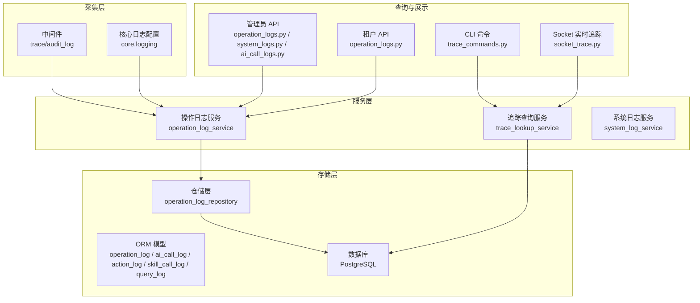
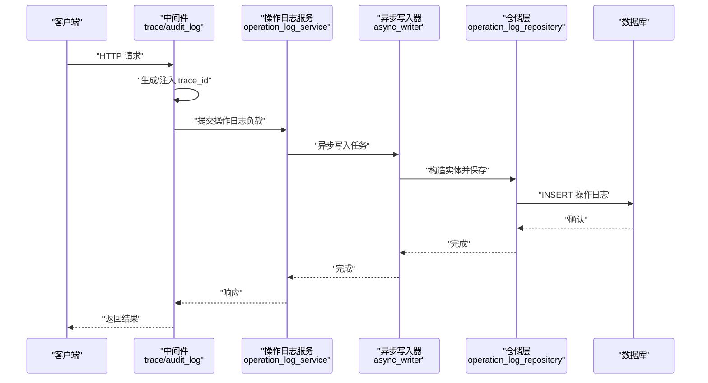
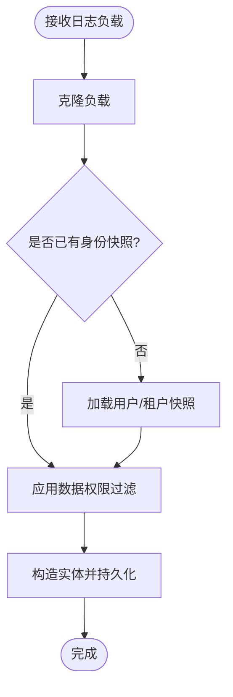
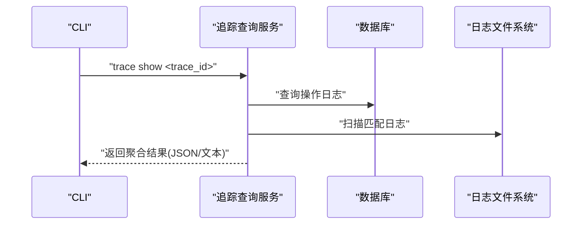
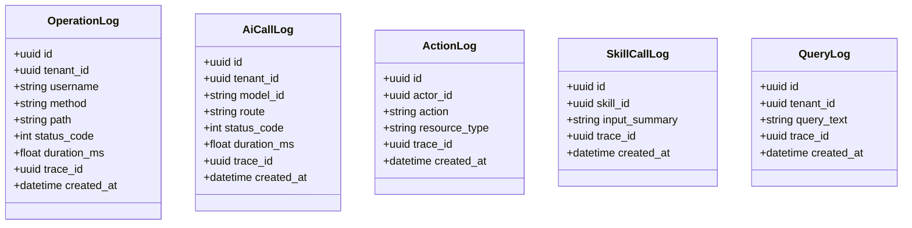
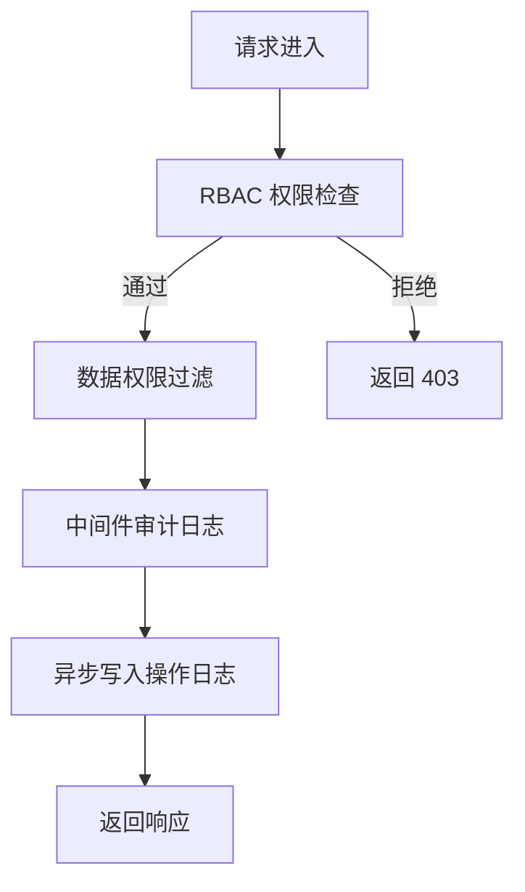
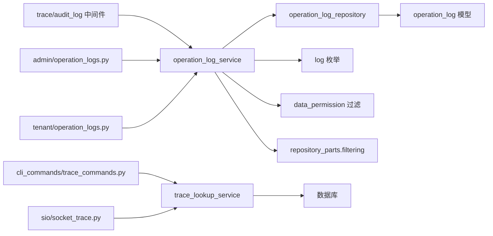

# 日志监控服务

<cite>
**本文引用的文件**
- [operation_log_service.py](file://backend/app/services/system/operation_log_service.py)
- [async_writer.py](file://backend/app/services/system/operation_log_service_parts/async_writer.py)
- [operation_log_repository.py](file://backend/app/repositories/system/operation_log_repository.py)
- [operation_log.py](file://backend/app/models/system/operation_log.py)
- [operation_logs.py](file://backend/app/api/admin/operation_logs.py)
- [operation_logs.py](file://backend/app/api/tenant/operation_logs.py)
- [audit_log.py](file://backend/app/middleware/audit_log.py)
- [logging.py](file://backend/app/core/logging.py)
- [trace_lookup_service.py](file://backend/app/services/system/trace_lookup_service.py)
- [trace.py](file://backend/app/middleware/trace.py)
- [trace_commands.py](file://backend/app/cli_commands/trace_commands.py)
- [test_trace_cli.py](file://backend/tests/test_trace_cli.py)
- [test_trace_context_propagation.py](file://backend/tests/test_trace_context_propagation.py)
- [test_trace_lookup_service.py](file://backend/tests/services/test_trace_lookup_service.py)
- [socket_trace.py](file://backend/app/sio/socket_trace.py)
- [20260120_c63b0c9f4a25_add_operation_log_table.py](file://backend/migrations/versions/20260120_c63b0c9f4a25_add_operation_log_table.py)
- [20260318_0003_add_trace_id_to_operation_logs.py](file://backend/migrations/versions/20260318_0003_add_trace_id_to_operation_logs.py)
- [20260330_0090_action_log_trace.py](file://backend/migrations/versions/20260330_0090_action_log_trace.py)
- [20260330_0100_ai_call_log_trace_tool.py](file://backend/migrations/versions/20260330_0100_ai_call_log_trace_tool.py)
- [ai_call_logs.py](file://backend/app/api/admin/ai_call_logs.py)
- [ai_call_logs.py](file://backend/app/api/tenant/ai_call_logs.py)
- [call_log_bridge.py](file://backend/app/ai/gateway_support/call_log_bridge.py)
- [action_log.py](file://backend/app/models/ai/action_log.py)
- [skill_call_log.py](file://backend/app/models/ai/skill_call_log.py)
- [query_log.py](file://backend/app/models/ai/query_log.py)
- [email_logs.py](file://backend/app/api/admin/email_logs.py)
- [system_logs.py](file://backend/app/api/admin/system_logs.py)
- [system_log_service.py](file://backend/app/services/system/system_log_service.py)
- [log.py](file://backend/app/enums/log.py)
- [filtering.py](file://backend/app/core/repository_parts/filtering.py)
- [data_permission.py](file://backend/app/core/data_permission.py)
- [checks.py](file://backend/app/rbac/services/permission_domains/checks.py)
- [migration_service_runner.py](file://backend/plugins/storage-migration/backend/services/migration_service_runner.py)
</cite>

## 目录
1. [简介](#简介)
2. [项目结构](#项目结构)
3. [核心组件](#核心组件)
4. [架构总览](#架构总览)
5. [详细组件分析](#详细组件分析)
6. [依赖关系分析](#依赖关系分析)
7. [性能考虑](#性能考虑)
8. [故障排查指南](#故障排查指南)
9. [结论](#结论)
10. [附录](#附录)

## 简介
本技术文档面向日志监控服务，系统性阐述操作日志、系统日志与追踪日志的采集、存储、查询与分析机制；覆盖异步写入、批量处理与性能优化策略；说明权限控制、敏感信息过滤与合规管理；解释日志与审计跟踪的集成（操作溯源、责任定位与合规审计）；并提供高级搜索、聚合分析与报表生成的实践路径，以及告警机制、异常检测与故障诊断策略。最后给出扩展点设计与自定义日志处理器的实现指导。

## 项目结构
日志体系围绕“采集-存储-查询-分析-展示”闭环组织，核心模块包括：
- 操作日志：记录用户在系统中的关键行为（如登录、增删改等），支持异步写入与权限过滤。
- 系统日志：记录系统运行状态、错误与性能指标，便于运维与审计。
- 追踪日志：通过 trace_id 关联一次请求全链路日志，支持 CLI/中间件/服务端多源检索。
- 中间件与服务：统一注入 trace_id、落库、查询与聚合分析。
- API 层：提供管理员与租户维度的操作日志查询接口。
- 扩展与迁移：支持插件化扩展与历史日志批量迁移。

图表来源
- [operation_log_service.py](file://backend/app/services/system/operation_log_service.py)
- [trace_lookup_service.py](file://backend/app/services/system/trace_lookup_service.py)
- [operation_log_repository.py](file://backend/app/repositories/system/operation_log_repository.py)
- [operation_log.py](file://backend/app/models/system/operation_log.py)
- [operation_logs.py](file://backend/app/api/admin/operation_logs.py)
- [operation_logs.py](file://backend/app/api/tenant/operation_logs.py)
- [system_logs.py](file://backend/app/api/admin/system_logs.py)
- [ai_call_logs.py](file://backend/app/api/admin/ai_call_logs.py)
- [ai_call_logs.py](file://backend/app/api/tenant/ai_call_logs.py)
- [trace_commands.py](file://backend/app/cli_commands/trace_commands.py)
- [socket_trace.py](file://backend/app/sio/socket_trace.py)
- [logging.py](file://backend/app/core/logging.py)
- [audit_log.py](file://backend/app/middleware/audit_log.py)

章节来源
- [operation_log_service.py](file://backend/app/services/system/operation_log_service.py)
- [operation_log_repository.py](file://backend/app/repositories/system/operation_log_repository.py)
- [operation_log.py](file://backend/app/models/system/operation_log.py)
- [operation_logs.py](file://backend/app/api/admin/operation_logs.py)
- [operation_logs.py](file://backend/app/api/tenant/operation_logs.py)
- [system_logs.py](file://backend/app/api/admin/system_logs.py)
- [ai_call_logs.py](file://backend/app/api/admin/ai_call_logs.py)
- [ai_call_logs.py](file://backend/app/api/tenant/ai_call_logs.py)
- [trace_lookup_service.py](file://backend/app/services/system/trace_lookup_service.py)
- [trace_commands.py](file://backend/app/cli_commands/trace_commands.py)
- [socket_trace.py](file://backend/app/sio/socket_trace.py)
- [logging.py](file://backend/app/core/logging.py)
- [audit_log.py](file://backend/app/middleware/audit_log.py)

## 核心组件
- 操作日志服务：负责异步写入、身份快照加载、权限与数据范围过滤、序列化与持久化。
- 追踪查询服务：按 trace_id 聚合操作日志与系统日志，支持 CLI/WS 查询与摘要统计。
- 系统日志服务：提供系统级日志的查询与导出能力。
- 中间件：注入 trace_id、记录审计日志、传播上下文。
- API：管理员与租户维度的查询接口，支持分页、过滤与排序。
- 存储模型：ORM 映射到 operation_log、ai_call_log、action_log、skill_call_log、query_log 等表。
- 扩展与迁移：插件化扩展点与历史日志批量迁移。

章节来源
- [operation_log_service.py](file://backend/app/services/system/operation_log_service.py)
- [async_writer.py](file://backend/app/services/system/operation_log_service_parts/async_writer.py)
- [trace_lookup_service.py](file://backend/app/services/system/trace_lookup_service.py)
- [system_log_service.py](file://backend/app/services/system/system_log_service.py)
- [audit_log.py](file://backend/app/middleware/audit_log.py)
- [operation_log.py](file://backend/app/models/system/operation_log.py)
- [action_log.py](file://backend/app/models/ai/action_log.py)
- [skill_call_log.py](file://backend/app/models/ai/skill_call_log.py)
- [query_log.py](file://backend/app/models/ai/query_log.py)

## 架构总览
下图展示了从请求进入、中间件注入 trace_id、异步写入操作日志，到查询与追踪的整体流程。

图表来源
- [trace.py](file://backend/app/middleware/trace.py)
- [audit_log.py](file://backend/app/middleware/audit_log.py)
- [operation_log_service.py](file://backend/app/services/system/operation_log_service.py)
- [async_writer.py](file://backend/app/services/system/operation_log_service_parts/async_writer.py)
- [operation_log_repository.py](file://backend/app/repositories/system/operation_log_repository.py)
- [operation_log.py](file://backend/app/models/system/operation_log.py)

## 详细组件分析

### 操作日志服务与异步写入
- 异步写入：通过独立协程与会话工厂进行数据库写入，避免阻塞主业务线程。
- 身份快照：在未提供 identity_snapshot 时，自动加载用户/租户快照以完善审计字段。
- 权限与数据范围：在写入前应用数据权限过滤，确保仅记录有权限的数据范围内的日志。
- 序列化与持久化：对负载进行克隆与清洗后入库。

图表来源
- [async_writer.py](file://backend/app/services/system/operation_log_service_parts/async_writer.py)
- [operation_log_service.py](file://backend/app/services/system/operation_log_service.py)
- [filtering.py](file://backend/app/core/repository_parts/filtering.py)
- [data_permission.py](file://backend/app/core/data_permission.py)

章节来源
- [async_writer.py](file://backend/app/services/system/operation_log_service_parts/async_writer.py)
- [operation_log_service.py](file://backend/app/services/system/operation_log_service.py)
- [filtering.py](file://backend/app/core/repository_parts/filtering.py)
- [data_permission.py](file://backend/app/core/data_permission.py)

### 追踪查询服务与 CLI/WS 集成
- 多源聚合：按 trace_id 聚合操作日志与系统日志，支持从数据库与日志文件两处检索。
- CLI 支持：提供 trace show 命令，支持 JSON 输出与文本输出，包含摘要统计与脱敏标记。
- WebSocket 实时追踪：通过 SocketIO 推送追踪结果，便于实时诊断。
- 上下文传播：测试用例验证 trace_id 在 CLI/中间件/服务之间的传播一致性。

图表来源
- [trace_lookup_service.py](file://backend/app/services/system/trace_lookup_service.py)
- [trace_commands.py](file://backend/app/cli_commands/trace_commands.py)
- [test_trace_cli.py](file://backend/tests/test_trace_cli.py)
- [socket_trace.py](file://backend/app/sio/socket_trace.py)
- [test_trace_context_propagation.py](file://backend/tests/test_trace_context_propagation.py)

章节来源
- [trace_lookup_service.py](file://backend/app/services/system/trace_lookup_service.py)
- [trace_commands.py](file://backend/app/cli_commands/trace_commands.py)
- [test_trace_cli.py](file://backend/tests/test_trace_cli.py)
- [socket_trace.py](file://backend/app/sio/socket_trace.py)
- [test_trace_context_propagation.py](file://backend/tests/test_trace_context_propagation.py)

### 系统日志与 AI 调用日志
- 系统日志：提供系统级日志查询与导出，支持管理员端接口。
- AI 调用日志：记录 AI 调用详情（路由、耗时、状态码等），支持管理员与租户接口。
- 模型映射：对应 ai_call_log、action_log、skill_call_log、query_log 等模型。

图表来源
- [operation_log.py](file://backend/app/models/system/operation_log.py)
- [action_log.py](file://backend/app/models/ai/action_log.py)
- [skill_call_log.py](file://backend/app/models/ai/skill_call_log.py)
- [query_log.py](file://backend/app/models/ai/query_log.py)
- [ai_call_logs.py](file://backend/app/api/admin/ai_call_logs.py)
- [ai_call_logs.py](file://backend/app/api/tenant/ai_call_logs.py)

章节来源
- [system_logs.py](file://backend/app/api/admin/system_logs.py)
- [ai_call_logs.py](file://backend/app/api/admin/ai_call_logs.py)
- [ai_call_logs.py](file://backend/app/api/tenant/ai_call_logs.py)
- [operation_log.py](file://backend/app/models/system/operation_log.py)
- [action_log.py](file://backend/app/models/ai/action_log.py)
- [skill_call_log.py](file://backend/app/models/ai/skill_call_log.py)
- [query_log.py](file://backend/app/models/ai/query_log.py)

### 权限控制、敏感信息过滤与合规管理
- 权限检查：基于 RBAC 的权限域工具，支持“任意满足/全部满足”等策略。
- 数据权限：仓储层自动应用数据范围过滤，避免越权访问与写入。
- 审计日志：中间件统一记录请求方法、路径、状态码与响应消息，便于审计。
- 合规字段：模型中包含 trace_id、tenant_id、created_at 等字段，满足可追溯与时间线要求。

图表来源
- [checks.py](file://backend/app/rbac/services/permission_domains/checks.py)
- [filtering.py](file://backend/app/core/repository_parts/filtering.py)
- [audit_log.py](file://backend/app/middleware/audit_log.py)
- [operation_log_service.py](file://backend/app/services/system/operation_log_service.py)

章节来源
- [checks.py](file://backend/app/rbac/services/permission_domains/checks.py)
- [filtering.py](file://backend/app/core/repository_parts/filtering.py)
- [audit_log.py](file://backend/app/middleware/audit_log.py)
- [operation_log_service.py](file://backend/app/services/system/operation_log_service.py)

### 批量处理与性能优化
- 批量迁移：插件迁移服务按批次拉取待处理记录，使用 asyncio.gather 并行迁移，提升吞吐。
- 异步写入：操作日志写入采用异步协程与独立数据库会话，降低主路径延迟。
- 仓储过滤：统一的过滤器与数据权限条件构建，减少无效查询与越权数据扫描。

章节来源
- [migration_service_runner.py](file://backend/plugins/storage-migration/backend/services/migration_service_runner.py)
- [async_writer.py](file://backend/app/services/system/operation_log_service_parts/async_writer.py)
- [filtering.py](file://backend/app/core/repository_parts/filtering.py)

### 查询与报表：高级搜索、聚合分析与报表生成
- 管理员与租户 API：提供分页、过滤、排序与聚合的查询接口，支持导出。
- 追踪聚合：按 trace_id 聚合操作日志与系统日志，输出摘要统计与匹配结果。
- 报表建议：结合查询接口与聚合统计，可生成“操作趋势、错误分布、耗时分析”等报表。

章节来源
- [operation_logs.py](file://backend/app/api/admin/operation_logs.py)
- [operation_logs.py](file://backend/app/api/tenant/operation_logs.py)
- [system_logs.py](file://backend/app/api/admin/system_logs.py)
- [trace_lookup_service.py](file://backend/app/services/system/trace_lookup_service.py)

### 告警机制、异常检测与故障诊断
- CLI 告警：CLI 可直接输出 JSON，便于外部系统接入告警规则（如错误数阈值、响应码异常）。
- WS 实时：SocketIO 推送追踪结果，便于实时诊断与告警联动。
- 故障诊断：通过 trace_id 快速定位问题来源，结合响应消息与日志块定位根因。

章节来源
- [trace_commands.py](file://backend/app/cli_commands/trace_commands.py)
- [socket_trace.py](file://backend/app/sio/socket_trace.py)
- [test_trace_cli.py](file://backend/tests/test_trace_cli.py)

### 扩展点设计与自定义日志处理器
- 扩展点：中间件与服务层提供清晰的扩展点，可在日志采集阶段注入自定义字段或处理器。
- 自定义处理器：建议通过中间件注册自定义日志处理器，实现特定业务领域的日志增强（如风控、合规）。
- 插件化：利用插件系统实现日志采集、传输与归档的插件化扩展。

章节来源
- [audit_log.py](file://backend/app/middleware/audit_log.py)
- [logging.py](file://backend/app/core/logging.py)

## 依赖关系分析

图表来源
- [trace.py](file://backend/app/middleware/trace.py)
- [audit_log.py](file://backend/app/middleware/audit_log.py)
- [operation_log_service.py](file://backend/app/services/system/operation_log_service.py)
- [operation_log_repository.py](file://backend/app/repositories/system/operation_log_repository.py)
- [operation_log.py](file://backend/app/models/system/operation_log.py)
- [log.py](file://backend/app/enums/log.py)
- [data_permission.py](file://backend/app/core/data_permission.py)
- [filtering.py](file://backend/app/core/repository_parts/filtering.py)
- [trace_lookup_service.py](file://backend/app/services/system/trace_lookup_service.py)
- [operation_logs.py](file://backend/app/api/admin/operation_logs.py)
- [operation_logs.py](file://backend/app/api/tenant/operation_logs.py)
- [trace_commands.py](file://backend/app/cli_commands/trace_commands.py)
- [socket_trace.py](file://backend/app/sio/socket_trace.py)

章节来源
- [operation_log_service.py](file://backend/app/services/system/operation_log_service.py)
- [operation_log_repository.py](file://backend/app/repositories/system/operation_log_repository.py)
- [operation_log.py](file://backend/app/models/system/operation_log.py)
- [log.py](file://backend/app/enums/log.py)
- [data_permission.py](file://backend/app/core/data_permission.py)
- [filtering.py](file://backend/app/core/repository_parts/filtering.py)
- [trace_lookup_service.py](file://backend/app/services/system/trace_lookup_service.py)
- [operation_logs.py](file://backend/app/api/admin/operation_logs.py)
- [operation_logs.py](file://backend/app/api/tenant/operation_logs.py)
- [trace_commands.py](file://backend/app/cli_commands/trace_commands.py)
- [socket_trace.py](file://backend/app/sio/socket_trace.py)
- [audit_log.py](file://backend/app/middleware/audit_log.py)
- [trace.py](file://backend/app/middleware/trace.py)

## 性能考虑
- 异步写入：避免阻塞主业务线程，提高吞吐。
- 批量处理：迁移与处理采用分批与并行策略，降低单次峰值压力。
- 数据权限过滤：在查询阶段即施加过滤条件，减少无效数据扫描。
- 索引与查询：建议在 trace_id、tenant_id、created_at 等高频查询字段建立索引，配合分页与范围查询。

## 故障排查指南
- CLI 追踪：使用 trace show 命令查看 trace_id 对应的操作日志与系统日志匹配情况，关注摘要统计与脱敏标记。
- 上下文传播：通过测试用例验证 trace_id 在 CLI/中间件/服务之间的传播一致性。
- 日志文件：当数据库不可用时，追踪服务可回退到日志文件扫描，辅助定位问题。
- Socket 实时：通过 WebSocket 推送结果，快速复现与定位问题。

章节来源
- [test_trace_cli.py](file://backend/tests/test_trace_cli.py)
- [test_trace_context_propagation.py](file://backend/tests/test_trace_context_propagation.py)
- [test_trace_lookup_service.py](file://backend/tests/services/test_trace_lookup_service.py)
- [socket_trace.py](file://backend/app/sio/socket_trace.py)

## 结论
该日志监控服务通过中间件统一注入 trace_id、服务层异步写入与权限过滤、仓储层统一查询与聚合，实现了操作日志、系统日志与追踪日志的完整闭环。结合 CLI/WS 的实时与离线查询能力，能够高效支撑审计跟踪、合规管理与故障诊断。通过插件化扩展与批量处理策略，系统具备良好的可扩展性与性能表现。

## 附录
- 数据模型版本演进：包含操作日志表、trace_id 字段、AI 调用日志与技能调用日志等迁移脚本，确保历史数据兼容与演进。
- API 与枚举：管理员与租户维度的查询接口，以及日志类型枚举，便于前端与外部系统对接。

章节来源
- [20260120_c63b0c9f4a25_add_operation_log_table.py](file://backend/migrations/versions/20260120_c63b0c9f4a25_add_operation_log_table.py)
- [20260318_0003_add_trace_id_to_operation_logs.py](file://backend/migrations/versions/20260318_0003_add_trace_id_to_operation_logs.py)
- [20260330_0090_action_log_trace.py](file://backend/migrations/versions/20260330_0090_action_log_trace.py)
- [20260330_0100_ai_call_log_trace_tool.py](file://backend/migrations/versions/20260330_0100_ai_call_log_trace_tool.py)
- [log.py](file://backend/app/enums/log.py)
- [email_logs.py](file://backend/app/api/admin/email_logs.py)