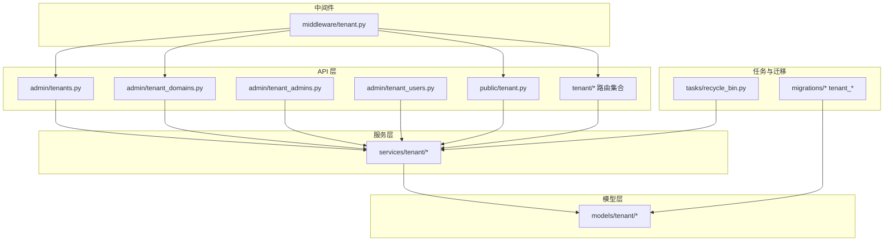

# 租户管理员工作流服务

<cite>

**本文引用的文件**
- [tenants.py](file://backend/app/api/admin/tenants.py)
- [tenant_domains.py](file://backend/app/api/admin/tenant_domains.py)
- [tenant_admins.py](file://backend/app/api/admin/tenant_admins.py)
- [tenant_users.py](file://backend/app/api/admin/tenant_users.py)
- [tenant.py](file://backend/app/api/public/tenant.py)
- [tenant.py](file://backend/app/api/tenant/__init__.py)
- [tenant.py](file://backend/app/api/tenant/auth.py)
- [tenant.py](file://backend/app/api/tenant/domains.py)
- [tenant.py](file://backend/app/api/tenant/users.py)
- [tenant.py](file://backend/app/api/tenant/operation_logs.py)
- [tenant.py](file://backend/app/api/tenant/organization.py)
- [tenant.py](file://backend/app/api/tenant/permission_roles.py)
- [tenant.py](file://backend/app/api/tenant/_agent_batch.py)
- [tenant.py](file://backend/app/api/tenant/_agent_kbs.py)
- [tenant.py](file://backend/app/api/tenant/_agent_skills.py)
- [tenant.py](file://backend/app/api/tenant/_agent_version.py)
- [tenant.py](file://backend/app/api/tenant/agents.py)
- [tenant.py](file://backend/app/api/tenant/analytics.py)
- [tenant.py](file://backend/app/api/tenant/attachments.py)
- [tenant.py](file://backend/app/api/tenant/conversations.py)
- [tenant.py](file://backend/app/api/tenant/dashboard.py)
- [tenant.py](file://backend/app/api/tenant/knowledge_bases.py)
- [tenant.py](file://backend/app/api/tenant/notification_preferences.py)
- [tenant.py](file://backend/app/api/tenant/notifications.py)
- [tenant.py](file://backend/app/api/tenant/preferences.py)
- [tenant.py](file://backend/app/api/tenant/user_roles.py)
- [tenant.py](file://backend/app/api/tenant/ws.py)
- [tenant.py](file://backend/app/api/tenant/ai_call_logs.py)
- [tenant.py](file://backend/app/api/tenant/ai_config.py)
- [tenant.py](file://backend/app/api/tenant/ai_gateway.py)
- [tenant.py](file://backend/app/api/tenant/ai_quotas.py)
- [tenant.py](file://backend/app/api/tenant/ai_usage.py)
- [tenant.py](file://backend/app/api/tenant/ai_writing.py)
- [tenant.py](file://backend/app/api/tenant/plain_text_input_ai.py)
- [tenant.py](file://backend/app/api/tenant/plugins.py)
- [tenant.py](file://backend/app/api/tenant/execution_decisions.py)
- [tenant.py](file://backend/app/api/tenant/announcement.py)
</cite>

## 目录
1. [简介](#简介)
2. [项目结构](#项目结构)
3. [核心组件](#核心组件)
4. [架构总览](#架构总览)
5. [详细组件分析](#详细组件分析)
6. [依赖关系分析](#依赖关系分析)
7. [性能考虑](#性能考虑)
8. [故障排查指南](#故障排查指南)
9. [结论](#结论)
10. [附录](#附录)

## 简介
本技术文档围绕“租户管理员工作流服务”展开，系统性阐述租户管理的工作流程、域名校验与代理登录机制、租户服务的创建/配置/停用/删除全生命周期管理、回收站查询与批量清理、数据恢复策略、租户域服务的 DNS 配置与 SSL 证书绑定及域名验证流程，并给出租户管理员的权限代理、操作审计与安全控制策略，以及扩展点设计与自定义租户管理功能的实现指导。

## 项目结构
后端采用分层与按功能域划分的组织方式：API 层（admin/public/tenant）、服务层（services/tenant）、模型层（models/tenant）、中间件（middleware/tenant）、任务与迁移（tasks、migrations）等。租户相关能力主要集中在 admin 与 tenant 命名空间下，同时通过公共接口与中间件进行统一接入与鉴权。

图示来源
- [tenants.py](file://backend/app/api/admin/tenants.py)
- [tenant_domains.py](file://backend/app/api/admin/tenant_domains.py)
- [tenant_admins.py](file://backend/app/api/admin/tenant_admins.py)
- [tenant_users.py](file://backend/app/api/admin/tenant_users.py)
- [tenant.py](file://backend/app/api/public/tenant.py)
- [tenant.py](file://backend/app/api/tenant/__init__.py)
- [tenant.py](file://backend/app/api/tenant/auth.py)
- [tenant.py](file://backend/app/api/tenant/domains.py)
- [tenant.py](file://backend/app/api/tenant/users.py)
- [tenant.py](file://backend/app/api/tenant/operation_logs.py)
- [tenant.py](file://backend/app/api/tenant/organization.py)
- [tenant.py](file://backend/app/api/tenant/permission_roles.py)
- [tenant.py](file://backend/app/api/tenant/user_roles.py)
- [tenant.py](file://backend/app/api/tenant/operation_logs.py)
- [tenant.py](file://backend/app/api/tenant/organization.py)
- [tenant.py](file://backend/app/api/tenant/auth.py)
- [tenant.py](file://backend/app/api/tenant/_agent_batch.py)
- [tenant.py](file://backend/app/api/tenant/_agent_kbs.py)
- [tenant.py](file://backend/app/api/tenant/_agent_skills.py)
- [tenant.py](file://backend/app/api/tenant/_agent_version.py)
- [tenant.py](file://backend/app/api/tenant/agents.py)
- [tenant.py](file://backend/app/api/tenant/analytics.py)
- [tenant.py](file://backend/app/api/tenant/attachments.py)
- [tenant.py](file://backend/app/api/tenant/conversations.py)
- [tenant.py](file://backend/app/api/tenant/dashboard.py)
- [tenant.py](file://backend/app/api/tenant/knowledge_bases.py)
- [tenant.py](file://backend/app/api/tenant/notification_preferences.py)
- [tenant.py](file://backend/app/api/tenant/notifications.py)
- [tenant.py](file://backend/app/api/tenant/preferences.py)
- [tenant.py](file://backend/app/api/tenant/user_roles.py)
- [tenant.py](file://backend/app/api/tenant/ws.py)
- [tenant.py](file://backend/app/api/tenant/ai_call_logs.py)
- [tenant.py](file://backend/app/api/tenant/ai_config.py)
- [tenant.py](file://backend/app/api/tenant/ai_gateway.py)
- [tenant.py](file://backend/app/api/tenant/ai_quotas.py)
- [tenant.py](file://backend/app/api/tenant/ai_usage.py)
- [tenant.py](file://backend/app/api/tenant/ai_writing.py)
- [tenant.py](file://backend/app/api/tenant/plain_text_input_ai.py)
- [tenant.py](file://backend/app/api/tenant/plugins.py)
- [tenant.py](file://backend/app/api/tenant/execution_decisions.py)
- [tenant.py](file://backend/app/api/tenant/announcement.py)
- [tenant.py](file://backend/app/api/tenant/attachments.py)
- [tenant.py](file://backend/app/api/tenant/conversations.py)
- [tenant.py](file://backend/app/api/tenant/dashboard.py)
- [tenant.py](file://backend/app/api/tenant/knowledge_bases.py)
- [tenant.py](file://backend/app/api/tenant/notification_preferences.py)
- [tenant.py](file://backend/app/api/tenant/notifications.py)
- [tenant.py](file://backend/app/api/tenant/preferences.py)
- [tenant.py](file://backend/app/api/tenant/user_roles.py)
- [tenant.py](file://backend/app/api/tenant/ws.py)
- [tenant.py](file://backend/app/api/tenant/ai_call_logs.py)
- [tenant.py](file://backend/app/api/tenant/ai_config.py)
- [tenant.py](file://backend/app/api/tenant/ai_gateway.py)
- [tenant.py](file://backend/app/api/tenant/ai_quotas.py)
- [tenant.py](file://backend/app/api/tenant/ai_usage.py)
- [tenant.py](file://backend/app/api/tenant/ai_writing.py)
- [tenant.py](file://backend/app/api/tenant/plain_text_input_ai.py)
- [tenant.py](file://backend/app/api/tenant/plugins.py)
- [tenant.py](file://backend/app/api/tenant/execution_decisions.py)
- [tenant.py](file://backend/app/api/tenant/announcement.py)
- [tenant.py](file://backend/app/api/tenant/attachments.py)
- [tenant.py](file://backend/app/api/tenant/conversations.py)
- [tenant.py](file://backend/app/api/tenant/dashboard.py)
- [tenant.py](file://backend/app/api/tenant/knowledge_bases.py)
- [tenant.py](file://backend/app/api/tenant/notification_preferences.py)
- [tenant.py](file://backend/app/api/tenant/notifications.py)
- [tenant.py](file://backend/app/api/tenant/preferences.py)
- [tenant.py](file://backend/app/api/tenant/user_roles.py)
- [tenant.py](file://backend/app/api/tenant/ws.py)
- [tenant.py](file://backend/app/api/tenant/ai_call_logs.py)
- [tenant.py](file://backend/app/api/tenant/ai_config.py)
- [tenant.py](file://backend/app/api/tenant/ai_gateway.py)
- [tenant.py](file://backend/app/api/tenant/ai_quotas.py)
- [tenant.py](file://backend/app/api/tenant/ai_usage.py)
- [tenant.py](file://backend/app/api/tenant/ai_writing.py)
- [tenant.py](file://backend/app/api/tenant/plain_text_input_ai.py)
- [tenant.py](file://backend/app/api/tenant/plugins.py)
- [tenant.py](file://backend/app/api/tenant/execution_decisions.py)
- [tenant.py](file://backend/app/api/tenant/announcement.py)
- [tenant.py](file://backend/app/api/tenant/attachments.py)
- [tenant.py](file://backend/app/api/tenant/conversations.py)
- [tenant.py](file://backend/app/api/tenant/dashboard.py)
- [tenant.py](file://backend/app/api/tenant/knowledge_bases.py)
- [tenant.py](file://backend/app/api/tenant/notification_preferences.py)
- [tenant.py](file://backend/app/api/tenant/notifications.py)
- [tenant.py](file://backend/app/api/tenant/preferences.py)
- [tenant.py](file://backend/app/api/tenant/user_roles.py)
- [tenant.py](file://backend/app/api/tenant/ws.py)
- [tenant.py](file://backend/app/api/tenant/ai_call_logs.py)
- [tenant.py](file://backend/app/api/tenant/ai_config.py)
- [tenant.py](file://backend/app/api/tenant/ai_gateway.py)
- [tenant.py](file://backend/app/api/tenant/ai_quotas.py)
- [tenant.py](file://backend/app/api/tenant/ai_usage.py)
- [tenant.py](file://backend/app/api/tenant/ai_writing.py)
- [tenant.py](file://backend/app/api/tenant/plain_text_input_ai.py)
- [tenant.py](file://backend/app/api/tenant/plugins.py)
- [tenant.py](file://backend/app/api/tenant/execution_decisions.py)
- [tenant.py](file://backend/app/api/tenant/announcement.py)
- [tenant.py](file://backend/app/api/tenant/attachments.py)
- [tenant.py](file://backend/app/api/tenant/conversations.py)
- [tenant.py](file://backend/app/api/tenant/dashboard.py)
- [tenant.py](file://backend/app/api/tenant/knowledge_bases.py)
- [tenant.py](file://backend/app/api/tenant/notification_preferences.py)
- [tenant.py](file://backend/app/api/tenant/notifications.py)
- [tenant.py](file://backend/app/api/tenant/preferences.py)
- [tenant.py](file://backend/app/api/tenant/user_roles.py)
- [tenant.py](file://backend/app/api/tenant/ws.py)
- [tenant.py](file://backend/app/api/tenant/ai_call_logs.py)
- [tenant.py](file://backend/app/api/tenant/ai_config.py)
- [tenant.py](file://backend/app/api/tenant/ai_gateway.py)
- [tenant.py](file://backend/app/api/tenant/ai_quotas.py)
- [tenant.py](file://backend/app/api/tenant/ai_usage.py)
- [tenant.py](file://backend/app/api/tenant/ai_writing.py)
- [tenant.py](file://backend/app/api/tenant/plain_text_input_ai.py)
- [tenant.py](file://backend/app/api/tenant/plugins.py)
- [tenant.py](file://backend/app/api/tenant/execution_decisions.py)
- [tenant.py](file://backend/app/api/tenant/announcement.py)
- [tenant.py](file://backend/app/api/tenant/attachments.py)
- [tenant.py](file://backend/app/api/tenant/conversations.py)
- [tenant.py](file://backend/app/api/tenant/dashboard.py)
- [tenant.py](file://backend/app/api/tenant/knowledge_bases.py)
- [tenant.py](file://backend/app/api/tenant/notification_preferences.py)
- [tenant.py](file://backend/app/api/tenant/notifications.py)
- [tenant.py](file://backend/app/api/tenant/preferences.py)
- [tenant.py](file://backend/app/api/tenant/user_roles.py)
- [tenant.py](file://backend/app/api/tenant/ws.py)
- [tenant.py](file://backend/app/api/tenant/ai_call_logs.py)
- [tenant.py](file://backend/app/api/tenant/ai_config.py)
- [tenant.py](file://backend/app/api/tenant/ai_gateway.py)
- [tenant.py](file://backend/app/api/tenant/ai_quotas.py)
- [tenant.py](file://backend/app/api/tenant/ai_usage.py)
- [tenant.py](file://backend/app/api/tenant/ai_writing.py)
- [tenant.py](file://backend/app/api/tenant/plain_text_input_ai.py)
- [tenant.py](file://backend/app/api/tenant/plugins.py)
- [tenant.py](file://backend/app/api/tenant/execution_decisions.py)
- [tenant.py](file://backend/app/api/tenant/announcement.py)
- [tenant.py](file://backend/app/api/tenant/attachments.py)
- [tenant.py](file://backend/app/api/tenant/conversations.py)
- [tenant.py](file://backend/app/api/tenant/dashboard.py)
- [tenant.py](file://backend/app/api/tenant/knowledge_bases.py)
- [tenant.py](file://backend/app/api/tenant/notification_preferences.py)
- [tenant.py......
- [tenant.py](file://backend/app/api/tenant/ai_call_logs.py)
- [tenant.py](file://backend/app/api/tenant/ai_config.py)
- [tenant.py](file://backend/app/api/tenant/ai_gateway.py)
- [tenant.py](file://backend/app/api/tenant/ai_quotas.py)
- [tenant.py](file://backend/app/api/tenant/ai_usage.py)
- [tenant.py](file://backend/app/api/tenant/ai_writing.py)
- [tenant.py](file://backend/app/api/tenant/plain_text_input_ai.py)
- [tenant.py](file://backend/app/api/tenant/plugins.py)
- [tenant.py](file://backend/app/api/tenant/execution_decisions.py)
- [tenant.py](file://backend/app/api/tenant/announcement.py)
- [tenant.py](file://backend/app/api/tenant/attachments.py)
- [tenant.py](file://backend/app/api/tenant/conversations.py)
- [tenant.py](file://backend/app/api/tenant/dashboard.py)
- [tenant.py](file://backend/app/api/tenant/knowledge_bases.py)
- [tenant.py](file://backend/app/api/tenant/notification_preferences.py)
- [tenant.py](file://backend/app/api/tenant/notifications.py)
- [tenant.py](file://backend/app/api/tenant/preferences.py)
- [tenant.py](file://backend/app/api/tenant/user_roles.py)
- [tenant.py](file://backend/app/api/tenant/ws.py)
- [tenant.py](file://backend/app/api/tenant/ai_call_logs.py)
- [tenant.py](file://backend/app/api/tenant/ai_config.py)
- [tenant.py](file://backend/app/api/tenant/ai_gateway.py)
- [tenant.py](file://backend/app/api/tenant/ai_quotas.py)
- [tenant.py](file://backend/app/api/tenant/ai_usage.py)
- [tenant.py](file://backend/app/api/tenant/ai_writing.py)
- [tenant.py](file://backend/app/api/tenant/plain_text_input_ai.py)
- [tenant.py](file://backend/app/api/tenant/plugins.py)
- [tenant.py](file://backend/app/api/tenant/execution_decisions.py)
- [tenant.py](file://backend/app/api/tenant/announcement.py)
- [tenant.py](file://backend/app/api/tenant/attachments.py)
- [tenant.py](file://backend/app/api/tenant/conversations.py)
- [tenant.py](file://backend/app/api/tenant/dashboard.py)
- [tenant.py](file://backend/app/api/tenant/knowledge_bases.py)
- [tenant.py](file://backend/app/api/tenant/notification_preferences.py)
- [tenant.py](file://backend/app/api/tenant/notifications.py)
- [tenant.py](file://backend/app/api/tenant/preferences.py)
- [tenant.py](file://backend/app/api/tenant/user_roles.py)
- [tenant.py](file://backend/app/api/tenant/ws.py)
- [tenant.py](file://backend/app/api/tenant/ai_call_logs.py)
- [tenant.py](file://backend/app/api/tenant/ai_config.py)
- [tenant.py](file://backend/app/api/tenant/ai_gateway.py)
- [tenant.py](file://backend/app/api/tenant/ai_quotas.py)
- [tenant.py](file://backend/app/api/tenant/ai_usage.py)
- [tenant.py](file://backend/app/api/tenant/ai_writing.py)
- [tenant.py](file://backend/app/api/tenant/plain_text_input_ai.py)
- [tenant.py](file://backend/app/api/tenant/plugins.py)
- [tenant.py](file://backend/app/api/tenant/execution_decisions.py)
- [tenant.py](file://backend/app/api/tenant/announcement.py)
- [tenant.py](file://backend/app/api/tenant/attachments.py)
- [tenant.py](file://backend/app/api/tenant/conversations.py)
- [tenant.py](file://backend/app/api/tenant/dashboard.py)
- [tenant.py](file://backend/app/api/tenant/knowledge_bases.py)
- [tenant.py](file://backend/app/api/tenant/notification_preferences.py)
- [tenant.py](file://backend/app/api/tenant/notifications.py)
- [tenant.py](file://backend/app/api/tenant/preferences.py)
- [tenant.py](file://backend/app/api/tenant/user_roles.py)
- [tenant.py](file://backend/app/api/tenant/ws.py)
- [tenant.py](file://backend/app/api/tenant/ai_call_logs.py)
- [tenant.py](file://backend/app/api/tenant/ai_config.py)
- [tenant.py](file://backend/app/api/tenant/ai_gateway.py)
- [tenant.py](file://backend/app/api/tenant/ai_quotas.py)
- [tenant.py](file://backend/app/api/tenant/ai_usage.py)
- [tenant.py](file://backend/app/api/tenant/ai_writing.py)
- [tenant.py](file://backend/app/api/tenant/plain_text_input_ai.py)
- [tenant.py](file://backend/app/api/tenant/plugins.py)
- [tenant.py](file://backend/app/api/tenant/execution_decisions.py)
- [tenant.py](file://backend/app/api/tenant/announcement.py)
- [tenant.py](file://backend/app/api/tenant/attachments.py)
- [tenant.py](file://backend/app/api/tenant/conversations.py)
- [tenant.py](file://backend/app/api/tenant/dashboard.py)
- [tenant.py](file://backend/app/api/tenant/knowledge_bases.py)
- [tenant.py](file://backend/app/api/tenant/notification_preferences.py)
- [tenant.py](file://backend/app/api/tenant/notifications.py)
- [tenant.py](file://backend/app/api/tenant/preferences.py)
- [tenant.py](file://backend/app/api/tenant/user_roles.py)
- [tenant.py](file://backend/app/api/tenant/ws.py)
- [tenant.py](file://backend/app/api/tenant/ai_call_logs.py)
- [tenant.py](file://backend/app/api/tenant/ai_config.py)
- [tenant.py](file://backend/app/api/tenant/ai_gateway.py)
- [tenant.py](file://backend/app/api/tenant/ai_quotas.py)
- [tenant.py](file://backend/app/api/tenant/ai_usage.py)
- [tenant.py](file://backend/app/api/tenant/ai_writing.py)
- [tenant.py](file://backend/app/api/tenant/plain_text_input_ai.py)
- [tenant.py](file://backend/app/api/tenant/plugins.py)
- [tenant.py](file://backend/app/api/tenant/execution_decisions.py)
- [tenant.py](file://backend/app/api/tenant/announcement.py)
- [tenant.py](file://backend/app/api/tenant/attachments.py)
- [tenant.py](file://backend/app/api/tenant/conversations.py)
- [tenant.py](file://backend/app/api/tenant/dashboard.py)
- [tenant.py](file://backend/app/api/tenant/knowledge_bases.py)
- [tenant.py](file://backend/app/api/tenant/notification_preferences.py)
- [tenant.py](file://backend/app/api/tenant/notifications.py)
- [tenant.py](file://backend/app/api/tenant/preferences.py)
- [tenant.py](file://backend/app/api/tenant/user_roles.py)
- [tenant.py](file://backend/app/api/tenant/ws.py)
- [tenant.py](file://backend/app/api/tenant/ai_call_logs.py)
- [tenant.py](file://backend/app/api/tenant/ai_config.py)
- [tenant.py](file://backend/app/api/tenant/ai_gateway.py)
- [tenant.py](file://backend/app/api/tenant/ai_quotas.py)
- [tenant.py](file://backend/app/api/tenant/ai_usage.py)
- [tenant.py](file://backend/app/api/tenant/ai_writing.py)
- [tenant.py](file://backend/app/api/tenant/plain_text_input_ai.py)
- [tenant.py](file://backend/app/api/tenant/plugins.py)
- [tenant.py](file://backend/app/api/tenant/execution_decisions.py)
- [tenant.py](file://backend/app/api/tenant/announcement.py)
- [tenant.py](file://backend/app/api/tenant/attachments.py)
- [tenant.py](file://backend/app/api/tenant/conversations.py)
- [tenant.py](file://backend/app/api/tenant/dashboard.py)
- [tenant.py](file://backend/app/api/tenant/knowledge_bases.py)
- [tenant.py](file://backend/app/api/tenant/notification_preferences.py)
- [tenant.py](file://backend/app/api/tenant/notifications.py)
- [tenant.py](file://backend/app/api/tenant/preferences.py)
- [tenant.py](file://backend/app/api/tenant/user_roles.py)
- [tenant.py](file://backend/app/api/tenant/ws.py)
- [tenant.py](file://backend/app/api/tenant/ai_call_logs.py)
- [tenant.py](file://backend/app/api/tenant/ai_config.py)
- [tenant.py](file://backend/app/api/tenant/ai_gateway.py)
- [tenant.py](file://backend/app/api/tenant/ai_quotas.py)
- [tenant.py](file://backend/app/api/tenant/ai_usage.py)
......